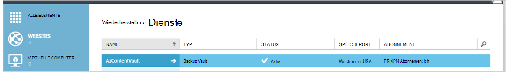
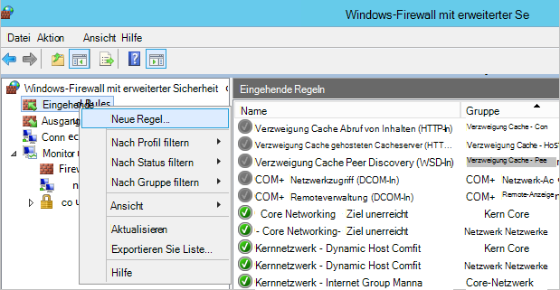

<properties
    pageTitle="Vorbereiten der Umgebung sichern Azure virtuelle Computer | Microsoft Azure"
    description="Stellen Sie sicher, dass Ihre Umgebung Sichern virtueller Computer in Azure vorbereitet"
    services="backup"
    documentationCenter=""
    authors="markgalioto"
    manager="cfreeman"
    editor=""
    keywords="Sicherung; Sichern;"/>

<tags
    ms.service="backup"
    ms.workload="storage-backup-recovery"
    ms.tgt_pltfrm="na"
    ms.devlang="na"
    ms.topic="article"
    ms.date="08/26/2016"
    ms.author="trinadhk; jimpark; markgal;"/>


# <a name="prepare-your-environment-to-back-up-azure-virtual-machines"></a>Bereiten Sie Ihrer Umgebung Azure virtuelle Computer sichern vor

> [AZURE.SELECTOR]
- [Ressourcen-Manager-Modell](backup-azure-arm-vms-prepare.md)
- [Klassisch](backup-azure-vms-prepare.md)

Vor dem Sichern einer Azure Virtual Machine (VM) sind drei Zustände vorhanden sein müssen.

- Sie müssen ein backup Depot erstellen oder identifizieren Sie ein backup Vault-vorhandene *im Bereich der VM*.
- Netzwerkkonnektivität zwischen Azure öffentlichen Internetadressen und die Endpunkte des Azure-Speicher herstellen.
- Der VM-Agent auf dem virtuellen Computer installiert.

Wenn Sie wissen, dass dies in Ihrer Umgebung vorhanden anschließend [Ihre VMs Artikel zurück](backup-azure-vms.md). Andernfalls führt lesen, dieser Artikel Sie durch die Schritte zum Vorbereiten Ihrer Umgebung eine Azure VM sichern.


## <a name="limitations-when-backing-up-and-restoring-a-vm"></a>Nachteile beim Sichern und Wiederherstellen einer VM

>[AZURE.NOTE] Azure hat zwei Bereitstellungsmodelle für erstellen und Verwenden von Ressourcen: [Ressourcen-Manager und Classic](../resource-manager-deployment-model.md). Die folgende Liste enthält die Grenzen beim klassischen Modell bereitstellen.

- Sichern virtueller Computer mit mehr als 16 Datenträger wird nicht unterstützt.
- Sichern virtueller Computer mit einer reservierten IP-Adresse und keine definierten Endpunkt wird nicht unterstützt.
- Backup-Daten enthalten nicht bereitgestellten Netzwerklaufwerke an VM. 
- Ersetzen von vorhandenen virtuellen Computer während der Wiederherstellung wird nicht unterstützt. Vorhandenen virtuellen Computer und alle zugeordneten Laufwerke zuerst löschen und dann die Daten aus einer Sicherung wiederherstellen.
- Cross-Region Sicherung und Wiederherstellung wird nicht unterstützt.
- Sichern virtueller Computer unter Verwendung von Azure Backup wird in allen öffentlichen Bereichen des Azure unterstützt (siehe [Prüfliste](https://azure.microsoft.com/regions/#services) der unterstützten Regionen). Wenn die gewünschte Region heute nicht unterstützt wird, erscheint es nicht in der Dropdown-Liste im Depot erstellen.
- Sichern virtueller Computer unter Verwendung von Azure Backup ist nur für ausgewählte Betriebssysteme unterstützt:
  - **Linux**: Azure Backup [eine Liste der Distributionen, die von Azure unterstützt,](../virtual-machines/virtual-machines-linux-endorsed-distros.md) Core Betriebssystem Linux unterstützt. Andere in-Your-eigenen-Linux-Distributionen können solange der VM-Agent auf dem virtuellen Computer verfügbar ist auch Unterstützung für Python vorhanden ist.
  - **Windows Server**: Windows Server 2008 R2-Versionen werden nicht unterstützt.
- Wiederherstellen eines Domänencontrollers (DC)-VM, die Teil einer Multi-DC-Konfiguration ist nur durch PowerShell unterstützt. Weitere Informationen zur [Wiederherstellung eines Domänencontrollers Multi-DC](backup-azure-restore-vms.md#restoring-domain-controller-vms).
- Wiederherstellen von virtuellen Computern, die die folgenden speziellen Konfigurationen über PowerShell unterstützt. Erstellen der wiederherstellen-Workflow in der Benutzeroberfläche mit VMs dieser Konfigurationen keinen nachdem der Wiederherstellungsvorgang abgeschlossen ist. Informationen finden Sie unter [Wiederherstellen virtueller Computer mit speziellen Konfigurationen](backup-azure-restore-vms.md#restoring-vms-with-special-netwrok-configurations).
    - Virtuelle Maschinen unter Load Balancer-Konfiguration (intern und extern)
    - Virtuelle Maschinen mit mehreren reservierte IP-Adressen
    - Virtuelle Computer mit mehreren Netzwerkkarten

## <a name="create-a-backup-vault-for-a-vm"></a>Ein backup Depot für einen virtuellen Computer erstellen

Ein backup Vault ist eine Entität, die speichert alle Backup- und Recovery-Punkte, die mit der Zeit erstellt wurden. Backup Depot enthält auch backup-Policies, die den zu sichernden virtuellen Maschinen angewendet werden.

Diese Abbildung zeigt die Beziehung zwischen den verschiedenen Azure Backup:     

So erstellen Sie ein backup Depot

1. Mit der [Azure-Portal](http://manage.windowsazure.com/)anmelden.

2. Klicken Sie im Azure-Portal **neu** > **Hybride Integration** > **Sicherung**. Beim Anklicken von **Backup**wechseln Sie automatisch zum Verwaltungsportal (nach der Notiz angezeigt).

    

    >[AZURE.NOTE] Wenn Ihr Abonnement im klassischen Portal zuletzt verwendet wurde, kann Ihr Abonnement im klassischen Portal öffnen. Klicken Sie in diesem Fall erstellen Sie ein backup Depot auf **neu** > **Data Services** > **Recovery Services** > **Sicherungstresor** > **Schnell erstellen** (siehe unten).

    

3. **Name**Geben Sie einen Anzeigenamen zu Tresor. Der Name muss eindeutig für den Azure-Abonnement. Geben Sie einen Namen ein, der zwischen 2 und 50 Zeichen enthält. Sie müssen mit einem Buchstaben beginnen und darf nur Buchstaben, Zahlen und Bindestriche.

4. Wählen Sie im **Bereich**geografische Region für das Depot. Das Depot muss im Bereich der virtuellen Computer, die Sie schützen möchten. Wenn Sie virtuelle Computer in mehreren Regionen verfügen, müssen Sie backup Depot in jeder Region erstellen. Es ist Speicherkonten zum Speichern von backup-Daten - backup Depot und Azure Backup Service Handle automatisch angegeben.

5. Wählen Sie im **Abonnement** Abonnement backup Vault zuordnen möchten. Es werden mehrere Optionen nur wenn Konto Ihrer Organisation mehrere Azure-Abonnements zugeordnet ist.

6. Klicken Sie auf **Vault**. Es dauert eine Weile backup Depot erstellt werden. Überwachen Sie Status Notifications am unteren Rand des Portals.

    

7. Eine Meldung bestätigt, dass das Depot erstellt wurde. Es wird als **aktiv**auf der **Recovery-** Seite aufgeführt. Vergewissern Sie sich entsprechenden Redundanz Optionsrechts auswählen, nachdem das Depot erstellt wurde. Weitere Informationen über [die Speicheroption Redundanz im backup-Tresor festlegen](backup-configure-vault.md#azure-backup---storage-redundancy-options).

    

8. Klicken Sie auf backup Tresor zu Seite **Quick Start** , eine Anleitung zum Sichern von Azure virtuelle Computer angezeigt.

    


## <a name="network-connectivity"></a>Netzwerkkonnektivität

Verwaltung von VM-Snapshots benötigt backup Erweiterung Konnektivität Azure öffentlicher IP-Adressen. Ohne die richtige Internet-Konnektivität des virtuellen Computers HTTP-Anforderungen Zeit und der Sicherungsvorgang fehlschlägt. Wenn die Bereitstellung uneingeschränkt (über ein Netzwerksicherheitsgruppe (NSG) beispielsweise) verfügt, wählen Sie eine der folgenden Optionen zum Bereitstellen einer klaren für backup-Datenverkehr:

- [Weiße Liste der Azure-Rechenzentrum IP Bereiche](http://www.microsoft.com/en-us/download/details.aspx?id=41653) - Siehe Hinweise auf der weißen Liste wie die IP-Adressen.
- Bereitstellen Sie einen Proxyserver HTTP-Datenverkehr.

Bei der Option sind Kompromisse zwischen Verwaltung, Kontrolle und Kosten.

|Option|Vorteile|Nachteile|
|------|----------|-------------|
|Whitelist IP-Bereiche| Keine zusätzlichen Kosten.<br><br>Zum Öffnen von Access in eine NSG, verwenden Sie das Cmdlet " <i>Set-AzureNetworkSecurityRule</i> ". | Komplexer als die betroffenen verwalten ändern IP-Bereiche.<br><br>Bietet Zugriff auf die gesamte Azure und nicht nur Speicher.|
|HTTP-proxy| Granulare Steuerung im Proxy Speicher URLs zulässig.<br>Einzelner Punkt der Internetzugriff auf VMs.<br>Keine Änderungen Azure-IP-Adresse.| Zusätzliche Kosten für eine VM mit Proxy-Software.|

### <a name="whitelist-the-azure-datacenter-ip-ranges"></a>Weiße Liste der Azure-Rechenzentrum IP-Bereiche

Whitelist Azure-Rechenzentrum IP-Bereiche finden Sie in der [Azure-Website](http://www.microsoft.com/en-us/download/details.aspx?id=41653) Weitere Informationen IP-Adressbereiche und Informationen.

### <a name="using-an-http-proxy-for-vm-backups"></a>Verwenden einen HTTP-Proxy für VM-backups
Beim Sichern einer VM sendet backup Erweiterung des virtuellen Computers Verwaltungsbefehle Snapshot Azure-Speicher unter Verwendung einer HTTPS-API. Datenverkehr der backup-Erweiterung über den HTTP-Proxy ist die einzige Komponente, die für den Zugriff auf das Internet konfiguriert.

>[AZURE.NOTE] Gibt es keine Empfehlung für die Proxysoftware, die verwendet werden soll. Sicher, dass Sie einen Proxy, der mit folgenden Konfigurationsschritte.

Beispielabbildung zeigt die drei Schritte einen HTTP-Proxy verwenden:

- VM App leitet alle HTTP-Datenverkehr an das öffentliche Internet über Proxy VM.
- Proxy-VM lässt eingehenden Datenverkehr von VMs in das virtuelle Netzwerk.
- Die Network Security Gruppe (NSG) namens NSF Lockdown benötigt eine Sicherheit ermöglicht ausgehende Internet Datenverkehr von Proxy-VM.


Gehen Sie folgendermaßen vor, um einen HTTP-Proxy zur Kommunikation mit dem öffentlichen Internet zu verwenden:

#### <a name="step-1-configure-outgoing-network-connections"></a>Schritt 1. Ausgehend-Netzwerk konfigurieren
###### <a name="for-windows-machines"></a>Für Windows-Computer
Dies wird Proxyserverkonfiguration für lokales Systemkonto einrichten.

1. [PsExec](https://technet.microsoft.com/sysinternals/bb897553) herunterladen
2. Führen Sie folgenden Befehl aus erweiterten,

     ```
     psexec -i -s "c:\Program Files\Internet Explorer\iexplore.exe"
     ```
     Internet Explorer-Fenster wird geöffnet.
3. Extras -> Optionen -> Connections-LAN Settings >.
4. Überprüfen Sie die Proxyeinstellungen für das Systemkonto. Proxy-IP und-Port festgelegt.
5. Schließen Sie InternetExplorer.

Diese Computer Proxy-Konfiguration eingerichtet wird und für ausgehende HTTP/HTTPS-Datenverkehr verwendet werden.

Haben Sie Setup einen Proxy-Server für einen aktuellen Benutzer (kein lokales Systemkonto), verwenden Sie das folgende Skript SYSTEMACCOUNT anzuwenden:

```
   $obj = Get-ItemProperty -Path Registry::”HKEY_CURRENT_USER\Software\Microsoft\Windows\CurrentVersion\Internet Settings\Connections"
   Set-ItemProperty -Path Registry::”HKEY_USERS\S-1-5-18\Software\Microsoft\Windows\CurrentVersion\Internet Settings\Connections" -Name DefaultConnectionSettings -Value $obj.DefaultConnectionSettings
   Set-ItemProperty -Path Registry::”HKEY_USERS\S-1-5-18\Software\Microsoft\Windows\CurrentVersion\Internet Settings\Connections" -Name SavedLegacySettings -Value $obj.SavedLegacySettings
   $obj = Get-ItemProperty -Path Registry::”HKEY_CURRENT_USER\Software\Microsoft\Windows\CurrentVersion\Internet Settings"
   Set-ItemProperty -Path Registry::”HKEY_USERS\S-1-5-18\Software\Microsoft\Windows\CurrentVersion\Internet Settings" -Name ProxyEnable -Value $obj.ProxyEnable
   Set-ItemProperty -Path Registry::”HKEY_USERS\S-1-5-18\Software\Microsoft\Windows\CurrentVersion\Internet Settings" -Name Proxyserver -Value $obj.Proxyserver
```

>[AZURE.NOTE] Wenn "(407) Proxyauthentifizierung ist erforderlich" im Proxy Server-Protokoll beobachten überprüfen Sie Ihre Authrntication richtig eingerichtet ist.

######<a name="for-linux-machines"></a>Für Linux-Maschinen

Fügen Sie folgende Zeile in die ```/etc/environment``` Datei:

```
http_proxy=http://<proxy IP>:<proxy port>
```

Fügen Sie die folgenden Zeilen der ```/etc/waagent.conf``` Datei:

```
HttpProxy.Host=<proxy IP>
HttpProxy.Port=<proxy port>
```

#### <a name="step-2-allow-incoming-connections-on-the-proxy-server"></a>Schritt 2. Eingehende Verbindung auf dem Proxyserver zulassen:

1. Öffnen Sie Windows-Firewall auf dem Proxyserver. Am einfachsten auf die Firewall ist für Windows-Firewall mit erweiterter Sicherheit suchen.

    

2. Im Dialogfeld Windows-Firewall **Eingehende Regeln** Maustaste, und klicken Sie auf **Neue Regel...**.

    

3. Wählen Sie im **Assistenten für neue eingehende Regel**für den **Typ** die Option **Benutzerdefiniert aus** und auf **Weiter**.

4. Wählen Sie auf der Seite das **Programm**aus **Alle Programme** und klicken Sie auf **Weiter**.

5. Geben Sie auf der Seite **Protokolle und Ports** Folgendes ein, und klicken Sie auf **Weiter**:

    

    - Wählen Sie für *Protokolltyp* *TCP*
    - *Lokaler Port* wählen Sie *Bestimmte Anschlüsse*, geben Sie im Feld der ```<Proxy Port>``` konfiguriert wurde.
    - Wählen Sie *Alle Ports* für *Remote-port*

    Klicken Sie für den Rest des Assistenten auf bis zum Ende, und nennen Sie diese Regel.

#### <a name="step-3-add-an-exception-rule-to-the-nsg"></a>Schritt 3. Die NSG Ausnahmeregel hinzufügen:

Geben Sie in einer Azure PowerShell-Befehlszeile den folgenden Befehl ein:

Der folgende Befehl hinzugefügt die NSG Ausnahme. Diese Ausnahme ermöglicht TCP-Datenverkehr von jedem Port 10.0.0.5 Internet-Adresse auf Port 80 (HTTP) oder 443 (HTTPS). Benötigen Sie einen bestimmten Port in das öffentliche Internet unbedingt diesen Port der ```-DestinationPortRange``` sowie.

```
Get-AzureNetworkSecurityGroup -Name "NSG-lockdown" |
Set-AzureNetworkSecurityRule -Name "allow-proxy " -Action Allow -Protocol TCP -Type Outbound -Priority 200 -SourceAddressPrefix "10.0.0.5/32" -SourcePortRange "*" -DestinationAddressPrefix Internet -DestinationPortRange "80-443"
```

*Sicherstellen Sie, dass die Details der Bereitstellung sollten die Namen im Beispiel ersetzen.*


## <a name="vm-agent"></a>VM-agent

Azure Virtual Machine sichern zu können, sollten Sie sicherstellen, dass Azure VM-Agent auf dem virtuellen Computer ordnungsgemäß installiert ist. Da VM-Agent eine optionale Komponente zur Zeit, die den virtuellen Computer erstellt wird ist, sicherstellen Sie, dass das Kontrollkästchen für den VM-Agent aktiviert ist, bevor der virtuelle Computer bereitgestellt wird.

### <a name="manual-installation-and-update"></a>Manuelle Installation und Aktualisierung

VM-Agent ist bereits vorhanden in VMs aus dem Azure-Katalog erstellt werden. Virtuelle Computer, die von lokalen Rechenzentren migriert werden müssen, nicht den VM-Agent installiert. VM-Agent muss für diese VMs explizit installiert werden. Weitere Informationen zur [Installation des Agenten VM auf einen vorhandenen virtuellen Computer](http://blogs.msdn.com/b/mast/archive/2014/04/08/install-the-vm-agent-on-an-existing-azure-vm.aspx).

| **Vorgang** | **Windows** | **Linux** |
| --- | --- | --- |
| Installieren Sie den Agent VM | <li>Downloaden Sie und installieren Sie den [Agent MSI](http://go.microsoft.com/fwlink/?LinkID=394789&clcid=0x409). Sie benötigen Administratorrechte, um die Installation abzuschließen. <li>[Aktualisieren Sie die VM-Eigenschaft](http://blogs.msdn.com/b/mast/archive/2014/04/08/install-the-vm-agent-on-an-existing-azure-vm.aspx) an, dass der Agent installiert ist. | <li> Installieren Sie den neuesten [Linux-Agent](https://github.com/Azure/WALinuxAgent) von GitHub. Sie benötigen Administratorrechte, um die Installation abzuschließen. <li> [Aktualisieren Sie die VM-Eigenschaft](http://blogs.msdn.com/b/mast/archive/2014/04/08/install-the-vm-agent-on-an-existing-azure-vm.aspx) an, dass der Agent installiert ist. |
| VM-Agent aktualisieren | Aktualisieren des VM-Agents ist so einfach wie die [VM-Agent Binärdateien](http://go.microsoft.com/fwlink/?LinkID=394789&clcid=0x409)installieren. <br><br>Stellen Sie sicher, dass kein Sicherungsvorgang ausgeführt wird, während der VM-Agent aktualisiert wird. | Gehen Sie [den Linux VM-Agent aktualisieren ](../virtual-machines-linux-update-agent.md). <br><br>Stellen Sie sicher, dass kein Sicherungsvorgang ausgeführt wird, während der VM-Agent aktualisiert wird. |
| Die VM-Agenteninstallation überprüfen | <li>Navigieren Sie zum Ordner *C:\WindowsAzure\Packages* in Azure VM. <li>Finden Sie die Datei WaAppAgent.exe.<li> Maustaste auf die Datei, **Eigenschaften Sie**und wählen Sie die Registerkarte **Details** . Das Feld Produktversion sollte 2.6.1198.718 oder höher. | N/A |


Informationen Sie zu [VM-Agent](https://go.microsoft.com/fwLink/?LinkID=390493&clcid=0x409) und [die Installation](https://azure.microsoft.com/blog/2014/04/15/vm-agent-and-extensions-part-2/).

### <a name="backup-extension"></a>Backup-Erweiterung

Um den virtuellen Computer sichern, installiert der Azure-Sicherungsdienst Erweiterung VM-Agent. Der Azure-Sicherungsdienst nahtlos upgrades und patches backup Erweiterung ohne weiteren Benutzereingriff.

Backup-Erweiterung wird installiert, wenn die VM ausgeführt wird. Ein ausgeführten virtuellen Computer bietet auch die größte Chance anwendungskonsistente Recovery-Punkt. Azure Backup Service die VM - weiterhin wird auch wenn ausgeschaltet und die Erweiterung nicht installiert (aka Offline VM). In diesem Fall werden der Wiederherstellungspunkt *absturzkonsistent* , wie oben beschrieben.


## <a name="questions"></a>Haben Sie Fragen?
Wenn Sie Fragen haben oder gibt es Funktion enthalten, angezeigt werden soll [uns Feedback senden](http://aka.ms/azurebackup_feedback).

## <a name="next-steps"></a>Nächste Schritte
Damit Sie Ihrer Umgebung zum Sichern Ihrer VM vorbereitet haben, ist der nächste logische Schritt ein Backup erstellen. Planung Artikel enthält ausführlichere Informationen Sichern virtueller Computer.

- [Sichern von virtuellen Maschinen](backup-azure-vms.md)
- [Planen Sie die VM-backup-Infrastruktur](backup-azure-vms-introduction.md)
- [Verwalten von Backups virtueller Maschinen](backup-azure-manage-vms.md)
