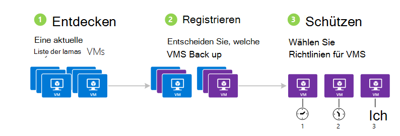
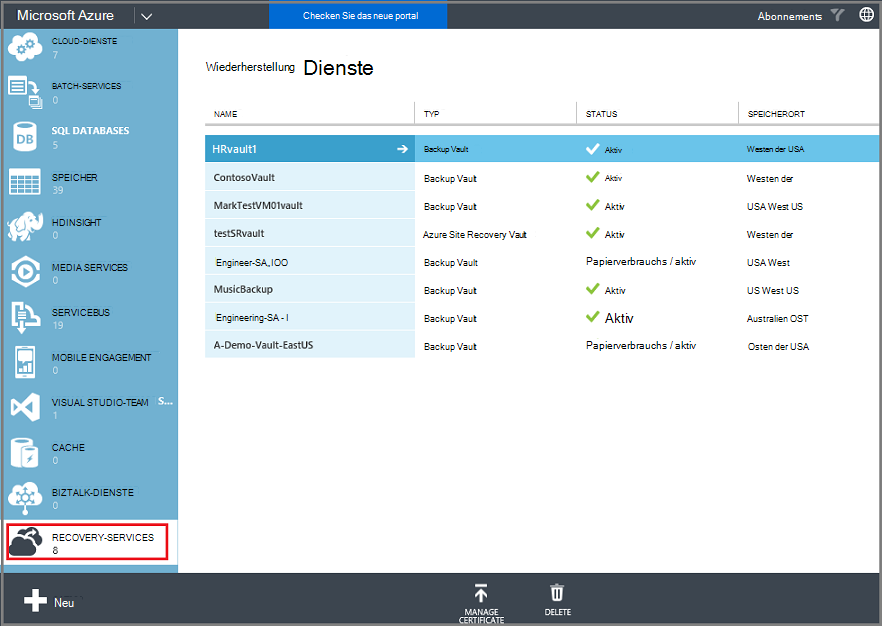
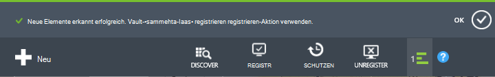
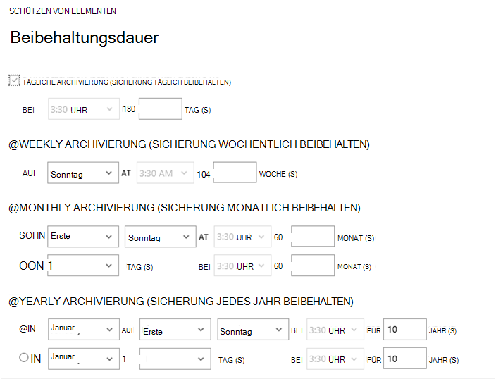
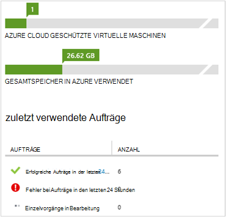

<properties
    pageTitle="Sichern Sie Azure virtuelle Computer | Microsoft Azure"
    description="Ermitteln Sie, registrieren Sie, und Sichern Sie die virtuellen Computer mit diesen Verfahren für die Sicherung von Azure Virtual Machine."
    services="backup"
    documentationCenter=""
    authors="markgalioto"
    manager="jwhit"
    editor=""
    keywords="Backups virtueller Maschinen; Sichern Sie die virtuellen Computer. Backup- und Disaster Recovery; VM-Sicherung"/>

<tags
    ms.service="backup"
    ms.workload="storage-backup-recovery"
    ms.tgt_pltfrm="na"
    ms.devlang="na"
    ms.topic="article"
    ms.date="09/28/2016"
    ms.author="trinadhk; jimpark; markgal;"/>

# Azure virtuelle Computer sichern

> [AZURE.SELECTOR]
- [Sichern von VMs Recovery Services vault](backup-azure-arm-vms.md)
- [Sichern von VMs Backup vault](backup-azure-vms.md)

Dieser Artikel enthält die Verfahren zum Sichern einer klassischen bereitgestellt Azure Virtual Machine (VM) in ein Depot Backup. Es gibt einige Aufgaben zu erledigen um Azure Virtual Machine sichern zu können. Wenn Sie dies nicht bereits getan haben führen Sie [erforderliche Komponenten](backup-azure-vms-prepare.md) zum Vorbereiten Ihrer Umgebung zum Sichern Ihrer virtuellen Computer.

Weitere Informationen finden Sie in den Artikeln [Planen der VM-backup-Infrastruktur in Azure](backup-azure-vms-introduction.md) und [Azure virtuelle Computer](https://azure.microsoft.com/documentation/services/virtual-machines/).

>[AZURE.NOTE] Azure hat zwei Bereitstellungsmodelle für erstellen und Verwenden von Ressourcen: [Ressourcen-Manager und Classic](../resource-manager-deployment-model.md). Ein Depot Sicherung kann nur VMs Classic bereitgestellt schützen. Ressourcen-Manager bereitgestellte VMs mit einem Backup kann nicht geschützt werden. Informationen zum Arbeiten mit Recovery Services finden Sie unter [VMs Recovery Services Tresor sichern](backup-azure-arm-vms.md) .

Sicherung von Azure virtuellen Computern umfasst drei Hauptschritte:

>[AZURE.NOTE] Sichern virtueller Computer ist ein lokaler Prozess. Sie können nicht backup Tresor in anderen virtuellen Computern in einer Region sichern. Müssen Sie ein backup Depot in jeder Region Azure erstellen gibt VMs gesichert werden.

## Schritt 1 - Azure virtuelle Computer ermitteln
Um sicherzustellen, dass alle Abonnements hinzugefügt neuer virtuelle Maschinen (VMs) vor der Registrierung gekennzeichnet sind, führen Sie den Erkennungsprozess. Prozess Abfragen Azure für die Liste der virtuellen Computer im Abonnement sowie zusätzliche Informationen wie den Namen Cloud und der Region.

1. [Classic-Portal](http://manage.windowsazure.com/) anmelden

2. Klicken Sie in der Liste der Azure-Dienste auf **Recovery Services** Backup und Site Recovery +++ Liste öffnen.
    

3. Wählen Sie in der Liste der Sicherung Depots Depot Sichern einer VM aus

    Wenn ein neues Depot wird das Portal auf der Seite **Schnellstart** .

    

    Das Depot zuvor konfiguriert, wird das Portal zuletzt verwendete Menü geöffnet.

4. Klicken Sie im Depot (am oberen Rand der Seite) auf **Elemente registriert**.

    

5. Wählen Sie im Menü **Typ** **Azure Virtual Machine**.

    

6. Klicken Sie auf **DISCOVER** am unteren Rand der Seite.
    

    Der Erkennungsvorgang kann einige Minuten dauern virtuelle Computer aufgelistet sind. Es ist eine Benachrichtigung am unteren Bildschirmrand, die Sie informiert, dass der Prozess ausgeführt wird.

    

    Benachrichtigung geändert wird, wenn der Prozess abgeschlossen. Der Erkennungsprozess die virtuellen Computer nicht finden, zunächst sichergestellt, dass die virtuellen Computer vorhanden sind. Existiert die VMs sorgen Sie die VMs in derselben Region als backup-Depot. Wenn VMs vorhanden sind und in derselben Region, sicherstellen Sie, dass die VMs auf backup Depot noch nicht registriert sind. Ein virtueller Computer ein backup Depot zugewiesen ist nicht verfügbar, andere backup Depots zugewiesen werden soll.

    

    Wenn Sie neue Elemente gefunden haben, fahren Sie mit Schritt2, und registrieren Sie Ihre VMs.

##  Schritt 2: Register Azure virtuelle Computer
Sie registrieren einen Azure virtuellen Computer Azure Backup Service zugeordnet. Dies ist normalerweise eine einmalige Angelegenheit.

1. Backup Depot unter **Recovery Services** im Azure-Portal navigieren Sie, und klicken Sie anschließend auf **Registriert**.

2. Wählen Sie im Dropdown-Menü **Azure Virtual Machine** .

    

3. Klicken Sie unten auf der Seite **Registrieren** .
    

4. Wählen Sie im Kontextmenü **Elemente registrieren** der virtuellen Computer, die Sie registrieren möchten. Verwenden Sie zwei oder mehrere virtuelle Computer mit demselben Namen vorhanden sind, den Cloud-Dienst unterscheiden.

    >[AZURE.TIP] Mehrere virtuelle Maschinen können gleichzeitig registriert werden.

    Ein Auftrag wird für jeden virtuellen Computer erstellt, die Sie ausgewählt haben.

5. Klicken Sie in der Benachrichtigung der Seite **Projekte** zu **Auftrag anzeigen** .

    

    Der virtuelle Computer wird auch in der Liste der registrierten Objekte zusammen mit dem Status des Vorgangs Registrierung.

    

    Wenn der Vorgang abgeschlossen ist, ändert sich der *registrierte* Status widerspiegelt.

    

## Schritt 3: Azure virtuelle Computer schützen
Jetzt können Sie eine Richtlinie für Backup und Archivierung für den virtuellen Computer einrichten. Mehrere virtuelle Maschinen können mit einem geschützt Aktion zu schützen.

Azure Backup Depots nach Mai 2015 Lieferumfang erstellt das Depot eine Standardrichtlinie integriert. Diese Standardrichtlinie wird mit einem Standardwert von 30 Tagen und einen Sicherungszeitplan einmal täglich.

1. Backup Depot unter **Recovery Services** im Azure-Portal navigieren Sie, und klicken Sie anschließend auf **Registriert**.
2. Wählen Sie im Dropdown-Menü **Azure Virtual Machine** .

    

3. Klicken Sie auf **Schutz** am unteren Rand der Seite.

    **Elemente schützen-Assistent** wird angezeigt. Der Assistent Listet nur virtuelle Computer, die registriert sind und nicht geschützt. Wählen Sie die virtuellen Computer, die Sie schützen möchten.

    Verwenden Sie zwei oder mehrere virtuelle Computer mit demselben Namen vorhanden sind, Cloud-Dienst die virtuellen Computer unterscheiden.

    >[AZURE.TIP] Sie können mehrere virtuelle Computer gleichzeitig zu schützen.

    

4. Wählen Sie einen **Sicherungszeitplan** virtuellen Computer sichern, die Sie ausgewählt haben. Wählen Sie aus einem vorhandenen Satz von Richtlinien oder eine neue definieren.

    Jede backup-Richtlinie können mehrere virtuelle Computer zugeordnet. Jedoch kann der virtuelle Computer nur eine Richtlinie jederzeit Zeit zugeordnet.

    

    >[AZURE.NOTE] Backup-Richtlinie umfasst eine Aufbewahrung für geplante Backups. Bei Auswahl eine vorhandene backup-Richtlinie kann keine Aufbewahrungsoptionen im nächsten Schritt ändern.

5. Wählen Sie eine **Beibehaltungsdauer** der Backups zugeordnet.

    

    Aufbewahrungsrichtlinie gibt die Zeitspanne für das Speichern einer Sicherung. Sie können unterschiedliche Aufbewahrungsrichtlinien basierend darauf, wann die Sicherung ausgeführt wird. Beispielsweise könnte ein Sicherungspunkt täglich (dient als betriebliche Recovery Point) 90 Tage beibehalten. Dagegen müssen einen Sicherungspunkt am Ende jedes Quartals (für Prüfzwecke) viele Monate oder Jahre beibehalten werden.

    

    In diesem Beispielbild:

    - **Tägliche Aufbewahrungsrichtlinie**: tägliche Sicherungen für 30 Tage gespeichert.
    - **Wöchentliche Aufbewahrungsrichtlinie**: Backups jede Woche am Sonntag 104 Wochen erhalten.
    - **Monatliche Aufbewahrungsrichtlinie**: Sicherungen am letzten Sonntag jedes Monats für 120 Monate beibehalten werden.
    - **Jährliche Aufbewahrungsrichtlinie**: Sicherungen am ersten Sonntag im Januar 99 Jahren beibehalten.

    Ein Auftrag wird erstellt, um die Schutzrichtlinie konfigurieren und Zuordnen der virtuellen Computer die Richtlinie für jeden virtuellen Computer, die Sie ausgewählt haben.

6. Zum Anzeigen der Liste **Konfigurieren** Schutzaufträge, Menü Depots auf **Aufträge** und wählen Sie **Schutz konfigurieren** aus dem **Vorgang** Filter aus.

    

## Erste backup
Wenn der virtuelle Computer mit geschützt ist, wird es Registerkarte **Geschützte Elemente** mit *Protected - (ausstehende anfänglichen Backup)*. Standardmäßig ist die erste geplante Sicherung der *ersten Sicherung*.

Trigger der ersten Sicherung unmittelbar nach dem Konfigurieren des Schutzes:

1. Klicken Sie am unteren Rand der Seite **Geschützte Elemente** auf **Jetzt sichern**.

    Der Azure-Sicherungsdienst erstellt einen Sicherungsauftrag für die anfängliche Sicherung.

2. Klicken Sie auf der Registerkarte **Aufträge** , um die Liste der Projekte anzuzeigen.

    

>[AZURE.NOTE] Während des Sicherungsvorgangs Befehl Azure Backup Service ein backup Erweiterung auf jedem virtuellen Computer alle schreiben Aufträge und eine konsistente Momentaufnahme.

Nach Abschluss die erste Sicherung ist der Status des virtuellen Computers auf der Registerkarte **Geschützte Elemente** *geschützt*.

## Sicherungsstatus und Details anzeigen
Sobald geschützt, Anzahl der virtuellen Computer auch in der **Dashboard** -Seite Zusammenfassung. Die Seite **Dashboard** zeigt auch die Anzahl der Aufträge in den letzten 24 Stunden, die *erfolgreich*, *Fehler*und *in Bearbeitung*. Verwenden Sie auf der Seite **Projekte** **Status**, **Vorgang**oder Menüs **aus** und **,** um die Einzelvorgänge zu filtern.

Werte im Dashboard werden alle 24 Stunden aktualisiert.

## Problembehandlung bei Fehlern
Wenn Sie Probleme beim Sichern den virtuellen Rechner, [VM Artikel zur Problembehandlung](backup-azure-vms-troubleshoot.md) zu suchen.

## Nächste Schritte

- [Verwalten Sie und überwachen Sie die virtuellen Computer](backup-azure-manage-vms.md)
- [Virtuelle Computer wiederherstellen](backup-azure-restore-vms.md)
