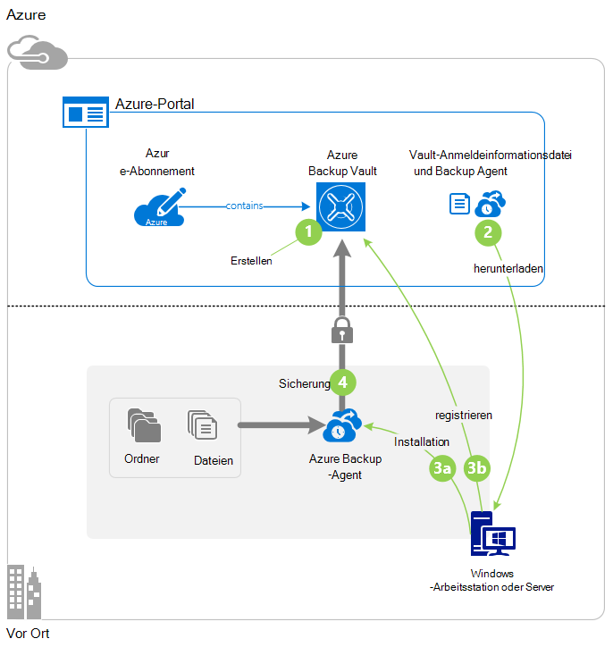
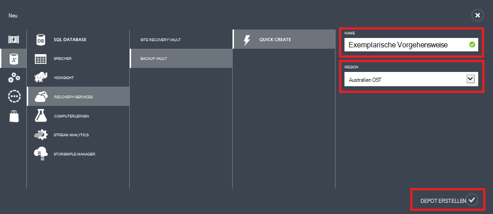
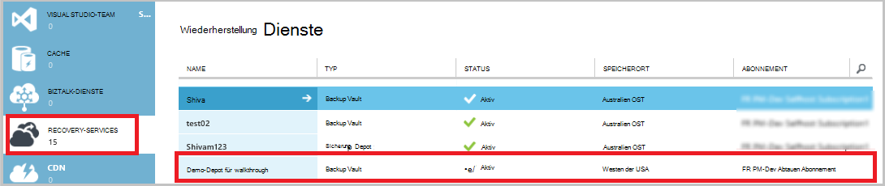
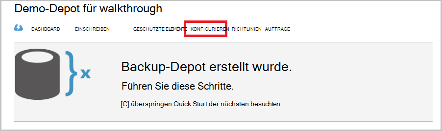
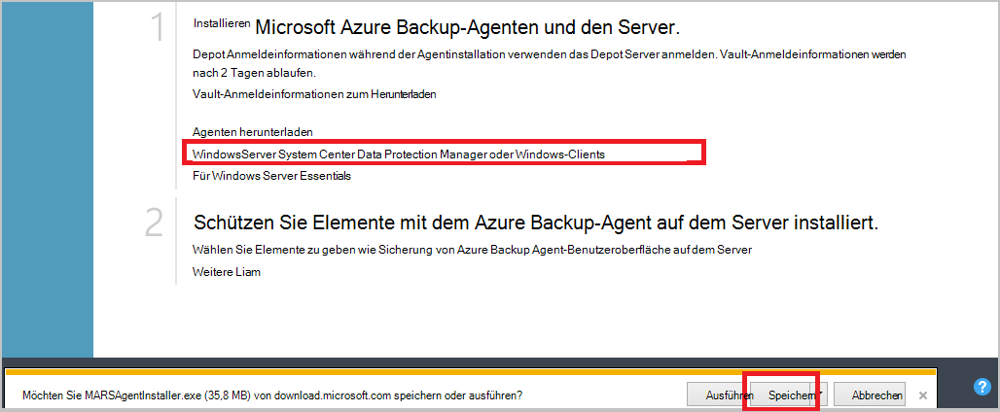
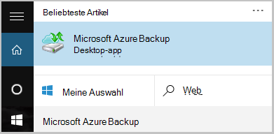
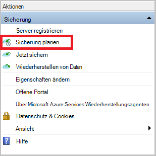
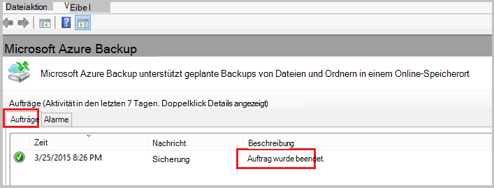

<properties
    pageTitle="Sichern Sie ein Windows-Server oder Client mit klassischen Bereitstellungsmodell Azure | Microsoft Azure"
    description="Backup Windows Server oder Clients in Azure backup Depot erstellen Anmeldeinformationen werden heruntergeladen, backup-Agent installieren und eine anfängliche Sicherung von Dateien und Ordnern abgeschlossen."
    services="backup"
    documentationCenter=""
    authors="markgalioto"
    manager="cfreeman"
    editor=""
    keywords="Backup-Tresor; Sichern von WindowsServer. Backup-Fenster;"/>

<tags
    ms.service="backup"
    ms.workload="storage-backup-recovery"
    ms.tgt_pltfrm="na"
    ms.devlang="na"
    ms.topic="article"
    ms.date="08/08/2016"
    ms.author="jimpark; trinadhk; markgal"/>

# Sichern Sie ein Windows-Server oder Client Azure mit klassischen Bereitstellungsmodell

> [AZURE.SELECTOR]
- [Verwaltungsportal](backup-configure-vault-classic.md)
- [Azure-portal](backup-configure-vault.md)

Dieser Artikel behandelt die erforderlichen Schritte zum Vorbereiten Ihrer Umgebung, und Sichern Sie einen Windows-Server (oder Client) Verfahren in Azure. Er umfasst auch Aspekte der Bereitstellung Ihre backup-Lösung. Wenn Sie in Azure Backup zum ersten Mal versuchen, führt dieser Artikel Sie schnell durch die.

>[AZURE.IMPORTANT] Azure hat zwei verschiedene Bereitstellungsmodelle für erstellen und Verwenden von Ressourcen: Ressourcen-Manager und Classic. Dieser Artikel behandelt das klassische Bereitstellungsmodell verwenden. Microsoft empfiehlt, die neue Ressourcen-Manager-Modell verwendet.

## Bevor Sie beginnen
Um einen Server oder Client in Azure sichern, benötigen Sie ein Azure-Konto. Wenn Sie eine haben, können Sie ein [kostenloses Konto](https://azure.microsoft.com/free/) in wenigen Minuten erstellen.

## Schritt 1: Erstellen einer Sicherung vault
Zum Sichern von Dateien und Ordnern von einem Server oder Client müssen Sie ein backup Depot in der Region erstellen die Daten gespeichert werden soll.

### Ein backup Depot erstellen

1. Melden Sie sich bei [dem Verwaltungsportal](https://manage.windowsazure.com/)an.

2. Klicken Sie auf **neu** > **Data Services** > **Recovery Services** > **Sicherung Depot**und dann **Schnell erstellen**.

3. Geben Sie für den Parameter **Name** einen Anzeigenamen für das backup Depot. Geben Sie einen Namen ein, der zwischen 2 und 50 Zeichen enthält. Sie müssen mit einem Buchstaben beginnen und darf nur Buchstaben, Zahlen und Bindestriche. Dieser Name muss für jedes Abonnement eindeutig sein.

4. Wählen Sie für **den Bereichsparameter** geografische Region für das backup Depot. Diese Auswahl bestimmt das geografische Gebiet, in dem Ihre Sicherungsdaten gesendet wird. Durch Auswählen einer geografischen Region der Nähe, reduzieren Sie Netzwerklatenz Azure sichern.

5. Klicken Sie auf **Vault**.

    

    Es dauert eine Weile backup Depot erstellt werden. Überprüfen Sie den Status überwachen Sie Benachrichtigungen am unteren Rand der Verwaltungsportal.

    Nach dem Erstellen der backup Vault sehen Sie einer Meldung, dass das Depot erstellt wurde. Es wird auch als **aktiv** in der Ressourcenliste **Recovery Services** .

    

4. Die Option Speicher Redundanz beschriebenen Schritte.

    >[AZURE.IMPORTANT] Die beste Zeit zum Identifizieren der Speicheroption Redundanz ist direkt nach dem Depot erstellen und Maschinen Depot registriert sind. Nachdem ein Depot registriert wurde, Redundanz Speicheroption ist gesperrt und kann nicht geändert werden.

    Bei Verwendung von Azure als Endpunkt primäre backup-Speicher (z. B. Sichern in Azure aus einem Windows-Server), sollten Sie [Geo-redundant Storage](../storage/storage-redundancy.md#geo-redundant-storage) Option auswählen (Standard).

    Bei Verwendung von Azure als Endpunkt tertiären backup-Speicher (z. B. verwendetem System Center Data Protection Manager lokale Sicherungskopie lokal speichern und mithilfe von Azure für langfristiger Aufbewahrung muss), wählen Sie [lokal redundanter Speicher](../storage/storage-redundancy.md#locally-redundant-storage). Dies senkt die Kosten zum Speichern von Daten in Azure gleichzeitig geringeren Haltbarkeit für die Daten, die möglicherweise für Dritte Kopien.

    **Um Redundanz Speicheroption auszuwählen:**

    ein. Klicken Sie auf die soeben erstellten Tresor.

    b. Wählen Sie auf der Seite Quick Start **Konfigurieren**.

    

    c. Wählen Sie geeignete Speicher Redundanz.

    Wenn Sie **Lokal redundante**auswählen, müssen Sie auf **Speichern** (da **Geo redundante** die Standardoption ist).

    d. Klicken Sie im linken Navigationsbereich auf **Recovery Services** zurückkehren zu der Liste der Ressourcen für Recovery Services.

## Schritt 2: Herunterladen der Vault-Anmeldeinformationen
Der lokale Computer muss mit einem backup authentifiziert werden, bevor es in Azure Daten sichern kann. Die Authentifizierung erfolgt durch *Vault-Anmeldeinformationen*. Vault-Anmeldeinformationsdatei wird über einen sicheren Kanal aus dem Verwaltungsportal heruntergeladen. Der privaten Schlüssel des Zertifikats ist das Portal oder die nicht dauerhaft.

Erfahren Sie mehr über die [Anmeldeinformationen zum Authentifizieren des Sicherungsdienst mit vault](backup-introduction-to-azure-backup.md#what-is-the-vault-credential-file).

### Das Depot Anmeldeinformationen Datei auf einem lokalen Computer

1. Klicken Sie im linken Navigationsbereich auf **Recovery Services**und wählen Sie das backup Depot erstellen.

    

2.  Klicken Sie auf Schnellstart auf **Vault Anmeldeinformationen**.

    Klassische generiert tresoranmeldeinformationen mit Vault-Name und das aktuelle Datum aus. Die Depot Datei nur während der Registrierung Workflow verwendet und läuft nach 48 Stunden.

    Vault-Anmeldeinformationsdatei kann das Portal heruntergeladen werden.

3. Klicken Sie auf **Speichern** , um das Depot Anmeldeinformationen Dateidownload Ordner Downloads des lokalen Kontos. Sie können auch im Menü **Speichern** einen Speicherort für die Datei Vault Anmeldeinformationen an **Speichern** auswählen.

    >[AZURE.NOTE] Stellen Sie sicher, dass das Depot Anmeldeinformationen an einem Ort speichern, die auf Ihrem Computer. Wenn sie Datei freigeben oder Server Message Block gespeichert ist, überprüfen Sie die Berechtigungen für den Zugriff.

## Schritt 3: Herunterladen, installieren und Registrieren des Backup-Agents
Nachdem backup Depot erstellen und Herunterladen für Vault-Anmeldeinformationen muss auf jedem Windows-Computer ein Agent installiert.

### Herunterladen, installieren und Registrieren des Agents

1. Klicken Sie auf **Recovery-Services**, und wählen Sie backup Tresor mit einem Server registrieren möchten.

2. Klicken Sie auf der Seite Schnellstart auf der **Agent für Windows Server System Center Data Protection Manager oder Windows-Client**-Agent. Klicken Sie auf **Speichern**.

    

3. Nachdem die MARSagentinstaller.exe-Datei heruntergeladen wurde, klicken Sie auf **Ausführen** , oder doppelklicken Sie auf **MARSAgentInstaller.exe** von diesem Speicherort.

4. Wählen Sie den Installationsordner und Cacheordner für den Agenten erforderlich sind, und dann auf **Weiter**. Speicherort des angegebenen benötigen Speicherplatz mindestens 5 Prozent der backup-Daten.

5. Sie können weiterhin über die Standard-Proxyeinstellungen mit dem Internet verbinden.          Verwenden Sie einen Proxy-Server Verbindung zum Internet auf Proxykonfiguration **verwenden benutzerdefinierte Proxyeinstellungen** das Kontrollkästchen und geben Sie die Proxy Server-Details. Verwenden einen authentifizierten Proxy Geben Sie den Benutzer Namen und das Kennwort ein und dann auf **Weiter**.

7. Klicken Sie auf **Installieren** , um die Agent-Installation beginnen. Backup-Agent installiert.NET Framework 4.5 und Windows PowerShell (falls es nicht bereits installiert) um die Installation abzuschließen.

8. Nachdem der Agent installiert ist, klicken Sie auf **zur Registrierung** der Workflow fortgesetzt.

9. Suchen Sie auf der Seite Depot-ID, und wählen Sie Vault-Anmeldeinformationsdatei, die Sie zuvor heruntergeladen haben.

    Vault-Anmeldeinformationsdatei beträgt 48 Stunden nach dem Herunterladen vom Portal aus. Wenn eine Fehlermeldung auf dieser Seite (z. B. "Vault Anmeldeinformationen Datei abgelaufen"), das Portal anmelden und Vault Anmeldeinformationen erneut herunterladen.

    Sicherstellen Sie, dass Anmeldeinformationsdatei Depot verfügbar an einem Speicherort, der die Setup-Anwendung zugreifen können. Wenn Access Fehler auftreten, kopieren Sie Anmeldeinformationsdatei Depot in ein temporäres Verzeichnis auf dem gleichen Computer und wiederholen Sie den Vorgang.

    Wenn Sie ein Depot Anmeldeinformationen wie "Ungültige Depot Anmeldeinformationen" Fehlermeldung die Datei beschädigt oder enthält nicht die aktuellen Anmeldeinformationen zugeordnet Recovery Service. Versuchen Sie nach dem Download eine neue Vault-Anmeldeinformationen über das Portal. Dieser Fehler kann auch auftreten, wenn ein Benutzer die Option **Download Depot Anmeldeinformationen** mehrmals hintereinander auf. In diesem Fall ist nur der letzte Depot Anmeldeinformationsdatei gültig.

9. Auf der Seite Verschlüsselung generieren eine Passphrase oder bieten eine Passphrase (mindestens 16 Zeichen). Denken Sie daran, das Kennwort an einem sicheren Ort speichern.

10. Klicken Sie auf **Fertig stellen**. Registrierungs-Assistenten registriert mit Sicherung der Server.

    >[AZURE.WARNING] Wenn Sie das Kennwort vergessen oder verlieren, helfen Microsoft Ihnen nicht die gesicherten Daten wiederherstellen. Eigene verschlüsselungspassphrase und Microsoft keinen Einblick in die Passphrase ein, der Sie verwenden. Speichern Sie die Datei an einem sicheren Ort, da es bei einem Wiederherstellungsvorgang erforderlich sind.

11. Nach dem Festlegen des Verschlüsselungsschlüssels lassen Sie das Kontrollkästchen **Starten Microsoft Azure Services Wiederherstellungsagenten** ausgewählt und dann auf **Schließen**.

## Schritt 4: Abschließen der ersten Sicherung

Die erste Sicherung enthält zwei Hauptaufgaben:

- Erstellen den Sicherungszeitplan
- Sichern von Dateien und Ordnern zum ersten Mal

Nach Abschluss der erste Sicherung durch die Sicherungsrichtlinie erstellt backup Punkte, die Sie verwenden können, wenn Sie Daten wiederherstellen müssen. Backup-Richtlinie wird basierend auf dem Zeitplan, den Sie definieren.

### So planen Sie die Sicherung

1. Öffnen Sie Microsoft Azure Backup-Agent. (Es wird automatisch geöffnet bleibt Sie **Starten Microsoft Azure Services Wiederherstellungsagenten** das Kontrollkästchen beim Schließen des Assistenten registrieren.) Sie finden **Microsoft Azure Backup**Computers suchen.

    

2. Klicken Sie in der Backup-Agent auf **Sicherung planen**.

    

3. Klicken Sie auf der Seite Erste Schritte des Assistenten Zeitplan auf **Weiter**.

4. Klicken Sie auf der Seite zu sichernde Elemente wählen Sie **Elemente hinzufügen**.

5. Wählen Sie die Dateien und Ordner, die Sie sichern möchten, und klicken Sie auf **OK**.

6. Klicken Sie auf **Weiter**.

7. Auf der Seite **Sicherungszeitplan angeben** **Sicherungszeitplan** Geben Sie an, und klicken Sie auf **Weiter**.

    Sie können täglich (mit maximal drei Mal pro Tag) oder wöchentliche Backups planen.

    

    >[AZURE.NOTE] Finden Sie für Weitere Informationen an den Sicherungszeitplan [Mit Azure Backup auf Band-Infrastruktur ersetzen](backup-azure-backup-cloud-as-tape.md).

8. Wählen Sie auf der Seite **Aufbewahrungsrichtlinie auswählen** die **Aufbewahrungsrichtlinie** für die Sicherungskopie.

    Die Aufbewahrungsrichtlinie gibt die Dauer die Sicherung gespeichert werden. Anstatt nur eine "flache"Richtlinie für alle backup, können Sie unterschiedliche Aufbewahrungsrichtlinien anhand der Sicherung. Sie können die täglichen, wöchentlichen, monatlichen und jährlichen Aufbewahrungsrichtlinien Ihren Bedürfnissen ändern.

9. Wählen Sie auf der Seite erste Sicherungstyp auswählen den ersten backup. Lassen Sie die Option **automatisch über das Netzwerk** aktiviert, und klicken Sie dann auf **Weiter**.

    Sichern automatisch über das Netzwerk, oder Sie können offline sichern. Der Rest dieses Artikels beschreibt die automatisch. Möchten Sie eine offline-Sicherung haben, lesen Sie den Artikel [Offline backup Workflow in Azure Backup](backup-azure-backup-import-export.md) Weitere Informationen.

10. Überprüfen Sie auf der Seite Bestätigung die Informationen und klicken Sie dann auf **Fertig stellen**.

11. Nach Abschluss des Assistenten den Sicherungszeitplan erstellen klicken Sie auf **Schließen**.

### Aktivieren Sie Netzwerk Drosselung (optional)

Backup-Agent bietet Netzwerk-Drosselung. Drosselung Steuerelemente wie Netzwerkbandbreite während der Datenübertragung verwendet wird. Dieses Steuerelement ist hilfreich, möchten Sie sichern Daten während der Arbeitszeit wollen aber nicht den Sicherungsvorgang beeinträchtigen andere Internetdatenverkehr. Einschränkung gilt sichern und Wiederherstellen von Aktivitäten.

**Netzwerk-Drosselung aktivieren**

1. Klicken Sie in der Backup-Agent auf **Eigenschaften ändern**.

    

2. Auf der Registerkarte **Beschränkung** das Kontrollkästchen Sie **Internet-Bandbreite für Backups Einschränkungen aktivieren** .

    

3. Nachdem Sie die Drosselung aktiviert haben Geben Sie zugelassene Bandbreite für die Übertragung von Daten während der **Arbeitszeit** und **nicht - Arbeitszeit an**

    Die Bandbreite Werte können 512 Kbit pro Sekunde (Kbps) beginnen und bis zu 1.023 MB pro Sekunde (Mbit/s). Sie kennzeichnen den Anfang und Ende **Arbeitsstunden**und die Tage der Woche sind als Arbeitstage. Stunden von bestimmten Arbeitsplatz Stunden gelten arbeitsfreien Stunden.

4. Klicken Sie auf **OK**.

### Jetzt sichern

1. Backup-Agent klicken Sie auf **Jetzt sichern** , um Seedrouting im Netzwerk führen.

    

2. Überprüfen Sie auf der Bestätigungsseite Einstellungen, mit denen die jetzt Assistent zum Sichern von dem Computer sichern. Klicken Sie auf **Sichern**.

3. Klicken Sie auf **Schließen** , um den Assistenten zu schließen. Wenn Sie dies tun, bevor die Sicherung abgeschlossen wurde, weiterhin der Assistenten im Hintergrund ausgeführt.

Nachdem die anfängliche Sicherung abgeschlossen ist, wird der Status **abgeschlossen** in der Konsole sichern.

## Nächste Schritte
- Melden Sie sich für ein [kostenloses Azure-Konto](https://azure.microsoft.com/free/).

Weitere Informationen zum Sichern von VMs oder anderen Arbeitslasten finden Sie unter:

- [IaaS VMs sichern](backup-azure-vms-prepare.md)
- [Arbeitslasten in Azure mit Microsoft Azure Backup Server sichern](backup-azure-microsoft-azure-backup.md)
- [Sichern von Arbeitslasten in Azure mit DPM](backup-azure-dpm-introduction.md)
