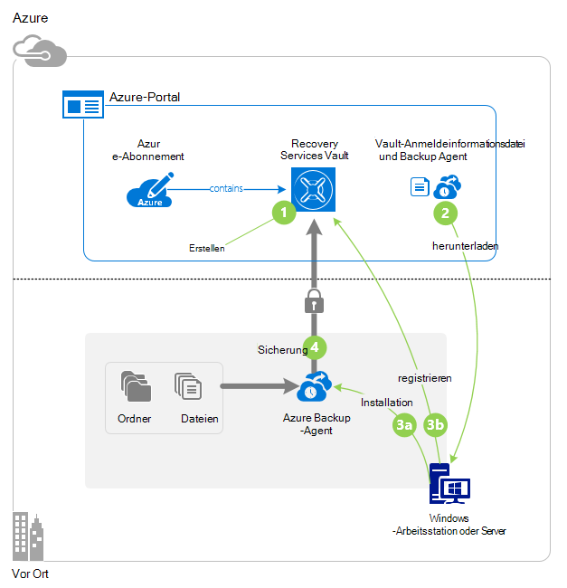
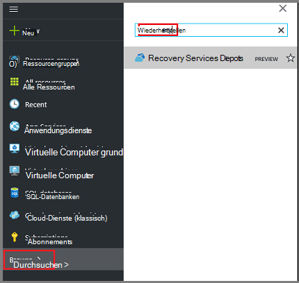
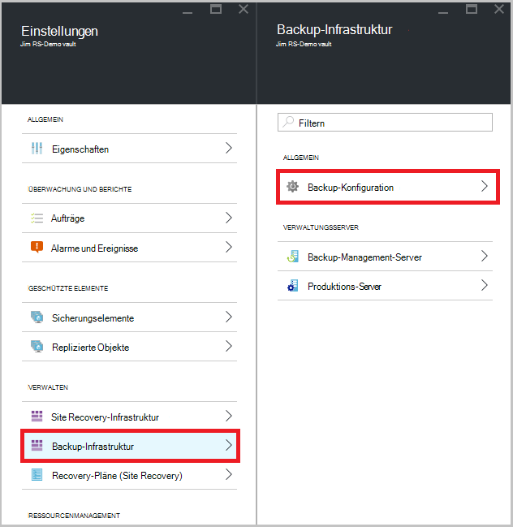
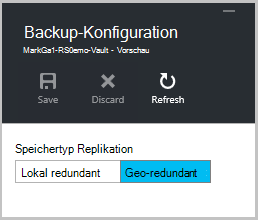
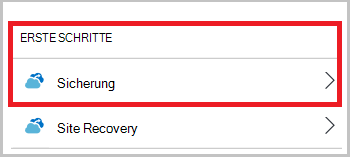
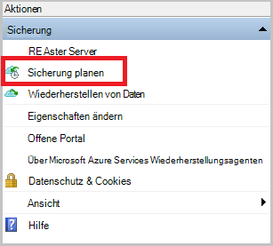
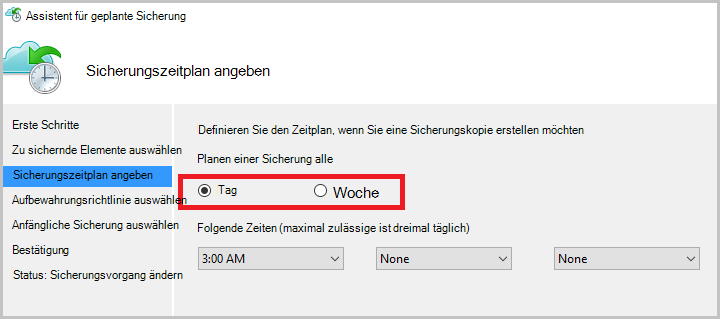
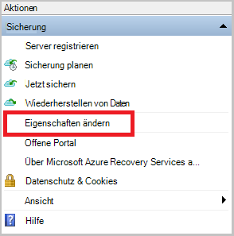
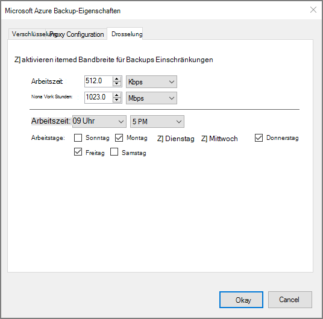
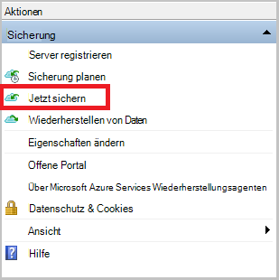

<properties
    pageTitle="Sichern Sie ein Windows-Server oder Client in Azure Azure-Sicherung mit dem Ressourcen-Manager-Bereitstellungsmodell | Microsoft Azure"
    description="Backup Windows Server oder Clients in Azure backup Depot erstellen Anmeldeinformationen werden heruntergeladen, backup-Agent installieren und eine anfängliche Sicherung von Dateien und Ordnern abgeschlossen."
    services="backup"
    documentationCenter=""
    authors="markgalioto"
    manager="cfreeman"
    editor=""
    keywords="Backup-Tresor; Sichern von WindowsServer. Backup-Fenster;"/>

<tags
    ms.service="backup"
    ms.workload="storage-backup-recovery"
    ms.tgt_pltfrm="na"
    ms.devlang="na"
    ms.topic="article"
    ms.date="08/10/2016"
    ms.author="jimpark; trinadhk; markgal"/>

# Ein Windows-Server oder Client, mit dem Ressourcen-Manager-Bereitstellungsmodell Azure sichern

> [AZURE.SELECTOR]
- [Azure-portal](backup-configure-vault.md)
- [Verwaltungsportal](backup-configure-vault-classic.md)

Erläutert, wie Sichern Sie Ihre Windows-Server (oder Windows-Client) Dateien und Ordner in Azure Azure-Sicherung mit dem Ressourcen-Manager-Bereitstellungsmodell.

[AZURE.INCLUDE [learn-about-deployment-models](../../includes/backup-deployment-models.md)]

## Bevor Sie beginnen
Um einen Server oder Client in Azure sichern, benötigen Sie ein Azure-Konto. Wenn Sie eine haben, können Sie ein [kostenloses Konto](https://azure.microsoft.com/free/) in wenigen Minuten erstellen.

## Schritt 1: Erstellen eines Depots Recovery Services

Ein Depot Recovery Services ist eine Entität, die speichert alle Backup- und Recovery-Punkte, die Sie erstellen. Recovery Services Depot enthält auch die Sicherungsrichtlinie auf geschützte Dateien und Ordner angewendet. Beim Erstellen eines Depots Recovery Services sollten Sie auch die entsprechenden Redundanz Option.

### Ein Depot Recovery Services erstellen

1. Wenn Sie bereits, melden Sie sich bei der [Azure-Portal](https://portal.azure.com/) mit der Azure-Abonnement nicht getan.

2. Im Hub klicken Sie auf **Durchsuchen** , und geben Sie in der Liste der Ressourcen **Recovery Services**. Beginn der Eingabe Filtern der Liste basierend auf Ihrer Eingabe. Klicken Sie auf **Recovery Services Depots**.

      

    Recovery Services Depots wird angezeigt.

3. Klicken Sie im Menü **Recovery Services Depots** **Hinzufügen**.

    

    Recovery Services Depot Blade geöffnet, **Name**, **Abonnements**, **Ressourcengruppe**und **Speicherort**angeben.

    

4. **Name**Geben Sie einen Anzeigenamen zu Tresor. Der Name muss eindeutig für den Azure-Abonnement. Geben Sie einen Namen ein, der zwischen 2 und 50 Zeichen enthält. Sie müssen mit einem Buchstaben beginnen und darf nur Buchstaben, Zahlen und Bindestriche.

5. Klicken Sie auf **Abonnement** finden in der Liste der Abonnements. Wenn Sie nicht sicher, welches Abonnement zu verwenden sind, verwenden Sie die Standardeinstellung (oder vorgeschlagene) Abonnement. Es werden mehrere Optionen nur wenn Konto Ihrer Organisation mehrere Azure-Abonnements zugeordnet ist.

6. Klicken Sie auf **Gruppe** finden in der Liste der Ressourcengruppen, oder klicken Sie auf **neu** , um eine neue Ressourcengruppe erstellen. Vollständige Informationen zu Ressourcengruppen finden Sie in [Azure-Ressourcen-Manager (Übersicht)](../azure-resource-manager/resource-group-overview.md)

7. Klicken Sie auf **Speicherort** wählen geografische Region für das Depot. Diese Auswahl bestimmt das geografische Gebiet, in dem Ihre Sicherungsdaten gesendet wird. Durch Auswählen einer geografischen Region der Nähe, reduzieren Sie Netzwerklatenz Azure sichern.

8. Klicken Sie auf **Erstellen**. Es dauert eine Weile Depot Recovery Services erstellt werden. Überwachen Sie Status Benachrichtigung im oberen rechten Bereich des Portals. Erstellte Vault sollte im Portal geöffnet. Nicht Ihrem Tresor aufgeführt, nachdem es abgeschlossen ist, klicken Sie auf **Aktualisieren**. Wenn die Liste aktualisiert wird, klicken Sie auf den Namen des Depots.

### Speicherredundanz bestimmen
Beim Erstellen eines Depots Recovery Services legen Sie fest, wie Speicher repliziert wird.

1. Blatt **Einstellungen** automatisch das Depot Dashboard geöffnet wird, klicken Sie auf **Backup-Infrastruktur**.

2. Klicken Sie auf **Sicherungskonfiguration** **Speichertyp Replikation**anzeigen Blatt Backup-Infrastruktur.

    

3. Die Option Speicher-Replikation für den Tresor.

    

    Standardmäßig hat der Tresor Geo redundanten Speicher. Bei Verwendung von Azure als primäre backup-Speicher Endpunkt weiterhin Geo redundante Speicherung verwenden. Bei Verwendung von Azure als Endpunkt nicht primäre backup-Speicher wählen Sie lokal redundanten Speicher senken die Kosten für das Speichern von Daten in Azure. Lesen Sie mehr über [Geo-redundant](../storage/storage-redundancy.md#geo-redundant-storage) und [lokal redundanter](../storage/storage-redundancy.md#locally-redundant-storage) Speicher in dieser [Übersicht](../storage/storage-redundancy.md).

    Nach dem Auswählen der Speicheroption für Ihr Depot, können Sie Dateien und Ordner Tresor zuordnen.

Erstellung ein Depots Vorbereiten Ihrer Infrastruktur zum Sichern von Dateien und Ordnern durch Herunterladen und Installieren des Agenten Microsoft Azure Recovery Services, Vault Anmeldeinformationen werden heruntergeladen und Anmeldeinformationen mithilfe den Agent mit dem registrieren.

## Schritt 2 - Dateien

>[AZURE.NOTE] Ermöglicht Backup über Azure-Portal kommt bald. Zu diesem Zeitpunkt verwenden Sie Microsoft Azure Services Wiederherstellungsagenten lokalen Dateien und Ordner sichern.

1. **Klicken Sie im Schaltpult Depot Recovery Services.**

    

2. Klicken Sie auf **Erste Schritte > Backup** auf die Standardeinstellungen.

    

3. Klicken Sie auf die Sicherung **Backup-Ziel** auf.

    

4. Wählen Sie **lokalen** von Where ist Ihre Arbeitslast ausgeführt? Menü.

5. Wählen Sie **Dateien und Ordner** aus womit sichern? Menü, und klicken Sie auf **OK**.

#### Recovery Services Agenten herunterladen

1. Klicken Sie auf **Download Agent für Windows Server oder Windows-Client** Blatt **Infrastruktur vorbereiten** .

    

2. **Klicken Sie im Popupmenü herunterladen.** Standardmäßig wird die Datei **MARSagentinstaller.exe** Ordner Downloads gespeichert.

#### Vault-Anmeldeinformationen zum Herunterladen

1. Klicken Sie auf **herunterladen > Speichern** auf Blade-Infrastruktur vorbereiten.

    

## Schritt 3 - Installation und Agent registrieren

1. Suchen Sie und doppelklicken Sie auf **MARSagentinstaller.exe** Downloads-Ordner (oder anderen Speicherort).

2. Setup-Assistent von Microsoft Azure-Recovery Agent abgeschlossen. Um den Assistenten abzuschließen, müssen Sie:

    - Wählen Sie einen Speicherort für die Installation und Cache-Ordner.
    - Informationen des Proxys Server einen Proxyserver mit dem Internet Verbinden mit.
    - Informationen des Benutzers und Kennwort authentifizierten Proxy verwenden.
    - Die heruntergeladenen Depot Anmeldeinformationen
    - Speichern Sie Verschlüsselung Kennwort an einem sicheren Ort.

    >[AZURE.NOTE] Wenn Sie das Kennwort vergessen oder verlieren, kann keine Hilfe die gesicherten Daten wiederherstellen. Speichern Sie die Datei an einem sicheren Ort. Es muss eine Sicherung wiederherstellen.

Der Agent ist jetzt installiert und Ihr Computer Depot registriert. Sie können konfigurieren und planen die Sicherung.

### Bestätigen der Installations

Bestätigen, dass der Agent installiert und ordnungsgemäß registriert wurde, können Sie für die Elemente überprüfen im Abschnitt **Produktionsserver** Verwaltungsportal gesichert. Dazu:

1. Melden Sie sich mit Ihrem Azure-Abonnement [Azure-Portal](https://portal.azure.com/) .

2. Im Hub klicken Sie auf **Durchsuchen** , und geben Sie in der Liste der Ressourcen **Recovery Services**. Beginn der Eingabe Filtern der Liste basierend auf Ihrer Eingabe. Klicken Sie auf **Recovery Services Depots**.

      

    Recovery Services Depots wird angezeigt.

2. Wählen Sie den Namen des erstellten Depots.

    Recovery Services Depot Dashboard Blatt wird geöffnet.

      

3. Klicken Sie auf **die Schaltfläche am oberen Rand der Seite** .

4. Klicken Sie auf **Backup-Infrastruktur > Produktionsservern**.

    

Wenn der Server in der Liste angezeigt wird, müssen Sie bestätigen, dass der Agent installiert und ordnungsgemäß registriert wurde.

## Schritt 4: Abschließen der ersten Sicherung

Die erste Sicherung enthält zwei Hauptaufgaben:

- Planen der Sicherung
- Sichern von Dateien und Ordnern zum ersten Mal

Die erste Sicherung verwenden Sie Microsoft Azure backup-Agent.

### So planen Sie die Sicherung

1. Öffnen Sie Microsoft Azure Backup-Agent. Sie finden **Microsoft Azure Backup**Computers suchen.

    

2. Klicken Sie in der Backup-Agent auf **Sicherung planen**.

    

3. Klicken Sie auf der Seite Erste Schritte des Assistenten Zeitplan auf **Weiter**.

4. Klicken Sie auf der Seite zu sichernde Elemente wählen Sie **Elemente hinzufügen**.

5. Wählen Sie die Dateien und Ordner, die Sie sichern möchten, und klicken Sie auf **OK**.

6. Klicken Sie auf **Weiter**.

7. Auf der Seite **Sicherungszeitplan angeben** **Sicherungszeitplan** Geben Sie an, und klicken Sie auf **Weiter**.

    Sie können täglich (mit maximal drei Mal pro Tag) oder wöchentliche Backups planen.

    

    >[AZURE.NOTE] Finden Sie für Weitere Informationen an den Sicherungszeitplan [Mit Azure Backup auf Band-Infrastruktur ersetzen](backup-azure-backup-cloud-as-tape.md).

8. Wählen Sie auf der Seite **Aufbewahrungsrichtlinie auswählen** die **Aufbewahrungsrichtlinie** für die Sicherungskopie.

    Die Aufbewahrungsrichtlinie gibt die Dauer die Sicherung gespeichert werden. Anstatt nur eine "flache"Richtlinie für alle backup, können Sie unterschiedliche Aufbewahrungsrichtlinien anhand der Sicherung. Sie können die täglichen, wöchentlichen, monatlichen und jährlichen Aufbewahrungsrichtlinien Ihren Bedürfnissen ändern.

9. Wählen Sie auf der Seite erste Sicherungstyp auswählen den ersten backup. Lassen Sie die Option **automatisch über das Netzwerk** aktiviert, und klicken Sie dann auf **Weiter**.

    Sichern automatisch über das Netzwerk, oder Sie können offline sichern. Der Rest dieses Artikels beschreibt die automatisch. Möchten Sie eine offline-Sicherung haben, lesen Sie den Artikel [Offline backup Workflow in Azure Backup](backup-azure-backup-import-export.md) Weitere Informationen.

10. Überprüfen Sie auf der Seite Bestätigung die Informationen und klicken Sie dann auf **Fertig stellen**.

11. Nach Abschluss des Assistenten den Sicherungszeitplan erstellen klicken Sie auf **Schließen**.

### Aktivieren Sie Netzwerk Drosselung (optional)

Backup-Agent bietet Netzwerk-Drosselung. Drosselung Steuerelemente wie Netzwerkbandbreite während der Datenübertragung verwendet wird. Dieses Steuerelement ist hilfreich, möchten Sie sichern Daten während der Arbeitszeit wollen aber nicht den Sicherungsvorgang beeinträchtigen andere Internetdatenverkehr. Einschränkung gilt sichern und Wiederherstellen von Aktivitäten.

>[AZURE.NOTE] Drosselung Netzwerk ist nicht verfügbar in Windows Server 2008 R2 SP1, Windows Server 2008 SP2 oder Windows 7 (mit Servicepacks). Azure Backup Netzwerk Drosselung Funktion greift Quality of Service (QoS) auf dem lokalen Betriebssystem. Obwohl Azure Backup dieser Betriebssysteme schützen können, arbeiten nicht mit Azure Backup Netzwerk Drosselung Version QoS auf diesen Plattformen. Netzwerk-Drosselung kann auf allen anderen [unterstützten Betriebssystemen](backup-azure-backup-faq.md#installation-amp-configuration)verwendet werden.

**Netzwerk-Drosselung aktivieren**

1. Backup-Agent klicken Sie auf **Eigenschaften ändern**.

    

2. Auf der Registerkarte **Beschränkung** das Kontrollkästchen Sie **Internet-Bandbreite für Backups Einschränkungen aktivieren** .

    

3. Nachdem Sie die Drosselung aktiviert haben Geben Sie zugelassene Bandbreite für die Übertragung von Daten während der **Arbeitszeit** und **nicht - Arbeitszeit an**

    Die Bandbreite Werte können 512 Kbit pro Sekunde (Kbps) beginnen und bis zu 1.023 MB pro Sekunde (Mbit/s). Sie kennzeichnen den Anfang und Ende **Arbeitsstunden**und die Tage der Woche sind als Arbeitstage. Stunden von bestimmten Arbeitsplatz Stunden gelten arbeitsfreien Stunden.

4. Klicken Sie auf **OK**.

### Dateien und Ordner zum ersten Mal sichern

1. Klicken Sie in den Netzwerksicherungsdienst auf **Jetzt sichern** führen Sie Seedrouting im Netzwerk.

    

2. Überprüfen Sie auf der Bestätigungsseite Einstellungen, mit denen die jetzt Assistent zum Sichern von dem Computer sichern. Klicken Sie auf **Sichern**.

3. Klicken Sie auf **Schließen** , um den Assistenten zu schließen. Wenn Sie dies tun, bevor die Sicherung abgeschlossen wurde, weiterhin der Assistenten im Hintergrund ausgeführt.

Nachdem die anfängliche Sicherung abgeschlossen ist, wird der Status **abgeschlossen** in der Konsole sichern.

## Haben Sie Fragen?
Wenn Sie Fragen haben oder gibt es Funktion enthalten, angezeigt werden soll [uns Feedback senden](http://aka.ms/azurebackup_feedback).

## Nächste Schritte
Weitere Informationen zum Sichern von VMs oder anderen Arbeitslasten finden Sie unter:

- Damit Sie Ihre Dateien und Ordner gesichert haben, können Sie [Depots und Server verwalten](backup-azure-manage-windows-server.md).
- Benötigen Sie eine Sicherung wiederherstellen möchten, verwenden Sie diesen Artikel auf [Dateien auf einem Windows-Computer](backup-azure-restore-windows-server.md).
