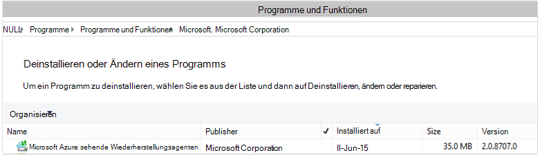

<properties
    pageTitle="Azure Backup - Bereitstellung und Verwaltung für DPM mit PowerShell | Microsoft Azure"
    description="Informationen Sie zum Bereitstellen und Verwalten von Azure Backup für Data Protection Manager (DPM) mit PowerShell"
    services="backup"
    documentationCenter=""
    authors="NKolli1"
    manager="shreeshd"
    editor=""/>

<tags
    ms.service="backup"
    ms.workload="storage-backup-recovery"
    ms.tgt_pltfrm="na"
    ms.devlang="na"
    ms.topic="article"
    ms.date="09/01/2016"
    ms.author="jimpark; anuragm;trinadhk;markgal"/>


# <a name="deploy-and-manage-backup-to-azure-for-data-protection-manager-dpm-servers-using-powershell"></a>Bereitstellen und Verwalten von Backup in Azure für Data Protection Manager (DPM) mithilfe von PowerShell

> [AZURE.SELECTOR]
- [ARM](backup-dpm-automation.md)
- [Classic](backup-dpm-automation-classic.md)

Dieser Artikel beschreibt, wie PowerShell Setup Azure Backup auf einem DPM-Server verwenden und Verwalten von Backup und Recovery.

## <a name="setting-up-the-powershell-environment"></a>Einrichten der PowerShell-Umgebung

[AZURE.INCLUDE [learn-about-deployment-models](../../includes/learn-about-deployment-models-include.md)]

Bevor Sie Sicherungskopien von Data Protection Manager in Azure verwalten PowerShell verwenden können, müssen Sie die Rahmenbedingungen in PowerShell. Zu Beginn der PowerShell-Sitzung sicherstellen Sie, dass Sie den folgenden Befehl zum richtigen Module importieren und DPM-Cmdlets korrekt verweisen können:

```
PS C:> & "C:\Program Files\Microsoft System Center 2012 R2\DPM\DPM\bin\DpmCliInitScript.ps1"

Welcome to the DPM Management Shell!

Full list of cmdlets: Get-Command
Only DPM cmdlets: Get-DPMCommand
Get general help: help
Get help for a cmdlet: help <cmdlet-name> or <cmdlet-name> -?
Get definition of a cmdlet: Get-Command <cmdlet-name> -Syntax
Sample DPM scripts: Get-DPMSampleScript
```

## <a name="setup-and-registration"></a>Installation und Registrierung
Starten:

1. [Herunterladen der neuesten PowerShell](https://github.com/Azure/azure-powershell/releases) (erforderliche Mindestversion ist: 1.0.0)
2. Wechseln mithilfe der **Switch-AzureMode** -Cmdlet *AzureResourceManager* Modus aktivieren Sie Cmdlets Azure Backup:

```
PS C:\> Switch-AzureMode AzureResourceManager
```

Installation und Registrierung gehen können mit PowerShell automatisiert werden:

- Erstellen eines Depots Recovery Services
- Azure Backup-Agent installieren
- Azure Backup Service registrieren
- Netzwerk-Standardeinstellungen
- Verschlüsselung

## <a name="create-a-recovery-services-vault"></a>Erstellen eines Depots Recovery services

Die folgenden Schritte führen Sie durch das Erstellen eines Depots Recovery Services. Ein Depot Recovery Services unterscheidet sich ein Depot Backup.

1. Bei Verwendung von Azure Backup zum ersten Mal verwenden Sie **Register-AzureRMResourceProvider** -Cmdlet, Azure Recovery Service Provider mit Ihrem Abonnement registrieren.

    ```
    PS C:\> Register-AzureRmResourceProvider -ProviderNamespace "Microsoft.RecoveryServices"
    ```

2. Recovery Services Vault ist eine Ressource ARM müssen innerhalb einer Ressourcengruppe zu platzieren. Sie können eine vorhandene Ressourcengruppe verwenden oder einen neuen erstellen. Wenn Sie eine neue Ressourcengruppe erstellen, geben Sie den Namen und Speicherort für die Ressourcengruppe.  

    ```
    PS C:\> New-AzureRmResourceGroup –Name "test-rg" –Location "West US"
    ```

3. Verwenden Sie das Cmdlet **Neu AzureRmRecoveryServicesVault** ein neues Depot erstellen. Achten Sie an demselben Speicherort für das Depot für die Ressourcengruppe verwendet wurde.

    ```
    PS C:\> New-AzureRmRecoveryServicesVault -Name "testvault" -ResourceGroupName " test-rg" -Location "West US"
    ```

4. Geben Sie den Speicherredundanz verwenden; Sie können [Lokal redundanter Speicher (LRS)](../storage/storage-redundancy.md#locally-redundant-storage) oder [Geo redundanten Speicher (GRS)](../storage/storage-redundancy.md#geo-redundant-storage). Das folgende Beispiel zeigt, dass die Option BackupStorageRedundancy - TestVault GeoRedundant ist.

    > [AZURE.TIP] Viele Azure Backup-Cmdlets erfordern Recovery Services Vault-Objekt als Eingabe. Aus diesem Grund empfiehlt es sich, das Backup Recovery Services Vault-Objekt in einer Variablen speichern.

    ```
    PS C:\> $vault1 = Get-AzureRmRecoveryServicesVault –Name "testVault"
    PS C:\> Set-AzureRmRecoveryServicesBackupProperties  -vault $vault1 -BackupStorageRedundancy GeoRedundant
    ```


## <a name="view-the-vaults-in-a-subscription"></a>Anzeigen von Depots in einem Abonnement
Verwenden Sie **Get-AzureRmRecoveryServicesVault** alle +++ Liste in das aktuelle Abonnement anzeigen. Sie können diesen Befehl verwenden, zu überprüfen, ob ein neues Depot erstellt wurde und welche Depots im Abonnement verfügbar sind.

Führen Sie den Befehl Get-AzureRmRecoveryServicesVault und alle Depots im Abonnement aufgelistet.

```
PS C:\> Get-AzureRmRecoveryServicesVault
Name              : Contoso-vault
ID                : /subscriptions/1234
Type              : Microsoft.RecoveryServices/vaults
Location          : WestUS
ResourceGroupName : Contoso-docs-rg
SubscriptionId    : 1234-567f-8910-abc
Properties        : Microsoft.Azure.Commands.RecoveryServices.ARSVaultProperties
```


## <a name="installing-the-azure-backup-agent-on-a-dpm-server"></a>Azure Backup-Agent installieren auf einem DPM-Server
Bevor Sie Azure Backup-Agent installieren, müssen Sie das Installationsprogramm heruntergeladen und vorhanden auf dem Windows-Server. Sie erhalten die neueste Version des Installers aus dem [Microsoft Download Center](http://aka.ms/azurebackup_agent) oder Recovery Services Depot Dashboardseite. Speichern Sie an einem leicht zugänglichen Speicherort wie das Installationsprogramm * C:\Downloads\*.

Um den Agenten zu installieren, führen Sie den folgenden Befehl in PowerShell einen erhöhten Konsole sich **auf dem DPM-Server**:

```
PS C:\> MARSAgentInstaller.exe /q
```

Dies installiert den Agenten mit den Standardoptionen. Die Installation dauert einige Minuten im Hintergrund. Wenn Sie nicht die Option */nu* angeben, die öffnet sich das Fenster **Windows Update** am Ende der Installation nach Updates suchen.

Der Agent wird in der Liste der installierten Programme. Zum Anzeigen die Liste der installierten Programme gehen **Control**Panel > **Programme** > **Programme und Funktionen**.



### <a name="installation-options"></a>Installationsoptionen
Wenn Sie alle verwenden Optionen über die Befehlszeile den folgenden Befehl:

```
PS C:\> MARSAgentInstaller.exe /?
```

Die Optionen sind verfügbar:

| Option | Details | Standard |
| ---- | ----- | ----- |
| / q | Installation im stillen Modus | - |
| p: "Speicherort" | Pfad zum Installationsordner für Azure Backup-Agent. | C:\Program Files\Microsoft Azure Services Wiederherstellungsagenten |
| / s: "Speicherort" | Pfad für den Cacheordner Azure Backup-Agent. | C:\Program Files\Microsoft Azure Recovery Services Agent\Scratch |
| / m | Microsoft Update anmelden | - |
| /Nu | Überprüfen Sie nach Abschluss der Installation keine Updates | - |
| / d | Microsoft Azure Recovery Services Agent deinstalliert | - |
| /pH | Proxy-Hostadresse | - |
| /PO | Proxy Server-Portnummer | - |
| /PU | Proxy Server-Benutzername | - |
| / PW | Proxy-Kennwort | - |

## <a name="registering-dpm-to-a-recovery-services-vault"></a>Registrieren von DPM eine Recovery Services Vault

Nach der Erstellung Recovery Services Vault herunterladen Sie der neuesten Agent und Vault-Anmeldeinformationen und Lage wie C:\Downloads speichern.

```
PS C:\> $credspath = "C:\downloads"
PS C:\> $credsfilename = Get-AzureRmRecoveryServicesVaultSettingsFile -Backup -Vault $vault1 -Path  $credspath
PS C:\> $credsfilename
C:\downloads\testvault\_Sun Apr 10 2016.VaultCredentials
```

Führen Sie auf dem DPM-Server [Start-OBRegistration](https://technet.microsoft.com/library/hh770398%28v=wps.630%29.aspx) -Cmdlet Registrieren des Computers mit der.

```
PS C:\> $cred = $credspath + $credsfilename
PS C:\> Start-OBRegistration-VaultCredentials $cred -Confirm:$false
CertThumbprint      :7a2ef2caa2e74b6ed1222a5e89288ddad438df2
SubscriptionID      : ef4ab577-c2c0-43e4-af80-af49f485f3d1
ServiceResourceName: testvault
Region              :West US
Machine registration succeeded.
```

### <a name="initial-configuration-settings"></a>Anfängliche Konfiguration
Nach der Registrierung des DPM-Servers mit der Recovery Services beginnt mit Standardeinstellungen Abonnement. Dazu Abonnement gehören Netzwerkfunktionen, Verschlüsselung und den Stagingbereich. Abonnement ändern Sie zuerst ein Handle auf die vorhandenen (Standard) mit dem Cmdlet [Get-DPMCloudSubscriptionSetting müssen](https://technet.microsoft.com/library/jj612793) :

```
$setting = Get-DPMCloudSubscriptionSetting -DPMServerName "TestingServer"
```

Alle Änderungen werden diese lokalen PowerShell-Objekt ```$setting``` und dann das vollständige Objekt zu DPM und Azure Sicherung mithilfe des [Set-DPMCloudSubscriptionSetting](https://technet.microsoft.com/library/jj612791) -Cmdlet zu speichern. Sie benötigen die ```–Commit``` Flag, um sicherzustellen, dass die Änderung beibehalten werden. Die Einstellungen nicht angewendet und von Azure Backup verwendet, wenn ein Commit ausgeführt.

```
PS C:\> Set-DPMCloudSubscriptionSetting -DPMServerName "TestingServer" -SubscriptionSetting $setting -Commit
```

## <a name="networking"></a>Netzwerk
Ist die Verbindung des Computers DPM Azure Backup-Dienst im Internet über einen Proxyserver, sollte erfolgreich Backups Proxyeinstellungen vorgesehen. Dies geschieht mithilfe der ```-ProxyServer```und ```-ProxyPort```, ```-ProxyUsername``` und ```ProxyPassword``` mit [Set-DPMCloudSubscriptionSetting](https://technet.microsoft.com/library/jj612791) -Cmdlet. In diesem Beispiel ist kein Proxyserver so wir ausdrücklich alle Proxy-Informationen löschen.

```
PS C:\> Set-DPMCloudSubscriptionSetting -DPMServerName "TestingServer" -SubscriptionSetting $setting -NoProxy
```

Bandbreite auch gesteuert werden mit ```-WorkHourBandwidth``` und ```-NonWorkHourBandwidth``` für bestimmte Tage der Woche. In diesem Beispiel setzen keine Drosselung wir.

```
PS C:\> Set-DPMCloudSubscriptionSetting -DPMServerName "TestingServer" -SubscriptionSetting $setting -NoThrottle
```

## <a name="configuring-the-staging-area"></a>Konfigurieren der Stagingbereich
Azure Backup-Agent auf dem DPM-Server benötigt temporären Speicher für Daten aus der Cloud (Staging-Bereich) wiederhergestellt. Konfigurieren Sie mithilfe des [Set-DPMCloudSubscriptionSetting](https://technet.microsoft.com/library/jj612791) -Cmdlet Stagingbereich und ```-StagingAreaPath``` Parameter.

```
PS C:\> Set-DPMCloudSubscriptionSetting -DPMServerName "TestingServer" -SubscriptionSetting $setting -StagingAreaPath "C:\StagingArea"
```

Im obigen Beispiel den Stagingbereich festgelegt, *C:\StagingArea* im PowerShell-Objekt ```$setting```. Stellen Sie sicher, dass der angegebene Ordner bereits existiert, fehl, das endgültige Commit von Abonnement-Optionen.


### <a name="encryption-settings"></a>Verschlüsselung
Backup-Daten an Azure Backup gesendet werden verschlüsselt, um Vertraulichkeit der Daten. Die verschlüsselungspassphrase ist "Password" zum Entschlüsseln der Daten zum Zeitpunkt der Wiederherstellung. Es ist wichtig, diese Informationen sicher Nachdem sie festgelegt wurde.

Im folgenden Beispiel konvertiert der erste Befehl die Zeichenfolge ```passphrase123456789``` eine sichere Zeichenfolge und weist die sichere Zeichenfolge der Variablen mit dem Namen ```$Passphrase```. der zweite Befehl wird die sichere Zeichenfolge im ```$Passphrase``` als Kennwort für die Verschlüsselung von Backups.

```
PS C:\> $Passphrase = ConvertTo-SecureString -string "passphrase123456789" -AsPlainText -Force

PS C:\> Set-DPMCloudSubscriptionSetting -DPMServerName "TestingServer" -SubscriptionSetting $setting -EncryptionPassphrase $Passphrase
```

> [AZURE.IMPORTANT] Bleiben Sie die Passphrase Informationen sicher Nachdem sie festgelegt wurde. Wiederherstellen von Azure ohne diese Passphrase wird nicht können.

An diesem Punkt sollte vorgenommenen alle erforderlichen Änderungen an der ```$setting``` Objekt. Beachten Sie die Änderungen.

```
PS C:\> Set-DPMCloudSubscriptionSetting -DPMServerName "TestingServer" -SubscriptionSetting $setting -Commit
```

## <a name="protect-data-to-azure-backup"></a>Datenschutz, Azure Backup
In diesem Abschnitt fügen einen Produktionsserver zu DPM und schützen Sie die Daten in den lokalen Speicher DPM bis Azure Backup. In den Beispielen zeigen wir, wie Sie Dateien und Ordner sichern. Die Logik kann leicht zum Sichern einer DPM unterstützte Datenquelle erweitert werden. Alle DPM-Backups werden von einem Schutz Gruppe (PG) mit vier gesteuert:

1. **Mitglieder der Gruppe** ist eine Liste aller Schützbare Objekte (auch bekannt als *Datenquellen* in DPM), die in derselben Schutzgruppe geschützt werden soll. Beispielsweise möchten Sie möglicherweise unterschiedlichen backup Produktion VMs in einer Schutzgruppe und SQL Server-Datenbanken in einer anderen Schutzgruppe schützen. Bevor Sie Datenquelle auf einem Produktionsserver sichern können, die Sie sicherstellen müssen, den DPM-Agent auf dem Server installiert und wird von DPM verwaltet. Gehen Sie zum [Installieren der DPM-Agent](https://technet.microsoft.com/library/bb870935.aspx) und Verknüpfen mit dem entsprechenden DPM-Server.
2. **Datenschutzmethode** gibt die Ziel-Sicherungspfaden - Band, Festplatte und Cloud. In diesem Beispiel werden Daten auf der Festplatte und in der Cloud geschützt.
3. Ein **Sicherungszeitplan** , der angibt, wann Backups werden müssen und wie oft die Daten zwischen dem DPM-Server und dem Produktionsserver synchronisiert werden.
4. Ein **Aufbewahrungszeitplan** , die angibt, wie lange in Azure Wiederherstellungspunkte beibehalten.

### <a name="creating-a-protection-group"></a>Erstellen einer Schutzgruppe
Durch Erstellen einer neuen Schutzgruppe mithilfe des Cmdlets [DPMProtectionGroup neu](https://technet.microsoft.com/library/hh881722) starten.

```
PS C:\> $PG = New-DPMProtectionGroup -DPMServerName " TestingServer " -Name "ProtectGroup01"
```

Das obige Cmdlet wird einer Schutzgruppe namens *ProtectGroup01*erstellt. Eine vorhandene Schutzgruppe kann auch später geändert werden, der Azure-Cloud Backup hinzufügen. Allerdings müssen die Schutzgruppe - ändern neue oder vorhandene - wir einen *änderbaren* Objekt mit dem Cmdlet [Get-DPMModifiableProtectionGroup](https://technet.microsoft.com/library/hh881713) handhaben.

```
PS C:\> $MPG = Get-ModifiableProtectionGroup $PG
```

### <a name="adding-group-members-to-the-protection-group"></a>Mitglieder zur Schutzgruppe hinzufügen
DPM-Agent weiß die Liste der Datenquellen auf dem Server auf installiert ist. Der DPM-Agent muss die Schutzgruppe eine Datenquelle hinzu, zunächst eine Liste der Datenquellen auf dem DPM-Server senden. Eine oder mehrere Datenquellen werden ausgewählt und die Schutzgruppe hinzugefügt. PowerShell Schritte dazu sind:

1. Ruft eine Liste aller Server, die von DPM durch das DPM-Agent verwaltet.
2. Wählen Sie einen bestimmten Server.
3. Abrufen einer Liste aller Datenquellen auf dem Server.
4. Wählen Sie eine oder mehrere Datenquellen und zur Schutzgruppe hinzufügen

Die Liste der Server, auf denen DPM-Agent installiert ist und wird vom DPM-Server, wird mit dem Cmdlet [Get-DPMProductionServer](https://technet.microsoft.com/library/hh881600) erworben. In diesem Beispiel werden wir filtern und nur PS mit Namen *productionserver01* Backup konfiguriert.

```
PS C:\> $server = Get-ProductionServer -DPMServerName "TestingServer" | where {($_.servername) –contains “productionserver01”
```

Jetzt abrufen die Liste der Datenquellen auf ```$server``` mit dem Cmdlet [Get-DPMDatasource](https://technet.microsoft.com/library/hh881605) . In diesem Beispiel werden wir Filtern für den Datenträger D: *\* , die wir für die Sicherung konfigurieren möchten. Diese Datenquelle wird mithilfe des [Add-DPMChildDatasource](https://technet.microsoft.com/library/hh881732) -Cmdlet Schutzgruppe hinzugefügt. Verwenden Sie die *änderbaren * Schutzgruppenobjekt ```$MPG``` Zusätze zu.

```
PS C:\> $DS = Get-Datasource -ProductionServer $server -Inquire | where { $_.Name -contains “D:\” }

PS C:\> Add-DPMChildDatasource -ProtectionGroup $MPG -ChildDatasource $DS
```

Wiederholen Sie diesen Schritt so oft wie erforderlich, bis alle ausgewählten Datenquellen zur Schutzgruppe hinzugefügt haben. Sie können auch beginnen mit nur einem Datasource den Workflow zum Erstellen der Schutzgruppe abzuschließen und zu einem späteren Zeitpunkt weitere Datenquellen die Schutzgruppe hinzufügen.

### <a name="selecting-the-data-protection-method"></a>Auswählen der Datenschutzmethode
Sobald der Schutzgruppe die Datenquellen hinzugefügt haben, besteht der nächste Schritt mit dem [Set-DPMProtectionType](https://technet.microsoft.com/library/hh881725) -Cmdlet Schutz an. In diesem Beispiel wird die Schutzgruppe für Festplatte und Cloud-Backup. Außerdem müssen die Datenquelle angeben, Cloud mit [Add-DPMChildDatasource](https://technet.microsoft.com/library/hh881732.aspx) -Cmdlet - Online-Flag zu.

```
PS C:\> Set-DPMProtectionType -ProtectionGroup $MPG -ShortTerm Disk –LongTerm Online
PS C:\> Add-DPMChildDatasource -ProtectionGroup $MPG -ChildDatasource $DS –Online
```

### <a name="setting-the-retention-range"></a>Die Beibehaltungsdauer festlegen
Die Aufbewahrung Sicherungspunkte mithilfe des [Set-DPMPolicyObjective](https://technet.microsoft.com/library/hh881762) -Cmdlet festgelegt. Während es möglicherweise seltsam erscheinen, die Aufbewahrung festgelegt, bevor mit der Sicherungszeitplan definiert wurde, der ```Set-DPMPolicyObjective``` -Cmdlet wird automatisch einen Standardzeitplan Sicherung, die anschließend geändert werden kann. Es ist immer möglich, die Sicherung zuerst planen, und die Aufbewahrungsrichtlinie nach.

Im folgenden Beispiel wird das Cmdlet die Aufbewahrungsparameter für Festplatten-Backups. Diese behalten Backups für 10 Tage und Daten synchronisieren alle 6 Stunden zwischen dem Produktionsserver und dem DPM-Server. Die ```SynchronizationFrequencyMinutes``` nicht definieren, wie oft ein Sicherungspunkt erstellt wird, aber wie häufig Daten auf dem DPM-Server kopiert.  Diese Einstellung verhindert, dass Backups zu groß.

```
PS C:\> Set-DPMPolicyObjective –ProtectionGroup $MPG -RetentionRangeInDays 10 -SynchronizationFrequencyMinutes 360
```

Für Backups auf Azure (DPM bezeichnet diese als Online-Backups) Aufbewahrung Bereiche zur [langfristigen Aufbewahrung verwenden ein Großvater-Vater und Sohn (GFS)](backup-azure-backup-cloud-as-tape.md)konfiguriert werden. Also definieren Sie eine kombinierte Aufbewahrungsrichtlinie mit täglich, wöchentlich, monatlich und jährlich Aufbewahrungsrichtlinien. In diesem Beispiel wir Content-Schema, das wir möchten eine Arraydarstellung erstellen und konfigurieren Sie die Beibehaltungsdauer mithilfe des [Set-DPMPolicyObjective](https://technet.microsoft.com/library/hh881762) -Cmdlet.

```
PS C:\> $RRlist = @()
PS C:\> $RRList += (New-Object -TypeName Microsoft.Internal.EnterpriseStorage.Dls.UI.ObjectModel.OMCommon.RetentionRange -ArgumentList 180, Days)
PS C:\> $RRList += (New-Object -TypeName Microsoft.Internal.EnterpriseStorage.Dls.UI.ObjectModel.OMCommon.RetentionRange -ArgumentList 104, Weeks)
PS C:\> $RRList += (New-Object -TypeName Microsoft.Internal.EnterpriseStorage.Dls.UI.ObjectModel.OMCommon.RetentionRange -ArgumentList 60, Month)
PS C:\> $RRList += (New-Object -TypeName Microsoft.Internal.EnterpriseStorage.Dls.UI.ObjectModel.OMCommon.RetentionRange -ArgumentList 10, Years)
PS C:\> Set-DPMPolicyObjective –ProtectionGroup $MPG -OnlineRetentionRangeList $RRlist
```

### <a name="set-the-backup-schedule"></a>Legen Sie den Sicherungszeitplan
DPM stellt einen Sicherungszeitplan standardmäßig automatisch Schutz objektive mit Angabe der ```Set-DPMPolicyObjective``` Cmdlet. Verwenden Sie zum Ändern der Standardzeitpläne gefolgt von [Set-DPMPolicySchedule](https://technet.microsoft.com/library/hh881723) -Cmdlet [Get-DPMPolicySchedule](https://technet.microsoft.com/library/hh881749) -Cmdlet.

```
PS C:\> $onlineSch = Get-DPMPolicySchedule -ProtectionGroup $mpg -LongTerm Online
PS C:\> Set-DPMPolicySchedule -ProtectionGroup $MPG -Schedule $onlineSch[0] -TimesOfDay 02:00
PS C:\> Set-DPMPolicySchedule -ProtectionGroup $MPG -Schedule $onlineSch[1] -TimesOfDay 02:00 -DaysOfWeek Sa,Su –Interval 1
PS C:\> Set-DPMPolicySchedule -ProtectionGroup $MPG -Schedule $onlineSch[2] -TimesOfDay 02:00 -RelativeIntervals First,Third –DaysOfWeek Sa
PS C:\> Set-DPMPolicySchedule -ProtectionGroup $MPG -Schedule $onlineSch[3] -TimesOfDay 02:00 -DaysOfMonth 2,5,8,9 -Months Jan,Jul
PS C:\> Set-DPMProtectionGroup -ProtectionGroup $MPG
```

Im obigen Beispiel ```$onlineSch``` ist ein Array mit vier Elementen mit vorhandenen online Schutzzeitplan für die Schutzgruppe in der GFS-Schema:

1. ```$onlineSch[0]```der Tagesplan enthält
2. ```$onlineSch[1]```wöchentlichen Zeitplan enthält
3. ```$onlineSch[2]```enthält die monatlich
4. ```$onlineSch[3]```enthält den jährlichen Plan

So benötigen Sie den wöchentlichen Zeitplan ändern, müssen Sie auf die ```$onlineSch[1]```.

### <a name="initial-backup"></a>Erste backup
Beim Sichern einer Datenquelle zum ersten Mal DPM muss erste Replikat erstellt erstellt eine vollständige Kopie der Datenquelle Replikatvolume DPM geschützt werden. Diese Aktivität kann entweder für einen bestimmten Zeitraum geplant oder ausgelöst werden manuell, verwenden das Cmdlet " [Set-DPMReplicaCreationMethod](https://technet.microsoft.com/library/hh881715) " mit dem Parameter ```-NOW```.

```
PS C:\> Set-DPMReplicaCreationMethod -ProtectionGroup $MPG -NOW
```
### <a name="changing-the-size-of-dpm-replica--recovery-point-volume"></a>Ändern der Größe des DPM-Replikat und Wiederherstellungspunktvolumes
Sie können auch die Größe des DPM-Replikat und Schattenkopien Volume mit [Set-DPMDatasourceDiskAllocation](https://technet.microsoft.com/library/hh881618.aspx) -Cmdlet wie im folgenden Beispiel ändern: Get-DatasourceDiskAllocation - Datasource $DS $DS Set-DatasourceDiskAllocation - Datasource - ProtectionGroup $MPG-manuelle - ReplicaArea (2 gb) - ShadowCopyArea (2 gb)

### <a name="committing-the-changes-to-the-protection-group"></a>Commit der Änderung zur Schutzgruppe
Schließlich müssen die Änderungen übernommen werden, bevor DPM die Sicherung pro neue Schutzgruppe Konfiguration nutzen kann. Dies kann mithilfe des [Set-DPMProtectionGroup](https://technet.microsoft.com/library/hh881758) -Cmdlet erreicht werden.

```
PS C:\> Set-DPMProtectionGroup -ProtectionGroup $MPG
```
## <a name="view-the-backup-points"></a>Die Sicherung Punkte
Das Cmdlet " [Get-DPMRecoveryPoint](https://technet.microsoft.com/library/hh881746) " können Sie alle Wiederherstellungspunkte für eine Datenquelle aufzulisten. In diesem Beispiel wird Folgendes beschrieben:
- alle Seiten auf dem DPM-Server abgerufen und in einem Array gespeichert```$PG```
- Abrufen von Datenquellen für die```$PG[0]```
- Alle Wiederherstellungspunkte für eine Datenquelle abgerufen.

```
PS C:\> $PG = Get-DPMProtectionGroup –DPMServerName "TestingServer"
PS C:\> $DS = Get-DPMDatasource -ProtectionGroup $PG[0]
PS C:\> $RecoveryPoints = Get-DPMRecoverypoint -Datasource $DS[0] -Online
```

## <a name="restore-data-protected-on-azure"></a>Wiederherstellen von Daten auf Azure
Wiederherstellen von Daten ist eine Kombination aus einer ```RecoverableItem``` Objekt und ```RecoveryOption``` Objekt. Im vorherigen Abschnitt haben wir eine Liste der backup Punkte für eine Datenquelle.

Im folgenden Beispiel demonstrieren wir das Ziel für die Wiederherstellung Sicherungspunkte mit Hyper-V-Computer von Azure Backup wiederherstellen. Dieses Beispiel enthält:

- Erstellen mit dem [New-DPMRecoveryOption](https://technet.microsoft.com/library/hh881592) -Cmdlet Wiederherstellungsoption.
- Abrufen des Punktearrays backup mit der ```Get-DPMRecoveryPoint``` Cmdlet.
- Wählen backup Punkt aus wiederherstellen.

```
PS C:\> $RecoveryOption = New-DPMRecoveryOption -HyperVDatasource -TargetServer "HVDCenter02" -RecoveryLocation AlternateHyperVServer -RecoveryType Recover -TargetLocation “C:\VMRecovery”

PS C:\> $PG = Get-DPMProtectionGroup –DPMServerName "TestingServer"
PS C:\> $DS = Get-DPMDatasource -ProtectionGroup $PG[0]
PS C:\> $RecoveryPoints = Get-DPMRecoverypoint -Datasource $DS[0] -Online

PS C:\> Restore-DPMRecoverableItem -RecoverableItem $RecoveryPoints[0] -RecoveryOption $RecoveryOption
```

Die Befehle können problemlos für jeden Datenquellentyp erweitert werden.

## <a name="next-steps"></a>Nächste Schritte

- Weitere Informationen zu DPM Azure Backup finden Sie unter [Einführung in DPM-Sicherung](backup-azure-dpm-introduction.md)
