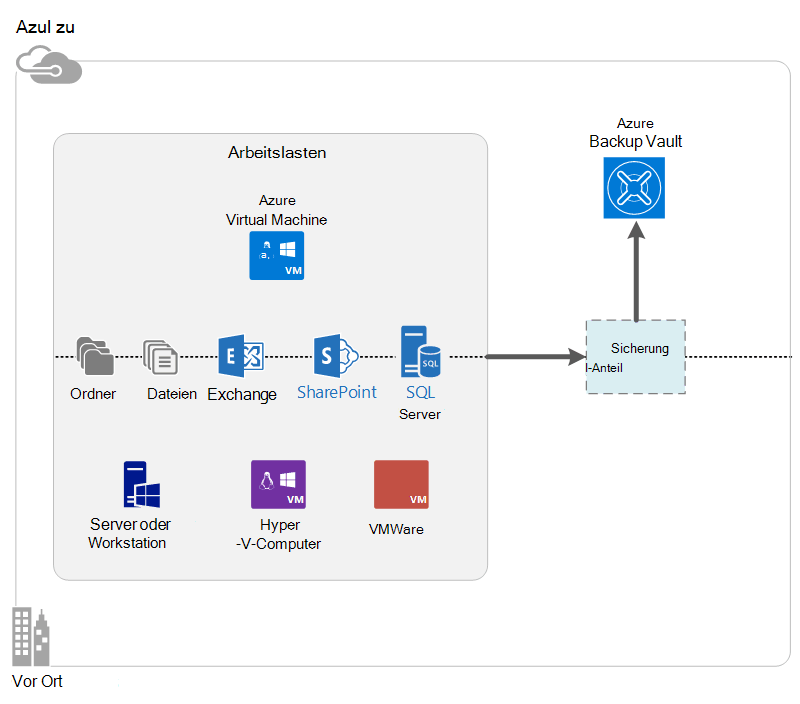

<properties
    pageTitle="Was ist Azure Backup? | Microsoft Azure"
    description="Mithilfe von Azure Backup und Recovery Services können Sie sichern und Wiederherstellen von Daten und Programme von Windows Server, Windows-Clientcomputern, System Center DPM-Servern und Azure virtuelle Computer."
    services="backup"
    documentationCenter=""
    authors="markgalioto"
    manager="cfreeman"
    editor="tysonn"
    keywords="Sicherung und Wiederherstellung; Recovery-Services; Backup-Lösungen"/>

<tags
    ms.service="backup"
    ms.workload="storage-backup-recovery"
    ms.tgt_pltfrm="na"
    ms.devlang="na"
    ms.topic="get-started-article"
    ms.date="10/19/2016"
    ms.author="jimpark; trinadhk"/>

# Was ist Azure Backup?
Azure Backup ist der Dienst, mit dem Sichern und Wiederherstellen von Daten in der Cloud von Microsoft. Es ersetzt die vorhandene lokale oder externe backup-Lösung eine cloudbasierte Lösung zuverlässige, sichere und kostengünstige. Es schützt auch Anlagen, die in der Cloud ausgeführt. Azure Backup bietet Recovery Services auf eine erstklassige Infrastruktur, skalierbare, robuste und hochverfügbare erstellt.

[Einen video-Überblick Azure Backup überwachen](https://azure.microsoft.com/documentation/videos/what-is-azure-backup/)

## Warum verwenden Azure Backup?
Die Cloud als Endpunkt auf Datenträger oder Band behandelt haben herkömmliche backup-Lösungen entwickelt. Dieser Ansatz ist einfach ist ebenfalls eingeschränkt. Es ist kein nutzen eine zugrunde liegende Cloud-Plattform und eine ineffiziente, teure Lösung entspricht.
Azure Backup hingegen bietet alle Vorteile einer leistungsfähigen und kostengünstigen Cloud backup-Lösung. Hier sind einige der wichtigsten Vorteile Azure Backup bietet.

| Funktion | Vorteile |
| ------- | ------- |
| Automatisches Speichermanagement | Für lokale Speichergeräte ist keine Investitionen erforderlich. Azure Backup automatisch reserviert und backup-Speicher verwaltet und Verbrauch Pay-as-you-Use-Modell verwendet. |
| Unbegrenzte Skalierung | Nutzen Sie hohe Verfügbarkeit garantiert ohne Aufwand Wartung und Überwachung. Azure Backup verwendet die zugrunde liegenden Leistungsfähigkeit und Skalierung der Azure-Cloud mit seiner Funktionen nicht zudringliche Skalierung. |
| Mehrere Speicheroptionen | Wählen Sie Ihre backup-Speicher je nach Bedarf:<li>Ein lokal redundanter Speicher Blockblob ist ideal für preisbewusste Kunden, und es weiterhin schützt gegen lokale Hardwarefehler. <li>Ein Geo-Replikation Speicher Blockblob enthält drei weitere Kopien in einem Datencenter gepaart. Diese zusätzlichen Kopien sicherstellen, dass Ihre backup-Daten hoch verfügbar ist, auch wenn ein Azure auf Standortebene Notfall. |
| Unbegrenzte Datenübertragung | Kostenfrei für alle Ausgang (ausgehend) die Datenübertragung während einer Wiederherstellung aus der Sicherung Tresor. Daten für bestimmte Azure ist. Arbeiten mit dem importdienst wird. |
| Verschlüsselung | Verschlüsselung ermöglicht sichere Übertragung und Speicherung von Daten in der öffentlichen Cloud. Verschlüsselungspassphrase an der Quelle gespeichert und wird nie übertragen oder in Azure gespeichert. Der Schlüssel ist erforderlich, um Daten wiederherzustellen, und der Kunde hat vollen Zugriff auf die Daten im Dienst. |  
| Anwendungskonsistente backup | Anwendungskonsistente Backups auf Windows sichergestellt, dass Updates nicht zum Zeitpunkt der Wiederherstellung erforderlich sind, reduziert die Wiederherstellungszeit. Dadurch können Kunden schnell wieder ausgeführt. |
| Langfristige Aufbewahrung | Anstatt bandbasierten backup-Lösungen können Kunden bis Azure bietet eine überzeugende wie Band-Lösung zu einem günstigen Preis bezahlen. |

## Azure Backup-Komponenten
Da Sicherung backup Hybrid-Lösung ist, besteht aus mehreren Komponenten, End-to-End-Sicherung und Wiederherstellung von Workflows.

### Bereitstellungsszenarien

| Komponente | Kann in Azure werden bereitgestellt? | Werden lokal bereitgestellt? | Zielspeicher unterstützt|
| --- | --- | --- | --- |
| Azure Backup-agent | 
**Ja**
 
Azure Backup-Agent kann auf Windows Server-VM bereitgestellt werden, die in Azure ausgeführt wird.
 | 
**Ja**
 
Backup-Agent kann auf jedem Windows Server-VM oder physischen Computer bereitgestellt werden.
 | 
Azure Backup vault
 |
| System Center Data Protection Manager (DPM) | 
**Ja**

Weitere Informationen [zu Arbeitslasten in Azure mithilfe von System Center DPM](http://blogs.technet.com/b/dpm/archive/2014/09/02/azure-iaas-workload-protection-using-data-protection-manager.aspx).
 | 
**Ja**
 
Weitere Informationen [zu Arbeitslasten und VMs in Ihrem Rechenzentrum](https://technet.microsoft.com/library/hh758173.aspx).
 | 
Lokale Festplatte
 
Azure Backup vault
 
Band (lokal nur)
 |
| Azure Backup-Server | 
**Ja**

Weitere Informationen [zu Arbeitslasten in Azure mithilfe von Azure Backup-Server](backup-azure-microsoft-azure-backup.md).
 | 
**Ja**
 
Weitere Informationen [zu Arbeitslasten in Azure mithilfe von Azure Backup-Server](backup-azure-microsoft-azure-backup.md).
 | 
Lokale Festplatte
 
Azure Backup vault
 |
| Azure Backup (VM-Erweiterung) | 
**Ja**

Teil der Azure-Struktur

Speziell für die [Sicherung von Azure-Infrastruktur als eine virtuelle Maschinen Service (IaaS)](backup-azure-vms-introduction.md).
 | 
**Nein**
 
Verwenden Sie System Center DPM zum Sichern von virtuellen Maschinen im Rechenzentrum.
 | 
Azure Backup vault
 |

### Komponente auf vor- und Nachteile

| Komponente | Vorteile | Grenzen | Recovery-Granularität |
| --- | --- | --- | --- |
| Azure Backup (MARS) agent | <li>Kann Sicherung Dateien und Ordner auf einem Computer Windows OS physischen oder virtuellen werden (VMs kann überall vor Ort oder Azure)<li>Kein separater backup-Server erforderlich<li>Azure Backup Vault verwendet | <li>Dreimal eine Backup-Datei Tagesebene wiederherstellen<li>Datei/Ordner/Volume Wiederherstellung auf Dateiebene jedoch nicht bekannt<li>Keine Unterstützung für Linux | Ordner/Dateien/volumes |
| System Center Data Protection Manager | <li>App beachten Snapshots (VSS)<li>Volle Flexibilität bei Backups zu<li>Recovery-Granularität (alle)<li>Azure Backup Vault können<li>Linux-Unterstützung (wenn auf Hyper-V) | <li>Fehlende heterogene Unterstützung (VMware VM sichern, Oracle-Arbeitslast sichern).  | Ordner/Dateien/volumes / VMs/Applikationen |
| Microsoft Azure Backup-Server | <li>App beachten Snapshots (VSS)<li>Volle Flexibilität bei Backups zu<li>Recovery-Granularität (alle)<li>Azure Backup Vault können<li>Linux-Unterstützung (wenn auf Hyper-V)<li>System Center Lizenz ist nicht erforderlich. | <li>Fehlende heterogene Unterstützung (VMware VM sichern, Oracle-Arbeitslast sichern).<li>Grundsätzlich erfordert live Azure-Abonnement<li>Keine Unterstützung für Band-backup | Ordner/Dateien/volumes / VMs/Applikationen |
| Azure Neuerung Backup | <li>Systemeigene Backups für Windows/Linux<li>Keine Agenten-Installation erforderlich<li>Fabric auf Sicherung keine backup-Infrastruktur erforderlich | <li>Einmal täglich Back Up/Datenträger Wiederherstellung auf Dateiebene<li>Lokale kann nicht gesichert werden | VMs Alle Festplatten (mit PowerShell) |

## Welche Anwendung und Arbeitslasten können gesichert werden?

| Arbeitslast | Quellcomputer | Azure Backup-Lösung |
| --- | --- |---|
| Dateien und Ordner | WindowsServer | 
[Azure Backup-agent](backup-configure-vault.md)
 
[System Center DPM](backup-azure-dpm-introduction.md) (+ Azure Backup-Agent)
 
[Azure Backup-Server](backup-azure-microsoft-azure-backup.md) (einschließlich Azure Backup-Agent)
  |
| Dateien und Ordner | Windows-client | 
[Azure Backup-agent](backup-configure-vault.md)
 
[System Center DPM](backup-azure-dpm-introduction.md) (+ Azure Backup-Agent)
 
[Azure Backup-Server](backup-azure-microsoft-azure-backup.md) (einschließlich Azure Backup-Agent)
  |
| Hyper-V-Computer (Windows) | WindowsServer | 
[System Center DPM](backup-azure-backup-sql.md) (+ Azure Backup-Agent)
 
[Azure Backup-Server](backup-azure-microsoft-azure-backup.md) (einschließlich Azure Backup-Agent)
 |
| Hyper-V-Computer (Linux) | WindowsServer | 
[System Center DPM](backup-azure-backup-sql.md) (+ Azure Backup-Agent)
 
[Azure Backup-Server](backup-azure-microsoft-azure-backup.md) (einschließlich Azure Backup-Agent)
  |
| Microsoft SQL Server | WindowsServer | 
[System Center DPM](backup-azure-backup-sql.md) (+ Azure Backup-Agent)
 
[Azure Backup-Server](backup-azure-microsoft-azure-backup.md) (einschließlich Azure Backup-Agent)
  |
| Microsoft SharePoint | WindowsServer | 
[System Center DPM](backup-azure-backup-sql.md) (+ Azure Backup-Agent)
 
[Azure Backup-Server](backup-azure-microsoft-azure-backup.md) (einschließlich Azure Backup-Agent)
   |
| Microsoft Exchange |  WindowsServer | 
[System Center DPM](backup-azure-backup-sql.md) (+ Azure Backup-Agent)
 
[Azure Backup-Server](backup-azure-microsoft-azure-backup.md) (einschließlich Azure Backup-Agent)
   |
| Azure IaaS VMs (Windows) | - | [Azure Backup (VM-Erweiterung)](backup-azure-vms-introduction.md) |
| Azure IaaS VMs (Linux) | - | [Azure Backup (VM-Erweiterung)](backup-azure-vms-introduction.md) |

## ARM und Linux-support

| Komponente | ARM-Unterstützung | Linux (Azure unterstützt) Support |
| --- | --- | --- |
| Azure Backup (MARS) agent | Ja | Nein (nur Windows Agent) |
| System Center Data Protection Manager | Ja (Agent Gast) | Nur Hyper-V (nicht Azure VM) Datei nur konsistente Sicherung ist möglich |
| Azure Backup-Server (MAK) | Ja (Agent Gast) | Nur Hyper-V (nicht Azure VM) Datei nur konsistente Backup (identisch mit DPM) |
| Azure Neuerung Backup | Ja | Ja |

[AZURE.INCLUDE [learn-about-deployment-models](../../includes/learn-about-deployment-models-include.md)]

## Sichern und Wiederherstellen von Storage Premium VMs

Azure Backup Service schützt jetzt Premium Speicher VMs.

### Premium-Speicher virtueller Computer sichern

Beim Sichern der Premium Speicher VMs, erstellt der Sicherungsdienst staging temporär in Premium-Speicherkonto. Verzeichnis "staging", mit dem Namen "AzureBackup-" ist der gesamte Größe der Premium-Datenträgern für die VM.

>[AZURE.NOTE] Ändern Sie oder bearbeiten Sie staging nicht.

Verzeichnis "staging" wird gelöscht, wenn der Sicherungsauftrag beendet. Preis des Speichers zum Verzeichnis "staging" entspricht allen [Speicher Preis](../storage/storage-premium-storage.md#pricing-and-billing).

### Premium-Speicher virtueller Computer wiederherstellen

Premium Speicher VM kann entweder Premium-Speicher oder Speicherplatz wiederhergestellt werden. Wiederherstellen eines Wiederherstellungspunkts Premium Speicher VM auf Premium-Speicher wird der normalen Wiederherstellung. Allerdings kann kostengünstig Standardspeicher Premium Speicher VM Wiederherstellungspunkt wiederherstellen sein. Diese Art der Wiederherstellung kann verwendet werden, benötigen Sie eine Teilmenge der Dateien von der VM.

## Funktionen
Diese fünf Tabellen zusammenfassen wie backup-Funktionen in jeder Komponente behandelt.

### Speicher

| Funktion | Azure Backup-agent | System Center DPM | Azure Backup-Server | Azure Backup (VM-Erweiterung) |
| ------- | --- | --- | --- | ---- |
| Azure Backup vault | ![Ja][green] | ![Ja][green] | ![Ja][green] | ![Ja][green] |
| Festplattenspeicher | | ![Ja][green] | ![Ja][green] |  |
| Bänder | | ![Ja][green] |  | |
| Komprimierung (sicherungstresor) | ![Ja][green] | ![Ja][green]| ![Ja][green] | |
| Inkrementelle Sicherung | ![Ja][green] | ![Ja][green] | ![Ja][green] | ![Ja][green] |
| Datenträger-Deduplizierung | | ![Teilweise][yellow] | ![Teilweise][yellow]| | |

Sicherung Vault ist der bevorzugte Speicherziel aller Komponenten. System Center DPM und Backup-Server bieten die Möglichkeit, eine Festplatte. Nur System Center DPM bietet jedoch die Möglichkeit zum Schreiben von Daten auf ein Bandlaufwerk.

#### Inkrementelle Sicherung
Jede Komponente unterstützt inkrementelle Sicherung unabhängig von den Zielspeicher (Datenträger, Band backup Depot). Inkrementelle Sicherung wird sichergestellt, dass Backups Speicherplatz und effiziente übertragen nur die seit der letzten Sicherung geändert.

#### Komprimierung
Backups werden komprimiert, um den erforderlichen Speicherplatz zu reduzieren. Die einzige Komponente, die keine Komprimierung verwendet ist die VM-Erweiterung. VM-Erweiterung alle backup-Daten wird kopiert vom Debitorenkonto Speicher backup Depot im selben Bereich ohne Komprimierung. Während der beanspruchte ohne Komprimierung gehen leicht vergrößert werden, kann die Daten ohne Komprimierung für kürzere Wiederherstellungszeiten.

#### Deduplizierung
Deduplizierung werden für System Center DPM und Backup-Server wird [auf einem virtuellen Hyper-V-Computer bereitgestellt](http://blogs.technet.com/b/dpm/archive/2015/01/06/deduplication-of-dpm-storage-reduce-dpm-storage-consumption.aspx). Datendeduplizierung erfolgt auf der Hostebene mit Windows Server-Deduplizierung auf virtuelle Festplatten (VHDs), der die dem virtuellen Computer als backup-Speicher zugeordnet sind.

>[AZURE.WARNING] Deduplizierung ist nicht verfügbar in Azure für alle Backup-Komponenten. Wenn System Center DPM und Sicherungsserver in Azure bereitgestellt werden, können keine Speicher Datenträgern der VM dedupliziert.

### Sicherheit

| Funktion | Azure Backup-agent | System Center DPM | Azure Backup-Server | Azure Backup (VM-Erweiterung) |
| ------- | --- | --- | --- | ---- |
| Netzwerksicherheit (Azure) | ![Ja][green] |![Ja][green] | ![Ja][green] | ![Teilweise][yellow]|
| Sicherheit (in Azure) | ![Ja][green] |![Ja][green] | ![Ja][green] | ![Teilweise][yellow]|

Mit Advanced Encryption Standard 256 ist backup Datenverkehr von Servern Depot Sicherung verschlüsselt. Die Daten werden über eine sichere HTTPS-Verbindung gesendet. Backup-Daten werden auch im Tresor Sicherung verschlüsselt gespeichert. Der Kunde hält die Passphrase Daten entsperren. Microsoft kann jederzeit die Sicherungsdaten nicht entschlüsseln.

>[AZURE.WARNING] Der Schlüssel zum Verschlüsseln von backup-Daten ist nur mit dem Kunden. Microsoft behält keine Kopie in Azure und keinen Zugriff auf den Schlüssel. Wenn der Schlüssel verlegt wird, kann nicht Microsoft backup-Daten wiederherstellen.

Sichern von Azure VMs erfordert einrichten Verschlüsselung *innerhalb* der virtuellen Maschine. Verwenden Sie BitLocker für virtuelle Windows-Maschinen und **dm-Crypt** auf virtuelle Linux-Computer. Azure Backup wird nicht automatisch Daten verschlüsselt, die über diesen Pfad enthalten ist.

### Unterstützte Arbeitslasten

| Funktion | Azure Backup-agent | System Center DPM | Azure Backup-Server | Azure Backup (VM-Erweiterung) |
| ------- | --- | --- | --- | ---- |
| Windows Server-Computer - Dateien und Ordner | ![Ja][green] | ![Ja][green] | ![Ja][green] | |
| Windows-Clientcomputer - Dateien und Ordner | ![Ja][green] | ![Ja][green] | ![Ja][green] | |
| Hyper-V-Computer (Windows) | | ![Ja][green] | ![Ja][green] | |
| Hyper-V-Computer (Linux) | | ![Ja][green] | ![Ja][green] | |
| Microsoft SQL Server | | ![Ja][green] | ![Ja][green] | |
| Microsoft SharePoint | | ![Ja][green] | ![Ja][green] | |
| Microsoft Exchange  | | ![Ja][green] | ![Ja][green] | |
| Azure Virtual Machine (Windows) | | | | ![Ja][green] |
| Azure Virtual Machine (Linux) | | | | ![Ja][green] |

### Netzwerk

| Funktion | Azure Backup-agent | System Center DPM | Azure Backup-Server | Azure Backup (VM-Erweiterung) |
| ------- | --- | --- | --- | ---- |
| Netzwerk-Komprimierung (backup-Server) | | ![Ja][green] | ![Ja][green] | |
| Netzwerk-Komprimierung (sicherungstresor) | ![Ja][green] | ![Ja][green] | ![Ja][green] | |
| Netzwerkprotokoll (backup-Server) | | TCP | TCP | |
| Netzwerkprotokoll (sicherungstresor) | HTTPS | HTTPS | HTTPS | HTTPS |

Da die VM-Erweiterung die Daten direkt aus dem Azure-Speicher-Konto über das Speichernetzwerk liest, entfällt dieser Datenverkehr optimieren. Der Datenverkehr muss im lokalen Speicher Netzwerk in Azure-Rechenzentrum besteht wenig Komprimierung wegen Bandbreite.

Sichern von Daten auf ein backup-Server (DPM oder Backup-Server) kann Datenverkehr vom primären Server auf den Sicherungsserver komprimiert werden, um Bandbreite zu sparen.

#### Netzwerk-Drosselung
Der Azure Backup-Agent bietet Drosselung Funktionalität können Sie steuern, wie Netzwerkbandbreite während der Datenübertragung verwendet wird. Einschränkung kann hilfreich sein möchten Sie sichern Daten während der Arbeitszeit wollen aber nicht den Sicherungsvorgang beeinträchtigen andere Internetdatenverkehr. Drosselung für Daten gilt für Übertragung sichern und Wiederherstellen von Aktivitäten.

### Backup und Archivierung

|  | Azure Backup-agent | System Center DPM | Azure Backup-Server | Azure Backup (VM-Erweiterung) |
| --- | --- | --- | --- | --- |
| Backup Frequenz (sicherungstresor) | Drei Backups pro Tag | Zwei Backups pro Tag |Zwei Backups pro Tag | Eine Sicherung pro Tag |
| Backup Frequenz (Datenträger) | Nicht zutreffend | 
15 Minuten für SQL Server
 
Jede Stunde für andere workloads
 | 
15 Minuten für SQL Server
 
Jede Stunde für andere workloads
 |Nicht zutreffend |
| Archivierung-Optionen | Täglich, wöchentlich, monatlich, jährlich | Täglich, wöchentlich, monatlich, jährlich | Täglich, wöchentlich, monatlich, jährlich |Täglich, wöchentlich, monatlich, jährlich |
| Aufbewahrungsdauer | Bis zu 99 Jahren | Bis zu 99 Jahren | Bis zu 99 Jahren | Bis zu 99 Jahren |
| Wiederherstellungspunkte in Backup vault | Unbegrenzt | Unbegrenzt | Unbegrenzt | Unbegrenzt |
| Recovery-Punkte auf Festplatte | Nicht zutreffend | 64 für Dateiserver  448 für Anwendungsserver | 64 für Dateiserver  448 für Anwendungsserver |Nicht zutreffend |
| Wiederherstellungspunkte | Nicht zutreffend | Unbegrenzt | Nicht zutreffend | Nicht zutreffend |

## Was ist der Anmeldeinformationsdatei Depot?

Die Datei Vault ist ein Zertifikat vom Portal für jede Sicherung Depot generiert. Das Portal lädt dann den öffentlichen Schlüssel an Access Control Service (ACS). Der private Schlüssel beim Herunterladen der Anmeldeinformationen für den Benutzer bereitgestellt und dann während der Registrierung des Computers eingegeben. Der private Schlüssel authentifiziert die Maschine Sicherungsdaten identifizierten Tresor in Azure Backup Service senden.

Vault-Anmeldeinformationen ist nur während der Registrierung Workflow verwendet. Es liegt in Ihrer Verantwortung sicherzustellen, dass die Datei Vault ist. Fällt in eine nicht autorisierte Benutzer, kann die Datei Vault sich andere Computer gegen dasselbe Depot verwendet werden. Aber da backup-Daten mit einer Passphrase für den Debitor verschlüsselt werden, können nicht vorhandene Sicherungsdaten gefährdet. Um dieses Problem zu verringern, sind Vault Anmeldeinformationen in 48 Stunden Gültigkeitsdauer festgelegt. Während Sie herunterladen können Vault Anmeldeinformationen einer Sicherung vault vorkommen, die neueste Datei angewendet werden während des Registrierung Workflows.

## Wie unterscheidet sich Azure Sicherung von Azure Site Recovery?
Viele verwechseln backup/Recovery und Disaster Recovery. Beide Daten erfassen und Wiederherstellen Semantik, aber ihre wichtigsten Verkaufsargumente unterscheiden.

Azure Backup sichert Daten lokal und in der Cloud. Azure Site Recovery koordiniert virtuellen Maschinen und physischen Replikation, Failover und Failback. Beide Dienste sind wichtig, weil Ihre Disaster Recovery-Lösung Ihre Daten schützen muss und wiederhergestellt (Sicherung) *und* Ihre Arbeitslasten verfügbar (Site Recovery) bei Ausfällen.

Die folgenden Konzepte helfen Ihnen wichtige um Backup und Disaster Recovery.

| Konzept | Details | Sicherung | Disaster Recovery (DR) |
| ------- | ------- | ------ | ----------------- |
| Recovery Point Objective (RPO) | Der Betrag der Datenverluste eine Wiederherstellung durchgeführt werden muss. | Backup-Lösungen haben große Variabilität in akzeptable RPO. Backups virtueller Maschinen haben normalerweise eine RPO von einem Tag Datenbanksicherungskopien RPOs 15 Minuten ab. | Disaster Recovery-Lösung haben niedrige RPOs. DR-Kopie kann hinter von wenigen Sekunden oder Minuten. |
| Recovery Time Objective (RTO) | Die Zeitspanne, die eine Wiederherstellung oder wiederherstellen. | Aufgrund der größeren RPO ist die Datenmenge, die eine backup-Lösung zu normalerweise wesentlich höher mehr RTOs führt. Beispielsweise können dauert Tage von Bändern je nach Wiederherstellung dauert das Band von einem Ort transportieren. | Disaster Recovery-Lösung haben kleinere RTOs sind mehr synchron mit der Quelle. Weniger verarbeitet werden müssen. |
| Aufbewahrung | Wie lange Daten gespeichert werden | Für Szenarien, die betriebliche Recovery (beschädigte Daten, unbeabsichtigte Löschvorgangs OS Fehler), backup-Daten in der Regel 30 Tage oder weniger bleibt. Aus Sicht der Compliance müssen Daten für Monate oder gar Jahre gespeichert werden. Backup-Daten ist ideal für die Archivierung in solchen Fällen. | Disaster Recovery benötigt nur betriebliche Recovery Daten normalerweise wenige Stunden oder einen Tag dauert. Durch differenzierte Datenerfassung verwendet DR-Lösungen mit DR-Daten für die langfristige Aufbewahrung nicht empfiehlt. |

## Nächste Schritte

Testen Sie eine einfache Azure Backup. Eine Anleitung finden Sie in diesem Lernprogramm:

- [Versuchen Sie Azure Backup](backup-try-azure-backup-in-10-mins.md)
- [Führen Sie Azure VM-Sicherung](backup-azure-vms-first-look.md)

Da diese Lernprogramme sichern helfen, zeigen sie Sie den direkten Pfad zum Sichern von Daten. Weitere Informationen über die Art der Sicherung sehen möchten Sie:

- [Windows-Computer sichern](backup-configure-vault.md)
- [Sichern von Arbeitslasten](backup-azure-microsoft-azure-backup.md)
- [Backup Azure IaaS VMs](backup-azure-vms-prepare.md)

[green]: ./media/backup-introduction-to-azure-backup/green.png
[yellow]: ./media/backup-introduction-to-azure-backup/yellow.png
[red]: ./media/backup-introduction-to-azure-backup/red.png
