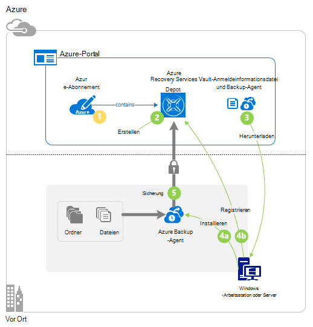
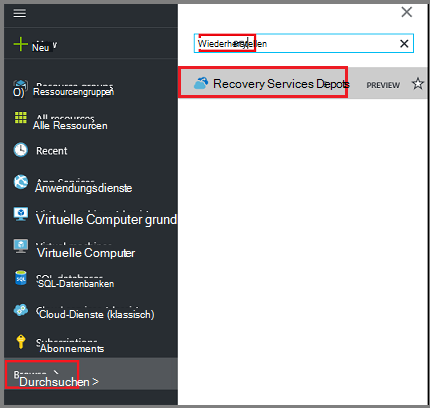
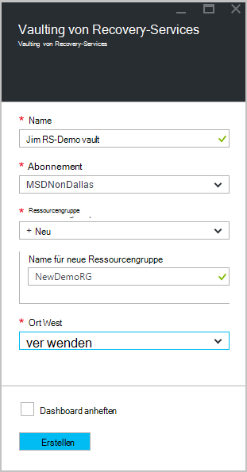
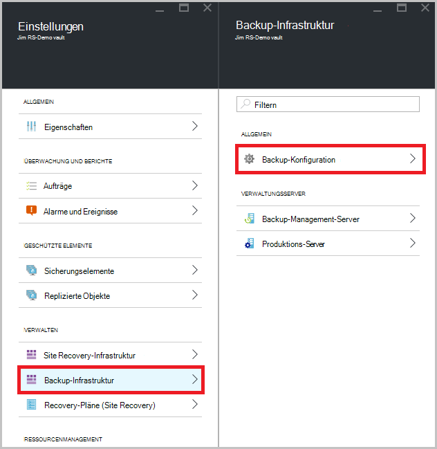
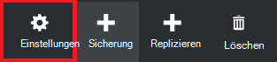
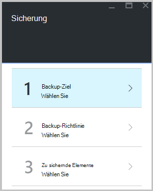
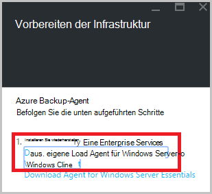
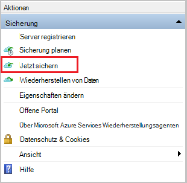
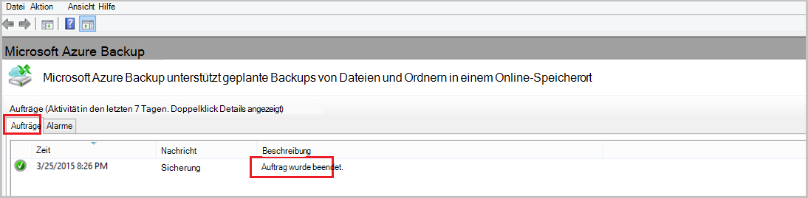

<properties
   pageTitle="Informationen zum Sichern von Dateien und Ordner von Windows Azure Azure-Sicherung mit dem Ressourcen-Manager-Bereitstellungsmodell | Microsoft Azure"
   description="Informationen Sie zum Windows Server-Daten sichern, indem Sie ein Depot erstellen, installieren Sie den Agent Recovery Services und Sichern von Dateien und Ordnern in Azure."
   services="backup"
   documentationCenter=""
   authors="markgalioto"
   manager="cfreeman"
   editor=""
   keywords="wie sichern. wie Sichern"/>

<tags
   ms.service="backup"
   ms.workload="storage-backup-recovery"
   ms.tgt_pltfrm="na"
   ms.devlang="na"
   ms.topic="hero-article"
   ms.date="09/27/2016"
   ms.author="markgal;"/>

# Zunächst: Sichern Sie Dateien und Ordner mit dem Ressourcen-Manager-Bereitstellungsmodell Azure Backup

Erläutert, wie Sichern Sie Ihre Windows-Server (oder Windows-Client) Dateien und Ordner in Azure Azure Backup mit Ressourcen-Manager. Es ist ein Lernprogramm über die Grundlagen gehen soll. Wenn Sie Azure Backup verwenden möchten, können Sie an der richtigen Stelle.

Möchten Sie mehr über Azure Backup, lesen Sie diese [Übersicht](backup-introduction-to-azure-backup.md).

Sichern von Dateien und Ordnern in Azure erfordert diese Aktivitäten:

 Azure-Abonnement zu erhalten (falls nicht bereits vorhanden). 
 Recovery Services Depot erstellen. 
 erforderlichen Dateien. 
 installieren und Registrieren der Agent Recovery Services. 
 Dateien und Ordner sichern.

## Schritt 1: Azure-Abonnement erhalten

Haben Sie ein Azure-Abonnement ein [kostenloses Konto](https://azure.microsoft.com/free/) erstellen Azure Dienste zugreifen.

## Schritt 2: Erstellen eines Depots Recovery Services

Zum Sichern von Dateien und Ordnern müssen Sie Recovery Services im Bereich Tresors Daten gespeichert werden soll. Außerdem müssen festlegen, wie den Speicher repliziert.

### Ein Depot Recovery Services erstellen

1. Wenn Sie bereits, melden Sie sich bei der [Azure-Portal](https://portal.azure.com/) mit der Azure-Abonnement nicht getan.

2. Hub-Menü klicken Sie auf **Durchsuchen** und geben Sie in der Liste der Ressourcen **Recovery Services** und auf **Recovery Services Depots**.

      

3. Klicken Sie im Menü **Recovery Services Depots** **Hinzufügen**.

    

    Recovery Services Depot Blade geöffnet, **Name**, **Abonnements**, **Ressourcengruppe**und **Speicherort**angeben.

    

4. **Name**Geben Sie einen Anzeigenamen zu Tresor.

5. Klicken Sie auf **Abonnement** finden in der Liste der Abonnements.

6. Klicken Sie auf **Gruppe** finden in der Liste der Ressourcengruppen, oder klicken Sie auf **neu** , um eine neue Ressourcengruppe erstellen.

7. Klicken Sie auf **Speicherort** wählen geografische Region für das Depot. Diese Auswahl bestimmt das geografische Gebiet, in dem Ihre Sicherungsdaten gesendet wird.

8. Klicken Sie auf **Erstellen**.

    Nicht Ihrem Tresor aufgeführt, nachdem es abgeschlossen ist, klicken Sie auf **Aktualisieren**. Wenn die Liste aktualisiert wird, klicken Sie auf den Namen des Depots.

### Speicherredundanz bestimmen
Beim Erstellen eines Depots Recovery Services legen Sie fest, wie Speicher repliziert wird.

1. Klicken Sie auf Neues Depot, um das Dashboard zu öffnen.

2. Blatt **Einstellungen** automatisch das Depot Dashboard geöffnet wird, klicken Sie auf **Backup-Infrastruktur**.

3. Klicken Sie auf **Sicherungskonfiguration** **Speichertyp Replikation**anzeigen Blatt Backup-Infrastruktur.

    

4. Auswählen der geeigneten Replikationsoption für vault

    

    Standardmäßig hat der Tresor Geo redundanten Speicher. Bei Verwendung von Azure als primäre backup-Speicher Endpunkt weiterhin Geo redundante Speicherung verwenden. Bei Verwendung von Azure als Endpunkt nicht primäre backup-Speicher wählen Sie lokal redundanten Speicher senken die Kosten für das Speichern von Daten in Azure. Lesen Sie mehr über [Geo-redundant](../storage/storage-redundancy.md#geo-redundant-storage) und [lokal redundanter](../storage/storage-redundancy.md#locally-redundant-storage) Speicher in dieser [Übersicht](../storage/storage-redundancy.md).

Erstellung ein Depots Vorbereiten Ihrer Infrastruktur zum Sichern von Dateien und Ordner durch Downloaden der Microsoft Azure Recovery Services Agent und Vault-Anmeldeinformationen.

## Schritt 3 - Dateien

1. **Klicken Sie im Schaltpult Depot Recovery Services.**

    

2. Klicken Sie auf **Erste Schritte > Backup** auf die Standardeinstellungen.

    

3. Klicken Sie auf die Sicherung **Backup-Ziel** auf.

    

4. Wählen Sie **lokalen** von Where ist Ihre Arbeitslast ausgeführt? Menü.

5. Wählen Sie **Dateien und Ordner** aus womit sichern? Menü, und klicken Sie auf **OK**.

### Recovery Services Agenten herunterladen

1. Klicken Sie auf **Download Agent für Windows Server oder Windows-Client** Blatt **Infrastruktur vorbereiten** .

    

2. **Klicken Sie im Popupmenü herunterladen.** Standardmäßig wird die Datei **MARSagentinstaller.exe** Ordner Downloads gespeichert.

### Vault-Anmeldeinformationen zum Herunterladen

1. Klicken Sie auf **herunterladen > Speichern** auf Blade-Infrastruktur vorbereiten.

    

## Schritt 4 – installieren und registrieren Sie den Agent

>[AZURE.NOTE] Ermöglicht Backup über Azure-Portal kommt bald. Zu diesem Zeitpunkt verwenden Sie Microsoft Azure Services Wiederherstellungsagenten lokalen Dateien und Ordner sichern.

1. Suchen Sie und doppelklicken Sie auf **MARSagentinstaller.exe** Downloads-Ordner (oder anderen Speicherort).

2. Setup-Assistent von Microsoft Azure-Recovery Agent abgeschlossen. Um den Assistenten abzuschließen, müssen Sie:

    - Wählen Sie einen Speicherort für die Installation und Cache-Ordner.
    - Informationen des Proxys Server einen Proxyserver mit dem Internet Verbinden mit.
    - Informationen des Benutzers und Kennwort authentifizierten Proxy verwenden.
    - Die heruntergeladenen Depot Anmeldeinformationen
    - Speichern Sie Verschlüsselung Kennwort an einem sicheren Ort.

    >[AZURE.NOTE] Wenn Sie das Kennwort vergessen oder verlieren, kann keine Hilfe die gesicherten Daten wiederherstellen. Speichern Sie die Datei an einem sicheren Ort. Es muss eine Sicherung wiederherstellen.

Der Agent ist jetzt installiert und Ihr Computer Depot registriert. Sie können konfigurieren und planen die Sicherung.

## Schritt 5: Sichern Sie Ihre Dateien und Ordner

Die erste Sicherung enthält zwei Hauptaufgaben:

- Planen der Sicherung
- Sichern von Dateien und Ordnern zum ersten Mal

Die erste Sicherung verwenden Sie Microsoft Azure Recovery Services-Agenten.

### So planen Sie die Sicherung

1. Öffnen Sie Microsoft Azure Recovery Services-Agenten. Sie finden **Microsoft Azure Backup**Computers suchen.

    

2. Klicken Sie im Agent-Rückgewinnungsservice **Sicherung planen**.

    

3. Klicken Sie auf der Seite Erste Schritte des Assistenten Zeitplan auf **Weiter**.

4. Klicken Sie auf der Seite zu sichernde Elemente wählen Sie **Elemente hinzufügen**.

5. Wählen Sie die Dateien und Ordner, die Sie sichern möchten, und klicken Sie auf **OK**.

6. Klicken Sie auf **Weiter**.

7. Auf der Seite **Sicherungszeitplan angeben** **Sicherungszeitplan** Geben Sie an, und klicken Sie auf **Weiter**.

    Sie können täglich (mit maximal drei Mal pro Tag) oder wöchentliche Backups planen.

    

    >[AZURE.NOTE] Finden Sie für Weitere Informationen an den Sicherungszeitplan [Mit Azure Backup auf Band-Infrastruktur ersetzen](backup-azure-backup-cloud-as-tape.md).

8. Wählen Sie auf der Seite **Aufbewahrungsrichtlinie auswählen** die **Aufbewahrungsrichtlinie** für die Sicherungskopie.

    Die Aufbewahrungsrichtlinie gibt die Dauer die Sicherung gespeichert werden. Anstatt nur eine "flache"Richtlinie für alle backup, können Sie unterschiedliche Aufbewahrungsrichtlinien anhand der Sicherung. Sie können die täglichen, wöchentlichen, monatlichen und jährlichen Aufbewahrungsrichtlinien Ihren Bedürfnissen ändern.

9. Wählen Sie auf der Seite erste Sicherungstyp auswählen den ersten backup. Lassen Sie die Option **automatisch über das Netzwerk** aktiviert, und klicken Sie dann auf **Weiter**.

    Sichern automatisch über das Netzwerk, oder Sie können offline sichern. Der Rest dieses Artikels beschreibt die automatisch. Möchten Sie eine offline-Sicherung haben, lesen Sie den Artikel [Offline backup Workflow in Azure Backup](backup-azure-backup-import-export.md) Weitere Informationen.

10. Überprüfen Sie auf der Seite Bestätigung die Informationen und klicken Sie dann auf **Fertig stellen**.

11. Nach Abschluss des Assistenten den Sicherungszeitplan erstellen klicken Sie auf **Schließen**.

### Dateien und Ordner zum ersten Mal sichern

1. Der Agent Recovery Services klicken Sie auf **Jetzt sichern** führen Sie Seedrouting im Netzwerk.

    

2. Überprüfen Sie auf der Bestätigungsseite Einstellungen, mit denen die jetzt Assistent zum Sichern von dem Computer sichern. Klicken Sie auf **Sichern**.

3. Klicken Sie auf **Schließen** , um den Assistenten zu schließen. Wenn Sie dies tun, bevor die Sicherung abgeschlossen wurde, weiterhin der Assistenten im Hintergrund ausgeführt.

Nachdem die anfängliche Sicherung abgeschlossen ist, wird der Status **abgeschlossen** in der Konsole sichern.

## Haben Sie Fragen?
Wenn Sie Fragen haben oder gibt es Funktion enthalten, angezeigt werden soll [uns Feedback senden](http://aka.ms/azurebackup_feedback).

## Nächste Schritte
- Erfahren Sie mehr über [Windows-Computern sichern](backup-configure-vault.md).
- Damit Sie Ihre Dateien und Ordner gesichert haben, können Sie [Depots und Server verwalten](backup-azure-manage-windows-server.md).
- Benötigen Sie eine Sicherung wiederherstellen möchten, verwenden Sie diesen Artikel auf [Dateien auf einem Windows-Computer](backup-azure-restore-windows-server.md).
