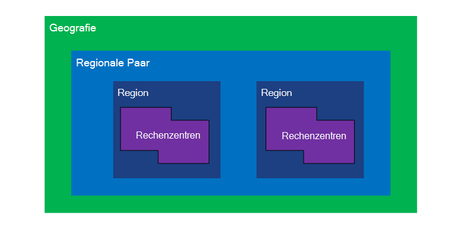
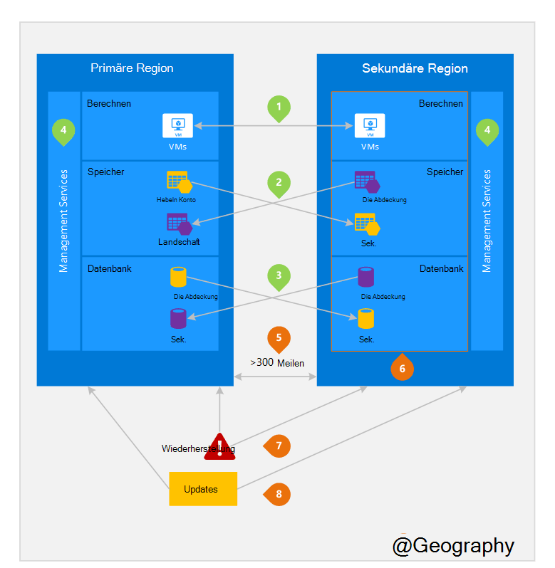

<properties
    pageTitle="Business Continuity und Disaster Recovery (BCDR): Azure kombiniert Bereiche | Microsoft Azure"
    description="Azure regionalen Paare sicherstellen, dass Applikationen während Datenfehler zentriert sind."
    services="site-recovery"
    documentationCenter=""
    authors="rayne-wiselman"
    manager="jwhit"
    editor=""/>

<tags
    ms.service="site-recovery"
    ms.workload="storage-backup-recovery"
    ms.tgt_pltfrm="na"
    ms.devlang="na"
    ms.topic="article"
    ms.date="08/23/2016"
    ms.author="raynew"/>

# Business Continuity und Disaster Recovery (BCDR): Azure kombiniert Bereiche

## Was sind kombiniert Bereiche?

Azure ist in mehreren Ländern auf der ganzen Welt. Azure Geography ist eine definierte der Welt mindestens Azure-Region. Ein Azure Bereich ist ein Bereich innerhalb einer Region enthält eine oder mehrere Rechenzentren.

Eine andere Region innerhalb derselben Region zusammen machen ein regionalen jede Azure Region zugeordnet. Brasilien Süd Region außerhalb seiner verbundenen gilt.

Abbildung 1 – Azure regionalen Paar Diagramm

| Geografie     |  Regionspaaren  |                     |
| :-------------| :-------------   | :-------------      |
| Nordamerika | Norden der USA – zentral | Südlichen zentralen USA    |
| Nordamerika | Osten der USA          | Westen der USA             |
| Nordamerika | Osten der USA 2        | USA Central          |
| Nordamerika | Westen der USA 2        | Westen der USA – zentral     |
| Europa        | Nordeuropa     | Westeuropa         |
| Asien          | Südostasien  | Ostasien           |
| China         | Ost-China       | Nordchina         |
| Japan         | Japan OST       | Japan West          |
| Brazilien        | Brasilien Süd (1) | Südlichen zentralen USA    |
| Australien     | Australien OST   | Australien Südost |
| US-Regierung | US Gov Iowa      | US Gov Virginia     |
| Indien         | Zentrale Indien    | Süd Indien         |
| Kanada        | Kanada zentral   | Kanada Osten         |
| GROßBRITANNIEN            | Großbritannien West          | Großbritannien Süd            |

Tabelle 1: Zuordnung von Azure regionalen Paare

> (1) Brasilien Süd ist eindeutig, da es eine Region außerhalb seiner eigenen zugeordnet ist. Sekundäre Region Süden Brasiliens ist südlichen zentralen USA südlichen zentralen USA des sekundären ist nicht Süden Brasiliens.

Wir empfehlen, über regionale Paare aus Azure Isolation und Verfügbarkeit profitieren Arbeitslasten zu replizieren. Beispielsweise geplante Azure Systemupdates sequenziell bereitgestellt werden (nicht gleichzeitig) in regionspaaren. Dies bedeutet, dass auch in dem seltenen Fall eines fehlerhaften beide Bereiche nicht gleichzeitig betroffen sind. Außerdem wird im unwahrscheinlichen Fall einer breiten Ausfall Recovery mindestens eine Region aus jeder priorisiert.

## Ein Beispiel für regionspaaren
Abbildung 2 zeigt eine hypothetische Anwendung, die regionalen Paar für Disaster Recovery verwendet. Grünen Zahlen markieren Cross-Region Aktivitäten drei Azure Services (Azure Compute, Speicher und Datenbank) und Konfiguration um Regionen zu replizieren. Die eindeutigen Vorteile der gepaarten Regionen werden Zahlen orange hervorgehoben.

Abbildung 2 – hypothetische Azure regionalen Paar

## Cross-Bereich Aktivitäten
Wie in Abbildung 2 bezeichnet.

 **Azure Compute (PaaS)** , müssen zusätzliche Serverressourcen im Voraus dafür Ressourcen stehen in anderen Notfall bereitstellen. Weitere Informationen finden Sie unter [Azure Resiliency technische Anleitung](./resiliency/resiliency-technical-guidance.md).

 **Azure Storage** - Geo-redundanten Speicher (GRS) wird standardmäßig beim Erstellen einer Azure Storage-Konto. Mit GRS ist Ihre Daten automatisch dreimal im Bereich für primäre und dreimal in der gepaarten repliziert. Weitere Informationen finden Sie unter [Azure Redundanz Speicheroptionen](storage/storage-redundancy.md).

 **Azure SQL-Datenbanken** mit Azure SQL Standard Geo-Replikation konfigurieren Sie asynchrone Replikation auf einen paarweisen Bereich. Mit Premium-Geo-Replikation können Sie Replikation in jeder Region der Welt konfigurieren. jedoch wird empfohlen, diese Ressourcen für die meisten Disaster Recovery-Szenarien mit paarweisen Gebiet bereitstellen. Weitere Informationen finden Sie unter [Geo-Replikation in Azure SQL-Datenbank](./sql-database/sql-database-geo-replication-overview.md).

 **Azure Resource Manager (ARM)** - ARM bietet grundsätzlich Regionen logischen Isolierung Service Management-Komponenten. Dies bedeutet, dass logische Fehler in einer Region weniger wahrscheinlich eine andere.

## Vorteile der regionspaaren
Wie in Abbildung 2 bezeichnet.  

**physische Isolation** – Wenn möglich bevorzugt Azure mindestens 300 Meilen zwischen ein paar regionale Rechenzentren, obwohl dies praktisch oder mögliche in allen Regionen. Trennung der physischen Datencenter reduziert die Wahrscheinlichkeit von Naturkatastrophen, Unruhen, Stromausfällen oder physische Netzwerkausfälle gleichzeitig auf beide Bereiche. Isolation ist Einschränkungen Geographie (geografische Größe Power-Netzwerk-Infrastruktur Verfügbarkeit, Vorschriften usw.).  

-**Plattform bereitgestellten Replikation** - einige Dienste wie Geo-redundanten Speicher bieten automatische Replikation gepaarten Region.

**Region Recovery Reihenfolge** – Ausfall eines umfassenden Wiederherstellung von Region erhält aus jeder. Paarweise Regionen Bereitstellung garantiert eine der Regionen mit Priorität wiederhergestellt. Wenn eine Anwendung in Regionen bereitgestellt wird, die nicht verbunden sind, kann Recovery – im schlimmsten Fall verzögert werden die ausgewählten Bereiche die letzten beiden wiederhergestellt werden können.

**sequenziell aktualisiert** – geplante Azure System Updates gepaarte Bereiche nacheinander eingeführt werden (nicht gleichzeitig) minimiert Ausfallzeiten, die Auswirkung von Fehlern und logische Fehler selten fehlerhafte Aktualisierung.

**Daten Residency** -Region innerhalb derselben Region als das Paar (außer Brasilien Süd) befindet, um Daten vor-Ort- und Zuständigkeit der Durchsetzung von Anforderungen.

