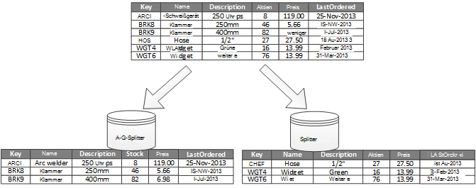
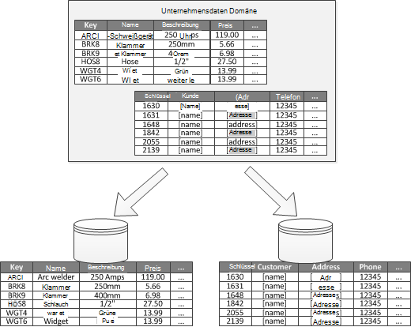

<properties
   pageTitle="Datenpartitionierung Hinweise | Microsoft Azure"
   description="Anleitung für separate Partitionen verwaltet und separat zugegriffen."
   services=""
   documentationCenter="na"
   authors="dragon119"
   manager="christb"
   editor=""
   tags=""/>

<tags
   ms.service="best-practice"
   ms.devlang="na"
   ms.topic="article"
   ms.tgt_pltfrm="na"
   ms.workload="na"
   ms.date="07/14/2016"
   ms.author="masashin"/>

# Partitionierung Leitfaden Daten

[AZURE.INCLUDE [pnp-header](../includes/guidance-pnp-header-include.md)]

## Übersicht

In vielen großen Projektmappen werden Daten in separate Partitionen unterteilt, die verwaltet und separat zugegriffen werden kann. Die Partitionierungsstrategie muss sorgfältig gewählt werden, die Vorteile zu maximieren und minimieren Nebenwirkungen. Partitionierung können Skalierbarkeit verbessern, Konflikte verringern und die Performance optimiert. Ein weiterer Vorteil der Partitionierung ist, dass es Mechanismus Division von Daten durch das Muster verwenden kann. Beispielsweise können Sie ältere, weniger aktive (cold) Daten billiger Daten archivieren.

## Warum partitionieren Daten?

Die meisten Cloudanwendungen Dienste speichern und Abrufen von Daten als Teil der Vorgänge. Das Design der Anwendung ein Datenspeicher können einen erheblichen Einfluss auf Leistung, Durchsatz und Skalierbarkeit eines Systems. Eine Technik, die häufig in großen Systemen angewendet werden die Daten in verschiedenen Partitionen unterteilen.

> Der Begriff _Partitionierung_ , die in diesem Handbuch verwendet ist, der Vorgang physisch in separaten Datenspeichern. Dies ist nicht dasselbe wie SQL Server Tabellenpartitionierung einen anderen Begriff.

Partitionieren von Daten bieten eine Reihe von Vorteilen. Sie können z. B. um angewendet werden:

- **Verbessern skalierbar**. Beim Skalieren von einem einzelnen Datenbanksystem erreicht er maximal physischen Hardware. Wenn Daten über mehrere Partitionen, die, die jeweils auf einem eigenen Server gehostet wird unterteilen, können Sie das System beinahe unbegrenztes Skalieren.
- **Verbessern der Leistung**. Daten sind für jede Partition erfolgt über eine kleinere Datenmenge. Sofern in geeigneter Weise Daten partitioniert ist, kann Partitionierung Ihr System effizienter. Vorgänge, die mehr als eine Partition betreffen können parallel ausgeführt. Jede Partition in der Nähe der Anwendung befinden, die Netzwerklatenz minimieren verwendet.
- **Verfügbarkeit verbessern**. Trennen von Daten über mehrere Server verhindert ein Einzelpunktversagen. Wenn ein Server ausfällt oder ist geplante Wartung der Daten ist Partition nicht verfügbar. Auf anderen Partitionen können fortgesetzt werden. Erhöhen der Anzahl von Partitionen verringert die relative ein einzelner Server ausfällt durch Reduzierung des Prozentsatzes der Daten nicht verfügbar. Jede Partition replizieren kann weitere aus eine einzelne Partition die Operationen vermeiden. Auch macht es möglich, wichtige Daten, die fortlaufend sein muss und hoher Verfügbarkeit von geringem Wert niedrigere Anforderungen (z. B. Protokolldateien) hat.
- **Sicherheit verbessern**. Je nach Art der Daten und wie partitioniert möglicherweise sensible und nicht sensible Daten in verschiedenen trennen Partitionen und daher in verschiedenen Servern oder Daten speichert. Sicherheit kann dann speziell für vertraulichen Daten optimiert werden.
- **Flexibilität bieten**. Partitionierung bietet viele fein Vorgänge optimieren, Maximierung der Effizienz und Kosten minimiert. Beispielsweise können Sie verschiedene Strategien für Management, Überwachung, Backup und Wiederherstellung und andere Verwaltungsaufgaben basierend auf der Wichtigkeit der Daten in jeder Partition definieren.
- **Übereinstimmung der Datenspeicher Muster verwenden**. Partitionierung ermöglicht jede Partition auf einem anderen Datenspeicher basierend auf Kosten und Funktionen, bietet Datenspeicher bereitgestellt werden. Große binäre Daten können beispielsweise in einem Blob-Datenspeicher gespeichert werden, während weitere strukturierte Daten in einer Datenbank befinden können. Weitere Informationen finden Sie unter [eine mehrsprachige Lösung] im Patterns & Practices Guide und [Datenzugriff für hoch skalierbare Projektmappen: SQL verwenden NoSQL und mehrsprachige Persistenz] auf der Microsoft-Website.

Partitionierung Kosten als Vorteil es gilt implementiert einige Systeme nicht. Häufige Gründe für diese Begründung

- Viele Speichersysteme unterstützen keine Joins partitionsübergreifend und referenzielle Integrität in einem partitionierten schwierig sein. Häufig müssen Joins implementieren und Integrität überprüft im Anwendungscode (Partitionierung Layer) zusätzliche e/a und Anwendungskomplexität führen kann.
- Verwalten von Partitionen ist nicht immer eine einfache Aufgabe. In einem System, in dem die Daten flüchtig ist, müssen Sie die Partitionen regelmäßig, um Konflikte und Hotspots reduzieren auszugleichen.
- Einige gängige Tools funktionieren natürlich nicht partitionierten Daten.

## Entwerfen von Partitionen

Daten können auf unterschiedliche Weise aufgeteilt: horizontal, vertikal oder funktional. Die von Ihnen gewählte Strategie hängt den Grund für die Partitionierung der Daten und die erforderlichen Programme und Dienste, die die Daten verwenden.

> [AZURE.NOTE] In dieser Anleitung beschriebene Partitionierungsschemas werden erklärt, die unabhängig von der zugrunde liegenden Daten-Storage-Technologie. Sie können auf viele Arten von Datenspeichern, einschließlich relationalen und NoSQL-Datenbanken angewendet werden.

### Partitionierungsstrategien

Normalen Strategien für das Partitionieren von Daten sind:

- **Horizontale Partitionierung** (häufig als _Sharding_bezeichnet). In dieser Strategie jeder Partition ist ein Datenspeicher eigene alle Partitionen das gleiche Schema aufweisen Jede Partition wird als _Splitter_ bezeichnet und enthält eine Teilmenge der Daten wie die Aufträge für einen bestimmten Satz von Kunden in einer e-Commerce-Anwendung.
- **Vertikale Partitionierung**. Bei dieser Strategie enthält jede Partition eine Teilmenge der Felder für Elemente in der Datenquelle. Die Felder werden nach deren Muster unterteilt. Häufig verwendete Felder können z. B. eine vertikale Partition und weniger häufig verwendete Felder in einer anderen platziert werden.
- **Funktionale Partitionierung**. Bei dieser Strategie werden Daten nach jeder begrenzte Kontext im System Verwendung zusammengefasst. Z. B. eine e-Commerce-System implementiert trennen Geschäftsfunktionen für Fakturierung, Warenbestand verwalten kann Datenspeicher Rechnung in einer Partition und Produkt Bestandsdaten in einem anderen.

Es ist wichtig zu beachten, dass die hier beschriebenen Strategien kombiniert werden können. Wir empfehlen, dass Sie alle ein Partitionierungsschema entwerfen sie stehen nicht gegenseitig. Sie können z. B. Splitter Daten unterteilen und verwenden Sie vertikale Partitionierung, um die Daten in jeder Splitter weiter unterteilen. Entsprechend können die Daten in eine funktionale Partition Splitter aufgeteilt werden (die auch vertikal partitioniert werden können).

Jedoch können die unterschiedlichen Anforderungen der einzelnen Strategien Anzahl in Konflikt stehende Probleme auslösen. Sie evaluieren und Saldo aller beim ein Partitionierungsschema entwerfen, die die allgemeine Datenverarbeitung Leistungsziele für Ihr System erfüllt. In den folgenden Abschnitten untersuchen Strategien ausführlich.

### Horizontale Partitionierung (Sharding)

Abbildung 1 zeigt eine Übersicht der horizontalen Partitionierung oder Sharding. In diesem Beispiel Bestandsdaten Produkt basierend auf den Product Key Splitter gliedert. Jeder Splitter enthält die Daten für einen zusammenhängenden Bereich von Splitter Tasten A bis G und H-Z alphabetisch.

_Abbildung 1. Horizontale Partitionierung (Sharding) Daten auf einer partition_

Sharding können Sie mehrere Computer, die Konflikte verringert und die Leistung verbessert die Last verteilt. Skaliert das System durch weitere Splitter auf weiteren Servern ausführen.

Der wichtigste Faktor bei der Umsetzung dieser Strategie zur Festplattenpartitionierung ist die Wahl der shardingschlüssel. Es ist schwierig, den Schlüssel zu ändern, nachdem das System in Betrieb ist. Der Schlüssel müssen Daten partitioniert werden, so dass die Arbeitslast gleichmäßig über das Splitter ist.

Beachten Sie, dass verschiedene Splitter nicht ähnliche Datenmengen enthalten. Vielmehr ist wichtigere Aspekt die Anzahl der Anfragen zu verteilen. Einige Splitter möglicherweise sehr groß, aber jedes Element ist eine geringe Anzahl von Zugriffen. Andere Splitter können kleiner sein, aber jedes Element häufiger zugegriffen. Es ist auch wichtig, dass ein Splitter Skalierung Grenzwerte (hinsichtlich Kapazität und Verarbeitungsressourcen) des Datenspeichers nicht überschreitet, mit dem host, Splitter.

Verwenden Sie ein shardingschema vermeiden Hotspots (oder hot-Partitionen) beeinflussen die Leistung und Verfügbarkeit. Verwenden Sie einen Hash einen Kundenbezeichner statt den ersten Buchstaben des Kundennamens verhindern Sie die unausgeglichene Verteilung aus häufige und weniger häufige Anfangsbuchstaben. Dies ist ein übliches Verfahren, die Partitionen Daten gleichmäßig verteilt.

Wählen Sie eine shardingschlüssel, die alle zukünftigen Bedarf große Splitter in kleinere Teile aufgeteilt minimiert zusammengefügten kleine Splitter in größere Partitionen oder ändern Sie das Schema, das die Daten in einer Reihe von Partitionen beschreibt. Diese Vorgänge können sehr zeitaufwändig sein und müssen mindestens Splitter offline geschaltet, während sie ausgeführt werden.

Splitter repliziert werden, möglicherweise einige Replikate online halten andere Teilen, zusammengeführt oder neu konfiguriert werden. Das System müssen jedoch Vorgänge begrenzen, die auf die Daten in diese Splitter ausgeführt werden können, während die Neukonfiguration stattfindet. Beispielsweise können die Daten in den Replikaten zu Inkonsistenzen einschränken, die auftreten können, während Splitter umstrukturiert werden schreibgeschützt gekennzeichnet werden.

> [Sharding Muster]finden Sie detaillierte Informationen und Hinweise zu viele dieser Aspekte und bewährte Techniken für den Entwurf von Datenspeichern, die horizontale Partitionierung implementieren.

### Vertikale Partitionierung

Die häufigste Verwendung für die vertikale Partitionierung ist die e/a und Leistung Kosten Elemente abrufen, die am häufigsten zugegriffen. Abbildung 2 zeigt ein Beispiel für die vertikale Partitionierung. In diesem Beispiel werden verschiedene Eigenschaften für jedes Datenelement in verschiedene Partitionen gespeichert. Eine Partition enthält Daten, die einschließlich Name, Beschreibung und Preisinformationen für Produkte häufiger zugegriffen wird. Ein anderes enthält das Volumen und das Datum der letzten bestellten.

_Abbildung 2. Vertikalen Partitionierung von Daten durch die Muster_

In diesem Beispiel fragt die Anwendung regelmäßig Produktname, Beschreibung und Preis beim Kunden Produktdetails anzeigen. Lagerbestand und Datum, wenn das Produkt zuletzt vom Hersteller bestellten, werden auf einer separaten Partition aufrechterhalten, da diese beiden Elemente häufig zusammen verwendet werden.

Dieses Partitionierungsschema hat den Vorteil, dass mehr dynamischen Daten (Lagerbestand und Datum geordnete) Daten relativ langsam (Produktname, Beschreibung und Preis) getrennt ist. Eine Anwendung unter Umständen vorteilhaft langsam Daten im Arbeitsspeicher zwischenzuspeichern, wenn häufig zugegriffen wird.

Eine andere Situation dieser Strategie zur Festplattenpartitionierung ist die Sicherheit der Daten zu maximieren. Beispielsweise können Sie hierzu Kreditkartennummern und die entsprechende Sicherheit Überprüfung Kartennummern in separaten Partitionen gespeichert.

Vertikale Partitionierung kann auch den gleichzeitigen Zugriff verringern, der auf die Daten erforderlich ist.

> Vertikale Partitionierung arbeitet auf Entitätsebene in einem Datenspeicher teilweise normalisieren eine Entität, um von einer _breiten_ Satz Elemente _einschränken_ brechen sie. Es eignet sich für HBase wie Cassandra spaltenorientierten Datenspeicher. Wenn die Daten in einer Auflistung von Spalten ändern, können Sie auch erwägen Spalte Speicher in SQL Server.

### Funktionale Partitionierung

Für Systeme, gebundenen Kontext für jede unterschiedliche Bereich oder in der Anwendung identifiziert werden kann, bietet funktionale Partitionierung ein Verfahren zur Verbesserung der Leistung von Isolation und Access. Eine andere wird funktionale Partitionierung zu Berichtszwecken verwendet schreibgeschützte Daten schreibgeschützte Daten trennen. Abbildung 3 zeigt eine Übersicht der funktionalen Partitionierung, Daten von Kundendaten getrennt.

_Abbildung 3. Funktionell Datenpartitionierung gebundenen Kontext oder untergeordnete Domäne_

Diese Strategie zur Festplattenpartitionierung kann Datenkonflikte Zugriff auf verschiedene Teile eines Systems beitragen.

## Entwerfen von Partitionen für Erweiterbarkeit

Es ist wichtig, Größe und Arbeitslast für jede Partition und Gleichgewicht, damit Daten verteilt werden, um maximale Skalierbarkeit zu erzielen. Jedoch müssen Sie die Daten auch partitionieren, damit die Skalierung Grenzen eines einzelnen Partition nicht überschritten wird.

Beim Entwerfen von Partitionen Skalierbarkeit gehen Sie folgendermaßen vor:

1. Die Anwendung Zugriffsmuster Daten wie jede Abfrage zurückgegebene Resultset analysieren, Häufigkeit Zugriff inhärente Latenz und die serverseitige Verarbeitung berechnen. Einige Hauptelemente Verlangen der Verarbeitung Ressourcen.
2. Mithilfe dieser Analyse Ziele aktuelle und zukünftige Erweiterbarkeit Arbeitslast wie Größe bestimmen. Anschließend verteilt die Daten auf die Partitionen Skalierbarkeit Ziels. Horizontalen Partitionierungsstrategie ist die Auswahl des entsprechenden Splitter Schlüssels wichtig, sicherzustellen, dass auch die Verteilung ist. Weitere Informationen finden Sie unter [Sharding-Muster].
3. Stellen Sie sicher, dass Ressourcen für jede Partition Skalierbarkeitsanforderungen Datengröße und Durchsatz behandelt werden. Der Knoten, der eine Partition befindet könnte beispielsweise eine Obergrenze für verfügbaren Speicherplatz, Leistung oder darüber Netzwerkbandbreite Verarbeitung vorsehen. Wenn die Speicherung und Verarbeitung Anforderungen wahrscheinlich diese Grenzwerte überschreitet, kann das optimieren die Partitionierungsstrategie oder weitere Daten Teilen erforderlich sein. Z. B. möglicherweise ein Skalierbarkeit Ansatz die Kernfunktionen der Anwendung Daten trennen. Dazu mit separaten Datenspeichern um Datenspeicherbedarf von Skalierung Überschreitung des Knotens zu verhindern. Überschreitet die Gesamtzahl der Datenspeicher die Knoten, möglicherweise getrennten Knoten verwendet werden.
4. Überwachen Sie das System verwendet die Daten wie erwartet verteilt werden und die Partitionen die Last verarbeiten können, die auf diese. Es ist möglich, dass die Verwendung nicht die Verwendung, die der Analyse erwarten. In diesem Fall kann die Partitionen neu möglich. Andernfalls können einige Teile des Systems erforderlich Gleichgewicht zu entwerfen erforderlich.

Beachten Sie, dass einige Cloud-Umgebung Infrastruktur hinweg Ressourcen zuordnen. Sicherstellen Sie, dass die Grenzen der ausgewählten Berandung ausreichend Platz für alle erwartete Wachstum der Datenmenge Datenspeicher, Leistung und Bandbreite.

Beispielsweise verwenden Azure-Tabellenspeicher müssen beschäftigt Splitter mehr Ressourcen als eine einzelne Partition Anfragen zur Verfügung stehen. (Es gibt eine Begrenzung für Abfragen, die von einer Partition in einem bestimmten Zeitraum verarbeitet werden kann. Finden Sie auf der Seite [Azure Skalierbarkeits- und Ziele] der Microsoft-Website Weitere Informationen.)

 Wenn dies der Fall ist, müssen der Splitter neu partitioniert werden, um die Last zu verteilen. Übersteigt die Größe oder Durchsatz dieser Tabellen Kapazität ein Speicherkonto, möglicherweise zusätzliche Speicherkonten erstellt und diese Konten Tabellen verteilt. Übersteigt die Anzahl Speicherkonten die Anzahl der Konten, die für ein Abonnement verfügbar sind, können mehrere Abonnements verwenden werden.

## Entwerfen von Partitionen für Leistung

Abfrage-Leistung kann oft mit kleinere Datasets und parallele Abfragen gesteigert werden. Jede Partition sollte einen kleinen Anteil der gesamten Datenmenge enthalten. Diese Reduzierung kann die Leistung von Abfragen verbessern. Allerdings ist das Partitionieren nicht Alternative zum Entwerfen und Konfigurieren einer Datenbank entsprechend. Stellen Sie beispielsweise sicher, dass Sie die erforderlichen Indizes haben verwenden eine relationale Datenbank.

Beim Entwerfen von Partitionen für Leistung gehen Sie folgendermaßen vor:

1. Untersuchen Sie die Anforderungen und Leistung:
    - Verwenden der Geschäftserfordernissen wichtigen Abfragen bestimmt, die immer schnell ausführen müssen.
    - Überwachen Sie das System Abfragen identifizieren, die langsamer.
    - Festlegen Sie, welche Abfragen am häufigsten ausgeführt werden. Eine Instanz jeder Abfrage möglicherweise kostengünstige, aber der kumulative Ressourcenverbrauch Anspruch. Möglicherweise für diese Abfragen in eine unterschiedliche Partition oder sogar einen Cache abgerufen wird trennen.
2. Partitionieren der Daten, die eine geringe Leistung verantwortlich ist:
    - Die Größe der einzelnen Partitionen, damit die Antwortzeit im Ziel ist.
    - Entwerfen Sie Splitter-Schlüssel so, dass die Anwendung die Partition finden Wenn Sie horizontale Partitionierung. Dies verhindert die Abfrage jede Partition durchsuchen.
    - Berücksichtigen Sie den Standort einer Partition. Versuchen Sie möglichst, Speichern von Daten in Partitionen, die geografisch Applikationen und Benutzern, die darauf zugreifen.
3. Verwenden Sie eine Entität Durchsatz und Abfrage Anforderungen verfügt, funktionale Partitionierung basierend auf dieser Entität. Wenn dies dennoch der gerecht nicht wenden Sie sowie horizontale Partitionierung an In den meisten Fällen reicht eine einzelne Partitionierungsstrategie, aber in einigen Fällen ist es effizienter, beide Strategien kombinieren.
4. Verwenden Sie asynchrone Abfragen parallel partitionsübergreifend Leistung ausgeführt.

## Entwerfen von Partitionen für Verfügbarkeit

Partitionieren der Daten verbessern die Verfügbarkeit der Anwendung durch, dass das gesamte Dataset keine einzelne Fehlerquelle dar und einzelne Teilmenge Dataset unabhängig voneinander verwaltet werden können. Replikation von Partitionen, die wichtige Daten enthalten kann auch die Verfügbarkeit verbessern.

Beim Entwerfen und Implementieren von Partitionen, Faktoren Sie die folgenden, die Verfügbarkeit auswirken:

- **Bedeutung der Daten an**. Einige Daten möglicherweise wichtige Geschäftsdaten Rechnungsdetails oder Transaktionen enthalten. Andere Daten möglicherweise weniger wichtige operative Daten wie Protokolldateien Leistung Spuren, und enthalten. Nach dem Ermitteln der jeweiligen Daten, sollten Sie:
    - Speichern von Daten in hochgradig verfügbaren Partitionen mit einem geeigneten Sicherungsplans.
    - Getrennte Verwaltung festlegen und Überwachen von Mechanismen oder Verfahren für die verschiedenen schöpfungsprozess von jedem Dataset. Platzieren Sie Daten gleicher Bedeutung in der gleichen Partition, damit sie zusammen mit angemessener Häufigkeit gesichert werden können. Partitionen, die Daten für Transaktionen müssen möglicherweise häufiger als Partitionen gesichert werden, die Protokollierung oder Ablaufverfolgungsinformationen enthalten.
- **Wie die einzelne Partitionen verwaltet werden können**. Entwerfen von Partitionen unabhängige Verwaltung und Wartung Unterstützung bietet mehrere Vorteile. Zum Beispiel:
    - Schlägt eine Partition können einzeln wiederhergestellt werden ohne Instanzen von Applikationen, die Partitionen zugreifen.
    - Partitionieren von Daten nach geografischen Regionen kann Geplante Wartungsaufgaben zu Zeiten für jeden Standort. Sicherstellen Sie, dass die Partitionen nicht verhindern, dass eine geplante Wartung während dieses Zeitraums abgeschlossen werden.
- **Ob wichtige Daten über Partitionen replizieren**. Diese Strategie verbessern Verfügbarkeit und Performance zwar auch Konsistenzprobleme einführen können. Zeit, geänderte Daten in einer Partition mit jedem Replikat synchronisiert werden. Während dieses Zeitraums enthält verschiedene Partitionen unterschiedliche Werte.

## Grundlegendes zur Partitionierung Entwicklung Einfluss

Mit der Partitionierung erhöht die Komplexität der Entwurf und die Entwicklung des Systems. Erwägen Sie Partitionierung als wesentliche Bestandteile System Design auch dann, wenn das System zunächst nur eine Partition enthält. Wenn Sie beim Systemstart Leistung und Skalierbarkeitsprobleme Nachträgliches, Partitionierung Adresse, steigt die Komplexität, da bereits ein live-System zu.

Bei der Aktualisierung des Systems integrieren Partitionierung in dieser Umgebung erfordert es die Datenzugriffslogik ändern. Außerdem auch Migration großer Datenmengen vorhandenen partitionsübergreifend, oft verteilen erwarten Benutzer weiterhin das System.

In einigen Fällen ist Partitionierung nicht wichtig betrachtet, da das ursprüngliche Dataset klein ist und einfach von einem Server behandelt werden. Dies wäre möglich, in einem System, die nicht über ihre Anfangsgröße hinaus skalieren soll jedoch viele kommerzielle Systeme müssen wie die Anzahl der Benutzer steigt. Diese Erweiterung wird normalerweise von Zunahme der Datenmenge begleitet.

Es ist auch wichtig zu verstehen, dass partitionieren nicht immer eine Funktion große Datenspeicher. Beispielsweise kann ein kleine Datenspeicher stark Hunderte von Clients gleichzeitig zugegriffen werden. Partitionieren der Daten in dieser Situation können Konflikte verringern und den Durchsatz verbessern.

Berücksichtigen Sie ein Partitionierungsschema Daten entwerfen sollten Sie Folgendes:

- **Möglichkeit, Daten für die häufigsten Datenbankoperationen zusammen in jeder Partition zu kreuzförmigen Datenzugriffsoperationen**. Abfragen von Partitionen kann mehr Zeit als nur innerhalb einer einzelnen Partition Abfragen, aber Partitionen für eine Reihe von Abfragen optimieren beeinträchtigen könnte andere Sätze von Abfragen. Wenn Sie Partitionen Abfragen vermeiden können, minimieren Sie Abfragezeit parallele Abfragen und aggregiert die Ergebnisse innerhalb der Anwendung. Dieser Ansatz nicht möglicherweise in einigen Fällen, z. B. erhalten ein Ergebnis aus einer Abfrage und in der nächsten Abfrage erforderlich.
- **Bei Abfragen von relativ statischen Referenzdaten Produktlisten oder Postleitzahl Tabellen verwenden, sollten Sie diese Daten in allen Partitionen Notwendigkeit separate Suchvorgänge in anderen Partitionen zu replizieren**. Dieser Ansatz kann auch die Wahrscheinlichkeit von Referenzdaten zu "hot" Dataset starker Datenverkehr aus dem gesamten System unterliegt. Es ist jedoch eine zusätzliche Kosten Synchronisieren von Änderungen, die diese Referenzdaten auftreten können.
- **Gegebenenfalls Auflagen für die referenzielle Integrität über vertikale und funktionale Partitionen minimieren**. In diesen Schemen ist die Anwendung selbst verantwortlich für referenzielle Integrität partitionsübergreifend Wenn Daten aktualisiert und verbraucht. Abfragen, die Daten über mehrere Partitionen Anschließen langsamer als Abfragen, die Daten in der Partition an, da die Anwendung normalerweise aufeinander folgende basiert auf einem Schlüssel und anschließend auf einen Fremdschlüssel Abfragen muss. Stattdessen Sie replizieren oder heben die relevanten Daten normalisieren. Minimiert die Abfrage dem kreuzförmigen Joins sind parallele Abfragen über die Partitionen und Verknüpfen der Daten innerhalb der Anwendung.
- **Sollten Sie den Effekt, den das Partitionierungsschema auf die Datenkonsistenz Partitionen haben kann.** Prüfen Sie, ob starker Konsistenz tatsächlich erforderlich ist. Stattdessen ist eine gängige Methode in der Cloud eventual Consistency implementieren. Die Daten in jeder Partition separat aktualisiert und die Anwendungslogik wird sichergestellt, dass die Updates alle erfolgreich abgeschlossen werden. Es behandelt auch die Abfragen von Daten während einer schließlich konsistenten Betrieb entstehen können Inkonsistenzen. Weitere Informationen zum Implementieren von eventual Consistency [Konsistenz Primer Daten]anzeigen
- **Betrachten Sie, wie Abfragen die richtige Partition finden**. Scannt eine Abfrage alle Partitionen, um die erforderlichen Daten suchen muss, wird ein erheblichen Einfluss auf die Leistung sogar mehrere parallele Abfragen ausgeführt werden. Abfragen, die mit vertikalen und funktionalen Partitionierungsstrategien können natürlich Partitionen. Horizontale Partitionierung (Sharding) können jedoch ein Element nur schwer suchen, da jeder Splitter dasselbe Schema verfügt. Eine gebräuchliche Lösung für Sharding ist eine Zuordnung zu verwalten, die mit den Splitter Speicherort für bestimmte Daten suchen. Diese Zuordnung kann in der Sharding-Logik der Anwendung implementiert oder vom Datenspeicher verwaltet, wenn transparente Sharding unterstützt.
- **Mit einer horizontalen Partitionierungsstrategie berücksichtigen regelmäßig Lastausgleich der Splitter**. Dadurch werden die Daten gleichmäßig verteilen, Größe und Arbeitslast Hotspots minimieren und Maximieren der Leistung physischen Speicher eingeschränkt zu umgehen. Dies ist jedoch eine komplexe Aufgabe, die häufig die Verwendung eines benutzerdefinierten Tools oder Prozesses erforderlich sind.
- **Wenn Sie jede Partition replizieren bietet zusätzlichen Schutz gegen Ausfälle**. Fällt ein Replikat können Abfragen auf eine Arbeitskopie gerichtet.
- **Erreicht die Grenzen einer Partitionierungsstrategie müssen die Skalierung auf eine andere Ebene zu erweitern**. Beispielsweise ist die Partitionierung auf Datenbankebene möglicherweise suchen oder Partitionen in mehreren Datenbanken repliziert. Wenn Partitionierung bereits auf der Datenbankebene ist und physische Grenzen sind, bedeuten suchen oder Partitionen hosting Konten replizieren möchten.
- **Vermeiden Sie Transaktionen, die Daten in mehrere Partitionen zugreifen**. Einige Shops implementieren transaktionale Datenkonsistenz und Datenintegrität für Vorgänge ändern, die Daten aber nur, wenn die Daten in einer einzelnen Partition befinden. Wenn Sie über mehrere Partitionen transaktionale Unterstützung benötigen, müssen Sie wahrscheinlich als Teil der Anwendungslogik zu implementieren, da die Partitionierung Systeme keine systemeigenen Unterstützung bieten.

Alle Datenspeicher erfordern einige Betriebsmanagement und Überwachung. Die Aufgaben können zwischen Daten laden, Sichern und Wiederherstellen von Daten, Daten und sicherstellen, dass das System ordnungsgemäß und effizient arbeitet.

Faktoren Sie die folgenden, die betriebliche Verwaltung:

- **Das entsprechende Management und operative Aufgaben, wenn die Daten partitioniert werden**. Diese Aufgaben gehören Backup und Wiederherstellung, Archivierung, überwachen das System und andere Verwaltungsaufgaben. Verwalten von logische Konsistenz bei Backup und Wiederherstellung kann z. B. eine Herausforderung sein.
- **Zum Laden von Daten in mehrere Partitionen und Hinzufügen von neuen Daten, die aus anderen Quellen ist**. Einige Tools und Dienstprogramme unterstützen Sharding Datenvorgänge wie das Laden von Daten in die richtige Partition. Dies bedeutet, dass Sie möglicherweise erstellen oder neue Tools und Dienstprogramme.
- **Archivieren und löschen die Daten regelmäßig**. Vermeidung übermäßige Wachstum von Partitionen müssen Sie archivieren und Löschen von Daten in regelmäßigen Abständen (z. B. monatlich). Sie werden zum Transformieren der Daten verschiedene Archiv Schema angepasst.
- **Wie Sie Probleme mit der Datenintegrität finden**. Ggf. eine periodische Verarbeitung Datenintegritätsproblemen wie in einer Partition zu finden, die fehlenden Informationen in einer anderen verweist. Der Prozess kann versuchen, diese Probleme automatisch zu beheben oder eine Warnung an einen Operator die Probleme manuell beheben auslösen. Beispielsweise in einer e-Commerce-Anwendung Informationen möglicherweise werden in einer Partition, aber Positionszeilen, die jeden Auftrag bilden kann stattfinden in einer anderen. Der Prozess einer muss Daten auf anderen Partitionen hinzufügen. Wenn sich dieser Vorgang Positionsartikel fehlschlägt für gespeichert werden möglicherweise gibt es keine entsprechende Reihenfolge.

Verschiedene Technologien bieten in der Regel ihre eigenen Funktionen Partitionierung unterstützen. In den folgenden Abschnitten zusammengefasst die Optionen, die üblicherweise von Azure Applications Datenspeichern implementiert werden. Sie beschreiben außerdem Aspekte des Entwurfs von Programmen, die diese Funktionen am besten nutzen können.

## Partitionierungsstrategien für Azure SQL-Datenbank

Azure SQL-Datenbank ist eine relationale Datenbank-als-a-Service, der in der Cloud ausgeführt wird. Er basiert auf Microsoft SQL Server. Eine relationale Datenbank Informationen in Tabellen unterteilt, und jede Tabelle enthält Informationen über Entitäten als eine Reihe von Zeilen. Jede Zeile enthält Spalten mit den Daten für die einzelnen Felder einer Entität. Die Seite [Neuigkeiten Azure SQL-Datenbank?] auf der Microsoft Website enthält eine ausführliche Dokumentation zum Erstellen und Verwenden von SQL-Datenbanken.

## Horizontale Partitionierung elastische Datenbank

Eine einzelne SQL-Datenbank hat beschränkt die Datenmenge, die es enthalten kann. Durchsatz ist eingeschränkt, Architektur Faktoren und die Anzahl der aktiven Verbindungen unterstützt. Das Feature elastische Datenbank SQL-Datenbank unterstützt horizontale Skalierung für eine SQL-Datenbank. Elastische Datenbank verwenden, können Sie Ihre Daten in Splitter partitionieren, die SQL-Datenbanken verteilt werden. Sie können auch hinzufügen oder Entfernen von Splitter als Daten behandelt vergrößert und verkleinert. Elastische Datenbank hinaus können Konflikte verringern, indem Sie die Last auf Datenbanken verteilt.

> [AZURE.NOTE] Elastische Datenbank ist ein Ersatz für die Funktion Verbände Azure SQL-Datenbank. Vorhandene SQL-Datenbank Föderation Installationen elastische Datenbank mithilfe des Dienstprogramms Verbünden Migration migriert werden können. Alternativ können Sie Sharding Mechanismus implementieren, wenn das Szenario nicht natürlich eignet sich zu Funktionen, die elastische Datenbank bereitgestellt werden.

Jeder Splitter wird als SQL-Datenbank implementiert. Einen kann mehrere Datasets (als _Shardlet_bezeichnet) enthalten. Jede Datenbank verwaltet Metadaten zur Beschreibung der Shardlets, die es enthält. Ein Shardlet kann ein einzelnes Datenelement oder eine Gruppe von Elementen, die den gleichen Shardlet Schlüssel sein. Sind Sharding Daten in einer mehrinstanzenfähigen Anwendung der Shardlet-Schlüssel kann die Mandanten-ID ein, und alle Daten für einen bestimmten Mandanten als Teil der gleichen Shardlet stattfinden. Daten für andere Mieter würden in verschiedenen Shardlets gehalten werden.

Es obliegt der Programmierer ein Dataset mit einem Shardlet-Schlüssel zuordnen. Eine separate SQL-Datenbank fungiert als eine globale shardzuordnungs-Manager. Diese Datenbank enthält eine Liste aller Splitter und Shardlets im System. Eine Clientanwendung, die auf Daten zugreift Verbindung zunächst die globale Splitter Karte Manager-Datenbank zu einer Kopie des Splitter (Auflistung Splitter und Shardlets), die dann lokal zwischengespeichert.

Die Anwendung dann anhand dieser Informationen die Weiterleitung von Datenanfragen entsprechenden Splitter. Dies ist eine Reihe von APIs verdeckt, die in der Azure SQL-Datenbank elastische Datenbank-Clientbibliothek, als ein NuGet-Paket enthalten sind. Die Seite [elastische Datenbank Featureübersicht] auf der Microsoft-Website enthält eine umfassende Einführung in die elastische Datenbank.

> [AZURE.NOTE] Sie können die globale Splitter Karte managerdatenbank Latenz und die Verfügbarkeit verbessern replizieren. Wenn Sie die Datenbank mithilfe einer Premium-Tarifen implementieren, können Sie aktive Geo-Replikation um kontinuierlich Daten in Datenbanken in verschiedenen Regionen kopieren konfigurieren. Erstellen Sie eine Kopie der Datenbank in jeder Region, in dem Benutzer basieren. Konfigurieren Sie die Anwendung an dieser Kopie der shardzuordnung zu verbinden.

> Eine Alternative ist die Verwendung Azure SQL Data Sync oder einer Azure Data Factory-Pipeline Regionen Splitter Karte Manager-Datenbank replizieren. Diese Form der Replikation führt in regelmäßigen Abständen und eignet sich selten ändert die shardzuordnung. Darüber hinaus muss Splitter Karte Manager-Datenbank nicht mit einer Prämie Preisstufe erstellt werden.

Elastische Datenbank enthält zwei Schemas für Shardlets Daten zuordnen und in Splitter speichern:

- Eine **Liste shardzuordnung** beschreibt eine Zuordnung zwischen einem Schlüssel und einem Shardlet. Z. B. mandantenfähigen System können Daten für jeden Mandanten eindeutige Schlüssel zugeordnet und in eigenen Shardlet gespeichert. Gewährleistung von Datenschutz und Isolation (also verhindern, dass ein Mandant Überbeanspruchung der Speicherressourcen zur anderen), jedes Shardlet in eigenen Splitter stattfinden.

_Abbildung 4. Mithilfe einer Liste Splitter Zuordnung Mieter Datenspeicher in separaten Splitter_

- **Shardzuordnung Bereich** beschreibt eine Zuordnung zwischen einem zusammenhängenden Werte und ein Shardlet. Im mandantenfähigen Beispiel beschrieben, als Alternative zu dedizierten Shardlets implementieren können Sie Daten für mehrere Mandanten (jedes mit seinem eigenen Schlüssel) in der gleichen Shardlet gruppieren. Dieses Schema ist günstiger als die erste (Mieter Speicherressourcen freizugeben), sondern schafft auch ein Risiko reduzierten Datenschutz und Isolation.

_Abbildung 5. Mithilfe einer Reihe Splitter-Zuordnung für einen Mandanten in einen Datenspeicher_

Beachten Sie, dass ein Splitter Daten für mehrere Shardlets enthalten kann. Liste Shardlets können Sie verschiedene nicht zusammenhängende Mandanten in derselben Splitter Datenspeicher. Sie können auch Bereich Shardlets und Shardlets in derselben Splitter Liste kombinieren, obwohl sie über verschiedene Karten in der globalen Splitter Map-Datenbank behandelt werden. (Globale Splitter Karte Manager-Datenbank kann mehrere Splitter Karten enthalten.) Abbildung 6 zeigt dies.

_Abbildung 6. Ordnet mehrere Splitter implementieren_

Das Partitionierungsschema, das Sie implementieren können einen erheblichen Einfluss auf die Leistung Ihres Systems. Außerdem können Einfluss auf die Rate, die Splitter müssen hinzugefügt oder entfernt, oder die mit Daten über Splitter partitioniert werden müssen. Beachten Sie die folgenden Punkte, wenn Sie Partitionsdaten elastische Datenbank verwenden:

- Daten Sie, die in demselben Splitter verwendet wird, und vermeiden Sie Operationen, die Datenzugriff in mehrere Splitter stattfindet. Halten Sie mit elastische Datenbank einen ist eine SQL-Datenbank eigene und Azure SQL-Datenbank unterstützt keine datenbankübergreifende Joins (die auf dem Client ausgeführt werden). Beachten Sie auch, dass in Azure SQL-Datenbank referenziellen Integritätsregeln, Trigger und gespeicherte Prozeduren in einer Datenbank Objekte in einem anderen verweisen können. Entwerfen Sie ein System, das eine Abhängigkeit zwischen Splitter nicht deshalb. Eine SQL-Datenbank kann jedoch Tabellen, die Kopien von Referenzdaten verwendeten Abfragen und anderen Operationen enthalten. Diese Tabellen müssen keinen bestimmten Shardlet angehören. Datenreplikation über Splitter helfen müssen Join Daten entfernen, die Datenbanken umfasst. Im Idealfall sollte diese Daten statisch oder langsame Replikation Aufwand zu minimieren und verringern das Risiko veraltet sind.

    > [AZURE.NOTE] Obwohl SQL Datenbank datenbankübergreifende Joins nicht unterstützt, führen Sie Cross-Splitter Abfragen mit elastische Datenbank-API. Diese Abfragen können transparent durchlaufen die Daten in alle Shardlets, die ein shardzuordnung referenziert. Elastische Datenbank­API Pausen Cross-Splitter fragt sich in eine Reihe einzelner Abfragen (eine für jede Datenbank) und führt dann die Ergebnisse zusammen. Weitere Informationen finden Sie unter [Abfragen mit mehreren Splitter] Seite auf der Microsoft-Website.

- Daten in Shardlets, die zu derselben shardzuordnung gehören müssen das gleiche Schema. Z. B. erstellen Sie keine Liste Splitter-Zuordnung, die auf einige Mieter Daten mit Shardlets und anderen Shardlets mit Produktinformationen. Diese Regel wird nicht erzwungen, elastische Datenbank aber Datenmanagement und Abfragen sehr komplex, verfügt jedes Shardlet ein anderes Schema wird. In dem eben erwähnten Beispiel gut ist Lösung zwei Liste Splitter erstellen: die verweist Mieter Daten und anderen Informationen verweist. Beachten Sie, dass die Daten eines anderen Shardlets in demselben Splitter gespeichert werden können.

    > [AZURE.NOTE] Cross-Splitter Abfragefunktionen elastische Datenbank-API hängt jedes Shardlet in der shardzuordnung mit dem Schema.

- Transaktionsvorgänge werden nur für Daten, die innerhalb der gleichen Splitter und innerhalb der Splitter stattfindet. Transaktionen können Shardlets erstrecken, solange sie Teil derselben Splitter. Daher Geschäftslogik Transaktionen durchführen muss, speichern Sie die betroffenen Daten in derselben Splitter oder implementieren Sie eventual Consistency. Weitere Informationen finden Sie unter [Daten Konsistenz Primer].
- Platzieren Sie Splitter in der Nähe der Benutzer, die den Zugriff auf die Splitter (also Geo-Splittern suchen). Diese Strategie reduziert Wartezeit.
- Vermeiden Sie aus sehr aktiv (Hotspots) und relativ inaktiv Splitter. Versuchen Sie, die Last gleichmäßig über Splitter. Dies möglicherweise Shardlet Hashschlüssel.
- Sind Splitter Geo suchen stellen Sie sicher, dass der Hash-Schlüssel zuordnen Shardlets in der Splitter gespeichert in der Nähe der Benutzer, die auf diese Daten zugreifen.
- Legen derzeit nur eine SQL Daten als Shardlet Schlüssel unterstützt werden; _Int, Bigint, Varbinary,_ und _Uniqueidentifier_. Die SQL-Typen _Int_ und _Bigint_ Datentypen _Int_ und _long_ in C# entsprechen und haben die gleichen Bereiche. Typ _Varbinary_ SQL kann mit _einem Bytearray_ in C# behandelt und die SQL _Uniqueidentier_ entspricht der _Guid_ -Klasse in.NET Framework.

Wie der Name vermuten lässt, ermöglicht elastische Datenbank System hinzufügen und Entfernen von Splitter Datenmengen verkleinert und vergrößert. Die Clientbibliothek Azure SQL elastische Datenbank-APIs ermöglichen eine Anwendung dynamisch Splitter löschen (und transparent aktualisiert den shardzuordnungs-Manager). Entfernt einen ist jedoch destruktiv, die auch benötigt die Daten in diesem Splitter löschen.

Wenn eine Anwendung einen in zwei separaten Splitter oder Splitter kombinieren, bietet flexible Datenbank separaten Teilen zusammenführen. Dieser Dienst wird in einer Cloud-gehosteten Dienst (die vom Entwickler erstellt werden muss) und migriert Daten problemlos zwischen Splitter. Weitere Informationen finden Sie auf der Microsoft-Website [Skalierung das elastische Datenbank Teilen Verschmelzen-Tool] verwenden.

## Partitionierungsstrategien für Azure-Speicher

Azure-Speicher bietet drei Abstraktionen für die Verwaltung von Daten:

- Tabellenspeicher skalierbar strukturierten Speicherdateien implementiert. Eine Tabelle enthält eine Auflistung von Entitäten, von die jedes eine Reihe von Eigenschaften und Werten enthalten kann.
- BLOB-Speicher für große Objekte und Dateien bereitstellt.
- Storage Warteschlangen, die zuverlässiges asynchrones messaging zwischen Programmen unterstützt.

Tabelle und BLOB-Speicher sind im Wesentlichen Schlüssel-Wert-Speicher, die strukturierte und unstrukturierte Daten halten optimiert sind. Speicherwarteschlangen bieten einen Mechanismus zum Erstellen von lose gekoppelten, skalierbar. Tabellenspeicher, BLOB-Speicher und speicherwarteschlangen werden im Kontext eines Kontos Azure-Speicher erstellt. Speicherkonten unterstützt drei Arten von Redundanz:

- **Lokal redundanter Speicher**drei Kopien der Daten in einem einzigen Rechenzentrum verwaltet. Diese Form der Redundanz schützt vor nicht gegen eine Katastrophe, die das gesamte Rechenzentrum umfasst.
- **Zone redundanten Speicher**, denen drei Kopien der Daten auf verschiedenen Rechenzentren in der Region (oder zwei geografisch schließen Regionen) verwaltet. Diese Form der Redundanz schützt vor Katastrophen, die innerhalb eines einzigen Datencenters, aber können nicht vor großen Netzwerk trennt, die eine ganze Region beeinflussen. Beachten Sie, dass Zone redundanten Speicher derzeit nur derzeit Block-Blobs.
- **Geo-redundante Speicherung**der sechs Kopien der Daten verwaltet: drei Kopien in einer Region (Ihrer Region) und anderen drei Kopien in einem entfernten Bereich. Diese Form der Redundanz bietet den höchsten Katastrophenschutz.

Microsoft veröffentlichte Skalierbarkeitsziele für Azure-Speicher. Weitere Informationen finden Sie auf der Microsoft-Website die Seite [Azure Skalierbarkeits- und Ziele] . Derzeit kann nicht die gesamte Speicherkapazität des Kontos 500 TB überschreiten. (Dabei ist Datenmenge Tabellenspeicher und BLOB-Speicher sowie ausstehenden Nachrichten in Speicherwarteschlange).

Die maximale Anforderungsrate (sofern eine 1-KB-Entität Blob oder Größe) ist 20 KBps. Sollten Sie Ihr System wahrscheinlich diese Grenzwerte die Last über mehrere Speicherkonten Partitionierung. Ein einzelnes Azure-Abonnement kann bis zu 100 Storage-Konten erstellen. Beachten Sie jedoch, dass diese Grenzwerte mit der Zeit ändern können.

## Azure-Tabellenspeicher Partitionierung

Azure-Tabellenspeicher ist ein Schlüssel-Wert, der um Partitionierung entwickelt wurde. Alle Entitäten in einer Partition gespeichert und Partitionen von Azure-Tabellenspeicher intern verwaltet werden. Jede Entität in einer Tabelle gespeichert ist erforderlich, der enthält zwei Schlüssel:

- **Der Partitionsschlüssel**. Dies ist ein String-Wert, der bestimmt, in welcher Partition Azure-Tabellenspeicher Entität platzieren. Alle Entitäten mit der gleichen Partition werden in der Partition gespeichert werden.
- **Der Zeilenschlüssel**. Dies ist eine andere Zeichenfolgenwert, der die Einheit innerhalb der Partition identifiziert. Alle Entitäten innerhalb einer Partition werden lexikalisch, sortiert in aufsteigender Reihenfolge dieser Schlüssel. Die Tastenkombination Partition Schlüssel-Zeile kann muss für jede Entität und 1 KB umfassen.

Der Rest der Daten für eine Entität besteht aus Feldern Anwendung definiert. Keine bestimmten Schemas erzwungen, und jede Zeile einen anderen Satz von anwendungsdefinierten Felder enthalten kann. Die einzige Einschränkung ist die maximale Größe einer Entität (einschließlich der Partition und Zeile) derzeit 1 MB. Die maximale Größe einer Tabelle ist 200 TB, obwohl diese Zahlen in der Zukunft ändern können. (Siehe Seite [Azure Skalierbarkeits- und Ziele] auf der Microsoft-Website für die neuesten Informationen über diese Grenzen).

Wenn Sie versuchen, Elemente speichern, die diese Kapazität überschreiten, sollten Sie in mehrere Tabellen aufgeteilt. Mit der vertikalen Partitionierung Felder in Gruppen unterteilen, die am wahrscheinlichsten zusammen zugegriffen werden.

Abbildung 7 zeigt die logische Struktur von einem Beispiel Speicherkonto (Contoso Daten) für eine fiktive e-Commerce-Anwendung. Das Speicherkonto enthält drei Tabellen: Kundeninformationen, Produktinformationen und Bestellinformationen. Jede Tabelle über mehrere Partitionen verfügt.

In der Tabelle Customer Info werden die Daten partitioniert nach der Stadt in dem der Debitor ansässig ist und der Zeilenschlüssel enthält die Kunden-ID In der Tabelle Produktinformationen Produkte nach Kategorie partitioniert und der Zeilenschlüssel enthält die Produktnummer. In der Tabelle Bestellinformationen werden Aufträge Datum partitioniert, die aufgenommen wurden und der Zeilenschlüssel gibt den der Auftrag empfangen wurde. Beachten Sie, dass alle Daten der Zeilenschlüssel in jeder Partition geordnet.

_Abbildung 7. Tabellen und Partitionen in einem Beispiel Storage-Konto_

> [AZURE.NOTE] Azure-Tabellenspeicher hat jede Entität auch ein Timestamp-Feld hinzugefügt. Timestamp-Feld von Tabellenspeicher verwaltet und jedem Entität geändert und in einer Partition geschrieben werden. Der tabellenspeicherdienst verwendet dieses Feld Parallelität implementiert. (Jedes Mal schreibt eine Anwendung einer Entität zurück in Tabellenspeicher tabellenspeicherdienst Wert der Zeitstempel in der Entität, die geschrieben werden, mit dem Wert verglichen, die in Tabellenspeicher reserviert. Andere Werte bedeutet, dass eine andere Anwendung die Entität seit geändert muss wurde zuletzt abgerufen, und der Schreibvorgang fehlschlägt. Ändern Sie dieses Feld in Ihrem Code nicht, und geben Sie keinen Wert für dieses Feld beim Erstellen einer neuen Entität.

Azure-Tabellenspeicher verwendet den Partitionsschlüssel bestimmen, wie die Daten zu speichern. Wenn eine Entität in eine Tabelle mit einem Partitionsschlüssel zuvor nicht verwendete hinzugefügt wird, erstellt Azure-Tabellenspeicher eine neue Partition für diese Entität. Andere Entitäten mit der gleichen Partition werden in der Partition gespeichert werden.

Dieser Mechanismus wird effektiv eine automatische Skalierung Strategie implementiert. Jede Partition wird auf einem einzelnen Server in Azure-Rechenzentrum sicherstellen, dass das Abrufen von Daten aus einer einzigen Partition schnell Abfragen gespeichert. Andere Partitionen können jedoch auf mehrere Server verteilt werden. Außerdem kann einem einzigen Server mehrere Partitionen befinden, wenn diese Partitionen Größe begrenzt werden.

Berücksichtigen Sie Entitäten für Azure-Tabellenspeicher entwerfen sollten Sie Folgendes:

- Die Auswahl der Partition Schlüssel und Zeile Werte sollten übrigens in der Datenzugriff gesteuert werden. Wählen Sie eine Partition Schlüssel-Zeile Tastenkombination, die meisten Abfragen unterstützt. Effizienten Abfragen abrufen Daten durch Angabe der Partition und Zeilenschlüssel. Abfragen, die Partitionsschlüssel und Bereich Zeilenschlüsseln angeben können durch Scannen einer Partition abgeschlossen werden. Dies ist relativ schnell, da die Daten in Zeilenreihenfolge befinden. Abfragen der Partition Scannen angeben, kann der Partitionsschlüssel Azure Tabellenspeicher jede Partition für Daten scannen muss.

    > [AZURE.TIP] Wenn eine Entität eine natürlichen Schlüssel als Partitionsschlüssel verwendet und keine leere Zeichenfolge als Zeilenschlüssel angeben. Wenn ein Unternehmen einen zusammengesetzten Schlüssel mit zwei Eigenschaften, wählen Sie langsamsten ändernden Eigenschaft als Partitionsschlüssel und andere der Zeilenschlüssel aus. Wenn ein Unternehmen über zwei wichtige Eigenschaften, Verwendung eine Verkettung der Eigenschaften der Partition und Zeile-Taste.

- Wenn Sie regelmäßig, die Daten Abfragen mithilfe von Feldern als Schlüssel Partition und Zeile suchen, sollten Sie das [Tabellenmuster Index]implementieren.
- Wenn Partitionsschlüssel monotonen erhöhen oder verringern (z. B. "0001", "0002", "0003" usw.) generiert, und jede Partition nur eine begrenzte Menge von Daten enthält, kann Azure-Tabellenspeicher diese Partitionen auf demselben Server physisch gruppieren. Dieser Mechanismus wird davon ausgegangen, dass die Anwendung wahrscheinlich über einen zusammenhängenden Bereich von Partitionen (Bereichsabfragen) Abfragen und dafür optimiert. Dieser Ansatz führt jedoch mit Hotspots auf einem einzelnen Server konzentriert, da alle Einfügen neuer ein Ende oder zusammenhängende Bereiche konzentriert sind. Sie reduzieren auch skalierbar. Um die Last gleichmäßig auf Server verteilen, sollten Sie Partitionsschlüssel zu Sequenz zufälliger hashing.
- Azure-Tabellenspeicher unterstützt Transaktionsvorgänge für Entitäten, die auf dieselbe Partition gehören. Dies bedeutet, dass eine Anwendung mehrere einfügen, aktualisieren, löschen, ersetzen oder Zusammenführungsoperationen als atomare Einheit ausführen kann (solange die Transaktion nicht mehr als 100 Elemente enthalten und die Nutzlast der Anforderung 4 MB nicht überschreiten). Operationen, die mehrere Partitionen umfasst nicht transaktional sind und möglicherweise eventual Consistency implementieren, wie [Daten Konsistenz Primer]beschrieben. Weitere Informationen über Tabellenspeicher und Transaktionen wechseln Sie zur Seite [darstellende entitätsgruppentransaktionen] auf der Microsoft-website
- Geben Sie genau auf die Granularität der Partitionsschlüssel aus folgenden Gründen:
    - Den gleichen Partitionsschlüssel wird für jede Entität den tabellenspeicherdienst eine große Partition erstellen, die auf einem Server gespeichert sind. Dies verhindert das scaling-out und stattdessen konzentriert die Last auf einem einzelnen Server. Dieser Ansatz ist daher nur für Systeme, die eine kleine Anzahl von Entitäten verwalten. Dieser Ansatz wird jedoch sichergestellt, dass alle Entitäten entitätsgruppentransaktionen teilnehmen können.
    - Eindeutige Partitionsschlüssel wird für jede Entität den tabellenspeicherdienst erstellen Sie eine separate Partition für jede Entität, was möglicherweise eine große Anzahl von kleinen Partitionen (abhängig von der Größe der Elemente). Dieser Ansatz ist skalierbarer als einzelne Partition Taste entitätsgruppentransaktionen sind nicht möglich Abfragen, die mehr als eine Entität abrufen können auch lesen mehrere Server umfassen. Wenn die Anwendung Bereichsabfragen ausführt, möglicherweise verwenden eine Folge von monotone Partitionsschlüssel generieren helfen diese Abfragen optimieren.
    - Freigabe des partitionsschlüssels für eine Teilmenge von Elementen ermöglicht Sie Gruppe verknüpften Entitäten in der gleichen Partition. Operationen mit verknüpften Entitäten können mithilfe von entitätsgruppentransaktionen durchgeführt und Abfragen, die einen Satz verknüpfter Entitäten abrufen können auf einem einzelnen Server erfüllt.

Weitere Informationen zu partitionieren Daten in Azure-Tabellenspeicher finden Sie [Azure-Speicher Tabelle Design Guide] auf der Microsoft-Website.

## Partitionieren von Azure BLOB-Speicher

Azure BLOB-Speicher ermöglicht die große binäre Objekte in den Block-Blobs derzeit bis zu 200 GB oder 1 TB für Seitenblobs enthalten. (Für die aktuellsten Informationen zur Seite [Azure Skalierbarkeits- und Ziele] auf der Microsoft-Website.) Verwenden Sie Block-Blobs in Szenarios, wie Sie streaming zum Uploaden oder downloaden große Datenmengen schnell. Verwenden Sie Seitenblobs für Applikationen zufällige als seriellen Zugriff auf Teile der Daten erforderlich.

Jedes Blob (Block oder Seite) findet in Azure Speicherkonto in einem Container. Container können Sie verwandte Blobs, die gleichen Sicherheitserfordernisse zwar diese Gruppierung physikalische, sondern logische Gruppe. In einem Container hat jedes Blob einen eindeutigen Namen.

BLOB-Speicher wird automatisch basierend auf dem blobnamen partitioniert. Jedes Blob wird in einer eigenen Partition gespeichert. Eine Partition freigeben BLOBs in demselben Container nicht. Diese Architektur ermöglicht Azure BLOB-Speicher der serverübergreifend transparent Lastenausgleich, da andere Blobs in demselben Container auf verschiedene Server verteilt werden können.

Eines einzelnen Block (Blockblob) oder Seite (Seitenblob) ist atomar, Operationen, die Blöcke, Seiten oder Blobs umfassen jedoch nicht. Benötigen Sie Konsistenz bei Schreibvorgängen in Blöcken, Seiten und Blobs, nehmen Sie eine Schreibsperre mithilfe einer Lease Blob.

Azure BLOB-Speicher unterstützt Übertragungsraten von bis zu 60 MB pro zweite oder 500 Anfragen pro Sekunde für jeden Blob. Wenn Sie rechnen übertrifft diese Grenzwerte und BLOB-Daten relativ statisch ist, sollten Sie replizieren von Blobs mit Azure Content Delivery Network. Weitere Informationen finden Sie auf der Microsoft-Website die Seite [mithilfe von Content Liefernetzwerk für Azure]. Weitere Hilfsmittel und Hinweise finden Sie unter [mithilfe von Content Delivery Network für Azure].

## Azure-speicherwarteschlangen Partitionierung

Azure-speicherwarteschlangen können Sie asynchrones messaging zwischen Prozessen implementieren. Ein Azure Storage-Konto kann eine beliebige Anzahl von Warteschlangen enthalten, und jede Warteschlange kann eine beliebige Anzahl von Nachrichten enthalten. Die einzige Einschränkung ist der Speicherplatz für das Speicherkonto. Die maximale Größe einer einzelnen Nachricht beträgt 64 KB. Benötigen Sie Nachrichten größer, sollten Sie stattdessen Azure Service Bus-Warteschlangen.

Jede Speicherwarteschlange hat einen eindeutigen Namen in das Speicherkonto, das es enthält. Azure-Warteschlangen auf der Grundlage Partitionen. Alle Nachrichten für die gleiche Warteschlange werden in der gleichen Partition gespeichert und durch einen einzelnen Server gesteuert wird. Verschiedene Warteschlangen können von verschiedenen Servern zu Lastenausgleich verwaltet werden. Die Zuweisung von Warteschlangen zu Servern ist für Applikationen und Benutzer transparent.

 Verwenden Sie in einer großen Anwendung nicht dieselbe Speicherwarteschlange für alle Instanzen der Anwendung, da dadurch den Server möglicherweise, der Warteschlange zu einem Hotspot befindet. Verwenden Sie unterschiedliche Warteschlangen für Funktionsbereiche der Anwendung. Azure-speicherwarteschlangen unterstützen Transaktionen so leiten Nachrichten an andere Warteschlangen geringfügig Messaging Konsistenz haben.

Eine Warteschlange Azure-Speicher kann bis zu 2.000 Nachrichten pro Sekunde verarbeiten.  Benötigen Sie Rate größer als diese Nachrichten verarbeiten, sollten Sie mehrere Warteschlangen erstellen. Z. B. in einer globalen Anwendung erstellen Sie getrennten Warteschlangen in separaten Speicherkonten Anwendungsinstanzen zu behandeln, die in jeder Region ausgeführt werden.

## Partitionierungsstrategien für Azure Service Bus

Azure Service Bus verwendet einen Kommunikationsserver Nachrichten verarbeitet, die an eine Service Bus-Warteschlange oder ein Thema. Standardmäßig werden alle Nachrichten, die an eine Warteschlange oder ein Thema mit derselben Nachricht Broker-Methode behandelt. Diese Architektur kann eine Einschränkung der Gesamtdurchsatz der Meldungswarteschlange einfügen. Allerdings können Sie auch aufteilen eine Warteschlange oder ein Thema beim Erstellen. Hierzu die _EnablePartitioning_ -Eigenschaft der Warteschlange oder Thema Beschreibung auf _true_festlegen.

Eine partitionierte Warteschlange oder ein Thema mehrere Fragmente gliedert sich in jeweils eigenen Nachrichtenspeicher und Kommunikationsserver gesichert. Service Bus übernimmt erstellen und verwalten diese Fragmente. Wenn eine Anwendung eine Nachricht an eine partitionierte Warteschlange oder ein Thema bucht, mit Service Bus Fragment für die Warteschlange oder das Thema die Nachricht zugewiesen. Erhält eine Anwendung eine Nachricht aus einer Warteschlange oder Abonnement, Service Bus überprüft jedes Fragment für die nächste verfügbare Nachricht und übergibt sie der Anwendung zur Verarbeitung.

Diese Struktur hilft Nachrichtenmakler und Nachrichtenspeicher Erhöhen der Skalierbarkeit und Verfügbarkeit die Last verteilt. Wenn der Nachrichtenspeicher Broker oder Nachricht für ein Fragment vorübergehend nicht verfügbar ist, können Service Bus eines verfügbaren Fragmente Nachrichten abrufen.

Service Bus eine Meldung zu einem Fragment wie folgt zugewiesen:

- Wenn die Nachricht mit einer Sitzung gehört, werden alle Nachrichten mit demselben Wert für die Eigenschaft _"SessionId"_ gleichen Fragment gesendet.
- Wenn die Meldung nicht zu einer Sitzung gehört, aber der Absender einen Wert für die _PartitionKey_ -Eigenschaft angegeben, werden alle Nachrichten mit demselben _PartitionKey_ -Wert zum gleichen Fragment gesendet.

    > [AZURE.NOTE] Die _SessionId_ und _PartitionKey_ sind angegeben, dann muss auf denselben Wert festgelegt werden, ob die Nachricht zurückgewiesen.
- Wenn die _SessionId_ und _PartitionKey_ Eigenschaften für eine Nachricht nicht angegeben, aber Duplikaterkennungsregeln aktiviert, wird die _MessageId_ -Eigenschaft verwendet. Alle Nachrichten mit der gleichen _MessageId_ gelangen zu der gleichen Fragment.
- Wenn Nachrichten nicht _SessionId, PartitionKey,_ oder _MessageId_ -Eigenschaft, weist dann Service Bus Nachrichten Fragmente sequenziell. Wenn ein Fragment nicht verfügbar ist, kommen Service Bus zu. Dies bedeutet, dass ein vorübergehenden Fehlers in der Messaginginfrastruktur nicht den Nachricht Sendevorgang fehlschlagen verursachen.

Beachten Sie Folgendes bei der Entscheidung, wenn oder einer Nachrichtenwarteschlange Service Bus oder Thema partitionieren:

- Servicebuswarteschlangen und Themen werden im Rahmen des Service Bus-Namespace erstellt. Service Bus können derzeit bis zu 100 partitionierte Warteschlangen oder Themen pro Namespace.
- Jeder Service Bus-Namespace stellt Kontingente auf verfügbaren Ressourcen, z. B. die Anzahl von Abonnements pro Thema, die Anzahl der gleichzeitigen Senden und Anfragen pro Sekunde und die maximale Anzahl der aktiven Verbindungen hergestellt werden kann. Diese Kontingente sind auf der Microsoft-Website auf der Seite [Service Bus Kontingente]dokumentiert. Wenn Sie diese Werte erwarten, zusätzliche Namespaces mit Warteschlangen und Themen erstellen, und diesen Namespaces Arbeit verteilt. Z. B. in einer globalen Anwendung erstellen Sie separaten Namespaces in jeder Region, und konfigurieren Sie Instanzen um Warteschlangen und Themen im nächsten Namespace verwenden.
- Als Teil einer Transaktion gesendeten Nachrichten müssen Partitionsschlüssel angeben. Dies ist eine _SessionId_, _PartitionKey_oder _MessageId_ -Eigenschaft. Alle Nachrichten als Teil derselben Transaktion müssen denselben Partitionsschlüssel angeben, da dieselbe Nachricht Broker Prozess behandelt werden muss. Sie können nicht verschiedene Warteschlangen oder Themen innerhalb derselben Transaktion Nachrichten senden.
- Partitionierte Warteschlangen und Themen können konfiguriert werden, um automatisch gelöscht, wenn sie inaktiv werden.
- Partitionierte Warteschlangen und Themen können derzeit mit der Advanced Message Queuing Protocol (AMQP) verwendet werden beim Erstellen von plattformübergreifenden oder Hybrid-Lösungen.

## Partitionierungsstrategien für Azure DocumentDB Datenbanken

Azure DocumentDB ist eine NoSQL-Datenbank, die Dokumente gespeichert werden kann. Ein Dokument in einer DocumentDB wird eine JSON serialisierten Darstellung des Objekts oder andere Daten. Keine festen Schemas erzwungen werden, außer, dass jedes Dokument eine eindeutige ID enthalten

Dokumente sind in Gruppen organisiert. Sie können Dokumente in einer Auflistung gruppieren. Systeme, die Blogbeiträge verwaltet, können Sie z. B. den Inhalt der einzelnen Blogbeitrag als ein Dokument in einer Sammlung speichern. Sie können auch Sammlungen für jeden Betreff erstellen. Alternativ in einer mehrinstanzenfähigen Anwendung wie ein, andere Autoren steuern und verwalten ihre eigenen Blogbeiträge, können Blogs vom Autor partitionieren und separate Sammlungen für jeden Autor erstellen. Der Sammlungen reserviert Speicherplatz elastisch verkleinern oder bei Bedarf vergrößert werden.

Dokumentsammlungen bieten einen natürlichen Mechanismus zum Partitionieren von Daten in einer Datenbank. Intern einer DocumentDB kann mehrere Server umfassen und kann versuchen, die Last Verteilen von Sammlungen auf Server verteilt. Am einfachsten implementieren Sharding ist eine Auflistung für jede Splitter erstellen.

> [AZURE.NOTE] Jede Datenbank DocumentDB hat eine _Leistung_ , die Ressourcen bestimmt wird. Einen ist ein Ratenlimit _Anforderung Einheit_ (RU) zugeordnet. Das Ratenlimit RU gibt die Menge der Ressourcen, die reserviert und zur exklusiven mithilfe dieser Auflistung. Die Kosten einer Auflistung hängt Leistung, die für diese Sammlung ausgewählt. Je höher die Leistung (und RU Rate) je kostenlos. Sie können die Leistungsfähigkeit einer Auflistung mithilfe des Azure-Portals anpassen. Weitere Informationen finden Sie auf der Microsoft-Website die Seite [Leistungsmerkmale in DocumentDB] .

Alle Datenbanken werden im Kontext des DocumentDB-Konto erstellt. Ein einzelnes DocumentDB Konto kann mehrere Datenbanken enthalten, und gibt an, in welcher Region die Datenbanken erstellt werden. Jedes Konto DocumentDB setzt auch eigene Zugriffskontrolle. Können Konten DocumentDB Geo-Splitter (Sammlungen in Datenbanken) in der Nähe der Benutzer, die Zugriff suchen und erzwingen einschränken, damit nur Benutzer darauf zugreifen können.

Jedes Konto DocumentDB hat ein Kontingent, das beschränkt die Anzahl von Datenbanken und Sammlungen enthalten kann und die Speicherung von Dokumenten verfügbar ist. Diese Grenzwerte vorbehalten, aber auf der Seite [DocumentDB Grenzen und Kontingente] auf der Microsoft-Website beschrieben. Es ist theoretisch möglich, wenn Sie ein System implementieren, in dem alle Splitter zu derselben Datenbank gehören, Storage Kapazitätsgrenze des Kontos erreichen kann.

In diesem Fall müssen Sie zusätzliche DocumentDB Konten und Datenbanken erstellen und Verteilen der Splitter auf diese Datenbanken. Auch wenn Sie die Speicherkapazität einer Datenbank zu unwahrscheinlich sind, ist es empfehlenswert, mehrere Datenbanken verwendet werden. Deshalb, weil jede Datenbank verfügt über einen eigenen Satz von Benutzern und Berechtigungen, und verwenden diesen Mechanismus zum Zugriff auf jede Datenbank separat zu isolieren.

Abbildung 8 veranschaulicht die allgemeine Struktur der DocumentDB-Architektur.

_Abbildung 8.  Die Struktur der DocumentDB-Architektur_

Es ist Aufgabe der Client-Anwendung, direkte Anfragen an die entsprechende Splitter normalerweise durch eine eigene Zuordnung Mechanismus basierend auf einige Attribute der Daten, die den Schlüssel Splitter definieren. Abbildung 9 zeigt zwei DocumentDB Datenbanken jeweils zwei Sammlungen Splitter handeln. Die Daten von einem Mandanten-ID Sharding und enthält die Daten für einen bestimmten Mandanten. Die Datenbanken werden in separaten DocumentDB Konten erstellt. Diese Konten befinden sich im Bereich der Mieter für die enthaltenen Daten. Die Routinglogik in der Clientanwendung verwendet die Mandanten-ID als Schlüssel Splitter.

_Abbildung 9. Implementieren von Sharding mit einer Azure DocumentDB-Datenbank_

Beachten Sie Folgendes bei Partitionieren von Daten mit einer DocumentDB:

- **DocumentDB-Datenbank verfügbaren Ressourcen sind die Kontingentgrenzen für das Konto DocumentDB**. Jede Datenbank kann eine Reihe von Sammlungen enthalten (in diesem Fall gibt maximal), und jede Auflistung mit einer Leistung, die RU Ratenlimit (reservierte Durchsatz) für diese Auflistung bestimmt. Weitere Informationen finden Sie auf der Microsoft-Website die Seite [DocumentDB Grenzen und Kontingente] .
- **Jedes Dokument muss ein Attribut, das verwendet werden kann, das Dokument in der Auflistung eindeutig es stattfindet**. Dieses Attribut unterscheidet sich von der Splitter-Schlüssel, der definiert, welche Auflistung des Dokuments enthält. Eine Auflistung kann eine große Anzahl von Dokumenten enthalten. Theoretisch ist es nur durch die maximale Länge der Dokument-ID. begrenzt Die Dokument-ID kann bis zu 255 Zeichen umfassen.
- **Alle Vorgänge eines Dokuments werden im Rahmen einer Transaktion ausgeführt. Transaktionen in DocumentDB Datenbanken werden der Auflistung begrenzt in denen Dokument enthalten ist.** Wenn ein Vorgang fehlschlägt, wird die Arbeit ausgeführt wurde zurückgesetzt. Während einer Operation ein Dokument unterliegt unterliegen alle Änderungen auf Snapshot-Isolation. Dieser Mechanismus gewährleistet, dass wenn z. B. eine Anforderung zum Erstellen eines neuen Dokuments fehlschlägt, ein anderer Benutzer die Datenbank gleichzeitig Abfragen nicht teilweise Dokument angezeigt werden, die entfernt wird.
- **DocumentDB Abfragen auch auf Auflistungsebene beschränkt**. Eine einzelne Abfrage kann Daten aus nur eine Auflistung abrufen. Benötigen Sie zum Abrufen von Daten aus mehreren Sammlungen, müssen Sie jede Auflistung einzeln Abfragen und die Ergebnisse im Anwendungscode zusammenführen.
- **DocumentDB Datenbanken unterstützt programmierbare Elemente, die alle in einer Auflistung zusammen mit Dokumenten gespeichert werden können**. Dazu gehören gespeicherten Prozeduren, benutzerdefinierten Funktionen und Triggern (in JavaScript geschrieben). Diese Elemente können jedes Dokument in der gleichen Auflistung zugreifen. Darüber hinaus werden diese Elemente entweder im Bereich die ambient-Transaktion (bei einen Trigger, der ausgelöst wird, wie das Ergebnis erstellen, löschen oder Ersetzen-Vorgangs für ein Dokument ausgeführt), oder starten eine neue Transaktion (bei einer gespeicherten Prozedur, die als Ergebnis einer expliziten Clientanforderung ausgeführt wird). Der Code in ein programmierbares Element eine Ausnahme auslöst, wird die Transaktion zurückgesetzt. Verwenden von gespeicherten Prozeduren und Triggern Integrität und Konsistenz zwischen Dokumenten, aber diese Dokumente alle müssen Teil derselben Auflistung.
- **Sammlungen, die Sie in den Datenbanken DocumentDB Konto halten möchten wahrscheinlich nicht die festgelegten Leistungsmerkmale der Sammlungen Durchsatz überschreiten sollte**. Diese Grenzwerte werden auf der Seite [Verwalten von DocumentDB muss] der Microsoft-Website beschrieben. Wenn Sie diese Grenzen erwarten, sollten Sie Sammlungen in Datenbanken in verschiedenen DocumentDB Konten Last pro Auflistung zu teilen.

## Partitionierungsstrategien Azure Suche

Die Möglichkeit, Daten zu suchen ist oft die primäre Methode der Navigation und Untersuchung von vielen ASP.NET-Webanwendungen bereitgestellt wird. Es ermöglicht Ressourcen (z. B. Produkte in einer e-Commerce-Anwendung) schnell basierend auf Kombinationen von Suchkriterien. Azure-Suchdienst bietet Volltext-Suchfunktionen über Webinhalte und umfasst Funktionen wie Typ vor, vorgeschlagene Abfragen entspricht und facettierten Navigation. Eine vollständige Beschreibung dieser Funktionen wird auf der Seite [Neuigkeiten Azure Search?] auf der Microsoft-Website.

Azure Suche durchsuchbaren Inhalten als JSON-Dokumente in einer Datenbank gespeichert. Indizes, die in diesen Dokumenten die durchsuchbaren Felder angeben und diese Definitionen Azure Suche definieren. Wenn dem Absenden einer Suchabfrage verwendet Azure suchen die entsprechenden Indizes übereinstimmenden Elemente gefunden.

Um Konflikte zu verringern, von Azure Suche verwendete, Speicher in 1, 2, 3, 4, 6 oder 12 Partitionen unterteilen und jede Partition kann bis zu 6 Mal repliziert werden. Anzahl der Partitionen multipliziert mit der Anzahl der Replikate wird _Suche Einheit_ (SU) genannten. Eine Instanz der Azure-Suche kann maximal 36 SUs enthalten (eine Datenbank mit 12 Partitionen unterstützt nur maximal 3 Replikate).

Sie werden für jeden zugeordnet wird, so zu Ihrem Dienst berechnet. Mit zunehmender Menge durchsuchbaren Inhalten erhöht oder die Suchabfragen können Sie eine vorhandene Instanz von Azure Suche zusätzliche Last bewältigen SUs hinzufügen. Azure Suche verteilt Dokumente gleichmäßig auf die Partitionen. Keine manuellen Partitionierungsstrategien werden derzeit unterstützt.

Jede Partition kann maximal 15 Millionen Dokumente oder belegen 300 GB Speicherplatz (je kleiner ist). Sie können bis zu 50 Indizes erstellen. Die Leistung des Dienstes variiert und hängt von der Komplexität der Dokumente verfügbaren Indizes und die Effekte der Netzwerklatenz. Im Durchschnitt sollte ein einzelnes Replikat (1 SU) 15 Anfragen pro Sekunde (QPS) können auch wir empfehlen benchmarking mit Ihren eigenen Daten genauer Maß für den Durchsatz zu. Weitere Informationen finden Sie unter Seite [Service Grenzwerte in Azure Suche] auf der Microsoft-Website.

> [AZURE.NOTE] Sie können eine begrenzte Anzahl von Datentypen in durchsuchbare Dokumente, einschließlich Zeichenfolgen, boolesche Werte, numerische Daten, Datetime-Daten und geografischen Daten speichern. Weitere Informationen finden Sie auf der Microsoft-Website die Seite [unterstützte Datentypen (Azure suchen)] .

Sie haben Kontrolle wie Azure Suche Daten für jede Instanz des Dienstes Partitionen begrenzt. Allerdings in einer globalen Umgebung möglicherweise zu verbessern Latenz und weitere Konflikte durch Partitionierung des Diensts selbst über eine der folgenden Strategien:

- Erstellen Sie eine Instanz der Azure-Suche in jeder geografischen Region und sicherstellen, dass Clientanwendungen auf richten die nächste Instanz. Diese Strategie erfordert, dass Updates in durchsuchbaren Inhalten für alle Instanzen des Dienstes rechtzeitig repliziert werden.

- Erstellen Sie zwei Stufen der Azure-Suche:
    - Ein lokaler Dienst in jeder Region, die Daten enthält, die von Benutzern in der betreffenden Region am häufigsten zugegriffen wird. Benutzer können hier Anfragen für schnelle, aber begrenzten Ergebnisse verweisen.
    - Einen globalen Dienst, der die Daten enthält. Benutzer können hier Anfragen langsamer, aber vollständige Ergebnisse verweisen.

Dieser Ansatz eignet sich am besten bei erhebliche regionale Unterschiede in den Daten durchsucht wird.

## Strategien für Azure Redis Cache-Partitionierung

Azure Redis Cache bietet einen freigegebenen Cache in der Cloud auf Redis Schlüssel-Wert-Datenspeicher. Wie der Name schon sagt, soll Redis Cache Azure caching-Lösung. Nur vorübergehende Daten und nicht als dauerhaften Datenspeicher verwenden. Programme, die Nutzung der Azure Redis Cache sollte weiterhin funktionieren, wenn der Cache nicht verfügbar ist. Azure Redis Cache unterstützt primäre/sekundäre Replikation zur Gewährleistung hoher Verfügbarkeit jedoch derzeit begrenzt die maximale Cachegröße 53 GB. Sie benötigen mehr Speicherplatz als müssen Sie zusätzliche Caches erstellen. Weitere Informationen finden Sie auf der Microsoft-Website auf der Seite [Azure Redis Cache] .

Einen Redis-Datenspeicher Partitionierung umfasst Aufteilung von Daten auf Instanzen des Dienstes Redis. Jede Instanz stellt eine einzelne Partition. Azure Redis Cache Redis Services hinter einer Fassade abstrahiert und macht sie direkt. Am einfachsten implementieren Partitionierung ist mehrere Azure Redis Cacheinstanzen erstellen und die Daten verteilt.

Sie können einen Bezeichner (Partitionsschlüssel), die angibt, welche speichert das Datenelement jedes Datenelement zuordnen. Die Logik der Clientanwendung können diesen Bezeichner zum Weiterleiten von Anfragen an die entsprechende Partition. Dieses Schema ist sehr einfach, aber wenn das Partitionierungsschema ändert (beispielsweise, wenn weitere Azure Redis Cache Instanzen erstellt werden), müssen Clientanwendungen neu konfiguriert werden.

Systemeigene Redis (nicht Azure Redis Cache) unterstützt die serverseitige Partitionierung basierend auf Redis-clustering. Bei diesem Ansatz können Sie Daten gleichmäßig auf Servern aufteilen mit hashing-Mechanismus. Jeder Redis-Server speichert die Metadaten, die den Hash-Schlüssel, die die Partition enthält angibt, und enthält Informationen über die Hash Schlüssel in Partitionen auf anderen Servern befinden.

Clientanwendungen senden einfach Anfragen an die teilnehmenden Redis Server (wahrscheinlich die nächstgelegene). Redis-Server überprüft die Clientanforderung. Wenn sie lokal aufgelöst werden kann, führt den Vorgang. Andernfalls leitet die Anforderung an den entsprechenden Server.

Dieses Modell wird mithilfe von Redis-clustering implementiert und wird ausführlich auf [Cluster-Lernprogramm Redis] auf der Website Redis. Redis-clustering ist transparent für Clientanwendungen. Zusätzliche Redis Server zum Cluster hinzugefügt werden (und die Daten neu partitioniert werden können) ohne die Clients neu zu konfigurieren.

> [AZURE.IMPORTANT] Azure Redis Cache unterstützt derzeit Redis clustering nicht. Wenn Sie diesen Ansatz mit Azure implementieren möchten, müssen Sie Redis Server Redis auf Azure virtuelle Computer installieren und konfigurieren sie manuell implementieren. Seite auf der Microsoft-Website [Auf einer CentOS Linux VM in Azure Redis ausführen] durchläuft ein Beispiel, das zum Erstellen und Konfigurieren eines Redis Knotens als ein Azure-VM ausgeführt werden.

Die Seite [Partitionierung: wie Daten zwischen mehreren Instanzen Redis] auf der Redis Website bietet weitere Informationen zur Implementierung mit Redis. Der Rest dieses Abschnitts wird vorausgesetzt, dass Sie clientseitige oder Proxy unterstützt Partitionierung implementieren.

Beachten Sie Folgendes bei mit Azure Redis Cache partitionieren:

- Azure Redis Cache kann nicht als dauerhaften Datenspeicher fungieren, was Sie implementieren Partitionierungsschema Anwendungscode zum Abrufen von Daten von einem Speicherort können muss, die nicht Cache.
- Daten, die häufig gemeinsam zugreifen sollte in der gleichen Partition gehalten werden. Redis ist ein leistungsfähiges Schlüsselwert, der mehrere optimierte Mechanismen zum Strukturieren von Daten bereitstellt. Die folgenden Mechanismen sind möglich:
    - Einfache Zeichenfolgen (binäre Daten bis zu 512 MB)
    - Aggregierte Typen wie Listen (die als Warteschlangen und Stapel verwendet werden können)
    - Legt (geordnete und ungeordnete)
    - Hashes (die verknüpften Felder, wie die Elemente, die Felder in einem Objekt darstellen gruppieren können)

- Aggregierten Typen können Sie viele verknüpfte Werte mit demselben Schlüssel zuordnen. Redis Schlüssel identifiziert eine Liste, Menge oder Hash anstatt Datenelemente enthält. Diese Typen stehen mit Azure Redis Cache und [Datentypen] Seite auf der Website Redis beschrieben. Beispielsweise können Teil eines e-Commerce-Systems, das Aufträge verfolgt, die von Kunden gespeichert sind, jedes Kunden Redis-Hash gespeichert werden, die mit der Kunden-ID sortiert Jeder Hash kann mehrere Bestellnummern für den Kunden enthalten. Eine separate Redis Gruppe hält die Aufträge erneut als Hashes und mit der Bestellnummer eingegeben Abbildung 10 veranschaulicht diese Struktur. Beachten Sie, dass Redis keinerlei referenzielle Integrität nicht implementiert, ist die Beziehung zwischen Customers und Orders in der Verantwortung des Entwicklers.

_Abbildung 10. Vorgeschlagene Struktur im Speicher Redis für Kunden und deren details_

> [AZURE.NOTE] Alle Schlüssel in Redis binäre Daten Werte (wie Redis Zeichenfolgen) und können bis zu 512 MB an Daten enthalten. Theoretisch kann ein Schlüssel nahezu jegliche Informationen enthalten. Wir empfehlen jedoch Annahme einer konsistenten Benennungskonvention für Schlüssel, die der Datentyp und die Entität identifiziert, jedoch nicht übermäßig lange. Ein gemeinsames Konzept ist der Form "Entity_type:ID" verwenden. "Kunden: 99" können Sie den Schlüssel für einen Debitor mit der ID 99 angeben.

- Sie können die vertikale Partitionierung speichern Informationen in anderen Aggregationen in derselben Datenbank implementieren. Beispielsweise können Sie in einer e-Commerce-Anwendung Zugriff auf Informationen in einem Redis-Hash und weniger häufig verwendeten Informationen in einer anderen speichern.
Beide Hashes können dieselbe Produkt-ID als Teil des Schlüssels. Beispielsweise können Sie "Produkt: _Nn_" ( _Nn_ ist die Produkt-ID) Produktinformationen und "Product_details: _Nn_" für die Detaildaten. Diese Strategie hilft die Datenmenge reduzieren, die meisten Abfragen abrufen können.
- Sie können eine Redis Daten speichern, aber Bedenken Sie, dass eine komplexe und zeitaufwändige Aufgabe wird neu partitionieren. Redis-clustering kann partitionieren Daten automatisch, aber dies ist nicht mit Azure Redis Cache. Wenn Sie Ihr Partitionierungsschema entwerfen, versuchen Sie deshalb genügend Speicherplatz in jeder Partition erwarteten Datenwachstum zu lassen. Beachten Sie jedoch, dass Azure Redis Cache ist vorübergehend zum Zwischenspeichern von Daten vorgesehen, dass Daten im Cache gehalten eine beschränkte Lebensdauer als Time to live (TTL) Wert angegeben haben. Für relativ flüchtigen Daten die Gültigkeitsdauer kann kurz für statische Daten die Gültigkeitsdauer kann viel länger. Vermeiden Sie Datenmengen langlebige im Cache gespeichert, wenn diese Daten wahrscheinlich vom Cache belegt ist. Sie können eine Entfernungsrichtlinie, bei dem Azure Redis Cache Daten entfernt, wenn Speicherplatz ist.

    > [AZURE.NOTE] Wenn Sie Azure Redis Cache verwenden, geben Sie die maximale Größe des Caches (von 250 MB bis 53 GB) durch Auswahl des entsprechenden Tarifs. Jedoch nach dem Erstellen einer Azure Redis Cache kann nicht erhöhen (die Größe oder verringern).

- Redis Batches und Transaktionen können nicht mehrere Verbindungen umfassen, damit alle von einem Batch oder einer Transaktion betroffenen Daten in derselben Datenbank (Splitter) stattfinden soll.

    > [AZURE.NOTE] Eine Abfolge von Operationen in einer Transaktion Redis ist nicht unbedingt atomar. Die Befehle, die eine Transaktion bilden werden überprüft und Warteschlange, bevor sie ausgeführt werden. Während dieser Phase ein Fehler auftritt, wird die gesamte Warteschlange verworfen. Nachdem die Transaktion gesendet wurde, führen Sie die Warteschlange Befehle, nacheinander. Schlägt jeder Befehl beendet der Befehl. Alle vorherigen und nachfolgenden Befehle in der Warteschlange erfolgt. Weitere Informationen finden Sie auf der Website Redis Seite [Transaktionen] .

- Redis unterstützt eine begrenzte Anzahl von atomaren Operationen. Nur Vorgänge dieses Typs, die Unterstützung mehrerer Schlüssel und Werte sind MGET und MSET. MGET Operationen eine Auflistung von Werten für bestimmte Schlüssel zurückzugeben und MSET Operationen eine Auflistung von Werten für bestimmte Schlüssel speichern. Möchten Sie diese Vorgänge verwenden, müssen die Schlüssel-Wert-Paare, die von den Befehlen MSET und MGET verwiesen werden innerhalb derselben Datenbank gespeichert.

## Ressourcenausgleich Partitionen

Ein System reift Verwendungsmuster besser zu verstehen, müssen Sie möglicherweise das Partitionierungsschema passen. Beispielsweise können einzelnen Partitionen gewinnen unverhältnismäßig Umfang des Datenverkehrs und heiß, zur übermäßigen Konflikte. Darüber hinaus Sie möglicherweise die Datenmenge einige Partitionen unterschätzt dass an den Grenzen der Speicherkapazität in diesen Partitionen. Unabhängig von der Ursache ist es manchmal notwendig, um die Last gleichmäßig verteilt Partitionen auszugleichen.

In einigen Fällen können Storage-Systeme, die Verteilung von Daten zu Servern öffentlich verfügbar machen nicht automatisch Partitionen innerhalb der Grenzen der verfügbaren Ressourcen auszugleichen. In anderen Situationen ist Ressourcenausgleich eine Verwaltungsaufgabe, die aus zwei Schritten besteht:

1. Ermitteln der neuen Partitionierungsstrategie zu ermitteln:
    - Welche Partitionen müssen Teilen (oder möglicherweise kombiniert werden).
    - Wie Daten in diese neuen Partitionen Entwerfen neuer Partitionsschlüssel zuordnen.
2. Migrieren Sie die betroffenen Daten von alten Partitionierungsschema auf neue Partitionen.

> [AZURE.NOTE] Die Zuordnung von DocumentDB Datenbanksammlungen für Server ist transparent noch erreichen Sie die Speicherkapazität und durchsatzgrenzen eines DocumentDB ein. In diesem Fall müssen Sie Ihr Partitionierungsschema und Migrieren der Daten.

Daten-Storage-Technologie und das Design des Speichersystems Daten möglicherweise migrieren Sie Daten zwischen Partitionen zwar verwendet (Online-Migration). Ist dies nicht möglich, müssen Sie die betroffenen Partitionen vorübergehend nicht verfügbar, während die Daten verschobenen (offline-Migration) ist.

## Offline-migration

Offline-Migration ist wohl am einfachsten verringert die Gefahr von Konflikten auftreten. Keine Änderungen an den Daten während wird verschoben und neu strukturiert.

Im Prinzip umfasst dabei die folgenden Schritte aus:

1. Markieren Sie den Splitter offline.
2. Teilen verbinden und Daten in neue Splitter verschieben.
3. Überprüfen Sie die Daten.
4. Das neue Splitter online zu bringen.
5. Entfernen Sie alten Splitter.

Um verfügbar zu behalten, können Sie die ursprünglichen Splitter im schreibgeschützten Modus in Schritt 1 als nicht verfügbar zu machen markieren. Dadurch ist die Anwendung die Daten lesen, während es verschoben wird, aber nicht ändern.

## Online-migration

Online-Migration ist komplexer aber wenig störend auf Benutzer ausgeführt werden, da während des gesamten Daten verfügbar bleiben. Der Prozess ähnelt, offline-Migration verwendet, die ursprüngliche Splitter nicht offline (Schritt 1) gekennzeichnet ist. Je nach der Reihenfolge der Migration (z. B. ob es Element oder Splitter von Splitter erfolgt) möglicherweise den Datenzugriffscode in Clientanwendungen lesen und Schreiben von Daten an zwei Orten (ursprüngliche Splitter und neue Splitter) gehalten werden.

Ein Beispiel für eine Lösung, die online-Migration, finden Sie unter [Skalierung] mithilfe das geteilten Zusammenführungstool elastische Datenbank auf der Microsoft-Website.

## Verwandte Muster und Anleitung

Bei der Strategien zum Implementieren von Datenkonsistenz könnten die folgenden Muster auch für das Szenario:

- Die Seite [Daten Konsistenz Primer] auf der Microsoft-Website beschreibt Strategien für Konsistenz in einer verteilten Umgebung wie der Cloud.
- [Daten Partitionierung Anleitung] Seite auf der Microsoft-Website bietet eine allgemeine Übersicht über Partitionen verschiedene Kriterien in einer verteilten Lösung entwerfen.
- [Sharding Muster] auf der Microsoft-Website beschriebenen fasst einige allgemeinen Strategien für Sharding Daten.
- [Tabellenmuster Index] auf der Microsoft-Website beschriebenen veranschaulicht die sekundären Indizes für Daten erstellen. Eine Anwendung kann schnell Daten bei diesem Ansatz mit abrufen Abfragen, die nicht den Primärschlüssel einer Auflistung verweisen.
- Die [materialisierte Ansicht Muster] auf der Microsoft-Website beschriebenen beschreibt das voreingestellte Ansichten generieren, die Daten, um schnelle Abfragen Unterstützung zusammenfassen. Dies ist nützlich in einem partitionierten Partitionen, die zusammengefassten Daten über mehrere Standorte verteilt.
- [Mithilfe von Azure Content Delivery Network] Artikel auf der Microsoft-Website enthält zusätzliche Hinweise zu konfigurieren und Azure Content Delivery Network mit.

## Weitere Informationen

- Die Seite [Neuigkeiten Azure SQL-Datenbank?] auf der Microsoft-Website bietet detaillierte Dokumentation, die beschreibt, wie SQL-Datenbanken erstellen und verwenden.
- Die Seite [elastische Datenbank Featureübersicht] auf der Microsoft-Website enthält eine umfassende Einführung in elastische Datenbank.
- Seite [Skalieren mit der geteilten Zusammenführungstool elastische Datenbank] auf der Microsoft-Website enthält Informationen über Split-Merge-Diensts Splitter elastische Datenbank verwalten.
- Die Seite [Azure Skalierbarkeits- und Ziele](https://msdn.microsoft.com/library/azure/dn249410.aspx) auf der Microsoft-Website dokumentiert die aktuelle Größe und Durchsatz Grenzwerte der Azure-Speicher.
- Seite [darstellende entitätsgruppentransaktionen] auf der Microsoft-Website enthält ausführliche Informationen zur Implementierung Transaktionsvorgänge Entitäten, die in Azure-Tabellenspeicher gespeichert.
- Artikel [Azure Storage Tabelle Design Guide] auf der Microsoft-Website enthält Informationen zur Partitionierung von Daten in Azure-Tabellenspeicher.
- Seite [Mithilfe von Azure Content Delivery Networks] auf der Microsoft-Website beschreibt die Datenreplikation mit Azure Content Delivery Network in Azure BLOB-Speicher abgelegt werden.
- Die Seite [Verwalten DocumentDB muss] auf der Microsoft-Website enthält Informationen wie Azure DocumentDB Datenbanken Ressourcen zuordnen.
- Die Seite [Neuigkeiten Azure Search?] auf der Microsoft-Website bietet eine vollständige Beschreibung der Funktionen, die in Azure Suche verfügbar sind.
- Seite [Service Grenzwerte in Azure Suche] auf der Microsoft-Website enthält Informationen über die Kapazität jeder Instanz von Azure suchen.
- Seite [unterstützte Datentypen (Azure suchen)] auf der Microsoft-Website fasst die Datentypen in durchsuchbare Dokumente und Indizes verwenden können.
- Die Seite [Azure Redis Cache] auf der Microsoft-Website bietet eine Einführung in Azure Redis Cache.
- Die [Partitionierung: wie Daten zwischen mehreren Instanzen Redis] auf der Redis-Website enthält Informationen über das Implementieren mit Redis.
- Seite auf der Microsoft-Website [Auf einer CentOS Linux VM in Azure Redis ausführen] durchläuft ein Beispiel, das zum Erstellen und Konfigurieren eines Redis Knotens als ein Azure-VM ausgeführt werden.
- [Datentypen] Seite auf der Website Redis beschreibt die Datentypen, die mit Redis und Azure Redis Cache verfügbar sind.

[Azure Redis Cache]: http://azure.microsoft.com/services/cache/
[Erweiterbarkeit Azure-Speicher und Performance-Ziele]: storage/storage-scalability-targets.md
[Azure-Speicher Tabelle Design Guide]: storage/storage-table-design-guide.md
[Eine mehrsprachige Lösung]: https://msdn.microsoft.com/library/dn313279.aspx
[Datenzugriff für hoch skalierbare Projektmappen: mit SQL NoSQL und mehrsprachige Persistenz]: https://msdn.microsoft.com/library/dn271399.aspx
[Daten Konsistenz primer]: http://aka.ms/Data-Consistency-Primer
[Partitionierung Leitfaden Daten]: https://msdn.microsoft.com/library/dn589795.aspx
[Datentypen]: http://redis.io/topics/data-types
[DocumentDB Grenzen und Kontingente]: documentdb/documentdb-limits.md
[Elastische Datenbank Funktionen im Überblick]: sql-database/sql-database-elastic-scale-introduction.md
[Federations Migration Utility]: https://code.msdn.microsoft.com/vstudio/Federations-Migration-ce61e9c1
[Index Tabellenmuster]: http://aka.ms/Index-Table-Pattern
[DocumentDB Kapazitätsbedarf verwalten]: documentdb/documentdb-manage.md
[Materialisierte Ansicht Muster]: http://aka.ms/Materialized-View-Pattern
[Abfragen mit mehreren Splitter]: sql-database/sql-database-elastic-scale-multishard-querying.md
[Partitionierung: wie Daten zwischen mehreren Instanzen Redis]: http://redis.io/topics/partitioning
[Leistungsniveau in DocumentDB]: documentdb/documentdb-performance-levels.md
[Segment Transaktionen]: https://msdn.microsoft.com/library/azure/dd894038.aspx
[Cluster-Lernprogramm redis]: http://redis.io/topics/cluster-tutorial
[Redis auf einer CentOS Linux VM in Azure ausgeführt]: http://blogs.msdn.com/b/tconte/archive/2012/06/08/running-redis-on-a-centos-linux-vm-in-windows-azure.aspx
[Skalieren mit der geteilten Zusammenführungstool elastische Datenbank]: sql-database/sql-database-elastic-scale-overview-split-and-merge.md
[Mithilfe von Azure Content Delivery Network]: cdn/cdn-create-new-endpoint.md
[Service Bus Kontingente]: service-bus/service-bus-quotas.md
[Service-Grenzwerte in Azure Suche]:  search/search-limits-quotas-capacity.md
[Sharding Muster]: http://aka.ms/Sharding-Pattern
[Unterstützte Datentypen (Azure suchen)]:  https://msdn.microsoft.com/library/azure/dn798938.aspx
[Transaktionen]: http://redis.io/topics/transactions
[Was ist Azure Suche?]: search/search-what-is-azure-search.md
[Was ist Azure SQL-Datenbank?]: sql-database/sql-database-technical-overview.md
