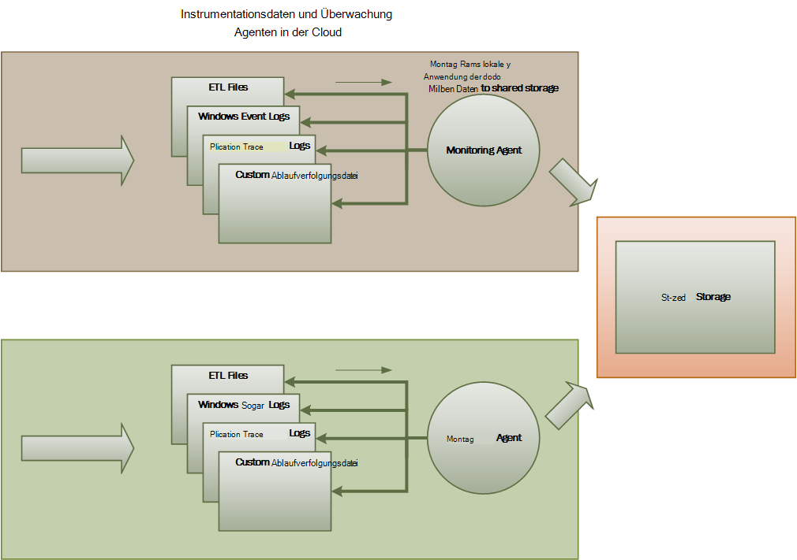
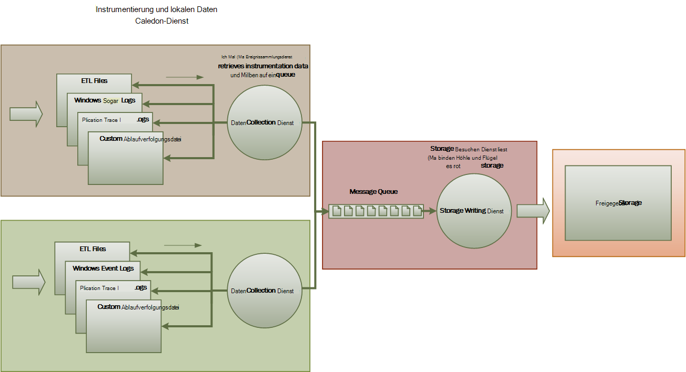
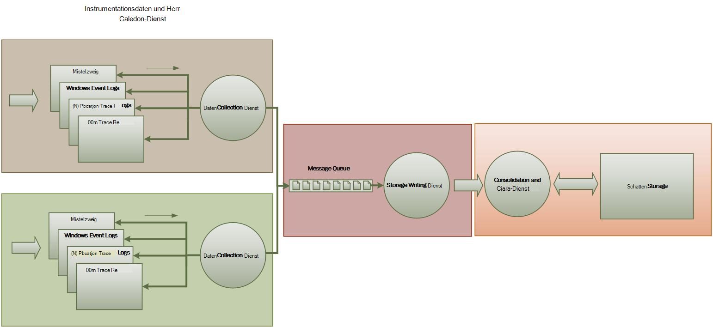

<properties
   pageTitle="Überwachung und Diagnose Hinweise | Microsoft Azure"
   description="Best Practices für die Überwachung distributed Applications in der Cloud."
   services=""
   documentationCenter="na"
   authors="dragon119"
   manager="christb"
   editor=""
   tags=""/>

<tags
   ms.service="best-practice"
   ms.devlang="na"
   ms.topic="article"
   ms.tgt_pltfrm="na"
   ms.workload="na"
   ms.date="07/13/2016"
   ms.author="masashin"/>

# <a name="monitoring-and-diagnostics-guidance"></a>Hinweise zur Überwachung und Diagnose

[AZURE.INCLUDE [pnp-header](../includes/guidance-pnp-header-include.md)]

## <a name="overview"></a>Übersicht
Verteilte Programme und Dienste in der Cloud sind naturgemäß komplexe Teile der Software, die viele bewegliche Teile umfassen. In einer produktiven Umgebung ist es wichtig zu sein wie in der Benutzer Ihr System, Trace Ressourcenverwendung nutzen im Allgemeinen überwacht den Zustand und die Leistung Ihres Systems. Sie können diese Informationen Diagnosezwecken erkennen und Beheben von Problemen und auch helfen, potenzielle Probleme aufdecken und verhindern sie.

## <a name="monitoring-and-diagnostics-scenarios"></a>Überwachung und Diagnose-Szenarien
Sie können überwachen Einblick in einem System wie gut funktioniert. Überwachung ist wichtiger Bestandteil der Verwaltung der Quality of Service-Ziele. Häufige Szenarien für das Sammeln von Daten

- Sicherstellen, dass das System fehlerfrei bleibt.
- Nachverfolgen der Verfügbarkeit des Systems und seiner Komponenten.
- Die Leistungsfähigkeit um sicherzustellen, dass der Durchsatz des Systems unerwartet nicht als die Menge der Arbeit erhöht beeinträchtigt.
- Garantieren, dass alle Service Level Agreements (SLAs) mit Kunden hergestellt entspricht.
- Schutz der Privatsphäre und Sicherheit des Systems, Benutzer und Daten.
- Nachverfolgen von Operationen, die Überwachung oder gesetzlichen Gründen durchgeführt werden.
- Überwachung der täglichen Nutzung und Erkennen von Trends, die zu Problemen führen können, wenn sie nicht behandelt werden.
- Nachverfolgen von Problemen, die vom ersten Bericht zur Analyse der Ursachen, Berichtigung, damit Softwareupdates und Bereitstellung auftreten.
- Vorgänge und zum Debuggen Softwareversionen.

> [AZURE.NOTE] Diese Liste kann nicht vollständig. Dieses Dokument befasst sich diese Szenarien als häufig auftretende Situationen bei der Überwachung. Möglicherweise gibt es andere, die weniger häufig oder von der Umgebung abhängig sind.

In den folgenden Abschnitten werden diese Szenarien ausführlicher beschrieben. Die für jedes Szenario wird im folgenden Format behandelt:

1. Eine kurze Übersicht über das Szenario
2. Dieses Szenario normalerweise an
3. Die unformatierten Instrumentationsdaten, die zur Unterstützung der Szenario und mögliche Quellen dieser Informationen erforderlich
4. Wie können diese Rohdaten analysiert und kombiniert, um sinnvolle Diagnoseinformationen generieren

## <a name="health-monitoring"></a>Überwachung
Ein System ist fehlerfrei ausgeführt und Anfragen verarbeiten. Der Zweck der Überwachung ist eine Momentaufnahme des aktuellen Zustands des Systems generiert, sodass Sie überprüfen können, ob alle Komponenten des Systems wie erwartet funktionieren.

### <a name="requirements-for-health-monitoring"></a>Vorschriften für die Überwachung
Ein Operator sollte schnell (innerhalb von Sekunden) gewarnt werden, wenn jeder Teil des Systems als fehlerhaft ist. Der Operator sollte ermitteln, welche Teile des Systems normal funktionieren und welche Probleme auftreten. Systemstatus kann durch eine Ampel hervorgehoben:

- Rot für fehlerhafte (System wurde beendet)
- Gelb teilweise fehlerfrei (System mit eingeschränkter Funktionalität ausgeführt wird)
- Grün: gesund

Umfassende Systemüberwachungssystem kann ein Drilldown durch das System den Status von Subsystemen und Komponenten anzuzeigen. Z. B. müsste das Gesamtsystem als teilweise fehlerfrei dargestellt, der Operator vergrößern und bestimmen, welche Funktionalität momentan nicht verfügbar ist.

### <a name="data-sources-instrumentation-and-data-collection-requirements"></a>Datenquellen, Instrumentation und Datenerfassung Vorschriften
Die Rohdaten, die Überwachung unterstützen müssen können aus generiert:

- Verfolgen die Ausführung von Benutzeranfragen. Diese Informationen dienen, welche Anfragen gelungen, die Fehler und jede Anforderung Dauer.
- Synthetische Benutzer überwachen. Dieser Vorgang simuliert die Schritte von einem Benutzer ausgeführt und eine vordefinierte Reihe von Schritten folgt. Die Ergebnisse der einzelnen Schritte sollten erfasst werden.
- Protokollieren von Ausnahmen Fehler und Warnungen. Diese Informationen kann durch Trace-Anweisung in den Anwendungscode eingebettet sowie das Abrufen von Informationen aus den Ereignisprotokollen der Dienste, die auf das System erfasst werden.
- Die Überwachung der Dienste von Drittanbietern, die das System verwendet. Diese Überwachung möglicherweise abrufen und Analysieren von Daten, die diese Dienste bereitstellen. Hierzu kann eine Vielzahl von Formaten in Anspruch nehmen.
- Endpunkt zu überwachen. Dieser Mechanismus wird ausführlicher im Abschnitt "Verfügbarkeit überwachen" beschrieben.
- Erfassen der Leistungsinformationen wie Hintergrund CPU-Auslastung oder (einschließlich Netzwerk) e/a-Aktivität.

### <a name="analyzing-health-data"></a>Analysieren von Daten
Der Schwerpunkt der Überwachung ist schnell angeben, ob das System ausgeführt wird. Sofortige Hot Datenanalyse kann eine Warnung auslösen, wenn eine kritische Komponente als fehlerhaft erkannt wird. (Es kann beispielsweise aufeinanderfolgende Pings reagieren.) Der Operator nehmen dann die entsprechende Maßnahme.

Erweitertes System möglicherweise vorhersehbaren Element enthalten eine kalte Analyse über aktuelle und aktuellen Arbeitslasten. Kalte Analyse kann Trends und bestimmen, ob das System weiterhin fehlerfrei ist oder ob das System zusätzliche Ressourcen benötigen. Dieses vorhersehbare Leistungsmetriken wie beruhen:

- Rate der Anfragen gegen jeden Dienst oder ein Subsystem.
- Die Reaktionszeiten von Anfragen.
- Das Volumen der Daten in und aus jeder Dienst.

Wenn der Wert einer Metrik einen definierten Schwellenwert überschreitet, kann das System eine Warnung, damit ein Operator oder Skalierung (falls verfügbar) die vorbeugende Maßnahmen Systemzustand beibehalten auslösen. Diese Aktionen möglicherweise zusätzliche Ressourcen neu ein oder mehrere Dienste, die fehlschlagen oder niedrigerer Priorität Anfragen zuweisen Drosselung umfassen.

## <a name="availability-monitoring"></a>Überwachung der Verfügbarkeit
Wirklich gesundes System muss der Komponenten und Teilsysteme, aus denen das System verfügbar sind. Überwachung der Verfügbarkeit ist auf Überwachung eng. Aber Überwachung umgehend einen Überblick über den aktuellen Zustand des Systems vor, Überwachung der Verfügbarkeit wird mit der Verfügbarkeit des Systems und der Komponenten zu Statistiken über die Verfügbarkeit des Systems.

In vielen Systemen sind einige Komponenten (z. B. eine Datenbank) integrierte Redundanz ermöglicht schnelles Failover bei einem schwerwiegenden Fehler oder Konnektivität konfiguriert. Idealerweise sollten Benutzer nicht berücksichtigen, dass ein Fehler aufgetreten. Aber eine Verfügbarkeit Perspektive überwachen, sammeln Sie so viele Informationen wie möglich über solche Fehler die Ursache zu ermitteln und Maßnahmen zur Verhinderung von wiederkehrenden erforderlich ist.

Die Daten, die zum Nachverfolgen von Verfügbarkeit erforderlich ist möglicherweise eine Reihe von untergeordneten Faktoren abhängig. Viele dieser Faktoren möglicherweise für Anwendung, System und Umgebung. Ein effektives Überwachungssystem erfasst entspricht diese einfachen Faktoren und Verfügbarkeitsdaten aggregiert, um einen Überblick über das System erhalten. Beispielsweise in einem e-Commerce-System abhängen Geschäftsfunktionen, die einer Bestellung ermöglicht Bestelldetails Speicherort Repository und das Zahlungssystem, das finanziellen Transaktionen für diese Aufträge Zahlen behandelt. Die Verfügbarkeit Bestellung Teil des Systems ist daher eine Funktion der Verfügbarkeit von Repository und Zahlung-Subsystem.

### <a name="requirements-for-availability-monitoring"></a>Vorschriften für die Überwachung der Verfügbarkeit
Ein Operator sollte auch Verlaufsdaten Verfügbarkeit jedes System- und Subsystem anzeigen und verwenden diese Information um Trends zu erkennen, die eine oder mehrere Subsysteme gelegentlich Fehler verursachen können. (Starten Dienste nicht zu einer bestimmten Tageszeit, die Verarbeitung von Spitzenzeiten entspricht?)

Monitoring-Lösung soll eine sofortige und Verlaufsdaten anzeigen der Verfügbarkeit oder mangelnde jedes Subsystem. Es sollte auch zur Warnung schnell eines Operators bei einem oder mehreren fehlschlagen oder Benutzer mit Diensten verbinden können. Dies ist nicht nur jeder Überwachungsdienst sondern auch untersuchen die Aktionen, die jeder Benutzer ausführt, wenn diese Aktion fehlschlägt, wenn sie versuchen, mit einem Dienst kommunizieren. Teilweise ein Verbindungsfehler ist normal und möglicherweise aufgrund vorübergehender Fehler. Es kann jedoch für das System eine Warnung für die Anzahl der Verbindungsfehler angegebene Subsystem ausgelöst, die während eines bestimmten Zeitraums auftreten.

### <a name="data-sources-instrumentation-and-data-collection-requirements"></a>Datenquellen, Instrumentation und Datenerfassung Vorschriften
Wie bei der Überwachung des Systemzustands, können die Rohdaten, die Verfügbarkeit Überwachung müssen durch synthetische Benutzer überwachen und protokollieren alle Ausnahmen Fehler und Warnungen auftreten generiert werden. Darüber hinaus Verfügbarkeitsdaten erhalten endpunktüberwachung durchführen. Die Anwendung kann einen oder mehrere Endpunkte Gesundheit, jedes Tests auf einem Funktionsbereich innerhalb des Systems verfügbar machen. Das Überwachungssystem kann ping jeder Endpunkt nach einem definierten Zeitplan und Sammeln von Ergebnissen (erfolgreich oder fehlgeschlagen).

Alle Timeouts Fehlern der Netzwerkkonnektivität und Verbindung Wiederholungsversuche festzuhalten. Alle Daten sollte Zeitstempel.

<a name="analyzing-availability-data"></a>
### <a name="analyzing-availability-data"></a>Analysieren der Verfügbarkeit
Instrumentationsdaten müssen aggregiert und korreliert Analyse folgende Unterstützung:

- Sofortige Verfügbarkeit und Subsysteme.
- Die Verfügbarkeit Fehlerraten und Subsysteme. Im Idealfall Bediener sollen Fehler bestimmte Aktivitäten zuordnen: Was passiert bei System?
- Verlaufsansicht Fehlerraten des Systems oder Subsysteme in allen angegeben Zeitraum und die Last auf dem System (Anzahl der Benutzeranfragen beispielsweise) Wenn ist ein Fehler aufgetreten.
- Die Gründe für den Ausfall des Systems oder Subsysteme. Die Gründe möglicherweise z. B. Dienst wird nicht ausgeführt, Konnektivität verloren, Timeout und Fehler verbunden, jedoch wieder angeschlossen.

Mithilfe der folgenden Formel können Sie die Prozentsatz der Verfügbarkeit eines Dienstes einen Zeitraum berechnen:

```
%Availability =  ((Total Time – Total Downtime) / Total Time ) * 100
```

Dies ist nützlich für SLA-Zwecke. (Die[SLA-Überwachung](#SLA-monitoring) wird später in diesem Handbuch ausführlicher beschrieben.) Definition von _Ausfallzeit_ abhängig der Dienst. Visual Studio Team Build Dienste definiert z. B. Ausfallzeiten Punkt (total kumulierten Minuten), während der Build-Dienst nicht verfügbar ist. Eine Minute gilt alle kontinuierliche auf HTTP-Anfragen Builddienst Kunden initiierten in der Minute Operationen führen Fehler oder keine Antwort zurück nicht verfügbar.

## <a name="performance-monitoring"></a>Performance-Überwachung
Das System mehr Belastung (durch Benutzer erhöhen) platziert wird, werden die Größe des Datasets diesen Benutzern den Zugriff wird und die Möglichkeit, eine oder mehrere Komponenten wahrscheinlicher. Häufig werden Leistungseinbußen Komponentenausfall vorangestellt. Wenn Sie können solche verkleinern erkennen Sie können treffen Abhilfemaßnahmen.

System-Performance hängt von einer Reihe von Faktoren ab. Jeder Faktor wird normalerweise durch Key Performance Indicators (KPIs) Netzwerk-Abfragen, die in einem bestimmten Zeitraum erfolgreich bearbeitet oder die Anzahl der Datenbanktransaktionen pro Sekunde gemessen. Einige diese KPIs möglicherweise als spezifischen Maßnahmen, während andere aus Kriterien abgeleitet werden können.

> [AZURE.NOTE] Schlechte oder gute Leistung bestimmen muss Leistung kennen mit das System ausgeführt werden soll. Dies erfordert das System beobachten, während normale Belastung arbeitet und Datenerfassung für jeden KPI über einen Zeitraum. Dies könnte eine simulierte Auslastung des Systems in einer Umgebung ausgeführt und das Erfassen geeigneter Daten vor der Bereitstellung des Systems zu einer.

> Sie sollten auch sicherstellen, dass zur Optimierung der Systemleistung überwachen keine Belastung für das System. Sie können möglicherweise die Detailebene für die Daten dynamisch anpassen, die die Leistungsindikatoren Prozess erfasst.

### <a name="requirements-for-performance-monitoring"></a>Vorschriften für die Überwachung
Um Systemleistung untersuchen, muss ein Betreiber in der Regel Informationen enthält:

- Der Response-Raten für Benutzer.
- Die Anzahl der gleichzeitigen Benutzeranfragen.
- Das Volumen des Netzwerkverkehrs.
- Die Preise an die Transaktionen abgeschlossen sind.
- Die durchschnittliche Verarbeitungszeit für Anfragen.

Sie können auch Tools bereitgestellt, mit denen einen Operator Korrelationen, unterstützen:

- Die Anzahl der gleichzeitigen Benutzer gegenüber Anforderung Wartezeit Zeiten (zum Starten der Verarbeitung einer Anforderung Dauer, nachdem der Benutzer gesendet hat).
- Die Anzahl der Benutzer und die durchschnittliche Antwortzeit (wie lange dauert ein Vorgang nach der Verarbeitung begonnen hat).
- Das Volumen der Anfragen im Vergleich zur Anzahl der Verarbeitungsfehler.

Diese allgemeine funktionale Informationen sollte ein Operator eine detaillierte Ansicht der Leistung für die einzelnen Komponenten im System erhalten. Diese Daten werden in der Regel über einfache Leistungsindikatoren bereitgestellt, die verfolgen:

- Speicherauslastung.
- Anzahl der Threads.
- CPU-Verarbeitungszeit.
- Warteschlangenlänge anfordern
- Datenträger oder e/a-Raten und Fehler.
- Anzahl der geschriebenen oder gelesenen Bytes.
- Middleware Indikatoren wie Warteschlangenlänge.

Alle Visualisierung sollen einen Operator einen Zeitraum angeben. Die angezeigten Daten möglicherweise eine Momentaufnahme der aktuellen Situation und eine Verlaufsansicht der Leistung.

Ein Operator sollte basierend auf alle Leistungsmeasure für jeden angegebenen Wert während des angegebenen Zeitintervalls auslösen.

### <a name="data-sources-instrumentation-and-data-collection-requirements"></a>Datenquellen, Instrumentation und Datenerfassung Vorschriften
Allgemeine Leistungsdaten (Durchsatz, Anzahl gleichzeitiger Benutzer, Anzahl der Geschäftstransaktionen, Fehler usw.) zu sammeln, Überwachen des Benutzer Anfragen eintreffen und durch das System geleitet. Dabei integrieren Tracing Anweisungen an wesentlichen Punkten im Anwendungscode mit Zeitinformationen. Alle Fehler, Ausnahmen und Warnungen sollten mit genügend Daten für Anfragen, die sie verursacht Korrelation erfasst werden. Das Internet Information Services (IIS) ist eine andere Quelle.

Wenn möglich sollten Sie Leistungsdaten für externe Systeme erfassen, die die Anwendung verwendet. Diese externe Systeme möglicherweise eigene Leistungsindikatoren oder andere Features zum Anfordern von Daten bieten. Ist dies nicht möglich, Datensatz Informationen wie die Start- und Endzeit der einzelnen Anforderung an ein externes System mit dem Status des Vorgangs (Erfolg, Fehler oder Warnung). Sie können z. B. einen Stoppuhr Ansatz Anfragen Zeit: starten, beginnt die Anforderung und halten Sie den Zeitgeber, wenn die Anforderung abgeschlossen ist.

Niedriger Leistungsdaten für einzelne Komponenten in einem System möglicherweise Features und Dienste wie Leistungsindikatoren und Windows Azure-Diagnose verfügbar.

### <a name="analyzing-performance-data"></a>Analysieren von Leistungsdaten
Analyse besteht der Datenaggregation Leistung Anfragetyp oder Teilsystem oder Service mit jeder Anforderung gesendet wird. Ein Beispiel für ein einem Warenkorb einen Artikel hinzufügen oder den Kassenvorgang in einem e-Commerce-System ausführen.

Eine andere allgemeine Anforderung ist Daten in ausgewählten Perzentile zusammenfassen. Beispielsweise kann ein Operator die Reaktionszeiten für 99 Prozent der Anfragen, 95 Prozent der Anfragen und 70 Prozent der Anfragen bestimmen. SLA-Ziele möglicherweise oder andere Ziele für jeden Quantil. Die laufenden Ergebnisse werden in Echtzeit berichtet Probleme erkennen. Die Ergebnisse sollten auch über längere Zeit für statistische Zwecke aggregiert werden.

Bei Latenz die Leistung beeinträchtigen sollen ein Operator schnell die Ursache des Engpasses anhand der Latenz der einzelnen Schritte jede Anforderung führt. Die Daten müssen daher Korrelieren von Leistungsindikatoren für jeden Schritt, um eine bestimmte Anforderung binden bieten.

Je nach Visualisierung möglicherweise nützlich generieren und speichern einen Datencube, der auf die unformatierten Daten enthält. Dieser Datencube können komplexe ad-hoc-Abfragen und Analyse der Leistung.

## <a name="security-monitoring"></a>Überwachen der Sicherheit
Alle kommerziellen Systeme, die sensible Daten enthalten, müssen eine Sicherheitsstruktur implementieren. Die Komplexität der Sicherheitsmechanismus ist normalerweise eine Funktion die Vertraulichkeit der Daten. Systeme, die Benutzer authentifiziert werden muss, sollten Sie erfassen:

- Alle Anmeldeversuche, ob fehlschlagen oder gelingen.
- Alle Vorgänge durch – und die Details aller Ressourcen zugreifen – ein authentifizierter Benutzer.
- Wenn ein Benutzer eine Sitzung beendet und abmeldet.

Überwachung kann Angriffe auf das System erkennen können. Z. B. möglicherweise eine große Anzahl von fehlgeschlagenen Anmeldeversuchen einen Brute-Force-Angriff. Ein unerwarteter Anstieg der Anfragen möglicherweise aus einen verteilten Denial-of-Service (DDoS) Angriffe. Sie müssen bereit sein, alle Anfragen für alle Ressourcen ungeachtet der Anfragen überwachen. Ein System, das eine Sicherheitslücke anmelden möglicherweise versehentlich Ressourcen nach außen verfügbar machen ohne dass der Benutzer tatsächlich anmelden.

### <a name="requirements-for-security-monitoring"></a>Vorschriften für die Überwachung der Sicherheit
Die wichtigsten Aspekte der Überwachung der Sicherheit sollte einen Operator schnell aktivieren:

- Eine nicht authentifizierte Entität ermitteln Sie Einbruchsversuche.
- Identifizieren Sie Versuche Unternehmen Daten Operationen, für die sie kein Zugriff gewährt wurde.
- Bestimmen Sie, ob das System oder ein Teil des Systems Angriffen von außen oder innen. (Zum Beispiel ein authentifizierter Angreifer versucht möglicherweise das System heruntergefahren.)

Diese Anforderungen Bediener mitzuteilen:

- Wenn ein Konto wiederholte fehlgeschlagen Anmeldeversuche innerhalb einer bestimmten Frist
- Wenn ein authentifiziertes Konto wiederholt versucht, während eines bestimmten Zeitraums eine verbotene Ressource zuzugreifen.
- Wenn eine große Anzahl von nicht authentifizierten oder nicht autorisierte Anfragen während eines angegebenen Zeitraums auftreten.

Die Informationen eines Operators gehören die Host-Adresse der Quelle für jede Anforderung. Im Falle von Sicherheitsverstößen regelmäßig aus einem bestimmten Adressbereich blockiert diese Hosts.

Ein wichtiger Teil der Sicherheit eines Systems wird Aktionen schnell erkennen, die von dem üblichen Muster abweichen. Informationen wie die Anzahl fehlgeschlagen oder erfolgreich anmelden kann feststellen, ob eine Aktivität Zeitpunkt eine ungewöhnliche gibt visuell angezeigt werden. (Ein Beispiel für diese Aktivität ist Benutzer anmelden, um 3:00 Uhr und eine große Anzahl von Vorgängen ausführen, beginnt der Arbeitstag um 9:00 Uhr). Diese Informationen kann auch automatische Skalierung zeitbasierte Konfiguration verwendet werden. Beispielsweise Bediener stellt fest, dass eine große Anzahl von Benutzern regelmäßig anmelden zu einer bestimmten Tageszeit, Operators arrangieren zu zusätzliche Authentifizierungsdienste Arbeitsvolumen, und diese zusätzlichen Dienste dann herunter, wenn die maximale übergeben wurde.

### <a name="data-sources-instrumentation-and-data-collection-requirements"></a>Datenquellen, Instrumentation und Datenerfassung Vorschriften
Sicherheit ist eine umfassende Aspekt am stärksten verteilten Systeme. Relevanten Daten ist wahrscheinlich an mehreren Punkten in einem System generiert. Sie sollten eine Sicherheitsinformations- und Ereignismanagement (SIEM) Ansatz, die sicherheitsrelevante Informationen, die aus der Anwendung, Netzwerkgeräte, Server, Firewalls, antivirus-Software und andere Elemente Intrusion Prevention ausgelöste Ereignisse.

Überwachung der Sicherheit kann Daten aus Tools integrieren, die nicht Teil der Anwendung sind. Diese Tools können Dienstprogramme enthalten, die Port-Scan-Aktivitäten von außen oder Netzwerkfilter, die versuchen nicht authentifizierter Zugriff auf Ihre Anwendung und Daten zu erkennen.

In allen Fällen müssen die erfassten Daten Administrator bestimmen Sie die Art von Angriffen und entsprechenden Gegenmaßnahmen.

### <a name="analyzing-security-data"></a>Analysieren von Daten
Überwachung der Sicherheit zeichnet verschiedener Quellen Daten herrührt. Die verschiedenen Formate und Detailebene erfordern häufig komplexe Analyse der gesammelten Daten zusammen in einem kohärenten Thread Informationen zu binden. Neben den einfachsten Fällen (z. B. eine große Anzahl von fehlgeschlagenen Anmeldungen oder wiederholte Versuche, nicht autorisierten Zugriff auf wichtige Ressourcen erkennen) möglicherweise es nicht möglich, alle komplexe automatisierte Verarbeitung von Daten. Stattdessen kann es zum Schreiben dieser Daten aber ansonsten in ihrer ursprünglichen Form manuelle Expertenanalyse ermöglicht sicheren Repository Zeitstempel vorzuziehen.

<a name="SLA-monitoring"></a>

## <a name="sla-monitoring"></a>SLA-Überwachung
Viele kommerzielle Systeme, die Kunden unterstützen, stellen Garantien über die Leistung des Systems in Form von SLAs. SLAs Zustand im Wesentlichen, dass das System ein Volumen einer vereinbarten Zeitrahmen und ohne wichtige Informationen verarbeiten kann. SLA-Überwachung geht um sicherzustellen, dass das System messbare SLAs erfüllen kann.

> [AZURE.NOTE] SLA-Überwachung ist für die Leistungsüberwachung eng. Performance-Überwachung betreffenden mit dem System Funktionen _optimal_dafür, SLA-Überwachung wird aber durch eine vertragliche Verpflichtung, die definiert, welche _optimal_ bedeutet.

SLAs werden häufig definiert:

- Verfügbarkeit. Beispielsweise kann eine Organisation garantieren, dass System 99,9 Prozent der Zeit verfügbar. Nicht mehr als 9 Stunden Ausfallzeit pro Jahr oder 10 Minuten pro Woche entspricht.
- Betriebliche Durchsatz. Dieser Aspekt wird häufig als ein oder mehrere – Hochwassermarken, wie das System unterstützt bis zu 100.000 gleichzeitigen Benutzeranfragen oder 10.000 gleichzeitige Geschäftstransaktionen verarbeiten kann.
- Reaktionszeiten. Das System kann auch Garantien für die Rate Stellen zur Verarbeitung von Anfragen. Ein Beispiel ist, dass 99 Prozent der Geschäftstransaktionen innerhalb von 2 Sekunden abgeschlossen wird und keine Transaktion länger als 10 Sekunden dauert.

> [AZURE.NOTE] Einige Aufträge für kommerzielle Systeme zählen auch SLAs für Kunden-Support. Ein Beispiel ist, dass alle Helpdesk-Anfragen eine Reaktion innerhalb von 5 Minuten auslösen und 99 Prozent aller Probleme vollständig innerhalb 1 Tages behandelt. Effektive [tracking-Problem](#issue-tracking) (weiter unten in diesem Abschnitt beschrieben) ist entscheidend für SLA wie diese.

### <a name="requirements-for-sla-monitoring"></a>Vorschriften für die Überwachung der SLA
Auf der höchsten Ebene sollte ein Operator auf einen Blick feststellen, ob das System die vereinbarten SLAs einzuhalten ist. Und sollten nicht der Operator Bohren und Faktoren bestimmen die Gründe für minderwertige Leistung untersuchen.

Normale allgemeine Indikatoren visuell dargestellt sind:

- Der Prozentsatz der Betriebszeit des Dienstes.
- Der Anwendungsdurchsatz (gemessen in erfolgreiche Transaktionen oder Operationen pro Sekunde).
- Die Anzahl erfolgreiche/fehlgeschlagene Anwendung.
- Die Anzahl der Anwendung und System Fehler, Ausnahmen und Warnungen.

Alle diese Indikatoren werden kann nach einem bestimmten Zeitraum gefiltert.

Eine Cloudanwendung umfasst wahrscheinlich eine Reihe von Subsystemen und Komponenten. Ein Operator sollte eine allgemeine Anzeige auswählen und sehen, wie sie vom Zustand der zugrunde liegenden Elemente besteht. Z. B. wenn die Verfügbarkeit des gesamten Systems ein zulässiger Wert unterschreitet, sollen ein Operator vergrößern und bestimmen, welche Elemente dieses Fehlers beitragen.

> [AZURE.NOTE] Systembetriebszeit muss sorgfältig definiert werden. Ein System, Redundanz, maximale Verfügbarkeit, einzelne Instanzen von Elementen möglicherweise jedoch System bleiben funktionsfähig. Systembetriebszeit von Überwachung anzugeben aggregate Verfügbarkeit jedes Elements und nicht, ob das System tatsächlich angehalten wurde. Darüber hinaus können Fehler isoliert werden. Auch wenn ein bestimmtes System nicht verfügbar ist, der Rest des Systems verfügbar, obwohl mit verringerter Funktionalität bleiben kann. (In einem e-Commerce-System ein Fehler im System möglicherweise verhindern, dass ein Kunde Bestellung jedoch der Kunde möglicherweise noch Produktkatalog durchsuchen.)

Warnung zu, sollen das System ein Ereignis auslösen, wenn eine allgemeinen Indikatoren einen angegebenen Schwellenwert überschreitet. Die Details auf niedrigerer Ebene die verschiedenen Faktoren, die die allgemeine Anzeige bilden sollte als Kontextdaten dem Warnsystem verfügbar.

### <a name="data-sources-instrumentation-and-data-collection-requirements"></a>Datenquellen, Instrumentation und Datenerfassung Vorschriften
Die Rohdaten, die SLA Überwachung müssen ähnelt Rohdaten Performance Monitoring sowie einige Aspekte Gesundheit und Überwachung der Verfügbarkeit erforderlich ist. (Siehe Abschnitte für weitere Details.) Sie können diese Daten erfassen:

- Endpunktüberwachung durchführen.
- Protokollieren von Ausnahmen Fehler und Warnungen.
- Verfolgen die Ausführung von Benutzeranfragen.
- Überwachen die Verfügbarkeit der Dienste von Drittanbietern, die das System verwendet.
- Verwenden von Leistungskennzahlen und Indikatoren.

Alle Daten müssen zeitlich und Zeitstempel.

### <a name="analyzing-sla-data"></a>SLA-Daten analysieren
Instrumentationsdaten müssen aggregiert werden, um einen Überblick über die gesamte Leistung des Systems zu generieren. Aggregierte Daten müssen auch Detailinformationen zum Aktivieren der Prüfung der Leistung der zugrunde liegenden Subsysteme unterstützen. Beispielsweise sollten Sie können:

- Berechnen Sie die Gesamtzahl der Benutzer in einem bestimmten Zeitraum und bestimmen Sie die Erfolgs- und bei Anfragen.
- Die Reaktionszeiten der Benutzeranfragen Überblick Reaktionszeiten zu kombinieren.
- Analysieren Sie den Fortschritt der Benutzeranfragen, die allgemeine Reaktionszeit einer Anforderung in die Reaktionszeiten der einzelnen Arbeitsaufgaben in dieser Anforderung aufzuschlüsseln.  
- Ermitteln Sie die allgemeine Verfügbarkeit des Systems als prozentualer Anteil der Betriebszeit für einen bestimmten Zeitraum.
- Analysieren der Prozentsatz Zeit Verfügbarkeit einzelner Komponenten und Dienste im System. Dies könnte Drittanbieterdienste generierten Protokolle analysieren.

Viele kommerzielle Systeme müssen real Kennzahlen mit vereinbarter SLAs für einen bestimmten Zeitraum in der Regel monatlich melden. Diese Informationen dienen Guthaben oder sonstige Rückzahlungen für Kunden berechnet, SLAs während dieses Zeitraums nicht erfüllt. Zur Berechnung der Verfügbarkeit für einen Dienst mit dem Verfahren im Abschnitt [Analysieren Verfügbarkeitsdaten](#analyzing-availability-data)beschrieben.

Für interne Zwecke kann eine Organisation auch nachverfolgen, Anzahl und Art der Vorfälle, die nicht mehr verursacht. Lernen, wie diese Probleme schnell und vollständig beseitigen soll Ausfallzeiten und SLAs erfüllen.

## <a name="auditing"></a>Überwachung
Je nach Art der Anwendung möglicherweise gesetzlichen oder anderen Rechtsvorschriften, die an Benutzer Vorgänge überwachen und Aufzeichnen aller angeben. Überwachung kann Kunden Links zu speziellen Anfragen nachzuweisen. Die Nachweisbarkeit ist ein wichtiger Faktor in vielen e-Business-Systemen zur Erhaltung der Vertrauensstellung zwischen einem Kunden und der Organisation für die Anwendung oder den Dienst zuständig ist.

### <a name="requirements-for-auditing"></a>Vorschriften für die Überwachung
Analyst muss möglicherweise die Reihenfolge der Geschäftsbetrieb zu verfolgen, die Benutzer ausführen, sodass Benutzer Aktionen zu rekonstruieren. Dies kann einfach als eine Frage des Datensatzes oder als Teil einer Untersuchung erforderlich.

Überwachungsinformationen sind sehr vertraulich. Wahrscheinlich enthält Daten, die der Benutzer des Systems Aufgaben identifiziert, die sie durchführen. Aus diesem Grund werden Überwachungsinformationen wahrscheinlich nur vertrauenswürdige Analysten zur Berichten statt als interaktives System Drilldown Grafikoperationen unterstützt. Analyst sollten Berichte generieren können. Beispielsweise können Berichte Auflisten aller Aktivitäten, die während eines bestimmten Zeitraums detail Chronologie der Aktivität für einen einzelnen Benutzer oder Liste die Reihenfolge der Operationen für eine oder mehrere Ressourcen.

### <a name="data-sources-instrumentation-and-data-collection-requirements"></a>Datenquellen, Instrumentation und Datenerfassung Vorschriften
Für die Überwachung die wichtigsten Informationsquellen gehören:

- Das Sicherheitssystem, das Benutzerauthentifizierung verwaltet.
- Ablaufverfolgungsprotokolle, die Benutzeraktivitäten aufzeichnet.
- Sicherheitsprotokolle, die alle identifizierbaren und Netzwerkanfragen zu verfolgen.

Das Format der Überwachungsdaten und in dem sie gespeichert ist möglicherweise aufgrund behördlicher Auflagen gesteuert werden. Z. B. es möglich die Daten möglicherweise nicht. (sie müssen in ihrem ursprünglichen Format aufgezeichnet.) Zugriff auf das Repository, in dem statt, muss geschützt werden, um Manipulationen zu verhindern.

### <a name="analyzing-audit-data"></a>Analysieren von Überwachungsdaten
Analyst muss auf die Rohdaten in ihrer Gesamtheit in seine ursprüngliche Form. Neben der Anforderung Audit-Berichte generieren dürften die Tools zum Analysieren dieser Daten spezialisiert und externe zum System.

## <a name="usage-monitoring"></a>Überwachung der Verwendung
Überwachung der Verwendung verfolgt, wie die Features und Komponenten von einer Anwendung verwendet werden. Ein Operator können die gesammelten Daten:

- Feststellen Sie mit häufig verwendeten und potenzielle Hotspots im System. Funktionale Partitionierung oder sogar Replikation gleichmäßiger verteilt die Last möglicherweise hohem Datenverkehr Elemente profitieren. Bediener kann diese Informationen auch mit selten verwendet und sind Kandidaten für die Stilllegung oder Ersatz in einer zukünftigen Version des Systems.
- Informationen Sie über operationelle Ereignisse des Systems bei normaler Nutzung. In einer e-Commerce-Site nehmen Sie z. B. die statistische Informationen über die Anzahl der Transaktionen und das Volumen der Kunden, die dafür verantwortlich sind. Diese Informationen kann für die Planung mit steigender Anzahl von Kunden verwendet werden.
- Zufriedenheit mit der Leistung oder Funktionalität des Systems (möglicherweise indirekt) zu erkennen. Beispielsweise, wenn eine große Anzahl von Kunden in einem e-Commerce-System regelmäßig ihre Warenkörbe verlassen, aufgrund eines Problems mit der Checkout-Funktionalität möglicherweise.
- Abrechnungsinformationen zu generieren. Eine kommerzielle Anwendung oder mandantenfähigen Service kann Kunden Ressourcen berechnen, die sie verwenden.
- Quoten. Überschreitet ein Benutzer in einer mehrinstanzenfähigen System ihre bezahlten Kontingent von Zeit oder Ressourcenverbrauch während eines bestimmten Zeitraums verarbeitet, kann der Zugriff beschränkt oder Verarbeitung gedrosselt werden.

### <a name="requirements-for-usage-monitoring"></a>Vorschriften für die Überwachung der Verwendung
Untersuchen Sie Systemverwendung muss ein Betreiber normalerweise Informationen enthält:

- Die Anzahl der Anfragen, die von jedem Subsystem verarbeitet und jeder Ressource geleitet.
- Die Arbeit, die jeder Benutzer ausführen.
- Das Volumen der Speicherung von Daten, die jeder Benutzer belegt.
- Die Ressourcen, auf die jeder Benutzer zugreifen.

Ein Operator sollte auch Diagramme generieren können. Beispielsweise ein Diagramm möglicherweise die ressourcenintensive Benutzer angezeigt oder häufig Zugriff auf Ressourcen oder Funktionen.

### <a name="data-sources-instrumentation-and-data-collection-requirements"></a>Datenquellen, Instrumentation und Datenerfassung Vorschriften
Verwendung erfolgt relativ hoch. Beachten sie die Start- und Endzeiten der einzelnen Anforderung und die Art der Anforderung (Lesen, schreiben usw., abhängig von der betreffenden Ressource). Sie erhalten diese Informationen von:

- Verfolgung der Benutzeraktivität.
- Erfassen von Leistungsindikatoren, die für jede Ressource Auslastung messen.
- Überwachen den Ressourcenverbrauch durch jeden Benutzer.

Für die Messung zu, müssen Sie auch identifizieren die Benutzer sind verantwortlich für die Ausführung der Vorgänge und Ressourcen, die diese Operationen verwenden. Die erfassten Informationen sollten ausreichen, um genaue Abrechnung aktivieren.

<a name="issue-tracking"></a>
## <a name="issue-tracking"></a>Verfolgung von Problemen
Kunden und andere Benutzer möglicherweise Probleme bei unerwarteten Ereignissen oder Verhalten im System berichtet. Problemverfolgungslisten geht diese Probleme verwalten, alle zugrunde liegenden Probleme im System Lösung zuordnen und Kunden von Lösungsmöglichkeiten.

### <a name="requirements-for-issue-tracking"></a>Vorschriften für Problemverfolgungslisten
Operatoren führen häufig Problemverfolgungslisten mithilfe einer separaten, die sie und die Details von Problemen ermöglicht, Benutzer Berichten. Dazu gehören Aufgaben, die der Benutzer versuchte auszuführen, Symptome des Problems, die Abfolge der Ereignisse und Fehler oder Warnhinweise angezeigt, die ausgestellt wurden.

### <a name="data-sources-instrumentation-and-data-collection-requirements"></a>Datenquellen, Instrumentation und Datenerfassung Vorschriften
Die ursprüngliche Datenquelle für Problemverfolgungslisten Daten ist der Benutzer, die das Problem am gemeldet. Der Benutzer möglicherweise weitere Daten wie angeben:

- Ein Speicherabbild (wenn die Anwendung eine Komponente, die auf dem Desktop des Benutzers enthält).
- Ein Bildschirm-Snapshot.
- Datum und Uhrzeit als der Fehler aufgetreten, zusammen mit anderen Umweltinformationen wie des Benutzers ist.

Diese Informationen können verwendet werden, debugging Aufwand und einen Rückstand für zukünftige Versionen der Software erstellen.

### <a name="analyzing-issue-tracking-data"></a>Problemverfolgungslisten Datenanalyse
Andere Benutzer können das gleiche Problem melden. Problem-Tracking-System sollten Berichte zuordnen.

Fortschritt des debugging Aufwand sollte für jeden Problembericht aufgezeichnet. Wenn das Problem behoben ist, kann der Kunde die Lösung informiert.

Wenn ein Benutzer ein Problem, die eine bekannte Lösung Problemverfolgungslisten enthält meldet, sollte der Operator unverzüglich den Benutzer der Lösung können.

## <a name="tracing-operations-and-debugging-software-releases"></a>Vorgänge und zum Debuggen von Softwareversionen
Wenn ein Benutzer ein Problem meldet, ist der Benutzer nur die auf Vorgänge unmittelbar über. Benutzer kann nur die Ergebnisse der eigenen Erfahrung eines Operators Berichten für die Wartung des Systems zuständig ist. Dies sind normalerweise nur sichtbare Symptom ein oder mehrere grundlegende Probleme. In vielen Fällen müssen Analysten über die Chronologie der zugrunde liegenden Vorgänge die Ursache des Problems zu graben. Dieser Vorgang wird als _Ursachenanalyse_bezeichnet.

> [AZURE.NOTE] Ursachenanalyse möglicherweise Ineffizienz im Entwurf einer Anwendung aufdecken. In diesen Situationen möglicherweise betroffenen Elemente überarbeiten und als Teil des zukünftigen Versionen bereitstellen. Dieser Prozess erfordert sorgfältigen Kontrolle und die aktualisierten Komponenten sollte genau überwacht werden.

### <a name="requirements-for-tracing-and-debugging"></a>Vorschriften für die Protokollierung und Debuggen
Ermittlung unerwarteter Ereignisse und andere Probleme, unbedingt die Daten ausreichend Informationen Analyst zurück auf die Herkunft dieser Probleme und die Abfolge der Ereignisse rekonstruieren. Diese Informationen müssen ausreichen, um die Ursache von Problemen Analyst aktivieren sein. Entwickler kann dann die erforderlichen wiederkehrende verhindern modifizieren.

### <a name="data-sources-instrumentation-and-data-collection-requirements"></a>Datenquellen, Instrumentation und Datenerfassung Vorschriften
Fehlerbehebung betreffen Verfolgung alle Methoden (und deren Parameter) als Teil eines Vorgangs, um eine Struktur zu erstellen, das den logischen Ablauf des Systems darstellt, wenn ein eine Anfrage Kunde aufgerufen. Ausnahmen und Warnungen durch diesem Datenstrom erzeugt erfasst und protokolliert werden müssen.

Zum Debuggen unterstützt, kann das System Hooks bereitstellen, mit denen einen Operator Zustandsinformationen an wichtigen Punkten im System erfassen. Oder das System liefern detaillierte Informationen als ausgewählte Vorgänge ausgeführt. Sammeln von Daten auf dieser Detailebene können eine zusätzliche Belastung des Systems und sollte eine temporäre Prozess. Ein Operator verwendet dabei bei ungewöhnlich verschiedener Ereignisse auftritt und ist schwer zu replizieren oder eine neue Version von einem oder mehreren Elementen in einem System erfordert eine sorgfältige Überwachung sicherzustellen, dass Elemente funktionieren wie erwartet.

## <a name="the-monitoring-and-diagnostics-pipeline"></a>Die Pipeline Überwachung und Diagnose
Überwachen von einem großen verteilten System stellt eine große Herausforderung. Im vorherigen Abschnitt beschriebenen Szenarien sollten nicht unbedingt isoliert betrachtet werden. Es dürfte erheblich überschneiden Überwachung und Diagnose-Daten, die für jede Situation muss auch diese Daten möglicherweise verarbeitet und auf verschiedene Weise dargestellt werden. Aus diesen Gründen sollten Sie eine ganzheitliche Ansicht der Überwachung und Diagnose ergreifen.

Sie können der gesamte Überwachung und Diagnose als Pipeline vorstellen, die in Abbildung 1 gezeigten Phasen besteht.


_Abbildung 1. Die Stufen der Pipeline Überwachung und Diagnose_

Abbildung 1 zeigt, wie die Daten für die Überwachung und Diagnose aus einer Vielzahl von Datenquellen stammen können. Die Instrumentation und Auflistung Phasen geht die Quellen aus, in dem die Daten erfasst werden, bestimmen, welche Daten erfassen, übernehmen und zum Formatieren dieser Daten leicht überprüft werden können. Die Analyse und Diagnose übernimmt unformatierten Daten und verwendet, um aussagekräftige Informationen generieren, die ein Operator verwenden, um den Zustand des Systems ermitteln. Operators kann mithilfe dieser Informationen um über mögliche Aktionen zu entscheiden und dann die Ergebnisse in Schritten der Instrumentation und Auflistung feed. Visualisierung/Warnung Stufe Phase stellt eine konsumierbare Ansicht des Systemstatus. Sie können Informationen mithilfe einer Reihe von Dashboards in Echtzeit anzeigen. Und sie Berichten, Grafiken und Diagramme Verlaufsansicht Daten bereitstellen, die langfristiger Trends identifizieren können. Wenn Informationen gibt an, dass ein KPI zulässigen Grenzen überschreiten, kann diese Phase auch eine Warnung an einen Operator auslösen. In einigen Fällen werden eine Warnung auch automatisiert ausgelöst, die versucht zu Maßnahmen wie automatische Skalierung verwendet.

Beachten Sie, dass folgendermaßen kontinuierlichen Prozessablauf dar, in dem die Phasen parallel stattfinden. Im Idealfall sollten alle dynamisch konfiguriert werden. An einigen Stellen insbesondere wenn ein System neu bereitgestellt wurde oder Probleme, möglicherweise zu erweiterten Daten regelmäßig mehr erforderlich. In anderen Fällen sollte es möglich Erfassen grundlegender wichtige Informationen zu überprüfen, ob das System ordnungsgemäß funktioniert.

Darüber hinaus der gesamte Überwachungsprozess live, kontinuierliche Lösung berücksichtigen, die Optimierung und Verbesserung durch Feedback. Sie beginnen beispielsweise mit vielen Faktoren Ermitteln des Systemstatus. Analyse im Zeitverlauf, führen eine Verfeinerung wie Maßnahmen nicht relevant verwerfen, damit Sie sich genau auf die Daten gleichzeitig Hintergrundgeräusche.

## <a name="sources-of-monitoring-and-diagnostic-data"></a>Überwachung und Diagnose Datenquellen
Der Überwachungsprozess verwendet Informationen kann aus verschiedenen Quellen stammen, wie in Abbildung 1 dargestellt. Auf der Anwendungsebene stammt Ablaufverfolgungsprotokolle in den Code des Systems integriert Informationen. Entwickler muss eine Standardmethode für den Ablauf der Steuerung durch ihren Code verfolgen. Eintrag für eine Methode kann z. B. eine Trace-Nachricht ausgeben mit dem Namen der Methode, die aktuelle Uhrzeit, den Wert der einzelnen Parameter und andere relevante Informationen. Aufzeichnen der Einstiegs- und kann auch als nützlich erweisen.

Sie protokolliert alle Ausnahmen und Warnungen, und sicherzustellen, dass Sie eine vollständige Verfolgung geschachtelte Ausnahmen und Warnungen beibehalten. Im Idealfall sollten Sie Informationen erfassen, die den Benutzer identifiziert, der den Code mit Korrelationsinformationen (für Anfragen verfolgen, wie sie durch das System) ausgeführt wird. Und Sie sollten versuchen, Zugriff auf sämtliche Ressourcen, wie Meldungswarteschlangen, Datenbanken, Dateien und andere abhängige Dienste. Diese Informationen kann für die Erfassung und Überwachungszwecken verwendet werden.

Vielen Stellen Bibliotheken und Frameworks verwenden, um allgemeine Aufgaben wie einen Datenspeicher zugreifen oder über ein Netzwerk kommunizieren. Diese Frameworks möglicherweise auf eigene Nachrichten verfolgen und raw Diagnoseinformationen Transaktionsraten Data Transmission Erfolge und Fehler.

> [AZURE.NOTE] Viele moderne Frameworks veröffentlichen automatisch Leistung und Verfolgungsereignisse. Diese Informationen ist lediglich ein Mittel abgerufen und gespeichert, wo sie verarbeitet und analysiert werden kann.

Das Betriebssystem, auf dem die Anwendung ausgeführt, kann eine Datenquelle auf niedriger Ebene systemweite, wie Leistungsindikatoren, die i/o-speichernutzung und CPU-Auslastung anzuzeigen. Betriebssystemfehler (z. B. die Datei ordnungsgemäß geöffnet) können auch gemeldet werden.

Sie sollten auch die zugrunde liegende Infrastruktur und Komponenten, auf denen das System ausgeführt wird. Virtuelle Computer, virtuelle Netzwerke und Speicher-Services können alle Quellen von wichtigen Leistungsindikatoren Infrastrukturebene und andere Diagnosedaten.

Wenn die Anwendung andere externe Dienste wie Webserver oder Datenbank-Managementsystem können diese Dienste eigene Ablaufverfolgungsinformationen, Protokolle und Leistungsindikatoren veröffentlichen. Beispiele für SQL Server dynamische Verwaltungsansichten zum Nachverfolgen von Operationen in einer SQL Server-Datenbank und IIS Ablaufverfolgungsprotokolle für Anfragen an einen Server aufzeichnen.

Komponenten eines Systems geändert und neue Versionen bereitgestellt werden, ist es wichtig zu Attribut Probleme, Ereignisse und Messgrößen für jede Version. Diese Informationen sollten an die Pipeline Version verknüpft werden, damit Probleme mit einer bestimmten Version einer Komponente schnell nachverfolgt und behoben werden können.

Sicherheitsprobleme können jederzeit im System auftreten. Angenommen, versucht ein Benutzer eine ungültige Benutzer-ID oder ein Kennwort anmelden. Ein authentifizierter Benutzer könnten versuchen, nicht autorisierten Zugriff auf eine Ressource erhalten. Oder ein Benutzer möglicherweise einen ungültigen oder überholten Schlüssel verschlüsselten Informationen. Sicherheitsinformationen für erfolgreiche und fehlgeschlagene Anfragen sollten immer protokolliert.

Das [Instrumentieren einer Anwendung](#instrumenting-an-application) finden Sie weitere Informationen auf die Informationen, die Sie übernehmen sollten. Jedoch können verschiedene Strategien zur Erfassung dieser Informationen:

- **Application-System überwachen**. Diese Strategie verwendet interne Quellen innerhalb der Anwendung Anwendungsframeworks, Betriebssystem und Infrastruktur. Der Anwendungscode kann eigene Überwachungsdaten an wichtigen Punkten während des Lebenszyklus einer Anfrage generieren. Die Anwendung kann Tracing-Anweisung enthalten, die möglicherweise selektiv aktiviert oder deaktiviert Umstände diktieren. Diagnose dynamisch mithilfe der Netzwerkdiagnose-Framework einfügen könnte auch möglich. Diese Frameworks stellen normalerweise die Plug-Ins, die verschiedenen Instrumentation Stellen im Code zuordnen und kann Daten an diesen Punkten.

    Darüber hinaus kann der Code oder die zugrunde liegende Infrastruktur an kritischen Punkten Ereignisse auslösen. Agents konfiguriert diese Ereignisse überwachen kann die Ereignisinformationen aufzeichnen.

- **Reale Benutzer überwachen**. Dieser Ansatz Aktivitäten zwischen einem Benutzer und der Anwendung und den Fluss der Anforderung und Antwort beobachtet. Diese Informationen können einen zweifachen Zweck: Messung Verwendung von jedem Benutzer verwendet werden und es wird bestimmt, ob Benutzer eine geeignete Dienstqualität (schnelle Reaktionszeiten, niedrige Latenz und Fehler) erhalten. Die erfassten Daten können Sie Bereiche identifizieren, in denen Fehler am häufigsten auftreten. Auch können die Daten zum Identifizieren von Elementen, verlangsamt das System, möglicherweise durch Hotspots in der Anwendung oder eine andere Form der Engpass. Wenn Sie dabei sorgfältig implementieren, können Benutzer die Anwendung zum Debuggen und Testen fließt rekonstruieren möglich.

    > [AZURE.IMPORTANT] Die Daten sollten, die durch die Überwachung der Benutzer vertrauliche, weil vertrauliches Material enthalten können erfasst werden. Speichern gesammelter Daten bewahren Sie sie sicher. Wenn Sie die Daten für die Leistung überwachen und Debuggen verwenden möchten, müssen entfernen Sie alle persönlich identifizierbaren Informationen zuerst.

- **Synthetische Benutzer überwachen**. In diesem Beispiel schreiben Sie eigene Testclient, die simuliert einen Benutzer und eine konfigurierbare aber normale Folge von Operationen durchführt. Sie können die Leistung der Testclient Zustand des Systems bestimmen verfolgen. Sie können auch mehrere Instanzen der Testclient als Teil eines Auslastungstests System wie Belastung reagiert, und welche Monitorausgang unter diesen Umständen generiert wird.

    > [AZURE.NOTE] Sie können echte und synthetische Benutzer überwachen mit Code, verfolgt und Zeit die Ausführung der Methodenaufrufe und andere wichtige Teile einer Anwendung, implementieren.

- **Profiling**. Dabei zielt in erster Linie zur Überwachung und Verbesserung. Als Betriebssystem auf der Funktionsebene der realen und synthetische Benutzer überwachen erfasst Informationen auf niedrigerer Ebene als Anwendung ausgeführt wird. Sie können das profiling mit periodisch Ausführungsstatus einer Anwendung (Bestimmen der Codeabschnitt, der die Anwendung zu einem bestimmten Zeitpunkt ausgeführt wird) implementieren. Sie können auch Instrumentation, die Prüfpunkte fügt den Code an wichtigen Stellen (wie Anfang und Ende eines Methodenaufrufs) aufgezeichnet, welche Methoden aufgerufen wurden, zu welchem Zeitpunkt und wie lange jeder gedauert. Sie können dann analysieren diese Daten, um zu bestimmen, welche Teile der Anwendung Leistungsprobleme auftreten können.

- **Endpunkt zu überwachen**. Diese Technik verwendet eine oder mehrere Diagnose Endpunkte, die speziell für die Überwachung der Anwendung verfügbar gemacht. Ein Endpunkt kann bietet einen Weg in Anwendungscode und Informationen über den Zustand des Systems. Verschiedene Endpunkte können auf verschiedene Aspekte der Funktionalität konzentrieren. Schreiben eigener Diagnose Client, der regelmäßige Abfragen an diese Endpunkte sendet, und Antworten verarbeiten. Dadurch wird mehr [Health Endpunkt Überwachung](https://msdn.microsoft.com/library/dn589789.aspx) Muster auf der Microsoft-Website beschrieben.

Für maximalen Schutz sollten Sie eine Kombination dieser Techniken verwenden.

<a name="instrumenting-an-application"></a>
## <a name="instrumenting-an-application"></a>Instrumentieren einer Anwendung
Instrumentation ist ein wichtiger Bestandteil des Überwachungsvorgangs. Sie können Entscheidungen Bedeutung der Leistung und der Zustand eines Systems nur wenn zuerst die Daten sammeln, die diese Entscheidungen ermöglicht. Mithilfe der Instrumentationsmethode sammeln Informationen sollte ausreichend sein, damit Sie Leistung, diagnostizieren und Entscheidungen ohne Anmeldung bei einem Remoteproduktionsserver Tracing (und debugging) manuell. Instrumentationsdaten umfasst normalerweise Metriken und Informationen, die Ablaufverfolgungsprotokolle geschrieben werden.

Den Inhalt eines Protokolls kann das Ergebnis von Textdaten, die von der Anwendung geschrieben oder binäre Daten, die als Ergebnis ein Ablaufverfolgungsereignis erstellt werden (wenn die Anwendung Event Tracing for Windows - ETW). Sie können auch von Systemprotokollen generiert, die Teile der Infrastruktur, wie ein Webserver aus aufzuzeichnen. Text Protokollnachrichten häufig sollen lesbare, jedoch sollte auch in einem Format, das ein automatisiertes System kann problemlos analysiert geschrieben werden.

Sie sollten auch Protokolle kategorisieren. Nicht alle Daten in ein Protokoll schreiben, jedoch separate Protokolle zum Aufzeichnen der Ablaufverfolgungsausgabe aus betrieblichen Aspekte des Systems verwenden. Sie können dann Nachrichten protokollieren Filtern durch das Protokoll lesen, anstatt eine lange Datei verarbeiten. Nie Schreiben Informationen anderen Anforderungen (wie Überwachungsinformationen Debugdaten) an dasselbe Protokoll.

> [AZURE.NOTE] Ein Protokoll als Datei im Dateisystem implementiert werden könnte und möglicherweise in einem anderen Format wie ein Blob im BLOB-Speicher gehalten werden. Informationen kann auch in strukturierter Speicher, wie Zeilen in einer Tabelle gehalten werden.

Messgrößen im Allgemeinen werden ein Measure oder eine Anzahl von Teilen oder Ressource im System zu einem bestimmten Zeitpunkt mit entsprechenden Tags oder Dimensionen ( _Beispiel_bezeichnet). Eine einzelne Instanz einer Metrik ist normalerweise nicht sinnvoll isoliert. Stattdessen müssen Metriken Zeitverlauf erfasst werden. Zentrales Thema zu berücksichtigen ist die Metriken aufzeichnen soll und wie oft. Generieren von Daten für Metriken oft kann eine erhebliche zusätzliche Belastung des Systems verhängen, während Sammeln von Metriken selten Sie verpassen, die Umstände zu einem wichtigen Ereignis führen. Die Aspekte variieren Metrik zu Metrik. Z. B. CPU-Auslastung auf einem Server möglicherweise unterschiedlich aus zweiten zweiten jedoch hoher Auslastung wird ein Problem langlebige über eine Anzahl von Minuten ist.

<a name="information-for-correlating-data"></a>
### <a name="information-for-correlating-data"></a>Informationen zu korrelieren von Daten
Problemlos kann Überwachen einzelner Leistungsindikatoren auf Systemebene, erfassen Metriken für Ressourcen und Anwendung Ablaufverfolgungsinformationen aus verschiedenen Protokolldateien zu erhalten. Jedoch einige Formen der Überwachung, Analyse und Diagnose Phase in der Überwachung Pipeline Korrelieren von Daten, die aus verschiedenen Quellen abgerufen werden. Diese Daten können mehrere Formulare in die Rohdaten, und Analyse ausreichend Instrumentationsdaten zuordnen dieser unterschiedlichen Formen zu erhalten. Beispielsweise könnte auf Anwendungsebene Framework eine Aufgabe durch eine Thread-ID identifiziert werden Innerhalb einer Anwendung die gleiche Arbeit mit der Benutzer-ID für den Benutzer möglicherweise, die diese Aufgabe ausführt.

Außerdem gibt es kaum eine 1:1-Zuordnung zwischen Threads und Benutzeranfragen, da asynchrone Vorgänge dieselben Threads zum Ausführen von Operationen für mehrere Benutzer verwenden können. Erschwerend kommt möglicherweise außerdem eine einzelne Anforderung durch mehrere Threads wie Ausführung durch das System behandelt werden. Ggf. ordnen Sie jede Anforderung eine eindeutige Aktivitäts-ID, die das System als Teil der Anforderungskontext weitergegeben wird. (Technik und Aktivität IDs in Ablaufverfolgungsinformationen einschließlich je nach Technologie, die zum Erfassen der Daten verwendet wird.)

Alle Daten sollte auf die gleiche Weise Zeitstempel. Aus Konsistenzgründen zeichnen Sie alle Datums- und Zeitangaben Coordinated Universal Time auf. Sie dadurch leichter verfolgen Ereignisfolgen.

> [AZURE.NOTE] Computer in unterschiedlichen Zeitzonen und Netzwerken können nicht synchronisiert werden. Nicht hängen von mit Zeitstempel allein für das Abgleichen von Instrumentationsdaten, die mehrere Computer umfasst.

### <a name="information-to-include-in-the-instrumentation-data"></a>Informationen für die Instrumentationsdaten
Beachten Sie die folgenden Punkte, wenn Sie die Instrumentationsdaten entscheiden Sie benötigen:

- Stellen Sie sicher, dass Informationen von Ablaufverfolgungsereignissen Maschine und lesbar ist. Erlassen Sie Informationen zu automatisierten Verarbeitung von Daten über Systeme und Konsistenz und Mitarbeiter Lesen der Protokolle wohldefinierte Schemas. Enthalten Sie Umweltinformationen, wie die Bereitstellung der Computer, auf dem der Prozess ausgeführt wird, die Details der Prozess und die Aufrufliste.  
- Aktivieren Sie nur bei Bedarf profiling, da es einem erheblichen Mehraufwand im System erzwingen zu kann. Mithilfe der Instrumentationsmethode Profiling zeichnet ein Ereignis (z. B. einen Methodenaufruf) jedes Mal, wenn er auftritt, während Datensätze sampling nur Ereignisse ausgewählt. Die Auswahl kann zeitbasierte (alle *n* Sekunden) oder Häufigkeit (einmal alle *n* anfordert). Wenn Ereignisse häufig auftreten, der von der Instrumentation möglicherweise zu viel Last und sich insgesamt beeinträchtigen. In diesem Fall kann das Stichprobenverfahren vorzuziehen. Wenn Ereignisse nicht ausreicht, kann Sampling verpassen. In diesem Fall möglicherweise Instrumentation der bessere Ansatz.
- Bereitstellen von genügend Kontext aktivieren Entwickler oder Administrator jeder Anforderung bestimmen. Dies könnte Aktivitäts-ID einschließt, die eine bestimmte Instanz einer Anforderung identifiziert. Es kann auch Informationen enthalten, mit der diese Aktivität berechnete Arbeit und Ressourcen zuordnen. Beachten Sie, dass diese Arbeit Prozess- und Computergrenzen hinweg überqueren kann. Dosierung, Rahmen sollte auch (direkt oder indirekt über andere korreliert Informationen) auf Kunden, die die Anfrage verursacht. Dieser Kontext stellt wertvolle Informationen zum Zustand Anwendung zum Zeitpunkt Überwachungsdaten aufgezeichnet wurde.
- Erfassen Sie alle Anfragen und Standorte oder Regionen aus für diese Anfragen. Diese Informationen helfen festzustellen, ob alle standortspezifische Hotspots sind. Diese Informationen kann auch zu ermitteln, ob Partitionieren einer Anwendung oder der Daten verwendet.
- Aufzeichnen und die Details der Ausnahmen genau erfassen. Wichtige Debuginformationen wird oft durch schlechte Ausnahmebehandlung. Erfassen Sie alle Details zu Ausnahmen, die die Anwendung löst inneren Ausnahmen sowie weitere Kontextinformationen. Fügen Sie die Aufrufliste.
- In die verschiedenen Elemente der Anwendung erfassen Daten konsistent sein, da das Analysieren von Ereignissen und Korrelation mit Benutzeranfragen helfen kann. Sollten Sie eine umfassende und konfigurierbare Protokollierung Paket um Informationen, anstatt Entwickler den gleichen Ansatz Implementierung verschiedene Teile des Systems abhängig. Erfassen von Daten über wichtige Leistungsindikatoren wie die i/o-durchgeführten Netzwerklast, Anfragen, Speicher und CPU-Auslastung. Infrastruktur-Services bietet möglicherweise eigene spezifische Leistungsindikatoren wie die Verbindung zu einer Datenbank, die Rate, mit der Transaktionen ausgeführt werden, und die Anzahl der Transaktionen, die gelingen oder fehlschlagen. Anträge können auch eigene spezifische Leistungsindikatoren definieren.
- Protokollieren Sie alle Aufrufe an externe Dienste wie Datenbanksysteme, Webdienste und andere Dienste auf Systemebene, die Teil der Infrastruktur sind. Informationen über die Verarbeitungszeit für jeden Aufruf durchführen und den Erfolg oder Fehler des Aufrufs. Wenn möglich, erfassen Sie alle Wiederholungsversuche und alle vorübergehenden aufgetretenen Fehler.

### <a name="ensuring-compatibility-with-telemetry-systems"></a>Kompatibilität mit Telemetrie
In vielen Fällen die Instrumentation erzeugt Informationen als eine Reihe von Ereignissen generiert und an eine separate Telemetriesystem zur Verarbeitung und Analyse. Telemetriesystem ist in der Regel unabhängig von einer bestimmten Anwendung oder Technologie Informationen sollen in der Regel durch ein Schema definiert ein bestimmtes Format erwartet. Das Schema gibt effektiv einen Vertrag, der das Felder und Telemetriesystem aufnehmen kann Typen definiert. Schema sollte verallgemeinert werden, um Daten zwischen Plattformen und Geräten zu ermöglichen.

Ein gemeinsames Schema gehören die Felder für alle Instrumentationsereignisse, den Namen der Uhrzeit des Ereignisses, die IP-Adresse des Absenders sowie Details, die für mit anderen Ereignissen (wie eine Benutzer-ID, Geräte-ID und eine ID). Beachten Sie, dass eine beliebige Anzahl von Geräten Ereignisse ausgelöst werden kann, damit das Schema der Gerätetyp nicht abhängen soll. Darüber hinaus können verschiedene Geräte Ereignisse für dieselbe Anwendung auslösen. die Anwendung unterstützen servergespeicherte oder eine andere Form des Vertriebs Geräteübergreifende.

Das Schema kann auch Domäne Felder enthalten, die für ein bestimmtes Szenario sind für die verschiedenen Komponenten. Informationen zu Ausnahmen, Anwendung und End-Ereignisse und Erfolg bzw. Fehler der Web Service-API-Aufrufe möglicherweise. Alle Programme, die Verwendung der gleichen Domäne Felder sollten dieselben Ereignisse aktivieren eine Reihe von allgemeinen Berichte und Analysen zu erstellenden ausgeben.

Ein Schema kann benutzerdefinierte Felder zum Erfassen von Details der anwendungsspezifischen Ereignisse enthalten.

### <a name="best-practices-for-instrumenting-applications"></a>Best Practices für die Anwendung Instrumentieren
Die folgende Liste enthält empfohlene Vorgehensweisen für das Instrumentieren einer verteilten Anwendung in der Cloud.

- Erleichtern Sie Protokolle lesen und analysieren. Verwenden Sie die strukturierte Protokollierung nach Möglichkeit. Und prägnant sein in Nachrichten protokollieren.
- Identifizieren Sie in allen Protokollen die Quelle und Bereitstellen Sie Kontext und Zeitinformationen, wenn jeder Protokolleintrag geschrieben werden.
- Verwenden Sie die gleiche Zeitzone und das Format für alle Zeitstempel. Dies hilft um Ereignisse für Vorgänge zu korrelieren, die Hardware und Dienste in verschiedenen geografischen Regionen.
- Kategorisieren Sie Protokolle und Schreiben Sie Nachrichten in die entsprechende Protokolldatei.
- Geben Sie vertrauliche Informationen oder persönliche Informationen zu Benutzern. Dazu bewegen, bevor er angemeldet ist, aber die Einzelheiten bleiben. Beispielsweise alle Datenbankverbindungszeichenfolgen entfernen Sie-ID und Kennwort, aber schreiben Sie die restliche Daten in das Protokoll, sodass Analyst ermittelt wird, dass das System die richtige Datenbank zugreifen. Protokolliert alle wichtige Ausnahmen jedoch dem Administrator anmelden für niedrigere Ausnahmen und Warnungen aktivieren und deaktivieren. Außerdem erfassen Sie und protokollieren Sie alle Wiederholungsinformationen Logik. Diese Daten können in den vorübergehenden Zustand des Systems überwachen nützlich.
- Verfolgen von Prozess Aufrufe wie externe Webdienste oder Datenbanken.
- Verwenden Sie verschiedene Sicherheitsbestimmungen in derselben Protokolldatei Nachrichten protokollieren. Beispielsweise nicht schreiben, Debuggen und Überwachen von Informationen an dasselbe Protokoll.
- Mit Ausnahme Überwachungsereignisse, sicher, dass alle Protokollierung Vorgänge auslösen und vergessen werden, die den Fortschritt des Betriebs nicht blockieren. Überwachungsereignisse sind außergewöhnlich, weil sie für das Unternehmen und als wesentliche Bestandteile Geschäftsbetrieb klassifiziert werden.
- Stellen Sie sicher, dass Protokollierung erweiterbar ist und keine direkte Abhängigkeit auf ein konkretes Ziel hat. Anstatt Informationen mit _System.Diagnostics.Trace_, festlegen Sie, eine abstrakte Schnittstelle (z. B. _ILogger_), Protokollierung verfügbar macht und eine entsprechende Weise implementiert werden können.
- Stellen Sie sicher, dass Protokollierung ausfallsichere und niemals cascading Fehler auslöst. Protokollierung darf keine Ausnahmen auslösen.
- Instrumentation laufend iterative behandeln und regelmäßig Protokolle, nicht nur, wenn ein Problem vorliegt.

## <a name="collecting-and-storing-data"></a>Erfassen und Speichern von Daten
Auflistung Teil des Überwachungsvorgangs geht die Instrumentation Formatieren dieser Daten für die Analyse und Diagnose-Phase generiert nutzen und speichern die transformierten Daten in zuverlässiger Speicher erleichtert, Informationen abrufen. Instrumentationsdaten, die aus verschiedenen Teilen eines verteilten Systems sammeln können in einer Vielzahl von Speicherorten und in unterschiedlichen Formaten gespeichert. Anwendungscode kann beispielsweise Generieren von Ablaufverfolgungsdateien und Ereignisprotokolldaten generieren, während die Leistungsindikatoren, die wichtigsten Aspekte der Infrastruktur überwachen, die Ihre Anwendung mit anderen Techniken erfasst werden können. Alle Drittanbieter-Komponenten und Dienste Anwendung Instrumentation in verschiedenen Formaten Informationen möglicherweise mit separaten Ablaufverfolgungsdateien BLOB-Speicher oder sogar einen benutzerdefinierten Datenspeicher.

Daten werden mithilfe eines häufig, die unabhängig von der Anwendung ausgeführt werden kann, die Instrumentationsdaten generiert. Abbildung 2 zeigt ein Beispiel dieser Architektur, Instrumentation Datensammlungs-Subsystem.


_Abbildung 2. Erfassen von Instrumentationsdaten_

Beachten Sie, dass dies eine vereinfachte Ansicht. Collection-Dienst ist nicht notwendigerweise ein einzelner Prozess und möglicherweise umfasst viele Bestandteile auf verschiedenen Computern in den folgenden Abschnitten beschrieben. Außerdem Wenn die Analyse der Telemetriedaten schnell ausgeführt werden muss (hot Analyse, wie im Abschnitt [Unterstützung, warme und kalte Analyse](#supporting-hot-warm-and-cold-analysis) weiter unten in diesem Dokument beschrieben), lokale Komponenten der Collection-Dienst außerhalb können die Aufgaben Analyse unmittelbar. Abbildung 2 zeigt diese Situation für ausgewählte Ereignisse. Analytische Verarbeitung können die Ergebnisse direkt an die Visualisierung und Alarmierung Subsystem gesendet werden. Verarbeitung erwartet werden oder Analyse unterzogen Daten im Speicher gehalten.

Azure-Diagnose bietet Azure Applications Services und eine mögliche Lösung für die Datenerfassung. Azure Diagnostics sammelt Daten aus den folgenden Quellen für jeden Computeknoten, sammelt er und lädt diese in Azure-Speicher:

- IIS-Protokolle
- IIS konnte Anforderungsprotokolle
- Windows-Ereignisprotokolle
- Leistungsindikatoren
- Speicherabbilder
- Azure Diagnoseprotokolle Infrastruktur  
- Benutzerdefinierte Protokolle
- .NET Ereignisquelle
- Manifestbasierte ETW

Weitere Informationen finden Sie im Artikel [Azure: Telemetrie Grundlagen und Problembehandlung](http://social.technet.microsoft.com/wiki/contents/articles/18146.windows-azure-telemetry-basics-and-troubleshooting.aspx).

### <a name="strategies-for-collecting-instrumentation-data"></a>Strategien für das Erfassen von Instrumentationsdaten
Angesichts der elastische der Cloud und die Notwendigkeit manuell zum Abrufen von Daten aus jeder Knoten im System zu vermeiden sollten für die Daten an einem zentralen Ort anordnen und konsolidiert. In einem System, das mehrere Rechenzentren umfasst möglicherweise sammeln, konsolidieren und Datenspeicher auf Basis von Regionen und fassen die regionalen Daten in einem zentralen System für.

Optimieren Sie die Nutzung der Bandbreite können Sie weniger dringende Daten in Segmenten als Stapel einstellen. Insbesondere, wenn sie zeitkritische Informationen enthält müssen die Daten, nicht, verzögert.

#### <a name="pulling-and-pushing-instrumentation-data"></a>_Ziehen und Instrumentation Daten_
Instrumentation Datensammlungs-Subsystem kann aktiv Instrumentationsdaten aus verschiedenen Protokollen und anderen Quellen für jede Instanz der Anwendung ( _Pull-Modell_) abzurufen. Oder fungieren als passive Empfänger wartet darauf, dass die Daten aus den Komponenten gesendet werden, die jeder Instanz der Anwendung ( _Push-Modell_) bilden.

Einen Ansatz zur Implementierung des Pullmodells werden überwachen Agents verwenden, die lokal mit jeder Instanz der Anwendung ausgeführt. Monitoring Agent ist ein separater Prozess, den in regelmäßigen Abständen Daten abrufen (zieht) auf dem lokalen Knoten erfasst und schreibt diese Informationen direkt an die zentrale Speicherung alle Instanzen der Anwendung freigeben. Dies ist der Mechanismus, den Azure-Diagnose implementiert. Jede Instanz von Azure Web- oder Worker-Rolle kann konfiguriert werden, Diagnose und andere Ablaufverfolgungsinformationen gespeichert ist. Überwacht der Agent, der neben jeder Instanz kopiert die angegebenen Daten in Azure-Speicher. Im Artikel [Aktivierung in Azure Cloud Services und virtuelle Computer](./cloud-services/cloud-services-dotnet-diagnostics.md) enthält weitere Informationen zu diesem Prozess. Einige Elemente, wie IIS-Protokolle Speicherabbilder und benutzerdefinierte Protokolle werden auf BLOB-Speicher geschrieben. Daten aus dem Windows-Ereignisprotokoll ETW-Ereignisse und Leistungsindikatoren werden in Tabelle speichern. Abbildung 3 illustriert diesen Mechanismus.



_Abbildung 3. Mit einem Überwachungsagenten können Informationen und Schreiben mit gemeinsam genutztem Speicher_

> [AZURE.NOTE] Mit einem Überwachung eignet sich zum Erfassen von Instrumentationsdaten, die natürlich aus einer Datenquelle abgerufen wird. Ein Beispiel sind von SQL Server dynamische Verwaltungsansichten oder die Länge einer Azure Service Bus-Warteschlange.


Es ist möglich, die Vorgehensweise beschriebenen Telemetriedaten für eine kleine Anwendung auf eine begrenzte Anzahl von Knoten an einem Ort speichern. Eine komplexe, hochgradig skalierbare, globale Cloudanwendung könnte jedoch große Datenmengen aus Hunderten von Web-und Workerrollen, datenbankshards und andere Dienste generieren. Flut von Daten kann die e/a-Bandbreite mit einem einzigen, zentralen Standort leicht überfordern. Projektmappe Telemetrie muss daher skalierbare verhindern sie als Engpass System erweitert wird. Im Idealfall aufzunehmen Projektmappe ein Maß an Redundanz Risiken wichtig Überwachungsinformationen (wie Überwachung oder Rechnungsadresse) Teil des Systems zu verlieren.

Um diese Probleme zu beheben, können Sie implementieren queuing, wie in Abbildung 4 dargestellt. In dieser Architektur, die lokalen Überwachungsagenten (sofern entsprechend konfiguriert werden kann) oder benutzerdefinierte Datensammlung Service (wenn nicht) stellen Daten an eine Warteschlange. Ein separater Prozess asynchron ausgeführt (die Speicher schreiben in Abbildung 4) die Daten aus dieser Warteschlange und schreibt mit gemeinsam genutztem Speicher. Eine Nachrichtenwarteschlange ist für dieses Szenario geeignet, da "einmal" Semantik bereitgestellt werden, die sicherstellen, dass Daten in der Warteschlange nicht verloren, nachdem sie gebucht wurde. Sie können den Speicher schreiben mithilfe einer separaten Worker-Rolle implementieren.



_Abbildung 4. Mithilfe einer Warteschlange Puffer Instrumentationsdaten_

Lokale Datensammlung Service können Daten an eine Warteschlange sofort nach Eingang. Die Warteschlange fungiert als Puffer und Schreiben Speicher abrufen und Schreiben von Daten in ihrem eigenen Tempo. Standardmäßig wird eine Warteschlange auf First in, First. Aber Priorisieren von Nachrichten werden durch die Warteschlange beschleunigen, wenn sie Daten schneller verarbeitet werden müssen. Weitere Informationen finden Sie in die [Prioritätswarteschlange](https://msdn.microsoft.com/library/dn589794.aspx) Muster. Alternativ können Sie verschiedene Kanäle (z. B. Service Bus Topics) angewiesen erforderlichen Daten an verschiedene Ziele je nach analytische Verarbeitung.

Skalierbarkeit führen Sie mehrere Instanzen des Speichers schreiben. Ist eine hohe Anzahl von Ereignissen, können Ereignis-Hub Sie verschiedene Serverressourcen für die Verarbeitung und Speicherung Daten senden.

<a name="consolidating-instrumentation-data"></a>
#### <a name="consolidating-instrumentation-data"></a>_Konsolidierung von Instrumentationsdaten_
Datensammlungs-Dienst über eine einzelne Instanz einer Anwendung ruft Instrumentationsdaten bietet lokalisierte Sicht des Zustands und der Leistung dieser Instanz. Zur Bewertung des Gesamtzustand des Systems ist erforderlich, einige Aspekte der Daten in der lokalen konsolidieren. Sie können dies nach Daten wurde jedoch in einigen Fällen Sie auch sie erreichen wie die Daten ausführen. Anstatt direkt mit gemeinsam genutztem Speicher, können Instrumentationsdaten über einen separaten Daten Konsolidierung übergeben, die kombiniert und fungiert als Filter und Cleanup-Prozess. Beispielsweise können Instrumentationsdaten mit den gleichen Korrelationsinformationen wie Aktivitäts-ID zusammengefasst. (Es ist möglich, dass ein Benutzer beginnt ein Geschäftsvorgang auf einem Knoten, und dann auf einen anderen Knoten übertragen wird bei Ausfall eines Knotens oder je nach Konfiguration des Netzwerklastenausgleichs.) Dabei erkennt auch doppelte Daten (immer eine Möglichkeit Telemetrie Service Nachrichtenwarteschlangen Push Instrumentationsdaten in den Speicher verwendet). Abbildung 5 zeigt ein Beispiel für diese Struktur.



_Abbildung 5. Verwenden separaten Dienst konsolidieren und Instrumentationsdaten_

### <a name="storing-instrumentation-data"></a>Speichern von Instrumentationsdaten
Vorherigen Diskussionen haben eine relativ Ansicht wie dargestellt in die Instrumentationsdaten gespeichert werden. In der Praxis kann es sinnvoll zum Speichern verschiedener Informationen Technologien, die am besten geeignete Weise sind jeden Typ verwendet werden.

Angenommen, Azure BLOB- und Tabellenspeicher verfügen über einige Ähnlichkeit Weise zugegriffen werden. Aber Grenzen die Vorgänge, die Sie ausführen können haben, verwenden Sie sie, und die Granularität der Daten, die darin unterscheidet. Benötigen Sie weitere analytische Vorgänge oder Volltext-Suchfunktionen auf die Daten benötigen, möglicherweise geeigneter Datenspeicher verwenden, optimierte Funktionen für bestimmte Typen von Abfragen und Datenzugriff. Zum Beispiel:

- Leistungsindikatordaten können ad-hoc-Analyse einer SQL-Datenbank gespeichert werden.
- Ablaufverfolgungsprotokolle möglicherweise besser in Azure DocumentDB gespeichert.
- Sicherheitsinformationen kann bietet geschrieben werden.
- Informationen, Volltextsuche benötigt, kann über Elasticsearch gespeichert werden (was auch Suchvorgänge mit umfangreichen Indizierung beschleunigt können).

Sie können einen zusätzlichen Dienst implementieren, der regelmäßig von gemeinsam genutztem Speicher, Partitionen und Filtern die Daten nach ihren Zweck ruft die Daten ab und schreibt es dann in einen entsprechenden Satz von Datenspeichern wie in Abbildung 6 dargestellt. Ein alternativer Ansatz ist diese Funktionalität bei der Konsolidierung und Bereinigung und die Daten direkt an diese Speicher schreiben, als es wurde abgerufen und speichern sie in einem freigegebenen Speicherbereich. Jeder Ansatz hat vor- und Nachteile. Implementiert eine separate Partitionierung verringert die Auslastung der Konsolidierung und Bereinigung und ermöglicht mindestens einige der partitionierten Daten generiert werden, falls erforderlich (je nachdem, wie viele Daten im gemeinsamen Speicher beibehalten). Allerdings verbraucht zusätzliche Ressourcen. Außerdem möglicherweise eine Verzögerung zwischen dem Erhalt von Instrumentationsdaten jede Anwendungsinstanz und die Umwandlung von Daten in Informationen.


_Abbildung 6. Partitionieren von analytischen Daten und Speicherbedarf_

Die gleichen Instrumentationsdaten möglicherweise für mehrere Zwecke erforderlich. Beispielsweise können Leistungsindikatoren ermöglichen eine Verlaufsansicht der Systemleistung verwendet werden. Diese Informationen kann mit anderen Daten zu Kunden Rechnungsinformationen kombiniert werden. In diesen Situationen möglicherweise dieselben Daten an mehrere Ziele wie einer Datenbank gesendet, die als langfristige Speicher zum Speichern von Rechnungsinformationen und ein multidimensionaler Speicher für die Behandlung komplexer Leistungsanalysen.

Außerdem sollten dringend die Daten erforderlich ist. Daten, die Informationen für die Benachrichtigung müssen schnell zugegriffen werden diese schnelle Datenspeicher gespeichert und indiziert oder strukturiert um Alarm System führt die Abfragen zu optimieren. In einigen Fällen kann für den telemetriedienst erforderlich, die Datensammlung auf jedem Knoten zu formatieren und Daten lokal speichern, sodass eine lokale Instanz der Warnsystem rasch über Probleme informiert. Dieselben Daten können verteilt werden, in den Speicher schreiben im vorherigen Diagramm dargestellt und zentral gespeichert werden, wenn es auch für andere Zwecke erforderlich ist.

Informationen für mehr als Analyse, reporting und verlaufsbezogene Trends erkennen ist weniger dringende und kann in einer Weise, die Datamining und ad-hoc-Abfragen unterstützt gespeichert. Weitere Informationen finden Sie weiter unten in diesem Dokument im Abschnitt [unterstützen hot, warme und kalte Analyse](#supporting-hot-warm-and-cold-analysis) .

#### <a name="log-rotation-and-data-retention"></a>_Log-Rotation und datenaufbewahrung_
Instrumentation kann erhebliche Datenmengen generiert. Diese Daten können an verschiedenen Orten mit unformatierten Protokolldateien Trace-Dateien gespeichert und andere Informationen an jedem Knoten an die konsolidierte Datenbank erfasst gereinigt und partitionierte Sicht dieser Daten im gemeinsamen Speicher. In einigen Fällen nach der die Daten verarbeitet und übertragen, können die ursprünglichen raw Quelldaten von jedem Knoten entfernt werden. In anderen Fällen erforderlich oder einfach für die Rohdaten speichern möglicherweise. Beispielsweise für Debugzwecke generierten Daten möglicherweise am besten bleiben verfügbar in seiner Rohform aber können dann verworfen schnell nach Fehler behoben wurden.

Leistungsdaten hat oft länger, sodass sie Performance-Trends erkennen und Planung verwendet werden kann. Konsolidierte Ansicht dieser Daten werden normalerweise für einen begrenzten Zeitraum um schnellen Zugriff zu ermöglichen. Danach kann archiviert oder gelöscht werden. Daten für die Messung und Abrechnung Kunden auf unbestimmte Zeit gespeichert werden müssen. Außerdem können Auflagen vorschreiben, dass Informationen für Überwachung und Sicherheit archiviert und gespeichert werden muss. Diese Daten auch und müssen verschlüsselt oder anderweitig geschützt, um Manipulationen zu verhindern. Sie sollten nie aufzeichnen Benutzer Kennwörter oder andere Informationen, die dazu Identitätsdiebstahl verwendet werden kann. Diese Angaben sollten Daten bereinigt werden, bevor es gespeichert wird.

#### <a name="down-sampling"></a>_Verkleinern_
Es empfiehlt sich, Verlaufsdaten Speichern langfristiger Trends erkennen. Speichern Daten in seiner Gesamtheit möglicherweise unten Beispiel Daten verringern Sie seine Auflösung und Speicherplatz sparen. Beispielsweise können nicht Speichern von Minute Leistungsindikatoren Sie Daten konsolidieren, die mehr als einen Monat zu einem nach Stunden anzeigen.

### <a name="best-practices-for-collecting-and-storing-logging-information"></a>Best Practices für das Erfassen und Speichern von Informationen
Die folgende Liste enthält Vorgehensweisen für das Erfassen und Speichern von Informationen:

- Überwachungsagenten oder Datenerfassung Dienst sollten sollte als Out-of-Process-Dienst ausgeführt und einfach bereitstellen.
- Alle Ausgabedateien aus überwacht der Agent oder Datenerfassung Dienst sollte einen agnostischen Format unabhängig vom Computer, Betriebssystem oder Netzwerkprotokoll. Beispielsweise ausgegeben Sie selbstbeschreibend Format wie JSON, MessagePack, oder Protobuf ETL-ETW. Standardformat ermöglicht das System Verarbeitungspipelines erstellt. Komponenten, die lesen, Transformieren und Daten im vereinbarten Format senden, können problemlos.
- Die Überwachung und Datenerfassung ausfallsicher sein und darf cascading Fehler auslösen.
- Bei einem vorübergehenden Fehler senden Informationen an eine Datensenke sollte Überwachungsagenten oder Datenerfassung Dienst vorbereitet werden Telemetriedaten neu anordnen, damit die neueste Informationen zuerst gesendet wird. (Agent/Datenerfassung Überwachungsdienst kann wählen, älteren Daten löschen oder lokal speichern und später zu, nach eigenem Ermessen zu übertragen.)

## <a name="analyzing-data-and-diagnosing-issues"></a>Analysieren von Daten und Diagnose von Problemen
Ein wichtiger Bestandteil der Überwachung und Diagnose ist die erfassten Daten um ein Bild der Wohlbefinden des Systems analysieren. Sie sollten eigene KPIs und Leistungsindikatoren definiert haben und es ist wichtig zu verstehen, wie Sie die Daten strukturieren, die Ihren Anforderungen Analyse gesammelt wurden. Es ist auch wichtig zu verstehen, wie die Daten, die in verschiedenen Metriken und Protokoll Dateien erfasst korreliert diese Informationen Schlüssel eine Folge von Ereignissen Überwachung und Diagnose von Problemen, die auftreten kann.

Wie in Abschnitt [Konsolidierung Instrumentationsdaten](#consolidating-instrumentation-data)beschrieben, die für jeden Teil des Systems wird normalerweise Daten lokal, aber im Allgemeinen mit Daten auf Webseiten am System Teilnahme kombiniert werden muss. Diese Informationen erfordert sorgfältige Korrelation um sicherzustellen, dass Daten richtig kombiniert werden. Daten für einen Vorgang können z. B. einen Knoten, der eine Website hostet, eine Verbindung, einen Knoten umfassen, die als Teil dieses und Speicherung von Daten auf einem anderen Knoten statt separaten Dienst zugegriffen ausgeführt wird. Diese Informationen werden benötigt zusammen, um einen Überblick über die Verwendung Ressourcen- und Verarbeitung für den Vorgang. Einige Vorbehandlung und Filtern von Daten auftreten, auf dem Knoten, auf dem die Daten erfasst werden, während Aggregation und Formatierung eher auf einem zentralen Knoten.

<a name="supporting-hot-warm-and-cold-analysis"></a>
### <a name="supporting-hot-warm-and-cold-analysis"></a>Unterstützung von hot, warme und kalte Analyse
Analysieren und Formatieren von Daten für Visualisierung, Berichterstattung und Alarmierung Zwecke ein komplexer Prozess kann, der einen eigenen Satz von Ressourcen verwendet. Einige Formen der Überwachung sind zeitkritisch und erfordern sofortige Analyse der Daten wirksam. Dies wird als _hot Analyse_bezeichnet. Beispiele für Warnung und einige Aspekte der Überwachung der Sicherheit (z. B. einen Angriff auf das System erkennen) Analysen. Für diese Zwecke erforderlichen Daten müssen schnell verfügbar und effiziente Verarbeitung strukturiert sein. In einigen Fällen möglicherweise verschoben Analyse verarbeitet die einzelnen Knoten, in dem die Daten gespeichert.

Andere Formen der Analyse sind weniger zeitkritische und möglicherweise einige Berechnung und Aggregation nach Rohdaten empfangen wurde. Dies wird _betriebsbereiten Analyse_bezeichnet. Leistungsanalyse liegt oft in diese Kategorie. In diesem Fall dürfte eine isolierte, einzelne Leistung Ereignis statistisch bedeutend zu sein. (sie können einen plötzlichen Anstieg oder eine Störung zurückzuführen.) Die Daten aus einer Reihe von Ereignissen soll ein zuverlässigeres Bild der Systemleistung.

Warm Analyse kann auch verwendet werden, Gesundheitsprobleme zu diagnostizieren. Ein Ereignis wird normalerweise durch eine hot verarbeitet und sofort eine Warnung auslösen kann. Ein Operator sollte anhand der Daten aus dem Bereitschaftsmodus Gründen das Systemereignis analysieren können. Diese Daten sollten Informationen über die Ereignisse vor das Problem, das Systemereignis enthalten.

Einige Typen von Überwachung langfristige Daten generieren. Diese Analyse kann zu einem späteren Zeitpunkt möglicherweise nach einem vordefinierten Zeitplan ausgeführt werden. In einigen Fällen müssen die Analyse komplexer Filterung großer Mengen an Daten über einen Zeitraum. _Kalte Analyse_wird aufgerufen. Die wichtigste Anforderung ist, dass die Daten sicher gespeichert werden, nachdem sie erfasst wurden. Beispielsweise Verwendung Überwachung erfordern einen genauen Überblick über den Zustand des Systems an reguläre Zeit jedoch Zustandsinformationen keinen verarbeiten, sobald sie gesammelt werden.

Ein Operator können auch kalte Analyse Daten predictive Systemanalyse vorzusehen. Operators kann Verlaufsdaten über einen bestimmten Zeitraum erfassen und zusammen mit der aktuellen Zustandsdaten (Langsamster Pfad entnommen) zu, die bald gesundheitliche Probleme verursachen können. In diesen Fällen möglicherweise notwendig, eine Warnung, dass Maßnahme ergriffen werden kann.

### <a name="correlating-data"></a>Korrelieren von Daten
Die Instrumentation erfasst Daten stellen eine Momentaufnahme des Systemstatus Analyse ist jedoch zu Daten umsetzbare. Zum Beispiel:

- Was hat ein intensiver e/a auf einen bestimmten Zeitpunkt laden?
- Ist es eine große Anzahl von Datenbankoperationen aus?
- Ist dies in der Datenbank Reaktionszeiten, die Anzahl der Transaktionen pro Sekunde und Reaktionszeiten zum gleichen Zeitpunkt Anwendung?

In diesem Fall eine Abhilfe, die die Last verringern kann, Splitter Daten über mehrere Server möglicherweise. Darüber hinaus können Ausnahmen durch einen Fehler in einer beliebigen Ebene des Systems auftreten. Eine Ausnahme in einer häufig löst einen weiteren Fehler der Ebene.

Aus diesen Gründen müssen Sie können entsprechen die verschiedenen Typen von Überwachungsdaten auf jeder Ebene zu einen allgemeinen Überblick über den Zustand des Systems und die Programme, die darauf ausgeführt werden. Sie können dann anhand dieser Informationen entscheiden, ob das System zuverlässig oder nicht funktioniert und bestimmen, was getan werden kann, um das System zu verbessern.

Wie im Abschnitt [Hinweise zu korrelierenden Daten](#information-for-correlating-data)müssen die unformatierten Instrumentationsdaten ausreichend Kontext und Aktivität ID Informationen erforderlichen Aggregationen für Ereignisse enthält. Darüber hinaus dieser Daten können in verschiedenen Formaten gespeichert und möglicherweise diese Informationen zum Konvertieren in ein standardisiertes Format für Analyse analysiert.

### <a name="troubleshooting-and-diagnosing-issues"></a>Problembehandlung und Diagnose von Problemen
Diagnose benötigen der Fehler oder ein unerwartetes Verhalten, einschließlich der Durchführung Ursachenanalyse bestimmen. Normalerweise muss Informationen gehören:

- Ausführliche Informationen über Ereignisprotokolle und Spuren für das gesamte System oder für eine angegebene Subsystem in einem Zeitfenster.
- Führen Sie Stack-Traces durch Ausnahmen und Fehler angegebenen Ebene innerhalb des Systems oder einer angegebenen Subsystems während eines angegebenen Zeitraums auftreten.
- Absturzabbilder für alle fehlgeschlagenen überall im System oder für eine angegebene Subsystem in einem angegebenen Zeitfenster.
- Aktivitäten protokolliert alle Benutzer oder für ausgewählte Benutzer in einem bestimmten Zeitraum ausgeführten Operationen aufzeichnen.

Analysieren von Daten für die Problembehandlung häufig erfordert einen technischen Überblick über die Systemarchitektur und die verschiedenen Komponenten, aus denen die Lösung. Folglich weitgehend manuelle Eingriffe häufig muss Interpretation der Daten, die Ursache von Problemen eingerichtet und empfehlen eine geeignete Strategie zu korrigieren. Sie möglicherweise eine Kopie dieser Informationen in ihrem ursprünglichen Format speichern und kalte Analyse durch einen Experten zur Verfügung stellen.

## <a name="visualizing-data-and-raising-alerts"></a>Umsetzung und Warnung
Ein wichtiger Aspekt eines jeden Überwachungssystems ist die Möglichkeit, die Daten so darstellen, die ein Operator Trends oder Probleme schnell erkennen kann. Wichtig ist auch, dass die Möglichkeit, schnell einen Operator informieren, wenn ein wichtiges Ereignis aufgetreten ist Aufmerksamkeit erfordern.

Daten kann verschiedene Formen annehmen, einschließlich Visualisierung mithilfe von Dashboards, Alarmierung und Berichterstattung.

### <a name="visualization-by-using-dashboards"></a>Visualisierung mithilfe von dashboards
Am häufigsten Daten ist zur Verwendung von Dashboards, die Informationen als eine Reihe von Diagrammen, Grafiken oder andere Illustration anzeigen können. Diese Elemente können parametrisiert und Analyst sollen wichtige Parameter (z. B. den Zeitraum) für eine bestimmte Situation auszuwählen.

Dashboards können hierarchisch angeordnet. Auf der obersten Ebene Dashboards erhalten aller Aspekte des Systems können ermöglicht einem Operator Drilldown zu Details. Z. B. ein Dashboard, das die gesamte Festplatte für das System zeigt sollten Analyst an e/a-Raten für jedes einzelne Laufwerk zu prüfen, ob zulassen oder spezielle Geräte für eine unverhältnismäßig Verkehr berücksichtigt. Im Idealfall sollte das Dashboard auch Informationen wie die Quelle jeder Anforderung (Benutzer oder Aktivität) anzeigen, die diese e/a erzeugt. Diese Informationen kann dann verwendet werden, um zu bestimmen, ob (und wie) sich die Last gleichmäßig über Geräte, und ob das System besser ausgeführt werden, wenn mehrere Geräte hinzugefügt wurden.

Ein Dashboard kann auch farbcodieren oder andere visuelle Hinweise an Werte sind außerhalb des erwarteten Bereichs oder anomale angezeigt. Verwenden das vorherige Beispiel:

- Eine Festplatte mit einer e/a-Rate, mit der die maximale Kapazität über einen längeren Zeitraum nähert (hot Datenträger) rot hervorgehoben.
- Ein Datenträger mit einer e/a, der regelmäßig auf die maximale während kurzer Zeiträume läuft (warmer Datenträger) kann in gelb hervorgehoben.
- Eine Festplatte, die normalen Verwendung zeigt grün angezeigt.

Beachten Sie, dass für ein Dashboard System wirksam Rohdaten arbeiten müssen. Wenn Sie Ihrem System Dashboard erstellen oder ein Dashboard mit einer anderen Organisation entwickelt, müssen Sie verstehen, welche Instrumentationsdaten sammeln Ebenen der Granularität und wie es für das Dashboard verwenden formatiert werden soll, müssen.

Ein guter Dashboard zeigt nicht nur Informationen können auch Analyst ad-hoc-Fragen, Informationen; Einige Systeme bieten Verwaltungstools-Operator können diese Aufgaben und die zugrunde liegenden Daten. Alternativ je nach Repository, mit dem diese Informationen, möglicherweise zu Abfragedaten direkt in zur weiteren Analyse und reporting-Tools wie Microsoft Excel importieren.

> [AZURE.NOTE] Sie sollten Zugriff auf Dashboards autorisierte Mitarbeiter einschränken, da diese Informationen möglicherweise vertrauliche. Sie sollten auch die zugrunde liegenden Daten zu verhindern, dass Benutzer ändern Dashboards schützen.

### <a name="raising-alerts"></a>Warnung
Warnung wird die Datenanalyse Überwachung und Instrumentation und eine Benachrichtigung generieren, wenn ein wichtiges Ereignis erkannt wird.

Warnung wird sichergestellt, dass das System fehlerfrei, Reaktionsfähigkeit und sicher bleibt. Es ist ein wichtiger Bestandteil jedes System, das garantiert Performance, Verfügbarkeit und Datenschutz für die Benutzer, die Daten müssen sofort auf verarbeitet werden. Ein Operator müssen das Ereignis benachrichtigt werden, die die Warnung ausgelöst wurde. Warnung kann auch zum Aufrufen von Funktionen wie automatische Skalierung verwendet werden.

Warnung in der Regel hängt die folgenden Instrumentationsdaten:

- Sicherheitsereignisse. Die Ereignisprotokolle angeben, die wiederholt Authentifizierung oder Autorisierungsfehler auftreten, kann das System angegriffen werden und ein Operator sollte informiert werden.
- Performance-Werte. Das System muss schnell reagieren, wenn bestimmte Leistungsmetrik einen angegebenen Schwellenwert überschreitet.
- Informationen zur Verfügbarkeit. Wenn ein Fehler erkannt wird, kann das schnell starten mindestens Subsysteme oder ein Failover auf ein backup-Ressourcen erforderlich sein. Wiederholte Fehler in einem Subsystem können schwerwiegendere Probleme hinweisen.

Operatoren können Warnungsinformationen mithilfe viele Kanäle wie e-Mail, Pager-Gerät oder eine SMS-Nachricht empfangen. Eine Warnung kann auch eine Situation wie wichtig ist. Viele Alarm Systeme unterstützen Abonnenten Gruppen und alle Operatoren, die Mitglieder derselben Gruppe sind dieselben Alerts erhalten.

Ein Warnsystem sollte angepasst werden, und die entsprechenden Werte aus der zugrunde liegenden Instrumentationsdaten können als Parameter angegeben werden. Dies ermöglicht einen Operator Filterdaten und auf diese Schwellenwerte oder Kombinationen von Werten, die von Interesse sind. Beachten Sie, dass in einigen Fällen die unformatierten Instrumentationsdaten die Warnsystem bereitgestellt werden können. In anderen Situationen ist es mehr aggregierte Daten geeignet. (Beispielsweise kann eine Warnung ausgelöst, wenn die CPU-Auslastung für einen Knoten 90 Prozent der letzten 10 Minuten überschritten). Die Angaben der Warnsystem gehört auch alle entsprechenden Informationen Zusammenfassung und Kontext. Diese Daten helfen vermeiden, falsch-positiv-Ereignisse eine Warnung auslöst.

### <a name="reporting"></a>Reporting
Reporting wird verwendet, um einen allgemeinen Überblick über das System zu generieren. Es kann Verlaufsdaten neben aktuelle Informationen enthalten. Reporting Anforderungen fallen in zwei Kategorien: Berichterstattung für operative und Meldung.

Berichterstattung für operative gehören folgende Aspekte:

- Aggregieren von Statistiken, mit denen Sie Ressourcenverwendung des Gesamtsystems oder angegebenen Subsysteme in einem angegebenen Zeitfenster verstehen
- Identifizieren Trends bei der Ressourcenverwendung für das Gesamtsystem oder angegebenen Subsysteme während eines bestimmten Zeitraums
- Überwachung der Ausnahmen, die im gesamten System aufgetreten oder im angegebenen Subsysteme in einem bestimmten Zeitraum
- Bestimmung der Effizienz der Anwendung bereitgestellten Ressourcen und zu wissen, ob die Ressourcen (und deren Kosten) ohne Leistung unnötig reduziert werden kann

Meldung geht mit Verwendung des Systems. Sie können Folgendes enthalten:

- Überwachung von Benutzeraktionen. Dies erfordert einzelnen Anforderungen jeder Benutzer mit Datum und Uhrzeit führt aufzeichnen. Die Daten sollten strukturiert ein Administrator die Reihenfolge der Operationen schnell zu rekonstruieren, die Benutzer über einen bestimmten Zeitraum durchführen.
- Tracking-Ressourcenverwendung durch Benutzer. Wie jede Anforderung Benutzerzugriffe verschiedene Ressourcen, aus denen das System besteht und wie lange Aufzeichnung ist erforderlich. Ein Administrator muss diese Daten verwenden, um eine Auslastung von Benutzer über einen bestimmten Zeitraum möglicherweise für Zahlungszwecke Bericht sein.

In vielen Fällen können Stapelverarbeitungsprozesse Berichte nach einem definierten Zeitplan erstellen. (Wartezeit geht nicht normal.) Aber sie sollten auch zur Generierung einer ad-hoc-Basis benötigt. Beispielsweise wenn Sie Daten in einer relationalen Datenbank wie Azure SQL-Datenbank speichern können Sie ein Tool wie SQL Server Reporting Services extrahieren und Formatieren von Daten als eine Reihe von Berichten darstellen.

## <a name="related-patterns-and-guidance"></a>Verwandte Muster und Anleitung
- [Automatische Skalierung Anleitung](best-practices-auto-scaling.md) beschreibt das Management overhead reduzieren ein Bediener ständig Überwachen der Leistung eines Systems entscheiden, hinzufügen oder Entfernen von Ressourcen verringern.
- [Gesundheit Endpunkt Überwachung Muster](https://msdn.microsoft.com/library/dn589789.aspx) beschreibt Funktionskontrolle innerhalb einer Anwendung implementiert, die verfügbar gemachten Endpunkte in regelmäßigen Abständen externe Tools zugreifen können.
- [Priorität Warteschlange Muster](https://msdn.microsoft.com/library/dn589794.aspx) zeigt, wie Nachrichten in der Warteschlange Prioritäten, damit dringende Anfragen erhalten und vor weniger dringende Nachrichten verarbeitet werden können.

## <a name="more-information"></a>Weitere Informationen
- [Überwachung, diagnose und Problembehandlung von Microsoft Azure-Speicher](./storage/storage-monitoring-diagnosing-troubleshooting.md)
- [Azure: Telemetrie Grundlagen und Problembehandlung](http://social.technet.microsoft.com/wiki/contents/articles/18146.windows-azure-telemetry-basics-and-troubleshooting.aspx)
- [Aktivieren der Diagnose in Azure Cloud Services und virtuellen Maschinen](./cloud-services/cloud-services-dotnet-diagnostics.md)
- [Azure Redis Cache](https://azure.microsoft.com/services/cache/), [Azure DocumentDB](https://azure.microsoft.com/services/documentdb/)und [HDInsight](https://azure.microsoft.com/services/hdinsight/)
- [Wie Servicebuswarteschlangen](./service-bus-messaging/service-bus-dotnet-get-started-with-queues.md)
- [SQL Server Business Intelligence in Azure Virtual Machines](./virtual-machines/virtual-machines-windows-classic-ps-sql-bi.md)
- [Benachrichtigung erhalten](./monitoring-and-diagnostics/insights-receive-alert-notifications.md) und [Track-Dienststatus](./monitoring-and-diagnostics/insights-service-health.md)
- [Anwendung Einblicke](./application-insights/app-insights-overview.md)
