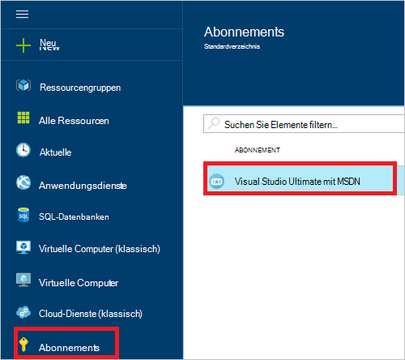
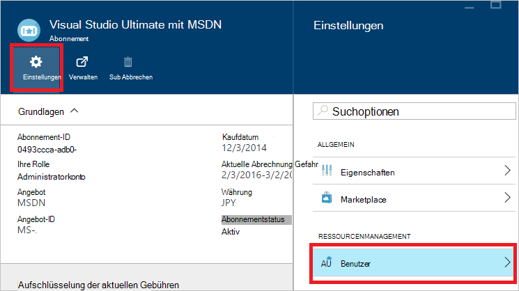
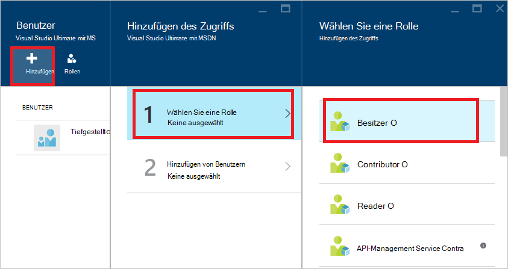
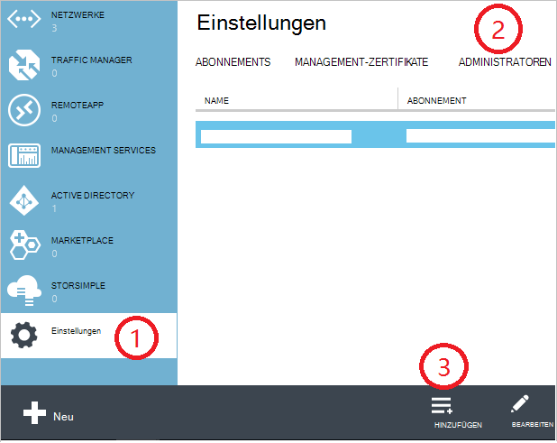
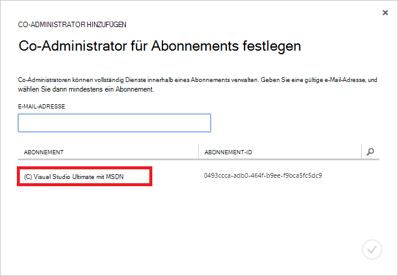
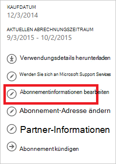
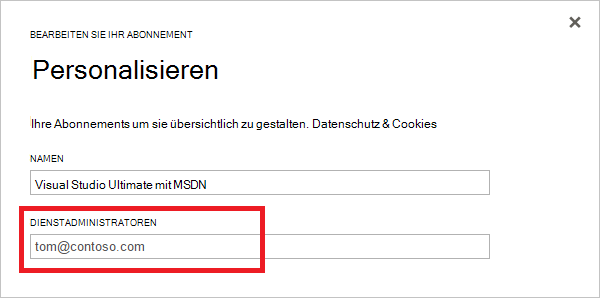

<properties
    pageTitle="Hinzufügen oder Ändern von Azure Administratorrollen | Microsoft Azure"
    description="Beschreibt, wie Sie hinzufügen oder Ändern von Azure Co-Administrator, Dienstadministratoren und Konto Administrator"
    services=""
    documentationCenter=""
    authors="genlin"
    manager="mbaldwin"
    editor=""
    tags="billing"/>

<tags
    ms.service="billing"
    ms.workload="na"
    ms.tgt_pltfrm="na"
    ms.devlang="na"
    ms.topic="article"
    ms.date="08/17/2016"
    ms.author="genli"/>

# Hinzufügen oder Ändern von Azure Administratorrollen

Es gibt drei Arten von Administratorrollen in Microsoft Azure:

| Administrative Rolle   | Grenzwert  | Beschreibung
| ------------- | ------------- |---------------|
|Konto-Administrator (AA)  | 1 pro Azure-Konto  |Dies ist die Person, die angemeldet oder gekauft Azure-Abonnements und [Account Center](https://account.windowsazure.com/Home/Index) zugreifen und verschiedene Verwaltungsaufgaben berechtigt. Diese beinhalten die Abonnements erstellen, Abonnements stornieren, ändern Sie die Rechnung für ein Abonnement und Dienstadministrator ändern.
| Dienstadministratoren (SA) | 1 pro Azure-Abonnement  |Diese Rolle ist autorisiert, Dienste im [Azure-Portal](https://portal.azure.com)verwalten. Standardmäßig für ein neues Abonnement ist der Kontoadministrator Dienstadministrator.|
|Co-Administrator (CA) im [klassischen Azure-portal](https://manage.windowsazure.com)|200 pro Abonnement| Diese Rolle verfügt über dieselben Zugriffsberechtigungen wie Dienstadministrator jedoch nicht die Zuordnung von Abonnements in Azure Verzeichnisse ändern. |

> [AZURE.NOTE] Azure Active Directory Role-based Access Control (RBAC) können Benutzer mehrere Rollen hinzugefügt werden. Weitere Informationen finden Sie unter [Azure Active Directory Role-based Access Control](./active-directory/role-based-access-control-configure.md).

> [AZURE.NOTE] Benötigen Sie weitere Hilfe zu diesem Artikel, bitte [wenden Sie](https://portal.azure.com/?#blade/Microsoft_Azure_Support/HelpAndSupportBlade) Ihr Problem schnell gelöst.

## Administrator für ein Abonnement hinzufügen

**Azure-portal**

1. Mit der [Azure-Portal](https://portal.azure.com)anmelden.

2. Wählen Sie im Hub **Abonnement** > *das Abonnement der Administrator zugreifen*.

    

3. **Blatt Abonnement Einstellungen**> **Benutzer**.

    
4. Wählen Sie im Blatt Benutzer **Hinzufügen**>**Wählen Sie eine Rolle** > **Eigentümer**.

    

    **Hinweis**
    - Die Rolle hat dieselben Zugriffsberechtigungen als Co-Administrator. Diese Rolle hat keinen Zugriffsrecht [Azure Account Center](https://account.windowsazure.com/subscriptions).
    - [Azure-Portal](https://portal.azure.com) hinzugefügte Besitzer können nicht im [klassischen Azure-Portal](https://manage.windowsazure.com)-Dienste verwalten.  

5. Geben Sie die e-Mail-Adresse des Benutzers als Besitzer hinzufügen und auf die Benutzer klicken Sie auf **auswählen**möchten.

    

**Azure-Verwaltungsportal**

1. Melden Sie sich bei [Azure-Verwaltungsportal](https://manage.windowsazure.com/)an.

2. **Wählen Sie im Navigationsbereich auf**> **Administratoren**> **Hinzufügen**.  

    

3. Geben Sie die e-Mail-Adresse der Person ein, die Sie als Co-Administrator hinzufügen, und wählen Sie dann das Abonnement den Co-Administrator zugreifen. 

     

Die folgende e-Mail-Adresse kann als Co-Administrator hinzugefügt werden:

* **Microsoft-Konto** (früher Windows Live ID)  
 Sie können Microsoft Account alle Consumer Microsoftprodukte anmelden und cloud-Dienste wie Outlook (Hotmail), Skype (MSN), OneDrive, Windows Phone und Xbox LIVE.
* **Organisatorische Konto** 
 Eine Organisationseinheit Konto ist ein Konto, das in Azure Active Directory erstellt wird. Organisatorische Kontoadresse ähnelt die folgenden: user@ &lt;der Domäne&gt;. onmicrosoft.com

### Einschränken

 * Jedes Abonnement wird Azure AD-Verzeichnis (auch bekannt als Standard Verzeichnis) zugeordnet. Um das Standard-Verzeichnis suchen das Abonnement zugeordnet ist, im [klassischen Azure-Portal](https://manage.windowsazure.com/), **Einstellungen** > **Abonnements**. Überprüfen Sie die Abonnement-ID, um das Standard-Verzeichnis gefunden.

 * Wenn Sie mit einem Microsoft Account angemeldet sind, können Sie nur andere Microsoft Accounts oder Benutzern im Verzeichnis standardmäßig als Co-Administrator hinzufügen.

 * Wenn Sie mit einer Organisationseinheit Konto angemeldet sind, können Sie andere Organisationseinheiten Konten in Ihrer Organisation als Co-Administrator hinzufügen. Beispielsweise abby@contoso.com können bob@contoso.com als Dienstadministrator oder Co-Administrator aber nicht hinzufügen john@notcontoso.com Wenn john@noncontoso.com ist im Standard-Verzeichnis. Mit Organisationseinheiten Konten angemeldete Benutzer können weiterhin Microsoft Account Benutzer als Dienstadministrator oder Co-Administrator hinzufügen.

 * Da Azure mit einer Organisationseinheit Konto anmelden kann, sind hier die Änderungen für Dienstadministratoren und Co-Administrator-Konto:

    Login-Methode| Hinzufügen Microsoft Account oder Benutzern im Verzeichnis standardmäßig als Zertifizierungsstelle oder SA?  |In der gleichen Organisation wie CA oder SA hinzufügen organisatorische Konto? |In anderen Unternehmen als Zertifizierungsstelle oder SA hinzufügen organisatorische Konto?
    ------------- | ------------- |---------------|---------------
    Microsoft-Konto |Ja|Nein|Nein
    Organisatorische Konto|Ja|Ja|Nein

## Dienstadministratoren für ein Abonnement ändern

Konto-Administrator kann die Dienstadministratoren für ein Abonnement ändern.

1. Melden Sie sich mit dem Konto Administrator in [Azure Account Center](https://account.windowsazure.com/subscriptions) .

2. Wählen Sie das Abonnement, das Sie ändern möchten.

3. Klicken Sie auf Details **Bearbeiten Abonnement** auf der rechten Seite.  

    

4. Geben Sie im Feld **DIENSTADMINISTRATOR** die e-Mail-Adresse des neuen Service-Administrators.  

    

## Konto-Administrator ändern

Übertragen an den Azure-Konto auf ein anderes Konto [Übertragen an Azure-Abonnement](billing-subscription-transfer.md)angezeigt.

## Nächste Schritte

* Weitere Informationen zum Zugriff auf Ressourcen wie in Microsoft Azure gesteuert wird, finden Sie unter [Understanding Ressourcenzugriff in Azure](./active-directory/active-directory-understanding-resource-access.md)

* Weitere Informationen zur Beziehung von Azure Active Directory Azure Abonnement finden Sie unter [wie Azure-Abonnements Azure Active Directory zugeordnet sind](./active-directory/active-directory-how-subscriptions-associated-directory.md)

* Weitere Informationen zur Beziehung von Azure Active Directory Azure Abonnement finden Sie unter [Zuweisen von Administratorrollen in Azure Active Directory](./active-directory/active-directory-assign-admin-roles.md)

> [AZURE.NOTE] Wenn Sie noch weitere Fragen haben, bitte [wenden Sie](https://portal.azure.com/?#blade/Microsoft_Azure_Support/HelpAndSupportBlade) Ihr Problem schnell gelöst.
