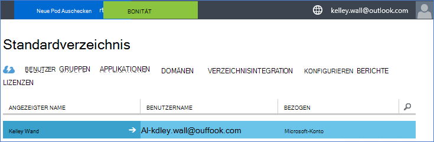
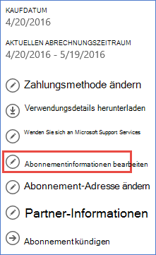
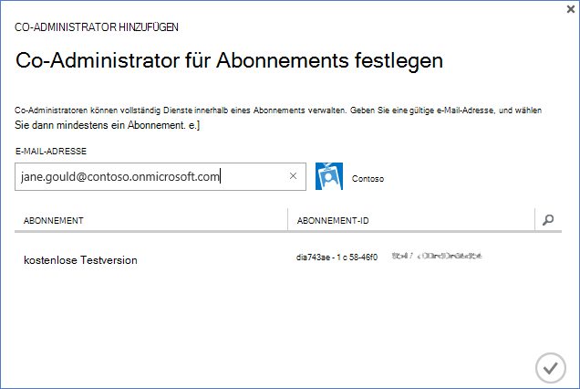

<properties
    pageTitle="Verwenden Sie einen Office 365-Mandanten mit Azure-Abonnement | Microsoft Azure"
    description="Informationen Sie zum Hinzufügen von Office 365-Verzeichnis (Mandant) Azure Abonnement Zuordnung."
    services=""
    documentationCenter=""
    authors="JiangChen79"
    manager="mbaldwin"
    editor=""
    tags="billing,top-support-issue"/>

<tags
    ms.service="billing"
    ms.workload="na"
    ms.tgt_pltfrm="ibiza"
    ms.devlang="na"
    ms.topic="article"
    ms.date="09/16/2016"
    ms.author="cjiang"/>

# Ein Azure-Abonnement einen Office 365-Mandanten zuordnen
Wenn Sie Azure und Office 365-Abonnements separat in der Vergangenheit, und Sie nun die Office 365-Mandanten aus der Azure-Abonnement können möchten, ist einfach. Dieser Artikel veranschaulicht.

> [AZURE.NOTE] Dieser Artikel gilt nicht für Konzernvertrag (EA) Kunden.

## Kurze Anleitung
Azure-Abonnement Ihr Office 365-Mandanten zuordnen mithilfe der Azure-Konto Ihre Office 365-Mandanten hinzu, und ordnen Sie Ihre Azure-Abonnement mit Office 365-Mandanten.

## Ausführliche Anleitung
In diesem Szenario Kelley Wall ist ein Benutzer mit Azure-Abonnement unter dem Konto kelley.wall@outlook.com. Kelley verfügt auch über ein Office 365-Abonnement unter dem Konto kelley.wall@contoso.onmicrosoft.com. Jetzt Kelley Office 365 Mieter Azure Abonnement zugreifen möchte.

### Erforderliche Komponenten
Für die Zuordnung ordnungsgemäß funktioniert sind die folgenden Komponenten erforderlich:

- Sie benötigen die Anmeldeinformationen Dienstadministrator Azure-Abonnement. Co-Administratoren können eine Teilmenge der Schritte nicht ausführen.
- Sie benötigen die Anmeldeinformationen des globalen Administrators der Office 365-Mandanten.
- Die e-Mail-Adresse des Administrators Service muss nicht in Office 365-Mandanten enthalten.
- Die e-Mail-Adresse Dienstadministrator muss nicht mit jeder globale Administrator Office 365 Mieter übereinstimmen.
- Wenn Sie gerade eine e-Mail-Adresse, die ein Microsoft-Konto und ein Konto Organisation verwenden, temporär Dienstadministrator der Azure-Abonnement um ein anderes microsoftkonto verwenden. Sie können ein neues microsoftkonto auf der [Microsoft-Konto-Anmeldeseite](https://signup.live.com/)erstellen.

Gehen Sie folgendermaßen vor, um den Dienstadministrator zu ändern:

1. Mit der [Kontenverwaltung Portal](https://account.windowsazure.com/subscriptions)anmelden.
2. Wählen Sie das Abonnement, das Sie ändern möchten.
3. Wählen Sie **Abonnementinformationen bearbeiten**.

    

4. Geben Sie im **DIENSTADMINISTRATOR** die e-Mail-Adresse des neuen Service-Administrators.

    

### Office 365 Mieter Azure-Abonnement zuordnen
Gehen Sie folgendermaßen vor, um Office 365 Mieter Azure-Abonnement zuzuordnen:

1.  Melden Sie sich bei der [Kontenverwaltung Portal](https://account.windowsazure.com/subscriptions) mit der.
2.  Wählen Sie im linken Bereich **ACTIVE DIRECTORY**.

    

    > [AZURE.NOTE] Office 365 Mieter sollte nicht angezeigt werden. Wenn es angezeigt wird, überspringen Sie den nächsten Schritt.

    

3. Azure-Abonnement Mieter Office 365 hinzufügen.

    ein. **Neu** > **Verzeichnis** > **benutzerdefinierte erstellen**.

    

    b. Wählen Sie auf der Seite **Verzeichnis hinzufügen** unter **Verzeichnis** **vorhandenen Verzeichnis verwenden**. Dann wählen Sie **ich möchte jetzt abgemeldet**und **vollständig** .

    

    c. Nachdem Sie sich abgemeldet haben, melden Sie sich mit der globale Administrator-Anmeldeinformationen von Ihrem Office 365-Mandanten.

    

    d. Wählen Sie **Weiter**.

    

    e. Wählen Sie **Abmelden**.

    

    f. Melden Sie sich bei der [Kontenverwaltung Portal](https://account.windowsazure.com/subscriptions) mit der.

    

    g. Ihr Office 365-Mandanten im Dashboard sollte angezeigt werden.

    

4. Wechseln der Azure-Abonnement zugeordnet.

    ein. **Wählen Sie.**

    

    b. Wählen Sie Ihre Azure-Abonnement, und wählen Sie **Verzeichnis bearbeiten**.
    

    c. Wählen Sie **Weiter** aus .

    

    > [AZURE.WARNING] Sie erhalten eine Warnung, dass alle CO-Administratoren entfernt werden.

    

    >[AZURE.WARNING] Darüber hinaus werden alle [Rollenbasierte Zugriffskontrolle (RBAC)](./active-directory/role-based-access-control-configure.md) Benutzer zugewiesen, auf die verfügbaren Ressourcengruppen entfernt werden. Jedoch wird die Warnung erhalten Sie nur Co-Administratoren entfernen.

    

    d. Wählen Sie **vollständig** .

5. Jetzt können Sie Ihre Organisation Office 365-Konten als Co-Administratoren Mieter Azure Active Directory hinzufügen.

    ein. **Administratoren** die Registerkarte, und wählen Sie **Hinzufügen**.

    

    b. Geben Sie eine Organisationseinheit ein Office 365-Mandanten Azure Abonnement, und wählen Sie **vollständig** .

    

    c. Zurück zur Registerkarte " **Administratoren** ". Organisatorische Konto als Co-Administrator sollte angezeigt werden.

    

6. Anschließend können Sie mit Co-Administrator Zugriff testen.

    ein. Account-Management-Portal anmelden.

    b. Öffnen Sie das [Account Management-Portal](https://account.windowsazure.com/subscriptions) oder [Azure-Portal](https://portal.azure.com/).

    c. Verfügt die Azure-Anmeldeseite eine Verknüpfung **der Organisation-Konto anmelden**, klicken Sie auf. Andernfalls überspringen Sie diesen Schritt.

    

    d. Anmeldeinformationen Sie der Co-Administrator und wählen Sie dann **Anmelden**.

    

## Nächste Schritte
Zugehörige Szenarien:

- Sie bereits ein Office 365-Abonnement und Azure-Abonnement können jedoch vorhandenen Office 365 Benutzerkonten für Ihre Azure-Abonnement verwenden möchten.
- Sie Abonnent von Azure und ein Office 365-Abonnement für die Benutzer in Ihrem vorhandenen Azure Active Directory-Instanz abrufen möchten.

Wie diese Aufgaben finden Sie unter [Verwenden der vorhandenen Office 365 mit Ihrem Azure-Abonnement oder umgekehrt](billing-use-existing-office-365-account-azure-subscription.md).
