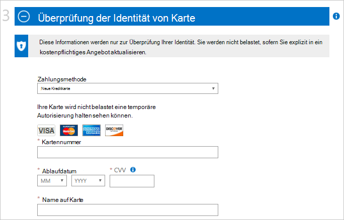
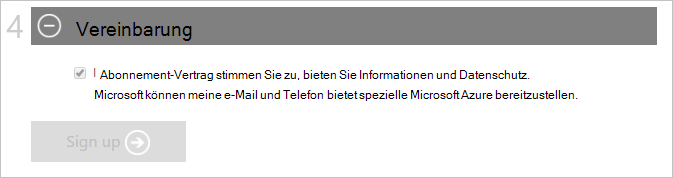

<properties
    pageTitle="Wie anmelden, kaufen, upgrade oder Azure-Abonnement aktivieren | Microsoft Azure"
    description="Beschreibt, wie Sie erwerben oder registrieren Sie sich für ein Azure-Abonnement"
    services=""
    documentationCenter=""
    authors="genlin"
    manager="mbaldwin"
    editor=""
    tags="billing,top-support-issue"
    />

<tags
    ms.service="billing"
    ms.workload="na"
    ms.tgt_pltfrm="na"
    ms.devlang="na"
    ms.topic="article"
    ms.date="09/23/2016"
    ms.author="genli"/>

# Wie anmelden, kaufen, aktualisieren oder Aktivieren von Azure

> [AZURE.NOTE] Benötigen Sie weitere Hilfe zu diesem Artikel, bitte [wenden Sie](https://portal.azure.com/?#blade/Microsoft_Azure_Support/HelpAndSupportBlade) Ihr Problem schnell gelöst.

Azure bietet verschiedene Angebote mit Azure Business Bedarf und. Besuchen Sie [Azure bietet](https://azure.microsoft.com/support/legal/offer-details/) eine vollständige Liste aller aktiven Angebote mit jedem Angebot was Sie Abdeckung, Vorteile und Verfügbarkeit nach Ländern/Regionen.

## Azure bietet - Vorteile und Grenzen

Die folgende Tabelle enthält Details zum gemeinsamen Angebote:

| Angebot                                                                              | Detail |
|--------------------------------------------------------------------------------------|---------|
| Kostenlose Testversion                                                                           |• [Anmeldung und Schritt für Schritt Handbuch](billing-buy-sign-up-azure-subscription.md#SignupFreeTrial) • [Vorteile](https://azure.microsoft.com/pricing/free-trial/) • [Häufig gestellte Fragen](https://azure.microsoft.com/pricing/free-trial-faq/) • [Kostenlose Testversion nutzungsbasierte aktualisieren](billing-buy-sign-up-azure-subscription.md#UpgradeFreeToPYG)     |
| Nutzungsbasierte                                                                        | • [Anmeldung](https://azure.microsoft.com/pricing/purchase-options/) • [Preise](https://azure.microsoft.com/pricing/)   |
| (Microsoft Partner Network) - MPN erhalten monatliche Azure Guthaben kostenlos | • [Azure Vorteile für Partner](https://azure.microsoft.com/offers/ms-azr-0025p/) • [Partner registrieren](http://go.microsoft.com/fwlink/?linkid=309258&clcid=0x409) oder [Abonnieren Microsoft Action pack](http://go.microsoft.com/fwlink/?linkid=525768&clcid=0x409) • Azure Gutschriften - [MPN-Portal](https://partner.microsoft.com) zugreifen und Ihre Berechtigung den Status überprüfen und Schritte Softwareschlüsseln & Vorteile. Wenden Sie Ihre Berechtigung überprüfen können, [MPN unterstützen](https://partner.microsoft.com/Support/).   |
| Abonnenten von MSDN und Visual Studio                                                      |• [MSDN-Vorteile für Test-/](https://azure.microsoft.com/offers/ms-azr-0023p/) • [Visual Studio Abonnementvorteile](https://azure.microsoft.com/pricing/member-offers/msdn-benefits-details/) • [Visual Studio aktiviert Abonnenten Azure-Gutschrift](https://azure.microsoft.com/pricing/member-offers/msdn-benefits-details/) • [Aktivieren Sie MSDN Azure Vorteile in drei einfachen Schritten](https://www.youtube.com/watch?v=SN2CA71uOEI&feature=youtu.be):  Anmeldung bei [MSDN Seite](https://msdn.microsoft.com/subscriptions/manage/default.aspx) Berechtigung und klicken Sie auf 'aktivieren Azure nutzen. Berechtigt überprüfen, wenden Sie sich an den [Kundendienst des MSDN-Abonnements](https://msdn.microsoft.com/subscriptions/contactus.aspx).|
| BizSpark                                                                             | • [Vorteile BizSpark](https://www.microsoft.com/bizspark/default.aspx#start-two). Weitere Informationen finden Sie unter [monatliche Azure-Gutschrift für Visual Studio Enterprise](https://azure.microsoft.com/offers/ms-azr-0064p/) • [BizSpark teilnehmen](https://www.microsoft.com/bizspark/signup/default.aspx). Wenn Probleme auftreten, wenden Sie sich an das [BizSpark-Team](mailto:bizspark@microsoft.com?subject=BizSpark%20Support&body=Thank%20you%20for%20contacting%20BizSpark.%20Please%20provide%20as%20much%20of%20the%20following%20information%20as%20possible,%20as%20it%20will%20help%20expedite%20our%20response%20to%20you.%0aContact%20name:%0aStartup%20name:%0aMicrosoft%20Account/Live%20ID:%0aSpecific%20description%20of%20issue%20experienced%20or%20question:%0a%0aThank%20you,%0a%0aThe%20BizSpark%20Team).      |
| BizSpark Plus                                                                        |• [BizSpark Plus erfahren](https://www.microsoft.com/bizspark/plus/default.aspx). Weitere Informationen finden Sie unter [BizSpark und Vorteile](https://azure.microsoft.com/offers/ms-azr-0149p/) • [BizSpark beitreten](https://www.microsoft.com/bizspark/signup/default.aspx) und dann arbeiten mit Ihrem Partner erhalten BizSpark Plus aktualisieren. Wenn Probleme auftreten, wenden Sie sich an das [BizSpark-Team](mailto:bizspark@microsoft.com?subject=BizSpark%20Support&body=Thank%20you%20for%20contacting%20BizSpark.%20Please%20provide%20as%20much%20of%20the%20following%20information%20as%20possible,%20as%20it%20will%20help%20expedite%20our%20response%20to%20you.%0aContact%20name:%0aStartup%20name:%0aMicrosoft%20Account/Live%20ID:%0aSpecific%20description%20of%20issue%20experienced%20or%20question:%0a%0aThank%20you,%0a%0aThe%20BizSpark%20Team).     |
| Fachhändler (Open Volumenlizenzprogrammen)                                             |• [Aktivieren Onlinedienst Schlüssel - Leitfaden](billing-buy-sign-up-azure-subscription.md#activateKey) • [Kauf Vorteile aktivieren](https://azure.microsoft.com/offers/ms-azr-0111p/)        |
| EA (Konzernvertrag)                                                            |• [Lizenzierung Azure für Unternehmen](https://azure.microsoft.com/pricing/enterprise-agreement/) • Zu aktivieren, wenden Sie sich an Ihren Microsoft Account Manager oder Händler heute Einstieg     |

## Für eine kostenlose Testversion von Azure-Abonnement anmelden

Um eine kostenlose Testversion von Azure Abonnement anmelden, müssen Sie eine Telefonnummer, eine Kreditkarte und Microsoft Account angeben. Ihr Microsoft-Konto ist die e-Mail-Adresse, zusammen mit dem Kennwort anmelden bei Windows Live-Programm oder Dienst, z. B. Outlook, Hotmail oder OneDrive. Sie können e-Mail-Adresse Sie e-Mails Unternehmen mit Microsoft-Konto einrichten. Weitere Informationen finden Sie im [Microsoft-Konto – häufig gestellte Fragen](https://www.microsoft.com/account/faq.aspx) .

Wenn Probleme auftreten, finden Sie unter [Azure Anmeldung-Problembehandlung](billing-troubleshoot-azure-sign-up-issues.md) .

>[AZURE.NOTE] Ihr Telefon Nummer und Kreditkarteninformationen werden nur zur Überprüfung Ihrer Identität verwendet. Obwohl Ihre Kreditkarte belastet wird, findet Microsoft eine Autorisierung halten auf ein Minimum an, dass die Kreditkarte gültig ist. Die Sperre wird innerhalb von 3 bis 5 Werktage, abhängig von Ihrer Bank Richtlinien veröffentlicht.

1. [Azure kostenlose Testversion Seite](https://azure.microsoft.com/pricing/free-trial/)öffnen Sie, und wählen Sie **Starten**.

2. Ihr Microsoft-Konto oder Organisationseinheit Konto anmelden.

3. Geben Sie im Abschnitt **über Sie** Ihre persönlichen Informationen. [Erfahren Sie mehr](billing-troubleshoot-azure-sign-up-issues.md#i-am-getting-an-error-when-entering-my-information-to-sign-up) über Ihre persönlichen Daten richtig eingeben.

    

    >[AZURE.NOTE] Die e-Mail-Adresse und Informationen, die Sie bei der Anmeldung für ein Azure-Abonnement werden immer mit dem Abonnement verknüpft und nicht später geändert werden.

4. Im Abschnitt **Überprüfung per Telefon** müssen Sie Telefonnummer um einen Bestätigungscode erhalten, den Sie angeben können, um die Überprüfung abzuschließen.

    Sie können den Verifizierungscode als Textnachricht oder über einen Sprachanruf erhalten. **Textnachricht senden** oder **Anrufen**wählen. Wählen Sie im ersten Feld der internationalen Vorwahl für Ihr Land, und geben Sie Ihre Telefonnummer im zweiten Feld. Nach den Verifizierungscode Erhalt in das dritte Feld Geben Sie, und wählen Sie die Schaltfläche **Code überprüfen** . [Diesem Artikel Weitere Informationen](billing-troubleshoot-azure-sign-up-issues.md#i-am-not-getting-text-messages-or-calls-during-account-verification-when-i-try-to-sign-up).

    >[AZURE.NOTE] Sie können keine VOIP-Telefonnummer für den Verifizierungsprozess verwenden.

    

    Wenn Sie eine Textnachricht oder einen Anruf erhalten, verwenden Sie eine andere Rufnummer oder [Azure](https://portal.azure.com/#blade/Microsoft_Azure_Support/HelpAndSupportBlade) Support um Hilfe.

5. Geben Sie im Abschnitt **Überprüfung mit** den Details einer gültigen Kreditkarte. Diese Informationen werden nur zur Überprüfung Ihrer Identität.

    Fehlermeldung nach dem Übermitteln von Kreditkarteninformationen, finden Sie im Artikel [Kreditkarte nicht beim Anmelden für Azure durchlaufen](billing-credit-card-fails-during-azure-sign-up.md).

    

6. Aktivieren Sie das im Abschnitt **Vereinbarung** stimmen Sie der Abonnementvertrag Einzelheiten und Datenschutz. Wählen Sie die **melden**. Vereinbarung Form kann je nach Land variieren.

    

    Es dauert einige Minuten, um Ihr Abonnement einzurichten. Wenn Setup Abonnement nicht innerhalb von 15 Minuten abgeschlossen, erhalten Sie [Azure-Support](https://portal.azure.com/#blade/Microsoft_Azure_Support/HelpAndSupportBlade) Hilfe.

    > [AZURE.NOTE] Wenn Sie eine Fehlermeldung erhalten, führen Sie die Schritte in der Nachricht, um das Problem zu beheben. Normale Fehlermeldung lautet:

    > **Leider können wir den Vorgang abschließen nicht. Bitte versuchen Sie es später erneut oder Laden der Webseite**

    > In diesem Fall verwenden Sie einen anderen Browser um die Anmeldung abzuschließen. Wenn das Problem weiterhin auftritt, erhalten Sie [Azure-Support](https://portal.azure.com/#blade/Microsoft_Azure_Support/HelpAndSupportBlade) Hilfe.

7. Wenn Abonnements bereit ist, wählen Sie beginnen **Verwalten Meine Service** .

    

### Zusätzliche Ressourcen

- [Ein Azure-Testversion kann nicht aktiviert werden.](billing-troubleshoot-azure-sign-up-issues.md#i-cant-activate-an-azure-free-trial)
- [Azure-Testversion FAQ](https://azure.microsoft.com/pricing/free-trial-faq/).

## Azure-Testversion auf nutzungsbasierte aktualisieren

1. Melden Sie sich mit dem Microsoft-Konto oder Ihre Organisation sich für die kostenlose Testversion Konto [Azure Kontoportal](https://account.windowsazure.com/subscriptions) .

2. Wählen Sie das Abonnement, und dann **Aktualisieren**

    

3. Wählen Sie **Ja**aus, und wählen Sie **Jetzt aktualisieren**.

    

Wenn Sie eine kostenlose Testabonnement nutzungsbasierte Abonnement aktualisieren, alle Vorteile aus Ihrer kostenlosen Testversion wie 30 Tage übrig oder 200 Euro Gutschrift auf Azure Services wird fortgesetzt, bis eines erschöpft ist. Abonnement-Upgrade erfolgt später.

## Mit Online-Service-Aktivierungsschlüssel aktivieren

Gehen folgendermaßen Sie vor, um Ihr Abonnement zu aktivieren, wenn **Azure in Open** Guthaben bei einem Händler gekauft und eine Aktivierung (5 x 5-Taste haben):

1. Zur [Zusammenfassungsseite Abonnement](https://account.windowsazure.com/subscriptions).

2. Wählen Sie **Azure in öffnen**. Wählen Sie auf [Azure in Open License Key](https://azure.microsoft.com/offers/ms-azr-0111p/) **ein neues Abonnement aktivieren oder Abonnement**.

3. Geben Sie Product Key ein und dann das Kontrollkästchen Sie Lizenzvertrag.

> [AZURE.NOTE] Wenn Sie noch weitere Fragen haben, bitte [wenden Sie](https://portal.azure.com/?#blade/Microsoft_Azure_Support/HelpAndSupportBlade) Ihr Problem schnell gelöst.
