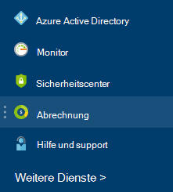

<properties
    pageTitle="Verstehen der Azure externe Servicegebühren | Microsoft Azure"
    description="Informationen Sie zur Abrechnung von externen Diensten, ehemals Markt Gebühren in Azure."
    services=""
    documentationCenter=""
    authors="adpick"
    manager="felixwu"
    editor=""
    tags="billing"
    />

<tags
    ms.service="billing"
    ms.workload="na"
    ms.tgt_pltfrm="na"
    ms.devlang="na"
    ms.topic="article"
    ms.date="10/12/2016"
    ms.author="adpick"/>

# Verstehen der Azure externe Gebühren

Dieser Artikel erläutert die Abrechnung von externen Diensten in Azure. Externe Dienste verwendet Markt Aufträge aufgerufen werden. Externe Dienste werden von unabhängigen Softwareherstellern bereitgestellt, jedoch sind vollständig in Azure Ökosystem integriert. Erfahren Sie, wie Sie:

- Externe Dienste identifizieren
- Verstehen Sie, wie die Abrechnung von Azure-Ressourcen unterscheidet
- Anzeigen und Verfolgen von Kosten, die Sie Sammeln von der Verwendung von externen Diensten
- Verwalten von externen Serviceaufträge und wie Sie Zahlen

## Was sind externe Dienste Azure?

Externe Dienste verwendet Azure Marketplace aufgerufen werden. Im Allgemeinen sind Dienste von Drittanbietern verfügbar für Azure veröffentlicht. ClearDB und SendGrid sind z. B. externe Dienste, die in Azure erwerben können, jedoch nicht von Microsoft veröffentlicht.

### Externe Dienste identifizieren

Wenn Sie einen neuen externen Dienst oder eine Ressource bereitstellen, wird eine Warnung angezeigt:

>[AZURE.NOTE] Externe Dienste werden von Unternehmen, die nicht Microsoft veröffentlicht, aber manchmal Microsoft-Produkte sind auch als externe Dienste.

### Externe Dienste werden separat berechnet.

Externe Dienste werden als einzelne Aufträge innerhalb Ihrer Azure-Abonnement. Abrechnungszeitraum für jeden Dienst wird beim Erwerb des Dienstes festgelegt. Nicht zu verwechseln mit den Abrechnungszeitraum des Abonnements unter dem Sie erworben haben. Sie auch separate Rechnungen und Ihre Kreditkarte wird separat.

### Jeder externer Dienst verfügt über ein anderes Modell Abrechnung

Einige Dienste werden auf Bedarfsbasis Weise berechnet, während andere monatliche je zahlungsmodell. Benötigen Sie eine Kreditkarte für Azure externe Dienste, externe Dienste mit Rechnung nicht kaufen.

### Monatliche Guthaben kostenlose können für externe Dienste keine

Verwenden Sie ein Azure-Abonnement, das [kostenlose Credits](https://azure.microsoft.com/pricing/spending-limits/)enthält, können sie zum externen Dienst Rechnungen angewendet werden. Verwenden einer Kreditkarte externe Dienste erwerben.

## Ausgaben anzeigen externer Dienst und Verlauf

Sie können eine Liste der externen Dienste anzeigen, die für jedes Abonnement in der [Azure-Portal](https://portal.azure.com/): 

1. Melden Sie sich bei [Azure-Portal](https://portal.azure.com/) und [Navigieren Sie zu der **Abrechnung** Blade](https://portal.azure.com/?flight=1#blade/Microsoft_Azure_Billing/BillingBlade).

     
  
2. Wählen Sie im Abschnitt **kostet** das Abonnement, das Sie anzeigen möchten. 
   
    

3. Klicken Sie auf **externe Dienste**.

    

4. Sie sollten sehen aller externen Serviceaufträge den Verlegernamen Dienstebene gekauften, Namen der Ressource und den aktuellen Auftragsstatus zugewiesen. Wählen Sie einen externen Dienst nach Rechnungen anzeigen.

    

5. Hier können Sie nach Zahlung Beträge einschließlich der Steuer anzeigen.

    

## Zahlungsmethoden für externe Serviceaufträge verwalten

Aktualisieren Sie Ihre Zahlungsmethoden für externe Serviceaufträge [Account Center](https://account.windowsazure.com/).

> [AZURE.NOTE] Wenn Sie Ihr Abonnement mit einer Arbeit oder Schule erworben sollten Sie [wenden](https://portal.azure.com/?#blade/Microsoft_Azure_Support/HelpAndSupportBlade) , um Ihre Zahlungsweise zu ändern.

1. [Account Center](https://account.windowsazure.com/) und [Navigieren Sie zur Registerkarte **Marketplace** ](https://account.windowsazure.com/Store) anmelden

    

2. Wählen Sie den externen Dienst verwalten möchten

    

3. Klicken Sie auf der rechten Seite der Seite **Zahlungsmethode ändern** . Dieser Link bringt ein anderes Portal zu Ihrer Zahlungsweise.
    
    

4. Klicken Sie auf **Info bearbeiten** und aktualisieren Ihre Zahlungsinformationen Anleitung.

    
    
## Externe Serviceauftrag stornieren

Wenn Sie externe Serviceauftrag stornieren möchten, müssen Sie das Löschen der Ressource in [Azure-Portal](https://portal.azure.com).

## Benötigen Sie Hilfe? Kontakt zum Support.

Wenn Sie noch weitere Fragen haben, bitte [wenden Sie](https://portal.azure.com/?#blade/Microsoft_Azure_Support/HelpAndSupportBlade) Ihr Problem schnell gelöst.
