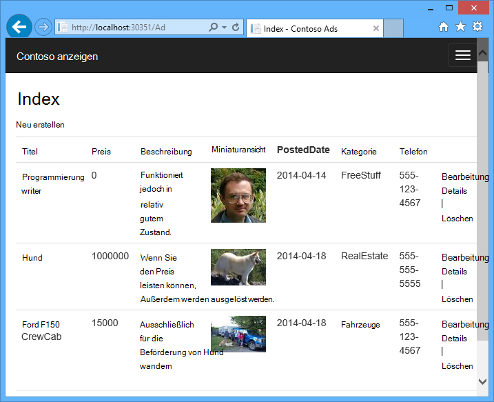
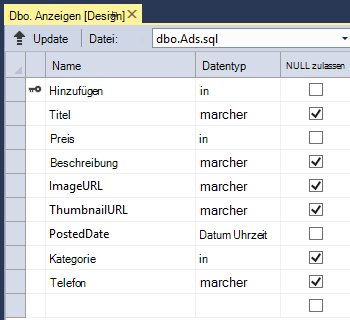
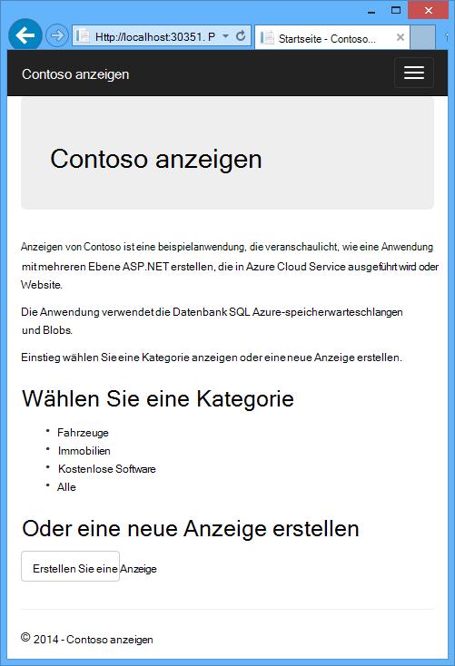
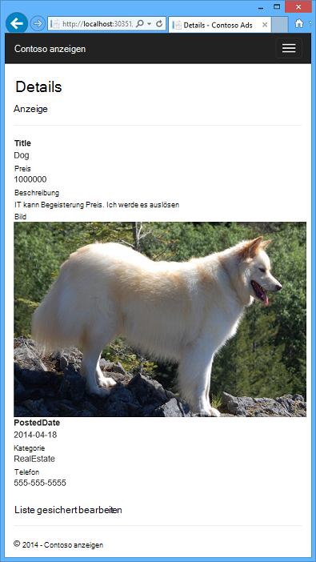

<properties
    pageTitle="Erste Schritte mit Azure Cloud Services und ASP.NET | Microsoft Azure"
    description="Informationen Sie zum Erstellen einer Multi-Tier-Anwendung mit ASP.NET MVC und Azure. Die Anwendung wird in einem Clouddienst Worker-Rolle mit Webrolle ausgeführt. Entity Framework, SQL-Datenbank und Azure Storage Warteschlangen und Blobs verwendet."
    services="cloud-services, storage"
    documentationCenter=".net"
    authors="Thraka"
    manager="timlt"
    editor=""/>

<tags
    ms.service="cloud-services"
    ms.workload="tbd"
    ms.tgt_pltfrm="na"
    ms.devlang="dotnet"
    ms.topic="hero-article"
    ms.date="06/10/2016"
    ms.author="adegeo"/>

# <a name="get-started-with-azure-cloud-services-and-aspnet"></a>Erste Schritte mit Azure Cloud Services und ASP.NET

> [AZURE.SELECTOR]
- [Node.js](cloud-services-nodejs-develop-deploy-app.md)
- [.NET](cloud-services-dotnet-get-started.md)

## <a name="overview"></a>Übersicht

In diesem Lernprogramm wird zum Erstellen einer Anwendung mit mehreren Ebenen .NET mit einer ASP.NET MVC-Front und eine [Azure-Cloud-Dienst](cloud-services-choose-me.md)bereitstellen. Die Anwendung verwendet [Azure SQL-Datenbank](http://msdn.microsoft.com/library/azure/ee336279), [Azure BLOB-Dienst](http://www.asp.net/aspnet/overview/developing-apps-with-windows-azure/building-real-world-cloud-apps-with-windows-azure/unstructured-blob-storage)und der [Azure-Warteschlangendienst](http://www.asp.net/aspnet/overview/developing-apps-with-windows-azure/building-real-world-cloud-apps-with-windows-azure/queue-centric-work-pattern). Sie können von der MSDN Code Gallery [herunterladen das Visual Studio-Projekt](http://code.msdn.microsoft.com/Simple-Azure-Cloud-Service-e01df2e4) .

Das Lernprogramm zeigt das Erstellen und die Anwendung lokal ausgeführt, wie in Azure bereitgestellt und in der Cloud ausgeführt und von Grund auf erstellen. Sie können zunächst völlig erstellen testen und Schritte auf Wunsch später bereitstellen.

## <a name="contoso-ads-application"></a>Anwendung von Contoso anzeigen

Die Anwendung ist ein Brett Werbung. Erstellen eine Anzeige eingeben von Text und ein Bild. Sie sehen eine Liste mit Miniaturansichten und sehen sie das Bild in voller Größe auswählen eine Anzeige sehen.



Die Anwendung [Warteschlange ausgerichteten Muster](http://www.asp.net/aspnet/overview/developing-apps-with-windows-azure/building-real-world-cloud-apps-with-windows-azure/queue-centric-work-pattern) , um CPU-Intensive Vorgänge erstellen Sie Miniaturansichten an einen Back-End-Prozess zu verteilen.

## <a name="alternative-architecture-websites-and-webjobs"></a>Alternative Architektur: Websites und Webaufträge

Dieses Lernprogramm zeigt ausführen Front-End- und Back-End in Azure Cloud-Dienst. Eine Alternative ist die Front-End-eine [Azure-Website](/services/web-sites/) und Funktion [Webaufträge](http://go.microsoft.com/fwlink/?LinkId=390226) (derzeit in Vorschau) für Back-End. Ein Tutorial Webaufträge verwendet, finden Sie unter [Erste Schritte mit Azure Webaufträge SDK](../app-service-web/websites-dotnet-webjobs-sdk-get-started.md). Informationen dazu, wie Sie die Dienste auswählen, die Ihr Szenario am besten geeignet finden Sie unter [Azure Websites, Cloud-Diensten und virtuellen Maschinen Vergleich](../app-service-web/choose-web-site-cloud-service-vm.md).

## <a name="what-youll-learn"></a>Sie erfahren

* Wie ermöglichen den Computer Azure-Entwicklung Azure SDK installieren.
* Ein Visual Studio-Projekt für den Cloud-Dienst mit einer ASP.NET MVC Webrolle und eine Worker-Rolle erstellen
* Wie Cloud-Dienstprojekt lokal testen mit dem Emulator Azure-Speicher.
* Die Cloud Veröffentlichen einer Azure Cloud Service project und Testen mithilfe eines Kontos Azure-Speicher.
* Zum Hochladen von Dateien und speichern sie in Azure BLOB-Dienst.
* Verwendung der Azure-Warteschlangendienst für die Kommunikation zwischen.

## <a name="prerequisites"></a>Erforderliche Komponenten

Das Lernprogramm wird vorausgesetzt, dass [grundlegende Konzepte zur Azure-Cloud-Dienste](cloud-services-choose-me.md) wie *Webrolle* und *Arbeitskraft* Terminologie verstehen.  Es wird vorausgesetzt, dass Sie zum Arbeiten mit [ASP.NET MVC](http://www.asp.net/mvc/tutorials/mvc-5/introduction/getting-started) oder [Web Forms](http://www.asp.net/web-forms/tutorials/aspnet-45/getting-started-with-aspnet-45-web-forms/introduction-and-overview) -Projekte in Visual Studio kennen. Beispiel-Anwendung verwendet MVC, aber die meisten des Lernprogramms auch Web Forms.

Führen Sie die Anwendung lokal ohne Azure-Abonnement, aber Sie benötigen eine Anwendung in der Cloud bereitstellen. Wenn Sie ein Konto haben, können Sie [Ihre MSDN-Abonnementvorteile aktivieren](/pricing/member-offers/msdn-benefits-details/?WT.mc_id=A55E3C668) oder [Registrieren Sie sich für eine kostenlose Testversion](/pricing/free-trial/?WT.mc_id=A55E3C668).

Anleitung Tutorial arbeiten mit den folgenden Produkten:

* Visual Studio 2013
* Visual Studio 2015

Wenn Sie eines dieser haben, wird Visual Studio 2015 Azure SDK installieren automatisch installiert.

## <a name="application-architecture"></a>Anwendungsarchitektur

Die Anwendung speichert in einer SQL-Datenbank mit Entity Framework Code First erstellt die Tabellen und Daten anzeigen. Die Datenbank speichert für jede Anzeige URLs für die Bilder in voller Größe und für die Miniaturansicht.



Wenn ein Benutzer ein Bild hochgeladen werden, Front-End in einer Webrolle ausgeführt speichert das Bild in eine [Azure blob](http://www.asp.net/aspnet/overview/developing-apps-with-windows-azure/building-real-world-cloud-apps-with-windows-azure/unstructured-blob-storage)und speichert die Informationen in der Datenbank mit einer URL für das Blob. Zur gleichen Zeit eine Nachricht in eine Azure-Warteschlange geschrieben. Ein Backend-Prozess in regelmäßigen Abständen auf eine Worker-Rolle fragt die Warteschlange auf neue Nachrichten. Eine neue Nachricht Worker-Rolle für dieses Bild eine Miniaturansicht erstellt und aktualisiert die Miniaturansicht URL-Datenbank für die Anzeige. Das folgende Diagramm zeigt, wie die Teile der Anwendung interagieren.


[AZURE.INCLUDE [install-sdk](../../includes/install-sdk-2015-2013.md)]

## <a name="download-and-run-the-completed-solution"></a>Herunterladen und Ausführen der fertigen Lösung

1. Herunterladen Sie und extrahieren Sie der [Lösung abgeschlossen](http://code.msdn.microsoft.com/Simple-Azure-Cloud-Service-e01df2e4).

2. Starten Sie Visual Studio.

3. Menü **Datei** **Projektdatei**navigieren, in denen die Lösung herunterladen und öffnen Sie die Projektmappendatei.

3. Drücken Sie STRG + UMSCHALT + B, um die Projektmappe zu erstellen.

    Standardmäßig stellt Visual Studio automatisch den NuGet-Paketinhalt, der nicht in der *ZIP-* Datei enthalten war. Wenn die Pakete nicht wiederhergestellt, installieren sie manuell im Dialogfeld **NuGet-Pakete verwalten, Lösung** und klicken auf die Schaltfläche **Wiederherstellen** oben rechts.

3. Stellen Sie im **Projektmappen-Explorer**sicher, dass **ContosoAdsCloudService** als Startprojekt ausgewählt ist.

2. Wenn Sie Visual Studio 2015 verwenden, ändern Sie die SQL Server-Verbindungszeichenfolge in der *Web.config* -Anwendungsdatei des Projekts ContosoAdsWeb und die *ServiceConfiguration.Local.cscfg* -Datei des Projekts ContosoAdsCloudService. In jedem Fall ändern Sie "(Localdb) \v11.0" in "(Localdb) \MSSQLLocalDB".

1. Drücken Sie STRG + F5, um die Anwendung auszuführen.

    Wenn Sie ein Cloud-Dienstprojekt lokal ausführen, startet Visual Studio automatisch Azure *compute Emulator* und Azure *Speicheremulator*. Serveremulator verwendet Ihre Computerressourcen Web Rolle und Worker-Rolle-Umgebung simuliert. Der Speicheremulator verwendet eine Datenbank [SQL Server Express LocalDB](http://msdn.microsoft.com/library/hh510202.aspx) Azure Cloud-Speicher zu simulieren.

    Beim ersten Ausführen ein Cloud-Dienstprojekt dauert eine Minute oder für Emulatoren zu starten. Abschluss der Emulator starten öffnet Standardbrowser an Anwendung.

    

2. Klicken Sie auf **eine Anzeige**.

2. Einige Testdaten eingeben und wählen ein *JPG* Bild hochladen und dann auf **Erstellen**.

    

    Die Anwendung geht zur Indexseite, aber zeigt eine Miniaturansicht der neuen Anzeige da die Verarbeitung noch nicht geschehen ist.

3. Warten Sie und aktualisieren Sie die Index-Seite um die Miniaturansicht anzuzeigen.

    

4. Klicken Sie auf **Details** für Ihre Anzeige um das Bild in voller Größe anzuzeigen.

    

Sie haben die Anwendung auf dem lokalen Computer keine Verbindung mit der Cloud ausgeführt wurde. Speicheremulator speichert die Warteschlange und BLOB-Daten in einer SQL Server Express LocalDB und die Anwendung speichert Ad-Daten in einer anderen Datenbank LocalDB. Entity Framework Code First erstellt automatisch die Ad-Datenbank zum ersten Mal die Webanwendung darauf zugreifen.

Im folgenden Abschnitt Konfigurieren Sie die Lösung in der Cloud ausführen Azure-Cloud-Ressourcen für Warteschlangen, Blobs und der Anwendungsdatenbank verwendet. Wenn Sie weiterhin lokal ausgeführt werden, aber Cloud-Speicher und -Ressourcen, können Sie dies; Es ist nur eine Frage der Einstellung Verbindungszeichenfolgen wie sehen.

## <a name="deploy-the-application-to-azure"></a>Bereitstellen der Anwendung in Azure

Sie werden zum Ausführen der Anwendung in der Cloud folgendermaßen:

* Erstellen Sie einen Azure-Cloud-Dienst.
* Erstellen einer Azure SQL-Datenbank.
* Registrieren Sie Azure-Speicher.
* Konfigurieren Sie die Lösung in Azure Ausführen Ihrer Azure SQL-Datenbank verwendet.
* Konfigurieren Sie die Lösung, um Ihr Konto Azure-Speicher verwenden, wenn in Azure ausgeführt wird.
* Bereitstellen des Projekts mit dem Azure-Cloud-Dienst.

### <a name="create-an-azure-cloud-service"></a>Einen Azure-Cloud-Dienst erstellen

Ein Azure-Cloud-Dienst ist die Umgebung, die die Anwendung ausgeführt wird.

1. Öffnen Sie in Ihrem Browser [Azure-Verwaltungsportal](http://manage.windowsazure.com).

2. Klicken Sie auf **Neu > berechnen > Cloud Service > Erstellen Sie schnell**.

4. Geben Sie in das Eingabefeld URL ein URL-Präfix.

    Diese URL muss eindeutig sein.  Fehlermeldung erhalten, wenn das Präfix wählen Sie bereits von einem anderen Benutzer verwendet wird.

5. Wählen Sie den Bereich die Anwendung bereitgestellt werden soll.

    Dieses Feld gibt die Datencenter in Ihrem Cloud-Dienst gehostet wird. Produktionsanwendung wählen Sie Ihre Region für Ihre Kunden. Wählen Sie für dieses Lernprogramm den nächsten Bereich.

6. Klicken Sie auf **Cloud-Dienst erstellen**.

    In der folgenden Abbildung wird ein Cloud-Dienst mit URL-contosoads.cloudapp.net erstellt.

    

### <a name="create-an-azure-sql-database"></a>Erstellen Sie eine SQL Azure-Datenbank

Wenn die Anwendung in der Cloud ausgeführt wird, wird eine Cloud-Datenbank verwendet.

1. Klicken Sie im [klassischen Azure-Portal](http://manage.windowsazure.com)auf **Neu > Data Services > SQL Datenbank > Schnellerfassungsformular**.

1. Geben Sie im Textfeld **Den Namen** *Contosoads*.

1. Wählen Sie aus der Dropdownliste **Server** **neue SQL-Datenbank**.

    Wenn Ihr Abonnement bereits ein Server verfügt, können Sie alternativ, Server aus der Dropdown-Liste auswählen.

1. Wählen Sie für den Clouddienst auswählen derselben **Region** .

    Wenn der Cloud-Dienst und die Datenbank sind in verschiedenen Rechenzentren (unterschiedliche Regionen) Latenz erhöht und Sie Bandbreite außerhalb des Rechenzentrums berechnet werden. Bandbreite in einem Rechenzentrum ist.

1. Geben Sie einen Administrator- **Benutzernamen** und **ein Kennwort**.

    Bei Auswahl der **neuen SQL-Datenbankserver** einen vorhandenen Namen und Kennwort eingeben werden nicht eingeben Sie einen neuen Namen und das Kennwort, das Sie jetzt definieren später beim Zugriff auf die Datenbank verwendet. Wenn Sie einen Server ausgewählt haben, den Sie zuvor erstellt haben, werden Sie das Kennwort für das Administratorkonto aufgefordert werden bereits erstellt.

1. Klicken Sie auf **SQL-Datenbank**.

    

1. Nach Azure die Datenbank erstellt hat, klicken Sie im linken Bereich des Portals **SQL-Datenbanken** und klicken Sie dann auf den Namen der neuen Datenbank.

2. Klicken Sie auf die Registerkarte **Dashboard** .

3. Klicken Sie auf **Manage IP-Adressen zulässig**.

4. Ändern Sie unter **Dienste erlaubt** **Azure Services** auf **Ja**.

5. Klicken Sie auf **Speichern**.

### <a name="create-an-azure-storage-account"></a>Azure-Speicher registrieren

Ein Azure Storage-Konto bietet Ressourcen für Warteschlange und BLOB-Daten in der Cloud speichern.

In einer realen Anwendung würden normalerweise erstellen Sie separate Konten für Anwendung Daten oder Daten, und separate Daten und Daten entfallen. In diesem Lernprogramm verwenden Sie nur ein Konto.

1. Klicken Sie im [klassischen Azure-Portal](http://manage.windowsazure.com)auf **Neu > Data Services > Storage > Schnellerfassungsformular**.

4. Geben Sie im Feld **URL** ein URL-Präfix ein.

    Dieses Präfix und den Text im Feld sehen werden die eindeutige URL Ihres Speicherkontos. Wenn das eingegebene Präfix bereits von jemand anderem verwendet wurde, müssen Sie ein anderes Präfix wählen.

5. Festlegen der Dropdown-Liste **Region** auf den Bereich gewählte Cloud-Dienst.

    Wenn das Cloud-Dienst und Speicher sind in verschiedenen Rechenzentren (unterschiedliche Regionen) Latenz erhöht und Sie Bandbreite außerhalb des Rechenzentrums berechnet werden. Bandbreite in einem Rechenzentrum ist.

    Azure Gruppen bieten einen Mechanismus, um den Abstand zwischen Ressourcen in einem Rechenzentrum zu minimieren Wartezeit verkürzen. In diesem Lernprogramm werden keine Gruppen verwendet. Weitere Informationen finden Sie unter [Erstellen einer Gruppe Affinität in Azure](http://msdn.microsoft.com/library/jj156209.aspx).

6. Soll die Dropdownliste **Replikation** **lokal redundant**.

    Geo-Replikation für ein Speicherkonto aktiviert ist, wird in einem sekundären Datencenter um einen Failover auf diesen Speicherort im Falle einer Katastrophe am primären Speicherort gespeicherte Inhalt repliziert. Geo-Replikation kann zusätzliche Kosten anfallen. Für Test und Entwicklung im Allgemeinen möchten Geo-Replikation bezahlen. Weitere Informationen finden Sie unter [erstellen, verwalten oder löschen Sie ein Speicherkonto](../storage/storage-create-storage-account.md#replication-options).

5. Klicken Sie auf **Konto erstellen**.

    

    Im Bild ein Speicherkonto erstellt, mit dem URL `contosoads.core.windows.net`.

### <a name="configure-the-solution-to-use-your-azure-sql-database-when-it-runs-in-azure"></a>Konfigurieren Sie die Lösung in Azure Ausführen Ihrer Azure SQL-Datenbank verwendet

Das Webprojekt und Arbeitskraft Rolle Projekt verfügt über eine eigene Verbindungszeichenfolge und jede muss SQL Azure-Datenbank auf, wenn die Anwendung in Azure ausgeführt wird.

Sie verwenden eine [Web.config-Transformation](http://www.asp.net/mvc/tutorials/deployment/visual-studio-web-deployment/web-config-transformations) für die Web-Rolle und eine Cloud Service-Umgebung Worker-Rolle.

>[AZURE.NOTE] In diesem und im nächsten Abschnitt speichern Sie Anmeldeinformationen in Projektdateien. [Speichern Sie vertrauliche Daten in öffentlichen Quellcode-Repositorys nicht](http://www.asp.net/aspnet/overview/developing-apps-with-windows-azure/building-real-world-cloud-apps-with-windows-azure/source-control#secrets).

1. Im ContosoAdsWeb-Projekt öffnen Sie die Datei *Web.Release.config* Transformation für die *Web.config* -Datei der Anwendung, löschen Sie den Kommentarblock enthält ein `<connectionStrings>` Element, und fügen Sie folgenden code ersetzt.

    ```xml
    <connectionStrings>
        <add name="ContosoAdsContext" connectionString="{connectionstring}"
        providerName="System.Data.SqlClient" xdt:Transform="SetAttributes" xdt:Locator="Match(name)"/>
    </connectionStrings>
    ```

    Lassen Sie die Datei zur Bearbeitung geöffnet.

2. Klicken Sie im [klassischen Azure-Portal](http://manage.windowsazure.com)im linken Bereich auf **SQL-Datenbanken** , klicken Sie auf die in diesem Lernprogramm erstellte Datenbank klicken Sie auf die Registerkarte **Dashboard** und klicken Sie dann auf **Verbindungszeichenfolgen anzeigen**.

    

    Verbindungszeichenfolgen mit einem Platzhalter für das Kennwort angezeigt.

    

4. Löschen Sie die Datei *Web.Release.config* Transformation `{connectionstring}` und ADO.NET Verbindungszeichenfolge aus der Azure-Verwaltungsportal an seiner Stelle einfügen.

5. Ersetzen Sie die Datei *Web.Release.config* eingefügt Verbindungszeichenfolge `{your_password_here}` mit dem Kennwort für die neue SQL-Datenbank erstellt.

7. Speichern Sie die Datei.  

6. Markieren Sie und kopieren Sie die Verbindungszeichenfolge (ohne die umgebenden Anführungszeichen) zur Verwendung in den folgenden Schritten Konfigurieren des Projekts Worker-Rolle.

5. Im **Projektmappen-Explorer**im Projekt für den Cloud-Dienst **Rollen** Maustaste auf **ContosoAdsWorker** , und klicken Sie dann auf **Eigenschaften**.

    

6. Klicken Sie auf **die Registerkarte** .

7. Ändern Sie **Dienstkonfiguration** **Cloud**.

7. Wählen Sie das Feld **Wert** für die `ContosoAdsDbConnectionString` festlegen, und fügen Sie die Verbindungszeichenfolge, die Sie im vorherigen Abschnitt des Lernprogramms kopiert.

    

7. Speichern.  

### <a name="configure-the-solution-to-use-your-azure-storage-account-when-it-runs-in-azure"></a>Konfigurieren Sie die Lösung, um Ihr Konto Azure-Speicher verwenden, bei der Ausführung in Azure

Azure-Speicher Konto Verbindungszeichenfolgen für das Webprojekt Rolle und Arbeitskraft Rolle Projekt werden in umgebungseinstellungen in der Cloud-Dienstprojekt gespeichert. Für jedes Projekt ist eigene Einstellungen verwendet werden, wenn die Anwendung lokal ausgeführt wird und in der Cloud ausgeführt wird. Die Cloud-umgebungseinstellungen für Web- und Workerrollen Rolle Projekte aktualisieren.

1. Im **Projektmappen-Explorer**mit der rechten Maustaste unter **Rollen** **ContosoAdsWeb** im **ContosoAdsCloudService** -Projekt und klicken Sie dann auf **Eigenschaften**.

    

2. Klicken Sie auf **die Registerkarte** . Wählen Sie im Dropdownmenü **Konfiguration** **Cloud**.

    

3. Eintrag für die **StorageConnectionString** , und Sie sehen eine Schaltfläche mit Auslassungszeichen****am rechten Ende der Zeile. Klicken Sie auf Auslassungsschaltfläche, um das Dialogfeld **Storage-Konto-Verbindungszeichenfolge erstellen** .

    

4. Klicken Sie im Dialogfeld **Storage-Verbindungszeichenfolge erstellen** auf **Ihr Abonnement**, wählen Sie das Speicherkonto, das Sie zuvor erstellt haben und klicken Sie auf **OK**. Wenn Sie nicht bereits angemeldet sind, werden Sie Ihre Azure-Konto-Anmeldeinformationen aufgefordert.

    

5. Speichern.

6. Dasselbe Verfahren, mit denen für die `StorageConnectionString` Verbindungszeichenfolge festlegen der `Microsoft.WindowsAzure.Plugins.Diagnostics.ConnectionString` Verbindungszeichenfolge.

    Diese Verbindungszeichenfolge wird für die Protokollierung verwendet.

7. Führen Sie das Verfahren, das Sie für die **ContosoAdsWeb** -Rolle mit beiden Verbindungszeichenfolgen für die **ContosoAdsWorker** Rolle festgelegt. Vergessen Sie nicht, **Cloud** **-Dienstkonfiguration** fest.

Die umgebungseinstellungen, die Konfiguration mithilfe der Visual Studio-Benutzeroberfläche werden in den folgenden Dateien im Projekt ContosoAdsCloudService gespeichert:

* *ServiceDefinition.csdef* - definiert die Einstellungsnamen.
* *ServiceConfiguration.Cloud.cscfg* - stellt Werte für Wenn die app in der Cloud ausgeführt wird.
* *ServiceConfiguration.Local.cscfg* - stellt Werte für Wenn die Anwendung lokal ausgeführt wird.

Die ServiceDefinition.csdef enthält z. B. die folgenden Definitionen.

```xml
<ConfigurationSettings>
    <Setting name="StorageConnectionString" />
    <Setting name="ContosoAdsDbConnectionString" />
</ConfigurationSettings>
```

Und die Datei *ServiceConfiguration.Cloud.cscfg* enthält die Werte für diese Einstellung in Visual Studio.

```xml
<Role name="ContosoAdsWorker">
    <Instances count="1" />
    <ConfigurationSettings>
        <Setting name="StorageConnectionString" value="{yourconnectionstring}" />
        <Setting name="ContosoAdsDbConnectionString" value="{yourconnectionstring}" />
        <!-- other settings not shown -->

    </ConfigurationSettings>
    <!-- other settings not shown -->

</Role>
```

Die `<Instances>` Einstellung gibt die Anzahl von virtuellen Maschinen, die Azure Arbeitskraft Rollencode ausgeführt wird. [Nächste](#next-steps) Schritte enthält Links zu weiteren Informationen zum Cloud-Dienst skalieren,

###  <a name="deploy-the-project-to-azure"></a>In Azure bereitstellen

1.  Im **Projektmappen-Explorer**mit der rechten Maustaste **ContosoAdsCloudService** Cloud-Projekt, und wählen Sie **Veröffentlichen**.

    

2. Klicken Sie im Schritt **Anmelden** **Azure-Anwendung veröffentlichen** -Assistenten auf **Weiter**.

    

3. Klicken Sie im Schritt **Einstellungen** des Assistenten auf **Weiter**.

    

    Die Registerkarte **Erweitert** sind gut für dieses Lernprogramm. Informationen zur Registerkarte Erweitert finden Sie unter [Assistent Azure veröffentlichen](http://msdn.microsoft.com/library/hh535756.aspx).

4. Klicken Sie im Schritt **Zusammenfassung** **Veröffentlichen**.

    

   **Azure Activity Log** -Fenster wird in Visual Studio geöffnet.

5. Klicken Sie auf den Pfeil nach rechts, um die Bereitstellungsdetails erweitern.

    Die Bereitstellung kann bis zu 5 Minuten oder länger dauern.

    

6. Klicken Sie nach Abschluss des Bereitstellungsstatus **Web app-URL** zum Starten der Anwendung.

7. Sie können die Anwendung jetzt testen durch erstellen, anzeigen und Bearbeiten von Werbung, wie die Anwendung lokal ausgeführt.

>[AZURE.NOTE] Wenn Sie Tests löschen oder Cloud-Dienst beenden. Selbst wenn Sie Cloud-Dienst nicht verwenden, ist es Zuschläge antizipieren, da virtuelle Computerressourcen vorbehalten sind. Und wenn Sie laufen lassen, kann alle, die den URL erstellen und anzeigen. Im [klassischen Azure-Portal](http://manage.windowsazure.com)wechseln Sie zur Registerkarte **Dashboard** für den Clouddienst, und klicken Sie auf die Schaltfläche **Löschen** am unteren Rand der Seite. Wenn Sie vorübergehend andere auf die Site zugreifen möchten, klicken Sie stattdessen auf **Beenden** . In diesem Fall weiterhin Gebühren anfallen. Sie können ein ähnliches Verfahren, um die SQL-Datenbank und Konto löschen, wenn Sie nicht mehr benötigen folgen.

## <a name="create-the-application-from-scratch"></a>Die Anwendung von Grund auf neu erstellen

Wenn Sie [die fertiggestellte Anwendung](http://code.msdn.microsoft.com/Simple-Azure-Cloud-Service-e01df2e4)heruntergeladen haben, dies jetzt. Sie können Dateien aus dem heruntergeladenen Projekt in das neue Projekt kopieren.

Erstellen der Contoso anzeigen Anwendung umfasst die folgenden Schritte:

* Erstellen Sie eine Cloud Service Visual Studio-Projektmappe.
* Aktualisieren und Hinzufügen von NuGet-Paketen.
* Verweisen auf Projekt.
* Konfigurieren von Verbindungszeichenfolgen.
* Fügen Sie Dateien hinzu.

Nachdem die Projektmappe erstellt wurde, prüfen Sie den Code, der zum Cloud-Dienst und Azure-Blobs und Warteschlangen eindeutig ist.

### <a name="create-a-cloud-service-visual-studio-solution"></a>Erstellen Sie eine Cloud Service Visual Studio-Projektmappe

1. Wählen Sie **Neues Projekt** in Visual Studio im Menü **Datei** .

2. Im linken Bereich des Dialogfelds **Neues Projekt** erweitern Sie **Visual C#** **Cloud** Vorlagen und **Azure Cloud Service** -Vorlage wählen.

3. **Nennen Sie das Projekt und Projektmappe ContosoAdsCloudService**

    

4. Klicken Sie im Dialogfeld **Neue Azure-Clouddienst** Hinzufügen einer Webrolle und eine Worker-Rolle. Nennen Sie die Web-Rolle ContosoAdsWeb und nennen Sie Worker-Rolle ContosoAdsWorker. (Verwenden Sie das Stiftsymbol im rechten Fensterbereich auf den Standardnamen der Rollen.)

    

5. Wenn für die Web-Rolle im Dialogfeld **Neues Projekt von ASP.NET** finden wählen Sie die MVC-Vorlage aus und dann auf **Authentifizierung ändern**.

    

7. Klicken Sie im Dialogfeld **Authentifizierung ändern** wählen Sie **Keine Authentifizierung**, und klicken Sie auf **OK**.

    

8. Klicken Sie im Dialogfeld **Neues Projekt von ASP.NET** auf **OK**.

9. Im **Projektmappen-Explorer**mit der rechten Maustaste der Lösung (kein Projekt) und wählen Sie **Add - neues Projekt**.

11. Klicken Sie im Dialogfeld **Neues Projekt hinzufügen** wählen Sie **Windows** unter **Visual C#** im linken Fensterbereich und klicken Sie dann auf die Vorlage **Klassenbibliothek** .  

10. Nennen Sie das Projekt *ContosoAdsCommon*, und klicken Sie dann auf **OK**.

    Sie müssen die Entity Framework-Kontext und das Datenmodell von Web- und Workerrollen Rolle Projekte verweisen. Als Alternative könnte EF-bezogene Klassen im Webprojekt Rolle definieren und Worker-Rolle Projekt das Projekt verweisen. Aber in der alternative Ansatz Worker-Rolle Projekt auf Web-Assemblys müssen nicht.

### <a name="update-and-add-nuget-packages"></a>Aktualisieren und Hinzufügen von NuGet-Paketen

1. Öffnen Sie das Dialogfeld " **NuGet-Pakete verwalten** " für die Lösung.

2. Wählen Sie am oberen Fensterrand **Updates**.

3. Das *WindowsAzure.Storage* -Paket suchen Sie und ist in der Liste, wählen sie die Web- und Workerrollen Projekte in aktualisieren und klicken Sie dann auf **Aktualisieren**.

    Speicher-Clientbibliothek werden als Visual Studio-Projektvorlagen so häufig, die die Version finden Sie in einem neu erstellten geplanten muss aktualisiert werden.

4. Wählen Sie oben im Fenster **Durchsuchen**.

5. Suchen Sie *EntityFramework* NuGet-Paket und installieren sie alle drei Projekte.

6. *Microsoft.WindowsAzure.ConfigurationManager* NuGet-Paket suchen und installieren im Projekt Worker-Rolle.

### <a name="set-project-references"></a>Verweisen auf Projekt

1. Legen Sie im Projekt ContosoAdsWeb einen Verweis auf das Projekt ContosoAdsCommon. ContosoAdsWeb Projekt klicken und dann auf **Referenzen** - **Verweise hinzufügen**. Wählen Sie im Dialogfeld **Verweis-Manager** **Lösung – Projekte** im linken Fensterbereich aus, wählen Sie **ContosoAdsCommon**und klicken Sie auf **OK**.

2. Legen Sie im Projekt ContosoAdsWorker einen Verweis auf das Projekt ContosAdsCommon.

    ContosoAdsCommon enthält die Entity Framework-Modell und Kontext Klasse, die vom Front-End- und Back-End verwendet wird.

3. Legen Sie im ContosoAdsWorker-Projekt einen Verweis auf `System.Drawing`.

    Diese Assembly wird von Back-End zum Miniaturansichten Bilder konvertieren.

### <a name="configure-connection-strings"></a>Konfigurieren von Verbindungszeichenfolgen

In diesem Abschnitt Konfigurieren Sie Azure Storage und SQL-Verbindungszeichenfolgen für lokal testen. Die Bereitstellung zuvor in diesem Lernprogramm erläutert, wie die Verbindungszeichenfolgen für einrichten, wenn die Anwendung in der Cloud ausgeführt wird.

1. Im Projekt ContosoAdsWeb die Anwendungsdatei Web.config öffnen, und fügen Sie den folgenden `connectionStrings` Element nach dem `configSections` Element.

    ```xml
    <connectionStrings>
        <add name="ContosoAdsContext" connectionString="Data Source=(localdb)\v11.0; Initial Catalog=ContosoAds; Integrated Security=True; MultipleActiveResultSets=True;" providerName="System.Data.SqlClient" />
    </connectionStrings>
    ```

    Wenn Sie Visual Studio 2015 verwenden, ersetzen Sie "11.0" durch "MSSQLLocalDB".

2. Speichern.

3. Im ContosoAdsCloudService-Projekt mit der rechten Maustaste unter **Rollen**ContosoAdsWeb und klicken Sie dann auf **Eigenschaften**.

    

4. Eigenschaftenfenster **ContosAdsWeb [Funktion]** klicken Sie auf **die Registerkarte** , und klicken Sie auf **Einstellung hinzufügen**.

    **Konfiguration** **Alle**Konfigurationen lassen.

5. Fügen Sie eine neue Einstellung mit dem Namen *StorageConnectionString*. **Geben *ConnectionString*** und legen **Wert** auf *UseDevelopmentStorage = True*.

    

6. Speichern.

7. Folgen Sie der Verbindungszeichenfolge Speicher in der ContosoAdsWorker Eigenschaften hinzufügen.

8. Fügen Sie dann im Eigenschaftenfenster **ContosoAdsWorker [Funktion]** eine andere Verbindungszeichenfolge:

    * Name: ContosoAdsDbConnectionString
    * Typ: Zeichenfolge
    * Wert: Fügen Sie die gleiche Verbindungszeichenfolge für das Webprojekt Rolle verwendet. (Im folgende Beispiel wird Visual Studio 2013, vergessen Sie nicht, die Datenquelle zu ändern, wenn Sie dieses Beispiel kopieren und Sie Visual Studio 2015.)

        ```
        Data Source=(localdb)\v11.0; Initial Catalog=ContosoAds; Integrated Security=True; MultipleActiveResultSets=True;
        ```

### <a name="add-code-files"></a>Hinzufügen von Dateien

In diesem Abschnitt kopieren Sie Dateien in die neue Lösung heruntergeladene Lösung. Die folgenden Abschnitte zeigen und erläutern wichtige Teile des Codes.

Um ein Projekt oder einem Ordner Dateien hinzugefügt, Maustaste Projekt oder Ordner, und klicken Sie auf **Hinzufügen** - **Vorhandenes Element**. Wählen Sie die Dateien möchten und klicken Sie dann auf **Hinzufügen**. Wenn Sie gefragt werden, ob vorhandene Dateien ersetzen möchten, klicken Sie auf **Ja**.

3. Im ContosoAdsCommon-Projekt die Datei *Class1.cs* löschen und stattdessen die Dateien *Ad.cs* und *ContosoAdscontext.cs* aus dem heruntergeladenen Projekt hinzufügen.

3. Fügen Sie die folgenden Dateien im Projekt ContosoAdsWeb aus heruntergeladenen Projekt hinzu.
    - *Global.asax.cs*.  
    - Im Ordner *Views\Shared ebenfalls einen* : * \_Layout.cshtml*.
    - Im Ordner *Views\Home den* : *Index.cshtml*.
    - Im *Ordner* : *AdController.cs*.
    - Im Ordner " *Views\Ad* " (erstellen Sie zuerst den Ordner): fünf *cshtml* -Dateien.

3. Fügen Sie im Projekt ContosoAdsWorker *WorkerRole.cs* aus dem heruntergeladenen Projekt.

Jetzt erstellen und Ausführen die Anwendung wie zuvor in diesem Lernprogramm kann und die app lokale Datenbank und Speicherressourcen Emulator verwendet.

Die folgenden Abschnitte erläutern den Code in Zusammenhang mit der Azure-Umgebung Blobs und Warteschlangen. In diesem Lernprogramm erklären nicht, wie MVC-Controller und Ansichten Gerüstbau Entity Framework-Code schreiben, der SQL Server-Datenbanken und die Grundlagen der asynchronen Programmierung in ASP.NET 4.5 funktioniert. Informationen zu diesen Themen finden Sie in folgenden Ressourcen:

* [Erste Schritte mit MVC 5](http://www.asp.net/mvc/tutorials/mvc-5/introduction/getting-started)
* [Erste Schritte mit EF 6 und MVC 5](http://www.asp.net/mvc/tutorials/getting-started-with-ef-using-mvc)
* [Einführung in die asynchrone Programmierung in .NET 4.5](http://www.asp.net/aspnet/overview/developing-apps-with-windows-azure/building-real-world-cloud-apps-with-windows-azure/web-development-best-practices#async).

### <a name="contosoadscommon---adcs"></a>ContosoAdsCommon - Ad.cs

Ad.cs-Datei definiert eine Enumeration für Ad-Kategorien und eine Entitätsklasse POCO Ad-Informationen.

```csharp
public enum Category
{
    Cars,
    [Display(Name="Real Estate")]
    RealEstate,
    [Display(Name = "Free Stuff")]
    FreeStuff
}

public class Ad
{
    public int AdId { get; set; }

    [StringLength(100)]
    public string Title { get; set; }

    public int Price { get; set; }

    [StringLength(1000)]
    [DataType(DataType.MultilineText)]
    public string Description { get; set; }

    [StringLength(1000)]
    [DisplayName("Full-size Image")]
    public string ImageURL { get; set; }

    [StringLength(1000)]
    [DisplayName("Thumbnail")]
    public string ThumbnailURL { get; set; }

    [DataType(DataType.Date)]
    [DisplayFormat(DataFormatString = "{0:yyyy-MM-dd}", ApplyFormatInEditMode = true)]
    public DateTime PostedDate { get; set; }

    public Category? Category { get; set; }
    [StringLength(12)]
    public string Phone { get; set; }
}
```

### <a name="contosoadscommon---contosoadscontextcs"></a>ContosoAdsCommon - ContosoAdsContext.cs

Die ContosoAdsContext-Klasse gibt die Anzeige in einer Auflistung DbSet verwendet wird dem Entity Framework in einer SQL-Datenbank gespeichert werden.

```csharp
public class ContosoAdsContext : DbContext
{
    public ContosoAdsContext() : base("name=ContosoAdsContext")
    {
    }
    public ContosoAdsContext(string connString)
        : base(connString)
    {
    }
    public System.Data.Entity.DbSet<Ad> Ads { get; set; }
}
```

Die Klasse besitzt zwei Konstruktoren. Die erste von Webprojekt verwendet und gibt den Namen einer Verbindungszeichenfolge in der Datei Web.config gespeichert. Der zweite Konstruktor können Sie die aktuelle Verbindungszeichenfolge übergeben. Projekt Rolle Arbeitskraft erforderlich sind seit eine Web.config-Datei besitzt. Sie haben weiter oben gesehen, wo diese Verbindungszeichenfolge wurde gespeichert und sehen Sie später im Code die Verbindungszeichenfolge abruft, beim die DbContext-Klasse instanziiert.

### <a name="contosoadsweb---globalasaxcs"></a>ContosoAdsWeb - Global.asax.cs

Code, der aufgerufen wird die `Application_Start` Methode erstellt ein *Bilder* BLOB-Container und einer Warteschlange *Bilder* , wenn diese noch nicht vorhanden. So wird sichergestellt, dass wenn Sie ein neuen Speicherkonto verwenden oder Verwenden des Speicheremulators auf einem neuen Computer, die erforderlichen Blob-Container und Warteschlange automatisch erstellt werden.

Der Code erhält Zugriff auf das Speicherkonto mithilfe der Speicher aus der Datei *.cscfg* .

```csharp
var storageAccount = CloudStorageAccount.Parse
    (RoleEnvironment.GetConfigurationSettingValue("StorageConnectionString"));
```

Dann Ruft einen Verweis auf *Bilder* BLOB-Container, der Container wird erstellt, wenn dabei nicht bereits vorhanden ist und Zugriffsberechtigungen für den neuen Container. Standardmäßig können neue Container nur Clients mit Speicher Anmeldeinformationen Blobs auf. Die Website benötigt die Blobs öffentlich sein, damit Bilder Bild Blobs auf URLs angezeigt werden kann.

```csharp
var blobClient = storageAccount.CreateCloudBlobClient();
var imagesBlobContainer = blobClient.GetContainerReference("images");
if (imagesBlobContainer.CreateIfNotExists())
{
    imagesBlobContainer.SetPermissions(
        new BlobContainerPermissions
        {
            PublicAccess =BlobContainerPublicAccessType.Blob
        });
}
```

Ähnlicher Code Ruft einen Verweis auf die Warteschlange *Bilder* und erstellt eine neue Warteschlange. In diesem Fall braucht keine Berechtigungen ändern.

```csharp
CloudQueueClient queueClient = storageAccount.CreateCloudQueueClient();
var imagesQueue = queueClient.GetQueueReference("images");
imagesQueue.CreateIfNotExists();
```

### <a name="contosoadsweb---layoutcshtml"></a>ContosoAdsWeb - \_Layout.cshtml

*_Layout.cshtml* -Datei wird der Name der Anwendung in die Kopf- und Fußzeile und erstellt ein Menü "Anzeigen".

### <a name="contosoadsweb---viewshomeindexcshtml"></a>ContosoAdsWeb - Views\Home\Index.cshtml

Die Datei *Views\Home\Index.cshtml* zeigt Kategorien auf der Startseite. Links übergeben Sie den Wert der `Category` -Enumeration in Abfragezeichenfolgen-Variable auf der Seite anzeigen.

```razor
<li>@Html.ActionLink("Cars", "Index", "Ad", new { category = (int)Category.Cars }, null)</li>
<li>@Html.ActionLink("Real estate", "Index", "Ad", new { category = (int)Category.RealEstate }, null)</li>
<li>@Html.ActionLink("Free stuff", "Index", "Ad", new { category = (int)Category.FreeStuff }, null)</li>
<li>@Html.ActionLink("All", "Index", "Ad", null, null)</li>
```

### <a name="contosoadsweb---adcontrollercs"></a>ContosoAdsWeb - AdController.cs

*AdController.cs* Datei Konstruktor ruft die `InitializeStorage` -Methode Azure Storage-Clientbibliothek Objekte erstellen, die eine API mit Blobs und Warteschlangen ermöglichen.

Dann wird der Code einen Verweis auf *Bilder* BLOB-Container wie Sie zuvor in *Global.asax.cs*. Dabei, wird eine standardmäßige [Richtlinie erneut](http://www.asp.net/aspnet/overview/developing-apps-with-windows-azure/building-real-world-cloud-apps-with-windows-azure/transient-fault-handling) für eine Webanwendung geeignet. Die Standardrichtlinie für exponentielle Backoff wiederholen hängt Web app länger als eine Minute auf wiederholte Versuche für einen vorübergehenden Fehler. Die hier angegebene wiederholungsrichtlinie wartet 3 Sekunden nach jedem Versuch für bis zu 3 Versuche.

```csharp
var blobClient = storageAccount.CreateCloudBlobClient();
blobClient.DefaultRequestOptions.RetryPolicy = new LinearRetry(TimeSpan.FromSeconds(3), 3);
imagesBlobContainer = blobClient.GetContainerReference("images");
```

Ähnlicher Code Ruft einen Verweis auf die Warteschlange *Bilder* .

```csharp
CloudQueueClient queueClient = storageAccount.CreateCloudQueueClient();
queueClient.DefaultRequestOptions.RetryPolicy = new LinearRetry(TimeSpan.FromSeconds(3), 3);
imagesQueue = queueClient.GetQueueReference("images");
```

Die meisten der Controller-Code ist typisch für die Arbeit mit einer Entity Framework-Datenmodell eine DbContext-Klasse. Eine Ausnahme ist die HttpPost `Create` Methode, die eine Datei im BLOB-Speicher gespeichert. Der Modellbinder stellt ein [HttpPostedFileBase](http://msdn.microsoft.com/library/system.web.httppostedfilebase.aspx) Objekt der Methode.

```csharp
[HttpPost]
[ValidateAntiForgeryToken]
public async Task<ActionResult> Create(
    [Bind(Include = "Title,Price,Description,Category,Phone")] Ad ad,
    HttpPostedFileBase imageFile)
```

Wenn der Benutzer eine Datei zum Hochladen ausgewählt, der Code die Datei im Blob gespeichert und aktualisiert Active Directory-Datenbank-Datensatz mit einer URL für das Blob.

```csharp
if (imageFile != null && imageFile.ContentLength != 0)
{
    blob = await UploadAndSaveBlobAsync(imageFile);
    ad.ImageURL = blob.Uri.ToString();
}
```

Der Code, die den Upload ist in der `UploadAndSaveBlobAsync` Methode. Es erstellt ein GUID für das Blob uploads und speichert die Datei und gibt einen Verweis auf das gespeicherte Blob.

```csharp
private async Task<CloudBlockBlob> UploadAndSaveBlobAsync(HttpPostedFileBase imageFile)
{
    string blobName = Guid.NewGuid().ToString() + Path.GetExtension(imageFile.FileName);
    CloudBlockBlob imageBlob = imagesBlobContainer.GetBlockBlobReference(blobName);
    using (var fileStream = imageFile.InputStream)
    {
        await imageBlob.UploadFromStreamAsync(fileStream);
    }
    return imageBlob;
}
```

Nach HttpPost `Create` -Methode lädt einen Blob aktualisiert die Datenbank und erstellt eine Warteschlange, Back-End-Prozess darüber informieren, dass ein Bild zur Konvertierung in eine Miniaturansicht an.

```csharp
string queueMessageString = ad.AdId.ToString();
var queueMessage = new CloudQueueMessage(queueMessageString);
await queue.AddMessageAsync(queueMessage);
```

Der Code für die HttpPost `Edit` -Methode ist vergleichbar, außer dass alle Blobs vorhanden wählt der Benutzer eine neue Imagedatei gelöscht werden müssen.

```csharp
if (imageFile != null && imageFile.ContentLength != 0)
{
    await DeleteAdBlobsAsync(ad);
    imageBlob = await UploadAndSaveBlobAsync(imageFile);
    ad.ImageURL = imageBlob.Uri.ToString();
}
```

Das nächste Beispiel zeigt den Code, der Blobs löscht, wenn Sie eine Anzeige löschen.

```csharp
private async Task DeleteAdBlobsAsync(Ad ad)
{
    if (!string.IsNullOrWhiteSpace(ad.ImageURL))
    {
        Uri blobUri = new Uri(ad.ImageURL);
        await DeleteAdBlobAsync(blobUri);
    }
    if (!string.IsNullOrWhiteSpace(ad.ThumbnailURL))
    {
        Uri blobUri = new Uri(ad.ThumbnailURL);
        await DeleteAdBlobAsync(blobUri);
    }
}
private static async Task DeleteAdBlobAsync(Uri blobUri)
{
    string blobName = blobUri.Segments[blobUri.Segments.Length - 1];
    CloudBlockBlob blobToDelete = imagesBlobContainer.GetBlockBlobReference(blobName);
    await blobToDelete.DeleteAsync();
}
```

### <a name="contosoadsweb---viewsadindexcshtml-and-detailscshtml"></a>ContosoAdsWeb - Views\Ad\Index.cshtml und Details.cshtml

Die Datei *Index.cshtml* Zeigt Miniaturansichten mit anderen Active Directory-Daten.

```razor

```

Die Datei *Details.cshtml* zeigt das Bild in voller Größe.

```razor

```

### <a name="contosoadsweb---viewsadcreatecshtml-and-editcshtml"></a>ContosoAdsWeb - Views\Ad\Create.cshtml und Edit.cshtml

Die Dateien *Create.cshtml* und *Edit.cshtml* geben Formular Codierung, die zu dem Controller können die `HttpPostedFileBase` Objekt.

```razor
@using (Html.BeginForm("Create", "Ad", FormMethod.Post, new { enctype = "multipart/form-data" }))
```

Ein `<input>` Element weist den Browser an ein Dialogfeld zur Dateiauswahl bereitzustellen.

```razor
<input type="file" name="imageFile" accept="image/*" class="form-control fileupload" />
```

### <a name="contosoadsworker---workerrolecs---onstart-method"></a>ContosoAdsWorker - WorkerRole.cs - OnStart-Methode

Azure Worker-Rolle Umgebung Aufrufe der `OnStart` Methode in der `WorkerRole` Klasse bei der Worker-Rolle ist erste Schritte und ruft die `Run` Methode bei der `OnStart` -Methode beendet.

Die `OnStart` -Methode wird die Verbindungszeichenfolge aus der Datei *.cscfg* und Entity Framework DbContext-Klasse übergeben. Der SQLClient-Anbieter wird standardmäßig verwendet, damit der Anbieter nicht angegeben werden.

```csharp
var dbConnString = CloudConfigurationManager.GetSetting("ContosoAdsDbConnectionString");
db = new ContosoAdsContext(dbConnString);
```

Danach wird die Methode ruft einen Verweis auf das Speicherkonto und BLOB-Container und Warteschlange erstellt, wenn sie nicht vorhanden sind. Der Code dafür ähnelt was Sie bereits in der Webrolle gesehen `Application_Start` Methode.

### <a name="contosoadsworker---workerrolecs---run-method"></a>ContosoAdsWorker - WorkerRole.cs - Run-Methode

Die `Run` -Methode wird aufgerufen, wenn die `OnStart` -Methode beendet die Initialisierungsarbeit. Die Methode führt eine Endlosschleife, die neue Warteschlange Nachrichten überwacht und bei Ankunft verarbeitet.

```csharp
public override void Run()
{
    CloudQueueMessage msg = null;

    while (true)
    {
        try
        {
            msg = this.imagesQueue.GetMessage();
            if (msg != null)
            {
                ProcessQueueMessage(msg);
            }
            else
            {
                System.Threading.Thread.Sleep(1000);
            }
        }
        catch (StorageException e)
        {
            if (msg != null && msg.DequeueCount > 5)
            {
                this.imagesQueue.DeleteMessage(msg);
            }
            System.Threading.Thread.Sleep(5000);
        }
    }
}
```

Nach jeder Iteration der Schleife Wenn keine warteschlangenmeldung gefunden wurde, schläft das Programm eine zweite. Dadurch wird verhindert, dass Worker-Rolle übermäßige CPU-Zeit und Transaktion Kosten. Microsoft Customer Advisory Team erzählt Entwickler vergessen hat, dies, für die Produktion bereitgestellt und Urlaub nach. Als er wieder, Kosten seiner Aufsicht über den Urlaub.

Manchmal wird der Inhalt einer Warteschlange Nachricht Fehler Verarbeitung. Dies ist eine *nicht verarbeitbare Nachricht*aufgerufen und wenn nur Fehler protokolliert und die Schleife gestartet, konnte Sie endlos versuchen, die Nachricht zu verarbeiten.  Catch-Block enthält daher eine If-Anweisung überprüft, wie oft die Anwendung hat versucht, die aktuelle Nachricht und es mehr als 5 Mal wurde, wird die Nachricht aus der Warteschlange gelöscht.

`ProcessQueueMessage`wird aufgerufen, wenn eine warteschlangennachricht gefunden wird.

```csharp
private void ProcessQueueMessage(CloudQueueMessage msg)
{
    var adId = int.Parse(msg.AsString);
    Ad ad = db.Ads.Find(adId);
    if (ad == null)
    {
        throw new Exception(String.Format("AdId {0} not found, can't create thumbnail", adId.ToString()));
    }

    CloudBlockBlob inputBlob = this.imagesBlobContainer.GetBlockBlobReference(ad.ImageURL);

    string thumbnailName = Path.GetFileNameWithoutExtension(inputBlob.Name) + "thumb.jpg";
    CloudBlockBlob outputBlob = this.imagesBlobContainer.GetBlockBlobReference(thumbnailName);

    using (Stream input = inputBlob.OpenRead())
    using (Stream output = outputBlob.OpenWrite())
    {
        ConvertImageToThumbnailJPG(input, output);
        outputBlob.Properties.ContentType = "image/jpeg";
    }

    ad.ThumbnailURL = outputBlob.Uri.ToString();
    db.SaveChanges();

    this.imagesQueue.DeleteMessage(msg);
}
```

Dieser Code liest die Datenbank der Bild-URL zu, konvertiert das Bild in einer Miniaturansicht die Miniaturansicht in einem Blob gespeichert, aktualisiert die Datenbank mit der Miniaturansicht Blob-URL und löscht die warteschlangennachricht.

>[AZURE.NOTE] Der Code in der `ConvertImageToThumbnailJPG` -Methode verwendet Klassen im System.Drawing-Namespace Einfachheit. Allerdings wurden die Klassen in diesem Namespace für die Verwendung mit Windows Forms konzipiert. Sie sind nicht zur Verwendung in einem Dienst von Windows oder ASP.NET unterstützt. Weitere Informationen über Bildverarbeitungsoptionen finden Sie unter [Dynamic Image Generation](http://www.hanselman.com/blog/BackToBasicsDynamicImageGenerationASPNETControllersRoutingIHttpHandlersAndRunAllManagedModulesForAllRequests.aspx) und [Tiefe innerhalb der Bildgröße](http://www.hanselminutes.com/313/deep-inside-image-resizing-and-scaling-with-aspnet-and-iis-with-imageresizingnet-author-na).

## <a name="troubleshooting"></a>Problembehandlung

Für den Fall, dass etwas funktioniert, während Sie die Schritte in diesem Lernprogramm folgen, sind hier einige häufige Fehler und deren Behebung.

### <a name="serviceruntimeroleenvironmentexception"></a>ServiceRuntime.RoleEnvironmentException

Die `RoleEnvironment` Objekt wird beim Ausführen einer Anwendung in Azure oder lokal mithilfe der Azure-Serveremulator Ausführen von Azure bereitgestellt.  Wenn diese Fehlermeldung beim lokal ausführen, stellen Sie sicher, dass das ContosoAdsCloudService-Projekt als Startprojekt festgelegt haben. Das Projekt mit der Azure-Serveremulator eingerichtet.

Der Azure-RoleEnvironment für Anwendung Dinge gehört zu der Verbindung Zeichenfolgenwerte, die in der *.cscfg* gespeichert sind, also eine andere Ursache dieser Ausnahme eine fehlende Verbindungszeichenfolge. Stellen Sie sicher, dass die Einstellung StorageConnectionString für sowohl Cloud und lokalen Konfigurationen im ContosoAdsWeb-Projekt erstellt und beide Verbindungszeichenfolgen für beide Konfigurationen im ContosoAdsWorker-Projekt erstellt. Sollen **Alle** suchen StorageConnectionString in der gesamten Lösung sollte es 9 x 6 Dateien angezeigt werden.

### <a name="cannot-override-to-port-xxx-new-port-below-minimum-allowed-value-8080-for-protocol-http"></a>Port-Xxx kann nicht überschrieben werden. Neuen Anschluss unter zulässigen Mindestwert 8080 für http-Protokoll

Versuchen Sie die Portnummer durch das Webprojekt. Klicken Sie ContosoAdsWeb Projekt und dann auf **Eigenschaften**. Klicken Sie auf die Registerkarte **Web** , und ändern Sie die Portnummer in der **Projekt-Url** .

Eine andere Alternative, die das Problem beheben könnten, finden Sie im folgenden Abschnitt.

### <a name="other-errors-when-running-locally"></a>Andere Fehler bei der lokalen Ausführung

Neue Standard-Cloud verwenden Projekte Azure Compute Emulator Express die Azure-Umgebung simuliert. Dies ist eine einfache Version der vollständigen Serveremulator und unter Umständen der vollständige Emulator funktioniert bei die express-Version nicht.  

Ändern Sie das Projekt den vollständigen Emulator klicken Sie ContosoAdsCloudService Projekt und dann auf **Eigenschaften**. Klicken Sie im **Eigenschaftenfenster** auf die Registerkarte **Web** , und klicken Sie auf das Optionsfeld **Vollständige Emulator verwenden** .

Um die Anwendung mit dem vollständigen Emulator ausführen, müssen Sie Visual Studio mit Administratorrechten zu öffnen.

## <a name="next-steps"></a>Nächste Schritte

Contoso Ads-Anwendung wurde absichtlich einfach ein erste-Schritte-Lernprogramm gehalten. Beispielsweise nicht implementieren [Abhängigkeitsinjektion](http://www.asp.net/mvc/tutorials/hands-on-labs/aspnet-mvc-4-dependency-injection) oder [Repository und Einheit arbeiten Muster](http://www.asp.net/mvc/tutorials/getting-started-with-ef-using-mvc/advanced-entity-framework-scenarios-for-an-mvc-web-application#repo)wird [eine Schnittstelle für die Protokollierung verwenden](http://www.asp.net/aspnet/overview/developing-apps-with-windows-azure/building-real-world-cloud-apps-with-windows-azure/monitoring-and-telemetry#log), es nicht mit dem [EF Code First-Migrationen](http://www.asp.net/mvc/tutorials/getting-started-with-ef-using-mvc/migrations-and-deployment-with-the-entity-framework-in-an-asp-net-mvc-application) verwalten Datenmodells oder [EF Verbindung Stabilität](http://www.asp.net/mvc/tutorials/getting-started-with-ef-using-mvc/connection-resiliency-and-command-interception-with-the-entity-framework-in-an-asp-net-mvc-application) kurzzeitige Fehler und so weiter.

Hier sind einige Cloud-Anwendungsbeispiele, die weitere Programmierpraktiken von realen, weniger komplexe komplexer aufgeführten veranschaulichen:

* [PhluffyFotos](http://code.msdn.microsoft.com/PhluffyFotos-Sample-7ecffd31). Ähnliche Konzept Contoso anzeigen implementiert jedoch mehr Funktionen und mehr reale Programmierpraktiken.
* [Azure Cloud Service Multi-Tier-Anwendung mit Tabellen, Warteschlangen und Blobs](http://code.msdn.microsoft.com/windowsazure/Windows-Azure-Multi-Tier-eadceb36). Stellt Azure Tabellen sowie Blobs und Warteschlangen. Basierend auf eine ältere Version von Azure SDK für .NET, benötigen einige Änderungen für die aktuelle Version.
* [Microsoft Azure Cloud Service Grundlagen](http://code.msdn.microsoft.com/Cloud-Service-Fundamentals-4ca72649). Ein umfassendes Beispiel, ein breites Spektrum an best Practices der Microsoft Patterns and Practices-Gruppe.

Allgemeine Informationen zum Entwickeln für die Cloud finden Sie unter [Building reale Apps Azure Cloud](http://www.asp.net/aspnet/overview/developing-apps-with-windows-azure/building-real-world-cloud-apps-with-windows-azure/introduction).

Ein Einführungsvideo Azure Storage Vorgehensweisen und Muster finden Sie unter [Microsoft Azure Storage – Was ist neu, Best Practices und Muster](http://channel9.msdn.com/Events/Build/2014/3-628).

Weitere Informationen finden Sie in folgenden Ressourcen:

* [Azure Cloud Services Teil 1: Einführung](http://justazure.com/microsoft-azure-cloud-services-part-1-introduction/)
* [Cloud-Dienste verwalten](cloud-services-how-to-manage.md)
* [Azure-Speicher](/documentation/services/storage/)
* [Einen Cloud-Dienstanbieter auswählen](https://azure.microsoft.com/overview/choosing-a-cloud-service-provider/)
