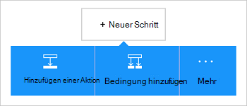

<properties
    pageTitle="Azure BLOB-Speicher Connector in Ihren Apps Logik hinzufügen | Microsoft Azure"
    description="Übersicht über Azure BLOB-Speicher Connector mit REST-API"
    services=""
    documentationCenter="" 
    authors="MandiOhlinger"
    manager="anneta"
    editor=""
    tags="connectors"/>

<tags
   ms.service="logic-apps"
   ms.devlang="na"
   ms.topic="article"
   ms.tgt_pltfrm="na"
   ms.workload="integration" 
   ms.date="10/18/2016"
   ms.author="mandia"/>

# Erste Schritte mit dem Connector Azure BLOB-Speicher
Azure BLOB-Speicher ist ein Dienst zum Speichern großer Mengen an unstrukturierten Daten. Aktionen Sie wie hochladen, aktualisieren Sie, abrufen Sie und löschen Sie Blobs in Azure BLOB-Speicher. 

Mit Azure BLOB-Speicher Sie:

- Erstellen des Workflows hochladen neuer Projekte oder Dateien, die kürzlich aktualisiert wurden.
- Verwenden Sie Aktionen Metadaten abrufen, Löschen einer Datei und Kopieren von Dateien. Beispielsweise bei der Aktualisierung ein Tool in eine Azure-Website (Trigger) dann neu im BLOB-Speicher (Aktion). 

In diesem Thema veranschaulicht die BLOB-Speicher Connector in eine Logik-app verwenden und führt auch die Aktionen.

>[AZURE.NOTE] Diese Version des Artikels gilt für Logik Apps allgemein verfügbar (GA). 

Weitere Logik Apps sehen Sie [Was Logik apps](../app-service-logic/app-service-logic-what-are-logic-apps.md) und [Logik app erstellen](../app-service-logic/app-service-logic-create-a-logic-app.md).

## Verbinden Sie mit Azure BLOB-Speicher

Bevor Ihre Anwendung Logik einen Dienst zugreifen kann, erstellen Sie zuerst eine *Verbindung* zum Dienst. Eine Verbindung stellt eine Verbindung zwischen einer Anwendung Logik und ein weiterer. Beispielsweise können ein Speicherkonto Verbindung zunächst eine BLOB-Speicher *Verbindung*. Geben Sie zum Erstellen einer Verbindung die Anmeldeinformationen verwenden Sie normalerweise den Zugriff auf Dienste, eine Verbindung herstellen. Geben Sie die Anmeldeinformationen auf das Speicherkonto Verbindung so mit Azure-Speicher. 

#### Erstellen der Verbindung

>[AZURE.INCLUDE [Create a connection to Azure blob storage](../../includes/connectors-create-api-azureblobstorage.md)]
 
## Verwenden eines Triggers

Dieser Connector keinen Trigger. Verwenden Sie andere Trigger zu app Logik Serie Trigger einen Trigger HTTP Webhook, Trigger mit anderen Connectors verfügbar. [Erstellen einer Anwendung Logik](../app-service-logic/app-service-logic-create-a-logic-app.md) enthält ein Beispiel.

## Verwenden Sie eine Aktion
    
Eine Aktion ist eine Operation in eine Logik-app definierten Workflow durchgeführt.

1. Wählen Sie das Pluszeichen. Sie sehen verschiedene Optionen: **eine Aktion hinzufügen**, **Hinzufügen einer Bedingung**oder eine **Weitere** Optionen.

    

2. Wählen Sie **eine Aktion hinzufügen**.

3. Geben Sie im Textfeld "blob", um eine Liste der verfügbaren Aktionen.

     

4. Wählen Sie in unserem Beispiel **AzureBlob - Pfad Metadaten abzurufen**. Wenn bereits eine Verbindung vorhanden ist, wählen Sie **...** Schaltfläche (Auswahl anzeigen), eine Datei auszuwählen.

    

    Wenn die Verbindungsinformationen aufgefordert werden, geben Sie die Details der Verbindung. [Erstellen der Verbindung](connectors-create-api-azureblobstorage.md#create-the-connection) in diesem Thema werden diese Eigenschaften beschrieben. 

    > [AZURE.NOTE] In diesem Beispiel erhalten wir die Metadaten einer Datei. Auf die Metadaten einer anderen Aktion hinzufügen, die eine neue Datei mit einem anderen Connector erstellt. Z. B. Hinzufügen einer Aktion OneDrive, die eine neue "test" Datei auf Grundlage der Metadaten erstellt. 

5. **Speichern Sie** die geänderte (obere linke Ecke der Symbolleiste). Ihre Anwendung Logik wird gespeichert und werden automatisch aktiviert.

> [AZURE.TIP] [Speicher-Explorer](http://storageexplorer.com/) ist ein hervorragendes Tool mehrere Storage-Konten verwalten.

## Technische Details

## Speicher-BLOB-Aktionen

|Aktion|Beschreibung|
|--- | ---|
|[Abrufen von Metadaten](connectors-create-api-azureblobstorage.md#get-file-metadata)|Dieser Vorgang ruft Metadaten mit Datei-Id ab.|
|[Datei aktualisieren](connectors-create-api-azureblobstorage.md#update-file)|Dieser Vorgang aktualisiert eine Datei.|
|[Datei löschen](connectors-create-api-azureblobstorage.md#delete-file)|Dieser Vorgang löscht eine Datei.|
|[Abrufen von Metadaten mit Pfad](connectors-create-api-azureblobstorage.md#get-file-metadata-using-path)|Dieser Vorgang ruft Metadaten über den Pfad.|
|[Datei-Inhalte mit Pfad](connectors-create-api-azureblobstorage.md#get-file-content-using-path)|Dieser Vorgang ruft Inhalt über den Pfad.|
|[Datei-Inhalte](connectors-create-api-azureblobstorage.md#get-file-content)|Dieser Vorgang wird mit Id Inhalt.|
|[Datei erstellen](connectors-create-api-azureblobstorage.md#create-file)|Dieser Vorgang eine Datei geuploadet.|
|[Datei kopieren](connectors-create-api-azureblobstorage.md#copy-file)|Dieser Vorgang kopiert eine Datei in Azure BLOB-Speicher.|
|[Archiv Ordner](connectors-create-api-azureblobstorage.md#extract-archive-to-folder)|Dieser Vorgang extrahiert eine Archivdatei in einen Ordner (Beispiel: ZIP).|

### Aktionsdetails

Finden Sie in diesem Abschnitt Einzelheiten zu jeder Aktion sowie alle erforderlichen oder optionalen Eingabeeigenschaften entsprechende Ausgabe der Connector zugeordnet.

#### Abrufen von Metadaten
Dieser Vorgang ruft Metadaten mit Datei-Id ab.  

|Eigenschaftenname| Angezeigter Name|Beschreibung|
| ---|---|---|
|ID *|Datei|Wählen Sie eine Datei|

Ein Sternchen (*) bedeutet, dass die Eigenschaft erforderlich ist.

##### Ausgabedetails
BlobMetadata

| Eigenschaftenname | Datentyp |
|---|---|
|ID|Zeichenfolge|
|Name|Zeichenfolge|
|DisplayName|Zeichenfolge|
|Pfad|Zeichenfolge|
|LastModified|Zeichenfolge|
|Größe|ganze Zahl|
|Medientyp|Zeichenfolge|
|IsFolder|boolescher Wert|
|ETag|Zeichenfolge|
|FileLocator|Zeichenfolge|

#### Datei aktualisieren
Dieser Vorgang aktualisiert eine Datei.  

|Eigenschaftenname| Angezeigter Name|Beschreibung|
| ---|---|---|
|ID *|Datei|Wählen Sie eine Datei|
|Text *|Inhalt der Datei|Inhalt der Datei aktualisieren|

Ein Sternchen (*) bedeutet, dass die Eigenschaft erforderlich ist.

##### Ausgabedetails
BlobMetadata

| Eigenschaftenname | Datentyp |
|---|---|
|ID|Zeichenfolge|
|Name|Zeichenfolge|
|DisplayName|Zeichenfolge|
|Pfad|Zeichenfolge|
|LastModified|Zeichenfolge|
|Größe|ganze Zahl|
|Medientyp|Zeichenfolge|
|IsFolder|boolescher Wert|
|ETag|Zeichenfolge|
|FileLocator|Zeichenfolge|

#### Datei löschen
Dieser Vorgang löscht eine Datei.  

|Eigenschaftenname| Angezeigter Name|Beschreibung|
| ---|---|---|
|ID *|Datei|Wählen Sie eine Datei|

Ein Sternchen (*) bedeutet, dass die Eigenschaft erforderlich ist.

##### Ausgabedetails
Keine.

#### Abrufen von Metadaten mit Pfad
Dieser Vorgang ruft Metadaten über den Pfad.  

|Eigenschaftenname| Angezeigter Name|Beschreibung|
| ---|---|---|
|Pfad *|Pfad|Wählen Sie eine Datei|

Ein Sternchen (*) bedeutet, dass die Eigenschaft erforderlich ist.

##### Ausgabedetails
BlobMetadata

| Eigenschaftenname | Datentyp |
|---|---|
|ID|Zeichenfolge|
|Name|Zeichenfolge|
|DisplayName|Zeichenfolge|
|Pfad|Zeichenfolge|
|LastModified|Zeichenfolge|
|Größe|ganze Zahl|
|Medientyp|Zeichenfolge|
|IsFolder|boolescher Wert|
|ETag|Zeichenfolge|
|FileLocator|Zeichenfolge|

#### Datei-Inhalte mit Pfad
Dieser Vorgang ruft Inhalt über den Pfad.  

|Eigenschaftenname| Angezeigter Name|Beschreibung|
| ---|---|---|
|Pfad *|Pfad|Wählen Sie eine Datei|

Ein Sternchen (*) bedeutet, dass die Eigenschaft erforderlich ist.

##### Ausgabedetails
Keine.

#### Datei-Inhalte
Dieser Vorgang wird mit Id Inhalt.  

|Eigenschaftenname| Datentyp|Beschreibung|
| ---|---|---|
|ID *|Zeichenfolge|Wählen Sie eine Datei|

Ein Sternchen (*) bedeutet, dass die Eigenschaft erforderlich ist.

##### Ausgabedetails
Keine.

#### Datei erstellen
Dieser Vorgang eine Datei geuploadet.  

|Eigenschaftenname| Angezeigter Name|Beschreibung|
| ---|---|---|
|FolderPath *|Pfad|Wählen Sie einen Ordner|
|Name *|Dateiname|Name der hochzuladenden Datei|
|Text *|Inhalt der Datei|Inhalt der Datei|

Ein Sternchen (*) bedeutet, dass die Eigenschaft erforderlich ist.

##### Ausgabedetails
BlobMetadata

| Eigenschaftenname | Datentyp | 
|---|---|
|ID|Zeichenfolge|
|Name|Zeichenfolge|
|DisplayName|Zeichenfolge|
|Pfad|Zeichenfolge|
|LastModified|Zeichenfolge|
|Größe|ganze Zahl|
|Medientyp|Zeichenfolge|
|IsFolder|boolescher Wert|
|ETag|Zeichenfolge|
|FileLocator|Zeichenfolge|

#### Datei kopieren
Dieser Vorgang kopiert eine Datei in Azure BLOB-Speicher.  

|Eigenschaftenname| Angezeigter Name|Beschreibung|
| ---|---|---|
|Quelle *|Quell-url|Quelldatei Url angeben|
|Ziel *|Zielpfad für Datei|Angeben der Zieldateipfad einschließlich Zieldatei|
|Überschreiben|Überschreiben?|Eine vorhandene Zieldatei (True/False) überschrieben werden sollen?  |

Ein Sternchen (*) bedeutet, dass die Eigenschaft erforderlich ist.

##### Ausgabedetails
BlobMetadata

| Eigenschaftenname | Datentyp |
|---|---|
|ID|Zeichenfolge|
|Name|Zeichenfolge|
|DisplayName|Zeichenfolge|
|Pfad|Zeichenfolge|
|LastModified|Zeichenfolge|
|Größe|ganze Zahl|
|Medientyp|Zeichenfolge|
|IsFolder|boolescher Wert|
|ETag|Zeichenfolge|
|FileLocator|Zeichenfolge|

#### Archiv Ordner
Dieser Vorgang extrahiert eine Archivdatei in einen Ordner (Beispiel: ZIP).  

|Eigenschaftenname| Angezeigter Name|Beschreibung|
| ---|---|---|
|Quelle *|Quelldateipfad-Archiv|Wählen Sie eine Archivdatei|
|Ziel *|Zielordnerpfad|Wählen Sie die zu extrahierenden Inhalts|
|Überschreiben|Überschreiben?|Eine vorhandene Zieldatei (True/False) überschrieben werden sollen?|

Ein Sternchen (*) bedeutet, dass die Eigenschaft erforderlich ist.

##### Ausgabedetails
BlobMetadata

| Eigenschaftenname | Datentyp |
|---|---|
|ID|Zeichenfolge|
|Name|Zeichenfolge|
|DisplayName|Zeichenfolge|
|Pfad|Zeichenfolge|
|LastModified|Zeichenfolge|
|Größe|ganze Zahl|
|Medientyp|Zeichenfolge|
|IsFolder|boolescher Wert|
|ETag|Zeichenfolge|
|FileLocator|Zeichenfolge|

## HTTP-Antworten

Verschiedenen Aktionen aufrufen, können Sie bestimmte Antworten erhalten. Die folgende Tabelle enthält die Antworten und deren Beschreibung:  

|Name|Beschreibung|
|---|---|
|200|Okay|
|202|Akzeptiert|
|400|Ungültige Anforderung|
|401|Nicht autorisiert|
|403|Verboten|
|404|Nicht gefunden|
|500|Interner Serverfehler. Unbekannte Fehler|
|Standard|Vorgang ist fehlgeschlagen.|

## Nächste Schritte

[Erstellen einer Anwendung Logik](../app-service-logic/app-service-logic-create-a-logic-app.md). Durchsuchen der verfügbaren Connectors Logik Apps [APIs Liste](apis-list.md).

