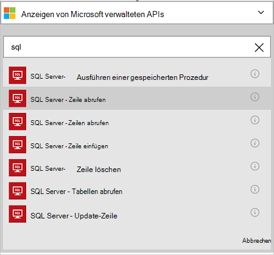
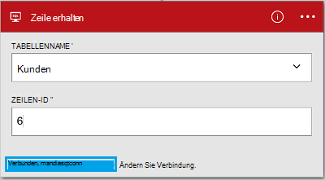

<properties
    pageTitle="Azure SQL-Datenbank-Verbindung in Ihren Apps Logik hinzufügen | Microsoft Azure"
    description="Übersicht über Azure SQL Database Connector REST API-Parameter"
    services=""
    documentationCenter="" 
    authors="MandiOhlinger"
    manager="anneta"
    editor=""
    tags="connectors"/>

<tags
   ms.service="logic-apps"
   ms.devlang="na"
   ms.topic="article"
   ms.tgt_pltfrm="na"
   ms.workload="na" 
   ms.date="10/18/2016"
   ms.author="mandia"/>

# Erste Schritte mit Azure SQL Database connector
Erstellen Sie Azure SQL Database Connector Workflows für Ihre Organisation, die Daten in den Tabellen verwalten. 

Mit SQL-Datenbank Sie:

- Erstellen des Workflows eine Kundendatenbank einen neuen Kunden hinzufügen oder Aktualisieren eines Auftrags in einer Datenbank Aufträge.
- Verwenden Sie Aktionen erhalten eine Zeile mit Daten und Einfügen einer neuen Zeile zu löschen. Beispielsweise beim Erstellen ein Datensatzes in Dynamics CRM Online (Trigger) fügen Sie eine Zeile in einer Azure SQL-Datenbank (Aktion). 

In diesem Thema veranschaulicht die SQL Database Connector in eine Logik-app verwenden und führt auch die Aktionen.

>[AZURE.NOTE] Diese Version des Artikels gilt für Logik Apps allgemein verfügbar (GA). 

Weitere Logik Apps sehen Sie [Was Logik apps](../app-service-logic/app-service-logic-what-are-logic-apps.md) und [Logik app erstellen](../app-service-logic/app-service-logic-create-a-logic-app.md).

## Verbinden Sie mit SQL Azure-Datenbank

Bevor Ihre Anwendung Logik einen Dienst zugreifen kann, erstellen Sie zuerst eine *Verbindung* zum Dienst. Eine Verbindung stellt eine Verbindung zwischen einer Anwendung Logik und ein weiterer. Beispielsweise können zum Verbinden mit SQL-Datenbank zunächst eine SQL-Datenbank- *Verbindung*. Um eine Verbindung herzustellen, geben Sie die Anmeldeinformationen, die Sie normalerweise verwenden, den Zugriff auf Dienste, eine Verbindung herstellen. Also in SQL-Datenbank Anmeldeinformationen Sie SQL-Datenbank zum Erstellen der Verbindungs. 

#### Erstellen der Verbindung

>[AZURE.INCLUDE [Create the connection to SQL Azure](../../includes/connectors-create-api-sqlazure.md)]

## Verwenden eines Triggers

Dieser Connector keinen Trigger. Verwenden Sie andere Trigger zu app Logik Serie Trigger einen Trigger HTTP Webhook, Trigger mit anderen Connectors verfügbar. [Erstellen einer Anwendung Logik](../app-service-logic/app-service-logic-create-a-logic-app.md) enthält ein Beispiel.

## Verwenden Sie eine Aktion
    
Eine Aktion ist eine Operation in eine Logik-app definierten Workflow durchgeführt. [Weitere Informationen zu Aktionen](../app-service-logic/app-service-logic-what-are-logic-apps.md#logic-app-concepts).

1. Wählen Sie das Pluszeichen. Sie sehen verschiedene Optionen: **eine Aktion hinzufügen**, **Hinzufügen einer Bedingung**oder eine **Weitere** Optionen.

    

2. Wählen Sie **eine Aktion hinzufügen**.

3. Geben Sie im Textfeld "Sql", um eine Liste der verfügbaren Aktionen.

     

4. Wählen Sie in unserem Beispiel **SQL Server - Zeile**. Besteht bereits eine Verbindung wählen Sie den **Tabellennamen** in der Dropdown-Liste, und geben Sie die **Zeilen-ID** zurückgegeben werden soll.

    

    Wenn die Verbindungsinformationen aufgefordert werden, geben Sie die Details der Verbindung. [Erstellen der Verbindung](connectors-create-api-sqlazure.md#create-the-connection) in diesem Thema werden diese Eigenschaften beschrieben. 

    > [AZURE.NOTE] In diesem Beispiel geben wir eine Zeile aus einer Tabelle zurück. Fügen Sie die Daten in dieser Zeile eine andere Aktion, die eine Datei unter Verwendung der Felder aus der Tabelle erstellt. Fügen Sie eine OneDrive-Aktion hinzu, die Felder Vorname und Nachname zum Erstellen einer neuen Datei im Speicherkonto Cloud verwendet beispielsweise. 

5. **Speichern Sie** die geänderte (obere linke Ecke der Symbolleiste). Ihre Anwendung Logik wird gespeichert und werden automatisch aktiviert.

## Technische Details

## SQL Datenbank-Aktionen
Eine Aktion ist eine Operation in eine Logik-app definierten Workflow durchgeführt. SQL-Datenbank-Verbindung umfasst die folgenden Aktionen. 

|Aktion|Beschreibung|
|--- | ---|
|[ExecuteProcedure](connectors-create-api-sqlazure.md#execute-stored-procedure)|Führt eine gespeicherte Prozedur in SQL|
|[[GetRow](connectors-create-api-sqlazure.md#get-row)|Ruft eine einzelne Zeile aus einer SQL-Tabelle|
|[GetRows](connectors-create-api-sqlazure.md#get-rows)|Ruft Zeilen aus einer SQL-Tabelle|
|[InsertRow](connectors-create-api-sqlazure.md#insert-row)|Fügt eine neue Zeile in einer SQL-Tabelle|
|[DeleteRow](connectors-create-api-sqlazure.md#delete-row)|Löscht eine Zeile aus einer SQL-Tabelle|
|[GetTables](connectors-create-api-sqlazure.md#get-tables)|Tabellen aus einer SQL-Datenbank abgerufen|
|[UpdateRow](connectors-create-api-sqlazure.md#update-row)|Aktualisiert eine vorhandene Zeile in einer SQL-Tabelle|

### Aktionsdetails

Finden Sie in diesem Abschnitt Einzelheiten zu jeder Aktion sowie alle erforderlichen oder optionalen Eingabeeigenschaften entsprechende Ausgabe der Connector zugeordnet.

#### Ausführen einer gespeicherten Prozedur
Führt eine gespeicherte Prozedur in SQL.  

| Eigenschaftenname| Angezeigter Name |Beschreibung|
| ---|---|---|
|Verfahren * | Name der Prozedur | Der Name der gespeicherten Prozedur ausgeführt werden soll |
|Parameter * | Eingabeparameter | Die Parameter sind dynamisch und auf die gespeicherte Prozedur, die Sie auswählen.    Wenn Sie die Beispieldatenbank AdventureWorks verwenden, wählen Sie *UfnGetCustomerInformation* gespeicherte Prozedur ein. Der Eingabeparameter **Kundennummer** wird angezeigt. "6" oder eines der anderen Kunden-ID eingeben. |

Ein Sternchen (*) bedeutet, dass die Eigenschaft erforderlich ist.

##### Ausgabedetails
ProcedureResult: Ergebnis der Ausführung einer gespeicherten Prozedur trägt

| Eigenschaftenname | Datentyp | Beschreibung |
|---|---|---|
|OutputParameters|Objekt|Ausgabeparameterwerte |
|Rückgabecode|ganze Zahl|Rückgabewert einer Prozedur |
|ResultSets|Objekt| Resultsets|

#### Zeile erhalten 
Ruft eine einzelne Zeile aus einer SQL-Tabelle ab.  

| Eigenschaftenname| Angezeigter Name |Beschreibung|
| ---|---|---|
|Tabelle * | Tabellenname |Name der SQL-Tabelle|
|ID * | Zeilen-id |Eindeutiger Bezeichner des abzurufenden Zeile|

Ein Sternchen (*) bedeutet, dass die Eigenschaft erforderlich ist.

##### Ausgabedetails
Artikel

| Eigenschaftenname | Datentyp |
|---|---|
|ItemInternalId|Zeichenfolge|

#### Abrufen von Zeilen 
Ruft Zeilen aus einer SQL-Tabelle ab.  

|Eigenschaftenname| Angezeigter Name|Beschreibung|
| ---|---|---|
|Tabelle *|Tabellenname|Name der SQL-Tabelle|
|$skip|Anzahl der Durchläufe|Anzahl der Einträge zu überspringen (Standard = 0)|
|$top|Maximale Get Count|Maximale Anzahl Einträge abrufen (Standard = 256)|
|$filter|Filterabfrage|Eine Filterabfrage ODATA beschränkt die Anzahl der Einträge|
|$orderby|Sortieren nach|Ein ODATA OrderBy-Abfrage zum Festlegen der Reihenfolge von Einträgen|

Ein Sternchen (*) bedeutet, dass die Eigenschaft erforderlich ist.

##### Ausgabedetails
ItemsList

| Eigenschaftenname | Datentyp |
|---|---|
|Wert|Array|

#### Zeile einfügen 
Fügt eine neue Zeile in einer SQL-Tabelle.  

|Eigenschaftenname| Angezeigter Name|Beschreibung|
| ---|---|---|
|Tabelle *|Tabellenname|Name der SQL-Tabelle|
|Artikel *|Zeile|Zeile in der angegebenen Tabelle in SQL einfügen|

Ein Sternchen (*) bedeutet, dass die Eigenschaft erforderlich ist.

##### Ausgabedetails
Artikel

| Eigenschaftenname | Datentyp |
|---|---|
|ItemInternalId|Zeichenfolge|

#### Zeile löschen 
Löscht eine Zeile aus einer SQL-Tabelle.  

|Eigenschaftenname| Angezeigter Name|Beschreibung|
| ---|---|---|
|Tabelle *|Tabellenname|Name der SQL-Tabelle|
|ID *|Zeilen-id|Eindeutiger Bezeichner der zu löschenden Zeile|

Ein Sternchen (*) bedeutet, dass die Eigenschaft erforderlich ist.

##### Ausgabedetails
Keine.

#### Abrufen von Tabellen 
Tabellen aus einer SQL-Datenbank abgerufen.  

Es sind keine Parameter für diesen Aufruf. 

##### Ausgabedetails 
TablesList

| Eigenschaftenname | Datentyp |
|---|---|
|Wert|Array|

#### Zeile aktualisieren 
Aktualisiert eine vorhandene Zeile in einer SQL-Tabelle.  

|Eigenschaftenname| Angezeigter Name|Beschreibung|
| ---|---|---|
|Tabelle *|Tabellenname|Name der SQL-Tabelle|
|ID *|Zeilen-id|Eindeutiger Bezeichner der zu aktualisierenden Zeile|
|Artikel *|Zeile|Zeile mit aktualisierten Werte|

Ein Sternchen (*) bedeutet, dass die Eigenschaft erforderlich ist.

##### Ausgabedetails  
Artikel

| Eigenschaftenname | Datentyp |
|---|---|
|ItemInternalId|Zeichenfolge|

### HTTP-Antworten

Verschiedenen Aktionen aufrufen, können Sie bestimmte Antworten erhalten. Die folgende Tabelle enthält die Antworten und deren Beschreibung:  

|Name|Beschreibung|
|---|---|
|200|Okay|
|202|Akzeptiert|
|400|Ungültige Anforderung|
|401|Nicht autorisiert|
|403|Verboten|
|404|Nicht gefunden|
|500|Interner Serverfehler. Unbekannte Fehler|
|Standard|Vorgang ist fehlgeschlagen.|

## Nächste Schritte

[Erstellen einer Anwendung Logik](../app-service-logic/app-service-logic-create-a-logic-app.md). Durchsuchen der verfügbaren Connectors Logik Apps [APIs Liste](apis-list.md).
