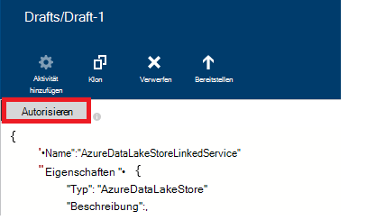

<properties
    pageTitle="Verschieben von Daten und Azure Datenspeicher See | Azure Data Factory"
    description="Erfahren Sie, wie Daten in Azure See Datenspeicher Azure Data Factory"
    services="data-factory"
    documentationCenter=""
    authors="linda33wj"
    manager="jhubbard"
    editor="monicar"/>

<tags
    ms.service="data-factory"
    ms.workload="data-services"
    ms.tgt_pltfrm="na"
    ms.devlang="na"
    ms.topic="article"
    ms.date="09/27/2016"
    ms.author="jingwang"/>

# Verschieben von Daten zu und von Azure See Datenspeicher Azure Data Factory
Dieser Artikel beschreibt die kopieren-Aktivität in einer Azure Daten Verwendung zum Verschieben von Daten aus dem und in Azure See Datenspeicher nach einem anderen Datenspeicher. Dieser Artikel baut auf [Datenaktivitäten](data-factory-data-movement-activities.md) Artikel stellt eine allgemeine Übersicht über die Daten der Kopie und die unterstützten Speicher-Kombinationen.

> [AZURE.NOTE]
> Erstellen Sie ein Konto Azure See Datenspeicher vor dem Erstellen einer Pipeline zum Verschieben von Daten nach einem Azure Data Lake-Speicher mit einer Kopie. Über Azure See Datenspeicher finden Sie unter [Erste Schritte mit Azure See Datenspeicher](../data-lake-store/data-lake-store-get-started-portal.md).
>  
> Überprüfen Sie [erstellen Ihre erste Pipeline Lernprogramm](data-factory-build-your-first-pipeline.md) ausführliche Daten Factory, verknüpften Diensten, Datasets und einer Pipeline erstellen. Mit der JSON-Ausschnitte mit Data Factory-Editor, Visual Studio oder Azure PowerShell Data Factory Entitäten erstellt.

## Assistent zum Kopieren von Daten
Die eine Pipeline erstellen, die Daten in Azure See Datenspeicher am einfachsten mithilfe des Assistenten zum Kopieren von Daten. Siehe [Tutorial: eine Rohrleitung mit Assistenten zum Kopieren von](data-factory-copy-data-wizard-tutorial.md) eine kurze exemplarische Vorgehensweise zum Erstellen einer Pipeline mithilfe des Assistenten zum Kopieren von Daten. 

Die folgenden Beispiele bieten Beispiel JSON-Definitionen, mit denen Sie eine Rohrleitung mit [Azure-Portal](data-factory-copy-activity-tutorial-using-azure-portal.md) oder [Visual Studio](data-factory-copy-activity-tutorial-using-visual-studio.md) oder [Azure PowerShell](data-factory-copy-activity-tutorial-using-powershell.md)erstellen. Sie zeigen, wie Daten zwischen Azure See Datenspeicher und Azure BLOB-Speicher kopieren. Allerdings können kopierten **direkt** von Quellen zu der Ereignissenken angegebenen [hier](data-factory-data-movement-activities.md#supported-data-stores) Kopieraktivität in Azure Data Factory verwenden.  

## Beispiel: Daten von Azure Blob Azure See Datenspeicher
Das folgende Beispiel zeigt:

1.  Eine verknüpfte Dienst vom Typ [AzureStorage](#azure-storage-linked-service-properties).
2.  Eine verknüpfte Dienst vom Typ [AzureDataLakeStore](#azure-data-lake-linked-service-properties).
3.  Ein Eingabe- [Dataset](data-factory-create-datasets.md) vom Typ [AzureBlob](#azure-blob-dataset-type-properties).
4.  Ein Ausgabe- [Dataset](data-factory-create-datasets.md) vom Typ [AzureDataLakeStore](#azure-data-lake-dataset-type-properties).
4.  Eine [Rohrleitung](data-factory-create-pipelines.md) mit einer Kopie, die [BlobSource](#azure-blob-copy-activity-type-properties) und [AzureDataLakeStoreSink](#azure-data-lake-copy-activity-type-properties)verwendet.

Das Beispiel Kopiervorgang Zeitreihen von Azure BLOB-Speicher in Azure See Datenspeicher stündlich. In diesen Beispielen verwendeten JSON-Eigenschaften werden in Abschnitten nach den Beispielen beschrieben.

**Azure verknüpfter Dienst:**

    {
      "name": "StorageLinkedService",
      "properties": {
        "type": "AzureStorage",
        "typeProperties": {
          "connectionString": "DefaultEndpointsProtocol=https;AccountName=<accountname>;AccountKey=<accountkey>"
        }
      }
    }

**Azure Data Lake verknüpft Service:**

    {
        "name": "AzureDataLakeStoreLinkedService",
        "properties": {
            "type": "AzureDataLakeStore",
            "typeProperties": {
                "dataLakeStoreUri": "https://<accountname>.azuredatalakestore.net/webhdfs/v1",
                "sessionId": "<session ID>",
                "authorization": "<authorization URL>"
            }
        }
    }

### Azure Data Lake verknüpfte Service mit werkseitig erstellen
Das folgende Verfahren enthält eine schrittweise Anleitung Azure See Datenspeicher verknüpft Service mit dem Factory anlegen.

1. Klicken Sie auf der Befehlsleiste auf **neue Datenspeicher** und wählen Sie **Azure See Datenspeicher aus**.
2. Geben Sie den URI im JSON-Editor für die Eigenschaft **DataLakeStoreUri** für Daten-See.
3. Klicken Sie auf der Befehlsleiste **Autorisieren** . Ein Popup-Fenster sollte angezeigt werden.

    

4. Unter Verwendung Ihrer Anmeldeinformationen anmelden und **Autorisierung** -Eigenschaft in JSON sollte nun einen Wert zugewiesen werden.
5. (optional) Geben Sie Werte für optionale Parameter **Kontoname** **SubscriptionID**und **ResourceGroupName** in JSON, oder löschen Sie diese Eigenschaften aus der JSON.
6. Klicken Sie auf der Befehlsleiste verknüpften Dienst bereitstellen **Bereitstellen** .

> [AZURE.IMPORTANT] Mithilfe der Schaltfläche **Autorisieren** erstellten Autorisierungscode läuft nach einer Weile. Schaltfläche **Autorisieren** **neu zu autorisieren** , wenn **Sicherheitstoken abläuft** und verknüpfte Dienst bereitstellen. [Azure Data Lake verknüpfte anmelden](#azure-data-lake-store-linked-service-properties) Siehe Details. 

**Azure Blob Eingabedatasets:**

Daten werden abgeholt ein neues Blob stündlich (Häufigkeit: Stunde, Intervall: 1). Pfad und Namen des für den Blob werden dynamisch anhand der Startzeit der Schicht, die verarbeitet wird. Der Ordnerpfad verwendet, Jahr, Monat und Tagesanteil der Startzeit und Dateinamen verwendet Stundenteil der Startzeit. "externe": "true" Einstellung informiert Data Factory-Dienst, die Tabelle Data Factory ist nicht durch eine Aktivität im Werk Daten erzeugt.

    {
      "name": "AzureBlobInput",
      "properties": {
        "type": "AzureBlob",
        "linkedServiceName": "StorageLinkedService",
        "typeProperties": {
          "folderPath": "mycontainer/myfolder/yearno={Year}/monthno={Month}/dayno={Day}",
          "partitionedBy": [
            {
              "name": "Year",
              "value": {
                "type": "DateTime",
                "date": "SliceStart",
                "format": "yyyy"
              }
            },
            {
              "name": "Month",
              "value": {
                "type": "DateTime",
                "date": "SliceStart",
                "format": "MM"
              }
            },
            {
              "name": "Day",
              "value": {
                "type": "DateTime",
                "date": "SliceStart",
                "format": "dd"
              }
            },
            {
              "name": "Hour",
              "value": {
                "type": "DateTime",
                "date": "SliceStart",
                "format": "HH"
              }
            }
          ]
        },
        "external": true,
        "availability": {
          "frequency": "Hour",
          "interval": 1
        },
        "policy": {
          "externalData": {
            "retryInterval": "00:01:00",
            "retryTimeout": "00:10:00",
            "maximumRetry": 3
          }
        }
      }
    }

**Azure Data Lake Ausgabe Dataset:**

Im Beispiel werden Daten in einen Azure Data Lake-Speicher kopiert. Neue Daten stündlich See Daten speichern.

    {
        "name": "AzureDataLakeStoreOutput",
        "properties": {
            "type": "AzureDataLakeStore",
            "linkedServiceName": "AzureDataLakeStoreLinkedService",
            "typeProperties": {
                "folderPath": "datalake/output/"
            },
            "availability": {
                "frequency": "Hour",
                "interval": 1
            }
        }
    }

**Pipeline mit einer Kopie:**

Die Pipeline enthält eine Aktivität kopieren, konfiguriert die Eingabe- und Datasets verwenden und stündlich ausgeführt werden soll. In JSON-Definition Rohrleitung soll **des Typs** **BlobSource** und **AzureDataLakeStoreSink** **Senke** Typ festgelegt ist.

    {  
        "name":"SamplePipeline",
        "properties":
        {  
            "start":"2014-06-01T18:00:00",
            "end":"2014-06-01T19:00:00",
            "description":"pipeline with copy activity",
            "activities":
            [  
                {
                    "name": "AzureBlobtoDataLake",
                    "description": "Copy Activity",
                    "type": "Copy",
                    "inputs": [
                    {
                        "name": "AzureBlobInput"
                    }
                    ],
                    "outputs": [
                    {
                        "name": "AzureDataLakeStoreOutput"
                    }
                    ],
                    "typeProperties": {
                        "source": {
                            "type": "BlobSource",
                            "treatEmptyAsNull": true,
                            "blobColumnSeparators": ","
                        },
                        "sink": {
                            "type": "AzureDataLakeStoreSink"
                        }
                    },
                    "scheduler": {
                        "frequency": "Hour",
                        "interval": 1
                    },
                    "policy": {
                        "concurrency": 1,
                        "executionPriorityOrder": "OldestFirst",
                        "retry": 0,
                        "timeout": "01:00:00"
                    }
                }
            ]
        }
    }

## Beispiel: Daten Sie aus Azure See Datenspeicher in Azure Blob
Das folgende Beispiel zeigt:

1.  Eine verknüpfte Dienst vom Typ [AzureDataLakeStore](#azure-data-lake-linked-service-properties).
2.  Eine verknüpfte Dienst vom Typ [AzureStorage](#azure-storage-linked-service-properties).
3.  Ein Eingabe- [Dataset](data-factory-create-datasets.md) vom Typ [AzureDataLakeStore](#azure-data-lake-dataset-type-properties).
4.  Ein Ausgabe- [Dataset](data-factory-create-datasets.md) vom Typ [AzureBlob](#azure-blob-dataset-type-properties).
5.  Eine [Rohrleitung](data-factory-create-pipelines.md) mit einer Kopie, die [AzureDataLakeStoreSource](#azure-data-lake-copy-activity-type-properties) und [BlobSink](#azure-blob-copy-activity-type-properties) verwendet

Das Beispiel Kopiervorgang Zeitreihen aus einem Speicher Azure Data Lake in Azure Blob stündlich. In diesen Beispielen verwendeten JSON-Eigenschaften werden in Abschnitten nach den Beispielen beschrieben.

**Azure See Datenspeicher verknüpft Service:**

    {
        "name": "AzureDataLakeStoreLinkedService",
        "properties": {
            "type": "AzureDataLakeStore",
            "typeProperties": {
                "dataLakeStoreUri": "https://<accountname>.azuredatalakestore.net/webhdfs/v1",
                "sessionId": "<session ID>",
                "authorization": "<authorization URL>"
            }
        }
    }

> [AZURE.NOTE] Lesen Sie den im vorherigen Beispiel zu Autorisierung URL.  

**Azure verknüpfter Dienst:**

    {
      "name": "StorageLinkedService",
      "properties": {
        "type": "AzureStorage",
        "typeProperties": {
          "connectionString": "DefaultEndpointsProtocol=https;AccountName=<accountname>;AccountKey=<accountkey>"
        }
      }
    }

**Azure Data Lake Eingabedatasets:**

Festlegen von **"extern": true** Daten Factorydienst teilt mit, dass die Tabelle Daten Factory ist und nicht durch eine Aktivität im Werk Daten erzeugt.

    {
        "name": "AzureDataLakeStoreInput",
        "properties":
        {
            "type": "AzureDataLakeStore",
            "linkedServiceName": "AzureDataLakeStoreLinkedService",
            "typeProperties": {
                "folderPath": "datalake/input/",
                "fileName": "SearchLog.tsv",
                "format": {
                    "type": "TextFormat",
                    "rowDelimiter": "\n",
                    "columnDelimiter": "\t"
                }
            },
            "external": true,
            "availability": {
                "frequency": "Hour",
                "interval": 1
            },
            "policy": {
                "externalData": {
                    "retryInterval": "00:01:00",
                    "retryTimeout": "00:10:00",
                    "maximumRetry": 3
                }
            }
        }
    }

**Azure Blob Ausgabe Dataset:**

Jede Stunde Daten in ein neues Blob geschrieben (Häufigkeit: Stunde, Intervall: 1). Pfad des Ordners für das Blob wird dynamisch anhand die Startzeit der Schicht, die verarbeitet wird. Der Ordnerpfad verwendet Jahr, Monat, Tag und Teile Stunden von der Startzeit entfernt.

    {
      "name": "AzureBlobOutput",
      "properties": {
        "type": "AzureBlob",
        "linkedServiceName": "StorageLinkedService",
        "typeProperties": {
          "folderPath": "mycontainer/myfolder/yearno={Year}/monthno={Month}/dayno={Day}/hourno={Hour}",
          "partitionedBy": [
            {
              "name": "Year",
              "value": {
                "type": "DateTime",
                "date": "SliceStart",
                "format": "yyyy"
              }
            },
            {
              "name": "Month",
              "value": {
                "type": "DateTime",
                "date": "SliceStart",
                "format": "MM"
              }
            },
            {
              "name": "Day",
              "value": {
                "type": "DateTime",
                "date": "SliceStart",
                "format": "dd"
              }
            },
            {
              "name": "Hour",
              "value": {
                "type": "DateTime",
                "date": "SliceStart",
                "format": "HH"
              }
            }
          ],
          "format": {
            "type": "TextFormat",
            "columnDelimiter": "\t",
            "rowDelimiter": "\n"
          }
        },
        "availability": {
          "frequency": "Hour",
          "interval": 1
        }
      }
    }

**Pipeline mit der Kopie:**

Die Pipeline enthält eine Aktivität kopieren, konfiguriert die Eingabe- und Datasets verwenden und stündlich ausgeführt werden soll. In JSON-Definition Rohrleitung soll **des Typs** **AzureDataLakeStoreSource** und **BlobSink** **Senke** Typ festgelegt ist.

    {  
        "name":"SamplePipeline",
        "properties":{  
            "start":"2014-06-01T18:00:00",
            "end":"2014-06-01T19:00:00",
            "description":"pipeline for copy activity",
            "activities":[  
                {
                    "name": "AzureDakeLaketoBlob",
                    "description": "copy activity",
                    "type": "Copy",
                    "inputs": [
                      {
                        "name": "AzureDataLakeStoreInput"
                      }
                    ],
                    "outputs": [
                      {
                        "name": "AzureBlobOutput"
                      }
                    ],
                    "typeProperties": {
                        "source": {
                            "type": "AzureDataLakeStoreSource",
                        },
                        "sink": {
                            "type": "BlobSink"
                        }
                    },
                    "scheduler": {
                        "frequency": "Hour",
                        "interval": 1
                    },
                    "policy": {
                        "concurrency": 1,
                        "executionPriorityOrder": "OldestFirst",
                        "retry": 0,
                        "timeout": "01:00:00"
                    }
                }
             ]
        }
    }

## Azure Data Lake Speicher verknüpften Eigenschaften

Sie können eine mit einem Dienst verknüpft Azure Storage Azure Data Factory ein Azure Storage-Konto verknüpfen. Die folgende Tabelle beschreibt für JSON-Elemente für verknüpfte Azure Storage Service.

| Eigenschaft | Beschreibung | Erforderlich |
| :-------- | :----------- | :-------- |
| Typ | Die Type-Eigenschaft muss auf festgelegt sein: **AzureDataLakeStore** | Ja |
| dataLakeStoreUri | Geben Sie Informationen zur See Datenspeicher Azure-Konto. Es ist im folgenden Format: https://<Azure Data Lake account name>.azuredatalakestore.net/webhdfs/v1 | Ja |
| Autorisierung | Klicken Sie **Autorisieren** **Data Factory-Editor** und geben Sie die Anmeldeinformationen, die diese Eigenschaft die Autorisierung automatisch generierte URL zuweist.  | Ja |
| sessionId | OAuth Sitzungsbezeichner Oauth Autorisierung Sitzung. Jede Sitzung-Id ist eindeutig und darf nur einmal verwendet werden. Diese Einstellung wird automatisch generiert, wenn Data Factory-Editor verwenden. | Ja |  
| Kontoname | Daten See Kontoname | Nein |
| subscriptionId | Azure-Abonnement-Id. | Nein (wenn nicht angegeben, wird Abonnement Data Factory verwendet). |
| resourceGroupName |  Azure Namen | Nein (wenn nicht angegeben, wird Ressourcengruppe Data Factory verwendet). |

## Ablauf des Tokens 
Erzeugen Sie mithilfe der Schaltfläche **Autorisieren** Autorisierungscode läuft nach einer Weile ab. Siehe folgende Tabelle für die Ablaufzeiten für verschiedene Typen von Benutzerkonten. Folgende Fehlermeldung Meldung an, wenn die Authentifizierung **Sicherheitstoken abläuft**: "Vorgang Anmeldefehler: Invalid_grant - AADSTS70002: Fehler beim Überprüfen der Anmeldeinformationen. AADSTS70008: Der angegebene Zugriff gewähren abgelaufen oder gesperrt. ID verfolgen: d18629e8-af88-43c5-88e3-d8419eb1fca1 Korrelations-ID: fac30a0c-6be6-4e02-8d69-a776d2ffefd7 Zeitstempel: 2015-12-15 21-09-31Z ".

| Benutzertyp | Läuft ab nach |
| :-------- | :----------- | 
| Benutzerkonten, die nicht von Azure Active Directory verwaltet (@hotmail.com, @live.com, etc..). | 12 Stunden |
| Benutzerkonten verwaltet von Azure Active Directory (AAD) | 14 Tage nach die letzte Schicht ausführen.   90 Tage, wenn ein Segment verknüpften Serviceartikel OAuth-basierte Grundlage mindestens alle 14 Tage ausgeführt wird. |

Wenn Sie Ihr vor diesem Zeitpunkt Tokengültigkeitsdauer Passwort Token sofort abläuft und Fehlermeldung in diesem Abschnitt erwähnten. 

Um zu vermeiden, / diese Fehler auflösen, erneut autorisieren, **Autorisieren** mit Schaltfläche Wenn **Sicherheitstoken abläuft** und verknüpfte Dienst bereitstellen. Sie können auch Werte für **SessionId** und **Autorisierung** Eigenschaften programmgesteuert mithilfe von Code im folgenden Abschnitt:

### SessionId und Autorisierung Werte programmgesteuert generieren 

    if (linkedService.Properties.TypeProperties is AzureDataLakeStoreLinkedService ||
        linkedService.Properties.TypeProperties is AzureDataLakeAnalyticsLinkedService)
    {
        AuthorizationSessionGetResponse authorizationSession = this.Client.OAuth.Get(this.ResourceGroupName, this.DataFactoryName, linkedService.Properties.Type);

        WindowsFormsWebAuthenticationDialog authenticationDialog = new WindowsFormsWebAuthenticationDialog(null);
        string authorization = authenticationDialog.AuthenticateAAD(authorizationSession.AuthorizationSession.Endpoint, new Uri("urn:ietf:wg:oauth:2.0:oob"));

        AzureDataLakeStoreLinkedService azureDataLakeStoreProperties = linkedService.Properties.TypeProperties as AzureDataLakeStoreLinkedService;
        if (azureDataLakeStoreProperties != null)
        {
            azureDataLakeStoreProperties.SessionId = authorizationSession.AuthorizationSession.SessionId;
            azureDataLakeStoreProperties.Authorization = authorization;
        }

        AzureDataLakeAnalyticsLinkedService azureDataLakeAnalyticsProperties = linkedService.Properties.TypeProperties as AzureDataLakeAnalyticsLinkedService;
        if (azureDataLakeAnalyticsProperties != null)
        {
            azureDataLakeAnalyticsProperties.SessionId = authorizationSession.AuthorizationSession.SessionId;
            azureDataLakeAnalyticsProperties.Authorization = authorization;
        }
    }

Finden Sie unter [AzureDataLakeStoreLinkedService-Klasse](https://msdn.microsoft.com/library/microsoft.azure.management.datafactories.models.azuredatalakestorelinkedservice.aspx), [AzureDataLakeAnalyticsLinkedService-Klasse](https://msdn.microsoft.com/library/microsoft.azure.management.datafactories.models.azuredatalakeanalyticslinkedservice.aspx)und [AuthorizationSessionGetResponse Klasse](https://msdn.microsoft.com/library/microsoft.azure.management.datafactories.models.authorizationsessiongetresponse.aspx) Informationen im Code verwendeten Data Factory-Klassen. Fügen Sie einen Verweis auf **2.9.10826.1824** Version des **Microsoft.IdentityModel.Clients.ActiveDirectory.WindowsForms.dll** für die WindowsFormsWebAuthenticationDialog-Klasse im Code verwendet. 
 

## Azure Data Lake Dataset Eigenschaften

Eine vollständige Liste der JSON-Abschnitte und Eigenschaften zum Definieren von Datasets finden Sie [Datasets erstellen](data-factory-create-datasets.md) . Abschnitte wie Struktur, Verfügbarkeit und Richtlinien eines Datasets JSON sind für alle Dataset-Typen (Azure SQL, Azure Blob Azure Tabelle usw..).

Die **TypeProperties** unterscheidet sich für jeden Datensatz und enthält Informationen über den Standort formatieren, Daten in den Datenspeicher. TypeProperties Abschnitt Dataset vom Typ **AzureDataLakeStore** Dataset hat die folgenden Eigenschaften:

| Eigenschaft | Beschreibung | Erforderlich |
| :-------- | :----------- | :-------- |
| folderPath | Container und Ordner in Azure Data Lake Pfad speichern. | Ja |
| Dateiname | Name der Datei im Speicher Azure Data Lake. FileName ist optional und Groß-/Kleinschreibung beachtet.   Wenn Sie einen Dateinamen angeben, funktioniert die Aktivität (einschließlich kopieren) auf Datei.  Wenn FileName nicht angegeben ist, enthält Kopie alle Dateien im Ordnerpfad für Eingabedatasets.  Wenn Dateiname für ein ausgabedataset nicht angegeben wird, wäre der Name der generierten Datei im folgenden dieses Format: Daten. <Guid>.txt (z. B.:: Data.0a405f8a-93ff-4c6f-b3be-f69616f1df7a.txt | Nein |
| partitionedBy | PartitionedBy ist eine optionale Eigenschaft. Sie können dynamische Ordnerpfad und Dateiname für die Serie Daten angeben. Beispielsweise kann für jede Stunde Daten FolderPath parametrisiert werden. Abschnitt [mit PartitionedBy Eigenschaft](#using-partitionedby-property) Details und Beispiele. | Nein |
| Format | Folgende Format unterstützt: **TextFormat**, **AvroFormat**, **JsonFormat**, **OrcFormat**, **ParquetFormat**. **Typeigenschaft unter Format** auf einen der folgenden Werte festgelegt. [TextFormat angeben](#specifying-textformat), [Angabe AvroFormat](#specifying-avroformat) [JsonFormat angeben](#specifying-jsonformat), [OrcFormat angeben](#specifying-orcformat)und [Festlegen ParquetFormat](#specifying-parquetformat) Abschnitte für Details anzeigen Wenn Sie Dateien kopieren möchten-wird zwischen dateibasierte Speicher (binären Kopie) überspringen Formatabschnitt sowohl Eingabe- und Dataset-Definitionen.| Nein
| Komprimierung | Geben Sie Art und Grad der Komprimierung der Daten. Typen werden unterstützt: **GZip**, **Deflate**, **BZip2** und unterstützte sind: **Optimal** und **schnell**. Derzeit werden die Einstellungen für Daten in **AvroFormat** oder **OrcFormat**nicht unterstützt. Weitere Informationen siehe [Komprimierung unterstützt](#compression-support) .  | Nein |

### Mithilfe der PartitionedBy-Eigenschaft
Sie können eine dynamische Ordnerpfad und Dateiname für Serie Daten mit **PartitionedBy** Abschnitt Data Factory Makros und Systemvariablen: SliceStart und SliceEnd, die Start- und Endzeiten für einen bestimmten Datenslice anzugeben.

Siehe [Erstellen von Datasets](data-factory-create-datasets.md) und [Planung & Ausführung](data-factory-scheduling-and-execution.md) Artikel Details Time Series Datasets planen und Segmente verstehen.

#### Beispiel 1

    "folderPath": "wikidatagateway/wikisampledataout/{Slice}",
    "partitionedBy":
    [
        { "name": "Slice", "value": { "type": "DateTime", "date": "SliceStart", "format": "yyyyMMddHH" } },
    ],

In diesem Beispiel {Segment} mit dem angegebenen Wert "Data Factory" Systemvariablen SliceStart im Format (YYYYMMDDHH) ersetzt. Die SliceStart verweist auf das Slice Startzeit. Der Ordnerpfad ist für jedes Segment. Beispiel: Wikisampledataout/Wikidatagateway/2014100103 oder Wikisampledataout/Wikidatagateway/2014100104

#### Beispiel 2

    "folderPath": "wikidatagateway/wikisampledataout/{Year}/{Month}/{Day}",
    "fileName": "{Hour}.csv",
    "partitionedBy":
     [
        { "name": "Year", "value": { "type": "DateTime", "date": "SliceStart", "format": "yyyy" } },
        { "name": "Month", "value": { "type": "DateTime", "date": "SliceStart", "format": "MM" } },
        { "name": "Day", "value": { "type": "DateTime", "date": "SliceStart", "format": "dd" } },
        { "name": "Hour", "value": { "type": "DateTime", "date": "SliceStart", "format": "hh" } }
    ],

In diesem Beispiel werden Jahr, Monat, Tag und Zeitpunkt der SliceStart in separaten Variablen extrahiert, die von Ordnerpfad und Dateiname verwendet werden.

[AZURE.INCLUDE [data-factory-file-format](../../includes/data-factory-file-format.md)]
 

### Unterstützung der Komprimierung  
Verarbeitung von großen Datenmengen kann e/a und Netzwerkengpässen. Daher komprimierte Daten speichert nicht nur beschleunigt die Datenübertragung über das Netzwerk und Speicherplatz sparen können erhebliche Leistungssteigerungen Groß Datenverarbeitung bringen. Komprimierung ist derzeit für einen dateibasierten Datenspeicher Azure Blob oder lokalen Dateisystem unterstützt.  

Um Komprimierung für ein Dataset anzugeben, verwenden Sie die Eigenschaft **Compression** im Dataset JSON wie im folgenden Beispiel:   

    {  
        "name": "AzureDatalakeStoreDataSet",  
        "properties": {  
            "availability": {  
                "frequency": "Day",  
                "interval": 1  
            },  
            "type": "AzureDatalakeStore",  
            "linkedServiceName": "DataLakeStoreLinkedService",  
            "typeProperties": {  
                "fileName": "pagecounts.csv.gz",  
                "folderPath": "compression/file/",  
                "compression": {  
                    "type": "GZip",  
                    "level": "Optimal"  
                }  
            }  
        }  
    }  
 
Abschnitt **Komprimierung** verfügt über zwei Eigenschaften:  
  
- **Typ:** Komprimierungscodec **GZIP**, **Deflate** oder **BZIP2**.  
- **Stufe:** das Komprimierungsverhältnis **Optimal** oder **am schnellsten**. 
    - **Am schnellsten:** Die Komprimierung sollte Vorgang so schnell wie möglich, auch wenn die Datei nicht optimal komprimiert. 
    - **Optimal**: der Komprimierungsvorgang sollte optimal komprimiert werden, auch wenn der Vorgang mehr Zeit in Anspruch nimmt. 
    
    Weitere Informationen finden Sie [Komprimierung](https://msdn.microsoft.com/library/system.io.compression.compressionlevel.aspx) . 

Angenommen Sie, die Stichprobendataset Ausgabe einer Kopie Aktivität verwendet wird. Kopieraktivität die Ausgabedaten optimal mit GZIP-Codecs komprimiert und schreibt die komprimierten Daten in eine Datei namens pagecounts.csv.gz im Speicher Azure Data Lake.   

Bei Angabe von Eigenschaft Compression in JSON Eingabedatasets liest die Pipeline komprimierte Daten aus der Quelle. Wenn Sie die Eigenschaft in einem ausgabedataset JSON angeben, kann kopieraktivität komprimierte Daten in das Ziel geschrieben. Hier sind einige Beispielszenarien: 

- Lesen GZIP komprimierte Daten aus einem Azure See Datenspeicher dekomprimieren und Schreiben von Daten mit einer Azure SQL-Datenbank. Azure See Datenspeicher Eingabedatasets Compression JSON-Eigenschaft definieren in diesem Fall. 
- Lesen von Daten aus einer Textdatei aus lokalen Dateisystem und die komprimierten Daten in einen Datenspeicher See Azure schreiben GZip-Format komprimiert. Sie definieren in diesem Fall eine Ausgabe Azure Data Lake Dataset mit Komprimierung JSON-Eigenschaft.  
- GZIP-komprimierte Daten aus einem Datenspeicher See Azure Lesen, dekomprimieren BZIP2 komprimiert und Schreiben von Daten in einen Datenspeicher See Azure. Sie Komprimierung festgelegt als GZIP und BZIP2 für Eingabe und Ausgabe Datasets bzw..   

## Azure Data Lake Kopie Typeneigenschaften  
Eine vollständige Liste der Eigenschaften für Aktivitäten definieren & Abschnitte finden Sie [Pipelines erstellen](data-factory-create-pipelines.md) . Eigenschaften wie Name, Beschreibung, Eingabe- und Tabellen und Richtlinien sind für alle Aktivitäten verfügbar.

Eigenschaften im Abschnitt TypeProperties der Aktivität je nach andererseits jeden Aktivitätstyp. Kopie Aktivität variieren abhängig von den Datenquellen und Datensenken

**AzureDataLakeStoreSource** unterstützt die folgenden Eigenschaften **TypeProperties** :

| Eigenschaft | Beschreibung | Zulässige Werte | Erforderlich |
| -------- | ----------- | -------------- | -------- |
| Rekursive | Gibt an, ob die Daten rekursiv aus dem Unterordner oder aus dem angegebenen Ordner schreibgeschützt ist. | True, False (Standardwert) | Nein |

**AzureDataLakeStoreSink** unterstützt die folgenden Eigenschaften **TypeProperties** :

| Eigenschaft | Beschreibung | Zulässige Werte | Erforderlich |
| -------- | ----------- | -------------- | -------- |
| copyBehavior | Gibt das Verhalten beim Kopieren. | **PreserveHierarchy:** behält die Hierarchie im Zielordner. Der relative Pfad der Quelldatei Quellordner entspricht den relativen Pfad der Zieldatei zum Zielordner.  **FlattenHierarchy:** alle Dateien aus dem Quellordner auf der ersten Ebene des Zielordners erstellt. Die Zieldateien sind mit automatisch generierten Namen erstellt.  **MergeFiles:** führt alle Dateien aus dem Quellordner in eine Datei. Datei-Blob-Name angegeben wird, wäre der Namen der zusammengeführten Datei angegebenen Namen; Andernfalls wäre automatisch generierten Dateinamen. | Nein |

[AZURE.INCLUDE [data-factory-structure-for-rectangualr-datasets](../../includes/data-factory-structure-for-rectangualr-datasets.md)]

[AZURE.INCLUDE [data-factory-type-conversion-sample](../../includes/data-factory-type-conversion-sample.md)]

[AZURE.INCLUDE [data-factory-column-mapping](../../includes/data-factory-column-mapping.md)]

## Leistung und Optimierung  
Siehe [Aktivität Leistung & Tuning Guide](data-factory-copy-activity-performance.md) Kennenlernen Schlüsselfaktoren, Auswirkung Leistung des Datentransfers (Kopieraktivität) in Azure Data Factory und verschiedene Methoden zum optimieren.
