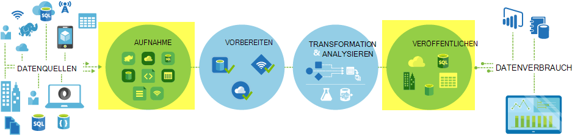
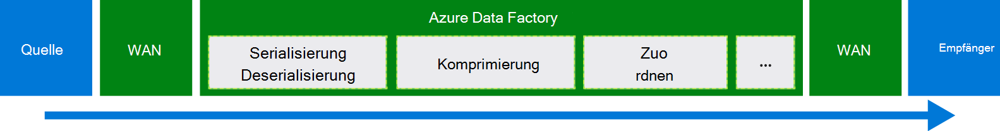
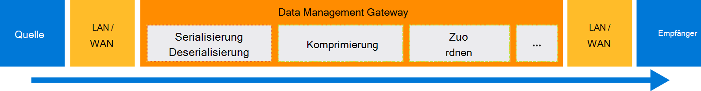

<properties
    pageTitle="Verschieben von Daten mithilfe von Kopieraktivität | Microsoft Azure"
    description="Datentransfer im Data Factory Rohrleitungen lernen: Datenmigration zwischen Cloud-Speicher und zwischen einem lokalen Speicher und einen Cloud-Speicher. Verwenden Sie Kopieraktivität."
    keywords="Kopieren Sie Daten, Daten, Datenmigration, Daten"
    services="data-factory"
    documentationCenter=""
    authors="linda33wj"
    manager="jhubbard"
    editor="monicar"/>

<tags
    ms.service="data-factory"
    ms.workload="data-services"
    ms.tgt_pltfrm="na"
    ms.devlang="na"
    ms.topic="article"
    ms.date="09/22/2016"
    ms.author="jingwang"/>

# Verschieben von Daten mithilfe von Kopieraktivität

## Übersicht
In Azure Data Factory können Sie Aktivitäten kopieren Daten verschiedener Formen von verschiedenen lokalen und Datenquellen in Azure cloud. Nachdem Daten kopiert werden, können weitere transformiert und analysiert werden. Kopieren-Aktivität können Sie Transformation und Analyseergebnisse für Business Intelligence (BI) und Verbrauch Anwendung veröffentlichen.

Kopieraktivität angetrieben eine sichere, zuverlässige, skalierbare, und [weltweit verfügbaren Service](#global). Dieser Artikel enthält Details zum Datentransfer Data Factory und kopieren.

Zunächst sehen wie Datenmigration zwischen zwei Cloud-Datenspeichern und zwischen einem lokalen Datenspeicher und einem Datenspeicher Cloud auftritt.

> [AZURE.NOTE] Aktivitäten im Allgemeinen finden Sie unter [Grundlegendes zu Pipelines und Aktivitäten](data-factory-create-pipelines.md).

### Kopieren von Daten zwischen zwei Cloud-Datenspeicher
Die folgenden Schritte zum Kopieren von Daten aus der Quelle an den Empfänger sind Quelle und Empfänger Datenspeicher in der Cloud durchläuft Kopieraktivität. Der Dienst, der Kopieraktivität Befugnisse:

1. Liest Daten aus dem Datenspeicher Quelle.
2. Führt Serialisierung oder Deserialisierung Kompression/Dekompression, Spalte zuordnen und Typumwandlung. Wird diese Vorgänge basierend auf der Konfiguration der Eingabedatasets ausgabedataset und Kopie-Aktivität.
3.  Schreibt Daten in den Zieldatenspeicher.

Der Dienst wählt automatisch die optimale Region Daten verschieben. Dieser Bereich wird normalerweise am nächsten Senke Datenspeicher.

### Kopieren von Daten zwischen einem lokalen Datenspeicher und einem Cloud-Datenspeicher
Um sichere Verschieben von Daten zwischen einem lokalen Datenspeicher und einem Datenspeicher Cloud installieren Sie Data Management Gateway auf dem lokalen Computer. Daten-Management-Gateway ist ein Agent, der Hybrid-Datentransfer und Verarbeitung ermöglicht. Auf demselben Computer können Installation als Datenspeicher selbst oder auf einem separaten Computer mit Zugriff auf den Datenspeicher.

In diesem Szenario Data Management Gateway führt die Serialisierung oder Deserialisierung, Kompression/Dekompression Spalte zuordnen und Typumwandlung. Datenfluss nicht durch den Dienst Azure Data Factory. Stattdessen schreibt Daten Management Gateway direkt die Daten in den Zielspeicher.

Siehe [Verschieben von Daten zwischen lokalen und Datenspeichern](data-factory-move-data-between-onprem-and-cloud.md) eine Einführung und exemplarische Vorgehensweise. Detaillierte Informationen zu diesen Agent finden Sie unter [Data Management Gateway](data-factory-data-management-gateway.md) .

Sie können auch von unterstützten Datenspeicher verschieben, die in Azure IaaS virtuelle Maschinen (VMs) mit Data Management Gateway gehostet werden. In diesem Fall können Sie Data Management Gateway auf dem gleichen virtuellen Computer installieren, der Datenspeicher selbst oder auf einem separaten virtuellen Computer hat, die Zugriff auf den Datenspeicher.

## Unterstützte Datenspeicher und Formate
[AZURE.INCLUDE [data-factory-supported-data-stores](../../includes/data-factory-supported-data-stores.md)]

Ggf. verschieben speichern Daten eine Kopieraktivität nicht unterstützen, verwenden Sie eine **benutzerdefinierte Aktivität** Data Factory mit Ihre eigene Logik zum Kopieren/Verschieben von Daten. Einzelheiten zum Erstellen und Verwenden einer benutzerdefinierten Aktivität finden Sie unter [benutzerdefinierte Aktivitäten in Azure Data Factory-Pipeline](data-factory-use-custom-activities.md).

### Unterstützte Dateiformate
Können Sie Dateien kopieren Kopieraktivität-zwischen zwei dateibasierten Datenspeicher Azure BLOB-Dateisystem und bietet. Dazu können Sie die Eingabe- und Dataset-Definitionen im [Formatabschnitt](data-factory-create-datasets.md) überspringen. Die Daten werden ohne eine Serialisierung oder Deserialisierung effizient kopiert.

Kopieraktivität auch liest und schreibt Dateien in bestimmten Formaten: Text, Avro ORK, Parkett und JSON. Die folgenden Aktivitäten Kopie möglich beispielsweise:

-   Daten im Textformat (CSV) von Azure Blob und Azure SQL-Datenbank geschrieben.
-   Dateien im Textformat (CSV) von lokalen Dateisystem und Azure BLOB im Avro-Format schreiben.
-   Daten in Azure SQL-Datenbank und bietet lokale ORK-Format geschrieben.

## Global verfügbare Daten
Azure Data Factory ist nur im Westen der USA, USA Ost und Nordeuropa. Jedoch steht der Dienst, der Kopieraktivität wird weltweit in folgenden Regionen und Ländern. Global verfügbare Topologie gewährleistet effizienter Datentransfer, der normalerweise Cross-Region Hops vermeidet. Verfügbarkeit von Data Factory und Verschieben von Daten in einem Bereich finden Sie unter [Dienste nach Region](https://azure.microsoft.com/regions/#services) .

### Kopieren von Daten zwischen Cloud-Datenspeicher
Quelle und Empfänger Datenspeicher in der Cloud sind verwendet Data Factory Service-Bereitstellung in der Region am nächsten an die Senke in demselben geografischen Daten verschieben. Finden Sie in der folgenden Tabelle für die Zuordnung:

Region des Datenspeichers Ziel | Daten zur Region
:----------------------------------- | :----------------------------
Osten der USA | Osten der USA
USA 2 OST | USA 2 OST
Westen der USA | Westen der USA
Westen der USA 2 | Westen der USA
USA | USA
Westen der USA – zentral | USA
Norden der USA – zentral | Norden der USA – zentral
Südlichen zentralen USA | Südlichen zentralen USA
Nordeuropa | Nordeuropa
Westeuropa | Westeuropa
Südostasien | Südostasien
Ostasien | Südostasien
Japan OST | Japan OST
Japan West | Japan OST
Brasilien Süd | Brasilien Süd
Australien OST | Australien OST
Australien Südost | Australien Südost
Zentrale Indien | Zentrale Indien
Süd Indien | Zentrale Indien
West Indien | Zentrale Indien

> [AZURE.NOTE] Ist die Region des Datenspeichers Ziel nicht in der obigen Liste schlägt Kopieraktivität statt über einen anderen Bereich.

### Kopieren von Daten zwischen einem lokalen Datenspeicher und einem Cloud-Datenspeicher
Wenn Daten zwischen lokalen (oder Azure VMs-IaaS) kopiert und Cloud speichert [Daten Management Gateway](data-factory-data-management-gateway.md) führt die Daten auf einem lokalen Computer oder den virtuellen Computer. Daten fließt nicht durch den Dienst in der Cloud, wenn Sie die Funktion [Kopieren bereitgestellt](data-factory-copy-activity-performance.md#staged-copy) verwenden. In diesem Fall Datenfluss durch staging Azure BLOB-Speicher vor dem Schreiben in den Datenspeicher Senke.

## Erstellen Sie eine Pipeline mit Kopieren
Sie können eine Rohrleitung mit Kopie auf verschiedene Weise erstellen:

### Mithilfe des Assistenten zum Kopieren
Assistent zum Kopieren von Factory können Sie eine Rohrleitung mit Kopie erstellen. Diese Pipeline können Sie Daten aus unterstützten Ziele *ohne JSON* Definitionen für verknüpfte Dienste, Datasets und Rohrleitungen zu kopieren. Informationen über den Assistenten finden Sie unter [Assistent zum Kopieren von Factory](data-factory-copy-wizard.md) .  

### Mit JSON-Skripts
Azure-Portal, Visual Studio oder Azure PowerShell können Data Factory-Editor Sie eine JSON-Definition für eine Pipeline erstellen (mit Kopieraktivität). Anschließend können Sie zum Erstellen der Pipeline in Data Factory bereitstellen. Siehe [Tutorial: verwenden Kopieraktivität in Azure Data Factory-Pipeline](data-factory-copy-data-from-azure-blob-storage-to-sql-database.md) ein Lernprogramm Schritt.    

JSON-Eigenschaften (wie Name, Beschreibung, Eingabe- und Tabellen und Richtlinien) sind für alle Aktivitäten verfügbar. Die verfügbaren Eigenschaften in der `typeProperties` Abschnitt der Aktivität je nach jeden Aktivitätstyp.

Kopie für die `typeProperties` variiert abhängig von den Quellen und senken. Klicken Sie auf eine Quelle/Senke im Abschnitt [unterstützte Datenquellen und Datensenken](#supported-data-stores) zu lernen, die Kopieraktivität, Datenspeicher unterstützt.   

Hier ist eine Beispiel JSON-Definition:

    {
      "name": "ADFTutorialPipeline",
      "properties": {
        "description": "Copy data from Azure blob to Azure SQL table",
        "activities": [
          {
            "name": "CopyFromBlobToSQL",
            "type": "Copy",
            "inputs": [
              {
                "name": "InputBlobTable"
              }
            ],
            "outputs": [
              {
                "name": "OutputSQLTable"
              }
            ],
            "typeProperties": {
              "source": {
                "type": "BlobSource"
              },
              "sink": {
                "type": "SqlSink",
                "writeBatchSize": 10000,
                "writeBatchTimeout": "60:00:00"
              }
            },
            "Policy": {
              "concurrency": 1,
              "executionPriorityOrder": "NewestFirst",
              "retry": 0,
              "timeout": "01:00:00"
            }
          }
        ],
        "start": "2016-07-12T00:00:00Z",
        "end": "2016-07-13T00:00:00Z"
      }
    }

Im ausgabedataset definierten Zeitplan bestimmt, wenn die Aktivität ausgeführt wird (z. B.: **tägliche**und Häufigkeit als **Tag**Intervall **1**). Die Aktivität kopiert Daten vom Eingabedatasets (**Quelle**) ein Ausgabe-DataSet (**Empfänger**).

Sie können mehrere Eingabedatasets Kopie Aktivität. Sie dienen die Abhängigkeiten überprüfen, bevor die Aktivität ausgeführt wird. Nur die Daten aus dem ersten Datensatz werden jedoch in das Ziel-Dataset kopiert. Weitere Informationen finden Sie unter [Planung und Ausführung](data-factory-scheduling-and-execution.md).  

## Leistung und Optimierung
Finden Sie die [Kopieraktivität Performance und tuning Guide](data-factory-copy-activity-performance.md)beschreibt wichtige Faktoren, die die Leistung des Datentransfers (Kopieraktivität) in Azure Data Factory. Außerdem listet die beobachtete Leistung bei internen Tests und erläutert verschiedene Methoden zur Optimierung der Leistung der Aktivität kopieren.

## Planen und laufende kopieren
Ausführliche Informationen zu Planung und Ausführung in Data Factory finden Sie unter [Planung und Ausführung](data-factory-scheduling-and-execution.md) . Es ist möglich, mehrere Kopiervorgänge nacheinander auf sequenzielle/bestellt. Siehe Abschnitt [bestellt kopieren](data-factory-scheduling-and-execution.md#ordered-copy) .

## Typumwandlungen
Datenspeichern haben anderen systemeigenen Typsysteme. Kopie Aktivität automatische Konvertierung von Quelltypen mit folgenden zweistufiges Auffangen:

1. Konvertieren Sie aus systemeigenen Quelle ein.
2. Ein in einer systemeigenen Senke konvertieren.

Die Zuordnung von einem systemeigenen Typ ein .NET für einen Datenspeicher wird Daten Shop-Artikel (Klicken Sie auf den Link in der Tabelle [Datenspeicher unterstützt](#supported-data-stores) ). Diese Zuordnung können Sie geeignete ermitteln beim Erstellen der Tabellen kopieren Aktivität rechts konvertiert.

## Nächste Schritte
- Weitere zur Aktivität kopieren, finden Sie unter [Kopieren von Daten aus Azure BLOB-Speicher in Azure SQL-Datenbank](data-factory-copy-data-from-azure-blob-storage-to-sql-database.md).
- Zum Verschieben von Daten aus einem lokalen Datenspeicher auf einem Datenspeicher Cloud finden Sie unter [Verschieben von Daten aus auf lokale Daten Cloud gespeichert](data-factory-move-data-between-onprem-and-cloud.md).
