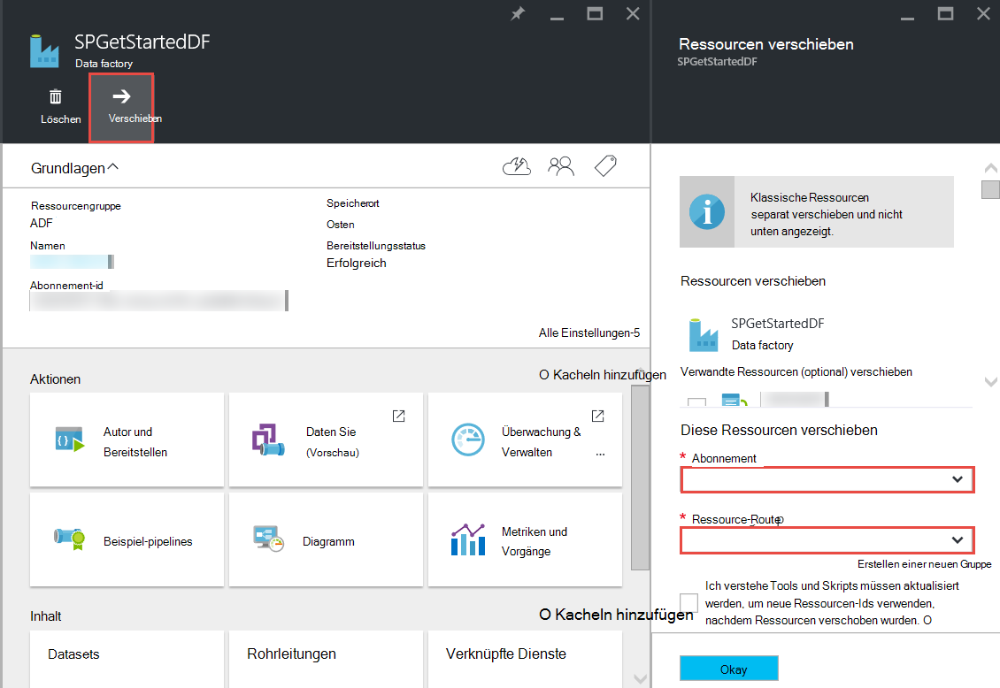

<properties 
    pageTitle="Azure Data Factory - häufig gestellte Fragen" 
    description="Häufig gestellte Fragen zur Azure Data Factory." 
    services="data-factory" 
    documentationCenter="" 
    authors="sharonlo101" 
    manager="jhubbard" 
    editor="monicar"/>

<tags 
    ms.service="data-factory" 
    ms.workload="data-services" 
    ms.tgt_pltfrm="na" 
    ms.devlang="na" 
    ms.topic="article" 
    ms.date="09/12/2016" 
    ms.author="shlo"/>

# Azure Data Factory - häufig gestellte Fragen

## Allgemeine Fragen

### Was ist Azure Data Factory?

Data Factory ist eine cloudbasierte Datenintegration service, **automatisiert die Verlagerung und Transformation von Daten**. Eine Factory, die Geräte Rohstoffe und zu Fertigerzeugnissen ausführt, wie orchestriert Data Factory vorhandene Dienste, die unformatierte Daten und bereit zu verwendende verwandeln. 
 
Data Factory können Sie datengesteuerten Workflows zum Verschieben von Daten zwischen sowohl lokalen Datenspeicher Cloud sowie Prozess-Transformieren von Daten mit Compute-Services wie Azure HDInsight und Azure Data Lake Analytics erstellen. Nachdem Sie eine Rohrleitung, die die Aktion ausführt, die Sie benötigen erzeugen, können Sie regelmäßig ausgeführt (stündlich, täglich, wöchentlich etc.) planen.   

Weitere Informationen finden Sie unter [Übersicht & Key Concepts](data-factory-introduction.md) . 

### Wo finde ich Preisinformationen für Azure Data Factory?

[Data Factory Preisdetails] Siehe[ adf-pricing-details] für Preisangaben für Azure Data Factory.  

### Wie mit Azure Data Factory beginne ich?

- Eine Übersicht über Azure Data Factory finden Sie unter [Einführung in Azure Data Factory](data-factory-introduction.md).
- Ein Tutorial zum **Kopieren/Verschieben Daten** kopieren-Aktivitäten finden Sie unter [Daten von Azure BLOB-Speicher in Azure SQL-Datenbank](data-factory-copy-data-from-azure-blob-storage-to-sql-database.md).
- Ein Tutorial zum **Transformieren von Daten** mit HDInsight Struktur Aktivität. Siehe [Daten Struktur Skript Hadoop Cluster](data-factory-build-your-first-pipeline.md) 
  
### Was ist die Data Factory Region Verfügbarkeit?
Data Factory ist in **US West** und **Nordeuropa**. Die verwendeten Daten Fabriken Computing- und Dienste kann in anderen Regionen. [Unterstützte Regionen](data-factory-introduction.md#supported-regions)anzeigen 
 
### Was sind die Grenzwerte für die Anzahl der Data Factorys/Rohrleitungen/Aktivitäten/Datasets?
 
Siehe Artikel [Azure-Abonnement und Service Grenzen, Kontingente und Einschränkungen](../azure-subscription-service-limits.md#data-factory-limits) **Azure Data Factory Grenzen** .

### Was ist die authoring-Entwickler Erfahrung mit Azure Data Factory?

Sie können Autor/Data Factorys mithilfe einer der folgenden erstellen:

- **Azure-Portal**  
   die Daten Factory Blades im Azure-Portal bieten umfangreiche Benutzeroberfläche Factorys Ad Verknüpfte Datendienste erstellen. **Data Factory-Editor**ist auch Teil des Portals können Sie problemlos verknüpften Diensten, Tabellen, Datensätzen und Pipelines erstellen, indem Sie JSON-Definitionen für diese Artefakte. Ein Beispiel für die Portal-Editor zum Erstellen und Bereitstellen einer Data Factory finden Sie unter [erstellen Ihre erste Azure-Portal mit Datenpipeline](data-factory-build-your-first-pipeline-using-editor.md) .

- **Visual Studio**  
   können Sie Visual Studio eine Azure Data Factory erstellt. Einzelheiten finden Sie unter [erstellen Ihre erste Datenpipeline mit Visual Studio](data-factory-build-your-first-pipeline-using-vs.md) . 

- **Azure PowerShell**  
   finden Sie unter [Erstellen und überwachen Azure Data Factory mit Azure PowerShell](data-factory-build-your-first-pipeline-using-powershell.md) Tutorial/Anleitung zum Erstellen einer Daten-Factory mithilfe von PowerShell. Finden Sie unter [Data Factory Cmdlet Reference] [ adf-powershell-reference] Inhalt auf MSDN Library für eine umfassende Dokumentation Data Factory Cmdlets.
   
- **.NET Class Library**  
   können programmgesteuert erstellen Daten Factorys mit Data Factory .NET SDK. Eine exemplarische Vorgehensweise zum Erstellen einer Data Factory mit .NET SDK finden Sie unter [erstellen, überwachen und Verwalten von Daten Fabriken .NET SDK](data-factory-create-data-factories-programmatically.md) . Finden Sie unter [Data Factory Class Library Reference] [ msdn-class-library-reference] für eine umfassende Data Factory .NET SDK-Dokumentation.

- **REST-API-**  
   Sie können auch die REST API von Azure Data Factory-Dienst erstellen und Bereitstellen von Daten Factorys. [Data Factory REST-API-Referenz] finden Sie unter[ msdn-rest-api-reference] für eine umfassende Dokumentation Data Factory REST-API.
 
- **Azure Ressourcenmanager Vorlage** 
   finden Sie unter [Tutorial: Erstellen Ihrer erste Azure Data Factory mit Azure Ressourcenmanager Vorlage](data-factory-build-your-first-pipeline-using-arm.md) fo Details. 

### Kann eine Daten-Factory umbenennen?
Nein. Der Name einer Azure Data Factory kann wie andere Azure Ressourcen geändert werden. 

### Kann ich eine Daten-Factory aus einem Azure-Abonnement auf einen anderen verschieben? 
Ja. Die Schaltfläche **Verschieben** auf die Factory Daten wie im folgenden Diagramm dargestellt. 

### Was sind die Compute-Umgebung Data Factory unterstützt?
Die folgende Tabelle enthält eine Liste der Compute-Umgebung unterstützt Data Factory und die Aktivitäten, die Sie ausführen können. 

| Berechnen der Umgebung | Aktivitäten |
| ------------------- | -------- | 
| [Bei Bedarf HDInsight Cluster](data-factory-compute-linked-services.md#azure-hdinsight-on-demand-linked-service) oder [HDInsight-cluster](data-factory-compute-linked-services.md#azure-hdinsight-linked-service) | [DotNet](data-factory-use-custom-activities.md) [Struktur](data-factory-hive-activity.md) [Schwein](data-factory-pig-activity.md), [MapReduce](data-factory-map-reduce.md), [Hadoop Streaming](data-factory-hadoop-streaming-activity.md) | 
| [Azure Batch](data-factory-compute-linked-services.md#azure-batch-linked-service) | [DotNet](data-factory-use-custom-activities.md) |  
| [Azure maschinelles lernen](data-factory-compute-linked-services.md#azure-machine-learning-linked-service) | [Maschine lernen: Batchausführung und Ressource](data-factory-azure-ml-batch-execution-activity.md) |
| [Azure Data Lake Analytics](data-factory-compute-linked-services.md#azure-data-lake-analytics-linked-service) | [Data Lake Analytics U-SQL](data-factory-usql-activity.md)
| [Azure SQL](data-factory-compute-linked-services.md#azure-sql-linked-service) [Azure SQL Datawarehouse](data-factory-compute-linked-services.md#azure-sql-data-warehouse-linked-service) [SQL Server](data-factory-compute-linked-services.md#sql-server-linked-service) | [Gespeicherte Prozedur](data-factory-stored-proc-activity.md)

## Aktivitäten - FAQ
### Was sind die verschiedenen Aktivitäten in einer Pipeline Data Factory verwenden? 

- [Datenaktivitäten](data-factory-data-movement-activities.md) zum Verschieben von Daten.
- [Daten Transformationsaktivitäten](data-factory-data-transformation-activities.md) Prozess/Daten transformieren. 

### Wann wird eine Aktivität ausgeführt?
**Verfügbarkeit** -Einstellung in der Datentabelle Ausgabe bestimmt die Ausführung der Aktivität. Eingabe-Datasets angegeben werden, die Aktivität überprüft, ob alle Eingabedaten Abhängigkeiten erfüllt sind **(betriebsbereit)** vor ausgeführt. 

## Aktivität - häufig gestellte Fragen zum Kopieren
### Ist es besser, eine Rohrleitung mit mehreren Aktivitäten oder eine eigene Pipeline für jede Aktivität? 
Pipelines sollen Aktivitäten bündeln. Wenn Datensätze, die sie Verbinden nicht durch andere Tätigkeit außerhalb der verbraucht wird, können Sie die Aktivitäten in einer Pipeline halten. Auf diese Weise nicht Kette Pipeline active Perioden müssen Sie, damit sie einander gegenübergestellt. Außerdem ist die Datenintegrität in der Pipeline internen Tabellen besser erhalten, Pipeline aktualisieren. Pipeline-Update im Wesentlichen beendet alle Aktivitäten in der Pipeline entfernt und erneut erstellt. Aus Sicht erstellen, kann es auch deutlicher den Datenfluss innerhalb der Aktivitäten in einer JSON-Datei für die Pipeline sein.

### Was sind die unterstützten Datenspeicher?
[AZURE.INCLUDE [data-factory-supported-data-stores](../../includes/data-factory-supported-data-stores.md)]

### Was sind die unterstützten Dateiformate? 
[AZURE.INCLUDE [data-factory-file-format](../../includes/data-factory-file-format.md)]

### Wo wird der Kopiervorgang durchgeführt? 
Siehe Einzelheiten [global verfügbaren Daten](data-factory-data-movement-activities.md#global) . Kurz gesagt, bei ein lokalen Datenspeicher beim Kopieren von Data Management Gateway in Ihrer lokalen Umgebung erfolgt. Und wird der Datentransfer zwischen zwei Cloud-Speicher, erfolgt der Kopiervorgang in Ihre Region an Empfänger in derselben Region. 

## HDInsight Aktivität - FAQ

### HDInsight Regionen unterstützt?

Siehe Abschnitt geografische Verfügbarkeit in folgendem Artikel: oder [Preisdetails HDInsight][hdinsight-supported-regions].

### Region einen bedarfsgesteuerten HDInsight Cluster verwendet?

Bei Bedarf HDInsight Cluster wird in derselben Region erstellt mit Cluster angegebenen Speicher besteht.    

### Zusätzlichen Speicher zuordnen Konten HDInsight Cluster?

Wenn Sie eigene HDInsight Cluster (BYOC - eigenen Cluster bringen) verwenden, finden Sie unter folgenden Themen: 

- [Verwenden einen HDInsight-Cluster mit alternativen Konten und Metastores][hdinsight-alternate-storage]
- [Verwenden Sie zusätzlicher Speicherkonten mit HDInsight Struktur][hdinsight-alternate-storage-2]

Wenn Sie einen Cluster bei Bedarf verwenden, der vom Dienst Data Factory erstellt wird, geben Sie zusätzlicher Speicherkonten für den HDInsight Service so verknüpft, dass Data Factory-Dienst in Ihrem Namen registriert werden kann an. In JSON-Definition für den Dienst auf Anforderung verknüpften mithilfe **AdditionalLinkedServiceNames** -Eigenschaft alternativen Konten wie im folgenden Codeausschnitt JSON dargestellt:
 
    {
        "name": "MyHDInsightOnDemandLinkedService",
        "properties":
        {
            "type": "HDInsightOnDemandLinkedService",
            "typeProperties": {
                "clusterSize": 1,
                "timeToLive": "00:01:00",
                "linkedServiceName": "LinkedService-SampleData",
                "additionalLinkedServiceNames": [ "otherLinkedServiceName1", "otherLinkedServiceName2" ] 
            }
        }
    } 

Im obigen Beispiel stehen otherLinkedServiceName1 und otherLinkedServiceName2 verknüpfte Diensten, deren Definitionen Anmeldeinformationen enthält, HDInsight Cluster alternativen Konten zugreifen.

## Segmente - FAQ

### Warum sind meine Eingabe nicht im Zustand bereit?  
Ein häufiger Fehler ist nicht Einstellung **externe** -Eigenschaft **true** Eingabedatasets wird die Eingabedaten externe Daten Factory (nicht werkseitig Daten erstellt). 

Im folgenden Beispiel müssen Sie nur **externe** auf **dataset1**auf True festlegen.  

**DataFactory1** Pipeline 1: dataset1 -> activity1 -> Datensatz2 -> activity2 -> dataset3 Pipeline 2: dataset3 -> activity3 -> dataset4

Haben Sie mit einem anderen Daten Factory, die dataset4 (erstellt durch Rohrleitungen Data Factory 1 2) akzeptiert markieren Sie dataset4 als externe Dataset, da Dataset durch eine andere Daten Factory (DataFactory1, nicht DataFactory2) erstellt wird.  

**DataFactory2**    
Pipeline 1: dataset4 -> activity4 -> dataset5

Wenn die externe Eigenschaft richtig eingestellt ist, überprüfen Sie, ob Eingabedaten in der Definition des Eingabedatasets angegebenen Speicherort vorhanden ist. 

### Wie ein Segment zu einem anderen Zeitpunkt als Mitternacht ausgeführt als Segment täglich entsteht?
Verwenden Sie die **Offset** -Eigenschaft, um den Zeitraum anzugeben, an dem das Segment erstellt werden soll. [Dataset Verfügbarkeit](data-factory-create-datasets.md#Availability) Siehe Informationen zu dieser Eigenschaft. Hier ist ein Beispiel:

    "availability":
    {
        "frequency": "Day",
        "interval": 1,
        "offset": "06:00:00"
    }

Tägliche Slices Starten um **6 Uhr** statt standardmäßig Mitternacht.     

### Wie kann ein Segment erneut?
Sie können ein Segment in einer der folgenden Methoden erneut: 

- Verwenden Sie überwachen und Verwalten von App ein aktivitätenfenster oder Segment erneut. Weitere Informationen finden Sie in der [Aktivität Fenster erneut ausgewählt](data-factory-monitor-manage-app.md#re-run-selected-activity-windows) .   
- Klicken Sie in der Befehlsleiste auf der **DATENSLICE** für das Segment im Azure-Portal **Ausführen** .
- Führen Sie **Set-AzureRmDataFactorySliceStatus** -Cmdlet mit **Warten** für das Segment.   
    
        Set-AzureRmDataFactorySliceStatus -Status Waiting -ResourceGroupName $ResourceGroup -DataFactoryName $df -TableName $table -StartDateTime "02/26/2015 19:00:00" -EndDateTime "02/26/2015 20:00:00" 

Finden Sie unter [Set-AzureRmDataFactorySliceStatus] [ set-azure-datafactory-slice-status] Weitere Informationen über das Cmdlet. 

### Wie lange dauerte es ein Segment verarbeiten?
Aktivität Fenster Explorer überwachen und Verwalten von App wissen, wie lange dauerte ein Datenslice zu verwenden. Details finden Sie im [Windows Explorer Aktivität](data-factory-monitor-manage-app.md#activity-window-explorer) . 

Sie können auch im Azure-Portal folgendermaßen:  

1. Klicken Sie auf **Datasets** nebeneinander auf dem Blatt **DATA FACTORY** für die Daten-Factory.
2. Klicken Sie auf bestimmte Dataset-Blade **Datasets** .
3. Wählen Sie das Segment, dem Sie aus der Liste **zuletzt verwendete Slices** auf der **Tabelle** interessieren.
4. Klicken Sie auf die Aktivität führen Sie **DATENSLICE** Blade aus **Aktivität ausgeführt wird** . 
5. Klicken Sie auf **Eigenschaften** nebeneinander auf die **AKTIVITÄTSDETAILS ausführen** . 
6. Das Feld **Dauer** einen Wert sollte angezeigt werden. Dieser Wert ist die Verarbeitungszeit für das Segment.   

### Wie ausgeführte Segment beenden?
Benötigen Sie die Pipeline Ausführung beenden, können Sie die [Standby-AzureRmDataFactoryPipeline](https://msdn.microsoft.com/library/mt603721.aspx) -Cmdlet. Derzeit verhindert Anhalten der Pipeline nicht das Slice ausgeführt, die in Bearbeitung sind. Wenn die Einheiten in Bearbeitung abgeschlossen haben, wird keine zusätzliche Segment übernommen.

Wenn Sie die Ausführung sofort beenden möchten, wäre nur die Pipeline löschen und erneut erstellen. Möchten Sie die Rohrleitung zu löschen, müssen Sie nicht löschen von Tabellen und verknüpften Dienste von der Pipeline verwendet. 

[create-factory-using-dotnet-sdk]: data-factory-create-data-factories-programmatically.md
[msdn-class-library-reference]: https://msdn.microsoft.com/library/dn883654.aspx
[msdn-rest-api-reference]: https://msdn.microsoft.com/library/dn906738.aspx

[adf-powershell-reference]: https://msdn.microsoft.com/library/dn820234.aspx 
[azure-portal]: http://portal.azure.com
[set-azure-datafactory-slice-status]: https://msdn.microsoft.com/library/mt603522.aspx

[adf-pricing-details]: http://go.microsoft.com/fwlink/?LinkId=517777
[hdinsight-supported-regions]: http://azure.microsoft.com/pricing/details/hdinsight/
[hdinsight-alternate-storage]: http://social.technet.microsoft.com/wiki/contents/articles/23256.using-an-hdinsight-cluster-with-alternate-storage-accounts-and-metastores.aspx
[hdinsight-alternate-storage-2]: http://blogs.msdn.com/b/cindygross/archive/2014/05/05/use-additional-storage-accounts-with-hdinsight-hive.aspx
 
