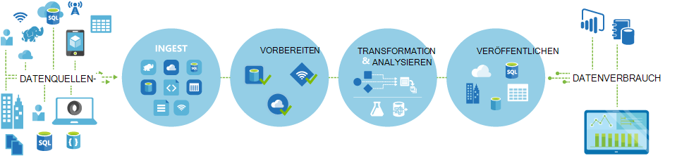
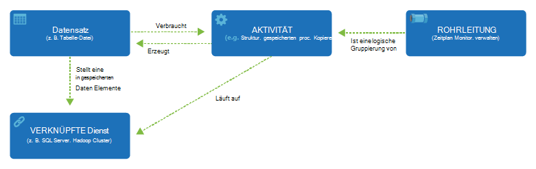

<properties 
    pageTitle="Einführung in Data Factory einen Integrations-Service | Microsoft Azure" 
    description="Informationen Azure Data Factory: eine Cloud Data Integrationsservice, koordiniert und automatisiert Bewegung und Transformation von Daten." 
    keywords="Datenintegration Cloud Datenintegration was Azure Data Factory ist"
    services="data-factory" 
    documentationCenter="" 
    authors="sharonlo101" 
    manager="jhubbard" 
    editor="monicar"/>

<tags 
    ms.service="data-factory" 
    ms.workload="data-services" 
    ms.tgt_pltfrm="na" 
    ms.devlang="na" 
    ms.topic="get-started-article" 
    ms.date="09/22/2016" 
    ms.author="shlo"/>

# Einführung in Azure Data Factory Service ein Integrations-Service in der cloud

## Was ist Azure Data Factory? 
Data Factory ist ein Cloud-basierte Integrationsdienst, der koordiniert und automatisiert die **Verlagerung** und **Transformation** von Daten. Data Integration Solutions Data Factory nutzen können, die Daten aus verschiedenen Datenspeichern aufnehmen, Transform-Prozess die Daten, und veröffentlichen die Daten für die Datenspeicher. 

Datendienst Factory können Sie Datenpipelines, die verschieben und Transformieren von Daten zu erstellen, und führen die Rohrleitungen nach einem bestimmten Zeitplan (stündlich, täglich, wöchentlich usw.). Darüber hinaus umfassende Visualisierung Herkunft und Abhängigkeiten Datenpipelines anzeigen und überwachen alle Datenpipelines aus einer einheitlichen Ansicht einfach Probleme und Setup Überwachungswarnmeldungen ermöglicht.

**Abbildung1.** Einlesen von Daten aus verschiedenen Datenquellen vorbereiten, Transformieren und analysieren und Veröffentlichen bereit mit Daten zum Verbrauch.

## Pipelines und Aktivitäten
In einer Projektmappe Data Factory erstellen Sie eine oder mehrere Daten **Rohrleitungen**. Eine Pipeline ist eine logische Gruppierung von Aktivitäten. Sie dienen zur Aktivitäten in einer Einheit, die zusammen eine Aufgabe. 

**Aktivitäten** definieren die Aktionen, die für Ihre Daten auszuführen. Eine kopieraktivität können Sie Daten aus einem Datenspeicher zu einem anderen kopieren. Ebenso können Sie eine Aktivität Struktur führt eine Hive-Abfrage auf einem Cluster Azure HDInsight transformieren oder Datenanalyse. Data Factory unterstützt zwei Arten von Aktivitäten: Daten verschieben und Data Transformation. 
  
## Daten-Bewegung 
[AZURE.INCLUDE [data-factory-supported-data-stores](../../includes/data-factory-supported-data-stores.md)]

Siehe [Datenaktivitäten](data-factory-data-movement-activities.md) Artikel. 

## Aktivitäten für die Transformation von Daten
[AZURE.INCLUDE [data-factory-transformation-activities](../../includes/data-factory-transformation-activities.md)]

Siehe [Daten Transformationsaktivitäten](data-factory-data-transformation-activities.md) Artikel.

Wenn Sie zu speichern Daten ein, Kopieraktivität nicht unterstützt, oder eine eigene Logik für die Datentransformation erstellen Sie eine **benutzerdefinierte Aktivität für .NET**. Einzelheiten zum Erstellen und Verwenden einer benutzerdefinierten Aktivität finden Sie unter [benutzerdefinierte Aktivitäten in Azure Data Factory-Pipeline](data-factory-use-custom-activities.md).

## Verknüpfte Dienste
Verknüpfte Dienste definieren Informationen für Daten für die Verbindung zu externen Ressourcen (Beispiele: Azure Storage lokalen SQL Server Azure HDInsight). Verknüpfte Dienste werden zwei Funktionen in Data Factory verwendet:

- Stellen einen **Datenspeicher** einschließlich aber nicht beschränkt auf, einer lokalen SQL Server, Oracle-Datenbank-Freigabe oder einem Konto Azure BLOB-Speicher. Finden Sie im Abschnitt [Datenaktivitäten](data-factory-data-movement-activities.md) eine Liste der unterstützten Datenspeicher. 
- Ein **compute Ressource** dargestellt, die die Ausführung einer Aktivität hosten kann. Beispielsweise führt HDInsightHive Aktivität auf einem HDInsight Hadoop-Cluster. [Daten Transformationsaktivitäten](data-factory-data-transformation-activities.md) Siehe eine Liste der unterstützten Compute-Umgebung. 

## Datasets 
Verknüpfte Diensten Datenspeicher mit einer Azure Data Factory verknüpfen. Datasets stellen Datenstrukturen im Datenspeicher dar. Beispielsweise bietet einen Azure Storage verknüpft Verbindungsinformationen für Daten zum Azure Storage-Konto herstellen. Ein Dataset Azure Blob gibt die BLOB-Container und Ordner in Azure BLOB-Speicher die Pipeline die Daten gelesen werden sollte. Entsprechend ein Azure SQL verknüpft Service bietet Verbindungsinformationen für eine SQL Azure-Datenbank und einer SQL Azure-Dataset die Tabelle mit den Daten.   

## Beziehung zwischen Data Factory
Data Factory hat einige wichtige Elemente, die zusammen Eingabe definieren und Daten verarbeitet Ereignisse und Zeitplan und Ressourcen zum Ausführen des gewünschten Datenfluss.

**Abbildung 2.** Beziehung zwischen Dataset, Aktivität, Pipeline und verknüpft

Vier einfache Konzepte von verknüpften Diensten, Datasets, Aktivitäten und Pipelines können Sie loslegen! Sie können [Ihre erste Pipeline erstellen](data-factory-build-your-first-pipeline.md). 

## Unterstützten Regionen
Zurzeit können Sie Daten Fabriken im **Westen der USA**, **USA OST**und **Nordeuropa** erstellen. Jedoch Data Factory kann Zugriff auf Datenspeicher und Dienste zum Verschieben von Daten zwischen Datenspeichern andernorts Azure compute oder Prozessdaten mit Services berechnen. 

Azure Data Factory selbst werden keine Daten gespeichert. Sie können datengesteuerte Abläufe zur Verlagerung von Daten zwischen [Datenspeichern unterstützt](data-factory-data-movement-activities.md#supported-data-stores) und Verarbeitung der Daten in anderen Regionen oder in einer lokalen Umgebung mit [compute Dienste](data-factory-compute-linked-services.md) orchestrieren erstellen. Außerdem können zu [Überwachen und Verwalten von Workflows](data-factory-monitor-manage-pipelines.md) mit programmgesteuerten UI-Mechanismen. 

Obwohl Azure Data Factory in nur **Westen der USA** **USA OST**und **Nord** Regionen verfügbar ist, ist der Dienst Einschalten der Datenübertragung Data Factory verfügbar [weltweit](data-factory-data-movement-activities.md#global) in verschiedenen Regionen. Bei ein Datenspeicher hinter einem Firewall installiert [Data Management Gateway](data-factory-move-data-between-onprem-and-cloud.md) setzt werden die Daten in Ihrer lokalen Umgebung stattdessen verschoben. 

Beispielsweise Angenommen Sie, dass Ihre Umgebung Compute Cluster Azure HDInsight und Azure Machine Learning aus Westeuropa ausgeführt werden. Erstellen und Verwenden einer Instanz Azure Data Factory in Nordeuropa, und zum Planen von Aufträgen in der Compute-Umgebung in Westeuropa verwenden. Es dauert ein paar Millisekunden für Daten den Auftrag in der Compute-Umgebung ausgelöst bei Ausführung des Auftrags auf Ihre Umgebung bleibt jedoch unverändert.

Wir wollen Azure Data Factory in allen Regionen in Zukunft von Azure unterstützt.
  
## Nächste Schritte
Informationen zu Data Factorys mit Daten führen Sie die folgenden Lernprogramme Anleitung. 

Lernprogramm | Beschreibung
-------- | -----------
[Erstellen einer Datenpipeline, die Daten mit Hadoop-Cluster verarbeitet](data-factory-build-your-first-pipeline.md) | In diesem Lernprogramm erstellen Sie **Prozesse Daten** mit Hive-Skript in einem Cluster Azure HDInsight (Hadoop) Ihrer ersten Azure Data Factory mit einer Datenpipeline. |
[Erstellen einer Datenpipeline zum Verschieben von Daten zwischen zwei Cloud-Datenspeicher](data-factory-copy-data-from-azure-blob-storage-to-sql-database.md) | In diesem Lernprogramm erstellen Sie eine Factory Daten mit einem, **verschiebt Daten** von BLOB-Speicher mit SQL-Datenbank.
[Erstellen einer Datenpipeline zum Verschieben von Daten zwischen einem lokalen Datenspeicher und einen Cloud Datenspeicher Data Management Gateway](data-factory-move-data-between-onprem-and-cloud.md) | In diesem Lernprogramm erstellen Sie einer Factory Daten mit einer Pipeline, **Daten** aus einer **lokalen** SQL Server-Datenbank in Azure Blob. Als Teil der exemplarischen Vorgehensweise installieren und Konfigurieren der Datenverwaltungsgateway auf Ihrem Computer. 
