<properties 
    pageTitle="Überwachen und Verwalten von Azure Data Factory Rohrleitungen" 
    description="Erfahren Sie, wie Sie Azure-Portal und Azure PowerShell zum Überwachen und Verwalten von Azure Data Factorys und Pipelines, die Sie erstellt haben." 
    services="data-factory" 
    documentationCenter="" 
    authors="spelluru" 
    manager="jhubbard" 
    editor="monicar"/>

<tags 
    ms.service="data-factory" 
    ms.workload="data-services" 
    ms.tgt_pltfrm="na" 
    ms.devlang="na" 
    ms.topic="article" 
    ms.date="09/06/2016" 
    ms.author="spelluru"/>

# Überwachen und Verwalten von Azure Data Factory Rohrleitungen
> [AZURE.SELECTOR]
- [Azure-Portal/Azure PowerShell verwenden](data-factory-monitor-manage-pipelines.md)
- [Überwachung und Management-Anwendung](data-factory-monitor-manage-app.md)

Data Factory Service bietet zuverlässige und vollständiger Überblick über die Speicherung, Verarbeitung und Daten Datentransfer-Services. Der Service bietet eine Überwachung Dashboard hilft, mit denen Sie folgende Aufgaben ausführen: 

- Beurteilen Sie Ende-Ende-Pipeline Gesundheit schnell.
- Probleme und gegebenenfalls Maßnahmen ergreifen. 
- Die Datenherkunft nachverfolgen. 
- Verfolgen Sie Beziehungen zwischen Daten über alle Quellen.
- Vollständige Historie Accounting Auftragsausführungsergebnisse Systemzustand und Abhängigkeiten anzeigen.

Dieser Artikel beschreibt das Überwachen, verwalten und Debuggen von Pipelines. Darüber hinaus Informationen zum Warnregeln erstellen und Fehlern benachrichtigt.

## Rohrleitungen und Aktivität Staaten verstehen
Mit der Azure-Portal können Sie:

- Die Factory Daten als Diagramm anzeigen
- Anzeigen von Aktivitäten in einer pipeline
- Eingabe- und Datasets anzeigen
- und vieles mehr. 

Dieser Abschnitt enthält auch ein Segment wie von einem Zustand in einen anderen Zustand übergeht.   

### Navigieren Sie zu Ihrer Data factory
1.  Mit der [Azure-Portal](https://portal.azure.com)anmelden.
2.  Klicken Sie im Menü auf der linken Seite auf **Daten Factorys** . Wenn Sie nicht angezeigt, klicken Sie auf **Weitere Dienste >** und **Daten Factorys** **Intelligenz + ANALYTICS** Kategorie auf. 

    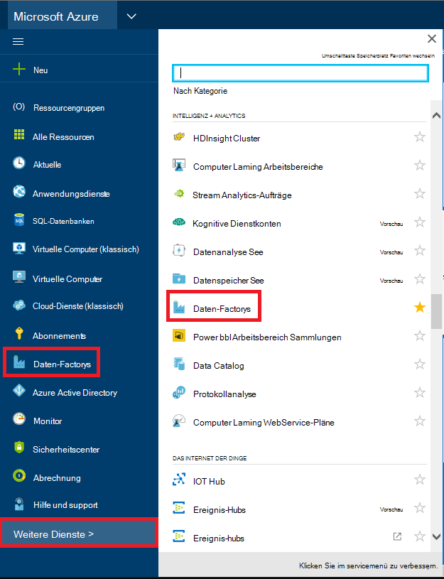

    Alle Daten Factorys **Daten Factorys** Blade sollte angezeigt werden. 
4. Wählen Sie Data Factorys Blade Data Factory, die, der Sie interessieren.

    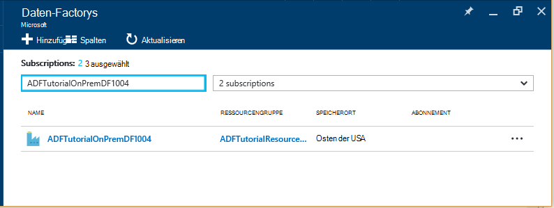  
5.  und sollte die Startseite (**Data Factory** Blade) Data Factory.

    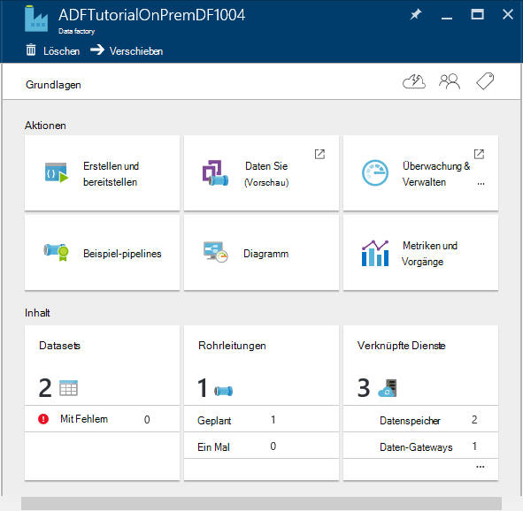

#### Ansicht Ihrer Daten Factory
Die Diagrammansicht Data Factory bietet einen zentralen Konsole überwachen und Verwalten der Data Factory und ihre Ressourcen.

Klicken Sie die Diagrammansicht Data Factory **Diagramm** auf der Startseite des Daten-Factory.

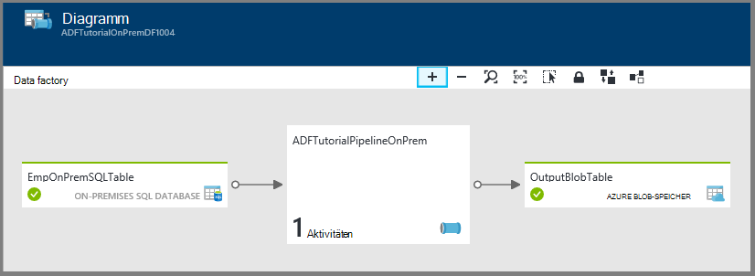

Sie vergrößern, verkleinern, vergrößern, auf 100 % zoomen, Sperren das Layout des Diagramms, und Pipelines und Tabellen automatisch positionieren. Sie sehen auch die Datenherkunftsinformationen (upstream und downstream Elemente der ausgewählten Elemente anzeigen).
 

### Aktivitäten innerhalb einer pipeline 
1. Die Pipeline und **offene Pipeline** alle Aktivitäten in der Pipeline mit Eingabe- und Datasets für die Aktivitäten. Diese Funktion ist nützlich, wenn der Pipeline aus mehreren Aktivitäten besteht und betriebliche Herkunft einer Pipeline verstehen möchten.

    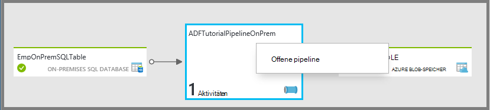  
2. Im folgenden Beispiel sehen Sie zwei Aktivitäten in der Pipeline mit Eingaben und Ausgaben. Die Aktivität mit der Bezeichnung **JoinData** vom Typ HDInsight Struktur Aktivität und **EgressDataAzure** vom Typ Kopieraktivität sind in diesem Beispiel. 
    
    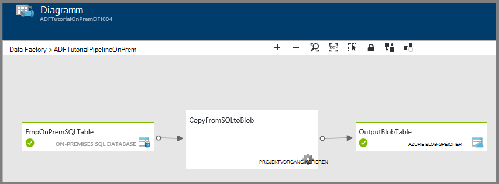 
3. Zurück zur Startseite "Data Factory" Navigieren durch Daten Factory Link im Pfad in der oberen linken Ecke.

    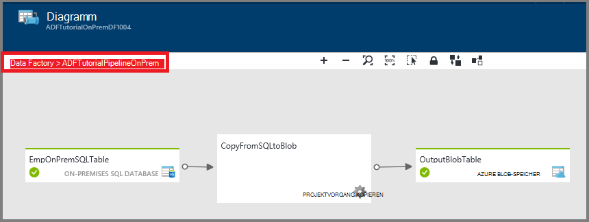

### Ansichtszustand jeder Aktivität innerhalb einer pipeline
Sie können den aktuellen Status einer Aktivität anzeigen, durch Anzeigen des Status eines Datasets von der Aktivität erzeugt. 

Beispiel: im folgenden Beispiel **BlobPartitionHiveActivity** erfolgreich ausgeführt wurde, und erzeugt ein Dataset namens **PartitionedProductsUsageTable**, die **bereit** ist.

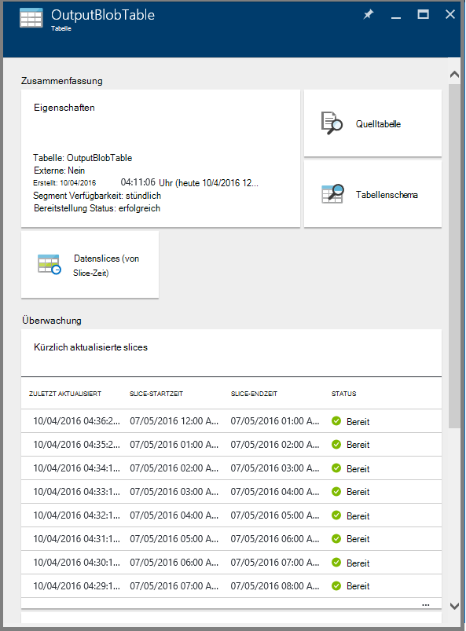

Durch Doppelklicken auf die **PartitionedProductsUsageTable** in der Diagrammansicht zeigt die verschiedenen führt innerhalb einer Rohrleitung erzeugt Segmente. Sie können sehen, dass **BlobPartitionHiveActivity** jeden Monat erfolgreich ausgeführt wurde für die letzten acht Monate und erzeugt Segmente **bereit** .

Dataset Segmente Data Factory können einen der folgenden Status haben:

<table>
<tr>
    <th align="left">Zustand</th><th align="left">Unterzustand</th><th align="left">Beschreibung</th>
</tr>
<tr>
    <td rowspan="8">Warten</td><td>ScheduleTime</td><td>Die Zeit kommt nicht für die Schicht ausführen.</td>
</tr>
<tr>
<td>DatasetDependencies</td><td>Vorgelagerten Dependencies sind nicht bereit.</td>
</tr>
<tr>
<td>ComputeResources</td><td>Die Serverressourcen sind nicht verfügbar.</td>
</tr>
<tr>
<td>ConcurrencyLimit</td> <td>Alle Aktivitätsinstanzen sind andere Segmente ausgeführt.</td>
</tr>
<tr>
<td>ActivityResume</td><td>Aktivität wird angehalten und Segmente kann nicht ausgeführt werden, bis er fortgesetzt wird.</td>
</tr>
<tr>
<td>Wiederholen</td><td>Ausführung der Aktivitäten wird wiederholt.</td>
</tr>
<tr>
<td>Validierung</td><td>Überprüfung wurde noch nicht gestartet.</td>
</tr>
<tr>
<td>ValidationRetry</td><td>Warten auf Prüfung wiederholt werden.</td>
</tr>
<tr>
<tr
<td rowspan="2">In Bearbeitung</td><td>Überprüfen</td><td>Validierung in Bearbeitung.</td>
</tr>
<td></td>
<td>Das Segment wird verarbeitet.</td>
</tr>
<tr>
<td rowspan="4">Fehler</td><td>TimedOut</td><td>Ausführung hat länger gedauert als, Aktivität zulässig ist.</td>
</tr>
<tr>
<td>Abgebrochen</td><td>Durch den Benutzer abgebrochen.</td>
</tr>
<tr>
<td>Validierung</td><td>Fehler beim Überprüfen.</td>
</tr>
<tr>
<td></td><td>Fehler beim Generieren oder Überprüfen des Segments.</td>
</tr>
<td>Bereit</td><td></td><td>Das Segment ist für die Verwendung.</td>
</tr>
<tr>
<td>Übersprungen</td><td></td><td>Das Segment wird nicht verarbeitet.</td>
</tr>
<tr>
<td>Keine</td><td></td><td>Ein Segment, das mit einem anderen Status vorhanden, sondern wurde zurückgesetzt.</td>
</tr>
</table>

Durch Klicken auf ein Segment Eintrag **Zuletzt aktualisiert Slices** Blatt können Sie die Details eines Segments anzeigen.

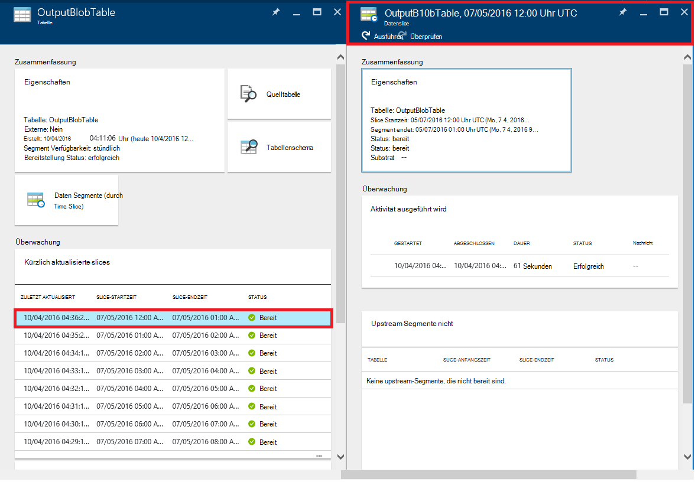
 
Das Segment mehrmals ausgeführt, sehen Sie mehrere Zeilen in der Liste **Aktivität ausgeführt wird** . Sie können Details zu einer Aktivität durch Klicken auf Ausführen Eintrag in der Liste **Aktivität führt** anzeigen. Die Liste zeigt alle Protokolldateien und ggf. eine Fehlermeldung. Diese Funktion eignet sich zu Debugprotokollen ohne Daten Werk verlassen.

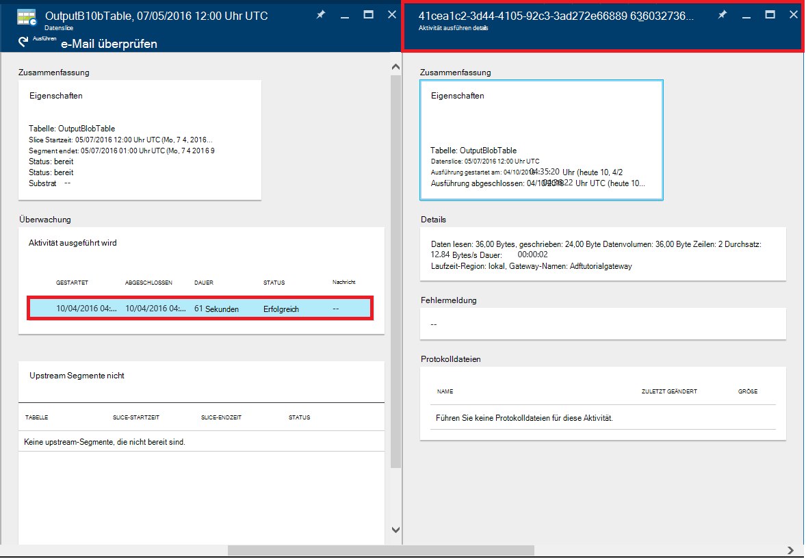

Wenn das Segment nicht im Zustand **bereit** ist, sehen Sie upstream Segmente, die noch nicht blockieren das aktuelle Segment ausführen aus **Upstream Segmente, die nicht bereit sind** . Diese Funktion ist nützlich, wenn Segment befindet sich im Status **Warten** und Sie möchten den vorgelagerten Dependencies auf denen Segment wartet.

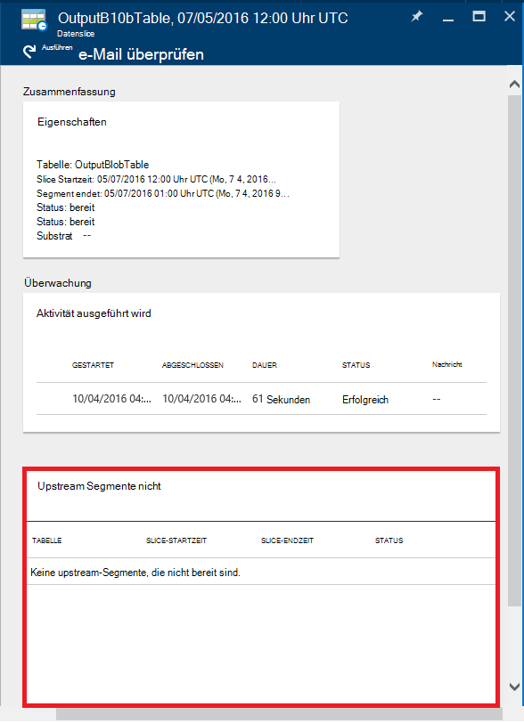

### DataSet-Zustandsdiagramm
Eine Factory Daten bereitstellen und die Rohrleitungen haben gültige active slices Dataset Übergang von einem Zustand in einen anderen. Slice-Status folgt derzeit im folgenden Zustandsdiagramm:

Dataset Zustand Übergang Fluss in Data Factory: Warten-In-/ im-Fortschritt (Überprüfung) > -> Ready-Fehler

Segmente starten für Voraussetzung erfüllt vor der Ausführung Status **Warten** . Dann die Aktivität ausgeführt wird und das Segment geht im Status **In Bearbeitung** . Die aktivitätsausführung möglicherweise gelingen oder fehlschlagen. Das Segment wird **als**markiert "oder **Fehler** basierend auf dem Ergebnis der Ausführung. 

Sie können Slice aus **bereit** oder **Fehler** **wartet** Zustand zurück zurücksetzen. Sie können auch Slice Zustand **Überspringen**, wodurch die Aktivität ausführen und das Segment nicht verarbeiten.

## Verwalten von pipelines
Sie können mithilfe von Azure PowerShell Pipelines verwalten. Sie können z. B. Anhalten und Fortsetzen von Rohrleitungen mit Azure PowerShell-Cmdlets. 

### Anhalten und Fortsetzen von pipelines
Sie können anhalten/Rohrleitungen **Suspend-AzureRmDataFactoryPipeline** -Powershell-Cmdlet unterbrechen. Dieses Cmdlet eignet sich Pipelines ausgeführt, bis das Problem behoben werden soll.

Beispiel: im folgenden Screenshot, wurde ein Problem mit der **PartitionProductsUsagePipeline** in **productrecgamalbox1dev** "Data Factory" erkannt und die Pipeline anhalten soll.

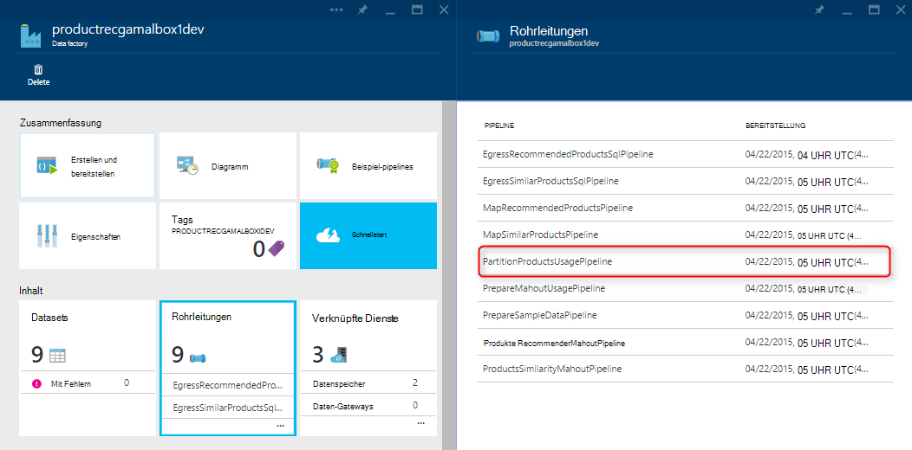

Um eine Rohrleitung zu unterbrechen, führen Sie den folgenden PowerShell-Befehl:

    Suspend-AzureRmDataFactoryPipeline [-ResourceGroupName] <String> [-DataFactoryName] <String> [-Name] <String>

Zum Beispiel:

    Suspend-AzureRmDataFactoryPipeline -ResourceGroupName ADF -DataFactoryName productrecgamalbox1dev -Name PartitionProductsUsagePipeline 

Nach Behebung des Problems mit der **PartitionProductsUsagePipeline**kann die angehaltene Pipeline mit dem folgenden PowerShell-Befehl zusammengefasst:

    Resume-AzureRmDataFactoryPipeline [-ResourceGroupName] <String> [-DataFactoryName] <String> [-Name] <String>

Zum Beispiel:

    Resume-AzureRmDataFactoryPipeline -ResourceGroupName ADF -DataFactoryName productrecgamalbox1dev -Name PartitionProductsUsagePipeline 

## Debuggen von pipelines
Azure Data Factory bietet umfangreiche Funktionen über Azure-Portal und Azure PowerShell Debuggen und Problembehandlung bei Rohrleitungen.

### Fehler in einer Pipeline finden
Aktivität ausführen in einer Pipeline ausfällt, ist von der Pipeline erstellte Dataset im Fehlerzustand wegen. Debuggen und Fehlerbehebung in Azure Data Factory mithilfe der folgenden Mechanismen.

#### Verwenden Sie Azure-Portal Fehler Debuggen:

3.  Blatt **Tabelle** klicken Sie auf das Problem mit **STATUS** auf **fehlgeschlagen**.

    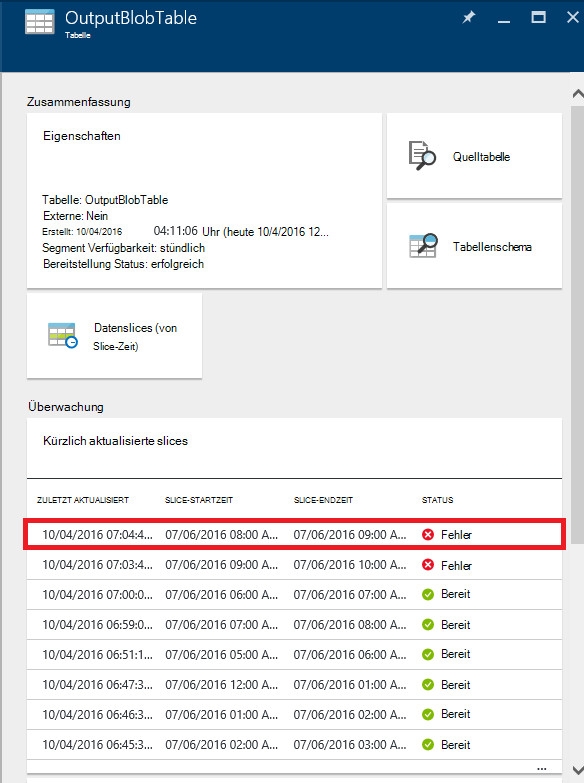
4.  Blatt **DATENSLICE** klicken Sie auf die Aktivität auszuführen, ist fehlgeschlagen.
    
    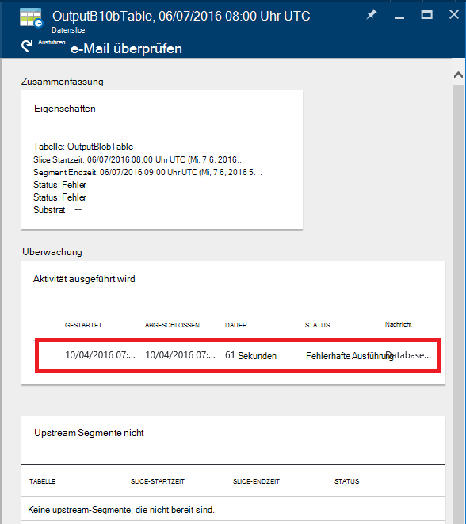
5.  Blatt **AKTIVITÄTSDETAILS ausführen** können Sie die Verarbeitung HDInsight zugeordneten Dateien herunterladen. Klicken Sie auf Download Status/Stderr Fehlerprotokolldatei herunterladen, die Details über den Fehler enthält.

    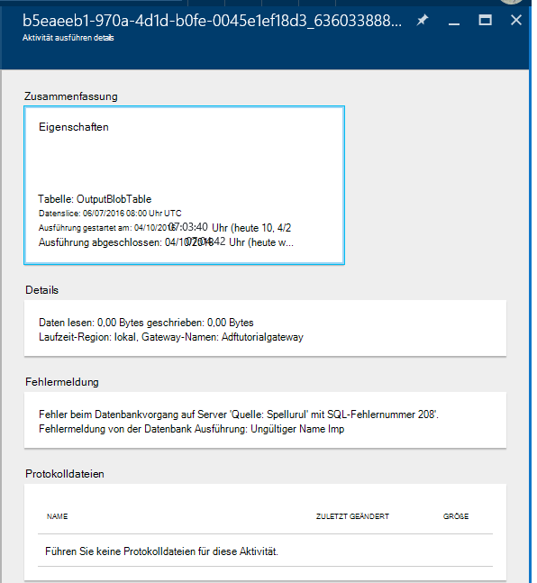  

#### Verwenden Sie die PowerShell Fehler Debuggen
1.  Starten Sie **Azure PowerShell**.
3.  **Get-AzureRmDataFactorySlice** Befehl Segmente und deren Status anzeigen. Sieht ein Slice mit dem Status: **fehlgeschlagen**.       

            Get-AzureRmDataFactorySlice [-ResourceGroupName] <String> [-DataFactoryName] <String> [-TableName] <String> [-StartDateTime] <DateTime> [[-EndDateTime] <DateTime> ] [-Profile <AzureProfile> ] [ <CommonParameters>]
    
    Zum Beispiel:
        
            Get-AzureRmDataFactorySlice -ResourceGroupName ADF -DataFactoryName LogProcessingFactory -TableName EnrichedGameEventsTable -StartDateTime 2014-05-04 20:00:00

    Ersetzen Sie **StartDateTime** durch für Set-AzureRmDataFactoryPipelineActivePeriod angegebene StartDateTime-Wert.
4. Führen Sie nun das Cmdlet **Get-AzureRmDataFactoryRun** zu Details Aktivität für das Segment ausgeführt.

        Get-AzureRmDataFactoryRun [-ResourceGroupName] <String> [-DataFactoryName] <String> [-TableName] <String> [-StartDateTime] 
        <DateTime> [-Profile <AzureProfile> ] [ <CommonParameters>]
    
    Zum Beispiel:

        Get-AzureRmDataFactoryRun -ResourceGroupName ADF -DataFactoryName LogProcessingFactory -TableName EnrichedGameEventsTable -StartDateTime "5/5/2014 12:00:00 AM"

    Der Wert des StartDateTime wird die Startzeit für das Fehler-Problem Segment aus dem vorherigen Schritt notierte. Datum und Uhrzeit muss in Anführungszeichen eingeschlossen werden.
5.  Mit Informationen zum Fehler (ähnlich der folgenden) sollte angezeigt werden:

            Id                      : 841b77c9-d56c-48d1-99a3-8c16c3e77d39
            ResourceGroupName       : ADF
            DataFactoryName         : LogProcessingFactory3
            TableName               : EnrichedGameEventsTable
            ProcessingStartTime     : 10/10/2014 3:04:52 AM
            ProcessingEndTime       : 10/10/2014 3:06:49 AM
            PercentComplete         : 0
            DataSliceStart          : 5/5/2014 12:00:00 AM
            DataSliceEnd            : 5/6/2014 12:00:00 AM
            Status                  : FailedExecution
            Timestamp               : 10/10/2014 3:04:52 AM
            RetryAttempt            : 0
            Properties              : {}
            ErrorMessage            : Pig script failed with exit code '5'. See wasb://     adfjobs@spestore.blob.core.windows.net/PigQuery
                                            Jobs/841b77c9-d56c-48d1-99a3-
                        8c16c3e77d39/10_10_2014_03_04_53_277/Status/stderr' for
                        more details.
            ActivityName            : PigEnrichLogs
            PipelineName            : EnrichGameLogsPipeline
            Type                    :
    
    
6.  Aus der Ausgabe anzeigen und downloaden **-DownloadLogsoption** für das Cmdlet mit Protokolldateien können Sie ID-Wert **Speichern-AzureRmDataFactoryLog** -Cmdlet ausführen.

            Save-AzureRmDataFactoryLog -ResourceGroupName "ADF" -DataFactoryName "LogProcessingFactory" -Id "841b77c9-d56c-48d1-99a3-8c16c3e77d39" -DownloadLogs -Output "C:\Test"

## Fehler in einer Pipeline erneut

### Mithilfe von Azure-portal

Problembehandlung und Debuggen von Fehlern in einer Pipeline können Sie Fehler Fehler Slice navigieren und der Schaltfläche **Ausführen** auf der Befehlsleiste erneut ausführen.

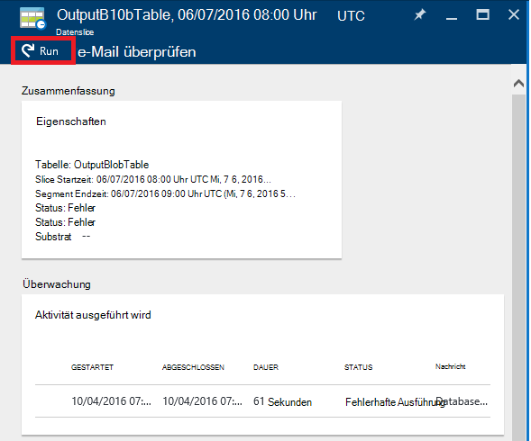

Für den Fall, dass das Segment Überprüfung aufgrund einer Richtlinie fehlgeschlagen (für ex: Daten nicht verfügbar), den Fehler beheben und erneut auf die Schaltfläche **Überprüfen** der Befehlsleiste überprüfen.
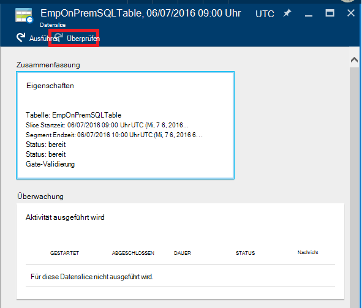

### Mithilfe von Azure PowerShell

Sie können Fehler mithilfe des Set-AzureRmDataFactorySliceStatus-Cmdlets erneut. [Set AzureRmDataFactorySliceStatus](https://msdn.microsoft.com/library/mt603522.aspx) Thema Syntax und Details über das Cmdlet anzeigen 

**Beispiel:** Im folgenden Beispiel wird der Status aller Segmente für die Tabelle 'DAWikiAggregatedData' 'Warten' in Azure Data Factory 'WikiADF'.

Die UpdateType wird auf UpstreamInPipeline, festgelegt, dass jedes Segment für die Tabelle und alle abhängigen (upstream) Tabellen Status auf "Warten". Andere mögliche Wert für diesen Parameter ist "Person".

    Set-AzureRmDataFactorySliceStatus -ResourceGroupName ADF -DataFactoryName WikiADF -TableName DAWikiAggregatedData -Status Waiting -UpdateType UpstreamInPipeline -StartDateTime 2014-05-21T16:00:00 -EndDateTime 2014-05-21T20:00:00

## Warnregeln erstellen
Azure-Protokolle Benutzerereignisse, wenn eine Azure-Ressource (z. B. eine Daten-Factory) erstellt, aktualisiert oder gelöscht. Sie können Alarme für diese Ereignisse erstellen. Data Factory können Sie verschiedene Metriken und Alarme Kennzahlen erstellen. Wir empfehlen, Ereignisse in Echtzeit überwachen und Metriken für Dokumentationszwecke verwendet. 

### Alarme für Ereignisse
Azure Ereignisse bieten nützliche Einblicke in Azure Ressourcen geschehen. Azure-Protokolle Benutzerereignisse, wenn eine Azure-Ressource (z. B. eine Daten-Factory) erstellt, aktualisiert oder gelöscht. Ereignisse werden generiert, wenn Azure Data Factory verwenden, wenn:

- Azure Data Factory wird erstellt bzw. aktualisiert/gelöscht.
- Datenverarbeitung (führt genannt) gestartet/abgeschlossen.
- Ein HDInsight-Cluster auf Anforderung erstellt und entfernt.

Sie können Alarme auf diese Benutzerereignisse erstellen und konfigurieren sie e-Mail-Benachrichtigungen an den Administrator und Co-Administratoren des Abonnements. Darüber hinaus können Sie zusätzliche e-Mail-Adressen von Benutzern, die e-Mail-Benachrichtigung erhalten, wenn die Bedingung zutrifft. Diese Funktion ist nützlich, wenn Fehler benachrichtigt werden möchten und kontinuierlich Daten Werk wollen.

> [AZURE.NOTE] Derzeit ist das Portal nicht auf Ereignisse angezeigt. Verwenden Sie [Überwachung und Anwendung](data-factory-monitor-manage-app.md) alle Warnungen anzeigen.

#### Eine Alarmdefinition angeben:
Um eine Warnung festlegen, erstellen Sie eine JSON-Datei beschreibt die Vorgänge, denen Sie auf gewarnt werden möchten. Im folgenden Beispiel sendet die Warnung eine Benachrichtigung für den RunFinished-Vorgang. Um eine e-Mail-Benachrichtigung gesendet werden, beim Ausführen im Werk Daten abgeschlossen und ausführen fehlgeschlagen ist (Status = FailedExecution).

    {
        "contentVersion": "1.0.0.0",
         "$schema": "http://schema.management.azure.com/schemas/2014-04-01-preview/deploymentTemplate.json#",
        "parameters": {},
        "resources": 
        [
            {
                "name": "ADFAlertsSlice",
                "type": "microsoft.insights/alertrules",
                "apiVersion": "2014-04-01",
                "location": "East US",
                "properties": 
                {
                    "name": "ADFAlertsSlice",
                    "description": "One or more of the data slices for the Azure Data Factory has failed processing.",
                    "isEnabled": true,
                    "condition": 
                    {
                        "odata.type": "Microsoft.Azure.Management.Insights.Models.ManagementEventRuleCondition",
                        "dataSource": 
                        {
                            "odata.type": "Microsoft.Azure.Management.Insights.Models.RuleManagementEventDataSource",
                            "operationName": "RunFinished",
                            "status": "Failed",
                            "subStatus": "FailedExecution"   
                        }
                    },
                    "action": 
                    {
                        "odata.type": "Microsoft.Azure.Management.Insights.Models.RuleEmailAction",
                        "customEmails": [ "<your alias>@contoso.com" ]
                    }
                }
            }
        ]
    }

JSON-Definition kann **SubStatus** entfernt werden bei einem bestimmten Fehler benachrichtigt werden möchten.

In diesem Beispiel wird die Warnung für alle Daten Fabriken in Ihrem Abonnement. Die Warnung für einen bestimmten Factory werden gegebenenfalls können Sie in der **Datenquelle**Daten Factory **ResourceUri** angeben:

    "resourceUri" : "/SUBSCRIPTIONS/<subscriptionId>/RESOURCEGROUPS/<resourceGroupName>/PROVIDERS/MICROSOFT.DATAFACTORY/DATAFACTORIES/<dataFactoryName>"

Die folgende Tabelle enthält eine Liste der verfügbaren Status (und der untergeordnete Status).

Name des Vorgangs | Status | Sub-status
-------------- | ------ | ----------
RunStarted | Gestartet | Starten
RunFinished | Fehler / erfolgreich | FailedResourceAllocation  Erfolgreich  FailedExecution  TimedOut  < abgebrochen  FailedValidation  Abgebrochen
OnDemandClusterCreateStarted | Gestartet
OnDemandClusterCreateSuccessful | Erfolgreich
OnDemandClusterDeleted | Erfolgreich

Informationen zum JSON Elemente im Beispiel finden Sie in der [Warnregel erstellen](https://msdn.microsoft.com/library/azure/dn510366.aspx) . 

#### Bereitstellen der Warnung 
Verwenden Sie zum Bereitstellen der Warnung Azure PowerShell-Cmdlet: **Neue AzureRmResourceGroupDeployment**, wie im folgenden Beispiel gezeigt:

    New-AzureRmResourceGroupDeployment -ResourceGroupName adf -TemplateFile .\ADFAlertFailedSlice.json  

Nach die Bereitstellung einer Ressource erfolgreich abgeschlossen wurde, sehen Sie die folgenden Nachrichten:

    VERBOSE: 7:00:48 PM - Template is valid.
    WARNING: 7:00:48 PM - The StorageAccountName parameter is no longer used and will be removed in a future release.
    Please update scripts to remove this parameter.
    VERBOSE: 7:00:49 PM - Create template deployment 'ADFAlertFailedSlice'.
    VERBOSE: 7:00:57 PM - Resource microsoft.insights/alertrules 'ADFAlertsSlice' provisioning status is succeeded
    
    DeploymentName    : ADFAlertFailedSlice
    ResourceGroupName : adf
    ProvisioningState : Succeeded
    Timestamp         : 10/11/2014 2:01:00 AM
    Mode              : Incremental
    TemplateLink      :
    Parameters        :
    Outputs           :

> [AZURE.NOTE] Die [Warnregel erstellen](https://msdn.microsoft.com/library/azure/dn510366.aspx) REST-API können Sie eine Warnregel erstellen. JSON-Beispiel ähnelt die JSON-Nutzlast.  

#### Abrufen der Liste der Azure Ressource Gruppe Bereitstellung
Verwenden Sie zum Abrufen der Liste der bereitgestellten Ressourcengruppe Azure-Bereitstellung das Cmdlet: **Get-AzureRmResourceGroupDeployment**, wie im folgenden Beispiel gezeigt:

    Get-AzureRmResourceGroupDeployment -ResourceGroupName adf
    
    DeploymentName    : ADFAlertFailedSlice
    ResourceGroupName : adf
    ProvisioningState : Succeeded
    Timestamp         : 10/11/2014 2:01:00 AM
    Mode              : Incremental
    TemplateLink      :
    Parameters        :
    Outputs           :

#### Problembehandlung bei Benutzer-Ereignisse

1. Nachdem Sie auf die Kachel **Metriken und Operationen** generierten Ereignisse sehen.

    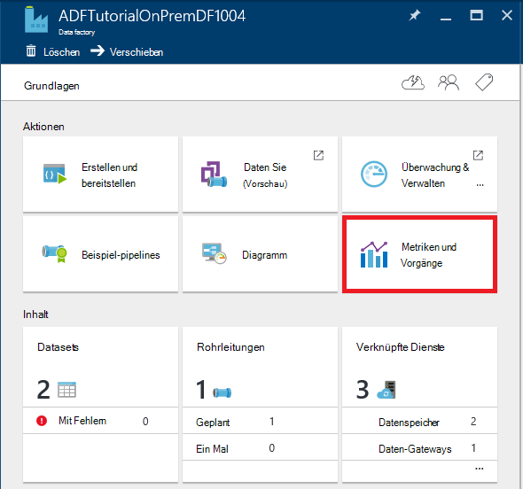

2. Klicken Sie auf **Ereignisse** nebeneinander, um die Ereignisse anzuzeigen. 

    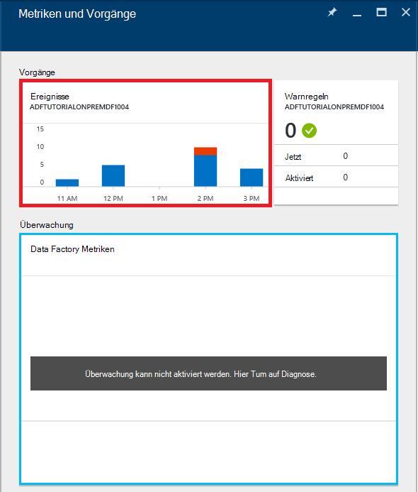
3. Blatt **Ereignisse** können Sie detaillierte Informationen zu Ereignissen, usw. Ereignisse filtern. 

    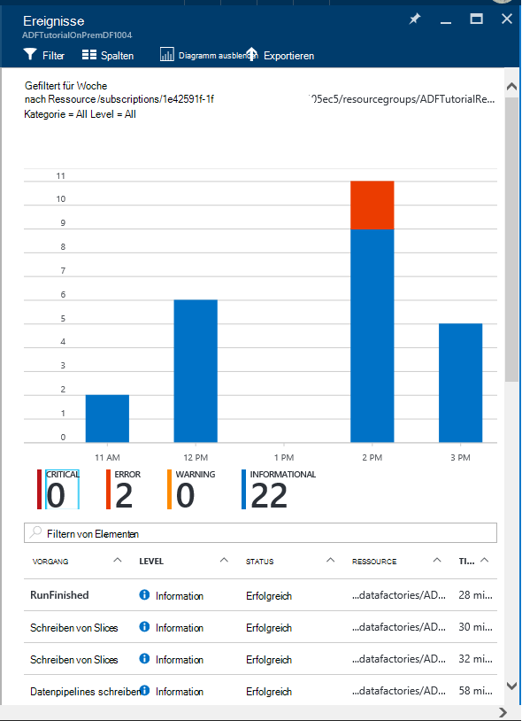
4. Klicken Sie auf einen **Vorgang** in die Liste der Vorgänge, die einen Fehler verursacht.
    
    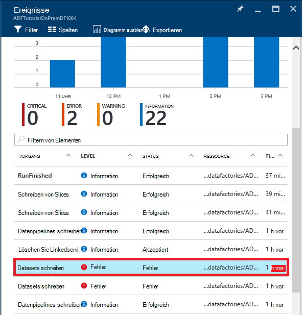 
5. Klicken Sie auf **ein Fehlerereignis für Informationen über den Fehler** .

    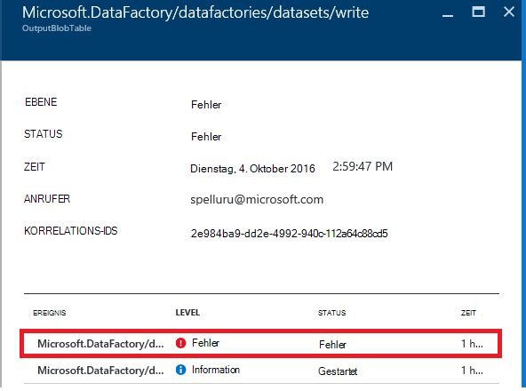
  

Siehe [Azure Insight Cmdlets](https://msdn.microsoft.com/library/mt282452.aspx) Artikel PowerShell-Cmdlets, mit denen Sie auf Get/Software Alerts. Hier sind einige Beispiele mit dem Cmdlet **Get-AlertRule** : 

    PS C:\> get-alertrule -res $resourceGroup -n ADFAlertsSlice -det
        
            Properties :
            Action      : Microsoft.Azure.Management.Insights.Models.RuleEmailAction
            Condition   :
            DataSource :
            EventName             :
            Category              :
            Level                 :
            OperationName         : RunFinished
            ResourceGroupName     :
            ResourceProviderName  :
            ResourceId            :
            Status                : Failed
            SubStatus             : FailedExecution
            Claims                : Microsoft.Azure.Management.Insights.Models.RuleManagementEventClaimsDataSource
            Condition   :
            Description : One or more of the data slices for the Azure Data Factory has failed processing.
            Status      : Enabled
            Name:       : ADFAlertsSlice
            Tags       :
            $type          : Microsoft.WindowsAzure.Management.Common.Storage.CasePreservedDictionary, Microsoft.WindowsAzure.Management.Common.Storage
            Id: /subscriptions/<subscription ID>/resourceGroups/<resource group name>/providers/microsoft.insights/alertrules/ADFAlertsSlice
            Location   : West US
            Name       : ADFAlertsSlice
    
    PS C:\> Get-AlertRule -res $resourceGroup

            Properties : Microsoft.Azure.Management.Insights.Models.Rule
            Tags       : {[$type, Microsoft.WindowsAzure.Management.Common.Storage.CasePreservedDictionary, Microsoft.WindowsAzure.Management.Common.Storage]}
            Id         : /subscriptions/<subscription id>/resourceGroups/<resource group name>/providers/microsoft.insights/alertrules/FailedExecutionRunsWest0
            Location   : West US
            Name       : FailedExecutionRunsWest0
    
            Properties : Microsoft.Azure.Management.Insights.Models.Rule
            Tags       : {[$type, Microsoft.WindowsAzure.Management.Common.Storage.CasePreservedDictionary, Microsoft.WindowsAzure.Management.Common.Storage]}
            Id         : /subscriptions/<subscription id>/resourceGroups/<resource group name>/providers/microsoft.insights/alertrules/FailedExecutionRunsWest3
            Location   : West US
            Name       : FailedExecutionRunsWest3

    PS C:\> Get-AlertRule -res $resourceGroup -Name FailedExecutionRunsWest0
    
            Properties : Microsoft.Azure.Management.Insights.Models.Rule
            Tags       : {[$type, Microsoft.WindowsAzure.Management.Common.Storage.CasePreservedDictionary, Microsoft.WindowsAzure.Management.Common.Storage]}
            Id         : /subscriptions/<subscription id>/resourceGroups/<resource group name>/providers/microsoft.insights/alertrules/FailedExecutionRunsWest0
            Location   : West US
            Name       : FailedExecutionRunsWest0

Führen Sie die folgenden get-Help Get-Befehle Details und Beispiele für das Cmdlet "Get-AlertRule". 

    get-help Get-AlertRule -detailed 
    get-help Get-AlertRule -examples

- Wenn Alarm generiert Ereignisse auf das Portal jedoch keine e-Mail-Benachrichtigung erhalten, überprüfen Sie, ob die angegebene e-Mail-Adresse e-Mails von externen Absendern empfangen soll. Die Detailinformationen können durch Einstellungen E-mail gesperrt.

### Alerts Kennzahlen
Data Factory können Sie verschiedene Metriken und Alarme Kennzahlen erstellen. Sie können überwachen und Alarme für die folgenden Metriken für Segmente im Werk Daten.
 
- Fehlgeschlagene ausgeführt wird
- Erfolgreich ausgeführt

Diese Metriken sind und erhalten Sie einen Überblick über allgemeine fehlerhaft und erfolgreich ausgeführt in der Fabrik Daten. Metriken werden jedes Mal ein Slice gibt ausgegeben. Auf die Stunde werden diese Metriken zusammengefasst und an das Speicherkonto. Daher zum Aktivieren von Metriken richten Sie ein Speicherkonto ein.

#### Aktivieren von Metriken:
Metriken klicken Sie auf Blatt Data Factory Folgendes:

**Überwachung** -> **Metrik** -> **diagnoseeinstellungen** -> **Diagnose**

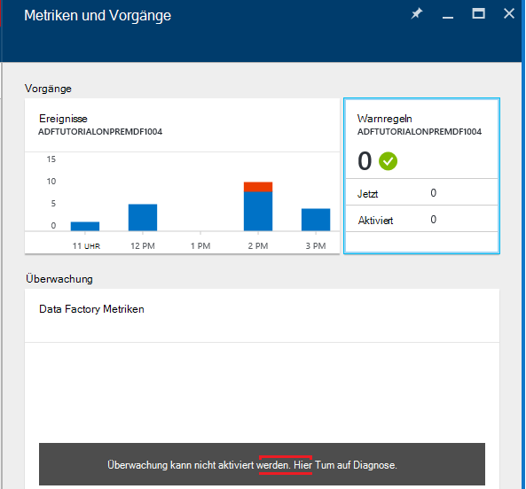

Klicken Sie **auf** **Diagnose** -Blade wählen Sie das Speicherkonto und speichern.

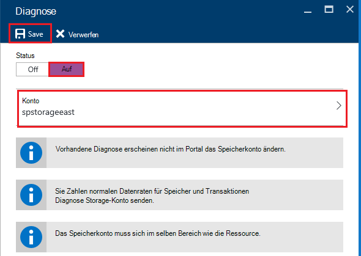

Nach dem Speichern, dauert es bis zu einer Stunde für Metriken auf Überwachung Blade, da Metriken Aggregation stündlich erfolgt.

### Einrichten von Warnung Kennzahlen:

Klicken Sie auf **Data Factory Metriken** Blade: 

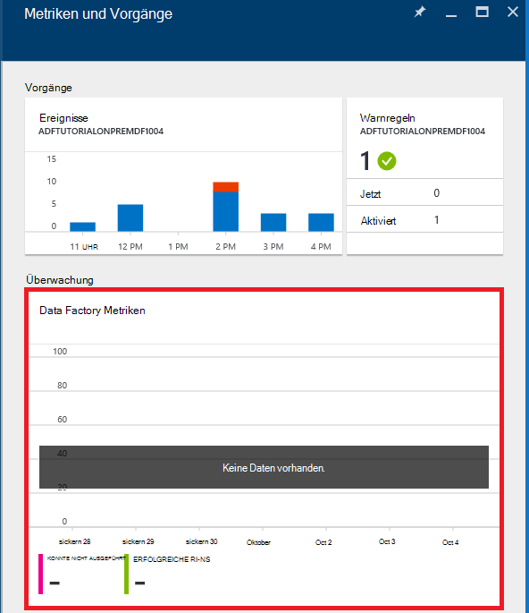

Klicken Sie auf Blatt **Metrik** **+ Benachrichtigung hinzufügen** auf der Symbolleiste. 
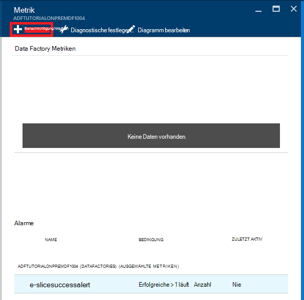

Gehen Sie auf der Seite **eine Warnungsregel hinzufügen** folgendermaßen vor, und klicken Sie auf **OK**.
 
- Geben Sie einen Namen für die Warnung (Beispiel: Fehler bei Warnung).
- Geben Sie eine Beschreibung für die Benachrichtigung (Beispiel: e-Mail senden, wenn ein Fehler auftritt).
- Wählen Sie eine Metrik (Vergleich erfolgreich ausgeführt fehlgeschlagene wird ausgeführt).
- Geben Sie eine Bedingung und einen Schwellenwert.   
- Geben Sie die Periode ein. 
- Geben Sie an, ob eine e-Mail an Besitzer, Mitwirkende und Leser gesendet werden soll.
- und vieles mehr. 

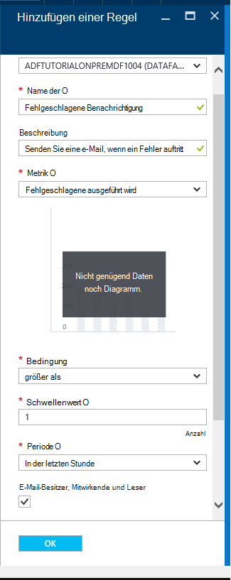

Sobald die Regel erfolgreich hinzugefügt wurde, schließt das Blade und die neue Warnung auf **Metrik** angezeigt. 

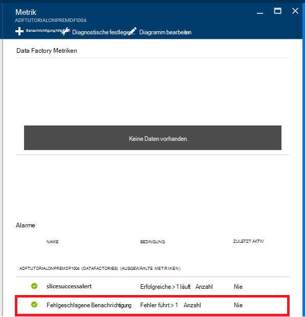

Die Anzahl von Warnungen sollte auch auf der Kachel **Warnungen** angezeigt werden. Klicken Sie auf **Warnung** nebeneinander.

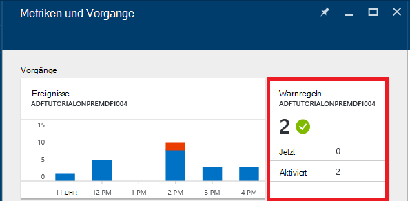

Blatt **Alerts** bestehende Alerts angezeigt. Um eine Warnung hinzuzufügen, klicken Sie auf der Symbolleiste auf **Benachrichtigung hinzufügen** .

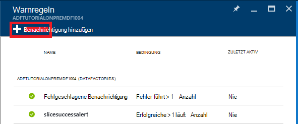

### Benachrichtigung:
Wenn die Regel die Bedingung übereinstimmt, erhalten Sie per e-Mail aktivierbare. Sobald das Problem behoben ist und die Warnung nicht mehr übereinstimmen, erhalten Sie per e-Mail gelöst.

Dieses Verhalten unterscheidet sich Ereignisse, in denen eine Benachrichtigung bei jedem Fehler gesendet die Warnungsregel gilt.

### Verwendung von PowerShell bereitstellen
Alarme für Metriken können auf die gleiche Weise bereitgestellt werden, wie Ereignisse. 

**Warnungsdefinition:**

    {
        "contentVersion" : "1.0.0.0",
        "$schema" : "http://schema.management.azure.com/schemas/2014-04-01-preview/deploymentTemplate.json#",
        "parameters" : {},
        "resources" : [
        {
                "name" : "FailedRunsGreaterThan5",
                "type" : "microsoft.insights/alertrules",
                "apiVersion" : "2014-04-01",
                "location" : "East US",
                "properties" : {
                    "name" : "FailedRunsGreaterThan5",
                    "description" : "Failed Runs greater than 5",
                    "isEnabled" : true,
                    "condition" : {
                        "$type" : "Microsoft.WindowsAzure.Management.Monitoring.Alerts.Models.ThresholdRuleCondition, Microsoft.WindowsAzure.Management.Mon.Client",
                        "odata.type" : "Microsoft.Azure.Management.Insights.Models.ThresholdRuleCondition",
                        "dataSource" : {
                            "$type" : "Microsoft.WindowsAzure.Management.Monitoring.Alerts.Models.RuleMetricDataSource, Microsoft.WindowsAzure.Management.Mon.Client",
                            "odata.type" : "Microsoft.Azure.Management.Insights.Models.RuleMetricDataSource",
                            "resourceUri" : "/SUBSCRIPTIONS/<subscriptionId>/RESOURCEGROUPS/<resourceGroupName
    >/PROVIDERS/MICROSOFT.DATAFACTORY/DATAFACTORIES/<dataFactoryName>",
                            "metricName" : "FailedRuns"
                        },
                        "threshold" : 5.0,
                        "windowSize" : "PT3H",
                        "timeAggregation" : "Total"
                    },
                    "action" : {
                        "$type" : "Microsoft.WindowsAzure.Management.Monitoring.Alerts.Models.RuleEmailAction, Microsoft.WindowsAzure.Management.Mon.Client",
                        "odata.type" : "Microsoft.Azure.Management.Insights.Models.RuleEmailAction",
                        "customEmails" : ["abhinav.gpt@live.com"]
                    }
                }
            }
        ]
    }
 
Ersetzen Sie SubscriptionId, ResourceGroupName und DataFactoryName im Beispiel durch entsprechende Werte.

*MetricName* jetzt unterstützt zwei Werte:
- FailedRuns
- SuccessfulRuns

**Bereitstellen der Warnung:**

Verwenden Sie zum Bereitstellen der Warnung Azure PowerShell-Cmdlet: **Neue AzureRmResourceGroupDeployment**, wie im folgenden Beispiel gezeigt:

    New-AzureRmResourceGroupDeployment -ResourceGroupName adf -TemplateFile .\FailedRunsGreaterThan5.json

Folgende Nachricht nach einer erfolgreichen Bereitstellung sollten angezeigt werden:

    VERBOSE: 12:52:47 PM - Template is valid.
    VERBOSE: 12:52:48 PM - Create template deployment 'FailedRunsGreaterThan5'.
    VERBOSE: 12:52:55 PM - Resource microsoft.insights/alertrules 'FailedRunsGreaterThan5' provisioning status is succeeded
    
    
    DeploymentName    : FailedRunsGreaterThan5
    ResourceGroupName : adf
    ProvisioningState : Succeeded
    Timestamp         : 7/27/2015 7:52:56 PM
    Mode              : Incremental
    TemplateLink      :
    Parameters        :
    Outputs           

**Add-AlertRule** -Cmdlet können Sie eine Warnregel bereitstellen. Finden Sie [Add-AlertRule](https://msdn.microsoft.com/library/mt282468.aspx) ausführliche Informationen und Beispiele.  

## Verschieben Sie "Data Factory" in einer anderen Ressourcengruppe oder Abonnement
Mit **Verschieben** Befehlsleistenschaltfläche auf der Homepage Ihrer Data Factory können Sie eine Factory Daten für eine andere Ressource oder ein anderes Abonnement verschieben. 

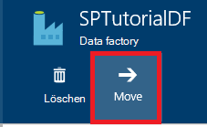

Sie können auch verwandten Ressourcen (z. B. Warnungen mit den Daten verknüpft) mit Data Factory verschieben.

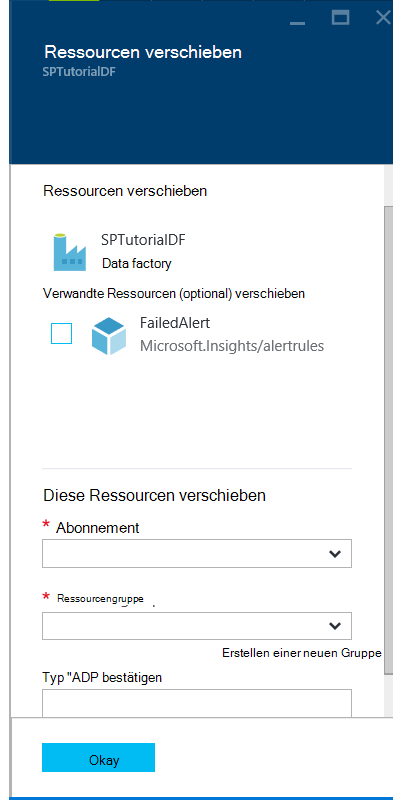
