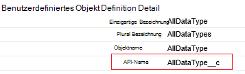
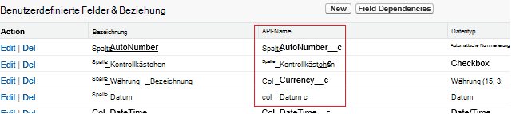

<properties
    pageTitle="Verschieben von Daten aus "Salesforce.com" mit "Data Factory" | Microsoft Azure"
    description="Enthält Informationen zum Verschieben von Daten aus "Salesforce.com" mithilfe von Azure Data Factory."
    services="data-factory"
    documentationCenter=""
    authors="linda33wj"
    manager="jhubbard"
    editor="monicar"/>

<tags
    ms.service="data-factory"
    ms.workload="data-services"
    ms.tgt_pltfrm="na"
    ms.devlang="na"
    ms.topic="article"
    ms.date="10/25/2016"
    ms.author="jingwang"/>

# Verschieben von Daten aus "Salesforce.com" mithilfe von Azure Data Factory
Dieser Artikel beschreibt die Verwendung Kopieraktivität in einer Azure Data Daten aus Salesforce in beliebige Datenspeicher kopiert, der Spalte Empfänger der [unterstützten Datenquellen und Datensenken](data-factory-data-movement-activities.md#supported-data-stores) Tabelle aufgeführt ist. Dieser Artikel baut auf [Datenaktivitäten](data-factory-data-movement-activities.md) Artikel stellt eine allgemeine Übersicht über Daten kopieren und unterstützten Speicher-Kombinationen.

Azure Data Factory unterstützt derzeit nur Daten aus Salesforce [unterstützten Senke Daten stores]((data-factory-data-movement-activities.md#supported-data-stores), aber kein Verschieben von Daten von anderen Daten Support Salesforce gespeichert wird.

## Erforderliche Komponenten
- Verwenden Sie eine der folgenden Editionen von Salesforce: Developer Edition, Professional Edition, Enterprise Edition oder unbegrenzte Edition.
- API-Berechtigung muss aktiviert sein. Siehe [wie aktivieren Sie API-Zugriff in Salesforce Berechtigungssatz?](https://www.data2crm.com/migration/faqs/enable-api-access-salesforce-permission-set/)
- Um Daten aus Salesforce in lokalen Datenspeichern zu kopieren, müssen Sie mindestens Data Management Gateway 2.0 in Ihrer lokalen Umgebung installiert.

## Salesforce Anforderung Grenzwerte
Salesforce hat für Anfragen insgesamt API und gleichzeitige API-Anfragen. Siehe Abschnitt "API anfordern Grenzen" [Salesforce Entwickler Grenzen](http://resources.docs.salesforce.com/200/20/en-us/sfdc/pdf/salesforce_app_limits_cheatsheet.pdf) Artikel Weitere Informationen. Beachten Sie überschreitet die Anzahl der gleichzeitigen Anfragen der, Drosselung auftritt und zufällige Ausfälle sehen. überschreitet die Gesamtzahl der Anfragen die, wird Salesforce-Konto für 24 Stunden gesperrt; Sie können auch die "REQUEST_LIMIT_EXCEEDED" in beiden Szenarien Fehlermeldung.

## Assistent zum Kopieren von Daten
Am einfachsten eine Pipeline erstellen, die Daten aus Salesforce aller unterstützten Senke Datenspeicher kopiert ist der Daten-Assistenten. Siehe [Tutorial: eine Rohrleitung mit Assistenten zum Kopieren von](data-factory-copy-data-wizard-tutorial.md) eine kurze exemplarische Vorgehensweise zum Erstellen einer Pipeline mithilfe des Assistenten zum Kopieren von Daten.

Im folgende Beispiel enthält Beispiel JSON Definitionen, mit denen Sie eine Rohrleitung mit [Azure-Portal](data-factory-copy-activity-tutorial-using-azure-portal.md), [Visual Studio](data-factory-copy-activity-tutorial-using-visual-studio.md)oder [Azure PowerShell](data-factory-copy-activity-tutorial-using-powershell.md)erstellen. Sie zeigen, wie Daten aus Salesforce in Azure BLOB-Speicher kopieren. Allerdings können Daten auf der Ereignissenken angegebenen [hier](data-factory-data-movement-activities.md#supported-data-stores) mithilfe der Kopieraktivität in Azure Data Factory kopiert werden.   

## Beispiel: Daten aus Salesforce in Azure blob
In diesem Beispiel kopiert Daten aus Salesforce in eine Azure Blob stündlich. Nach den Beispielen sind die JSON-Eigenschaften, die in den Beispielen verwendeten in Abschnitten beschrieben. Sie können Daten direkt in die senken die [Datenaktivitäten](data-factory-data-movement-activities.md#supported-data-stores) Artikel aufgelisteten mit Kopieraktivität in Azure Data Factory.

Hier werden die Data Factory Artefakte, die Sie erstellen, um das Szenario implementieren müssen. Die Liste folgenden Abschnitten Details zu diesen Schritten.

- Eine verknüpfte Dienst des Typs [Salesforce](#salesforce-linked-service-properties)
- Eine verknüpfte Dienst vom Typ [AzureStorage](data-factory-azure-blob-connector.md#azure-storage-linked-service-properties)
- Ein Eingabe- [Dataset](data-factory-create-datasets.md) vom Typ [RelationalTable](#salesforce-dataset-properties)
- Ein Ausgabe- [Dataset](data-factory-create-datasets.md) vom Typ [AzureBlob](data-factory-azure-blob-connector.md#azure-blob-dataset-type-properties)
- Eine [Pipeline](data-factory-create-pipelines.md) mit kopieren, die [RelationalSource](#relationalsource-type-properties) und [BlobSink](data-factory-azure-blob-connector.md#azure-blob-copy-activity-type-properties) verwendet

**Salesforce verknüpft service**

In diesem Beispiel verwendet der Dienst **Salesforce** verknüpft. Siehe Abschnitt [Salesforce verknüpft Service](#salesforce-linked-service-properties) für die Eigenschaften, die von diesem Dienst verknüpften unterstützt werden.  Anleitung zum Zurücksetzen/das Sicherheitstoken Get finden Sie unter [Security Token abrufen](https://help.salesforce.com/apex/HTViewHelpDoc?id=user_security_token.htm) .

    {
        "name": "SalesforceLinkedService",
        "properties":
        {
            "type": "Salesforce",
            "typeProperties":
            {
                "username": "<user name>",
                "password": "<password>",
                "securityToken": "<security token>"
            }
        }
    }

**Azure verknüpft Speicherdienst**

    {
      "name": "AzureStorageLinkedService",
      "properties": {
        "type": "AzureStorage",
        "typeProperties": {
          "connectionString": "DefaultEndpointsProtocol=https;AccountName=<accountname>;AccountKey=<accountkey>"
        }
      }
    }

**Salesforce Eingabedatasets**

    {
        "name": "SalesforceInput",
        "properties": {
            "linkedServiceName": "SalesforceLinkedService",
            "type": "RelationalTable",
            "typeProperties": {
                "tableName": "AllDataType__c"  
            },
            "availability": {
                "frequency": "Hour",
                "interval": 1
            },
            "external": true,
            "policy": {
                "externalData": {
                    "retryInterval": "00:01:00",
                    "retryTimeout": "00:10:00",
                    "maximumRetry": 3
                }
            }
        }
    }

**Externe** auf **true** festlegen informiert Daten Factorydienst Dataset Data Factory ist und nicht durch eine Aktivität im Werk Daten erzeugt.

> [AZURE.IMPORTANT] "__C" Teil der API-Name ist für jedes benutzerdefinierte Objekt erforderlich.

**Azure BLOB-Ausgabe-dataset**

Jede Stunde Daten in ein neues Blob geschrieben (Häufigkeit: Stunde, Intervall: 1).

    {
        "name": "AzureBlobOutput",
        "properties":
        {
            "type": "AzureBlob",
            "linkedServiceName": "AzureStorageLinkedService",
            "typeProperties":
            {
                "folderPath": "adfgetstarted/alltypes_c"
            },
            "availability":
            {
                "frequency": "Hour",
                "interval": 1
            }
        }
    }

**Pipeline mit Kopieren**

Die Pipeline enthält Kopieraktivität oben Input und output Datasets konfiguriert ist, und wird stündlich ausgeführt. In der Pipeline JSON-Definition **Geben** auf **RelationalSource**festgelegt ist und welche **Senke** auf **BlobSink**festgelegt ist.

Die Liste der Eigenschaften, die von den RelationalSource unterstützt finden Sie unter [RelationalSource Eigenschaften](#relationalsource-type-properties) .

    {  
        "name":"SamplePipeline",
        "properties":{  
            "start":"2016-06-01T18:00:00",
            "end":"2016-06-01T19:00:00",
            "description":"pipeline with copy activity",
            "activities":[  
            {
                "name": "SalesforceToAzureBlob",
                "description": "Copy from Salesforce to an Azure blob",
                "type": "Copy",
                "inputs": [
                {
                    "name": "SalesforceInput"
                }
                ],
                "outputs": [
                {
                    "name": "AzureBlobOutput"
                }
                ],
                "typeProperties": {
                    "source": {
                        "type": "RelationalSource",
                        "query": "SELECT Id, Col_AutoNumber__c, Col_Checkbox__c, Col_Currency__c, Col_Date__c, Col_DateTime__c, Col_Email__c, Col_Number__c, Col_Percent__c, Col_Phone__c, Col_Picklist__c, Col_Picklist_MultiSelect__c, Col_Text__c, Col_Text_Area__c, Col_Text_AreaLong__c, Col_Text_AreaRich__c, Col_URL__c, Col_Text_Encrypt__c, Col_Lookup__c FROM AllDataType__c"             
                    },
                    "sink": {
                        "type": "BlobSink"
                    }
                },
                "scheduler": {
                    "frequency": "Hour",
                    "interval": 1
                },
                "policy": {
                    "concurrency": 1,
                    "executionPriorityOrder": "OldestFirst",
                    "retry": 0,
                    "timeout": "01:00:00"
                }
            }
            ]
        }
    }

> [AZURE.IMPORTANT] "__C" Teil der API-Name ist für jedes benutzerdefinierte Objekt erforderlich.

## Eigenschaften von Salesforce verknüpft

Die folgende Tabelle enthält eine Beschreibung der JSON-Elemente, die speziell für den Dienst Salesforce verknüpft sind.

| Eigenschaft | Beschreibung | Erforderlich |
| -------- | ----------- | -------- |
| Typ | Die Type-Eigenschaft muss auf festgelegt sein: **Salesforce**. | Ja |
| Benutzername |Geben Sie einen Benutzernamen für das Benutzerkonto. | Ja |
| Kennwort | Geben Sie ein Kennwort für das Benutzerkonto.  | Ja |
| securityToken | Geben Sie ein Sicherheitstoken des Benutzerkontos. Anleitung zum Zurücksetzen/ein Sicherheitstoken Get finden Sie unter [Security Token abrufen](https://help.salesforce.com/apex/HTViewHelpDoc?id=user_security_token.htm) . Über Sicherheitstokens im Allgemeinen finden Sie unter [Sicherheit und die API](https://developer.salesforce.com/docs/atlas.en-us.api.meta/api/sforce_api_concepts_security.htm).  | Ja |

## Salesforce-Dataset-Eigenschaften

Eine vollständige Liste der Abschnitte und die verfügbaren Eigenschaften zum Definieren von Datasets finden Sie [Datasets erstellen](data-factory-create-datasets.md) . Abschnitte wie Struktur, Verfügbarkeit und Richtlinien eines Datasets JSON sind für alle Dataset-Typen (Azure SQL Azure Blob, Azure Tabelle und usw.).

Die **TypeProperties** unterscheidet sich für jeden Datensatz und enthält Informationen über den Speicherort der Daten in den Datenspeicher. Typ **RelationalTable** Abschnitt TypeProperties für ein Dataset hat die folgenden Eigenschaften:

| Eigenschaft | Beschreibung | Erforderlich |
| -------- | ----------- | -------- |
| Tabellenname | Name der Tabelle in Salesforce. | Nein (bei einer **Abfrage** der **RelationalSource** ) |

> [AZURE.IMPORTANT]  "__C" Teil der API-Name ist für jedes benutzerdefinierte Objekt erforderlich.

## RelationalSource Eigenschaften

Eine vollständige Liste der Abschnitte und die verfügbaren Eigenschaften für Aktivitäten definieren finden Sie [Pipelines erstellen](data-factory-create-pipelines.md) . Eigenschaften wie Name, Beschreibung, Eingabe- und Tabellen und verschiedenen Richtlinien stehen für alle Arten von Aktivitäten.

Im Abschnitt TypeProperties der Aktivität verfügbaren Eigenschaften können je nach auf der anderen Seite jeden Aktivitätstyp. Für Kopie variieren abhängig von den Datenquellen und Datensenken.

Kopieren-Aktivität wird die Quelle des Typs **RelationalSource** (einschließlich Salesforce), stehen die folgenden Eigenschaften im TypeProperties-Abschnitt:

| Eigenschaft | Beschreibung | Zulässige Werte | Erforderlich |
| -------- | ----------- | -------------- | -------- |
| Abfrage | Verwenden Sie die benutzerdefinierte Abfrage Daten lesen. | Eine SQL-92-Abfrage oder [Salesforce Objekt Query Language (SOQL)](https://developer.salesforce.com/docs/atlas.en-us.soql_sosl.meta/soql_sosl/sforce_api_calls_soql.htm) Abfrage. Beispiel: `select * from MyTable__c`. | Nein ( **TableName** **Dataset** angegeben wird). |

> [AZURE.IMPORTANT] "__C" Teil der API-Name ist für jedes benutzerdefinierte Objekt erforderlich.

## Tipps zur Suche

### Abrufen von Daten mit der Where-Klausel für DateTime-Spalte
Geben Sie beim SOQL oder SQL-Abfrage, DateTime Format Unterschied beachten. Zum Beispiel:

- **SOQL-Beispiel**: $$Text.Format ("Wählen Sie Id, Name und BillingCity von Konto, LastModifiedDate > = {0:yyyy-MM-: ssZ} und LastModifiedDate < {1:yyyy-MM-: ssZ}", WindowStart, WindowEnd)
- **SQL-Beispiel**: $$Text.Format (' Wählen * von Konto, LastModifiedDate > = {{ts\'{0:yyyy-MM-Dd hh: mm:}\'}} und LastModifiedDate < {{ts\'{1:yyyy-MM-Dd hh: mm:}\'}} ", WindowStart, WindowEnd)".

### Abrufen von Daten aus Salesforce-Bericht
Können Abrufen von Daten aus Salesforce-Berichten angeben Abfrage als `{call "<report name>"}`, z. B. `"query": "{call \"TestReport\"}"`.

### Abrufen von gelöschten Datensätzen aus Salesforce-Papierkorb
Um weiche gelöschte Datensätze aus Salesforce-Papierkorb abzufragen, können Sie **"IsDeleted = 1"** in der Abfrage. Zum Beispiel 

- Um die gelöschten Datensätze abzufragen, geben Sie " *MyTable__c *auswählen *wobei IsDeleted = 1**"
- Um alle Datensätze, einschließlich der vorhandenen und gelöschten abzufragen, geben Sie " *MyTable__c *auswählen *wobei IsDeleted = 0 oder IsDeleted = 1**"

[AZURE.INCLUDE [data-factory-structure-for-rectangualr-datasets](../../includes/data-factory-structure-for-rectangualr-datasets.md)]

### Für Salesforce-Zuordnung
Salesforce-Typ | . NET-basierten Typ
--------------- | ---------------
Automatische Nummerierung | Zeichenfolge
Kontrollkästchen | Boolescher Wert
Währung | Double
Datum | DateTime
Datum/Uhrzeit | DateTime
E-Mail | Zeichenfolge
ID | Zeichenfolge
Lookup-Beziehung | Zeichenfolge
Mehrfachauswahl Auswahlliste | Zeichenfolge
Anzahl | Double
Prozent | Double
Telefon | Zeichenfolge
Auswahlliste | Zeichenfolge
Text | Zeichenfolge
Textbereich | Zeichenfolge
Textbereich (lang) | Zeichenfolge
Textbereich (RTF) | Zeichenfolge
Text (verschlüsselt) | Zeichenfolge
URL | Zeichenfolge

[AZURE.INCLUDE [data-factory-column-mapping](../../includes/data-factory-column-mapping.md)]
[AZURE.INCLUDE [data-factory-structure-for-rectangualr-datasets](../../includes/data-factory-structure-for-rectangualr-datasets.md)]

## Leistung und Optimierung  
Finden Sie die [Kopieraktivität Performance und tuning Guide](data-factory-copy-activity-performance.md) Schlüsselfaktoren, Auswirkung Leistung des Datentransfers (Kopieraktivität) in Azure Data Factory und verschiedene Methoden zum optimieren.
