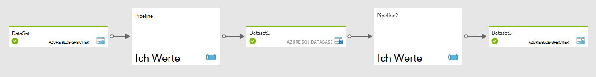

<properties
    pageTitle="Planung und Ausführung mit Daten | Microsoft Azure"
    description="Planung und Ausführung Aspekte von Azure Data Factory-Anwendungsmodell enthält."
    services="data-factory"
    documentationCenter=""
    authors="spelluru"
    manager="jhubbard"
    editor="monicar"/>

<tags
    ms.service="data-factory"
    ms.workload="data-services"
    ms.tgt_pltfrm="na"
    ms.devlang="na"
    ms.topic="article"
    ms.date="08/22/2016"
    ms.author="spelluru"/>

# Data Factory Planung und Ausführung
Dieser Artikel beschreibt die Planung und Ausführung Aspekte des Anwendungsmodells Azure Data Factory. 

## Erforderliche Komponenten
Es wird vorausgesetzt, dass die Grundlagen von Data Factory Modell Anwendungskonzepte, einschließlich Aktivität, Rohrleitungen, verknüpften Diensten und Datasets verstehen. Grundlegende Konzepte von Azure Data Factory finden Sie in folgenden Artikeln:

- [Einführung in Data Factory](data-factory-introduction.md)
- [Rohrleitungen](data-factory-create-pipelines.md)
- [Datasets](data-factory-create-datasets.md) 

## Eine Aktivität planen

Mit der Aktivität JSON Bereich Planer können Sie einen wiederkehrenden Zeitplan für eine Aktivität angeben. Beispielsweise können Sie eine Aktivität pro Stunde folgendermaßen planen:

    "scheduler": {
        "frequency": "Hour",
        "interval": 1
    },  

Wie im Diagramm dargestellt, erstellt einen Zeitplan für die Aktivität festlegen Tumbling Fenster. Tumbling sind eine Reihe von fester Größe nicht überlappen, zusammenhängenden Zeitintervalle. Diese logische Tumbling Windows für die Aktivität werden *Windows Aktivität*bezeichnet.

Bei derzeit ausgeführten Aktivität können Sie das Zeitintervall zugeordnete aktivitätenfenster mit [WindowStart](data-factory-functions-variables.md#data-factory-system-variables) und [WindowEnd](data-factory-functions-variables.md#data-factory-system-variables) -Systemvariablen in der Aktivität JSON zugreifen. Sie können diese Variablen für verschiedene Zwecke in Ihrer Aktivität JSON. Angenommen, können sie Sie Daten aus Eingabe- und Datasets Serie Daten darstellt.

**Planer** -Eigenschaft unterstützt die gleichen Untereigenschaften-Eigenschaft **Verfügbarkeit** in einem Dataset. Einzelheiten finden Sie unter [Dataset-Verfügbarkeit](data-factory-create-datasets.md#Availability) . Beispiele: Offset einen bestimmten Zeitpunkt planen oder Festlegen des Modus Verarbeitung am Anfang oder Ende des Intervalls für das aktivitätenfenster ausgerichtet.

Sie können Eigenschaften für eine Aktivität **Scheduler** , aber diese Eigenschaft ist **optional**. Wenn Sie eine Eigenschaft angeben, muss es die Trittfrequenz in der Ausgabe-Dataset-Definition angeben. Derzeit treibt ausgabedataset planen, müssen Sie eine ausgabedataset erstellen, wenn die Aktivität keine Ausgabe erzeugt. Wenn die Aktivität Eingaben nicht, überspringen Sie Eingabedatasets erstellen.

## Serie Datasets und Zeitscheiben

Serie Daten ist eine kontinuierliche Sequenz von Datenpunkten, die nachfolgenden Messungen über ein Zeitintervall in der Regel aus. Allgemeine Reihendaten gehören Daten und Telemetriedaten.

Mit Data Factory können Sie Zeit verarbeiten Serie Daten im Batchmodus Aktivität ausgeführt wird. Normalerweise ist wiederkehrende Trittfrequenz die Eingabedaten kommt und Ausgabe erzeugt werden muss. Diese Trittfrequenz ist modelliert, durch **Verfügbarkeit** im Dataset wie folgt angeben:

    "availability": {
      "frequency": "Hour",
      "interval": 1
    },

Jede Einheit verbraucht und Ausführen einer Aktivität produziert wird einen Datenslice aufgerufen. Das folgende Diagramm zeigt ein Beispiel für eine Aktivität mit einem Eingabedataset und einem Dataset ausgegeben. Diese Datasets sind **Verfügbarkeit** stündlich Frequenz eingestellt.

Die obige Abbildung zeigt stündlich Datenslices für Eingabe- und Dataset. Das Diagramm zeigt drei Eingabe Segmente, die verarbeitet werden. 10 bis 11 Uhr Aktivität wird gerade 10 11 Uhr ausgabeslice erzeugen.

Sie können das Zeitintervall des aktuellen Segments im Dataset JSON mit Variablen [SliceStart](data-factory-functions-variables.md#data-factory-system-variables) und [SliceEnd](data-factory-functions-variables.md#data-factory-system-variables)erzeugt zugeordnet zugreifen.

Derzeit muss Data Factory Aktivität genau festgelegten Zeitplan **Verfügbarkeit** von ausgabedataset festgelegten Zeitplan entspricht. Daher zuordnen, **WindowStart**, **WindowEnd**, **SliceStart**und **SliceEnd** immer denselben Zeitraum und ein Ausgabe-Segment.

Weitere Informationen über unterschiedliche Eigenschaften für Abschnitt Verfügbarkeit finden Sie unter [Erstellen von Datasets](data-factory-create-datasets.md).

## Verschieben von Daten aus SQL-Datenbank Blob-Speicher

Sehen wir uns einige Dinge zusammen und Aktion durch Erstellen einer Pipeline, die Daten aus einer Tabelle Azure SQL Azure Blob-Speicher stündlich kopiert.

**Eingabe: Azure SQL-Datenbank dataset**

    {
        "name": "AzureSqlInput",
        "properties": {
            "published": false,
            "type": "AzureSqlTable",
            "linkedServiceName": "AzureSqlLinkedService",
            "typeProperties": {
                "tableName": "MyTable"
            },
            "availability": {
                "frequency": "Hour",
                "interval": 1
            },
            "external": true,
            "policy": {}
        }
    }

** **Stunde** festgelegt ist** und **Intervall** unter Verfügbarkeit auf **1** festgelegt ist.

**Ausgabe: Azure BLOB-Speicher dataset**

    {
        "name": "AzureBlobOutput",
        "properties": {
            "published": false,
            "type": "AzureBlob",
            "linkedServiceName": "StorageLinkedService",
            "typeProperties": {
                "folderPath": "mypath/{Year}/{Month}/{Day}/{Hour}",
                "format": {
                    "type": "TextFormat"
                },
                "partitionedBy": [
                    {
                        "name": "Year",
                        "value": {
                            "type": "DateTime",
                            "date": "SliceStart",
                            "format": "yyyy"
                        }
                    },
                    {
                        "name": "Month",
                        "value": {
                            "type": "DateTime",
                            "date": "SliceStart",
                            "format": "%M"
                        }
                    },
                    {
                        "name": "Day",
                        "value": {
                            "type": "DateTime",
                            "date": "SliceStart",
                            "format": "%d"
                        }
                    },
                    {
                        "name": "Hour",
                        "value": {
                            "type": "DateTime",
                            "date": "SliceStart",
                            "format": "%H"
                        }
                    }
                ]
            },
            "availability": {
                "frequency": "Hour",
                "interval": 1
            }
        }
    }

** **Stunde** festgelegt ist** und **Intervall** unter Verfügbarkeit auf **1** festgelegt ist.

**Kopieraktivität**

    {
        "name": "SamplePipeline",
        "properties": {
            "description": "copy activity",
            "activities": [
                {
                    "type": "Copy",
                    "name": "AzureSQLtoBlob",
                    "description": "copy activity",
                    "typeProperties": {
                        "source": {
                            "type": "SqlSource",
                            "sqlReaderQuery": "$$Text.Format('select * from MyTable where timestampcolumn >= \\'{0:yyyy-MM-dd HH:mm}\\' AND timestampcolumn < \\'{1:yyyy-MM-dd HH:mm}\\'', WindowStart, WindowEnd)"
                        },
                        "sink": {
                            "type": "BlobSink",
                            "writeBatchSize": 100000,
                            "writeBatchTimeout": "00:05:00"
                        }
                    },
                    "inputs": [
                        {
                            "name": "AzureSQLInput"
                        }
                    ],
                    "outputs": [
                        {
                            "name": "AzureBlobOutput"
                        }
                    ],
                    "scheduler": {
                        "frequency": "Hour",
                        "interval": 1
                    }
                }
            ],
            "start": "2015-01-01T08:00:00Z",
            "end": "2015-01-01T11:00:00Z"
        }
    }

Das Beispiel zeigt den Terminplan und Dataset Verfügbarkeit Abschnitte stündlich Frequenz. Im Beispiel zeigt, wie können Sie **WindowStart** und **WindowEnd** relevante Daten für eine Aktivität auswählen ausführen und in ein Blob mit entsprechenden **FolderPath**kopieren. **FolderPath** ist parametrisiert, damit einen Ordner für jede Stunde.

Drei Segmente zwischen 8 bis 11 Uhr ausführen, werden die Daten in Azure SQL-Datenbank wie folgt:

Nachdem die Pipeline bereitgestellt wird Azure Blob wie folgt gefüllt:

-   Datei Mypath/2015/1/1/8/Daten. &lt;Guid&gt;.txt mit Daten

            10002345,334,2,2015-01-01 08:24:00.3130000
            10002345,347,15,2015-01-01 08:24:00.6570000
            10991568,2,7,2015-01-01 08:56:34.5300000

    > [AZURE.NOTE] &lt;GUID&gt; durch eine tatsächliche Guid ersetzt. Dateiname-Beispiel: Data.bcde1348-7620-4f93-bb89-0eed3455890b.txt
-   Datei Mypath/2015/1/1/9/Daten. &lt;Guid&gt;.txt Daten:

            10002345,334,1,2015-01-01 09:13:00.3900000
            24379245,569,23,2015-01-01 09:25:00.3130000
            16777799,21,115,2015-01-01 09:47:34.3130000
-   Datei Mypath/2015/1/1/10/Daten. &lt;Guid&gt;.txt ohne Daten.

## Aktiven Zeitraum für pipeline

[Erzeugen von Rohrleitungen](data-factory-create-pipelines.md) Konzept einer aktiven Zeitraum für eine Pipeline angegeben, indem die Eigenschaften **start** und **End** .

Sie können das Startdatum für die Pipeline aktive Periode in der Vergangenheit festlegen. Data Factory (Back Flächen) alle Datensegmente in der Vergangenheit berechnet und verarbeiten sie.

## Parallele Verarbeitung von Datenslices
Rückseite ausgefüllt Datensegmente **Parallelität** Einstellung im Richtlinienabschnitt der JSON-Aktivität parallel ausgeführt werden können. Weitere Informationen zu dieser Eigenschaft finden Sie unter [Erstellen von Pipelines](data-factory-create-pipelines.md).

## Fehlgeschlagene Datenslice erneut 
Sie können Slices Ausführung rich und visual überwachen. Einzelheiten finden Sie unter [Überwachen und Verwalten von Pipelines mit Azure Portal](data-factory-monitor-manage-pipelines.md) oder [Überwachung und Management-Anwendung](data-factory-monitor-manage-app.md) .

Betrachten Sie beispielsweise die zwei Aktivitäten. Activity1 erzeugt ein Dataset Time Series mit Ausgabe als Eingabe von Activity2 zu Endausgabe Time Series Dataset verwendet wird.

Das Diagramm zeigt, die aus drei letzten Segmente Fehler AM 9. und 10. Segment für Datensatz2 erzeugt. Data Factory verfolgt automatisch Abhängigkeit Time Series Dataset. Dadurch wird die Aktivität für die nachgeschaltete 9-10 Uhr-Schicht ausführen nicht gestartet.

Data Factory Überwachung und Management-Tools können Sie Drillinto Diagnoseprotokolle für fehlgeschlagene Segment einfach die Ursache für das Problem suchen und beheben. Nachdem Sie das Problem behoben haben, können Sie problemlos Aktivitäten ausführen, um die fehlerhaften Slice erzeugen starten. Weitere Informationen zu erneut Zustandsübergänge für Datenslices finden Sie unter [Überwachen und Verwalten von Pipelines mit Azure Portal](data-factory-monitor-manage-pipelines.md) oder [Überwachung und Management-Anwendung](data-factory-monitor-manage-app.md).

Nachdem 9-10 AM Segment für **Datensatz2 erneut**startet Data Factory ausführen für die abhängige 9 10 Uhr-Schicht auf den letzten Datensatz.

## Ausführen von Aktivitäten in einer Sequenz
Das ausgabedataset einer Aktivität Eingabedatasets der Aktivität festlegen, um zwei Aktivitäten (eine Aktivität nach dem anderen) zu verketten. Aktivitäten können in der gleichen Rohrleitung oder anderen Rohrleitungen werden. Die zweite Aktivität führt nur beim ersten erfolgreich abgeschlossen wird.

Betrachten Sie beispielsweise den folgenden Fall:

1.  Pipeline P1 hat Aktivität A1, der externen Eingabedatasets D1 erfordert und ausgabedataset D2 erzeugt
2.  Pipeline-P2 hat Aktivität A2, die erfordert eine Benutzereingabe Dataset D2 erzeugt ausgabedataset D3.

In diesem Szenario werden Aktivitäten A1 und A2 andere Pipelines. Die Aktivität wird A1 ausgeführt, wenn die externen Daten und die Häufigkeit des geplanten Verfügbarkeit erreicht. Aktivität führt A2 beim geplanten Segmente aus D2 verfügbar und die geplante Verfügbarkeit Frequenz erreicht. Ist ein Fehler in einem Dataset D2 Segmente, läuft A2 nicht dieses bis verfügbar ist.

Die Diagrammansicht würde folgendermaßen aussehen:

Wie bereits erwähnt, können die Aktivitäten der gleichen Rohrleitung. Die Diagrammansicht mit beide in derselben Rohrleitung würde folgendermaßen aussehen:

### Nacheinander kopieren
Es ist möglich, mehrere Kopiervorgänge nacheinander auf sequenzielle/bestellt. Angenommen, zwei Kopie Aktivitäten in einer Pipeline (CopyActivity1 und CopyActivity2) mit Eingabedaten Ausgabe Datasets möglicherweise:   

CopyActivity1

Eingabe: Dataset. Ausgabe: Datensatz2.

CopyActivity2

Eingabe: Datensatz2.  Ausgabe: Dataset3.

CopyActivity2 wird nur ausgeführt, wenn die CopyActivity1 erfolgreich und Datensatz2 verfügbar ist.

Hier ist der Beispiel-Pipeline JSON:

    {
        "name": "ChainActivities",
        "properties": {
            "description": "Run activities in sequence",
            "activities": [
                {
                    "type": "Copy",
                    "typeProperties": {
                        "source": {
                            "type": "BlobSource"
                        },
                        "sink": {
                            "type": "BlobSink",
                            "copyBehavior": "PreserveHierarchy",
                            "writeBatchSize": 0,
                            "writeBatchTimeout": "00:00:00"
                        }
                    },
                    "inputs": [
                        {
                            "name": "Dataset1"
                        }
                    ],
                    "outputs": [
                        {
                            "name": "Dataset2"
                        }
                    ],
                    "policy": {
                        "timeout": "01:00:00"
                    },
                    "scheduler": {
                        "frequency": "Hour",
                        "interval": 1
                    },
                    "name": "CopyFromBlob1ToBlob2",
                    "description": "Copy data from a blob to another"
                },
                {
                    "type": "Copy",
                    "typeProperties": {
                        "source": {
                            "type": "BlobSource"
                        },
                        "sink": {
                            "type": "BlobSink",
                            "writeBatchSize": 0,
                            "writeBatchTimeout": "00:00:00"
                        }
                    },
                    "inputs": [
                        {
                            "name": "Dataset2"
                        }
                    ],
                    "outputs": [
                        {
                            "name": "Dataset3"
                        }
                    ],
                    "policy": {
                        "timeout": "01:00:00"
                    },
                    "scheduler": {
                        "frequency": "Hour",
                        "interval": 1
                    },
                    "name": "CopyFromBlob2ToBlob3",
                    "description": "Copy data from a blob to another"
                }
            ],
            "start": "2016-08-25T01:00:00Z",
            "end": "2016-08-25T01:00:00Z",
            "isPaused": false
        }
    }

Beachten Sie, dass im Beispiel ausgabedataset der ersten kopieraktivität (Datensatz2) als Eingabe für die zweite Aktivität angegeben ist. Daher führt die zweite Aktivität erst das ausgabedataset von der ersten bereit ist.  

Im Beispiel kann CopyActivity2 eine andere Eingabe wie Dataset3, aber geben Sie Datensatz2 als Eingabe für CopyActivity2, damit die Aktivität nicht ausgeführt wird, bis der CopyActivity1 abgeschlossen ist. Zum Beispiel:

CopyActivity1

Eingabe: Dataset1. Ausgabe: Datensatz2.

CopyActivity2

Eingaben: Dataset3 Datensatz2. Ausgabe: Dataset4.

    {
        "name": "ChainActivities",
        "properties": {
            "description": "Run activities in sequence",
            "activities": [
                {
                    "type": "Copy",
                    "typeProperties": {
                        "source": {
                            "type": "BlobSource"
                        },
                        "sink": {
                            "type": "BlobSink",
                            "copyBehavior": "PreserveHierarchy",
                            "writeBatchSize": 0,
                            "writeBatchTimeout": "00:00:00"
                        }
                    },
                    "inputs": [
                        {
                            "name": "Dataset1"
                        }
                    ],
                    "outputs": [
                        {
                            "name": "Dataset2"
                        }
                    ],
                    "policy": {
                        "timeout": "01:00:00"
                    },
                    "scheduler": {
                        "frequency": "Hour",
                        "interval": 1
                    },
                    "name": "CopyFromBlobToBlob",
                    "description": "Copy data from a blob to another"
                },
                {
                    "type": "Copy",
                    "typeProperties": {
                        "source": {
                            "type": "BlobSource"
                        },
                        "sink": {
                            "type": "BlobSink",
                            "writeBatchSize": 0,
                            "writeBatchTimeout": "00:00:00"
                        }
                    },
                    "inputs": [
                        {
                            "name": "Dataset3"
                        },
                        {
                            "name": "Dataset2"
                        }
                    ],
                    "outputs": [
                        {
                            "name": "Dataset4"
                        }
                    ],
                    "policy": {
                        "timeout": "01:00:00"
                    },
                    "scheduler": {
                        "frequency": "Hour",
                        "interval": 1
                    },
                    "name": "CopyFromBlob3ToBlob4",
                    "description": "Copy data from a blob to another"
                }
            ],
            "start": "2017-04-25T01:00:00Z",
            "end": "2017-04-25T01:00:00Z",
            "isPaused": false
        }
    }

Beachten Sie, dass im Beispiel zwei input Datasets für die zweite kopieraktivität angegeben werden. Wenn mehrere Eingaben angegeben, anderen Datasets als Abhängigkeit verwendet die erste Eingabedatasets dient zum Kopieren von Daten CopyActivity2 würde erst beginnen, wenn folgende Bedingung erfüllt sind:

- CopyActivity1 wurde erfolgreich abgeschlossen und Datensatz2 steht. Dieses Dataset wird beim Kopieren von Daten in Dataset4 nicht verwendet. Es dient nur als scheduling Abhängigkeit für CopyActivity2.   
- Dataset3 ist verfügbar. Dieses Dataset stellt die Daten, die in das Ziel kopiert.  

## Modell Datasets mit Frequenzen

In den Beispielen wurden die Frequenzen für Eingabe- und Datasets und Aktivität Terminplan Fenster identisch. Einige Szenarien erfordern Ausgabe Intervallen Frequenzen eine oder mehrere Eingaben unterscheiden können. Data Factory unterstützt diese Prognosen.

### Beispiel 1: Erstellen einer täglichen Ausgabebericht Eingabedaten stündlich verfügbar ist

Betrachten Sie ein Szenario, in dem Daten von Sensoren stündlich in Azure BLOB-Speicher Eingabe haben. Täglicher Zusammenfassungsbericht Statistiken wie Mittelwert, Maximum und Minimum für den Tag mit [Data Factory hive-Aktivität](data-factory-hive-activity.md)erstellt werden soll.

Sieht aus wie Modellierung dieses Szenarios mit Daten:

**Eingabe-dataset**

Stündlichen Eingabedateien werden im Ordner für das Tag gelöscht. Verfügbarkeit für die Eingabe **zu** legen (Häufigkeit: Stunde, Intervall: 1).

    {
      "name": "AzureBlobInput",
      "properties": {
        "type": "AzureBlob",
        "linkedServiceName": "StorageLinkedService",
        "typeProperties": {
          "folderPath": "mycontainer/myfolder/{Year}/{Month}/{Day}/",
          "partitionedBy": [
            { "name": "Year", "value": {"type": "DateTime","date": "SliceStart","format": "yyyy"}},
            { "name": "Month","value": {"type": "DateTime","date": "SliceStart","format": "%M"}},
            { "name": "Day","value": {"type": "DateTime","date": "SliceStart","format": "%d"}}
          ],
          "format": {
            "type": "TextFormat"
          }
        },
        "external": true,
        "availability": {
          "frequency": "Hour",
          "interval": 1
        }
      }
    }

**Ausgabedataset**

Eine Ausgabedatei wird jeden Tag in der Tag-Ordner erstellt. Verfügbarkeit der Ausgabe am **Tag** festgelegt (Häufigkeit: Tag und Intervall: 1).

    {
      "name": "AzureBlobOutput",
      "properties": {
        "type": "AzureBlob",
        "linkedServiceName": "StorageLinkedService",
        "typeProperties": {
          "folderPath": "mycontainer/myfolder/{Year}/{Month}/{Day}/",
          "partitionedBy": [
            { "name": "Year", "value": {"type": "DateTime","date": "SliceStart","format": "yyyy"}},
            { "name": "Month","value": {"type": "DateTime","date": "SliceStart","format": "%M"}},
            { "name": "Day","value": {"type": "DateTime","date": "SliceStart","format": "%d"}}
          ],
          "format": {
            "type": "TextFormat"
          }
        },
        "availability": {
          "frequency": "Day",
          "interval": 1
        }
      }
    }

**: Struktur Aktivität in einer pipeline**

Skript Struktur erhält die entsprechende *DateTime* Informationen als Parameter, mit dem die **WindowStart** -Variable wie im folgenden Codeausschnitt dargestellt. Das Hive-Skript verwendet diese Variable zum Laden der Daten aus dem richtigen Ordner für den Tag, und führen die Aggregation, um die Ausgabe zu generieren.

        {  
            "name":"SamplePipeline",
            "properties":{  
            "start":"2015-01-01T08:00:00",
            "end":"2015-01-01T11:00:00",
            "description":"hive activity",
            "activities": [
                {
                    "name": "SampleHiveActivity",
                    "inputs": [
                        {
                            "name": "AzureBlobInput"
                        }
                    ],
                    "outputs": [
                        {
                            "name": "AzureBlobOutput"
                        }
                    ],
                    "linkedServiceName": "HDInsightLinkedService",
                    "type": "HDInsightHive",
                    "typeProperties": {
                        "scriptPath": "adftutorial\\hivequery.hql",
                        "scriptLinkedService": "StorageLinkedService",
                        "defines": {
                            "Year": "$$Text.Format('{0:yyyy}',WindowStart)",
                            "Month": "$$Text.Format('{0:%M}',WindowStart)",
                            "Day": "$$Text.Format('{0:%d}',WindowStart)"
                        }
                    },
                    "scheduler": {
                        "frequency": "Day",
                        "interval": 1
                    },          
                    "policy": {
                        "concurrency": 1,
                        "executionPriorityOrder": "OldestFirst",
                        "retry": 2,
                        "timeout": "01:00:00"
                    }
                 }
             ]
           }
        }

Das folgende Diagramm zeigt das Szenario aus Sicht der Daten-Abhängigkeit.

Ausgabeslice für jeden Tag, 24 Stunden Slices Eingabedatasets hängt. Data Factory berechnet diese Abhängigkeiten automatisch herauszufinden, die Eingabedaten Segmente im gleichen Zeitraum wie die Ausgabe produziert werden können. Wenn alle 24 input Segmente nicht verfügbar ist, wartet Data Factory input Segment bereit, vor die tägliche Aktivität ausführen.

### Beispiel 2: Abhängigkeit mit Ausdrücken und Data Factory Funktionen angeben

Betrachten wir ein weiteres Szenario. Angenommen, Sie haben eine Struktur Aktivität verarbeitet, zwei input Datasets. Hat neue Daten täglich, aber davon wird neue Daten wöchentlich. Angenommen Sie möchten eine Verknüpfung über zwei Eingaben und Ergebnisse einer jeden Tag.

Der einfache Ansatz in der Data Factory Eingabe automatisch Zahlen rechts Segmente durch Ausrichten der Ausgabe von Datenslices Zeit Periode nicht funktioniert.

Sie müssen angeben, dass für jede Aktivität ausgeführt, der letzte Woche Datenslice für wöchentliche Eingabedatasets verwenden soll. Sie verwenden Azure Data Factory Funktionen wie im folgenden Codeausschnitt gezeigt, um dieses Verhalten zu implementieren.

**Input1: Azure blob**

Die erste Eingabe ist der Azure Blob täglich aktualisiert.

    {
      "name": "AzureBlobInputDaily",
      "properties": {
        "type": "AzureBlob",
        "linkedServiceName": "StorageLinkedService",
        "typeProperties": {
          "folderPath": "mycontainer/myfolder/{Year}/{Month}/{Day}/",
          "partitionedBy": [
            { "name": "Year", "value": {"type": "DateTime","date": "SliceStart","format": "yyyy"}},
            { "name": "Month","value": {"type": "DateTime","date": "SliceStart","format": "%M"}},
            { "name": "Day","value": {"type": "DateTime","date": "SliceStart","format": "%d"}}
          ],
          "format": {
            "type": "TextFormat"
          }
        },
        "external": true,
        "availability": {
          "frequency": "Day",
          "interval": 1
        }
      }
    }

**Input2: Azure blob**

Input2 ist der Azure Blob wöchentlich aktualisiert.

    {
      "name": "AzureBlobInputWeekly",
      "properties": {
        "type": "AzureBlob",
        "linkedServiceName": "StorageLinkedService",
        "typeProperties": {
          "folderPath": "mycontainer/myfolder/{Year}/{Month}/{Day}/",
          "partitionedBy": [
            { "name": "Year", "value": {"type": "DateTime","date": "SliceStart","format": "yyyy"}},
            { "name": "Month","value": {"type": "DateTime","date": "SliceStart","format": "%M"}},
            { "name": "Day","value": {"type": "DateTime","date": "SliceStart","format": "%d"}}
          ],
          "format": {
            "type": "TextFormat"
          }
        },
        "external": true,
        "availability": {
          "frequency": "Day",
          "interval": 7
        }
      }
    }

**Ausgabe: Azure blob**

Eine Ausgabedatei wird jeden Tag für Tag im Ordner erstellt. Verfügbarkeit der Ausgabe auf **Tag** gesetzt (Häufigkeit: Tag, Intervall: 1).

    {
      "name": "AzureBlobOutputDaily",
      "properties": {
        "type": "AzureBlob",
        "linkedServiceName": "StorageLinkedService",
        "typeProperties": {
          "folderPath": "mycontainer/myfolder/{Year}/{Month}/{Day}/",
          "partitionedBy": [
            { "name": "Year", "value": {"type": "DateTime","date": "SliceStart","format": "yyyy"}},
            { "name": "Month","value": {"type": "DateTime","date": "SliceStart","format": "%M"}},
            { "name": "Day","value": {"type": "DateTime","date": "SliceStart","format": "%d"}}
          ],
          "format": {
            "type": "TextFormat"
          }
        },
        "availability": {
          "frequency": "Day",
          "interval": 1
        }
      }
    }

**: Struktur Aktivität in einer pipeline**

Die Struktur hat zwei Eingaben und erzeugt einen ausgabeslice täglich. Sie können jeden Tag Ausgabe Segment wie folgt auf die vorherige Woche input wöchentliche Eingabe abhängig.

    {  
        "name":"SamplePipeline",
        "properties":{  
        "start":"2015-01-01T08:00:00",
        "end":"2015-01-01T11:00:00",
        "description":"hive activity",
        "activities": [
          {
            "name": "SampleHiveActivity",
            "inputs": [
              {
                "name": "AzureBlobInputDaily"
              },
              {
                "name": "AzureBlobInputWeekly",
                "startTime": "Date.AddDays(SliceStart, - Date.DayOfWeek(SliceStart))",
                "endTime": "Date.AddDays(SliceEnd,  -Date.DayOfWeek(SliceEnd))"  
              }
            ],
            "outputs": [
              {
                "name": "AzureBlobOutputDaily"
              }
            ],
            "linkedServiceName": "HDInsightLinkedService",
            "type": "HDInsightHive",
            "typeProperties": {
              "scriptPath": "adftutorial\\hivequery.hql",
              "scriptLinkedService": "StorageLinkedService",
              "defines": {
                "Year": "$$Text.Format('{0:yyyy}',WindowStart)",
                "Month": "$$Text.Format('{0:%M}',WindowStart)",
                "Day": "$$Text.Format('{0:%d}',WindowStart)"
              }
            },
            "scheduler": {
              "frequency": "Day",
              "interval": 1
            },          
            "policy": {
              "concurrency": 1,
              "executionPriorityOrder": "OldestFirst",
              "retry": 2,  
              "timeout": "01:00:00"
            }
           }
         ]
       }
    }

## Factory Funktionen und Variablen   

Finden Sie eine Liste der Funktionen und Variablen, die Data Factory unterstützt [Data Factory Funktionen und Variablen](data-factory-functions-variables.md) .

## Tiefer Einblick Daten Abhängigkeit

Zum Generieren von Dataset-Slice durch eine Aktivität ausführen wird mit Data Factory folgende *Abhängigkeitsmodell* die Beziehung zwischen Datasets belegt und von einer Aktivität bestimmt.

Zeitraum der Eingabe-Datasets Slice Dataset Ausgabe generieren wird die *abhängigkeitszeitraum*aufgerufen.

Eine Aktivität ausführen generiert ein Dataset Segment erst Datensegmente input Datasets innerhalb der Abhängigkeit verfügbar sind. Also führen input Segmente mit der Abhängigkeit Periode **betriebsbereit für die Aktivität** sein müssen einen Ausgabe-Dataset Slice erstellen.

Zum Generieren von Dataset-Segment [**start**, **Ende**] muss eine Funktion der Abhängigkeit Periode Slice Dataset zuordnen. Diese Funktion ist im Wesentlichen eine Formel, die Anfang und Ende des Segments Dataset am Anfang und Ende der Abhängigkeit konvertiert. Formeller ausgedrückt:

    DatasetSlice = [start, end]
    DependecyPeriod = [f(start, end), g(start, end)]

**F** und **g** sind Funktionen zuordnen, die Anfang und Ende der Abhängigkeit für jede Aktivität eingeben berechnen.

Wie Beispiele entspricht abhängigkeitszeitraum den Zeitraum für den Datenslice erzeugt wird. In diesen Fällen berechnet Data Factory automatisch input Segmente, die in der Abhängigkeit Periode liegen.  

Beispielsweise ist im Beispiel Aggregation, Ausgabe täglich erzeugt und Eingabedaten steht jede Stunde, Segment Datenzeitraums 24 Stunden. Data Factory sucht nach relevanten stündlichen slices für diesen Zeitraum und macht das Segment Ausgabe input Segment abhängig.

Sie können auch eigene Zuordnung Abhängigkeit lang, wie im Beispiel gezeigt Eingänge wöchentlich und ausgabeslice ist täglich hergestellt wird.

## Abhängigkeit von Daten und Validierung

Ein Dataset kann eine Validierung gilt, die angibt, wie Daten Segment Ausführung überprüft werden können, bevor es zur Verwendung bereit ist. Einzelheiten finden Sie unter [Erstellen von Datasets](data-factory-create-datasets.md) .

In solchen Fällen nach Segment Ausführung Abschluss wird Segment Ausgabestatus **Warten** Unterstatus **Validierung**geändert. Nach der Überprüfung der Segmente ändert den Slice Status **bereit**.

Wenn ein Datenslice produziert wurde jedoch die Validierung nicht bestanden werden Aktivität ausgeführt wird, für downstream Segmente auf dieses Segment abhängen nicht verarbeitet.

[Überwachen und Verwalten von Pipelines](data-factory-monitor-manage-pipelines.md) deckt die verschiedenen Zustände Datensegmente in Data Factory.

## Externe Daten

Ein Dataset kann markiert werden, als extern (wie im folgenden Codeausschnitt JSON gezeigt), impliziert nicht mit Daten generiert wurde. In diesem Fall die Dataset-Richtlinie haben zusätzliche Parameter beschreiben Validierung und wiederholen Richtlinie für das Dataset. Eine Beschreibung aller Eigenschaften finden Sie unter [Erstellen von Pipelines](data-factory-create-pipelines.md) .

Wie Datasets Data Factory erstellt werden müssen Datenslices externer Daten bereit, bevor abhängige Segmente verarbeitet werden können.

    {
        "name": "AzureSqlInput",
        "properties":
        {
            "type": "AzureSqlTable",
            "linkedServiceName": "AzureSqlLinkedService",
            "typeProperties":
            {
                "tableName": "MyTable"
            },
            "availability":
            {
                "frequency": "Hour",
                "interval": 1     
            },
            "external": true,
            "policy":
            {
                "externalData":
                {
                    "retryInterval": "00:01:00",
                    "retryTimeout": "00:10:00",
                    "maximumRetry": 3
                }
            }  
        }
    }

## Einmalige pipeline
Erstellen und planen eine Pipeline periodisch (z. B.: stündlich oder täglich) innerhalb der Start- und Endzeiten in der Pipeline-Definition angeben. Einzelheiten finden Sie unter [Planung Aktivitäten](#scheduling-and-execution) . Sie können auch eine Pipeline erstellen, die nur einmal ausgeführt wird. Hierzu legen Sie die Eigenschaft **PipelineMode** in die Pipeline Definition **einmalige** wie im folgenden Beispiel JSON dargestellt. Der Standardwert für diese Eigenschaft ist **geplant**.

    {
        "name": "CopyPipeline",
        "properties": {
            "activities": [
                {
                    "type": "Copy",
                    "typeProperties": {
                        "source": {
                            "type": "BlobSource",
                            "recursive": false
                        },
                        "sink": {
                            "type": "BlobSink",
                            "writeBatchSize": 0,
                            "writeBatchTimeout": "00:00:00"
                        }
                    },
                    "inputs": [
                        {
                            "name": "InputDataset"
                        }
                    ],
                    "outputs": [
                        {
                            "name": "OutputDataset"
                        }
                    ]
                    "name": "CopyActivity-0"
                }
            ]
            "pipelineMode": "OneTime"
        }
    }

Beachten Sie Folgendes:

- ** **Start** und** Endzeiten für die Pipeline sind nicht angegeben.
- **Verfügbarkeit** von Eingabe- und Datasets**Häufigkeit** und **Intervall**angegeben, obwohl Data Factory nicht die Werte verwenden.  
- Einmalige Rohrleitungen in der Diagrammansicht nicht angezeigt. Dieses Verhalten ist entwurfsbedingt.
- Einmalige Rohrleitungen können nicht aktualisiert werden. Sie können eine einmalige Pipeline klonen, benennen sie Eigenschaften aktualisieren und bereitstellen, um eine weitere zu erstellen.
