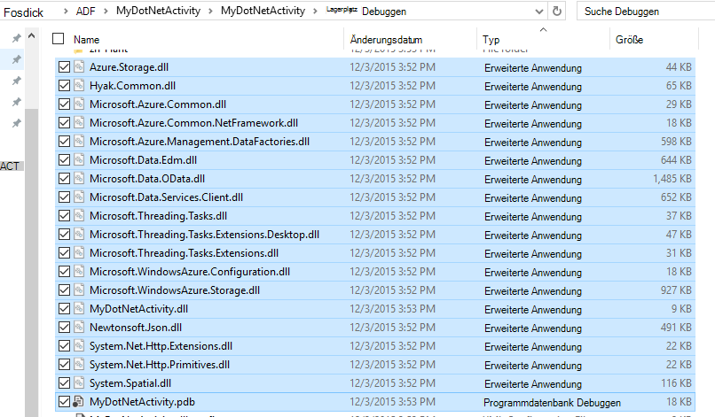
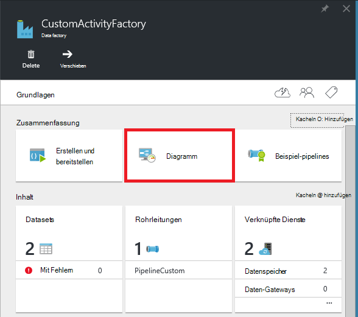
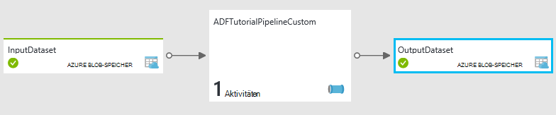
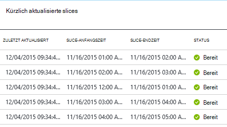
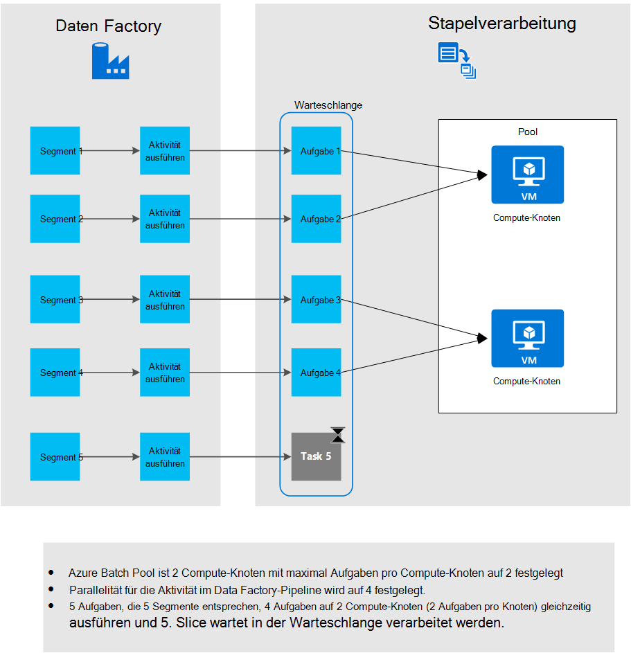

<properties
    pageTitle="Benutzerdefinierte Aktivitäten in Azure Data Factory-pipeline"
    description="Informationen Sie zum Erstellen von benutzerdefinierten Aktivitäten und deren Verwendung in Azure Data Factory-Pipeline."
    services="data-factory"
    documentationCenter=""
    authors="spelluru"
    manager="jhubbard"
    editor="monicar"/>

<tags
    ms.service="data-factory"
    ms.workload="data-services"
    ms.tgt_pltfrm="na"
    ms.devlang="na"
    ms.topic="article"
    ms.date="10/17/2016"
    ms.author="spelluru"/>

# Benutzerdefinierte Aktivitäten in Azure Data Factory-pipeline
> [AZURE.SELECTOR]
[Struktur](data-factory-hive-activity.md)  
[Schweine](data-factory-pig-activity.md)  
[MapReduce](data-factory-map-reduce.md)  
[Hadoop Streaming](data-factory-hadoop-streaming-activity.md)
[Machine Learning](data-factory-azure-ml-batch-execution-activity.md) 
[Gespeicherte Prozedur](data-factory-stored-proc-activity.md)
[Daten See Analytics U-SQL](data-factory-usql-activity.md)
[benutzerdefinierte .NET](data-factory-use-custom-activities.md)

Es gibt zwei Arten von Aktivitäten in einer Pipeline Azure Data Factory verwendet werden können.
 
- [Datenaktivitäten](data-factory-data-movement-activities.md) zum Verschieben von Daten zwischen [Datenspeichern unterstützt](data-factory-data-movement-activities.md#supported-data-stores).
- [Data Transformationsaktivitäten](data-factory-data-transformation-activities.md) mit Transformation-Prozess Daten berechnet Azure HDInsight Azure Batch und Azure maschinelles lernen. Beispiel: HDInsight Struktur und Computer Learning Batch Execution.  

Benötigen Sie zum Verschieben von Daten in einem Datenspeicher, die von Azure Data Factory unterstützt wird, können Sie eine benutzerdefinierte Aktivität .NET mit eigenen Daten Bewegung erstellen und verwenden Sie die Aktivität in der Pipeline. 

Benötigen Sie Transformation/Daten bearbeiten, die von Data Factory unterstützt wird, können Sie ebenso mit eigenen Verarbeitung eine benutzerdefinierte Aktivität erstellen und verwenden Sie die Aktivität in der Pipeline.

> [AZURE.NOTE] Data Management Gateway unterstützt derzeit nur kopieraktivität und gespeicherte Aktivität in Data Factory. Kann nicht mit dem Gateway eine benutzerdefinierte Aktivität lokalen Datenquellen zugreifen.
 
Sie können benutzerdefinierte .NET Aktivität mit einer **Azure Batch** -Dienst oder ein **Azure HDInsight** Cluster konfigurieren.   

Die folgende exemplarische Vorgehensweise bietet eine schrittweise Anleitung zum Erstellen einer benutzerdefinierten Aktivität .NET und benutzerdefinierte Aktivität in einer Pipeline verwenden. Die exemplarische Vorgehensweise verwendet den Dienst **Azure Batch** verknüpft. Azure HDInsight verwendet stattdessen Dienst verknüpft, Sie erstellen einen verknüpften Dienst **HDInsight** (verwenden Sie HDInsight-Cluster) oder **HDInsightOnDemand** (Data Factory zu HDInsight Cluster on-Demand) und im Abschnitt Aktivität der Pipeline JSON (**Nameverknüpfterdienst**). [Mit Azure HDInsight verknüpft, Dienste](#use-azure-hdinsight-linked-services) Siehe Informationen zu Azure HDInsight benutzerdefinierte Aktivität ausführen.

> [AZURE.IMPORTANT] 4.5.2 Variante des.NET Framework wie das Zielframework für das Projekt .NET benutzerdefinierte Aktivität im Visual Studio. Data Factory unterstützt keine benutzerdefinierte Aktivitäten später 4.5.2 Versionen von.NET Framework kompiliert.   

## Exemplarische Vorgehensweise 

### Erforderliche Komponenten

- Visual Studio 2012/2013/2015
- [Azure.NET SDK] herunterladen und installieren[azure-developer-center]

### Azure Batch-Komponenten
In der exemplarischen Vorgehensweise führen Sie benutzerdefinierten .NET Aktivitäten mit Azure Batch als eine computeressource. Finden Sie unter [Grundlagen von Azure Batch] [ batch-technical-overview] Überblick Azure Batch service und finden Sie unter [Erste Schritte mit Azure Batch-Bibliothek für .NET] [ batch-get-started] mit dem Azure Batch Schnelleinstieg.

Sie müssen für das Lernprogramm für Azure Batch mit VMs registrieren. Hier sind die Schritte:

1. Erstellen Sie ein **Azure Batch-Konto** mithilfe der [Azure-Portal](http://manage.windowsazure.com). Siehe [Erstellen und Verwalten einer Azure Batch] [ batch-create-account] Artikel entnehmen. Notieren Sie den Azure Batch-Konto und Schlüssel.

    Sie können auch [Neue AzureBatchAccount] [ new-azure-batch-account] Cmdlet ein Azure Batch-Konto erstellen. Finden Sie [Mithilfe von Azure PowerShell Azure Batch-Konto verwalten] [ azure-batch-blog] Weitere Informationen zur Verwendung dieses Cmdlets.
2. Erstellen einer **Azure Batch Pool**.
    1. Klicken Sie in [Azure-Portal](https://portal.azure.com)im linken Menü auf **Durchsuchen** , und **Batch-Konten**auf. 
    2. Wählen Sie Ihr Konto Azure Batch Blade **Batch-Konto** zu öffnen. 
    3. Klicken Sie auf nebeneinander **Pools** .
    4. Blatt **Pools** klicken Sie hinzufügen um einen Pool hinzuzufügen.
        1. Geben Sie eine Kennung für den Pool (**Pool-ID**). Beachten Sie die **ID des Pools**. Beim Erstellen der Data Factory-Lösung benötigt. 
        2. Geben Sie **Windows Server 2012 R2** für Betriebssystem-Einstellung.
        3. Wählen Sie einen **Knoten Tarif**. 
        3. Geben Sie **2** als Wert für die Einstellung **Ziel gewidmet** .
        4. Geben Sie **2** als Wert für die Einstellung **Max. Aufgaben pro Knoten** .
    5. Klicken Sie auf **OK** , um den Pool zu erstellen. 
 
    [Neu-AzureBatchPool](https://msdn.microsoft.com/library/mt628690.aspx) -Cmdlet können Sie um Azure Batch-Pool zu erstellen.    

### Schritte 
1.  **Erstellen eine benutzerdefinierte Aktivität** Data Factory-Pipeline verwendet. Die benutzerdefinierte Aktivität in diesem Beispiel enthält die Logik Data Transformation-Verarbeitung. 
    1.  Erstellen Sie in Visual Studio .NET Class Library-Projekt, fügen Sie Code zum Verarbeiten von Daten und kompilieren Sie das Projekt. 
    2.  ZIP-alle Binärdateien und PDB-Datei (optional) im Ausgabeordner.  
    3.  Laden Sie die Zip-Datei Azure Blob-Speicher. Ausführliche Anleitung finden Sie im Abschnitt benutzerdefinierte Aktivität erstellen. 
2. **Erstellen einer Azure Data Factory, die benutzerdefinierte Aktivität verwendet**:
    1. Erstellen einer Azure Data Factory.
    2. Erstellen von verknüpften Diensten.
        1. AzureStorageLinkedService: Gibt Speicher Anmeldeinformationen für den Zugriff auf Blobs.
        2. AzureBatchLinkedService: Gibt Azure Batch wie berechnet.
    3. Erstellen Sie Datasets.
        1. InputDataset: Gibt Behälter und Ordner für die Eingabe Blobs.
        1. OuputDataset: Gibt Behälter und Ordner für die Ausgabe-Blobs.
    2. Erstellen Sie eine Pipeline, die die benutzerdefinierte Aktivität verwendet.
    3. Ausführen und Testen der Pipeline.
    4. Debuggen der Pipeline.

## Die benutzerdefinierte Aktivität erstellen
Erstellen Sie zum Erstellen einer benutzerdefinierten Aktivität .NET **.NET Class Library** -Projekt mit einer Klasse, die **IDotNetActivity** -Schnittstelle implementiert. Diese Schnittstelle hat nur eine Methode: [Ausführen](https://msdn.microsoft.com/library/azure/mt603945.aspx) und die Signatur ist:

    public IDictionary<string, string> Execute(
            IEnumerable<LinkedService> linkedServices, 
            IEnumerable<Dataset> datasets, 
            Activity activity, 
            IActivityLogger logger)
        

Diese Methode verwendet vier Parameter:

- **LinkedServices**. Diese Eigenschaft ist eine aufzählbare Liste von verknüpften Dienste, die e/a-Datenquellen verknüpfen (z. B.: Azure BLOB-Speicher), Data Factory. In diesem Beispiel ist nur ein verknüpfter Dienst vom Typ Azure Storage für Eingabe und Ausgabe verwendet. 
- **Datasets**. Diese Eigenschaft ist eine aufzählbare Liste von Datasets. Dabei können die Speicherorte und Schemas von Eingabe- und Datasets definiert.
- **Aktivität**. Diese Eigenschaft stellt die aktuellen Compute Entität - bei Azure Batch.
- **Protokollierung**. Dieses Objekt ermöglicht Debuggen-Kommentare Fläche als "Benutzer" für die Pipeline. 

Die Methode gibt ein Wörterbuch mit benutzerdefinierte Aktivitäten in Zukunft verketten. Dieses Feature ist noch nicht implementiert, also ein leeres Wörterbuch von der Methode zurückgegeben.  

### Verfahren 
1.  Erstellen eines Projekts **.NET Class Library** .
    <ol type="a">
        <li>Starten Sie <b>Visual Studio 2015</b> oder <b>Visual Studio 2013</b> oder <b>Visual Studio 2012</b>.</li>
        <li>Klicken Sie auf <b>Datei</b>, zeigen Sie auf <b>neu</b>, und klicken Sie auf <b>Projekt</b>.</li>
        <li><b>Vorlagen Sie</b>, und wählen Sie <b>Visual C#</b>. In dieser exemplarischen Vorgehensweise verwenden C# können Sie die benutzerdefinierte Aktivität zu jeder</li>
        <li><b>Wählen Sie aus der Liste der Projekttypen auf der rechten Seite.</b></li>
        <li>Geben Sie den <b>Namen</b> <b>MyDotNetActivity</b> .</li>
        <li>Wählen Sie <b>C:\ADFGetStarted</b> für den <b>Standort</b>.</li>
        <li>Klicken Sie auf <b>OK</b> , um das Projekt zu erstellen.</li>
    </ol>
2.  Klicken Sie auf **Extras**, zeigen Sie **NuGet Paket-Manager**und auf **Paket-Manager-Konsole**.
3.  Führen Sie in der Konsole Paket-Manager den folgenden Befehl **Microsoft.Azure.Management.DataFactories**importieren.

        Install-Package Microsoft.Azure.Management.DataFactories

4. Importieren Sie **Azure Storage** NuGet-Paket in das Projekt.

        Install-Package Azure.Storage

5. Die folgende Anweisung **verwenden** zur Quelldatei im Projekt hinzufügen.

        using System.IO;
        using System.Globalization;
        using System.Diagnostics;
        using System.Linq;

        using Microsoft.Azure.Management.DataFactories.Models;
        using Microsoft.Azure.Management.DataFactories.Runtime;

        using Microsoft.WindowsAzure.Storage;
        using Microsoft.WindowsAzure.Storage.Blob;

6. Ändern Sie den Namen des **Namespace** in **MyDotNetActivityNS**.

        namespace MyDotNetActivityNS

7. Ändern Sie den Namen der Klasse, **MyDotNetActivity** und von der **IDotNetActivity** -Schnittstelle leiten Sie ab, wie im folgenden Codeausschnitt dargestellt:

        public class MyDotNetActivity : IDotNetActivity

8. Implementieren Sie (hinzufügen) der **Execute** -Methode **IDotNetActivity** Schnittstelle der Klasse **MyDotNetActivity** und kopieren Sie den folgende Code der Methode.

    Das folgende Beispiel zählt die Vorkommen des Suchbegriffs ("Microsoft") in jeder Blob mit Daten verknüpft ist. 

        /// 

        /// Execute method is the only method of IDotNetActivity interface you must implement. 
        /// In this sample, the method invokes the Calculate method to perform the core logic.  
        /// 

        public IDictionary<string, string> Execute(
            IEnumerable<LinkedService> linkedServices,
            IEnumerable<Dataset> datasets,
            Activity activity,
            IActivityLogger logger)
        {
            // to get extended properties (for example: SliceStart)
            DotNetActivity dotNetActivity = (DotNetActivity)activity.TypeProperties;
            string sliceStartString = dotNetActivity.ExtendedProperties["SliceStart"];

            // to log all extended properties           
            IDictionary<string, string> extendedProperties = dotNetActivity.ExtendedProperties;
            logger.Write("Logging extended properties if any...");
            foreach (KeyValuePair<string, string> entry in extendedProperties)
            {
                logger.Write("<key:{0}> <value:{1}>", entry.Key, entry.Value);
            }
        
            // declare types for input and output data stores
            AzureStorageLinkedService inputLinkedService;

            // declare dataset types
            CustomDataset inputLocation;
            AzureBlobDataset outputLocation;

            Dataset inputDataset = datasets.Single(dataset => dataset.Name == activity.Inputs.Single().Name);
            inputLocation = inputDataset.Properties.TypeProperties as CustomDataset;

            foreach (LinkedService ls in linkedServices)
                logger.Write("linkedService.Name {0}", ls.Name);

            // using First method instead of Single since we are using the same 
            // Azure Storage linked service for input and output. 
            inputLinkedService = linkedServices.First(
                linkedService =>
                linkedService.Name ==
                inputDataset.Properties.LinkedServiceName).Properties.TypeProperties
                as AzureStorageLinkedService;

            string connectionString = inputLinkedService.ConnectionString; 

            // To create an input storage client.
            string folderPath = GetFolderPath(inputDataset);
            string output = string.Empty; // for use later.

            // create storage client for input. Pass the connection string.
            CloudStorageAccount inputStorageAccount = CloudStorageAccount.Parse(connectionString);
            CloudBlobClient inputClient = inputStorageAccount.CreateCloudBlobClient();

            // initialize the continuation token before using it in the do-while loop.
            BlobContinuationToken continuationToken = null;
            do
            {   // get the list of input blobs from the input storage client object.
                BlobResultSegment blobList = inputClient.ListBlobsSegmented(folderPath,
                                         true,
                                         BlobListingDetails.Metadata,
                                         null,
                                         continuationToken,
                                         null,
                                         null);
                
                // Calculate method returns the number of occurrences of 
                // the search term (“Microsoft”) in each blob associated
                // with the data slice. definition of the method is shown in the next step.
 
                output = Calculate(blobList, logger, folderPath, ref continuationToken, "Microsoft");

            } while (continuationToken != null);

            // get the output dataset using the name of the dataset matched to a name in the Activity output collection.
            Dataset outputDataset = datasets.Single(dataset => dataset.Name == activity.Outputs.Single().Name);
            // convert to blob location object.
            outputLocation = outputDataset.Properties.TypeProperties as AzureBlobDataset;

            folderPath = GetFolderPath(outputDataset);

            logger.Write("Writing blob to the folder: {0}", folderPath);

            // create a storage object for the output blob.
            CloudStorageAccount outputStorageAccount = CloudStorageAccount.Parse(connectionString);
            // write the name of the file. 
            Uri outputBlobUri = new Uri(outputStorageAccount.BlobEndpoint, folderPath + "/" + GetFileName(outputDataset));

            logger.Write("output blob URI: {0}", outputBlobUri.ToString());
            // create a blob and upload the output text.
            CloudBlockBlob outputBlob = new CloudBlockBlob(outputBlobUri, outputStorageAccount.Credentials);
            logger.Write("Writing {0} to the output blob", output);
            outputBlob.UploadText(output);

            // The dictionary can be used to chain custom activities together in the future.
            // This feature is not implemented yet, so just return an empty dictionary.  

            return new Dictionary<string, string>();
        }

9. Fügen Sie die folgenden Hilfsmethoden hinzu. Die **Execute** -Methode ruft diese Hilfsmethoden. **GetConnectionString** -Methode ruft die Azure-Speicher-Verbindungszeichenfolge und die **GetFolderPath** -Methode der BLOB-Position. Vor allem isoliert die **Calculate** -Methode Code jedes Blob durchläuft.

        /// 

        /// Gets the folderPath value from the input/output dataset.
        /// 

        private static string GetFolderPath(Dataset dataArtifact)
        {
            if (dataArtifact == null || dataArtifact.Properties == null)
            {
                return null;
            }

            AzureBlobDataset blobDataset = dataArtifact.Properties.TypeProperties as AzureBlobDataset;
            if (blobDataset == null)
            {
                return null;
            }

            return blobDataset.FolderPath;
        }

        /// 

        /// Gets the fileName value from the input/output dataset.   
        /// 

        private static string GetFileName(Dataset dataArtifact)
        {
            if (dataArtifact == null || dataArtifact.Properties == null)
            {
                return null;
            }

            AzureBlobDataset blobDataset = dataArtifact.Properties.TypeProperties as AzureBlobDataset;
            if (blobDataset == null)
            {
                return null;
            }

            return blobDataset.FileName;
        }

        /// 

        /// Iterates through each blob (file) in the folder, counts the number of instances of search term in the file, 
        /// and prepares the output text that is written to the output blob. 
        /// 

        public static string Calculate(BlobResultSegment Bresult, IActivityLogger logger, string folderPath, ref BlobContinuationToken token, string searchTerm)
        {
            string output = string.Empty;
            logger.Write("number of blobs found: {0}", Bresult.Results.Count<IListBlobItem>());
            foreach (IListBlobItem listBlobItem in Bresult.Results)
            {
                CloudBlockBlob inputBlob = listBlobItem as CloudBlockBlob;
                if ((inputBlob != null) && (inputBlob.Name.IndexOf("$$$.$$$") == -1))
                {
                    string blobText = inputBlob.DownloadText(Encoding.ASCII, null, null, null);
                    logger.Write("input blob text: {0}", blobText);
                    string[] source = blobText.Split(new char[] { '.', '?', '!', ' ', ';', ':', ',' }, StringSplitOptions.RemoveEmptyEntries);
                    var matchQuery = from word in source
                                     where word.ToLowerInvariant() == searchTerm.ToLowerInvariant()
                                     select word;
                    int wordCount = matchQuery.Count();
                    output += string.Format("{0} occurrences(s) of the search term \"{1}\" were found in the file {2}.\r\n", wordCount, searchTerm, inputBlob.Name);
                }
            }
            return output;
        }

    GetFolderPath-Methode gibt den Pfad zum Ordner, dem das Dataset zeigt und die GetFileName-Methode gibt den Namen der Blob/Datei Dataset verweist. Wenn Sie HavefolderPath definiert Variablen wie {Jahr} {Monat} {Day} usw. die Methode gibt die Zeichenfolge ist durch Werte ersetzen. Siehe Details zum Zugriff auf SliceStart, SliceEnd usw. [Zugriff auf Erweiterte Eigenschaften](#access-extended-properties) .    
    
            "name": "InputDataset",
            "properties": {
                "type": "AzureBlob",
                "linkedServiceName": "AzureStorageLinkedService",
                "typeProperties": {
                    "fileName": "file.txt",
                    "folderPath": "adftutorial/inputfolder/",
    
    Die Calculate-Methode berechnet die Anzahl der Instanzen des Schlüsselworts Microsoft Eingabedateien (Blobs im Ordner). Der Suchbegriff ist ("Microsoft") im Code hartcodiert.

10. Kompilieren Sie das Projekt. Klicken Sie im Menü **Erstellen** , und klicken Sie auf **Projektmappe erstellen**.

    > [AZURE.IMPORTANT] 4.5.2 Variante des.NET Framework wie das Zielframework für das Projekt: Maustaste auf das Projekt, und klicken Sie auf **Eigenschaften** , um das Zielframework festzulegen. Data Factory unterstützt keine benutzerdefinierte Aktivitäten später 4.5.2 Versionen von.NET Framework kompiliert. 
11. Starten Sie **Windows Explorer**und navigieren Sie zum Ordner **Bin\debug** oder **Bin\release** je erstellen.
12. Erstellen eine Zip-Datei **MyDotNetActivity.zip** , die alle Binärdateien enthält die <project folder>Ordner \bin\Debug. Möglicherweise sollen die Datei **MyDotNetActivity.pdb** , um zusätzliche Details wie die Zeilennummer im Quellcode zu erhalten, die das Problem verursacht, wenn ein Fehler aufgetreten. Alle Dateien in der Zip-Datei für die benutzerdefinierte Aktivität müssen keine Sub-Ordner auf der **obersten Ebene** sein.

    
13. **MyDotNetActivity.zip** als Blob in den BLOB-Container hochladen: **Customactivitycontainer** in Azure BLOB-Speicher **AzureStorageLinkedService** Service **ADFTutorialDataFactory** verknüpft wird.  Erstellen Sie BLOB-Container **Customactivitycontainer** , wenn es nicht bereits vorhanden ist.

> [AZURE.NOTE] Wenn Sie eine Lösung in Visual Studio, die eine Data Factory-Projekt enthält dieses Projekt .NET Aktivität hinzufügen und .NET Aktivitätsprojekt einen Verweis aus dem Projekt "Data Factory" Anwendung hinzufügen, müssen Sie nicht die letzten beiden Schritte manuell die Zip-Datei erstellen und Azure BLOB-Speicher hochladen. Beim Veröffentlichen von Daten Factory Entitäten Visual Studio folgendermaßen automatisch durch den Veröffentlichungsprozess vorgenommen. Finden Sie [Ihre erste Pipeline mit Visual Studio erstellen](data-factory-build-your-first-pipeline-using-vs.md) und [Daten von Azure Blob zu SQL Azure](data-factory-copy-activity-tutorial-using-visual-studio.md) Artikeln Informationen erstellen und Veröffentlichen von Daten Factory Entitäten mit Visual Studio.  

### Execute-Methode

Dieser Abschnitt enthält weitere Informationen und Hinweise zum Code in der **Execute** -Methode.
 
1. Die Mitglieder der Eingabesammlung durchlaufen befinden sich im [Microsoft.WindowsAzure.Storage.Blob](https://msdn.microsoft.com/library/azure/microsoft.windowsazure.storage.blob.aspx) -Namespace. BLOB-Auflistung durchlaufen muss mithilfe der **BlobContinuationToken** -Klasse. Im Wesentlichen müssen Sie ein verwenden-while-Schleife mit dem Token als Mechanismus für die Schleife beendet wird. Weitere Informationen finden Sie unter [Verwenden von BLOB-Speicher von .NET](../storage/storage-dotnet-how-to-use-blobs.md). Eine einfache Schleife ist hier dargestellt:

        // Initialize the continuation token.
        BlobContinuationToken continuationToken = null;
        do
        {   
            // Get the list of input blobs from the input storage client object.
            BlobResultSegment blobList = inputClient.ListBlobsSegmented(folderPath,
                                      true,
                                      BlobListingDetails.Metadata,
                                      null,
                                      continuationToken,
                                      null,
                                      null);
            // Return a string derived from parsing each blob.
            output = Calculate(blobList, logger, folderPath, ref continuationToken, "Microsoft");
        } while (continuationToken != null);

    Die Dokumentation für die [ListBlobsSegmented](https://msdn.microsoft.com/library/jj717596.aspx) -Methode.

2.  Code für die Verwendung durch den Satz von Blobs logisch geht innerhalb der-while-Schleife. In der **Execute** -Methode der-während der Schleife Liste von Blobs an eine Methode namens **berechnen**übergibt. Die Methode gibt Zeichenfolgenvariable **Ausgabe** das Ergebnis alle Blobs im Segment durchlaufen müssen. 

    Es gibt die Anzahl der Vorkommen des Suchbegriffs (**Microsoft**) im Blob an die **Calculate** -Methode übergeben. 

            output += string.Format("{0} occurrences of the search term \"{1}\" were found in the file {2}.\r\n", wordCount, searchTerm, inputBlob.Name);

3.  Sobald **die Berechnungsmethode** die Arbeit geleistet hat, muss er ein neues Blob geschrieben werden. Für jeden Blobs verarbeitet ein neues Blob mit den Ergebnissen geschrieben werden kann. Um ein neues Blob schreiben, zunächst suchen Sie das ausgabedataset. 

            // Get the output dataset using the name of the dataset matched to a name in the Activity output collection.
            Dataset outputDataset = datasets.Single(dataset => dataset.Name == activity.Outputs.Single().Name);

            // Convert to blob location object.
            outputLocation = outputDataset.Properties.TypeProperties as AzureBlobDataset;

4.  Der Code ruft auch eine Hilfsmethode: **GetFolderPath** Ordnerpfad (Containernamen Speicher) abrufen.
 
            folderPath = GetFolderPath(outputDataset);

    **GetFolderPath** wandelt das DataSet-Objekt um eine AzureBlobDataSet Eigenschaft Ordnerpfad hat.
            
            AzureBlobDataset blobDataset = dataArtifact.Properties.TypeProperties as AzureBlobDataset;
            
            return blobDataset.FolderPath;

5.  Der Code Ruft die **GetFileName** -Methode zum Abrufen des Dateinamens (BLOB-Name).  

            AzureBlobDataset blobDataset = dataArtifact.Properties.TypeProperties as AzureBlobDataset;

            return blobDataset.FileName;

6.  Der Name der Datei steht ein URI-Objekt erstellen. Der URI-Konstruktor mithilfe der **BlobEndpoint** -Eigenschaft den Containername zurückgegeben. Pfad und Namen des Ordners hinzugefügt Ausgabe Blob URI erstellen.  

            // Write the name of the file. 
            Uri outputBlobUri = new Uri(outputStorageAccount.BlobEndpoint, folderPath + "/" + GetFileName(outputDataset));

7.  Der Name der Datei geschrieben wurde und jetzt können Sie schreiben die Ausgabezeichenfolge Calculate-Methode ein neues Blob:

            // Create a blob and upload the output text.
            CloudBlockBlob outputBlob = new CloudBlockBlob(outputBlobUri, outputStorageAccount.Credentials);
            logger.Write("Writing {0} to the output blob", output);
            outputBlob.UploadText(output);

## Erstellen der Azure-Portal mit Data factory

Im Abschnitt **Erstellen Sie die benutzerdefinierte Aktivität** erstellt eine benutzerdefinierte Aktivität und die Zip-Datei mit Binärdateien und PDB-Datei in Azure Blob-Container hochgeladen. In diesem Abschnitt erstellen Sie eine Azure **Data Factory** eine **Pipeline** , die die **benutzerdefinierte Aktivität**verwendet.
 
Eingabedatasets für die benutzerdefinierte Aktivität stellt die Blobs (Dateien) im Ordner "input" (Adftutorial\inputfolder) im BLOB-Speicher. Das ausgabedataset für die Aktivität stellt die Ausgabe Blobs im Ausgabeordner (Adftutorial\outputfolder) im BLOB-Speicher. 

Eine Datei namens **Datei.txt** mit folgendem Inhalt erstellen und hochladen, **Adftutorial\inputfolder** (Adftutorial ist der Name des Containers Azure Blob und Inputfolder ist der Name des Ordners im Container).

    test custom activity Microsoft test custom activity Microsoft

Der Eingabeordner entspricht Segment in Azure Data Factory auch wenn Ordners zwei Dateien. Wenn jedes Segment der Pipeline verarbeitet wird, durchläuft die benutzerdefinierte Aktivität alle Blobs Eingabeordner für dieses Segment. 

Sie sehen eine gleichnamige Datei im Ordner "Adftutorial\output" mit einer oder mehreren Zeilen (identisch mit der Anzahl von Blobs im Eingabeordner) ausgegeben:
 
    2 occurrences(s) of the search term "Microsoft" were found in the file inputfolder/2015-11-16-00/file.txt.

Hier werden die Schritte in diesem Abschnitt ausführen:

1. Erstellen einer **Data Factory**.
2. **Verknüpfte Dienste** für den Pool Azure Batch VMs auf die benutzerdefinierte Aktivität ausgeführt wird und Azure-Speicher, der die Eingabe/Ausgabe-Blobs enthält. 
2. Eingabe- und **Datasets** , die ein- und Ausgabe der benutzerdefinierten Aktivität darstellen. 
3. **Pipeline** , die die benutzerdefinierte Aktivität verwendet.
4. **Data Factory**. Sie erstellen eine dieser Entitäten in Azure veröffentlichen. 

> [AZURE.NOTE] Erstellen Sie **Datei.txt** und einem BLOB-Container hochladen Sie, wenn Sie dies nicht bereits getan haben. Finden Sie oben.  

### Schritt 1: Erstellen der Data factory

1.  Gehen Sie nach der Anmeldung zum Azure-Portal folgendermaßen vor:
    1.  Klicken Sie im linken Menü auf **neu** .
    2.  Klicken Sie auf **Daten + Analytics** Blatt **neu** .
    3.  Klicken Sie auf **Data Factory** auf die **Datenanalyse** .
2.  Geben Sie in das **neue Data Factory** -Blade **CustomActivityFactory** ein. Der Name der Azure Data Factory muss eindeutig sein. Wenn Sie die Fehlermeldung: Ändern Sie den Namen der Data Factory (z. B. **YournameCustomActivityFactory**) **Data Factory Name "CustomActivityFactory" ist nicht verfügbar**, und versuchen Sie es erneut erstellen.
3.  Klicken Sie auf **Den Namen**, und wählen Sie eine vorhandene Ressourcengruppe oder erstellen Sie eine Ressourcengruppe. 
4.  Stellen Sie sicher, dass Sie die richtige **Abonnement** und **Region** Data Factory erstellt werden soll. 
5.  Klicken Sie auf das **neue Data Factory** auf **Erstellen** .
6.  Data Factory im **Dashboard** der Azure-Portal angezeigt.
7.  Nachdem die Data Factory erfolgreich erstellt wurde, sehen Sie Blatt Data Factory, den Inhalt der Data Factory.

### Schritt 2: Erstellen von verknüpften Diensten

Verknüpften Dienste verknüpfen Datenspeicher oder Dienste einer Azure Data Factory zu berechnen. In diesem Schritt verknüpfen Sie Ihre Azure Storage-Konto und Azure Batch-Konto zu Ihrer Data Factory.

#### Erstellen von verknüpften Azure Storage-Diensts

1.  Klicken Sie auf die **Autor und** nebeneinander auf dem Blatt **DATA FACTORY** für **CustomActivityFactory**. Die Factory-Editor angezeigt.
2.  Klicken Sie auf der Befehlsleiste auf **neuen Daten zu speichern** , und wählen Sie **Azure-Speicher**. JSON-Skript zum Erstellen einer verknüpften Azure Storage-Diensts im Editor sollte angezeigt werden.
3.  Ersetzen Sie **Kontoname** mit dem Namen der Azure-Speicher und **Konto-Taste** und der Zugriffstaste des Kontos Azure-Speicher. Wie man die Zugriffstaste Speicher finden Sie unter [anzeigen, kopieren und Regenerieren Speicher Zugriffstasten](../storage/storage-create-storage-account.md#view-copy-and-regenerate-storage-access-keys).
4.  Klicken Sie auf der Befehlsleiste verknüpften Dienst bereitstellen **Bereitstellen** .

#### Azure Batch verknüpften Dienst erstellen

2. Im Data Factory-Editor auf der Befehlsleiste auf **neu berechnen** und wählen Sie **Azure Batch** aus dem Menü.
3. Ändern der folgenden JSON-Skript:
    1. Geben Sie Namen Azure Konto **Kontoname** -Eigenschaft. Die **URL** aus dem **Azure Batch Konto Blade** ist im folgenden Format: http://**Accountname**. region.batch.azure.com. Für die Eigenschaft **BatchUri** in JSON müssen Sie **Entfernen "Kontoname."** URL und **Kontoname** für **Kontoname** JSON-Eigenschaft verwenden.
    2. Azure Batch Konto-Schlüssel für **AccessKey** -Eigenschaft angeben. 
    3. Geben Sie den Namen des erstellten Pools als Teil der erforderlichen Komponenten für die Eigenschaft **an** . Sie können auch die ID des Pools nicht den Namen des Pools.
    4. Azure Batch URI für die **BatchUri** -Eigenschaft fest Siehe oben für **Kontoname** Eigenschaft. Beispiel: https://westus.batch.azure.com.  
    5. Geben Sie die **AzureStorageLinkedService** für die **Nameverknüpfterdienst** -Eigenschaft.
        
            {
              "name": "AzureBatchLinkedService",
              "properties": {
                "type": "AzureBatch",
                "typeProperties": {
                  "accountName": "myazurebatchaccount",
                  "batchUri": "https://westus.batch.azure.com",
                  "accessKey": "<yourbatchaccountkey>",
                  "poolName": "myazurebatchpool",
                  "linkedServiceName": "AzureStorageLinkedService"
                }
              }
            }

        Für die Eigenschaft **mit** können Sie auch die ID des Pools nicht den Namen des Pools angeben.

    > [AZURE.NOTE] Data Factory-Dienst unterstützt eine Option bei Bedarf für Azure nicht wie für HDInsight. Nur können Ihre eigenen Pool Azure Batch in einer Azure Daten.
    
### Schritt 3: Erstellen von datasets
In diesem Schritt erstellen Sie Datasets ein-und Ausgabeparameter darstellt.

#### Eingabe-Dataset erstellen
1.  **Editor** für die Daten auf **Neues Dataset** -Schaltfläche auf der Symbolleiste und anschließend auf **Azure BLOB-Speicher** aus dem Dropdown Menü.
2.  Der folgende Codeausschnitt JSON ersetzen Sie JSON im rechten:

            {
                "name": "InputDataset",
                "properties": {
                    "type": "AzureBlob",
                    "linkedServiceName": "AzureStorageLinkedService",
                    "typeProperties": {
                        "folderPath": "adftutorial/customactivityinput/",
                        "format": {
                            "type": "TextFormat"
                        }
                    },
                    "availability": {
                        "frequency": "Hour",
                        "interval": 1
                    },
                    "external": true,
                    "policy": {}
                }
            }

    Erstellen Sie eine Pipeline weiter unten in dieser exemplarischen Vorgehensweise mit Startzeit: 2015-11-16T00:00:00Z und Endzeit: 2015-11-16T05:00:00Z. Geplant, Daten stündlich, so gibt es 5 e/a-Segmente (zwischen **00**: 00:00 -> **05**: 00:00). 

    Die **Häufigkeit** und das **Intervall** für Eingabedatasets soll **Stunde** und **1**bedeutet, dass das Eingabe Slice stündlich verfügbar ist. In diesem Beispiel ist es die gleiche Datei (file.txt) in der Intputfolder. 

    Hier sind die Startzeiten für jedes Segment die Systemvariable SliceStart in den oben stehenden JSON-Ausschnitt dargestellt wird. 

    
3.  Klicken Sie auf der Symbolleiste erstellen und Bereitstellen der **InputDataset** **Bereitstellen** . Bestätigen Sie, dass Sie die **Tabelle erfolgreich erstellt** auf der Titelleiste des Editors angezeigt.

#### Erstellen Sie eine ausgabedataset

1. **Data Factory-Editor**klicken Sie auf **Neues Dataset**und klicken Sie dann auf der Befehlsleiste auf **Azure BLOB-Speicher** .
2. Das folgende Skript JSON ersetzen Sie JSON-Skript im rechten:

        {
            "name": "OutputDataset",
            "properties": {
                "type": "AzureBlob",
                "linkedServiceName": "AzureStorageLinkedService",
                "typeProperties": {
                    "fileName": "{slice}.txt",
                    "folderPath": "adftutorial/customactivityoutput/",
                    "partitionedBy": [
                        {
                            "name": "slice",
                            "value": {
                                "type": "DateTime",
                                "date": "SliceStart",
                                "format": "yyyy-MM-dd-HH"
                            }
                        }
                    ]
                },
                "availability": {
                    "frequency": "Hour",
                    "interval": 1
                }
            }
        }

    Ausgabe wird **Adftutorial/Customactivityoutput/** und Ausgabedateiname ist JJJJ-MM-TT-HH.txt ist JJJJ-MM-Dd-HH Jahr, Monat, Datum und Uhrzeit des Segments produziert. [Referenz für Entwickler] finden Sie unter[ adf-developer-reference] Weitere Informationen.

    Eine Ausgabedatei/Blob für jedes Eingabe Segment erstellt. Hier ist wie eine Ausgabedatei für jedes Segment benannt wird. Alle Ausgabedateien in einem Ausgabeordner generiert werden: **Adftutorial\customactivityoutput**.

  	| Segment | Startzeit | Ausgabedatei |
  	| :---- | :--------- | :---------- | 
  	| 1 | 2015-11-16T00:00:00 | 2015-11-16-00.txt |
  	| 2 | 2015-11-16T01:00:00 | 2015-11-16-01.txt |
  	| 3 | 2015-11-16T02:00:00 | 2015-11-16-02.txt |
  	| 4 | 2015-11-16T03:00:00 | 2015-11-16-03.txt |
  	| 5 | 2015-11-16T04:00:00 | 2015-11-16-04.txt |

    Beachten Sie, dass alle Dateien in einem Eingabeordner Teil eines Segments mit den oben genannten Startzeiten. Bei der Verarbeitung dieses Segment benutzerdefinierte Aktivität scannt jede Datei und erzeugt eine Zeile in die Ausgabedatei mit der Anzahl der Vorkommen des Suchbegriffs ("Microsoft"). Gibt drei Dateien in den Inputfolder, gibt es drei Zeilen in der Ausgabedatei für jedes Segment stündlichen: 2015-11-16-00.txt 2015-11-16:01:00:00.txt usw.. 

2. Klicken Sie auf der Befehlsleiste **OutputDataset**Bereitstellung **Bereitstellen** .

### Erstellen und Ausführen eine Pipeline, die die benutzerdefinierte Aktivität

1. Klicken Sie im Data Factory-Editor auf **neue** auf der Befehlsleiste. Wenn den Befehl nicht angezeigt wird, klicken Sie auf **... (Auslassungspunkte)** angezeigt.
2. Das folgende Skript JSON ersetzen Sie JSON im rechten. 

        {
          "name": "ADFTutorialPipelineCustom",
          "properties": {
            "description": "Use custom activity",
            "activities": [
              {
                "Name": "MyDotNetActivity",
                "Type": "DotNetActivity",
                "Inputs": [
                  {
                    "Name": "InputDataset"
                  }
                ],
                "Outputs": [
                  {
                    "Name": "OutputDataset"
                  }
                ],
                "LinkedServiceName": "AzureBatchLinkedService",
                "typeProperties": {
                  "AssemblyName": "MyDotNetActivity.dll",
                  "EntryPoint": "MyDotNetActivityNS.MyDotNetActivity",
                  "PackageLinkedService": "AzureStorageLinkedService",
                  "PackageFile": "customactivitycontainer/MyDotNetActivity.zip",
                  "extendedProperties": {
                    "SliceStart": "$$Text.Format('{0:yyyyMMddHH-mm}', Time.AddMinutes(SliceStart, 0))"
                  }
                },
                "Policy": {
                  "Concurrency": 2,
                  "ExecutionPriorityOrder": "OldestFirst",
                  "Retry": 3,
                  "Timeout": "00:30:00",
                  "Delay": "00:00:00"
                }
              }
            ],
            "start": "2015-11-16T00:00:00Z",
            "end": "2015-11-16T05:00:00Z",
            "isPaused": false
          }
        }

    Beachten Sie folgende Punkte:

    - **Parallelität** ist auf **2** festgelegt, sodass zwei Segmente von VMs in Azure Batch-Pool 2 parallel verarbeitet werden.
    - Es gibt eine Aktivität im Abschnitt Aktivitäten und ist vom Typ: **DotNetActivity**.
    - **AssemblyName** soll den Namen der DLL: **MyDotnetActivity.dll**.
    - **Einstiegspunkt** wird auf **MyDotNetActivityNS.MyDotNetActivity**festgelegt.
    - **PackageLinkedService** wird auf **AzureStorageLinkedService** festgelegt, die in den BLOB-Speicher verweist, die benutzerdefinierte Aktivität Zip-Datei. Bei Verwendung von anderen Azure-Speicherkonten für Eingabe/Ausgabe-Dateien und die benutzerdefinierte Aktivität Zip-Datei erstellen Sie einen anderen verknüpften Azure Storage-Diensts. Es wird vorausgesetzt, dass Sie dasselbe Azure Storage-Konto verwenden.
    - **Paketdatei** wird auf **customactivitycontainer/MyDotNetActivity.zip**festgelegt. Das Format ist: containerforthezip/nameofthezip.zip.
    - Die benutzerdefinierte Aktivität **InputDataset** als Eingabe akzeptiert und **OutputDataset** ausgegeben.
    - Nameverknüpfterdienst-Eigenschaft der benutzerdefinierten Aktivität verweist auf **AzureBatchLinkedService**, wodurch Azure Data Factory, die benutzerdefinierte Aktivität Azure Batch VMs ausgeführt.
    - **IsPaused** -Eigenschaft ist standardmäßig auf **false** festgelegt. Die Pipeline wird sofort in diesem Beispiel, da Segmente in der Vergangenheit starten. Legen Sie diese Eigenschaft auf True Pipeline anhalten und wieder auf False, starten. 
    - Die **Start-** und **Endzeiten** werden **fünf** Stunden und Segmente sind produziert stündlich fünf Segmente der Pipeline erstellt werden. 

4. Klicken Sie auf der Befehlsleiste zum Bereitstellen der Pipeline **Bereitstellen** .

### Überwachen der pipeline
 
8. Klicken Sie auf **Diagramm**Blatt Data Factory im Azure-Portal.
    
    
 
9. Klicken Sie in der Diagrammansicht nun auf die OutputDataset.
 
    

10. Sie sollten sehen, dass die fünf Segmente im Zustand bereit bereits hergestellt.

    
    
12. Stellen Sie sicher, dass die Ausgabedateien im BLOB-Speicher im Container **Adftutorial** generiert werden.

    ![Ausgabe von benutzerdefinierten Aktivität][image-data-factory-ouput-from-custom-activity]

9. Beim Öffnen der Ausgabedatei sollte die Ausgabe wie die folgende Ausgabe angezeigt werden:

    2 Vorkommen (s) für den Suchbegriff "Microsoft" wurden in der Datei inputfolder/2015-11-16-00/file.txt gefunden.

10. Verwenden der [Azure-Portal] [ azure-preview-portal] oder Azure PowerShell-Cmdlets Ihre Daten Factory, Rohrleitungen und Daten zu überwachen. Nachrichten von **ActivityLogger** im Code für die benutzerdefinierte Aktivität in den Protokollen (insbesondere Benutzer-0.log) sehen, die Sie im Portal oder Cmdlets herunterladen können.

    ![benutzerdefinierte Aktivität Protokolle herunterladen][image-data-factory-download-logs-from-custom-activity]

Eine ausführliche Anleitung zum Überwachen von Datasets und Pipelines finden Sie unter [Überwachen und Verwalten von Pipelines](data-factory-monitor-manage-pipelines.md) .      

### Data Factory und Batch-integration
Data Factory-Dienst erstellt ein Projekt mit dem Namen in Azure Batch: **Adf-Poolname:job-Xxx**. 

Für alle Aktivitäten eines Segments wird eine Aufgabe erstellt. Sind 10 Scheiben verarbeitet werden, werden 10 Aufgaben in diesem Auftrag erstellt. Sie können mehrere Segmente gleichzeitig ausgeführt werden, haben Sie mehrere Compute-Knoten im Pool. Sie können auch mehrere Segmente auf demselben Computer ausgeführt werden, wenn die maximalen Aufgaben pro Compute-Knoten auf > 1 festgelegt ist. 

Das folgende Diagramm veranschaulicht die Beziehung zwischen Azure Data Factory und Batch. 

## Debuggen der pipeline
Debuggen umfasst einige grundlegende Techniken:

1.  Wenn die Fehlermeldung bestätigen, dass der Name der Klasse in der Datei den Namen entspricht die **EntryPoint** -Eigenschaft in der Pipeline JSON angegebene angezeigt. In der exemplarischen Vorgehensweise oben, Name der Klasse ist: MyDotNetActivity und der Einstiegspunkt in JSON ist: MyDotNetActivityNS. **MyDotNetActivity**. 

            MyDotNetActivity assembly does not exist or doesn't implement the type Microsoft.DataFactories.Runtime.IDotNetActivity properly

    Wenn die Namen übereinstimmen, bestätigen Sie, dass alle Binärdateien im **Stammverzeichnis** der Zip-Datei. D. h. beim Öffnen der Zip-Datei sollten alle Dateien in den Stammordner und nicht in alle untergeordneten Ordner angezeigt.   
2.  Wenn input Segment nicht **auf**festgelegt ist, bestätigen Sie, dass die Eingabe Ordnerstruktur **Datei.txt** in den Eingangsordner vorhanden. 
2.  Verwenden Sie in der **Execute** -Methode der benutzerdefinierten Aktivität das **IActivityLogger** -Objekt Informationen protokolliert, mit dem Sie Probleme beheben können. Die protokollierten Nachrichten in Protokolldateien Benutzer angezeigt (eine oder mehrere Dateien: 0.log Benutzer, 1.log Benutzer, 2.log Benutzer.). 

    Blatt **OutputDataset** klicken Sie auf die darauf **DATENSLICE** Blade für dieses Segment. Sie sehen dieses **Aktivität ausgeführt wird** . Führen Sie für das Segment eine Aktivität sollte angezeigt werden. Wenn Sie in der Befehlszeile ausführen klicken, können Sie eine andere Aktivität für denselben Speicherbereich ausführen starten. 

    Beim Klicken auf die Aktivität ausführen **Ausführen AKTIVITÄTSDETAILS** Blade mit einer Liste der Dateien angezeigt. Protokollierte Nachrichten in der Datei user_0.log angezeigt. Tritt ein Fehler sehen Sie drei Aktivitäten ausgeführt, da die Wiederholungsanzahl in der Pipeline/Aktivität JSON auf 3 festgelegt ist. Wenn Aktivität ausführen klicken, sehen Sie Protokolldateien, die Sie überprüfen können, um den Fehler zu beheben. 

    Klicken Sie in der Liste der Protokolldateien auf **Benutzer-0.log**. Im rechten Bereich werden die Ergebnisse der Methode **IActivityLogger.Write** . Überprüfen Sie alle Nachrichten nicht angezeigt wird, haben Sie mehrere Protokolldateien mit dem Namen: user_1.log, user_2.log usw.. Andernfalls kann Code fehlschlagen, nachdem die letzte Meldung protokolliert.

    Prüfen Sie auch **System-0.log** für Fehlermeldungen und Ausnahmen.

3.  Enthalten Sie die **PDB** -Datei in der Zip-Datei, sodass Fehlerdetails **Aufrufliste** Informationen haben, tritt ein Fehler.
4.  Alle Dateien in der Zip-Datei für die benutzerdefinierte Aktivität müssen keine Sub-Ordner auf der **obersten Ebene** sein.
5.  Sicherstellen Sie, dass der **AssemblyName** (MyDotNetActivity.dll), **EntryPoint**(MyDotNetActivityNS.MyDotNetActivity) **Paketdatei** (customactivitycontainer/MyDotNetActivity.zip) und **PackageLinkedService** (Azure Blob-Speicher die Zipdatei enthaltenen darauf) auf Werte festgelegt sind. 
6.  Fehler behoben und das Segment verarbeiten möchten mit der rechten Maustaste des Segments im **OutputDataset** Blade und auf **ausführen.** 
7.  Die benutzerdefinierte Aktivität verwendet nicht die Datei **app.config** des Pakets Code alle Verbindungszeichenfolgen aus der Konfigurationsdatei liest, nicht zur Laufzeit ausgeführt wird. Die Verwendung von Azure Batch empfiehlt halten vertrauliche Daten in einer **Azure-Schlüsseltresor**, zertifikatbasierte Dienstprinzipalnamen **schlüsseltresor**zu verwenden und das Zertifikat in Azure Batch Pool verteilen. Die benutzerdefinierte Aktivität .NET kann dann Geheimnisse Schlüsseltresor zur Laufzeit zugreifen. Diese Lösung kann ist eine allgemeine Lösung und auf jede Art von Schlüssel, nicht nur die Verbindungszeichenfolge.

    Gibt es eine einfachere Lösung (aber nicht empfohlen): Erstellen einer **SQL Azure Service verknüpft** mit eingestellten, erstellen Sie ein Dataset, das verknüpften Dienst verwendet und Dataset als dummy Eingabedatasets benutzerdefinierte .NET Aktivität verketten. Sie können dann die verknüpften-Verbindungszeichenfolge im Code benutzerdefinierte Aktivität zugreifen und es müsste funktionieren zur Laufzeit.  

## Die benutzerdefinierte Aktivitäten aktualisieren
Aktualisieren des Codes für die benutzerdefinierte Aktivität erstellen Sie und Laden Sie die Zip-Datei, die neue Binärdateien in den BLOB-Speicher enthält.

## Daten kopieren/verschieben 
Eine **Senke** Datenspeicher Aktivität kopiert Daten aus **einer Datenquelle** speichern soll. Die Liste der Datenspeicher für die Kopie als Datenquellen und Datensenken unterstützt finden Sie unter [Datenspeicher unterstützt](data-factory-data-movement-activities.md#supported-data-stores) . 

Benötigen Sie zum Verschieben von Daten in einem Datenspeicher, der die **Kopieraktivität**nicht unterstützt, können Sie die **benutzerdefinierte Aktivität** in Data Factory eigene Logik verwenden zum Kopieren/Verschieben von Daten. Finden Sie unter [HTTP-Daten Downloader](https://github.com/Azure/Azure-DataFactory/tree/master/Samples/HttpDataDownloaderSample) auf GitHub.  

## AppDomain-isolation 
Finden Sie unter [Cross AppDomain-Beispiel](https://github.com/Azure/Azure-DataFactory/tree/master/Samples/CrossAppDomainDotNetActivitySample) , das zeigt, wie eine benutzerdefinierte Aktivität .NET für Azure Daten erstellen, die keine Assemblyversionen Azure Data Factory Launcher (z. B. WindowsAzure.Storage v4.3.0 Newtonsoft.Json v6.0.x usw.) beschränkt ist.

## Zugriff auf Erweiterte Eigenschaften
Sie können erweiterte Eigenschaften in der Aktivität JSON wie folgt deklarieren: 

    "typeProperties": {
      "AssemblyName": "MyDotNetActivity.dll",
      "EntryPoint": "MyDotNetActivityNS.MyDotNetActivity",
      "PackageLinkedService": "AzureStorageLinkedService",
      "PackageFile": "customactivitycontainer/MyDotNetActivity.zip",
      "extendedProperties": {
        "SliceStart": "$$Text.Format('{0:yyyyMMddHH-mm}', Time.AddMinutes(SliceStart, 0))",
        "DataFactoryName": "CustomActivityFactory"
      }
    },

Im Code werden zwei erweiterte Eigenschaften: **SliceStart** und **DataFactoryName**. Der Wert für SliceStart basiert auf die Systemvariable SliceStart. Eine Liste der unterstützten Variablen finden Sie unter [Systemvariablen](data-factory-scheduling-and-execution.md#data-factory-system-variables) . Der Wert für DataFactoryName ist hartcodiert "CustomActivityFactory". 

Um diese erweiterten Eigenschaften in der **Execute** -Methode zuzugreifen, verwenden Sie Code wie den folgenden Code: 

    // to get extended properties (for example: SliceStart)
    DotNetActivity dotNetActivity = (DotNetActivity)activity.TypeProperties;
    string sliceStartString = dotNetActivity.ExtendedProperties["SliceStart"];

    // to log all extended properties                               
    IDictionary<string, string> extendedProperties = dotNetActivity.ExtendedProperties;
    logger.Write("Logging extended properties if any...");
    foreach (KeyValuePair<string, string> entry in extendedProperties)
    {
        logger.Write("<key:{0}> <value:{1}>", entry.Key, entry.Value);
    }

## Automatische Skalierung Feature von Azure Batch
Auch können einen Pool Azure Batch mit **Skalieren** . Beispielsweise konnte Sie Azure Batch-Pool mit 0 dedizierten VMs ein skalieren basierend auf der Anzahl der ausstehenden Aufgaben erstellen:

Eine VM pro ausstehenden Vorgang (z. B.: fünf anstehende Aufgaben -> 5 VMs):

    pendingTaskSampleVector=$PendingTasks.GetSample(600 * TimeInterval_Second);
    $TargetDedicated = max(pendingTaskSampleVector);

Maximal eine VM jeweils unabhängig von der anstehenden Aufgaben:

    pendingTaskSampleVector=$PendingTasks.GetSample(600 * TimeInterval_Second);
    $TargetDedicated = (max(pendingTaskSampleVector)>0)?1:0;

Einzelheiten finden Sie unter [automatisch skalieren compute-Knoten in einem Pool Azure Batch](../batch/batch-automatic-scaling.md) . 

Pool der standardmäßige [AutoScaleEvaluationInterval](https://msdn.microsoft.com/library/azure/dn820173.aspx)verwendet, nehmen der Batch-Dienst 15 bis 30 Minuten VM vorbereiten, bevor Sie benutzerdefinierte Aktivität ausführen.  Pool unterschiedliche AutoScaleEvaluationInterval verwendet, kann der Batch-Dienst AutoScaleEvaluationInterval + 10 Minuten dauern.

## Azure HDInsight verknüpften Dienste
In der exemplarischen Vorgehensweise haben Sie Batch Azure Compute benutzerdefinierte Aktivität ausgeführt. Sie können auch HDInsight-Cluster verwenden oder Data Factory einen HDInsight-Cluster bei Bedarf und die benutzerdefinierte Aktivität im HDInsight-Cluster ausführen. Hier werden die allgemeinen Schritte für die Verwendung von HDInsight-Cluster.  

1. Erstellen Sie einen Dienst Azure HDInsight verknüpft.   
2. HDInsight verknüpfte Dienst anstelle von **AzureBatchLinkedService** in der Pipeline JSON verwendet. 

Sie möchten ** **Starten** und** Endzeiten für die Pipeline ändern, damit Sie das Szenario mit dem Azure HDInsight Dienst testen können.

#### Azure HDInsight verknüpfte Dienst erstellen 
Azure Data Factory-Dienst unterstützt das Erstellen eines Clusters auf Anforderung und Input Output Daten zu verwenden. Eigene Cluster können Sie die gleichen. Verwendung bei Bedarf HDInsight Cluster wird ein Cluster für jedes Segment erstellt. Verwenden Sie HDInsight-Cluster Cluster Segment sofort zu verarbeiten ist. Daher bei Verwendung auf Anforderung Cluster sehen nicht die Ausgabedaten Sie so schnell wie bei eigener Cluster Verwendung.

> [AZURE.NOTE] Zur Laufzeit wird eine Instanz einer Aktivität .NET nur auf eine Arbeitskraft Knoten im Cluster HDInsight; Es kann nicht auf mehreren Knoten skaliert werden. Mehrere Instanzen von .NET Aktivität können auf anderen Knoten des Clusters HDInsight parallel ausgeführt.

##### Einen bei Bedarf HDInsight Cluster verwenden

1. Klicken Sie in **Azure-Portal**auf Data Factory auf **Autor und Bereitstellen** .
2. Im Data Factory-Editor aus der Befehlsleiste auf **neu berechnen** und wählen **bei Bedarf HDInsight Cluster** aus.
2. Ändern der folgenden JSON-Skript:
    1. Für die **ClusterSize** -Eigenschaft gibt die Größe des Clusters HDInsight.
    3. Geben Sie für die Eigenschaft **"TimeToLive"** an, wie lange der Kunde im Leerlauf befinden kann, bevor es gelöscht wird.
    4. Geben Sie für **die Eigenschaft** der HDInsight-Version Sie verwenden möchten. Wenn Sie diese Eigenschaft ausschließen, wird die neueste Version verwendet.  
    5. **Nameverknüpfterdienst**Geben Sie für **AzureStorageLinkedService** erhalten erstellt hatte Tutorial gestartet.

            {
                "name": "HDInsightOnDemandLinkedService",
                "properties": {
                    "type": "HDInsightOnDemand",
                    "typeProperties": {
                        "clusterSize": 4,
                        "timeToLive": "00:05:00",
                        "osType": "Windows",
                        "linkedServiceName": "AzureStorageLinkedService",
                    }
                }
            }

2. Klicken Sie auf der Befehlsleiste verknüpften Dienst bereitstellen **Bereitstellen** .

##### HDInsight-Cluster verwenden:

1. Klicken Sie in **Azure-Portal**auf Data Factory auf **Autor und Bereitstellen** .
2. **Data Factory-Editor**klicken Sie auf der Befehlsleiste auf **neu berechnen** , und wählen Sie **HDInsight-Cluster** aus.
2. Ändern der folgenden JSON-Skript:
    1. Geben Sie für die **ClusterUri** -Eigenschaft die URL für die HDInsight. Beispiel: https://<clustername>.azurehdinsight.net/     
    2. Die **UserName** -Eigenschaft geben Sie den Benutzernamen mit Zugriff auf den HDInsight-Cluster.
    3. Geben Sie für die Eigenschaft **Kennwort** das Kennwort für den Benutzer.
    4. Geben Sie für die Eigenschaft **Nameverknüpfterdienst** **AzureStorageLinkedService**. Dieser Dienst verknüpften hatte im Get gestartet Lernprogramm erstellt werden.

2. Klicken Sie auf der Befehlsleiste verknüpften Dienst bereitstellen **Bereitstellen** .

Einzelheiten finden Sie in der [verknüpften Dienste berechnet](data-factory-compute-linked-services.md) . 

In der **Pipeline JSON**verwendet HDInsight (auf Anforderung oder eigene) Service verknüpft: 

    {
      "name": "ADFTutorialPipelineCustom",
      "properties": {
        "description": "Use custom activity",
        "activities": [
          {
            "Name": "MyDotNetActivity",
            "Type": "DotNetActivity",
            "Inputs": [
              {
                "Name": "InputDataset"
              }
            ],
            "Outputs": [
              {
                "Name": "OutputDataset"
              }
            ],
            "LinkedServiceName": "HDInsightOnDemandLinkedService",
            "typeProperties": {
              "AssemblyName": "MyDotNetActivity.dll",
              "EntryPoint": "MyDotNetActivityNS.MyDotNetActivity",
              "PackageLinkedService": "AzureStorageLinkedService",
              "PackageFile": "customactivitycontainer/MyDotNetActivity.zip",
              "extendedProperties": {
                "SliceStart": "$$Text.Format('{0:yyyyMMddHH-mm}', Time.AddMinutes(SliceStart, 0))"
              }
            },
            "Policy": {
              "Concurrency": 2,
              "ExecutionPriorityOrder": "OldestFirst",
              "Retry": 3,
              "Timeout": "00:30:00",
              "Delay": "00:00:00"
            }
          }
        ],
        "start": "2015-11-16T00:00:00Z",
        "end": "2015-11-16T05:00:00Z",
        "isPaused": false
      }
    }

## Beispiele

Beispiel | Die benutzerdefinierte Aktivitäten ist 
------ | ----------- 
[HTTP-Daten Downloader](https://github.com/Azure/Azure-DataFactory/tree/master/Samples/HttpDataDownloaderSample). | Downloadet Daten von einem HTTP-Endpunkt zu Azure BLOB-Speicher mit benutzerdefinierten C# Aktivität in Data Factory.
[Twitter Stimmungsanalyse Beispiel](https://github.com/Azure/Azure-DataFactory/tree/master/Samples/TwitterAnalysisSample-CustomC%23Activity) | Ruft eine Azure ML-Modell und stimmungsanalyse bewerten, Vorhersagen usw..
[Skript R](https://github.com/Azure/Azure-DataFactory/tree/master/Samples/RunRScriptUsingADFSample). | Ruft R-Skript mit RScript.exe auf dem HDInsight-Cluster, der bereits R installiert ist. 
[Cross-AppDomain .NET Aktivität](https://github.com/Azure/Azure-DataFactory/tree/master/Samples/CrossAppDomainDotNetActivitySample) | Unterschiedliche Assemblyversionen aus der Launcher Data Factory verwendet wird  
 

## Siehe auch

[Azure Data Factory Updates: mithilfe von Azure Batch ausführen ADF benutzerdefinierte .NET Aktivitäten](https://azure.microsoft.com/blog/2015/05/01/azure-data-factory-updates-execute-adf-custom-net-activities-using-azure-batch/).

[batch-net-library]: ../batch/batch-dotnet-get-started.md
[batch-create-account]: ../batch/batch-account-create-portal.md
[batch-technical-overview]: ../batch/batch-technical-overview.md
[batch-get-started]: ../batch/batch-dotnet-get-started.md
[use-custom-activities]: data-factory-use-custom-activities.md
[troubleshoot]: data-factory-troubleshoot.md
[data-factory-introduction]: data-factory-introduction.md
[azure-powershell-install]: https://github.com/Azure/azure-sdk-tools/releases

[developer-reference]: http://go.microsoft.com/fwlink/?LinkId=516908
[cmdlet-reference]: http://go.microsoft.com/fwlink/?LinkId=517456

[new-azure-batch-account]: https://msdn.microsoft.com/library/mt125880.aspx
[new-azure-batch-pool]: https://msdn.microsoft.com/library/mt125936.aspx
[azure-batch-blog]: http://blogs.technet.com/b/windowshpc/archive/2014/10/28/using-azure-powershell-to-manage-azure-batch-account.aspx

[nuget-package]: http://go.microsoft.com/fwlink/?LinkId=517478
[azure-developer-center]: http://azure.microsoft.com/develop/net/
[adf-developer-reference]: http://go.microsoft.com/fwlink/?LinkId=516908
[azure-preview-portal]: https://portal.azure.com/

[adfgetstarted]: data-factory-copy-data-from-azure-blob-storage-to-sql-database.md
[hivewalkthrough]: data-factory-data-transformation-activities.md

[image-data-factory-ouput-from-custom-activity]: ./media/data-factory-use-custom-activities/OutputFilesFromCustomActivity.png

[image-data-factory-download-logs-from-custom-activity]: ./media/data-factory-use-custom-activities/DownloadLogsFromCustomActivity.png
