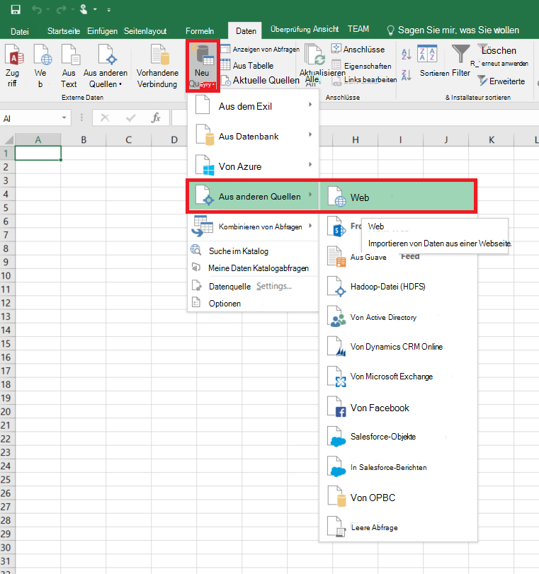
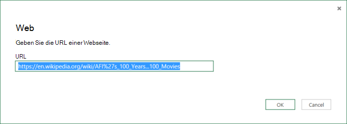
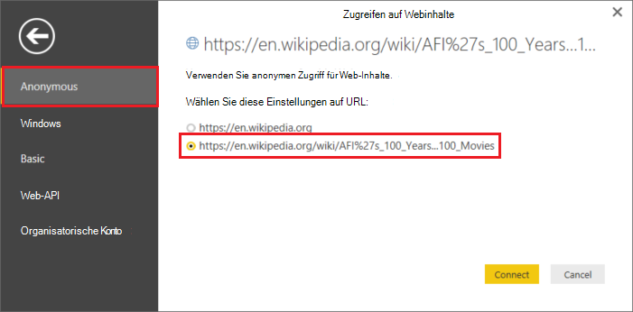
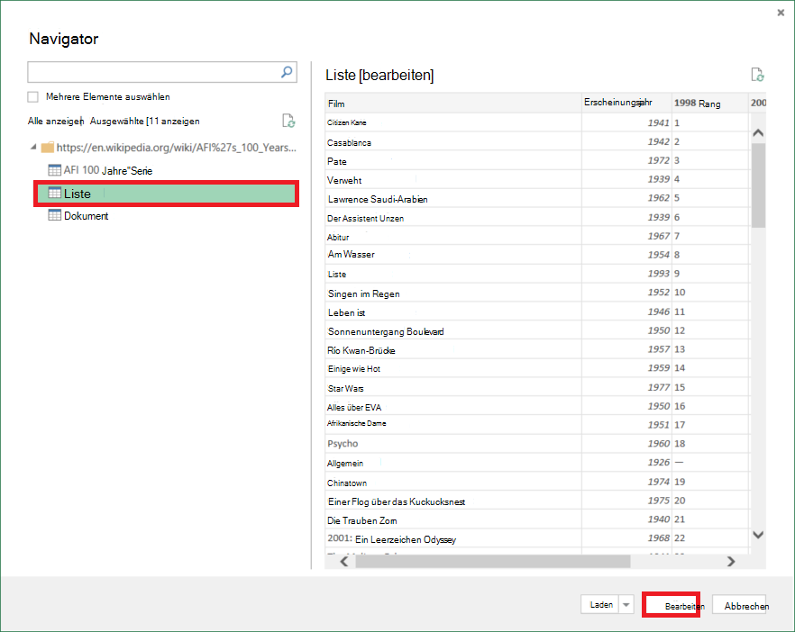
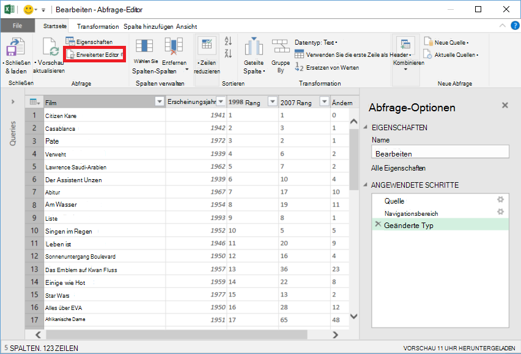
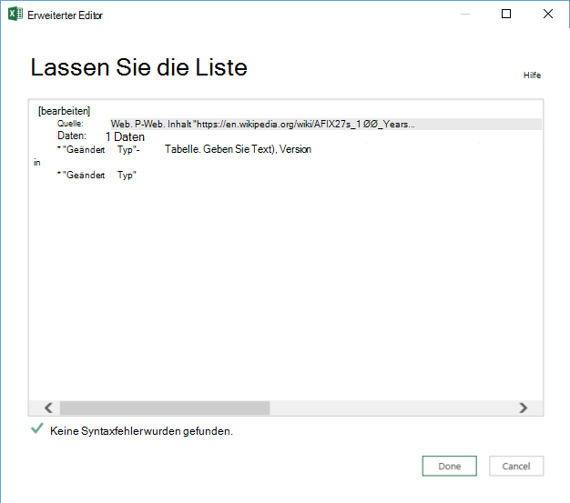

<properties 
    pageTitle="Verschieben von Daten von Tabelle | Azure Data Factory" 
    description="Enthält Informationen zum Verschieben von Daten von lokalen Tabelle auf einer Webseite mithilfe von Azure Data Factory." 
    services="data-factory" 
    documentationCenter="" 
    authors="linda33wj" 
    manager="jhubbard" 
    editor="monicar"/>

<tags 
    ms.service="data-factory" 
    ms.workload="data-services" 
    ms.tgt_pltfrm="na" 
    ms.devlang="na" 
    ms.topic="article" 
    ms.date="09/26/2016" 
    ms.author="jingwang"/>

# Verschieben von Daten von einer Tabelle Webquelle mit Azure Data Factory
Dieser Artikel beschreibt, wie Kopieraktivität in einer Azure Daten verwenden, Daten aus einer Tabelle in eine Webseite in einem anderen Datenspeicher kopiert. Dieser Artikel baut auf [Datenaktivitäten](data-factory-data-movement-activities.md) Artikel stellt eine allgemeine Übersicht über Daten kopieren und unterstützten Speicher-Kombinationen.

Kein Verschieben von Daten aus anderen Daten zu einer Tabelle Webziele speichert Data Factory unterstützt derzeit nur Daten aus einer Webtabelle in anderen Datenspeichern.

> [AZURE.NOTE] Dieses Web Connector unterstützt derzeit nur Inhalt aus einer HTML-Seite extrahieren.

## Beispiel: Daten aus Web-Tabelle in Azure Blob

Das folgende Beispiel zeigt:

1.  Eine verknüpfte Dienst vom Typ [Web](#web-linked-service-properties).
2.  Eine verknüpfte Dienst vom Typ [AzureStorage](data-factory-azure-blob-connector.md#azure-storage-linked-service-properties).
3.  Ein Eingabe- [Dataset](data-factory-create-datasets.md) vom Typ [WebTable](#WebTable-dataset-properties).
4.  Ein Ausgabe- [Dataset](data-factory-create-datasets.md) vom Typ [AzureBlob](data-factory-azure-blob-connector.md#azure-blob-dataset-type-properties).
4.  Eine [Pipeline](data-factory-create-pipelines.md) mit kopieren, die [WebSource](#websource-copy-activity-type-properties) und [BlobSink](data-factory-azure-blob-connector.md#azure-blob-copy-activity-type-properties)verwendet.

Das Beispiel Kopiervorgang aus ein Azure BLOB stündlich. In diesen Beispielen verwendeten JSON-Eigenschaften werden in Abschnitten nach den Beispielen beschrieben. 

Im folgende Beispiel veranschaulicht, wie Daten aus ein Azure BLOB kopiert. Allerdings können Daten direkt in die Senken im Artikel [Datenaktivitäten](data-factory-data-movement-activities.md) mithilfe der Kopieraktivität in Azure Data Factory angegeben kopiert werden. 

**Web Service verknüpft** Dieses Beispiel verwendet den Webdienst verknüpft mit der anonymen Authentifizierung. [Verknüpfte Web Service](#web-linked-service-properties) Siehe für verschiedene Arten der Authentifizierung können. 

    {
        "name": "WebLinkedService",
        "properties":
        {
            "type": "Web",
            "typeProperties":
            {
                "authenticationType": "Anonymous",
                "url" : "https://en.wikipedia.org/wiki/"
            }
        }
    }

**Azure verknüpft Speicherdienst**

    {
      "name": "AzureStorageLinkedService",
      "properties": {
        "type": "AzureStorage",
        "typeProperties": {
          "connectionString": "DefaultEndpointsProtocol=https;AccountName=<accountname>;AccountKey=<accountkey>"
        }
      }
    }

**WebTable Eingabedatasets** **Externe** auf **true** festlegen informiert Daten Factorydienst Dataset Data Factory ist und nicht durch eine Aktivität im Werk Daten erzeugt.

> [AZURE.NOTE] [Index einer Tabelle in einer HTML-Seite erhalten](#get-index-of-a-table-in-an-html-page) Siehe Schritte zum Abrufen der Index einer Tabelle in einer HTML-Seite.  

    
    {
        "name": "WebTableInput",
        "properties": {
            "type": "WebTable",
            "linkedServiceName": "WebLinkedService",
            "typeProperties": {
                "index": 1,
                "path": "AFI's_100_Years...100_Movies"
            },
            "external": true,
            "availability": {
                "frequency": "Hour",
                "interval":  1
            }
        }
    }

**Azure Blob Ausgabe dataset**

Jede Stunde Daten in ein neues Blob geschrieben (Häufigkeit: Stunde, Intervall: 1). 

    {
        "name": "AzureBlobOutput",
        "properties":
        {
            "type": "AzureBlob",
            "linkedServiceName": "AzureStorageLinkedService",
            "typeProperties":
            {
                "folderPath": "adfgetstarted/Movies"
            },
            "availability":
            {
                "frequency": "Hour",
                "interval": 1
            }
        }
    }

**Pipeline mit Kopieren**

Die Pipeline enthält eine Aktivität kopieren, die die obigen Eingabe und Ausgabe Datasets konfiguriert und stündlich ausgeführt werden soll. In JSON-Definition Rohrleitung soll **des Typs** **WebSource** und **BlobSink** **Senke** Typ festgelegt ist. 

Finden Sie eine Liste der Eigenschaften, die WebSource unterstützt [WebSource Eigenschaften](#websource-copy-activity-type-properties) . 
    
    {  
        "name":"SamplePipeline",
        "properties":{  
        "start":"2014-06-01T18:00:00",
        "end":"2014-06-01T19:00:00",
        "description":"pipeline with copy activity",
        "activities":[  
          {
            "name": "WebTableToAzureBlob",
            "description": "Copy from a Web table to an Azure blob",
            "type": "Copy",
            "inputs": [
              {
                "name": "WebTableInput"
              }
            ],
            "outputs": [
              {
                "name": "AzureBlobOutput"
              }
            ],
            "typeProperties": {
              "source": {
                "type": "WebSource"
              },
              "sink": {
                "type": "BlobSink"
              }
            },
           "scheduler": {
              "frequency": "Hour",
              "interval": 1
            },
            "policy": {
              "concurrency": 1,
              "executionPriorityOrder": "OldestFirst",
              "retry": 0,
              "timeout": "01:00:00"
            }
          }
          ]
       }
    }

## Eigenschaften des verknüpften Web

Die folgende Tabelle beschreibt für JSON-Elemente für verknüpfte Webdienst.

| Eigenschaft | Beschreibung | Erforderlich |
| -------- | ----------- | -------- | 
| Typ | Die Type-Eigenschaft muss auf festgelegt sein: **Web** | Ja | 
| URL | URL für Internetfavoriten | Ja |
| Read | Anonyme oder Standard. | Ja |
| Benutzername | Benutzername für Standardauthentifizierung. | Ja (Standardauthentifizierung)
| Kennwort | Kennwort für die Standardauthentifizierung. | Ja (Standardauthentifizierung)

### Anonyme Authentifizierung

    {
        "name": "web",
        "properties":
        {
            "type": "Web",
            "typeProperties":
            {
                "authenticationType": "Anonymous",
                "url" : "https://en.wikipedia.org/wiki/"
            }
        }
    }

### Standardauthentifizierung verwenden
    
    {
        "name": "web",
        "properties":
        {
            "type": "Web",
            "typeProperties":
            {
                "authenticationType": "basic",
                "url" : "http://myit.mycompany.com/",
                "userName": "Administrator",
                "password": "password"
            }
        }
    }

## WebTable Dataset-Eigenschaften

Eine vollständige Liste der Abschnitte und Eigenschaften zum Definieren von Datasets finden Sie [Datasets erstellen](data-factory-create-datasets.md) . Abschnitte wie Struktur, Verfügbarkeit und Richtlinien eines Datasets JSON sind für alle Dataset-Typen (Azure SQL, Azure Blob Azure Tabelle usw..).

Die **TypeProperties** unterscheidet sich für jeden Datensatz und enthält Informationen über den Speicherort der Daten in den Datenspeicher. TypeProperties Abschnitt Dataset vom Typ **WebTable** hat die folgenden Eigenschaften

Eigenschaft | Beschreibung | Erforderlich
:-------- | :----------- | :--------
Typ    | Typ des Datasets. muss auf **WebTable** festgelegt werden | Ja
Pfad | Eine relative URL der Ressource, die die Tabelle enthält. | Nein. Wenn der Pfad nicht angegeben ist, wird in der verknüpften Dienstdefinition angegebene URL verwendet. 
Index | Der Index der Tabelle in der Ressource. [Index einer Tabelle in einer HTML-Seite erhalten](#get-index-of-a-table-in-an-html-page) Siehe Schritte zum Abrufen der Index einer Tabelle in einer HTML-Seite. | Ja

**Beispiel:**

    {
        "name": "WebTableInput",
        "properties": {
            "type": "WebTable",
            "linkedServiceName": "WebLinkedService",
            "typeProperties": {
                "index": 1,
                "path": "AFI's_100_Years...100_Movies"
            },
            "external": true,
            "availability": {
                "frequency": "Hour",
                "interval":  1
            }
        }
    }

## WebSource - Eigenschaften Kopieraktivität

Eine vollständige Liste der Eigenschaften für Aktivitäten definieren & Abschnitte finden Sie [Pipelines erstellen](data-factory-create-pipelines.md) . Eigenschaften wie Name, Beschreibung, Eingabe- und Tabellen und Richtlinien sind für alle Aktivitäten verfügbar. 

Eigenschaften im Abschnitt TypeProperties der Aktivität je nach andererseits jeden Aktivitätstyp. Kopie Aktivität variieren abhängig von den Datenquellen und Datensenken.

Derzeit werden die Quelle kopieren Aktivität vom Typ **WebSource**ist, keine zusätzlichen Eigenschaften unterstützt. 

## Index einer Tabelle in einer HTML-Seite zu erhalten

1. Starten Sie **Excel 2016** und wechseln Sie zur Registerkarte **Daten** .  
2. Klicken Sie auf der Symbolleiste auf **Neue Abfrage** , **Aus anderen Quellen** auf, und klicken Sie auf **Im Web**.
    
     
3. Geben Sie im Dialogfeld **Im Web** **URL** in verknüpften Serviceartikel JSON Verwendung (beispielsweise: https://en.wikipedia.org/wiki/) und Sie für das Dataset geben Pfad (z. B.: AFI % 27s_100_Years... 100_Movies), und klicken Sie auf **OK**. 

     

    In diesem Beispiel verwendete URL: https://en.wikipedia.org/wiki/AFI%27s_100_Years...100_Movies 
4.  Wenn **Access Webinhalt** -Dialogfeld angezeigt wird, wählen Sie die richtige **URL**, **Authentifizierung**und auf **Verbinden**. 

    
5.  Klicken Sie auf eine **Tabelle** Element in der Strukturansicht zu Inhalt aus der Tabelle unten auf die Schaltfläche **Bearbeiten** .  

     

5. Klicken Sie im **Abfrage-Editor** -Fenster auf **Erweiterter Editor** -Schaltfläche auf der Symbolleiste.

    

6. Im Dialogfeld Erweiterte Editor wird die Zahl neben "Quelle" den Index.

     

Mithilfe von Excel 2013 verwenden Sie [Microsoft Power Query für Excel](https://www.microsoft.com/download/details.aspx?id=39379) zum Abrufen des Index. Finden Sie [mit einer Webseite verbinden](https://support.office.com/article/Connect-to-a-web-page-Power-Query-b2725d67-c9e8-43e6-a590-c0a175bd64d8) Artikel Weitere Informationen. Die beschriebenen Schritte verwenden [Microsoft Power BI Desktop](https://powerbi.microsoft.com/desktop/). 

[AZURE.INCLUDE [data-factory-column-mapping](../../includes/data-factory-column-mapping.md)]

[AZURE.INCLUDE [data-factory-structure-for-rectangualr-datasets](../../includes/data-factory-structure-for-rectangualr-datasets.md)]

## Leistung und Optimierung  
Siehe [Aktivität Leistung & Tuning Guide](data-factory-copy-activity-performance.md) Kennenlernen Schlüsselfaktoren, Auswirkung Leistung des Datentransfers (Kopieraktivität) in Azure Data Factory und verschiedene Methoden zum optimieren.
