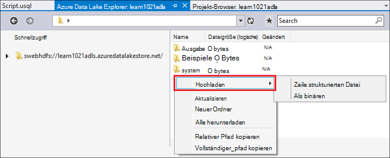
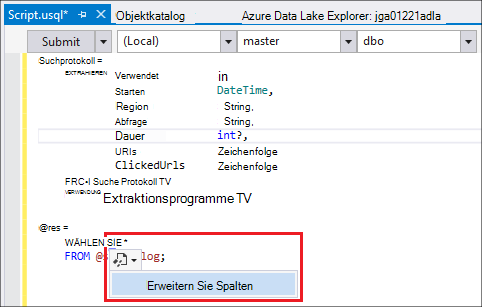
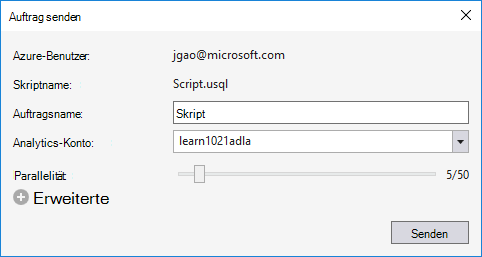
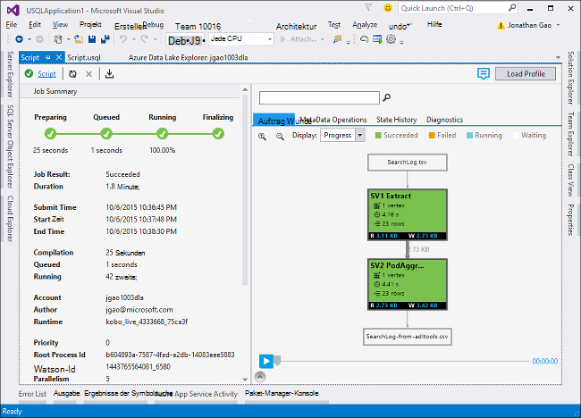
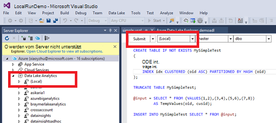

<properties
   pageTitle="U-SQL-Skripts mit Daten See Tools für Visual Studio entwickeln | Azure"
   description="Informationen Sie zum Installieren Daten See Tools für Visual Studio entwickeln und U-SQL-Skripts. "
   services="data-lake-analytics"
   documentationCenter=""
   authors="edmacauley"
   manager="jhubbard"
   editor="cgronlun"/>

<tags
   ms.service="data-lake-analytics"
   ms.devlang="na"
   ms.topic="get-started-article"
   ms.tgt_pltfrm="na"
   ms.workload="big-data"
   ms.date="05/16/2016"
   ms.author="edmaca"/>

# Lernprogramm: Entwickeln Sie U-SQL-Skripts mit Daten See Tools für Visual Studio

[AZURE.INCLUDE [get-started-selector](../../includes/data-lake-analytics-selector-get-started.md)]

Informationen Sie zu Data Lake-Tools für Visual Studio installieren Data Lake-Tools für Visual Studio schreiben und Testen von U-SQL-Skripts.

U-SQL ist eine hyper skalierbaren, hochgradig erweiterbare Sprache zur Vorbereitung, Transformieren und Analysieren von Daten-See und darüber hinaus alle Daten. Weitere Informationen finden Sie unter U-SQL Reference (http://go.microsoft.com/fwlink/p/?LinkId=691348).

##Erforderliche Komponenten

- **Visual Studio 2015, Visual Studio 2013 aktualisieren 4 oder Visual Studio 2012. Professional Community Editionen unterstützten Enterprise (Ultimate/Premium); Express Edition wird nicht unterstützt. Visual Studio "15" wird derzeit nicht unterstützt, und wir arbeiten daran.**
- **Microsoft Azure SDK für .NET Version 2.7.1 oder höher**.  Installieren Sie mit dem [Webplattform-Installer](http://www.microsoft.com/web/downloads/platform.aspx).
- **[Data Lake-Tools für Visual Studio](http://aka.ms/adltoolsvs)**.

    Sobald Daten See Tools für Visual Studio installiert ist, sehen Sie einen "Datenanalyse See" Knoten im Server-Explorer unter dem Knoten "Azure" (Sie können Server-Explorer öffnen Sie durch Drücken von STRG + Alt + S).

- **Die folgenden zwei Abschnitte unter [Erste Schritte mit Azure Data Lake Analytics Azure-Portal](data-lake-analytics-get-started-portal.md)**.

    - [Azure Data Lake Analytics Konto erstellen](data-lake-analytics-get-started-portal.md#create_adl_analytics_account).
    - [SearchLog.tsv auf See Datenspeicher Standardkonto hochladen](data-lake-analytics-get-started-portal.md#update-data-to-the-default-adl-storage-account).

    Der Einfachheit halber ein PowerShell-Beispielskript für analytische Daten See Dienst erstellen und Hochladen der Datei [Vorbereiten auf das Lernprogramm Appx-A PowerShell-Beispiel](data-lake-analytics-data-lake-tools-get-started.md#appx-a-powershell-sample-for-preparing-the-tutorial)entnehmen.

    Die See-Tools unterstützen nicht erstellen See Datenanalyse Konten. Sie müssen also mit Azure-Portal Azure PowerShell, .NET SDK oder Azure CLI erstellen. Zum Ausführen eines Auftrags See Datenanalyse benötigen Sie einige Daten. Obwohl die See Tools Hochladen von Daten unterstützt, verwenden Sie das Portal die Beispieldaten zu diesem Lernprogramm leichter hochladen.

## Verbinden mit Azure

**Verbindung mit dem Datenanalyse**

1. Öffnen Sie Visual Studio.
2. Klicken Sie im Menü **Ansicht** auf **Server-Explorer** öffnen Sie Server-Explorer. Oder drücken Sie die **[STRG] + [ALT] + S**.
3. Maustaste auf **Azure**, klicken Sie auf "Verbindung zum Microsoft Azure-Abonnement" und folgen.
4. **Server-Explorer**erweitern Sie **Azure**, und dann **See Datenanalyse**. Sie werden Ihre Datenanalyse See Kontenliste finden gibt. Sie können nicht von Visual Studio See Datenanalyse Konten erstellen. Zum Erstellen eines Kontos finden Sie unter [Erste Schritte mit Azure Data Lake Analytics Azure-Portal verwenden](data-lake-analytics-get-started-portal.md) oder [Erste Schritte mit Azure Data Lake Analytics Azure PowerShell verwenden](data-lake-analytics-get-started-powershell.md).

## Quelldatendateien hochladen

Sie haben einige Daten im Abschnitt **erforderliche** zuvor in diesem Lernprogramm hochgeladen.  

Falls Sie eigene Daten verwenden möchten, sind hier die Vorgehensweise zum Hochladen von Daten aus dem Datentools.

**Zum Hochladen von Dateien auf das abhängige Azure Data Lake**

1. **Server-Explorer**erweitern Sie nacheinander **Azure**, **See Datenanalyse**, erweitern Sie Ihr Konto See Datenanalyse und **Speicherkonten**. Standardkonto See Datenspeicher und verknüpften Daten See Speicherkonten und verknüpften Azure-Speicherkonten sehen. Das Standardkonto Daten See hat eine Bezeichnung "Standardkonto Storage".
2. Maustaste auf See Datenspeicher Standardkonto und klicken Sie dann auf **Explorer**.  Die See-Tools für Visual Studio-Explorer-Fenster geöffnet.  Links zeigt einer Strukturansicht die Inhaltsansicht auf der rechten Seite ist.
3. Suchen Sie den Ordner, in dem Sie Dateien hochladen möchten,
4. Mit der rechten Maustaste in eines leeren Bereich und dann auf **Hochladen**.

    

**Upload von Dateien in eine verknüpfte Azure BLOB-Speicher-Konto**

1. **Server-Explorer**erweitern Sie nacheinander **Azure**, **See Datenanalyse**, erweitern Sie Ihr Konto See Datenanalyse und **Speicherkonten**. Standardkonto See Datenspeicher und verknüpften Daten See Speicherkonten und verknüpften Azure-Speicherkonten sehen.
2. Erweitern Sie das Azure-Speicher-Konto.
3. Maustaste auf den Container, in dem Sie Dateien hochladen möchten, und klicken Sie auf **Explorer**. Wenn einen Container besitzen, müssen Sie mit Azure-Portal, Azure PowerShell oder andere Tools erstellen.
4. Suchen Sie den Ordner, in dem Sie Dateien hochladen möchten,
5. Mit der rechten Maustaste in eines leeren Bereich und dann auf **Hochladen**.

## Entwickeln Sie U-SQL-Skripts

Datenanalyse See Aufträge werden in der U-SQL-Sprache geschrieben. Über U-SQL finden Sie unter [Erste Schritte mit U-SQL-Sprache](data-lake-analytics-u-sql-get-started.md) und [U-SQL Referenzhandbuch](http://go.microsoft.com/fwlink/?LinkId=691348).

**Zum Erstellen und Übermitteln eines Auftrags See Datenanalyse**

1. Klicken Sie im Menü **Datei** auf **neu**und klicken Sie auf **Projekt**.
2. **U-SQL** Projekttyp ausgewählt.

    

3. Klicken Sie auf **OK**. Visual Studio erstellt eine Lösung mit einer **Script.usql** -Datei.
4. Geben Sie das folgende Skript in **Script.usql**.

        @searchlog =
            EXTRACT UserId          int,
                    Start           DateTime,
                    Region          string,
                    Query           string,
                    Duration        int?,
                    Urls            string,
                    ClickedUrls     string
            FROM "/Samples/Data/SearchLog.tsv"
            USING Extractors.Tsv();

        @res =
            SELECT *
            FROM @searchlog;        

        OUTPUT @res   
            TO "/Output/SearchLog-from-Data-Lake.csv"
        USING Outputters.Csv();

    Dieses U-SQL-Skript liest die Quelldatei mit **Extractors.Tsv()**und erstellt eine CSV-Datei mit **Outputters.Csv()**.

    Ändern Sie nicht die beiden Pfade, sofern Sie die Quelldatei in einen anderen Speicherort kopiert.  Datenanalyse See erstellt den Ausgabeordner existiert nicht.

    Es ist einfacher, relative Pfade für Dateien im See Konten Daten. Sie können auch absolute Pfade.  Zum Beispiel

        adl://<Data LakeStorageAccountName>.azuredatalakestore.net:443/Samples/Data/SearchLog.tsv

    Zugriff auf Dateien im verknüpften Speicherkonten müssen Sie absolute Pfade verwenden.  Die Syntax für Dateien verknüpfte Azure Storage-Konto lautet:

        wasb://<BlobContainerName>@<StorageAccountName>.blob.core.windows.net/Samples/Data/SearchLog.tsv

    >[AZURE.NOTE] Azure BLOB-Container mit öffentlichen Blobs oder öffentlichen Container Berechtigungen werden derzeit nicht unterstützt.  

    Beachten Sie Folgendes:

    - **IntelliSense**

        Name automatisch abgeschlossen und die Mitglieder Rowset, Datenbanken, Schemas und Benutzer definierten Objekten (UDOs) angezeigt.

        IntelliSense für Katalog-Entitäten (Datenbanken, Schemas, Tabellen, UDOs usw.) die Compute-Konto verknüpft ist. Sie können aktuelle aktive Compute-Konto, Datenbank und Schema in der oberen Symbolleiste überprüfen und über die Dropdown-Listen wechseln.

    - *Spalten *Einblenden***

        Klicken Sie auf rechts *, sehen Sie eine blaue Unterstreichung der *. Bewegen Sie den Mauszeiger auf die blaue Unterstreichung, und klicken Sie auf den Pfeil nach unten.
        

        Klicken Sie auf **Spalten erweitern**das Tool ersetzt den * mit den Spaltennamen.

    - **Automatische Formatierung**

        Benutzer können den Einzug ändern, basierend auf dem Code U-SQL-Skript-Struktur Bearbeiten > erweitert:

        - Dokument (STRG + E, D) Format: Formatiert das gesamte Dokument   
        - Auswahl formatieren (STRG + K, STRG + F): Die Markierung formatiert. Keine Auswahl getroffen wurde, formatiert diese Verknüpfung Zeile ist Cursor.  

        Alle die Formatierungsregeln sind konfigurierbar unter Extras -> Optionen -> Text Editor - > SIP -> Formatierung.  
    - **Intelligenter Einzug**

        Data Lake-Tools für Visual Studio kann Ausdrücke automatisch Einzug beim Schreiben von Skripts. Dieses Feature ist standardmäßig deaktiviert, müssen Benutzer über U Prüfung aktivieren-SQL -> Optionen und -> Optionen -> intelligenten Einzug aktivieren.

    - **Gehe zu Definition und alle Verweise suchen**

        Auf den Namen des Rowsets/Parameter/Spalte/UDO usw. und auf Gehe zu Definition (F12) ermöglicht das Navigieren zu der Definition. Auf alle Verweise suchen (UMSCHALT + F12) zeigen alle Verweise.

    - **Azure Pfad einfügen**

        Erinnern Azure Pfad und Typ manuell, wenn Skripts, Daten See Tools für Visual Studio bietet eine einfache Möglichkeit: mit der rechten Maustaste im Editor, klicken Sie auf Azure Pfad einfügen. Navigieren Sie zu der Datei im Dialogfeld Azure BLOB-Browser. Klicken Sie auf **OK**. der Pfad wird in den Code eingefügt.

5. Geben Sie Konto See Datenanalyse, Datenbank und Schema. Sie können **(lokal)** zum Ausführen des Skripts lokal testen dafür auswählen. Weitere Informationen finden Sie unter [U-SQL ausführen lokal](#run-u-sql-locally).

    

    Weitere Informationen finden Sie unter [verwenden U-SQL-Katalog](data-lake-analytics-use-u-sql-catalog.md).

5. **Projektmappen-Explorer**mit der rechten Maustaste **Script.usql**und dann auf **Skript erstellen**. Überprüfen Sie die Ergebnisse im Ausgabebereich.
6. **Projektmappen-Explorer**mit der rechten Maustaste **Script.usql**und dann auf **Skript senden**. Optional können Sie **Senden** Script.usql Fenster klicken.  Finden Sie in der vorherigen Abbildung.  Klicken Sie auf den Pfeil nach unten neben der Schaltfläche Senden senden erweiterte Optionen verwenden:
7. **Auftragsname**angeben **Analytics Konto**überprüfen Sie, und klicken Sie auf **Senden**. Übermittlung Ergebnisse und Auftrag Link stehen in die See-Tools für Visual Studio-Fenster, wenn die Übermittlung abgeschlossen ist.

    

8. Sie müssen die Schaltfläche Aktualisieren, um die aktuellen Auftragsstatus und Aktualisieren des Bildschirms klicken. Wann wird Erfolge Auftrag **Auftrag Graph** **Metadatenoperationen**, **Geschichte**, **Diagnose**angezeigt:

    

    * Job-Zusammenfassung. Die Zusammenfassung des aktuellen Auftrags z.B. anzeigen: Status, Fortschritt, Ausführungszeit, Runtime Name usw. Absender.   
    * Auftragsdetails. Ausführliche Informationen zu diesen Auftrag wird bereitgestellt, einschließlich Skript Ressource Scheitelpunkt Ausführung anzeigen.
    * Job-Diagramm. Vier Diagramme werden bereitgestellt, um den Auftrag Informationen visuell darzustellen: Fortschritt gelesenen Daten Daten, Ausführung, durchschnittliche Zeit pro Knoten, Eingabe Durchsatz, Durchsatz Ausgabe.
    * Metadatenoperationen. Es zeigt die Metadatenoperationen.
    * Status Geschichte.
    * Diagnose. Data Lake-Tools für Visual Studio diagnostiziert Auftragsausführungsergebnisse automatisch. Alerts erhalten, wenn einige Fehler Performance-Probleme in ihrer Arbeit oder. Siehe Auftrag Teil Diagnose (Link TBD) Weitere Informationen.

**Auftragsstatus überprüfen**

1. Im Server-Explorer erweitern Sie **Azure**, **See Datenanalyse**, See Datenanalyse-Kontoname
2. Doppelklicken Sie auf **Aufträge** die Aufträge auflisten.
2. Klicken Sie auf einen Auftrag, um den Status anzuzeigen.

**Die Auftragsausgabe an**

1. **Server-Explorer** **Azure**erweitern **See Datenanalyse**zu erweitern, erweitern Sie Ihr Konto See Datenanalyse, **Speicherkonten**, Maustaste das Standardkonto See Datenspeicher und anschließend klicken Sie auf **Explorer**.
2.  Doppelklicken Sie auf **Ausgabe** , um den Ordner zu öffnen
3.  Doppelklicken Sie auf **SearchLog von adltools.csv**.

###Job-Wiedergabe

Auftrag Wiedergabe kann Auftrag-Ausführungsstatus und visuell Leistung Anomalien und Engpässe erkennen. Dieses Feature kann verwendet werden, bevor der Auftrag abgeschlossen ist (d. h. während der Zeit, die der Einzelvorgang aktiv ausgeführt wird) die Ausführung als auch nach Abschluss die Ausführung. Wiedergabe während der Ausführung des Auftrags ausführen ermöglicht den Benutzer den Fortschritt bis zum aktuellen Zeitpunkt wiederzugeben.

**Auftrag-Ausführungsstatus anzeigen**  

1. Klicken Sie in der oberen rechten Ecke auf **Auslastungsprofil** . Siehe vorherigen Screenshot.
2. Klicken Sie auf die Schaltfläche Wiedergabe auf der unteren linken Ecke Ausführungsfortschritt Auftrag überprüfen.
3. Klicken Sie während der Wiedergabe auf **Pause** beenden oder die Statusanzeige direkt an bestimmte Positionen ziehen.

###Heatmap

Daten See Tools für Visual Studio bietet wählbaren Farbe-Overlays auf Auftrag an, Status Daten i/o Ausführungszeit, e/a-Durchsatz der einzelnen Phasen. Dadurch können Benutzer potenzielle Probleme und Verteilung der Auftragseigenschaften direkt und intuitiv herausfinden. Sie können eine Datenquelle aus der Dropdown Liste angezeigt.  

## U-SQL lokal ausführen

Mit der U-SQL lokale Ausführung in Visual Studio können Sie:

- U-SQL-Skripts, mit C# Assemblys ausgeführt.
- Debuggen Sie C# Assemblys lokal.
- Erstellen/Löschen/anzeigen lokale Datenbanken, Assemblys, Schemas und Tabellen im Server-Explorer wie möglich für Azure Data Lake Analytics-Dienst.

Sehen Sie ein *Lokales* Konto in Visual Studio und das Installationsprogramm erstellt eine *DataRoot* Ordner *C:\LocalRunRoot*befindet. DataRoot Ordner verwendet:

- Speicher Metadaten einschließlich Tabellen, Datenbanken, TVFs usw..
- Für ein bestimmtes Skript: ein relativer Pfad in e/a-Pfade verwiesen wird, werden wir die DataRoot (sowie der Skriptpfad It Eingabe des)
- DataRoot Ordner wird nicht verwiesen werden, wenn Sie eine Assembly registrieren und einen relativen Pfad verwenden möchten (siehe "Use Assemblies dabei lokale Ausführen" für Weitere Informationen)

Das folgende Video zeigt die lokale Ausführen U-SQL-Funktion:

>[AZURE.VIDEO usql-localrun]

### Bekannte Probleme und Grenzen

- Kann keine Tabelle/DB usw. im Server-Explorer für das lokale Konto erstellen.
- Wenn ein relativer Pfad verweist:

    - Skript-Eingabe (EXTRAHIEREN * von "/ Pfad Abc")-DataRoot Pfad und den Pfad durchsucht.
    - In Ausgabe (OUTPUT TO "Pfad/Abc"): als Ausgabeordner DataRoot Pfad verwendet werden.
    - Bei Assemblyregistrierung (CREATE ASSEMBLY Xyz aus "/ Pfad Abc"): der Pfad wird durchsucht, aber nicht die DataRoot.
    - TVF-Ansicht oder anderen Metadaten Personen angemeldet: DataRoot Pfad wird durchsucht, aber nicht den Pfad.

    Skripts für Daten See Dienst ausgeführt, das Standardkonto Speicher wird als Stammordner verwendet entsprechend durchsucht.

### U-SQL lokal Testskripts
Informationen zum Entwickeln von U-SQL-Skripts finden Sie unter [entwickeln U-SQL-Skripts](#develop-and-test-u-sql-scripts). Erstellen und Ausführen von U-SQL Skripts, wählen Sie in der Liste Cluster **(lokal)** und klicken Sie auf **Senden**. Sicherstellen der richtigen Daten verwiesen wird - entweder finden Sie in den absoluten Pfad oder Ordner DataRoot platziert.

Sie können auch mit der rechten Maustaste ein Skript und dann klicken Sie im Kontextmenü auf **Lokalen Plan ausführen** oder Trigger lokaler Testlauf **STRG + F5** drücken.

### Verwenden von Assemblys in lokaler Testlauf

Gibt es zwei Verfahren zum Ausführen von benutzerdefinierten C#-Dateien:

- Assemblys in der CodeBehind-Datei schreiben und die Assemblys automatisch registriert und anschließend das Skript gelöscht.
- Erstellen Sie ein C#-Assemblyprojekt und lokalen Konto über ein Skript wie unten registrieren Sie Ausgabe. Beachten Sie, dass der Pfad des Skripts als DataRoot Ordner ist.

### Debuggen von Skripts und C# Assemblys lokal

C#-Assemblys zu debuggen senden und zur Azure Data Lake Analytics Service registriert. Sie können Haltepunkte sowohl die CodeBehind-Datei und einem verwiesen wird C#-Projekt festlegen.

**Lokalen Code im CodeBehind-Datei Debuggen**
1.  Haltepunkte in der CodeBehind-Datei.
2.  Drücken Sie **F5** , um das Skript lokal debuggen.

Das folgende Verfahren funktioniert nur in Visual Studio 2015. In älteren Visual Studio müssen Sie manuell die Pdb-Dateien.

**Lokalen Code in einem verwiesen wird C#-Projekt debuggen**
1.  Erstellen Sie eines C#-Assembly und erstellen Sie, um die Ausgabe-Dll generieren.
2.  Registrieren Sie die Dll mit einer U-SQL-Anweisung:

        CREATE ASSEMBLY assemblyname FROM @"..\..\path\to\output\.dll";
3.  Haltepunkte in C#-Code.
4.  Drücken Sie **F5** , um das Skript mit die C#-DLL lokal debuggen.  

##Siehe auch

Zunächst mit See Datenanalyse mit anderen Tools finden Sie unter:

- [Erste Schritte mit See Datenanalyse mit Azure-portal](data-lake-analytics-get-started-portal.md)
- [Erste Schritte mit See Datenanalyse mithilfe von Azure PowerShell](data-lake-analytics-get-started-powershell.md)
- [Erste Schritte mit See Datenanalyse mit .NET SDK](data-lake-analytics-get-started-net-sdk.md)
- [Debuggen von C#-Code in U-SQL-Aufträge](data-lake-analytics-debug-u-sql-jobs.md)

Um weitere Themen anzuzeigen:

- [Analysieren Sie Weblogs mithilfe See Datenanalyse](data-lake-analytics-analyze-weblogs.md)
- [Entwickeln Sie U-SQL-Skripts mit Daten See Tools für Visual Studio](data-lake-analytics-data-lake-tools-get-started.md)
- [Erste Schritte mit Azure Data Lake Analytics U-SQL-Sprache](data-lake-analytics-u-sql-get-started.md)
- [Entwickeln Sie U-SQL benutzerdefinierte Operatoren für Datenanalysen See Projekte](data-lake-analytics-u-sql-develop-user-defined-operators.md)

##CA-PowerShell Mustermann zum Vorbereiten des Lernprogramms

PowerShell-Skript bereitet ein Azure Data Lake Analytics-Konto und die Quelldaten, So [Entwickeln U-SQL](data-lake-analytics-data-lake-tools-get-started.md#develop-u-sql-scripts)-Skripts zu überspringen.

    #region - used for creating Azure service names
    $nameToken = "<Enter an alias>"
    $namePrefix = $nameToken.ToLower() + (Get-Date -Format "MMdd")
    #endregion

    #region - service names
    $resourceGroupName = $namePrefix + "rg"
    $dataLakeStoreName = $namePrefix + "adas"
    $dataLakeAnalyticsName = $namePrefix + "adla"
    $location = "East US 2"
    #endregion

    # Treat all errors as terminating
    $ErrorActionPreference = "Stop"

    #region - Connect to Azure subscription
    Write-Host "`nConnecting to your Azure subscription ..." -ForegroundColor Green
    try{Get-AzureRmContext}
    catch{Login-AzureRmAccount}
    #endregion

    #region - Create an Azure Data Lake Analytics service account
    Write-Host "Create a resource group ..." -ForegroundColor Green
    New-AzureRmResourceGroup `
        -Name  $resourceGroupName `
        -Location $location

    Write-Host "Create a Data Lake account ..."  -ForegroundColor Green
    New-AzureRmDataLakeStoreAccount `
        -ResourceGroupName $resourceGroupName `
        -Name $dataLakeStoreName `
        -Location $location

    Write-Host "Create a Data Lake Analytics account ..."  -ForegroundColor Green
    New-AzureRmDataLakeAnalyticsAccount `
        -Name $dataLakeAnalyticsName `
        -ResourceGroupName $resourceGroupName `
        -Location $location `
        -DefaultDataLake $dataLakeStoreName

    Write-Host "The newly created Data Lake Analytics account ..."  -ForegroundColor Green
    Get-AzureRmDataLakeAnalyticsAccount `
        -ResourceGroupName $resourceGroupName `
        -Name $dataLakeAnalyticsName  
    #endregion

    #region - prepare the source data
    Write-Host "Import the source data ..."  -ForegroundColor Green
    $localFolder = "C:\Tutorials\Downloads\" # A temp location for the file.
    $storageAccount = "adltutorials"  # Don't modify this value.
    $container = "adls-sample-data"  #Don't modify this value.

    # Create the temp location  
    New-Item -Path $localFolder -ItemType Directory -Force

    # Download the sample file from Azure Blob storage
    $context = New-AzureStorageContext -StorageAccountName $storageAccount -Anonymous
    $blobs = Azure\Get-AzureStorageBlob -Container $container -Context $context
    $blobs | Get-AzureStorageBlobContent -Context $context -Destination $localFolder

    # Upload the file to the default Data Lake Store account    
    Import-AzureRmDataLakeStoreItem -AccountName $dataLakeStoreName -Path $localFolder"SearchLog.tsv" -Destination "/Samples/Data/SearchLog.tsv"

    Write-Host "List the source data ..."  -ForegroundColor Green
    Get-AzureRmDataLakeStoreChildItem -Account $dataLakeStoreName -Path  "/Samples/Data/"
    #endregion
