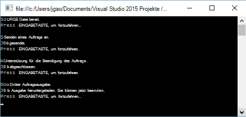

<properties 
   pageTitle="Erste Schritte mit Azure Data Lake Analytics mit .NET SDK | Azure" 
   description="Lernen mit .NET SDK See Datenspeicher Konten, See Datenanalyse Aufträge erstellen und Aufträge in U-SQL geschrieben. " 
   services="data-lake-analytics" 
   documentationCenter="" 
   authors="edmacauley" 
   manager="jhubbard" 
   editor="cgronlun"/>
 
<tags
   ms.service="data-lake-analytics"
   ms.devlang="na"
   ms.topic="hero-article"
   ms.tgt_pltfrm="na"
   ms.workload="big-data" 
   ms.date="10/26/2016"
   ms.author="edmaca"/>

# Lernprogramm: Erste Schritte mit Azure Data Lake Analytics mit .NET SDK

[AZURE.INCLUDE [get-started-selector](../../includes/data-lake-analytics-selector-get-started.md)]

Informationen Sie zum Azure .NET SDK Arbeitsplätze auf See Datenanalyse in [U-SQL](data-lake-analytics-u-sql-get-started.md) geschrieben senden. Weitere Informationen über See Datenanalyse Übersicht [Azure Data Lake Analytics](data-lake-analytics-overview.md).

In diesem Lernprogramm wird eine C#-Konsolenanwendungsprojekt ein U-SQL-Auftrag, der eine Registerkarte liest Werten (TSV) getrennt und konvertiert ihn in eine Datei mit kommagetrennten Werten (CSV) entwickelt. Gleiche Lernprogramm mit unterstützten Tools klicken Sie, die Registerkarten oben in diesem Artikel.

##Erforderliche Komponenten

Bevor Sie dieses Lernprogramm beginnen, müssen Sie Folgendes:

- **Visual Studio 2015, Visual Studio 2013 4 oder Visual C++ installiert Visual Studio 2012 aktualisieren**.
- **Microsoft Azure SDK für .NET Version 2.5 oder höher**.  Installieren Sie mit dem [Webplattform-Installer](http://www.microsoft.com/web/downloads/platform.aspx).
- **Ein Azure Data Lake Analytics-Konto**. Finden Sie unter [Verwalten von See Datenanalyse mit Azure .NET SDK](data-lake-analytics-manage-use-dotnet-sdk.md).

##Erstellen

In diesem Lernprogramm bearbeiten Sie einige Suchprotokolle.  Suchprotokoll kann Daten See Informationsspeicher oder Azure BLOB-Speicher gespeichert werden. 

Ein Beispielprotokoll Suche finden in einem öffentlichen Azure BLOB-Container. In der Anwendung Sie herunterladen Ihrer Arbeitsstation, und Laden Sie die Datei auf See Datenspeicher Standardkonto Ihres Kontos See Datenanalyse.

**U-SQL-Skript erstellen**

Data Lake Analytics Aufträge werden in der U-SQL-Sprache geschrieben. Über U-SQL finden Sie unter [Erste Schritte mit U-SQL-Sprache](data-lake-analytics-u-sql-get-started.md) und [U-SQL Referenzhandbuch](http://go.microsoft.com/fwlink/?LinkId=691348).

Erstellen Sie eine **SampleUSQLScript.txt** -Datei mit dem folgenden U-SQL-Skript, und speichern Sie die Datei in der **C:\temp\* * Pfad.  Der Pfad ist hartcodiert in .NET-Anwendung, die Sie im nächsten Verfahren erstellen.  

    @searchlog =
        EXTRACT UserId          int,
                Start           DateTime,
                Region          string,
                Query           string,
                Duration        int?,
                Urls            string,
                ClickedUrls     string
        FROM "/Samples/Data/SearchLog.tsv"
        USING Extractors.Tsv();
    
    OUTPUT @searchlog   
        TO "/Output/SearchLog-from-Data-Lake.csv"
    USING Outputters.Csv();

Dieses U-SQL-Skript liest die Quelldatei mit **Extractors.Tsv()**und erstellt eine CSV-Datei mit **Outputters.Csv()**. 

In C#-Programm müssen Sie die Datei **/Samples/Data/SearchLog.tsv** , und **/Output/** -Ordner.    

Es ist einfacher, relative Pfade für Dateien im See Konten Daten. Sie können auch absolute Pfade.  Zum Beispiel 

    adl://<Data LakeStorageAccountName>.azuredatalakestore.net:443/Samples/Data/SearchLog.tsv
    
Zugriff auf Dateien im verknüpften Speicherkonten müssen Sie absolute Pfade verwenden.  Die Syntax für Dateien im verknüpften Azure Storage-Konto lautet:

    wasb://<BlobContainerName>@<StorageAccountName>.blob.core.windows.net/Samples/Data/SearchLog.tsv

>[AZURE.NOTE] Es gibt ein bekanntes Problem mit Azure Data Lake Service.  Wenn die Beispiel-app unterbrochen wird oder ein Fehler auftritt, müssen Sie Datenspeicher See & Datenanalyse See Konten löschen, die das Skript erstellt.  Wenn Sie nicht mit dem Azure vertraut sind, wird Guide [Verwalten Azure See Datenanalyse mithilfe von Azure-Portal](data-lake-analytics-manage-use-portal.md) Einstieg.       

**Erstellen eine Anwendung**

1. Öffnen Sie Visual Studio.
2. Erstellen Sie eine C#.
3. Öffnen Sie NuGet-Paket-Verwaltungskonsole, und führen Sie die folgenden Befehle:

        Install-Package Microsoft.Azure.Management.DataLake.Analytics -Pre
        Install-Package Microsoft.Azure.Management.DataLake.Store -Pre
        Install-Package Microsoft.Azure.Management.DataLake.StoreUploader -Pre
        Install-Package Microsoft.Rest.ClientRuntime.Azure.Authentication -Pre
        Install-Package WindowsAzure.Storage

       
5. Fügen Sie in Program.cs den folgenden Code:

        using System;
        using System.IO;
        using System.Collections.Generic;
        using System.Threading;
        using Microsoft.Rest;
        using Microsoft.Rest.Azure.Authentication;
        using Microsoft.Azure.Management.DataLake.Store;
        using Microsoft.Azure.Management.DataLake.StoreUploader;
        using Microsoft.Azure.Management.DataLake.Analytics;
        using Microsoft.Azure.Management.DataLake.Analytics.Models;
        using Microsoft.WindowsAzure.Storage.Blob;

        namespace SdkSample
        {
          class Program
          {
            private const string SUBSCRIPTIONID = "<Enter Your Azure Subscription ID>";
            private const string CLIENTID = "1950a258-227b-4e31-a9cf-717495945fc2";
            private const string DOMAINNAME = "common"; // Replace this string with the user's Azure Active Directory tenant ID or domain name, if needed.

            private static string _adlaAccountName = "<Enter an Existing Data Lake Analytics Account Name>";
            private static string _adlsAccountName = "<Enter the default Data Lake Store Account Name>";

            private static DataLakeAnalyticsAccountManagementClient _adlaClient;
            private static DataLakeStoreFileSystemManagementClient _adlsFileSystemClient;
            private static DataLakeAnalyticsJobManagementClient _adlaJobClient;
        
            private static void Main(string[] args)
            {
                string localFolderPath = @"c:\temp\";

                // Connect to Azure
                var creds = AuthenticateAzure(DOMAINNAME, CLIENTID);

                SetupClients(creds, SUBSCRIPTIONID);

                // Transfer the source file from a public Azure Blob container to Data Lake Store.
                CloudBlockBlob blob = new CloudBlockBlob(new Uri("https://adltutorials.blob.core.windows.net/adls-sample-data/SearchLog.tsv"));
                blob.DownloadToFile(localFolderPath + "SearchLog.tsv", FileMode.Create); // from WASB
                UploadFile(localFolderPath + "SearchLog.tsv", "/Samples/Data/SearchLog.tsv"); // to ADLS
                WaitForNewline("Source data file prepared.", "Submitting a job.");

                // Submit the job
                Guid jobId = SubmitJobByPath(localFolderPath + "SampleUSQLScript.txt", "My First ADLA Job");
                WaitForNewline("Job submitted.", "Waiting for job completion.");

                // Wait for job completion
                WaitForJob(jobId);
                WaitForNewline("Job completed.", "Downloading job output.");

                // Download job output
                DownloadFile(@"/Output/SearchLog-from-Data-Lake.csv", localFolderPath + "SearchLog-from-Data-Lake.csv");
        
                WaitForNewline("Job output downloaded. You can now exit.");
            }
        
            public static ServiceClientCredentials AuthenticateAzure(
                string domainName,
                string nativeClientAppCLIENTID)
            {
                // User login via interactive popup
                SynchronizationContext.SetSynchronizationContext(new SynchronizationContext());
                // Use the client ID of an existing AAD "Native Client" application.
                var activeDirectoryClientSettings = ActiveDirectoryClientSettings.UsePromptOnly(nativeClientAppCLIENTID, new Uri("urn:ietf:wg:oauth:2.0:oob"));
                return UserTokenProvider.LoginWithPromptAsync(domainName, activeDirectoryClientSettings).Result;
            }

            public static void SetupClients(ServiceClientCredentials tokenCreds, string subscriptionId)
            {
                _adlaClient = new DataLakeAnalyticsAccountManagementClient(tokenCreds);
                _adlaClient.SubscriptionId = subscriptionId;

                _adlaJobClient = new DataLakeAnalyticsJobManagementClient(tokenCreds);

                _adlsFileSystemClient = new DataLakeStoreFileSystemManagementClient(tokenCreds);
            }

            public static void UploadFile(string srcFilePath, string destFilePath, bool force = true)
            {
                var parameters = new UploadParameters(srcFilePath, destFilePath, _adlsAccountName, isOverwrite: force);
                var frontend = new DataLakeStoreFrontEndAdapter(_adlsAccountName, _adlsFileSystemClient);
                var uploader = new DataLakeStoreUploader(parameters, frontend);
                uploader.Execute();
            }

            public static void DownloadFile(string srcPath, string destPath)
            {
                var stream = _adlsFileSystemClient.FileSystem.Open(_adlsAccountName, srcPath);
                var fileStream = new FileStream(destPath, FileMode.Create);

                stream.CopyTo(fileStream);
                fileStream.Close();
                stream.Close();
            }

            // Helper function to show status and wait for user input
            public static void WaitForNewline(string reason, string nextAction = "")
            {
                Console.WriteLine(reason + "\r\nPress ENTER to continue...");

                Console.ReadLine();

                if (!String.IsNullOrWhiteSpace(nextAction))
                    Console.WriteLine(nextAction);
            }

            // List all Data Lake Analytics accounts within the subscription
            public static List<DataLakeAnalyticsAccount> ListADLAAccounts()
            {
                var response = _adlaClient.Account.List();
                var accounts = new List<DataLakeAnalyticsAccount>(response);

                while (response.NextPageLink != null)
                {
                    response = _adlaClient.Account.ListNext(response.NextPageLink);
                    accounts.AddRange(response);
                }

                Console.WriteLine("You have %i Data Lake Analytics account(s).", accounts.Count);
                for (int i = 0; i < accounts.Count; i++)
                {
                    Console.WriteLine(accounts[i].Name);
                }

                return accounts;
            }
            public static Guid SubmitJobByPath(string scriptPath, string jobName)
            {
                var script = File.ReadAllText(scriptPath);

                var jobId = Guid.NewGuid();
                var properties = new USqlJobProperties(script);
                var parameters = new JobInformation(jobName, JobType.USql, properties, priority: 1, degreeOfParallelism: 1, jobId: jobId);
                var jobInfo = _adlaJobClient.Job.Create(_adlaAccountName, jobId, parameters);

                return jobId;
            }

            public static JobResult WaitForJob(Guid jobId)
            {
                var jobInfo = _adlaJobClient.Job.Get(_adlaAccountName, jobId);
                while (jobInfo.State != JobState.Ended)
                {
                    jobInfo = _adlaJobClient.Job.Get(_adlaAccountName, jobId);
                }
                return jobInfo.Result.Value;
            }
          }
        }

6. Drücken Sie **F5** , um die Anwendung auszuführen. Die Ausgabe ähnelt:

    

7. Überprüfen Sie die Ausgabedatei.  Der standardmäßige Pfad und der Dateiname ist c:\Temp\SearchLog-from-Data-Lake.csv.

## Siehe auch

- Klicken Sie das gleiche Lernprogramm mit anderen Tools Registerkarte Selektoren oben auf der Seite.
- Eine komplexe Abfrage finden Sie unter [Analysieren Website Protokolle mit Azure Data Lake Analytics](data-lake-analytics-analyze-weblogs.md).
- Finden Sie zunächst Anwendungsentwicklung U-SQL [entwickeln U-SQL-Skripts mit Data Lake-Tools für Visual Studio](data-lake-analytics-data-lake-tools-get-started.md).
- U-SQL finden Sie unter [Erste Schritte mit Azure Data Lake Analytics U-SQL-Sprache](data-lake-analytics-u-sql-get-started.md)und [U-SQL Language Reference](http://go.microsoft.com/fwlink/?LinkId=691348).
- Management-Aufgaben finden Sie unter [Verwalten von Azure Data Lake Analytics verwenden Azure-Portal](data-lake-analytics-manage-use-portal.md).
- Um einen Überblick der Datenanalyse See Übersicht [Azure Data Lake Analytics](data-lake-analytics-overview.md).
