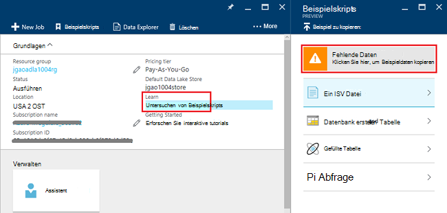
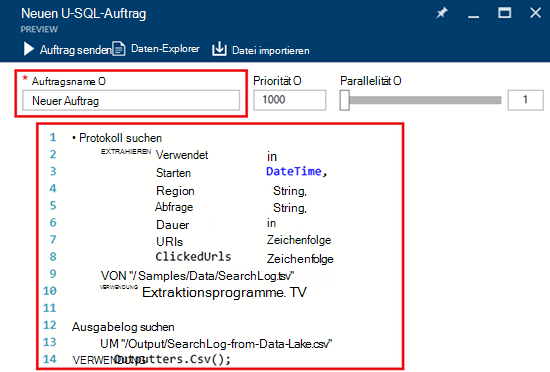
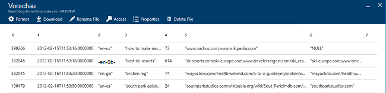

<properties 
   pageTitle="Erste Schritte mit Azure Data Lake Analytics Azure-Portal mit | Azure" 
   description="Informationen Sie zum See Datenanalyse Konto erstellen, erstellen Sie einen See Datenanalyse Druckauftrag U SQL Azure-Portal verwenden und senden Sie den Auftrag. " 
   services="data-lake-analytics" 
   documentationCenter="" 
   authors="edmacauley" 
   manager="jhubbard" 
   editor="cgronlun"/>
 
<tags
   ms.service="data-lake-analytics"
   ms.devlang="na"
   ms.topic="hero-article"
   ms.tgt_pltfrm="na"
   ms.workload="big-data" 
   ms.date="10/06/2016"
   ms.author="edmaca"/>

# Lernprogramm: Erste Schritte mit Azure Data Lake Analytics mit Azure-portal

[AZURE.INCLUDE [get-started-selector](../../includes/data-lake-analytics-selector-get-started.md)]

Informationen Sie zum Azure-Portal Azure Data Lake Analytics-Konten erstellen, [U-SQL](data-lake-analytics-u-sql-get-started.md)Data Lake Analytics Aufträge definieren und Aufträge Datenanalyse See Dienst verwenden. Weitere Informationen über See Datenanalyse Übersicht [Azure Data Lake Analytics](data-lake-analytics-overview.md).

In diesem Lernprogramm entwickeln Sie einen Auftrag, der liest eine Wertedatei (TSV) getrennt und konvertiert ihn in eine Datei mit kommagetrennten Werten (CSV). Gleiche Lernprogramm mit unterstützten Tools klicken Sie, die Registerkarten oben in diesem Abschnitt. Sobald Ihr erste Job erfolgreich ist, können Sie beginnen, komplexere Datentransformationen mit U-SQL geschrieben.

##Erforderliche Komponenten

Bevor Sie dieses Lernprogramm beginnen, benötigen Sie Folgendes:

- **Ein Azure-Abonnement**. Finden Sie [kostenlose Testversion von Azure zu erhalten](https://azure.microsoft.com/pricing/free-trial/).

##Datenanalyse See-Konto erstellen

Datenanalyse See Konto müssen vor dem Ausführen alle Aufträge verwendet werden.

Jedes Konto See Datenanalyse hat eine Abhängigkeit [See Datenspeicher Azure]() -Konto.  Dieses Konto wird als Standardkonto See Datenspeicher bezeichnet.  Konto See Datenspeicher können vorher oder Ihr Konto See Datenanalyse zu erstellen. In diesem Lernprogramm erstellen Sie Datenspeicher See Konto Konto See Datenanalyse.

**Erstellen eines Kontos See Datenanalyse**

1. Melden Sie sich auf der [Azure-Portal](https://portal.azure.com).
2. Klicken Sie auf **neu**und klicken Sie dann auf **See Datenanalyse**auf **Intelligenz + Analytics**.
3. Geben Sie ein oder wählen Sie die folgenden Werte aus:

    

    - **Name**: Name See Datenanalyse-Konto.
    - **Abonnement**: Azure Abonnements Analytics-Konto auswählen.
    - **Ressourcengruppe**. Wählen Sie eine vorhandene Ressourcengruppe Azure oder erstellen Sie eine neue. Azure Ressourcen-Manager können Sie die Ressourcen in der Anwendung als Gruppe arbeiten. Weitere Informationen finden Sie unter [Azure-Ressourcen-Manager (Übersicht)](resource-group-overview.md). 
    - **Speicherort**. Ein Azure-Rechenzentrum für die Datenanalyse See Konto auswählen 
    - **Datenspeicher See**: jede Datenanalyse See Konto hat ein abhängiger See Datenspeicher Konto. Datenanalyse See und der abhängigen See Datenspeicher müssen im gleichen Azure-Rechenzentrum befinden. Führen Sie die Anweisung zum Erstellen eines neuen Kontos See Datenspeicher oder wählen Sie ein vorhandenes Profil aus.

8. Klicken Sie auf **Erstellen**. Es dauert Portal Startseite. Eine neue Tile wird mit der Bezeichnung "Bereitstellen von Azure Data Lake Analytics" zeigt das Startmenü hinzugefügt. Es dauert einen Moment, See Datenanalyse-Konto erstellen. Beim Erstellen des Kontos wird das Portal des Kontos auf ein neues Blatt geöffnet.

Nach der Erstellung einer Datenanalyse See-Kontos können Sie zusätzliche Datenspeicher See und Azure Storage-Konten hinzufügen. Informationen finden Sie unter [Verwalten See Datenanalyse Konto Datenquellen](data-lake-analytics-manage-use-portal.md#manage-account-data-sources).

##Vorbereiten der Quelldaten

In diesem Lernprogramm bearbeiten Sie einige Suchprotokolle.  Suchprotokoll kann in Lake meinen Shop oder Azure BLOB-Speicher gespeichert. 

Azure-Portal bietet eine Benutzeroberfläche für das Kopieren einige Beispieldateien in das Standardkonto Datenspeicher See, einschließlich eine Protokolldatei suchen.

**Kopieren von Beispieldateien**

1. Öffnen Sie in [Azure-Portal](https://portal.azure.com)Kontos See Datenanalyse.  [Konten verwalten See Datenanalyse](data-lake-analytics-get-started-portal.md#manage-accounts) zu einem Konto im Portal anzeigen
3. Erweitern Sie den Bereich **Essentials** und dann auf **Skripts erkunden**. Ein weiteres Blatt **Beispielskripts**aufgerufen wird geöffnet.

    

4. Klicken Sie auf **Beispiel fehlen** , um die Beispieldateien zu kopieren. Wenn er abgeschlossen ist, zeigt das Portal **Beispieldaten wurden erfolgreich aktualisiert**.
7. Data Lake Analytics Konto Blatt klicken Sie oben auf **Daten-Explorer** . 

    

    Zwei Blades wird geöffnet. **Daten-Explorer**gehört, und der andere ist der Datenspeicher See.
8. Standard-See Datenspeicher Konto Blatt klicken Sie auf **Beispiele** erweitern Sie den Ordner und klicken Sie auf **Daten** in den Ordner zu erweitern. Sie sehen die folgenden Dateien und Ordner:

    - AmbulanceData /
    - AdsLog.tsv
    - SearchLog.tsv
    - Version.txt
    - WebLog.log
    
    In diesem Lernprogramm verwenden Sie SearchLog.tsv.

In der Praxis programmieren Sie entweder Ihre Anwendung Daten in einer verknüpften Speicherkonten schreiben oder Daten. Hochladen von Dateien finden Sie unter [Daten in dem Datenspeicher](data-lake-analytics-manage-use-portal.md#upload-data-to-adls) oder [Daten-BLOB-Speicher](data-lake-analytics-manage-use-portal.md#upload-data-to-wasb).

##Erstellen und Datenanalyse See Aufträge

Nachdem Sie die Daten vorbereitet haben, können Sie die Entwicklung einer U-SQL-Skript starten.  

**Einen Auftrag senden**

1. Klicken Sie auf **Neues Projekt**Data Lake Analytics Konto Blatt im Portal. 

    

    Wenn das Blade nicht angezeigt wird, finden Sie unter [ein Konto See Datenanalyse Portal öffnen](data-lake-analytics-manage-use-portal.md#access-adla-account).
2. Geben Sie **Namen**und folgende U-SQL-Skript:

        @searchlog =
            EXTRACT UserId          int,
                    Start           DateTime,
                    Region          string,
                    Query           string,
                    Duration        int?,
                    Urls            string,
                    ClickedUrls     string
            FROM "/Samples/Data/SearchLog.tsv"
            USING Extractors.Tsv();
        
        OUTPUT @searchlog   
            TO "/Output/SearchLog-from-Data-Lake.csv"
        USING Outputters.Csv();

    

    Dieses U-SQL-Skript liest die Quelldatei mit **Extractors.Tsv()**und erstellt eine CSV-Datei mit **Outputters.Csv()**. 
    
    Ändern Sie nicht die beiden Pfade, sofern Sie die Quelldatei in einen anderen Speicherort kopieren.  Datenanalyse See erstellt den Ausgabeordner existiert nicht.  In diesem Fall verwenden wir einfach, relative Pfade.  
    
    Es ist einfacher, relative Pfade für Dateien in Data Lake Standardkonten verwenden. Sie können auch absolute Pfade.  Zum Beispiel 
    
        adl://<Data LakeStorageAccountName>.azuredatalakestore.net:443/Samples/Data/SearchLog.tsv
      

    Über U-SQL finden Sie unter [Erste Schritte mit Azure Data Lake Analytics U-SQL-Sprache](data-lake-analytics-u-sql-get-started.md) und [U-SQL Language Reference](http://go.microsoft.com/fwlink/?LinkId=691348).
     
3. Klicken Sie oben auf **Auftrag senden** .   
4. Warten Sie, bis der Status **erfolgreich**geändert wird. Sie sehen, dass das Projekt ungefähr einer Minute abgeschlossen hat.
    
    Falls der Auftrag fehlgeschlagen ist, finden Sie unter [Überwachung und Problembehandlung See Datenanalyse Aufträge](data-lake-analytics-monitor-and-troubleshoot-jobs-tutorial.md).

5. Am Ende der Blade klicken Sie auf der Registerkarte **Ausgabe** und dann auf **SearchLog von Daten Lake.csv**. Sie können eine Vorschau, herunterladen, umbenennen und löschen die Ausgabedatei.

    

##Siehe auch

- Eine komplexe Abfrage finden Sie unter [Analysieren Website Protokolle mit Azure Data Lake Analytics](data-lake-analytics-analyze-weblogs.md).
- Finden Sie zunächst Anwendungsentwicklung U-SQL [entwickeln U-SQL-Skripts mit Data Lake-Tools für Visual Studio](data-lake-analytics-data-lake-tools-get-started.md).
- U-SQL finden Sie unter [Einstieg in Azure Data Lake Analytics U-SQL-Sprache](data-lake-analytics-u-sql-get-started.md).
- Management-Aufgaben finden Sie unter [Verwalten von Azure Data Lake Analytics verwenden Azure-Portal](data-lake-analytics-manage-use-portal.md).
- Um einen Überblick der Datenanalyse See Übersicht [Azure Data Lake Analytics](data-lake-analytics-overview.md).
- Klicken Sie das gleiche Lernprogramm mit anderen Tools Registerkarte Selektoren oben auf der Seite.
- Diagnose-Informationen protokollieren finden Sie unter [Accessing Diagnoseprotokolle für Azure Data Lake Analytics](data-lake-analytics-diagnostic-logs.md)
