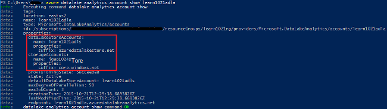
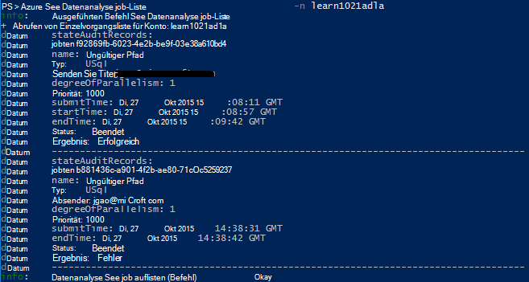

<properties 
   pageTitle="Azure Data Lake Analytics über Azure-Befehlszeilenschnittstelle verwalten | Azure" 
   description="Verwalten Sie Datenanalyse See Konten, Datenquellen, Aufträge und Benutzer Azure CLI" 
   services="data-lake-analytics" 
   documentationCenter="" 
   authors="edmacauley" 
   manager="jhubbard" 
   editor="cgronlun"/>
 
<tags
   ms.service="data-lake-analytics"
   ms.devlang="na"
   ms.topic="article"
   ms.tgt_pltfrm="na"
   ms.workload="big-data" 
   ms.date="05/16/2016"
   ms.author="edmaca"/>

# Verwalten von Azure Data Lake Analytics mit Azure-Befehlszeilenschnittstelle (CLI)

[AZURE.INCLUDE [manage-selector](../../includes/data-lake-analytics-selector-manage.md)]

Informationen Sie zum Verwalten von Azure Data Lake Analytics Konten, Datenquellen, Benutzer und Aufträge mithilfe der Azure. Klicken Sie Management-Thema mit anderen Tools die Registerkarte wählen oben.

**Erforderliche Komponenten**

Bevor Sie dieses Lernprogramm beginnen, müssen Sie Folgendes:

- **Ein Azure-Abonnement**. Finden Sie [kostenlose Testversion von Azure zu erhalten](https://azure.microsoft.com/pricing/free-trial/).
- **Azure CLI**. Siehe [Installieren und Konfigurieren von Azure CLI](../xplat-cli-install.md).
    - Downloaden Sie und installieren Sie der **Vorabversion** [Azure CLI-Tools](https://github.com/MicrosoftBigData/AzureDataLake/releases) Abschließen dieser Demo.
- **Authentifizierung**mit dem folgenden Befehl:

        azure login
    Weitere Informationen zu Authentifizierung mit einem Arbeits- oder Schulcomputer Konto finden Sie unter [mit Azure-Abonnement von Azure-CLI](../xplat-cli-connect.md).
- **Wechsel zum Azure-Ressourcen-Manager-Modus**, mit dem folgenden Befehl:

        azure config mode arm

**Datenspeicher See und Datenanalyse See Befehle aufgelistet:**

    azure datalake store
    azure datalake analytics

<!-- ################################ -->
<!-- ################################ -->
## Konten verwalten

Vor dem Ausführen von Datenanalysen See Aufträge, benötigen Sie ein Konto See Datenanalyse. Im Gegensatz zu Azure HDInsight bezahlen nicht Sie Analytics-Konto, wenn keinen Auftrag ausgeführt wird.  Sie Zahlen nur für die Zeit, wenn sie einen Auftrag ausgeführt wird.  Weitere Informationen finden Sie unter [Azure Data Lake Analytics Overview](data-lake-analytics-overview.md).  

###Erstellen von Konten

    azure datalake analytics account create "<Data Lake Analytics Account Name>" "<Azure Location>" "<Resource Group Name>" "<Default Data Lake Account Name>"

###Konten aktualisieren

Der folgende Befehl aktualisiert die Eigenschaften eines vorhandenen Daten See Analytics Kontos
    
    azure datalake analytics account set "<Data Lake Analytics Account Name>"

###Konten auflisten

Liste Data Lake Analytics-Konten 

    azure datalake analytics account list

Liste Data Lake Analytics Konten innerhalb einer Ressourcengruppe

    azure datalake analytics account list -g "<Azure Resource Group Name>"

Abrufen von Details eines bestimmten Kontos See Datenanalyse

    azure datalake analytics account show -g "<Azure Resource Group Name>" -n "<Data Lake Analytics Account Name>"

###Datenanalyse See löschen

    azure datalake analytics account delete "<Data Lake Analytics Account Name>"

<!-- ################################ -->
<!-- ################################ -->
## Konto-Datenquellen verwalten

Datenanalyse See unterstützt derzeit die folgenden Datenquellen:

- [Azure See Datenspeicher](../data-lake-store/data-lake-store-overview.md)
- [Azure-Speicher](../storage/storage-introduction.md)

Beim Erstellen eines Analytics-Kontos müssen Sie ein Azure See Datenspeicher Konto das Standardkonto Speicher festlegen. Das Standardkonto ADL Speicher zum Auftrag Metadaten und Auftrag Überwachungsprotokolle speichern. Nachdem Sie ein Analytics-Konto erstellt haben, können Sie zusätzliche Daten See Speicherkonten und Azure Storage-Konto hinzufügen. 

### Suchen Sie das Standardkonto ADL Speicher

    azure datalake analytics account show "<Data Lake Analytics Account Name>"

Der Wert wird unter Eigenschaften: DatalakeStoreAccount:name aufgeführt.

### Fügen Sie zusätzliche Azure BLOB-Speicherkonten

    azure datalake analytics account datasource add -n "<Data Lake Analytics Account Name>" -b "<Azure Blob Storage Account Short Name>" -k "<Azure Storage Account Key>"

>[AZURE.NOTE] Nur BLOB-Speicher Kurznamen werden unterstützt.  Verwenden Sie keine vollqualifizierten Domänennamen, z. B. "myblob.blob.core.windows.net".

### Fügen Sie zusätzliche Datenspeicher See Konten

    azure datalake analytics account datasource add -n "<Data Lake Analytics Account Name>" -l "<Data Lake Store Account Name>" [-d]

[-d] ist ein Optionaler Schalter, um anzugeben, ob Daten See hinzugefügte Daten See Standardkonto. 

### Datenquelle aktualisieren

Ein Datenspeicher See-Konto als Standard festlegen:

    azure datalake analytics account datasource set -n "<Data Lake Analytics Account Name>" -l "<Azure Data Lake Store Account Name>" -d
      
So aktualisieren Sie eine vorhandene BLOB-Konto Speicherschlüssel

    azure datalake analytics account datasource set -n "<Data Lake Analytics Account Name>" -b "<Blob Storage Account Name>" -k "<New Blob Storage Account Key>"

### Liste von Datenquellen:

    azure datalake analytics account show "<Data Lake Analytics Account Name>"
    

### Löschen von Datenquellen:

So löschen Sie ein Konto See Datenspeicher

    azure datalake analytics account datasource delete "<Data Lake Analytics Account Name>" "<Azure Data Lake Store Account Name>"

Ein BLOB-Speicher-Konto zu löschen:

    azure datalake analytics account datasource delete "<Data Lake Analytics Account Name>" "<Blob Storage Account Name>"

## Aufträge verwalten

Vor der Erstellung eines Auftrags, benötigen Sie ein Konto See Datenanalyse.  Weitere Informationen finden Sie unter [Konten verwalten See Datenanalyse](#manage-accounts).

### Liste Aufträge

    azure datalake analytics job list -n "<Data Lake Analytics Account Name>"

### Job-Details abrufen

    azure datalake analytics job show -n "<Data Lake Analytics Account Name>" -j "<Job ID>"
    
### Aufträge

> [AZURE.NOTE] Die Standardpriorität eines Auftrags ist 1000 und der Standard-Grad der Parallelität für einen Auftrag ist 1.

    azure datalake analytics job create  "<Data Lake Analytics Account Name>" "<Job Name>" "<Script>"

### Aufträge abbrechen

Verwenden des Befehls Liste die Auftrags-Id und anschließend abbrechen Abbrechen finden.

    azure datalake analytics job list -n "<Data Lake Analytics Account Name>"
    azure datalake analytics job cancel "<Data Lake Analytics Account Name>" "<Job ID>"

## Katalog verwalten

U-SQL Katalog dient und strukturiert, damit sie von U-SQL-Skripts verwendet werden können. Der Katalog ermöglicht die höchste Leistung mit Daten in Azure Data Lake. Weitere Informationen finden Sie unter [verwenden U-SQL-Katalog](data-lake-analytics-use-u-sql-catalog.md).
 
###Katalogelemente

    #List databases
    azure datalake analytics catalog list -n "<Data Lake Analytics Account Name>" -t database

    #List tables
    azure datalake analytics catalog list -n "<Data Lake Analytics Account Name>" -t table
    
Zu den Typen gehören Datenbank, Schema, Assembly, externe Datenquelle, Tabelle, Tabellenwertfunktion oder Tabellenstatistik.

###Katalog-Schlüssel erstellen

    azure datalake analytics catalog secret create -n "<Data Lake Analytics Account Name>" <databaseName> <hostUri> <secretName>

### Katalog-Schlüssel ändern

    azure datalake analytics catalog secret set -n "<Data Lake Analytics Account Name>" <databaseName> <hostUri> <secretName>

###Katalog Schlüssel löschen

    azure datalake analytics catalog secrete delete -n "<Data Lake Analytics Account Name>" <databaseName> <hostUri> <secretName>

<!-- ################################ -->
<!-- ################################ -->
## ARM Gruppen

Anwendung normalerweise viele Komponenten, z. B. eine Webanwendung, Datenbank Datenbank, Speicher und 3. Dienste bestehen. Azure Resource Manager (ARM) können Sie die Ressourcen in der Anwendung als Gruppe als eine Azure-Ressourcengruppe arbeiten. Sie bereitstellen, aktualisieren, überwachen oder alle Ressourcen für die Anwendung in einem einzigen koordinierten Vorgang löschen. Verwenden Sie eine Vorlage für die Bereitstellung und die Vorlage kann für verschiedene Unternehmen wie Tests, Staging und Produktion. Abrechnung für Ihr Unternehmen zu klären die mehrstufigen Kosten für die gesamte Gruppe anzeigen. Weitere Informationen finden Sie unter [Azure-Ressourcen-Manager (Übersicht)](../azure-resource-manager/resource-group-overview.md). 

Datenanalyse See Service kann folgenden Komponenten umfassen:

- Azure Data Lake Analytics-Konto
- Erforderliche Azure See Datenspeicher Konto
- Zusätzliche Azure Data Lake Speicherkonten
- Zusätzliche Azure-Speicherkonten

Sie können diese Komponenten einen ARM Gruppe leichter zu erstellen.

Ein Konto See Datenanalyse und abhängige Speicherkonten müssen im gleichen Azure-Rechenzentrum befinden.
ARM-Gruppe kann jedoch in einem anderen Rechenzentrum befinden.  

##Siehe auch 

- [Übersicht über Microsoft Azure Data Lake Analytics](data-lake-analytics-overview.md)
- [Erste Schritte mit See Datenanalyse mithilfe von Azure-Portal](data-lake-analytics-get-started-portal.md)
- [Verwalten Sie Azure See Datenanalyse mithilfe von Azure-Portal](data-lake-analytics-manage-use-portal.md)
- [Überwachung und Problembehandlung von Azure Data Lake Analytics Aufträge mithilfe von Azure-Portal](data-lake-analytics-monitor-and-troubleshoot-jobs-tutorial.md)

