<properties 
   pageTitle="Azure Data Lake Analytics mit Azure-Portal verwalten | Azure" 
   description="Informationen Sie zum See Datenanalyse Konten, Datenquellen, Benutzer und Projekte verwalten." 
   services="data-lake-analytics" 
   documentationCenter="" 
   authors="edmacauley" 
   manager="jhubbard" 
   editor="cgronlun"/>
 
<tags
   ms.service="data-lake-analytics"
   ms.devlang="na"
   ms.topic="article"
   ms.tgt_pltfrm="na"
   ms.workload="big-data" 
   ms.date="10/06/2016"
   ms.author="edmaca"/>

# Verwalten Sie Azure Data Lake Analytics mit Azure-portal

[AZURE.INCLUDE [manage-selector](../../includes/data-lake-analytics-selector-manage.md)]

Informationen Sie zum Verwalten von Azure Data Lake Analytics Konten, Konto-Datenquellen, Benutzer und Azure-Portal mit. Klicken Sie auf die Tabstoppauswahl oben auf der Seite Themen mit anderen Tools finden.

**Erforderliche Komponenten**

Bevor Sie dieses Lernprogramm beginnen, benötigen Sie Folgendes:

- **Ein Azure-Abonnement**. Finden Sie [kostenlose Testversion von Azure zu erhalten](https://azure.microsoft.com/pricing/free-trial/).

<!-- ################################ -->
<!-- ################################ -->
## Konten verwalten

Vor dem Ausführen von Datenanalysen See Aufträge, benötigen Sie ein Konto See Datenanalyse. Im Gegensatz zu Azure HDInsight bezahlen Sie nur ein Konto See Datenanalyse beim Ausführen eines Auftrags.  Sie Zahlen nur für die Zeit, wenn sie einen Auftrag ausgeführt wird.  Weitere Informationen finden Sie unter [Azure Data Lake Analytics Overview](data-lake-analytics-overview.md).  

**Erstellen eines Kontos See Datenanalyse**

1. Melden Sie sich auf der [Azure-Portal](https://portal.azure.com).
2. Klicken Sie auf **neu**und klicken Sie dann auf **See Datenanalyse**auf **Intelligenz + Analytics**.
3. Geben Sie ein oder wählen Sie die folgenden Werte aus:

    

    - **Name**: Name See Datenanalyse-Konto.
    - **Abonnement**: Azure Abonnements Analytics-Konto auswählen.
    - **Ressourcengruppe**. Wählen Sie eine vorhandene Ressourcengruppe Azure oder erstellen Sie eine neue. Azure Ressourcen-Manager können Sie die Ressourcen in der Anwendung als Gruppe arbeiten. Weitere Informationen finden Sie unter [Azure-Ressourcen-Manager (Übersicht)](resource-group-overview.md). 
    - **Speicherort**. Ein Azure-Rechenzentrum für die Datenanalyse See Konto auswählen 
    - **Datenspeicher See**: jede Datenanalyse See Konto hat ein abhängiger See Datenspeicher Konto. Datenanalyse See und der abhängigen See Datenspeicher müssen im gleichen Azure-Rechenzentrum befinden. Führen Sie die Anweisung zum Erstellen eines neuen Kontos See Datenspeicher oder wählen Sie ein vorhandenes Profil aus.

8. Klicken Sie auf **Erstellen**. Es dauert Portal Startseite. Eine neue Tile wird mit der Bezeichnung "Bereitstellen von Azure Data Lake Analytics" zeigt das Startmenü hinzugefügt. Es dauert einen Moment, See Datenanalyse-Konto erstellen. Beim Erstellen des Kontos wird das Portal des Kontos auf ein neues Blatt geöffnet.

Nach der Erstellung einer Datenanalyse See-Kontos können Sie zusätzliche Datenspeicher See und Azure Storage-Konten hinzufügen. Informationen finden Sie unter [Verwalten See Datenanalyse Konto Datenquellen](data-lake-analytics-manage-use-portal.md#manage-account-data-sources).

**Zugriff/Data Lake Analytics-Konto öffnen**

1. Melden Sie sich auf der [Azure-Portal](https://portal.azure.com/).
2. Klicken Sie im linken Menü auf **See Datenanalyse** .  Wenn es nicht angezeigt wird, klicken Sie auf **Weitere Dienste**und dann auf **See Datenanalyse** **Intelligence**+ Analytics.
3. Klicken Sie auf See Datenanalyse-Konto, das Sie zugreifen möchten. Das Konto in ein neues Blatt geöffnet.

**Datenanalyse See-Konto löschen**

1. Öffnen Sie See Datenanalyse-Konto, das Sie löschen möchten. Informationen finden Sie unter [Zugriff auf See Datenanalyse Konten](#access-adla-account).
2. Klicken Sie im Schaltflächenmenü auf dem Blatt **Löschen** .
3. Geben Sie den Kontonamen, und klicken Sie auf **Löschen**.

Datenanalyse See Konto löschen abhängigen See Datenspeicher Konten nicht. Hinweise See Datenspeicher Konten löschen [Löschen See Datenspeicher Konto](data-lake-store-get-started-portal.md#delete-azure-data-lake-store-account)angezeigt.

<!-- ################################ -->
<!-- ################################ -->
## Konto-Datenquellen verwalten

Datenanalyse See unterstützt derzeit die folgenden Datenquellen:

- [Azure See Datenspeicher](../data-lake-store/data-lake-store-overview.md)
- [Azure-Speicher](../storage/storage-introduction.md)

Beim Erstellen eines Kontos See Datenanalyse legen Sie fest ein Azure See Datenspeicher Konto das Standardkonto Speicher Das Standardkonto See Datenspeicher zum Auftrag Metadaten und Auftrag Überwachungsprotokolle speichern. Nachdem eine Datenanalyse See-Konto erstellt haben, können Sie zusätzliche Datenspeicher See und/oder Azure Storage-Konto hinzufügen. 

**Das Standardkonto Daten See Speicher gefunden**

- Öffnen Sie See Datenanalyse-Konto, das Sie verwalten möchten. Informationen finden Sie unter [Zugriff auf See Datenanalyse Konten](#access-adla-account). Daten See Standardspeicher wird im **wesentlichen**dargestellt:

    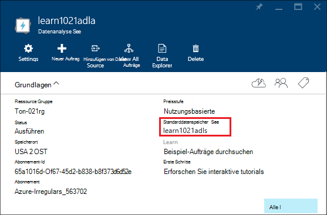

**Zusätzliche Datenquellen hinzugefügt**

1. Öffnen Sie See Datenanalyse-Konto, das Sie verwalten möchten. Informationen finden Sie unter [Zugriff auf See Datenanalyse Konten](#access-adla-account).
2. **Klicken Sie** und dann auf **Datenquellen**. Sie sehen dort See Datenspeicher-Standardkonto. 
3. Klicken Sie auf **Datenquelle hinzufügen**.

    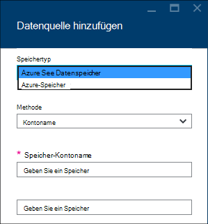

    Zum Hinzufügen eines Kontos Azure See Datenspeicher benötigen Sie das Konto Name und Zugriff auf das Konto Abfragen.
    Um eine Azure BLOB-Speicher hinzuzufügen, benötigen Sie das Speicherkonto und kontoschlüssel zu Speicherkonto im Portal gefunden werden kann.

**Datenquellen zu**  

1. Öffnen Sie das Analytics-Konto, das Sie verwalten möchten. Informationen finden Sie unter [Zugriff auf See Datenanalyse Konten](#access-adla-account).
2. **Klicken Sie** und dann auf **Daten-Explorer**. 
 
    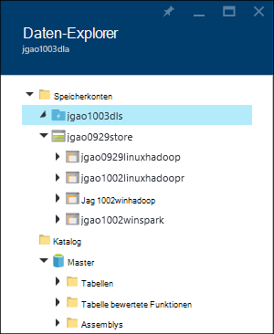
    
3. Klicken Sie auf ein Konto See Datenspeicher für die Firma zu öffnen.

    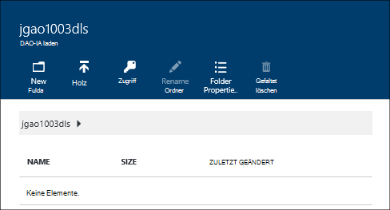
    
    Sie können für jedes Konto See Datenspeicher
    
    - **Neuer Ordner**: neuen Ordner hinzufügen.
    - **Hochladen**: Hochladen von Dateien auf das Speicherkonto von Ihrer Arbeitsstation aus.
    - **Zugriff**: Konfigurieren des Zugriffs Berechtigungen.
    - **Ordner umbenennen**: Umbenennen eines Ordners.
    - **Eigenschaften**: Datei oder Ordner Eigenschaften anzeigen, z. B. WASB Weg, WEBHDFS, Zeit usw. geändert.
    - **Ordner löschen**: Löschen eines Ordners.

**Zum Hochladen von Dateien auf See Datenspeicher Konto**

1. Klicken Sie über das Portal im linken Menü auf **Durchsuchen** und dann auf **See Datenspeicher**.
2. Klicken Sie auf den Datenspeicher See, die Daten hochladen möchten. Das Standardkonto See Datenspeicher finden Sie [hier](#default-adl-account).
3. Klicken Sie im oberen Menü auf **Daten-Explorer** .
4. Klicken Sie auf **Neues Verzeichnis** erstellen einen neuen Ordner oder auf einen Ordnernamen Ordner ändern.
6. Klicken Sie im oberen Menü hochladen **hochgeladen** .

**Zum Hochladen von Dateien auf Azure Blob-Speicher-Konto**

[Daten für Projekte in HDInsight Hadoop](../hdinsight/hdinsight-upload-data.md)anzeigen  Die Informationen gelten für See Datenanalyse.

## Verwalten von Benutzern

Datenanalyse See verwendet rollenbasierte Zugriffskontrolle Azure Active Directory. Erstellen eines Kontos See Datenanalyse wird das Konto eine Rolle "Abonnement" hinzugefügt. Sie können weitere Benutzer und Sicherheitsgruppen mit folgenden Funktionen:

|Rolle|Beschreibung|
|----|-----------|
|Besitzer|Können Sie auch Zugriff auf Ressourcen verwalten.|
|Teilnehmer|Zugreifen; Senden und Aufträge zu überwachen. Um Aufträge senden können, benötigt ein Teilnehmer die Berechtigung Lesen oder Schreiben auf See Datenspeicher.|
|DataLakeAnalyticsDeveloper | Übermitteln, überwachen und Aufträge abbrechen.  Diese Benutzer können nur ihre eigenen Aufträge abbrechen. Sie können nicht ihr eigenes Konto verwalten, beispielsweise Benutzer hinzufügen, Berechtigungen ändern oder löschen Sie das Konto. Auftrag ausführen benötigen, sie Lese- oder Schreibzugriff auf See Datenspeicher     | 
|Reader|Können Sie alles anzeigen, jedoch nicht ändern.|  
|DevTest Labs Benutzer|Können Sie alles und verbinden, Start, Neustart und Herunterfahren virtueller Computer.|  
|Benutzeradministrator-Zugriff|Ermöglicht Zugriff auf Azure Ressourcen verwalten.|  

Informationen zum Erstellen von Azure Active Directory-Benutzer und Sicherheitsgruppen finden Sie unter [Azure Active Directory](../active-directory/active-directory-whatis.md).

**Hinzufügen von Benutzern oder Sicherheitsgruppen auf See Datenanalyse-Konto**

1. Öffnen Sie das Analytics-Konto, das Sie verwalten möchten. Informationen finden Sie unter [Zugriff auf See Datenanalyse Konten](#access-adla-account).
2. **Klicken Sie**, und klicken Sie dann auf **Benutzer**. Sie können auch **Zugriff** auf die Titelleiste **Essentials** , wie im folgenden Screenshot gezeigt klicken:

    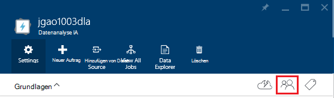
3. Blatt **Benutzer** klicken Sie auf **Hinzufügen**.
4. **Rolle auswählen und Benutzer hinzufügen.**

**Hinweis: Wenn dieser Benutzer oder Sicherheitsgruppe Aufträge senden, müssen sie auf See Datenspeicher sowie die Berechtigung erteilt werden. Weitere Informationen finden Sie unter [sichere Daten aus dem Datenspeicher](../data-lake-store/data-lake-store-secure-data.md).**

<!-- ################################ -->
<!-- ################################ -->
## Aufträge verwalten

Datenanalyse See Konto müssen, bevor U-SQL-Aufträge ausgeführt werden können.  Weitere Informationen finden Sie unter [Konten verwalten See Datenanalyse](#manage-data-lake-analytics-accounts).

**Beim Erstellen eines Auftrags**

1. Öffnen Sie das Analytics-Konto, das Sie verwalten möchten. Informationen finden Sie unter [Zugriff auf See Datenanalyse Konten](#access-adla-account).
2. Klicken Sie auf **Neues Projekt**.

    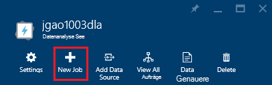

    Sie sehen ein neues Blatt ähnelt:

    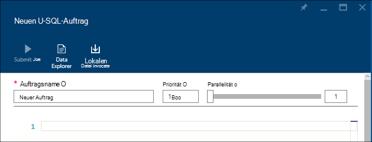

    Sie können für jedes Projekt konfigurieren

  	|Name|Beschreibung|
  	|----|-----------|
  	|Auftragsname|Geben Sie den Namen des Auftrags.|
  	|Priorität|Niedrigere Zahl hat Vorrang. Zwei Aufträge sind sowohl in der Warteschlange, mit niedriger wird Priorität zuerst|
  	|Parallelität |Maximale Anzahl von Compute-Prozesse, die gleichzeitig auftreten können. Diese Zahl kann die Leistung verbessern Sie aber können auch Kosten.|
  	|Skript|U-SQL-Skript für den Auftrag eingeben.|

    Über dieselbe Schnittstelle, können Sie auch Verknüpfen von Datenquellen durchsuchen und verknüpften Datenquellen Weitere Dateien hinzufügen. 
3. Klicken Sie auf **Auftrag senden** , wenn den Auftrag gesendet werden soll.

**Einen Auftrag senden**

Stellenangebote [See-Datenanalyse zu erstellen](#create-job).

**Aufträge überwachen**

1. Öffnen Sie das Analytics-Konto, das Sie verwalten möchten. Informationen finden Sie unter [Zugriff auf See Datenanalyse Konten](#access-adla-account). Im Bereich Projektmanagement werden grundlegende Aufgabe Informationen:

    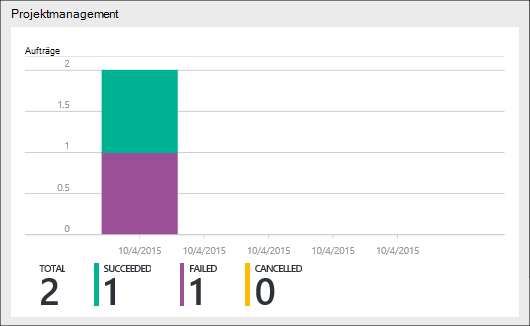

3. Klicken Sie auf **Auftrag** wie in der vorherigen Abbildung dargestellt.

    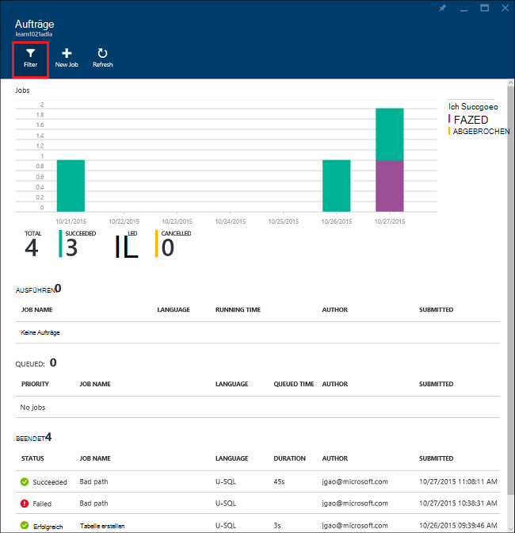

4. Klicken Sie auf einen Auftrag aus der Liste. Oder klicken Sie auf **Filter** , um Sie zu der zu:

    

    Sie können Aufträge nach **Zeitraum**, **Namen**und **Autor**filtern.
5. Klicken Sie auf **erneut** , wenn Sie den Auftrag erneut senden möchten.

**Einen Auftrag erneut senden**

[Monitor See Datenanalyse Aufträge](#monitor-jobs)anzeigen

##Verwendung der Monitor-Benutzerkonten

**Konto überwachen**

1. Öffnen Sie das Analytics-Konto, das Sie verwalten möchten. Informationen finden Sie unter [Zugriff auf See Datenanalyse Konten](#access-adla-account). Das Fenster Verwendung zeigt die Verwendung:

    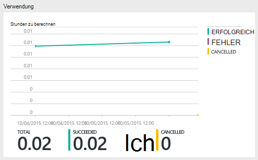

2. Doppelklicken Sie auf den Bereich, um mehr Details zu sehen.

##U-SQL Katalog anzeigen

[U-SQL Katalog](data-lake-analytics-use-u-sql-catalog.md) dient und strukturiert, damit sie von U-SQL-Skripts verwendet werden können. Der Katalog ermöglicht die höchste Leistung mit Daten in Azure Data Lake. Azure-Portal können Sie U-SQL anzeigen.

**U-SQL Katalog durchsuchen**

1. Öffnen Sie das Analytics-Konto, das Sie verwalten möchten. Informationen finden Sie unter [Zugriff auf See Datenanalyse Konten](#access-adla-account).
2. Klicken Sie im oberen Menü auf **Daten-Explorer** .
3. Erweitern Sie **Katalog**, **master**, **Tabellen oder **wichtigen Funktionen**, oder **Assemblys **. Der folgende Screenshot zeigt eine Tabellenwertfunktion.

    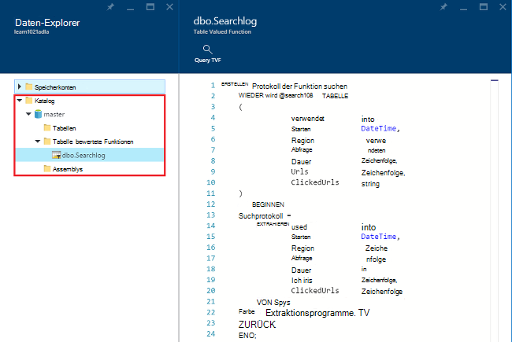

<!-- ################################ -->
<!-- ################################ -->
## Azure Ressourcenmanager Gruppen

Anwendung normalerweise viele Komponenten, z. B. eine Webanwendung, Datenbank Datenbankserver, Speicher und Fremdanbieterdienste bestehen. Azure Ressourcen-Manager können Sie mit den Ressourcen in der Anwendung als Gruppe als eine Azure-Ressourcengruppe arbeiten. Sie können bereitstellen, aktualisieren, überwachen oder löschen Sie die Ressourcen für die Anwendung in einer einzigen koordinierten Operation. Verwenden Sie eine Vorlage für die Bereitstellung und die Vorlage kann für verschiedene Unternehmen testen, Staging und Produktion. Abrechnung für Ihr Unternehmen zu klären die mehrstufigen Kosten für die gesamte Gruppe anzeigen. Weitere Informationen finden Sie unter [Azure-Ressourcen-Manager (Übersicht)](../azure-resource-manager/resource-group-overview.md). 

Datenanalyse See Service kann folgenden Komponenten umfassen:

- Azure Data Lake Analytics-Konto
- Erforderliches Standard See Datenspeicher Azure-Konto
- Zusätzliche Azure See Datenspeicher Konten
- Zusätzliche Azure-Speicherkonten

Alle diese Komponenten im Rahmen einer Ressource Verwaltungsgruppe leichter verwalten können.

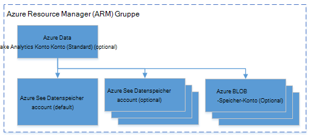

Ein Konto See Datenanalyse und abhängige Speicherkonten müssen im gleichen Azure-Rechenzentrum befinden.
Ressourcenmanagement-Gruppe kann jedoch in einem anderen Rechenzentrum befinden.  

##Siehe auch 

- [Übersicht über Microsoft Azure Data Lake Analytics](data-lake-analytics-overview.md)
- [Erste Schritte mit See Datenanalyse mit Azure-portal](data-lake-analytics-get-started-portal.md)
- [Verwalten von Azure See Datenanalyse mithilfe von Azure PowerShell](data-lake-analytics-manage-use-powershell.md)
- [Überwachung und Problembehandlung von Azure Data Lake Analytics Aufträge mithilfe von Azure-portal](data-lake-analytics-monitor-and-troubleshoot-jobs-tutorial.md)

