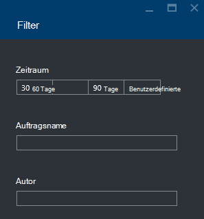

<properties 
   pageTitle="Problembehandlung bei Azure Data Lake Analytics Aufträge mithilfe von Azure-Portal | Azure" 
   description="Erfahren Sie, wie mithilfe der Azure-Verwaltungsportal See Datenanalyse Aufträge beheben. " 
   services="data-lake-analytics" 
   documentationCenter="" 
   authors="edmacauley" 
   manager="jhubbard" 
   editor="cgronlun"/>
 
<tags
   ms.service="data-lake-analytics"
   ms.devlang="na"
   ms.topic="article"
   ms.tgt_pltfrm="na"
   ms.workload="big-data" 
   ms.date="05/16/2016"
   ms.author="edmaca"/>

# Problembehandlung bei Azure Data Lake Analytics Aufträge mithilfe von Azure-Portal

Erfahren Sie, wie mithilfe der Azure-Verwaltungsportal See Datenanalyse Aufträge beheben.

In diesem Lernprogramm wird eine fehlende Quelle Datei Problem setup und Azure-Portal verwenden, um das Problem zu beheben.

**Erforderliche Komponenten**

Bevor Sie dieses Lernprogramm beginnen, müssen Sie Folgendes:

- **Grundlegende Kenntnisse der Datenanalyse See job Prozess**. [Erste Schritte mit Azure See Datenanalyse mithilfe von Azure-Portal](data-lake-analytics-get-started-portal.md)anzeigen
- **Eine Datenanalyse See Konto**. [Erste Schritte mit Azure See Datenanalyse mithilfe von Azure-Portal](data-lake-analytics-get-started-portal.md#create-adl-analytics-account)anzeigen
- **Kopieren Sie die Beispieldaten auf See Datenspeicher Standardkonto**.  Siehe [Vorbereiten der Quelldaten](data-lake-analytics-get-started-portal.md#prepare-source-data)

##Senden eines Auftrags See Datenanalyse

Erstellen Sie jetzt einen U-SQL-Auftrag mit fehlerhaften Quelldateiname.  

**Den Auftrag senden**

1. Azure-Portal klicken Sie in der oberen linken Ecke auf **Microsoft Azure** .
2. Klicken Sie auf die Kachel mit Ihrem Kontonamen See Datenanalyse.  Es wurde hier fixiert, wenn das Konto erstellt wurde.
Wenn das Konto nicht vorhanden fixiert ist, finden Sie unter [Konto Analytics Portal](data-lake-analytics-manage-use-portal.md#access-adla-account).
3. Klicken Sie im oberen Menü auf **Neues Projekt** .
4. Geben Sie einen Auftragsnamen und folgende U-SQL-Skript:

        @searchlog =
            EXTRACT UserId          int,
                    Start           DateTime,
                    Region          string,
                    Query           string,
                    Duration        int?,
                    Urls            string,
                    ClickedUrls     string
            FROM "/Samples/Data/SearchLog.tsv1"
            USING Extractors.Tsv();
        
        OUTPUT @searchlog   
            TO "/output/SearchLog-from-adls.csv"
        USING Outputters.Csv();

    Die Quelldatei im Skript definierten ist **/Samples/Data/SearchLog.tsv1**, wo es **/Samples/Data/SearchLog.tsv**werden.
     
5. Klicken Sie oben auf **Auftrag senden** . Ein neuer Auftrag Detailbereich wird geöffnet. In der Titelleiste wird den Status. Es dauert ein paar Minuten abgeschlossen. Klicken Sie auf **Aktualisieren** , um den neuesten Status zu erhalten.
6. Warten Sie, bis der Status **konnte nicht**geändert wird.  Wenn der Auftrag **erfolgreich**, denn befinden-Ordner entfernt haben. **Erforderlicher** Abschnitt am Anfang des Lernprogramms.

Sie werden vielleicht - warum es so lange für eine kleine Aufgabe dauert.  Beachten Sie, dass See Datenanalyse Datenmengen verarbeiten soll.  Es scheint, wenn eine große Menge von Daten des verteilten Systems verarbeitet.

Wir davon ausgehen, dass der Auftrag gesendet, und schließen Sie das Portal.  Im nächsten Abschnitt lernen Sie, den Auftrag zu beheben.

## Problembehandlung bei der Arbeit

Im letzten Abschnitt haben Sie ein Projekt, und der Auftrag fehlgeschlagen ist.  

**Alle Aufträge anzeigen**

1. Azure-Portal klicken Sie in der oberen linken Ecke auf **Microsoft Azure** .
2. Klicken Sie auf die Kachel mit Ihrem Kontonamen See Datenanalyse.  Zeigt der zusammengefassten Auftrag auf der Kachel **Projektmanagement** .

    
    
    Projekt-Management bietet einen Blick des Auftragsstatus. Beachten Sie, dass ist fehlgeschlagen.
   
3. Klicken Sie auf die Kachel **Projektmanagement** , um die Projekte anzuzeigen. Die Aufträge werden **ausgeführt**, **Warteschlange**und **beendet**kategorisiert. Sie sehen die fehlerhaften Auftrag im Abschnitt **beendet** . In der Liste werden. Wenn Sie Arbeitsplätze haben, können Sie **Filter** , um Aufträge suchen zu klicken.

    

4. Klicken Sie auf der fehlerhafte Auftrag aus der Liste die Auftragsdetails in ein neues Blatt zu öffnen:

    
    
    Beachten Sie die Schaltfläche **erneut** . Nachdem Sie das Problem beheben, können Sie das Projekt erneut.

5. Klicken Sie auf hervorgehobenen aus der vorherigen Abbildung die Fehlerdetails zu öffnen.  Sie sehen etwa so:

    

    Sie werden darüber informiert, dass der Quellordner nicht gefunden wird.
    
6. Klicken Sie auf **Skript duplizieren**.
7. Aktualisieren **von** Pfad wie folgt:

    "/ Samples/Data/SearchLog.tsv"

8. Klicken Sie auf **Auftrag senden**.

##Siehe auch

- [Azure Data Lake Analytics (Übersicht)](data-lake-analytics-overview.md)
- [Erste Schritte mit Azure See Datenanalyse mithilfe von Azure PowerShell](data-lake-analytics-get-started-powershell.md)
- [Erste Schritte mit Azure Data Lake Analytics und U-SQL mit Visual Studio](data-lake-analytics-u-sql-get-started.md)
- [Verwalten Sie Azure See Datenanalyse mithilfe von Azure-Portal](data-lake-analytics-manage-use-portal.md)

