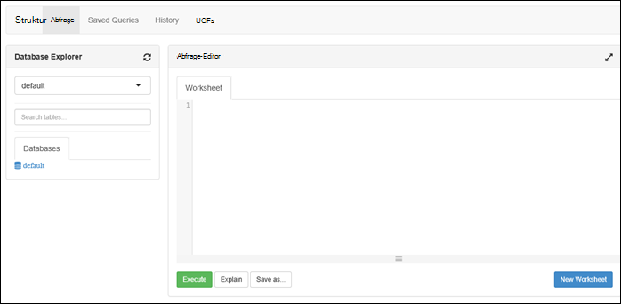

<properties
   pageTitle="HDInsight Cluster mit Azure See Datenspeicher über das Portal erstellen | Azure"
   description="Azure-Portal mit der Erstellung und Verwendung von HDInsight-Cluster mit Azure See Datenspeicher"
   services="data-lake-store,hdinsight" 
   documentationCenter=""
   authors="nitinme"
   manager="jhubbard"
   editor="cgronlun"/>

<tags
   ms.service="data-lake-store"
   ms.devlang="na"
   ms.topic="article"
   ms.tgt_pltfrm="na"
   ms.workload="big-data"
   ms.date="10/21/2016"
   ms.author="nitinme"/>

# Erstellen Sie einen HDInsight-Cluster mit See Datenspeicher Azure-Portal

> [AZURE.SELECTOR]
- [Mithilfe von Portal](data-lake-store-hdinsight-hadoop-use-portal.md)
- [Mithilfe von PowerShell](data-lake-store-hdinsight-hadoop-use-powershell.md)
- [Mit dem Ressourcen-Manager](data-lake-store-hdinsight-hadoop-use-resource-manager-template.md)

Informationen Sie zum Azure-Portal verwenden, um einen HDInsight-Cluster (Hadoop, HBase, Funken oder Sturm) Zugriff auf See Datenspeicher Azure erstellen. Einige wichtige Aspekte dieser Version:

* **Für Spark-Cluster (Linux) und Hadoop Cluster (Windows und Linux)**, See Datenspeicher können nur als zusätzlicher Speicherkonto verwendet werden. Standard-Speicherkonto für die Cluster werden Azure Storage Blobs (WASB).

* Zum Schreiben von Daten aus einem Storm-Topologie kann **für Storm-Cluster (Windows und Linux)**, See Datenspeicher verwendet werden. Datenspeicher See kann auch verwendet werden Daten gespeichert, die dann gelesen Storm-Topologie. Weitere Informationen finden Sie unter [Mit dem Datenspeicher Storm-Topologie](#use-data-lake-store-in-a-storm-topology).

* **HBase für Cluster (Windows und Linux)**, See-Datenspeicher dient als Standardspeicher als zusätzlicher Speicher. Weitere Informationen finden Sie unter [Mit dem Datenspeicher mit HBase](#use-data-lake-store-with-hbase-clusters).

> [AZURE.NOTE] Einige wichtige Punkte zu beachten. 
> 
> * Option zum Erstellen von HDInsight-Cluster mit Zugriff auf See Datenspeicher steht nur für HDInsight-Versionen 3.2 und 3.4 (für Hadoop, HBase und Sturm Cluster sowohl Windows als auch Linux). Spark-Clustern unter Linux ist diese Option nur auf HDInsight 3.4 Cluster.
>
> * Wie bereits erwähnt, ist als Standard für bestimmte Cluster (HBase) und zusätzlicher Speicher für andere Cluster (Hadoop, Funken, Sturm) See Datenspeicher verfügbar. Mit See Datenspeicher als zusätzlicher Speicherkonto beeinträchtigt nicht Leistung oder die Möglichkeit, den Speicher aus dem Cluster schreibgeschützt. In einem Szenario, See Datenspeicher als zusätzlicher Speicher verwendet, werden Cluster-Dateien (z. B. Protokolle) geschrieben Standardspeicher (Azure-Blobs), während die zu verarbeitenden Daten in einem Datenspeicher See Konto gespeichert werden können.

## Erforderliche Komponenten

Bevor Sie dieses Lernprogramm beginnen, müssen Sie Folgendes:

- **Ein Azure-Abonnement**. Finden Sie [kostenlose Testversion von Azure zu erhalten](https://azure.microsoft.com/pricing/free-trial/).

- **See Datenspeicher Azure-Konto**. Gehen Sie auf der [Einstieg in Azure See Datenspeicher Azure-Portal](data-lake-store-get-started-portal.md). 

- **Beispieldaten See Datenspeicher Azure-Konto hochladen**. Nachdem Sie das Konto erstellt haben, führen Sie die folgenden Aufgaben Beispieldaten hochladen. Sie benötigen diese Daten später im Lernprogramm auszuführenden Aufträge von einem HDInsight-Cluster, die Daten im Datenspeicher See zugreifen.

    * [Erstellen eines Ordners im Datenspeicher See](data-lake-store-get-started-portal.md#createfolder).
    * [Hochladen einer Datei auf dem Datenspeicher](data-lake-store-get-started-portal.md#uploaddata). Wenn Sie Beispieldaten hochladen suchen, erhalten Sie von [Azure Data Lake Git Repository](https://github.com/Azure/usql/tree/master/Examples/Samples/Data/AmbulanceData) **Krankenwagen** Datenordner.

- **Azure Active Directory Service Principal**. Schritte in diesem Lernprogramm bereitgestellt zum Erstellen einer Dienstprinzipalnamen in Azure AD. Allerdings müssen Sie Administrator Azure AD erstellt einen Dienstprinzipal zu sein. Sind Administrator Azure AD können diese Voraussetzung überspringen und mit dem Lernprogramm fortfahren.
    
    **Sind Sie kein Administrator Azure AD**nicht die Schritte erforderlich, um einen Dienstprinzipalnamen erstellen können Sie. In diesem Fall muss Systemadministrator Azure AD einen Dienstprinzipal zunächst vor der Erstellung eines Clusters HDInsight Lake Datenspeicher. Außerdem muss die Dienstprinzipalnamen erstellt werden mithilfe eines Zertifikats beschriebenen an [Dienstprinzipal Zertifikat erstellen](../resource-group-authenticate-service-principal.md#create-service-principal-with-certificate).

## Lernen Sie schneller mit Videos?

Die folgenden Videos zu verstehen, wie HDInsight-Cluster mit See Datenspeicher bereit.

* [Erstellen Sie einen HDInsight-Cluster Zugriff auf See Datenspeicher](https://mix.office.com/watch/l93xri2yhtp2)
* Wenn Cluster, [Zugriff auf Daten in dem Datenspeicher Struktur und Schwein Skripts eingerichtet ist](https://mix.office.com/watch/1n9g5w0fiqv1q)

## Erstellt einen HDInsight-Cluster mit Azure See Datenspeicher

In diesem Abschnitt erstellen Sie einen HDInsight Hadoop Cluster mit See Datenspeicher als zusätzlichen Speicher. In dieser Version kann für einen Cluster Hadoop See Datenspeicher nur als zusätzlicher Speicher für den Cluster verwendet werden. Der Standardspeicher werden Blobs Azure-Speicher (WASB). So wird das Speicherkonto und Speichercontainer für den Cluster erforderlich zunächst erstellen.

1. Melden Sie sich auf das neue [Azure-Portal](https://portal.azure.com).

2. Führen Sie die Schritte unter [Erstellen Hadoop Cluster in HDInsight](../hdinsight/hdinsight-provision-clusters.md#create-using-the-preview-portal) zu HDInsight-Cluster bereitstellen.

3. Klicken Sie auf das Blade **Optionale Konfiguration** auf **Datenquelle**. **Datenquelle** Blatt geben Sie die Details für das Speicherkonto und Behälter, **Speicherort** als **USA 2 OST**Geben Sie an und dann auf **Cluster AAD Identität**.

    ![Dienstprinzipal HDInsight Cluster hinzufügen] (./media/data-lake-store-hdinsight-hadoop-use-portal/hdi.adl.1.png "Dienstprinzipal HDInsight Cluster hinzufügen")

4. Auf dem Blatt **Cluster AAD Identität** können Sie vorhandene Dienstprinzipalnamen wählen oder eine neue erstellen.

    * **Erstellen Sie einen neuen Dienstprinzipalnamen**

        * Blatt **Cluster AAD Identität** klicken Sie auf **neu erstellen**, **Service Principal**auf und geben Sie Werte einen neuer Service Principal erstellen Blatt **einen Dienstprinzipal erstellen** . Rahmen, wird Zertifikaten und Active Directory Azure-Anwendung ebenfalls erstellt. Klicken Sie auf **Erstellen**.

            ![Dienstprinzipal HDInsight Cluster hinzufügen] (./media/data-lake-store-hdinsight-hadoop-use-portal/hdi.adl.2.png "Dienstprinzipal HDInsight Cluster hinzufügen")

        * Klicken Sie auf **Cluster AAD Identität** Blade **ADL Zugriff verwalten**. Der Bereich zeigt die See Datenspeicher das Abonnement zugeordnet. Allerdings können Sie die Berechtigungen für das Konto festlegen, die Sie erstellt haben. Wählen Sie LESE-/SCHREIBZUGRIFF/EXECUTE-Berechtigungen für das Konto HDInsight Cluster zuordnen und anschließend auf **Berechtigungen speichern**möchten.

            ![Dienstprinzipal HDInsight Cluster hinzufügen] (./media/data-lake-store-hdinsight-hadoop-use-portal/hdi.adl.3.png "Dienstprinzipal HDInsight Cluster hinzufügen")

        * Klicken Sie auf **Cluster AAD Identität** Blade **Download des Zertifikats** principal erstellten Dienst zugeordnete Zertifikat herunterladen. Dies ist hilfreich, wenn Sie für denselben Dienstprinzipalnamen in Zukunft weitere HDInsight Cluster erstellen. Klicken Sie auf **auswählen**.

            ![Dienstprinzipal HDInsight Cluster hinzufügen] (./media/data-lake-store-hdinsight-hadoop-use-portal/hdi.adl.4.png "Dienstprinzipal HDInsight Cluster hinzufügen")

    * **Wählen Sie einen vorhandenen Dienstprinzipalnamen**

        * Blatt **Cluster AAD Identität** klicken Sie auf **vorhandene**, **Service Principal**auf und Blatt **einen Dienstprinzipal wählen** suchen Sie einen vorhandenen Dienstprinzipalnamen. Klicken Sie auf Service principal Name, und klicken Sie auf **auswählen**.

            ![Dienstprinzipal HDInsight Cluster hinzufügen] (./media/data-lake-store-hdinsight-hadoop-use-portal/hdi.adl.5.png "Dienstprinzipal HDInsight Cluster hinzufügen")

        * Blade **Cluster AAD Identität** hochladen Sie Dienstprinzipalnamen gewählte zugeordnete Zertifikat (PFX), und geben Sie das Kennwort des Zertifikats.

5. Auf **ADL Zugriff verwalten** , und klicken Sie auf **Berechtigungen auswählen**. 

    ![Dienstprinzipal HDInsight Cluster hinzufügen] (./media/data-lake-store-hdinsight-hadoop-use-portal/hdi.adl.5.existing.save.png "Dienstprinzipal HDInsight Cluster hinzufügen")

6. Blatt **Wählen Sie Berechtigungen** aus der Dropdownliste **Konto** wählen Sie die See Datenspeicher die HDInsight Cluster zugeordnet werden soll. Das Blade führt die Dateien und Ordner auf ausgewählten Datenspeicher See Konto. 
 
    ![Zugang zu dem Datenspeicher] (./media/data-lake-store-hdinsight-hadoop-use-portal/hdi-adl-permission-1.png "Zugang zu dem Datenspeicher")

    Danach bestimmen Sie die Berechtigungen zu den ausgewählten Dateien und Ordner. Festlegen Sie für Ordner, ob die Berechtigungen auf den Ordner oder den Ordner und alle untergeordneten Elemente in dem Ordner angewendet. Sie können diese Auswahl auswählen den entsprechenden Wert **Anwenden auf** Dropdown-vornehmen. Um eine Berechtigung zu entfernen, klicken Sie auf das Symbol **Löschen**

    ![Zugang zu dem Datenspeicher] (./media/data-lake-store-hdinsight-hadoop-use-portal/hdi-adl-permission-2.png "Zugang zu dem Datenspeicher")

    Wiederholen Sie diese Schritte zu zugehörigen Dateien und Ordner von anderen Datenspeicher See-Konten. Abschluss die Berechtigungen zuzuweisen, klicken Sie auf am unteren Rand das Blade **Wählen** .

7. Blatt **ausgewählten Berechtigungen** überprüfen Sie die Berechtigungen, die Sie bereitgestellt und dann auf **Ausführen** , um diese Berechtigungen zu gewähren.

    ![Zugang zu dem Datenspeicher] (./media/data-lake-store-hdinsight-hadoop-use-portal/hdi-adl-permission-3.png "Zugang zu dem Datenspeicher")

    Die Statusspalte zeigt den Status an. Sobald alle Berechtigungen erfolgreich zugeordnet sind, klicken Sie auf **Fertig**. 

6. Klicken Sie auf den **Cluster AAD Identität** und **Datenquelle** **auswählen** und fahren mit Cluster als [Cluster erstellen Hadoop in HDInsight](../hdinsight/hdinsight-hadoop-create-linux-clusters-portal.md)beschrieben.

7. Nach der Bereitstellung des Clusters können Sie überprüfen, dass die Dienstprinzipalnamen HDInsight Cluster zugeordnet ist. Klicken Sie dazu aus dem Cluster-Blade auf **Cluster AAD Identität** zugeordneten Dienstprinzipalnamen finden Sie unter.

    ![Dienstprinzipal HDInsight Cluster hinzufügen] (./media/data-lake-store-hdinsight-hadoop-use-portal/hdi.adl.6.png "Dienstprinzipal HDInsight Cluster hinzufügen")

## Testaufträge auf HDInsight Cluster der Azure See Datenspeicher ausgeführt

Nachdem Sie einen HDInsight-Cluster konfiguriert haben, führen Sie Testaufträge im Cluster testen HDInsight Cluster Daten in Azure See Datenspeicher zugreifen kann. Hierzu werden wir einige Struktur dieses Ziel See Datenspeicher Abfragen.

### Für einen Linux-cluster

1. Öffnen Sie das Cluster-Blade für den Cluster nur bereitgestellt und klicken Sie auf **Dashboard**. Ambari für den Linux-Cluster wird geöffnet. Beim Ambari werden Sie aufgefordert, die Website authentifizieren. Geben Sie Admin (Standard-Admin), Kontoname und Kennwort, die Sie beim Erstellen des Clusters verwendet.

    ![Starten Sie Cluster-dashboard] (./media/data-lake-store-hdinsight-hadoop-use-portal/hdiadlcluster1.png "Starten Sie Cluster-dashboard")

    Sie können auch direkt mit Ambari navigieren, indem Sie zu https://CLUSTERNAME.azurehdinsight.net in einem Webbrowser ( **CLUSTERNAME** ist, in dem der Name Ihres Clusters HDInsight).

2. Öffnen Sie die Struktur anzeigen. Wählen Sie die Quadrate (neben **Admin** links und rechts von der Seite) im Menü Seite Liste verfügbaren Ansichten. Wählen Sie die **Struktur** .

    

3. Sie sollte eine Seite ähnlich der folgenden angezeigt:

    

4. Das Arbeitsblatt im **Abfrage-Editor** -Abschnitt der Seite fügen Sie HiveQL Folgendes ein:

        CREATE EXTERNAL TABLE vehicles (str string) LOCATION 'adl://mydatalakestore.azuredatalakestore.net:443/mynewfolder'

5. Klicken Sie auf **Ausführen** , am Ende der **Abfrage-Editor** die Abfrage zu starten. Ein **Prozess Abfrageergebnisse** Abschnitt unter den **Abfrage-Editor** angezeigt werden soll, und Informationen über den Auftrag anzeigen.

6. Nach Abschluss die Abfrage wird der **Prozess Abfrageergebnisse** Abschnitt die Ergebnisse des Vorgangs angezeigt. Die Registerkarte **Ergebnisse** sollten folgende Informationen enthalten:

7. Führen Sie die folgende Abfrage, um sicherzustellen, dass die Tabelle erstellt wurde.

        SHOW TABLES;

    Die Registerkarte **Ergebnisse** sollten wie folgt aussehen:

        hivesampletable
        vehicles

    **Fahrzeuge** ist die Tabelle, die Sie zuvor erstellt haben. **Hivesampletable** ist eine Beispieltabelle in HDInsight-Cluster standardmäßig verfügbar.

8. Sie können auch eine Abfrage zum Abrufen von Daten aus der Tabelle **Fahrzeuge** ausführen.

        SELECT * FROM vehicles LIMIT 5;

### Für einen Windows-cluster

1. Öffnen Sie das Cluster-Blade für den Cluster nur bereitgestellt und klicken Sie auf **Dashboard**.

    ![Starten Sie Cluster-dashboard] (./media/data-lake-store-hdinsight-hadoop-use-portal/hdiadlcluster1.png "Starten Sie Cluster-dashboard")

    Geben Sie bei Aufforderung die Anmeldeinformationen für den Cluster.

2. Microsoft Azure HDInsight Abfrage-Konsole wird geöffnet. Klicken Sie auf **Struktur Editor**.

    ![Öffnen Hive-editor] (./media/data-lake-store-hdinsight-hadoop-use-portal/hdiadlcluster2.png "Öffnen Hive-editor")

3. Geben Sie in der Struktur die folgende Abfrage, und klicken Sie dann auf **Senden**.

        CREATE EXTERNAL TABLE vehicles (str string) LOCATION 'adl://mydatalakestore.azuredatalakestore.net:443/mynewfolder'

    In dieser Abfrage Struktur erstellen wir eine Tabelle von Daten im Datenspeicher auf See `adl://mydatalakestore.azuredatalakestore.net:443/mynewfolder`. Dieser Speicherort enthält eine Beispieldatei, die Sie zuvor geuploadet haben sollte.

    **Auftrag** Sitzungstabelle unten zeigt den Status des Einzelvorgangs ändern **Initialisierung** **ausgeführt**, **abgeschlossen**. Klicken Sie auf **Details anzeigen** , um weitere Informationen zu abgeschlossenen Projekts anzeigen.

    ![Erstellen einer Tabelle] (./media/data-lake-store-hdinsight-hadoop-use-portal/hdiadlcluster3.png "Erstellen einer Tabelle")

4. Führen Sie die folgende Abfrage, um sicherzustellen, dass die Tabelle erstellt wurde.

        SHOW TABLES;

    Klicken Sie auf **Details anzeigen** entspricht diese Abfrage und die Ausgabe sollte Folgendes anzeigen:

        hivesampletable
        vehicles

    **Fahrzeuge** ist die Tabelle, die Sie zuvor erstellt haben. **Hivesampletable** ist eine Beispieltabelle in HDInsight-Cluster standardmäßig verfügbar.

5. Sie können auch eine Abfrage zum Abrufen von Daten aus der Tabelle **Fahrzeuge** ausführen.

        SELECT * FROM vehicles LIMIT 5;

## Zugriff auf See Datenspeicher bietet Befehle

Nachdem Sie den HDInsight Cluster See Datenspeicher konfiguriert haben, können Sie Shellbefehle bietet, auf den Speicher zuzugreifen.

### Für einen Linux-cluster

In diesem Abschnitt wird SSH zum Cluster und Befehle bietet. Windows bietet keine integrierten SSH-Client. Wir empfehlen, **kitten**, die von [http://www.chiark.greenend.org.uk/~sgtatham/putty/download.html](http://www.chiark.greenend.org.uk/~sgtatham/putty/download.html)heruntergeladen werden kann.

Weitere Informationen über kitten finden Sie unter [Verwenden SSH mit Linux-basierten Hadoop auf Windows HDInsight](../hdinsight/hdinsight-hadoop-linux-use-ssh-windows.md).

Sobald verbunden, Befehl folgende bietet Dateisystem Dateien im Datenspeicher See aufgelistet.

    hdfs dfs -ls adl://<Data Lake Store account name>.azuredatalakestore.net:443/

Dies sollte der Datei aufgeführt, die Sie zuvor in den Datenspeicher See hochgeladen.

    15/09/17 21:41:15 INFO web.CaboWebHdfsFileSystem: Replacing original urlConnectionFactory with org.apache.hadoop.hdfs.web.URLConnectionFactory@21a728d6
    Found 1 items
    -rwxrwxrwx   0 NotSupportYet NotSupportYet     671388 2015-09-16 22:16 adl://mydatalakestore.azuredatalakestore.net:443/mynewfolder

Können Sie auch die `hdfs dfs -put` Befehl See Datenspeicher einige Dateien hochladen und dann `hdfs dfs -ls` überprüfen, ob die Dateien hochgeladen wurden.

### Für einen Windows-cluster

1. Melden Sie sich auf das neue [Azure-Portal](https://portal.azure.com).

2. Klicken Sie auf **Durchsuchen**, klicken Sie auf **HDInsight-Cluster**und klicken Sie auf den HDInsight-Cluster, den Sie erstellt.

3. Blatt Cluster auf **Remotedesktop**und ** **Remotedesktop** Blatt klicken**.

    ![Entfernte HDI Cluster] (./media/data-lake-store-hdinsight-hadoop-use-portal/ADL.HDI.PS.Remote.Desktop.png "Ein Azure-Ressourcengruppe erstellen")

    Geben Sie bei Aufforderung die Anmeldeinformationen für den remote desktop Benutzer bereitgestellt.

4. Starten Sie in der Remotesitzung Windows PowerShell und Befehlen Sie bietet Dateisystem die Dateien im Datenspeicher See Azure.

        hdfs dfs -ls adl://<Data Lake Store account name>.azuredatalakestore.net:443/

    Dies sollte der Datei aufgeführt, die Sie zuvor in den Datenspeicher See hochgeladen.

        15/09/17 21:41:15 INFO web.CaboWebHdfsFileSystem: Replacing original urlConnectionFactory with org.apache.hadoop.hdfs.web.URLConnectionFactory@21a728d6
        Found 1 items
        -rwxrwxrwx   0 NotSupportYet NotSupportYet     671388 2015-09-16 22:16 adl://mydatalakestore.azuredatalakestore.net:443/mynewfolder

    Können Sie auch die `hdfs dfs -put` Befehl See Datenspeicher einige Dateien hochladen und dann `hdfs dfs -ls` überprüfen, ob die Dateien hochgeladen wurden.

## Mit See Datenspeicher mit Funken

In diesem Abschnitt verwenden Sie mit HDInsight Spark Jupyter Notebook verfügbar zum Ausführen eines Auftrags, das Daten von einem Datenspeicher See Konto liest, die ein Cluster HDInsight Spark statt das Standardkonto Azure Storage Blob zugeordnet.

1. Kopieren Sie über einige Beispieldaten vom Speicher Standardkonto (WASB) Spark-Cluster den Cluster Azure Data Lake-Store-Konto zugeordnet. Das [ADLCopy-Tool](http://aka.ms/downloadadlcopy) können Sie tun. Downloaden Sie und installieren Sie das Tool über den Link.

2. Öffnen Sie ein Eingabeaufforderungsfenster, und navigieren Sie zum Verzeichnis, in dem AdlCopy, normalerweise installiert ist `%HOMEPATH%\Documents\adlcopy`.

3. Führen Sie den folgenden Befehl einen bestimmten Blob aus dem Quellcontainer in einem Datenspeicher See kopieren:

        AdlCopy /source https://<source_account>.blob.core.windows.net/<source_container>/<blob name> /dest swebhdfs://<dest_adls_account>.azuredatalakestore.net/<dest_folder>/ /sourcekey <storage_account_key_for_storage_container>

    Kopieren Sie für dieses Lernprogramm **HVAC.csv** Beispieldatendatei an **/HdiSamples/HdiSamples/SensorSampleData/Hvac/** Lake Datenspeicher Azure-Konto. Der Codeausschnitt aussehen sollte:

        AdlCopy /Source https://mydatastore.blob.core.windows.net/mysparkcluster/HdiSamples/HdiSamples/SensorSampleData/hvac/HVAC.csv /dest swebhdfs://mydatalakestore.azuredatalakestore.net/hvac/ /sourcekey uJUfvD6cEvhfLoBae2yyQf8t9/BpbWZ4XoYj4kAS5Jf40pZaMNf0q6a8yqTxktwVgRED4vPHeh/50iS9atS5LQ==

    >[AZURE.WARNING] Stellen Sie die Datei und den Pfad in der Schreibweise sind sicher.

4. Sie werden aufgefordert die Anmeldeinformationen für den Azure-Abonnement unter dem Datenspeicher See-Konto haben. Sie sehen eine Ausgabe ähnlich der folgenden:

        Initializing Copy.
        Copy Started.
        100% data copied.
        Copy Completed. 1 file copied.

    Die Datei (**HVAC.csv**) werden unter einem Ordner **/hvac** im Datenspeicher See Konto kopiert.

4. [Azure-Portal](https://portal.azure.com/)aus dem Startmenü klicken Sie auf die Kachel Spark Cluster (Wenn Sie es an das Startmenü angeheftet). Sie können auch zum Cluster unter **Alle durchsuchen** > **HDInsight-Cluster**.   

2. Blatt Cluster Spark klicken Sie **Quick Links**und dann Blatt **Cluster Dashboard** auf **Jupyter Notebook**. Wenn Sie aufgefordert werden, geben Sie die Administratoranmeldeinformationen für den Cluster.

    > [AZURE.NOTE] Sie können Jupyter Notebook für den Cluster erreichen, durch die folgende URL in Ihrem Browser öffnen. Der Name des Clusters ersetzen Sie __CLUSTERNAME__ :
    >
    > `https://CLUSTERNAME.azurehdinsight.net/jupyter`

2. Erstellen Sie ein neues Notizbuch. Klicken Sie auf **neu**, und klicken Sie auf **PySpark**.

    ![Erstellen einer neuen Jupyter notebook] (./media/data-lake-store-hdinsight-hadoop-use-portal/hdispark.note.jupyter.createnotebook.png "Erstellen einer neuen Jupyter notebook")

3. Ein neues Notizbuch erstellt und mit dem Namen **Untitled.pynb**geöffnet. 

4. Da Sie ein Notebook mit dem PySpark Kernel erstellt, müssen Sie keine explizit erstellen. Kontexte Spark und Struktur werden zur Ausführung von Code Zelle automatisch erstellt. Sie können in diesem Szenario erforderlichen Typen importieren starten. Dazu fügen Sie den folgenden Codeausschnitt in einer Zelle und drücken Sie **UMSCHALT + EINGABETASTE**.

        from pyspark.sql.types import *
        
    Bei jedem eines Auftrags im Jupyter ausführen zeigt Web Browser Fenstertitel Status **(belegt)** und Notebook-Titel. Sie sehen auch einen ausgefüllter Kreis neben dem Text **PySpark** in der oberen rechten Ecke. Nachdem der Auftrag abgeschlossen ist, ändert dies in einen Kreis.

     ![Status eines Auftrags Jupyter notebook] (./media/data-lake-store-hdinsight-hadoop-use-portal/hdispark.jupyter.job.status.png "Status eines Auftrags Jupyter notebook")

4. Laden Sie Beispieldaten in eine temporäre Tabelle mit der **HVAC.csv** -Datei auf See Datenspeicher Konto kopiert. Sie können die Daten im Feld URL-Muster mit See Datenspeicher zugreifen.

        adl://<data_lake_store_name>.azuredatalakestore.net/<path_to_file>

    In eine leere Zelle einfügen im folgenden Codebeispiel wird **MYDATALAKESTORE** mit Ihrem Kontonamen See Datenspeicher ersetzen und drücken Sie **UMSCHALT + EINGABETASTE**. Dabei werden Daten in eine temporäre Tabelle namens **HKL**registriert.

        # Load the data
        hvacText = sc.textFile("adl://MYDATALAKESTORE.azuredatalakestore.net/hvac/HVAC.csv")
        
        # Create the schema
        hvacSchema = StructType([StructField("date", StringType(), False),StructField("time", StringType(), False),StructField("targettemp", IntegerType(), False),StructField("actualtemp", IntegerType(), False),StructField("buildingID", StringType(), False)])
        
        # Parse the data in hvacText
        hvac = hvacText.map(lambda s: s.split(",")).filter(lambda s: s[0] != "Date").map(lambda s:(str(s[0]), str(s[1]), int(s[2]), int(s[3]), str(s[6]) ))
        
        # Create a data frame
        hvacdf = sqlContext.createDataFrame(hvac,hvacSchema)
        
        # Register the data fram as a table to run queries against
        hvacdf.registerTempTable("hvac")

5. Da PySpark Kernel verwendet, Sie können jetzt direkt ausführen eine SQL-Abfrage auf die temporäre Tabelle **HKL** , das Sie gerade erstellt die `%%sql` Magic. Weitere Informationen zu den `%%sql` Magic sowie andere mit Kernel PySpark Magie finden Sie [auf Jupyter Notebooks mit Spark HDInsight Kernel](hdinsight-apache-spark-jupyter-notebook-kernels.md#why-should-i-use-the-new-kernels).
        
        %%sql
        SELECT buildingID, (targettemp - actualtemp) AS temp_diff, date FROM hvac WHERE date = \"6/1/13\"

5. Sobald der Auftrag erfolgreich abgeschlossen ist, wird folgende Tabellenausgabe standardmäßig angezeigt.

    ![Tabellenausgabe des Abfrageergebnisses] (./media/data-lake-store-hdinsight-hadoop-use-portal/tabular.output.png "Tabellenausgabe des Abfrageergebnisses")

    Sie sehen auch die Ergebnisse sowie andere Visualisierung. Beispielsweise würde ein Flächendiagramm dieselbe Ausgabe wie folgt aussehen.

    ![Flächendiagramm Abfrageergebnisses] (./media/data-lake-store-hdinsight-hadoop-use-portal/area.output.png "Flächendiagramm Abfrageergebnisses")

6. Nach der Ausführung der Anwendung sollten Sie Herunterfahren des Notebooks um die Ressourcen freizugeben. Klicken Sie dazu im Menü **Datei** auf das Notizbuch **Schließen und Anhalten**. Diese wird geschlossen und das Notizbuch schließen.

## Mit See Datenspeicher Storm-Topologie

See Datenspeicher können Daten von einem Storm-Topologie geschrieben. Informationen zu diesem Szenario finden Sie unter [Verwenden Azure See Datenspeicher mit Apache mit HDInsight](../hdinsight/hdinsight-storm-write-data-lake-store.md).

## Mit See Datenspeicher mit HBase

Mit HBase können Sie See Datenspeicher als Standardspeicher als zusätzlichen Speicher. Dazu:

1.  Blade **-Datenquelle** **HBase Speicherort**wählen Sie **See Datenspeicher** .
2.  Wählen Sie den Namen des gewünschten See Datenspeichers oder erstellen Sie eine neue.
3.  Schließlich geben Sie den **Stammordner HBase** innerhalb des Datenspeichers See. Datenspeicher See Konto keinen Stammordner, eine neue zu erstellen.

    ![HBase mit dem Datenspeicher] (./media/data-lake-store-hdinsight-hadoop-use-portal/hbase-data-lake-store.png "Ein Azure-Ressourcengruppe erstellen")

### Hinweise zum See Datenspeicher als Standardspeicher für HBase Cluster verwenden

* Dasselbe Konto See Datenspeicher können Sie mehrere HBase Cluster. **HBase-Stammordner** , die für den Cluster (Schritt 4 auf dem Bildschirmfoto oben) bereitstellen muss jedoch eindeutig sein. **Darf nicht** verwenden den gleichen Stammordner über zwei verschiedene HBase Cluster.
* Obwohl Sie Datenspeicher See Konto als Standardwert verwenden, werden HBase Cluster-Protokolldateien noch in der Azure Storage Blobs (WASB) den Cluster gespeichert. Dies wird auf dem Bildschirmfoto oben im blau hervorgehoben.

## Siehe auch

* [PowerShell: Erstellen eines HDInsight Clusters See Datenspeicher](data-lake-store-hdinsight-hadoop-use-powershell.md)

[makecert]: https://msdn.microsoft.com/library/windows/desktop/ff548309(v=vs.85).aspx
[pvk2pfx]: https://msdn.microsoft.com/library/windows/desktop/ff550672(v=vs.85).aspx
