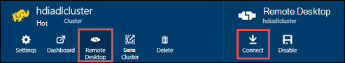

<properties
   pageTitle="HDInsight Cluster mit Azure See Datenspeicher mit Ressourcen-Manager Vorlagen erstellen | Microsoft Azure"
   description="Verwenden Sie Azure-Ressourcen-Manager Vorlagen erstellen und Verwenden von HDInsight-Cluster mit Azure See Datenspeicher"
   services="data-lake-store,hdinsight"
   documentationCenter=""
   authors="nitinme"
   manager="jhubbard"
   editor="cgronlun"/>

<tags
   ms.service="data-lake-store"
   ms.devlang="na"
   ms.topic="article"
   ms.tgt_pltfrm="na"
   ms.workload="big-data"
   ms.date="10/21/2016"
   ms.author="nitinme"/>

# <a name="create-an-hdinsight-cluster-with-data-lake-store-using-azure-resource-manager-template"></a>Erstellen Sie einen HDInsight-Cluster mit See Datenspeicher Azure-Ressourcen-Manager-Vorlage

> [AZURE.SELECTOR] - [Portal mit](data-lake-store-hdinsight-hadoop-use-portal.md) - [mithilfe von PowerShell](data-lake-store-hdinsight-hadoop-use-powershell.md) - [mit dem Ressourcen-Manager](data-lake-store-hdinsight-hadoop-use-resource-manager-template.md)

Informationen Sie zum Azure Ressourcenmanager Vorlage Zugriff auf See Datenspeicher Azure HDInsight-Cluster konfigurieren. Einige wichtige Aspekte dieser Version:

-   **Für Spark-Cluster (Linux) und Hadoop-Storm-Cluster (Windows und Linux)**, See Datenspeicher können nur als zusätzlicher Speicherkonto verwendet werden. Standard-Speicherkonto für die Cluster werden Azure Storage Blobs (WASB).

-   **HBase für Cluster (Windows und Linux)**, See Datenspeicher kann als Standardspeicher oder zusätzlichen Speicher verwendet werden.

> [AZURE.NOTE] Einige wichtige Punkte zu beachten.
>
> - Option zum Erstellen von HDInsight-Cluster mit Zugriff auf See Datenspeicher steht nur für HDInsight-Versionen 3.2 und 3.4 (für Hadoop, HBase und Sturm Cluster sowohl Windows als auch Linux). Spark-Clustern unter Linux ist diese Option nur auf HDInsight 3.4 Cluster.
>
> - Wie bereits erwähnt, ist als Standard für bestimmte Cluster (HBase) und zusätzlicher Speicher für andere Cluster (Hadoop, Funken, Sturm) See Datenspeicher verfügbar. Mit See Datenspeicher als zusätzlicher Speicherkonto beeinträchtigt nicht Leistung oder die Möglichkeit, den Speicher aus dem Cluster schreibgeschützt. In einem Szenario, See Datenspeicher als zusätzlicher Speicher verwendet, werden Cluster-Dateien (z. B. Protokolle) geschrieben Standardspeicher (Azure-Blobs), während die zu verarbeitenden Daten in einem Datenspeicher See Konto gespeichert werden können.
>

In diesem Artikel bereitstellen wir Hadoop Cluster mit See Datenspeicher als zusätzlichen Speicher.

## <a name="prerequisites"></a>Erforderliche Komponenten

Bevor Sie dieses Lernprogramm beginnen, müssen Sie Folgendes:

-   **Ein Azure-Abonnement**. Finden Sie [kostenlose Testversion von Azure zu erhalten](https://azure.microsoft.com/pricing/free-trial/).

-   **Azure PowerShell 1.0 oder höher**. Informationen Sie [zum Installieren und Konfigurieren von Azure PowerShell](../powershell-install-configure.md).

- **Azure Active Directory Service Principal**. Schritte in diesem Lernprogramm bereitgestellt zum Erstellen einer Dienstprinzipalnamen in Azure AD. Allerdings müssen Sie Administrator Azure AD erstellt einen Dienstprinzipal zu sein. Sind Administrator Azure AD können diese Voraussetzung überspringen und mit dem Lernprogramm fortfahren.
    
    **Sind Sie kein Administrator Azure AD**nicht die Schritte erforderlich, um einen Dienstprinzipalnamen erstellen können Sie. In diesem Fall muss Systemadministrator Azure AD einen Dienstprinzipal zunächst vor der Erstellung eines Clusters HDInsight Lake Datenspeicher. Außerdem muss die Dienstprinzipalnamen erstellt werden mithilfe eines Zertifikats beschriebenen an [Dienstprinzipal Zertifikat erstellen](../resource-group-authenticate-service-principal.md#create-service-principal-with-certificate).

## <a name="create-an-hdinsight-cluster-with-azure-data-lake-store"></a>Erstellen Sie einen HDInsight-Cluster mit Azure See Datenspeicher

Der Ressourcen-Manager-Vorlage und die Voraussetzung für die Verwendung der Vorlage stehen auf GitHub an [HDInsight Linux Cluster mit neuen Datenspeicher See bereitstellen](https://github.com/Azure/azure-quickstart-templates/tree/master/201-hdinsight-datalake-store-azure-storage). Anweisungen Sie auf diesen Link, um ein HDInsight Cluster mit Azure See Datenspeicher als zusätzlicher Speicher erstellen.

Informationen über den oben genannten Link erfordern PowerShell. Bevor Sie mit dieser Anleitung, sicherzustellen Sie, dass Sie Ihre Azure-Konto anmelden. Öffnen Sie auf dem Desktop ein neues Azure PowerShell-Fenster, und geben Sie die folgenden Ausschnitte. Aufforderung Anmelden sicherstellen Sie, dass Sie als eines der Abonnementbesitzer/Administratoren anmelden:

```
# Log in to your Azure account
Login-AzureRmAccount

# List all the subscriptions associated to your account
Get-AzureRmSubscription

# Select a subscription
Set-AzureRmContext -SubscriptionId <subscription ID>
```

## <a name="upload-sample-data-to-the-azure-data-lake-store"></a>Hochladen Sie Daten in den Datenspeicher See Azure

Die Ressourcen-Manager-Vorlage erstellt ein neues Konto See Datenspeicher und HDInsight Cluster zugeordnet. Sie müssen nun einige Beispieldaten See Datenspeicher hochladen. Sie benötigen diese Daten später im Lernprogramm auszuführenden Aufträge von einem HDInsight-Cluster, die Daten im Datenspeicher See zugreifen. Informationen zum Hochladen von Daten finden Sie unter [Hochladen auf See Datenspeicher](data-lake-store-get-started-portal.md#uploaddata). Wenn Sie Beispieldaten hochladen suchen, erhalten Sie von [Azure Data Lake Git Repository](https://github.com/Azure/usql/tree/master/Examples/Samples/Data/AmbulanceData) **Krankenwagen** Datenordner.

## <a name="set-relevant-acls-on-the-sample-data"></a>Festlegen von entsprechenden ACLs für die Beispieldaten

Um sicherzustellen, dass die Beispieldaten, die Sie hochladen aus dem HDInsight-Cluster zugegriffen werden kann, müssen Sie sicherstellen, dass Azure AD-Anwendung, mit der Identität HDInsight Cluster und Datenspeicher See Zugriff auf den Dateiordner hat, Zugriff einrichten. Gehen Sie hierzu folgendermaßen.

1.  Suchen Sie den Namen der Azure AD-Anwendung, die HDInsight-Cluster und See Datenspeicher zugeordnet ist. Eine Möglichkeit zum Suchen des Namens ist HDInsight Cluster-Blade mit der Ressourcen-Manager-Vorlage öffnen, klicken Sie auf die Registerkarte **Cluster AAD Identität** und den Wert des **Anzeigenamens Dienstprinzipalnamen**suchen.

2.  Jetzt bieten Sie Zugriff auf diese Anwendung Azure AD für Datei/Ordner aus dem HDInsight-Cluster zugreifen möchten. Um die richtigen ACLs der Dateiordner im Datenspeicher See festzulegen, finden Sie unter [Sichern von Daten in dem Datenspeicher](data-lake-store-secure-data.md#assign-users-or-security-group-as-acls-to-the-azure-data-lake-store-file-system).

## <a name="run-test-jobs-on-the-hdinsight-cluster-to-use-the-data-lake-store"></a>Testaufträge auf HDInsight Cluster der See Datenspeicher ausgeführt

Nachdem Sie einen HDInsight-Cluster konfiguriert haben, führen Sie Testläufe im Cluster testen HDInsight Cluster See Datenspeicher zugreifen kann. Hierzu werden wir ein Beispiel Struktur Auftrag ausgeführt, der eine Tabelle mit den Beispieldaten, die Sie zuvor dem Datenspeicher See hochgeladen erstellt.

### <a name="for-a-linux-cluster"></a>Für einen Linux-cluster

In diesem Abschnitt werden Sie SSH-Cluster und Ausführen der eine Beispielabfrage Struktur. Windows bietet keine integrierten SSH-Client. Wir empfehlen, **kitten**, die von [http://www.chiark.greenend.org.uk/~sgtatham/putty/download.html](http://www.chiark.greenend.org.uk/~sgtatham/putty/download.html)heruntergeladen werden kann.

Weitere Informationen über kitten finden Sie unter [Verwenden SSH mit Linux-basierten Hadoop auf Windows HDInsight ](../hdinsight/hdinsight-hadoop-linux-use-ssh-windows.md).

1.  Sobald verbunden, starten Sie die CLI Struktur mit dem folgenden Befehl:

    ```
    hive
    ```

2.  Geben Sie die CLI die folgende Anweisung zum Erstellen einer neuen Tabelle mit dem Namen **Fahrzeuge** mit Beispieldaten im Datenspeicher See:

    ```
    DROP TABLE vehicles;
    CREATE EXTERNAL TABLE vehicles (str string) LOCATION 'adl://<mydatalakestore>.azuredatalakestore.net:443/';
    SELECT * FROM vehicles LIMIT 10;
    ```

    Sie sollte eine Ausgabe ähnlich der folgenden angezeigt:

    ```
    1,1,2014-09-14 00:00:03,46.81006,-92.08174,51,S,1
    1,2,2014-09-14 00:00:06,46.81006,-92.08174,13,NE,1
    1,3,2014-09-14 00:00:09,46.81006,-92.08174,48,NE,1
    1,4,2014-09-14 00:00:12,46.81006,-92.08174,30,W,1
    1,5,2014-09-14 00:00:15,46.81006,-92.08174,47,S,1
    1,6,2014-09-14 00:00:18,46.81006,-92.08174,9,S,1
    1,7,2014-09-14 00:00:21,46.81006,-92.08174,53,N,1
    1,8,2014-09-14 00:00:24,46.81006,-92.08174,63,SW,1
    1,9,2014-09-14 00:00:27,46.81006,-92.08174,4,NE,1
    1,10,2014-09-14 00:00:30,46.81006,-92.08174,31,N,1
    ```

### <a name="for-a-windows-cluster"></a>Für einen Windows-cluster

Verwenden Sie die folgenden Cmdlets die Hive-Abfrage auszuführen. In dieser Abfrage werden eine Tabelle erstellen, die Daten im Datenspeicher See und führen Sie eine select-Abfrage in der erstellten Tabelle.

```
$queryString = "DROP TABLE vehicles;" + "CREATE EXTERNAL TABLE vehicles (str string) LOCATION 'adl://$dataLakeStoreName.azuredatalakestore.net:443/';" + "SELECT * FROM vehicles LIMIT 10;"

$hiveJobDefinition = New-AzureRmHDInsightHiveJobDefinition -Query $queryString

$hiveJob = Start-AzureRmHDInsightJob -ResourceGroupName $resourceGroupName -ClusterName $clusterName -JobDefinition $hiveJobDefinition -ClusterCredential $httpCredentials

Wait-AzureRmHDInsightJob -ResourceGroupName $resourceGroupName -ClusterName $clusterName -JobId $hiveJob.JobId -ClusterCredential $httpCredentials
```

Dies hat die folgende Ausgabe. **ExitValue** 0 in der Ausgabe schlägt vor, dass der Auftrag erfolgreich abgeschlossen.

```
Cluster         : hdiadlcluster.
HttpEndpoint    : hdiadlcluster.azurehdinsight.net
State           : SUCCEEDED
JobId           : job_1445386885331_0012
ParentId        :
PercentComplete :
ExitValue       : 0
User            : admin
Callback        :
Completed       : done
```

Abrufen der Ausgabe aus dem Auftrag mit dem folgenden Cmdlet:

```
Get-AzureRmHDInsightJobOutput -ClusterName $clusterName -JobId $hiveJob.JobId -DefaultContainer $containerName -DefaultStorageAccountName $storageAccountName -DefaultStorageAccountKey $storageAccountKey -ClusterCredential $httpCredentials
```

Die Job-Ausgabe ähnelt dem folgenden:

```
1,1,2014-09-14 00:00:03,46.81006,-92.08174,51,S,1
1,2,2014-09-14 00:00:06,46.81006,-92.08174,13,NE,1
1,3,2014-09-14 00:00:09,46.81006,-92.08174,48,NE,1
1,4,2014-09-14 00:00:12,46.81006,-92.08174,30,W,1
1,5,2014-09-14 00:00:15,46.81006,-92.08174,47,S,1
1,6,2014-09-14 00:00:18,46.81006,-92.08174,9,S,1
1,7,2014-09-14 00:00:21,46.81006,-92.08174,53,N,1
1,8,2014-09-14 00:00:24,46.81006,-92.08174,63,SW,1
1,9,2014-09-14 00:00:27,46.81006,-92.08174,4,NE,1
1,10,2014-09-14 00:00:30,46.81006,-92.08174,31,N,1
```

## <a name="access-data-lake-store-using-hdfs-commands"></a>Zugriff auf See Datenspeicher bietet Befehle

Nachdem Sie den HDInsight Cluster See Datenspeicher konfiguriert haben, können Sie Shellbefehle bietet, auf den Speicher zuzugreifen.

### <a name="for-a-linux-cluster"></a>Für einen Linux-cluster

In diesem Abschnitt wird SSH zum Cluster und Befehle bietet. Windows bietet keine integrierten SSH-Client. Wir empfehlen, **kitten**, die von [http://www.chiark.greenend.org.uk/~sgtatham/putty/download.html](http://www.chiark.greenend.org.uk/~sgtatham/putty/download.html)heruntergeladen werden kann.

Weitere Informationen über kitten finden Sie unter [Verwenden SSH mit Linux-basierten Hadoop auf Windows HDInsight ](../hdinsight/hdinsight-hadoop-linux-use-ssh-windows.md).

Sobald verbunden, Befehl folgende bietet Dateisystem Dateien im Datenspeicher See aufgelistet.

```
hdfs dfs -ls adl://<Data Lake Store account name>.azuredatalakestore.net:443/
```

Dies sollte der Datei aufgeführt, die Sie zuvor in den Datenspeicher See hochgeladen.

```
15/09/17 21:41:15 INFO web.CaboWebHdfsFileSystem: Replacing original urlConnectionFactory with org.apache.hadoop.hdfs.web.URLConnectionFactory@21a728d6
Found 1 items
-rwxrwxrwx   0 NotSupportYet NotSupportYet     671388 2015-09-16 22:16 adl://mydatalakestore.azuredatalakestore.net:443/mynewfolder
```

Können Sie auch die `hdfs dfs -put` Befehl See Datenspeicher einige Dateien hochladen und dann `hdfs dfs -ls` überprüfen, ob die Dateien hochgeladen wurden.

### <a name="for-a-windows-cluster"></a>Für einen Windows-cluster

1.  Melden Sie sich auf das neue [Azure-Portal](https://portal.azure.com).

2.  Klicken Sie auf **Durchsuchen**, klicken Sie auf **HDInsight-Cluster**und klicken Sie auf den HDInsight-Cluster, den Sie erstellt.

3.  Blatt Cluster auf **Remotedesktop**und ** **Remotedesktop** Blatt klicken**.

    

    Geben Sie bei Aufforderung die Anmeldeinformationen für den remote desktop Benutzer bereitgestellt.

4.  Starten Sie in der Remotesitzung Windows PowerShell und Befehlen Sie bietet Dateisystem die Dateien im Datenspeicher See Azure.

    ```
    hdfs dfs -ls adl://<Data Lake Store account name>.azuredatalakestore.net:443/
    ```

    Dies sollte der Datei aufgeführt, die Sie zuvor in den Datenspeicher See hochgeladen.

    ```
    15/09/17 21:41:15 INFO web.CaboWebHdfsFileSystem: Replacing original urlConnectionFactory with org.apache.hadoop.hdfs.web.URLConnectionFactory@21a728d6
    Found 1 items
    -rwxrwxrwx   0 NotSupportYet NotSupportYet     671388 2015-09-16 22:16 adl://mydatalakestore.azuredatalakestore.net:443/vehicle1_09142014.csv
    ```

    Können Sie auch die `hdfs dfs -put` Befehl See Datenspeicher einige Dateien hochladen und dann `hdfs dfs -ls` überprüfen, ob die Dateien hochgeladen wurden.

## <a name="next-steps"></a>Nächste Schritte

-   [Daten von Azure Storage Blobs See Datenspeicher](data-lake-store-copy-data-wasb-distcp.md)
