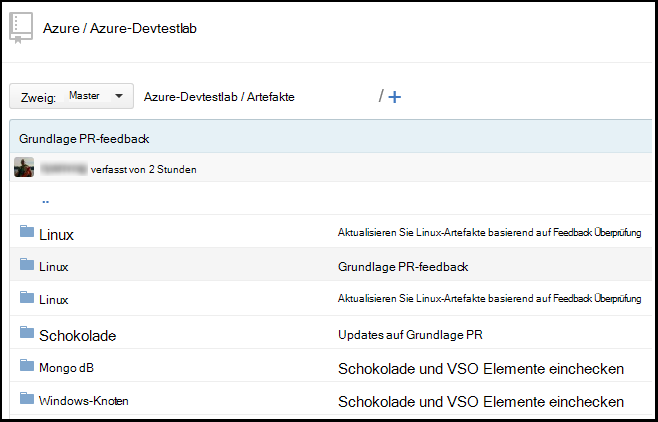
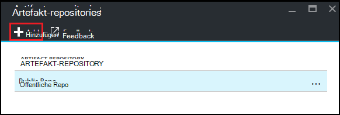
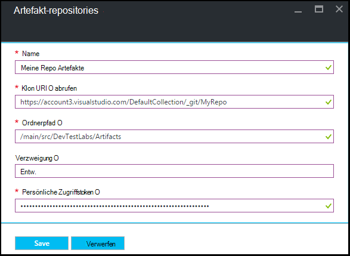

<properties
    pageTitle="Übungseinheit in Azure DevTest Labs Git Artefakt Repository hinzufügen | Microsoft Azure"
    description="GitHub oder Visual Studio Team Services Git Repository für die Datenquelle benutzerdefinierte Artefakte in Azure DevTest Labs hinzufügen"
    services="devtest-lab,virtual-machines,visual-studio-online"
    documentationCenter="na"
    authors="tomarcher"
    manager="douge"
    editor=""/>

<tags
    ms.service="devtest-lab"
    ms.workload="na"
    ms.tgt_pltfrm="na"
    ms.devlang="na"
    ms.topic="article"
    ms.date="09/06/2016"
    ms.author="tarcher"/>

# Übungseinheit in Azure DevTest Labs Git Artefakt Repository hinzufügen

> [AZURE.VIDEO how-to-add-your-private-artifacts-repository-in-a-devtest-lab]

In Azure DevTest Labs sind Artefakte *Aktionen* - Software oder ausgeführten Skripts und Befehle – Erstellung eine VM installiert. Standardmäßig enthält eine Übungseinheit Artefakte aus dem offiziellen Azure DevTest Labs Artefakt Repository. Sie können ein Repository Git Artefakt Lab Artefakte enthalten, die Ihr Team erstellt hinzufügen. Das Repository kann auf [GitHub](https://github.com) oder [Visual Studio Team Services (VSTS)](https://visualstudio.com)gehostet werden.

- Zum Erstellen eines GitHub Repository finden Sie unter [GitHub Bootcamp](https://help.github.com/categories/bootcamp/).
- Informationen zum Erstellen eines Projekts Team Services mit einem Git Repository anzeigen Sie [mit Visual Studio Team Services](https://www.visualstudio.com/get-started/setup/connect-to-visual-studio-online)

Der folgende Screenshot zeigt ein Beispiel in GitHub wie ein Repository mit Artefakten aussehen könnte:  

## Repository-Informationen und Anmeldeinformationen abrufen

Lab ein Artefakt-Repository hinzufügen, müssen Sie zuerst einige Informationen aus dem Repository abrufen. Die folgenden Abschnitte führen Sie durch diese Informationen für Artefakt Repositories auf GitHub und Visual Studio Team Services gehostet.

### GitHub Repository Klon URL und Zugang token abrufen

Um den GitHub Repository Klon URL und persönliche Zugriffstoken, gehen Sie folgendermaßen vor:

1. Wechseln Sie zur Startseite des GitHub-Repository mit den Artefakt Definitionen.

1. Wählen Sie **Klonen oder Download**.

1. Schaltfläche **HTTPS Url kopieren** in die Zwischenablage kopiert, und die URL für die spätere Verwendung speichern.

1. Wählen Sie die Profil-Images in der oberen rechten Ecke des GitHub und **Einstellungen**.

1. Wählen Sie im **persönlichen** Links **Persönliche Zugriffstoken**.

1. Wählen Sie **neue Token generieren**.

1. Geben Sie auf der Seite **Persönliche Zugriffstoken** eine **Beschreibung der Token**, akzeptieren Sie die Standardelemente **Bereiche auswählen**, und dann **Token zu generieren**.

1. Speichern Sie das generierte Token später benötigen.

1. Sie können jetzt GitHub schließen.   

1. Weiter zum Abschnitt [Lab Artefakt Repository verbinden](#connect-your-lab-to-the-artifact-repository) .

### Visual Studio Team Services Repository Klon URL und Zugang token abrufen

Um die Visual Studio Team Services Repository Klon URL und persönliche Zugriffstoken, gehen Sie folgendermaßen vor:

1. Öffnen Sie die Homepage der Teamprojektsammlung (z. B. `https://contoso-web-team.visualstudio.com`), und wählen Sie das Artefakt-Projekt.

1. Wählen Sie auf der Homepage Projekt **Code**.

1. Wählen Sie zum Anzeigen des URL Klon auf **der Codepage Projekt** **Klon**.

1. Speichern Sie die URL, wie Sie später in diesem Lernprogramm benötigen.

1. Erstellen einer persönlichen Zugriffstoken Benutzer Konto Dropdown-Menü Wählen Sie **Profil aus** .

1. Wählen Sie auf der Seite Profil Informationen **Sicherheit**.

1. Wählen Sie auf der Registerkarte **Sicherheit** **Hinzufügen**.

1. **Erstellen einer persönlichen Zugriffstoken** -Seite:

    - Geben Sie eine **Beschreibung** für das Token.
    - Der Liste **Läuft** **180 Tage** auswählen.
    - Wählen Sie **alle zugänglich Konten** aus **der Kontenliste** aus.
    - Wählen Sie **alle Bereiche** .
    - Wählen Sie **Token erstellen**.

1. Abschließend wird das neue Token in die **Persönliche Zugriffstoken** angezeigt. Wählen Sie **Kopie Token**und speichern Sie den Tokenwert für spätere Verwendung.

1. Weiter zum Abschnitt [Lab Artefakt Repository verbinden](#connect-your-lab-to-the-artifact-repository) .

##Das Artefakt Repository Lab herstellen

1. Mit der [Azure-Portal](http://go.microsoft.com/fwlink/p/?LinkID=525040)anmelden.

1. Wählen Sie **Weitere Dienste**und wählen Sie dann aus der Liste **DevTest Labs** .

1. Wählen Sie aus der Übungseinheiten gewünschte Lab.   

1. Wählen Sie in der Übungseinheit Blade **Konfiguration**.

1. Wählen Sie in der Übungseinheit **Konfiguration** Blade **Artefakte Repositories**.

1. Wählen Sie auf dem Blatt **Artefakte Repositories** **+ Hinzufügen**.

    
 
1. Geben Sie auf dem zweiten Blatt **Artefakte Repositories** Folgendes an:

    - **Name** – Geben Sie einen Namen für das Repository.
    - **Git Clone Url** - Geben Sie die URL der Git HTTPS-Klon, die zuvor von GitHub oder Visual Studio Team Services kopiert. 
    - **Pfad** – Geben Sie den Ordnerpfad relativ Klon-URL, die Artefakt-Definitionen enthält.
    - **Zweig** - Verzweigung Artefakt Definitionen zu geben.
    - **Persönliche Zugriffstoken** - Geben Sie persönliche Zugriffstoken zuvor GitHub oder Visual Studio Team Services erhalten. 
     
    

1. **Wählen Sie aus.**

[AZURE.INCLUDE [devtest-lab-try-it-out](../../includes/devtest-lab-try-it-out.md)]

## Verwandte Blogbeiträge
- [Behandlung von Artefakten in AzureDevTestLabs fehl](http://www.visualstudiogeeks.com/blog/DevOps/How-to-troubleshoot-failing-artifacts-in-AzureDevTestLabs)
- [Fügen Sie eine VM vorhandenen AD-Domäne mithilfe von ARM-Vorlage in Azure Dev-Testlabor](http://www.visualstudiogeeks.com/blog/DevOps/Join-a-VM-to-existing-AD-domain-using-ARM-template-AzureDevTestLabs)