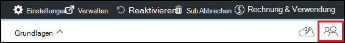

<properties
    pageTitle="Besitzer und Benutzer in Azure DevTest Labs hinzufügen | Microsoft Azure"
    description="Fügen Sie Besitzer und Benutzer in Azure DevTest Labs mithilfe der Azure-Portal oder PowerShell hinzu"
    services="devtest-lab,virtual-machines"
    documentationCenter="na"
    authors="tomarcher"
    manager="douge"
    editor=""/>

<tags
    ms.service="devtest-lab"
    ms.workload="na"
    ms.tgt_pltfrm="na"
    ms.devlang="na"
    ms.topic="article"
    ms.date="09/12/2016"
    ms.author="tarcher"/>

# Besitzer und Benutzer in Azure DevTest Labs hinzufügen

> [AZURE.VIDEO how-to-set-security-in-your-devtest-lab]

Auf Azure DevTest Labs ist [Azure_Role-Based Access Control (RBAC)](../active-directory/role-based-access-control-what-is.md)gesteuert. RBAC verwenden, können Sie Aufgaben in Ihrem Team *Rollen* trennen nur das Ausmaß des Zugriffs für Benutzer für ihre Aufgaben notwendigen erteilt. Drei dieser RBAC-Rollen sind *Besitzer*, *DevTest Labs User*und *Beitragender*. In diesem Artikel erfahren Sie, welche Aktionen in jeder der drei wichtigsten RBAC-Rollen ausgeführt werden können. Dort erfahren Sie, wie Lab - über das Portal und über PowerShell-Skript Benutzer hinzuzufügen und Benutzer Ebene Abonnement hinzufügen.

## Aktionen, die in jeder Rolle ausgeführt werden können

Es gibt drei Rollen Benutzer zuweisen können:

- Besitzer
- DevTest Labs Benutzer
- Teilnehmer

Die folgende Tabelle zeigt die Aktionen, die Benutzer in diesen Rollen ausgeführt werden können:

| **Benutzer in dieser Rolle Aktionen durchführen können** | **DevTest Labs Benutzer**            | **Besitzer** | **Teilnehmer** |
|---|---|---|---|
| **Aufgaben des Testlabors**                          |                              |       |             |
| Hinzufügen von Benutzern zu einer Übungseinheit                     | Nein                           | Ja   | Nein          |
| Update Standardeinstellungen Kosten                   | Nein                           | Ja   | Ja         |
| **VM-Basis-Aufgaben**                      |                              |       |             |
| Hinzufügen und Entfernen von benutzerdefinierten Bildern           | Nein                           | Ja   | Ja         |
| Hinzufügen, aktualisieren und Löschen von Formeln       | Ja                          | Ja   | Ja         |
| Weiße Azure Marketplace Bilder     | Nein                           | Ja   | Ja         |
| **VM-Aufgaben**                           |                              |       |             |
| Erstellen virtueller Computer                             | Ja                          | Ja   | Ja         |
| Starten, beenden und Löschen von VMs            | Nur die vom Benutzer erstellten VMs | Ja   | Ja         |
| VM Aktualisierungsrichtlinien                     | Nein                           | Ja   | Ja         |
| Entfernen Sie Datenträger in VMs hinzufügen /      | Nur die vom Benutzer erstellten VMs | Ja   | Ja         |
| **Artefakt-Aufgaben**                     |                              |       |             |
| Hinzufügen und Entfernen von Artefakt repositories   | Nein                           | Ja   | Ja         |
| Anwenden von Artefakten                        | Ja                          | Ja   | Ja         |

> [AZURE.NOTE] Beim Erstellen einer VM, wird dieser Benutzer **Besitzerrolle erstellten VM** automatisch zugewiesen.

## Eigentümer oder Benutzer Ebene Lab hinzufügen

Besitzer und Benutzer können Ebene Lab Azure Portal hinzugefügt. Dies schließt externe Benutzer mit einem gültigen [Microsoft-Konto (MSA)](devtest-lab-faq.md#what-is-a-microsoft-account).
Die folgenden Schritte führen Sie durch den Prozess der Übungseinheit in Azure DevTest Labs Besitzer oder Benutzer hinzufügen:

1. Mit der [Azure-Portal](http://go.microsoft.com/fwlink/p/?LinkID=525040)anmelden.

1. Wählen Sie **Weitere Dienste**und dann **DevTest Labs** aus.

1. Wählen Sie aus der Übungseinheiten gewünschte Lab.

1. Wählen Sie in der Übungseinheit Blade **Konfiguration**. 

1. Wählen Sie auf dem Blatt **Konfiguration** **Benutzer**.

1. Wählen Sie auf dem Blatt **Benutzer** **+ Hinzufügen**.

    

1. Wählen Sie auf die **Rolle auswählen** die gewünschte Rolle. Im Abschnitt [Aktionen, die in jeder Rolle erfolgen](#actions-that-can-be-performed-in-each-role) führt verschiedene Aktionen, die Benutzer der Besitzer DevTest Benutzer und Teilnehmer Rollen ausgeführt werden können.

1. Geben Sie auf dem Blatt **Hinzufügen** die e-Mail-Adresse oder Name des Benutzers zu der Rolle hinzuzufügen. Wenn der Benutzer gefunden werden kann, erläutert eine Fehlermeldung das Problem. Wenn der Benutzer gefunden wird, wird dieser Benutzer aufgelistet und ausgewählt. 

1. Wählen Sie **auswählen**.

1. Wählen Sie **OK** Blatt **Hinzufügen Zugriff** zu.

1. Wenn wieder das Blatt **Benutzer** wurde der Benutzer hinzugefügt.  

## Ein Labor mit PowerShell fügen Sie einen externen Benutzer hinzu

Neben Benutzer in Azure-Portal hinzufügen, können Sie mithilfe eines PowerShell-Skripts Lab einen externen Benutzer hinzufügen. Im folgenden Beispiel ändern Sie einfach die Parameterwerte unter Kommentar **Werte ändern** .
Rufen Sie die `subscriptionId`, `labResourceGroup`, und `labName` Werte aus dem Lab-Blade in Azure-Portal.

> [AZURE.NOTE]
> Das Beispielskript wird vorausgesetzt, dass der angegebene Benutzer als Gast in Active Directory hinzugefügt wurde, und fehl schlägt, wenn dies nicht der Fall ist. Um eine Übungseinheit Benutzer nicht in Active Directory hinzuzufügen, verwenden Sie Azure-Portal zuweisen den Benutzer zu einer Rolle wie in Abschnitt [Hinzufügen Besitzer oder Benutzer Ebene Lab](#add-an-owner-or-user-at-the-lab-level).   

    # Add an external user in DevTest Labs user role to a lab
    # Ensure that guest users can be added to the Azure Active directory:
    # https://azure.microsoft.com/en-us/documentation/articles/active-directory-create-users/#set-guest-user-access-policies

    # Values to change
    $subscriptionId = "<Enter Azure subscription ID here>"
    $labResourceGroup = "<Enter lab's resource name here>"
    $labName = "<Enter lab name here>"
    $userDisplayName = "<Enter user's display name here>"

    # Log into your Azure account
    Login-AzureRmAccount
    
    # Select the Azure subscription that contains the lab. 
    # This step is optional if you have only one subscription.
    Select-AzureRmSubscription -SubscriptionId $subscriptionId
    
    # Retrieve the user object
    $adObject = Get-AzureRmADUser -SearchString $userDisplayName
    
    # Create the role assignment. 
    $labId = ('subscriptions/' + $subscriptionId + '/resourceGroups/' + $labResourceGroup + '/providers/Microsoft.DevTestLab/labs/' + $labName)
    New-AzureRmRoleAssignment -ObjectId $adObject.Id -RoleDefinitionName 'DevTest Labs User' -Scope $labId

## Eigentümer oder Benutzer auf Abonnementebene hinzufügen

Azure Berechtigungen werden vom übergeordneten Bereich mit untergeordneten Bereich in Azure weitergegeben. Daher sind Besitzer der Azure-Abonnement, das Labs enthält automatisch Besitzer für die Übungseinheiten. Sie besitzen auch die VMs und andere Ressourcen durch den Laborbenutzern und Azure DevTest Labs-Dienst erstellt. 

Ein Labor über die Übungseinheit Blade in [Azure-Portal](http://go.microsoft.com/fwlink/p/?LinkID=525040)können zusätzliche Besitzer hinzugefügt werden. Verwaltungsbereich des hinzugefügten Besitzers ist schmaler als der Abonnementbesitzer Bereich. Z. B. hinzugefügte Besitzer Vollzugriff auf Ressourcen keinen, die vom Dienst DevTest Labs im Abonnement erstellt werden. 

Um Besitzer Azure-Abonnement hinzuzufügen, gehen Sie folgendermaßen vor:

1. Mit der [Azure-Portal](http://go.microsoft.com/fwlink/p/?LinkID=525040)anmelden.

1. Wählen Sie **Weitere Dienste**, und wählen Sie **Abonnements** aus.

1. Wählen Sie das gewünschte Abonnement.

1. Wählen Sie **Access** -Symbol. 

    

1. Wählen Sie auf dem Blatt **Benutzer** **Hinzufügen**.

    

1. Wählen Sie auf dem Blatt **Wählen Sie eine Rolle** **Eigentümer**.

1. Geben Sie auf die **Benutzer hinzufügen** die e-Mail-Adresse oder den Namen des Benutzers als Besitzer hinzufügen möchten. Wenn Benutzer gefunden werden kann, erhalten Sie eine Fehlermeldung, die das Problem erläutert. Wenn der Benutzer gefunden wird, ist dieser Benutzer unter das Textfeld **Benutzername** aufgeführt.

1. Wählen Sie Benutzernamen gespeichert.

1. Wählen Sie **auswählen**.

1. Wählen Sie **OK** Blatt **Hinzufügen Zugriff** zu.

1. Wenn wieder das Blatt **Benutzer** wurde der Benutzer als Besitzer hinzugefügt. Dieser Benutzer ist nun Besitzer alle Übungseinheiten dieses Abonnement erstellt und können Besitzer Aufgaben. 

[AZURE.INCLUDE [devtest-lab-try-it-out](../../includes/devtest-lab-try-it-out.md)]
