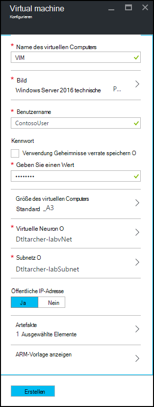
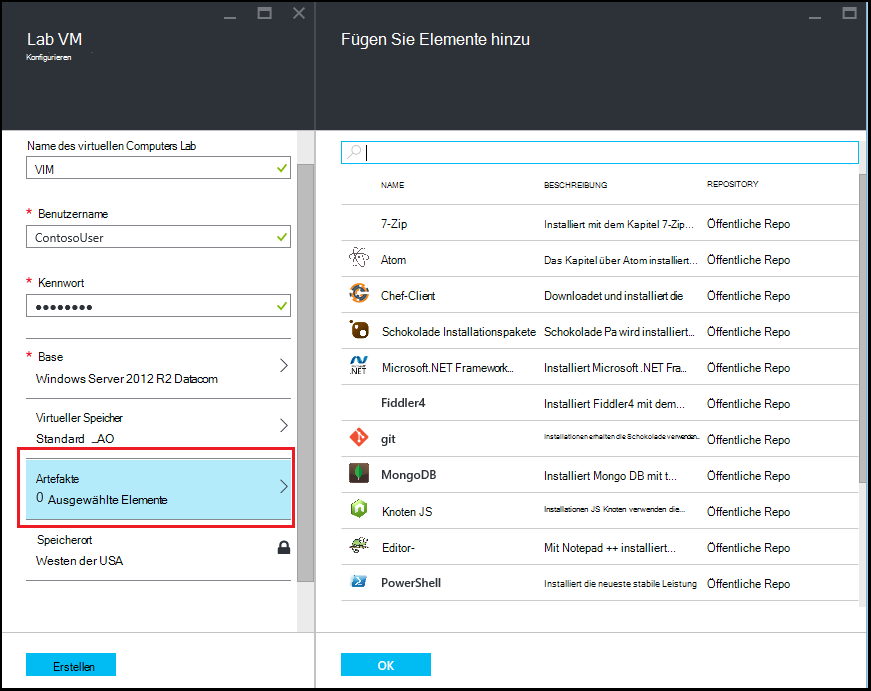
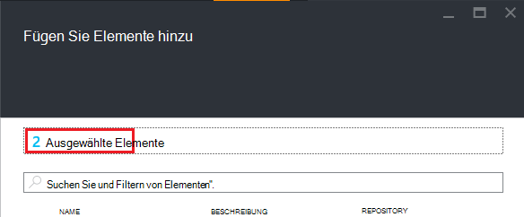

<properties
    pageTitle="Hinzufügen eine VM mit Lab in Azure DevTest Labs | Microsoft Azure"
    description="Informationen Sie zum Hinzufügen einer VM mit Artefakten in Azure DevTest Labs"
    services="devtest-lab,virtual-machines"
    documentationCenter="na"
    authors="tomarcher"
    manager="douge"
    editor=""/>

<tags
    ms.service="devtest-lab"
    ms.workload="na"
    ms.tgt_pltfrm="na"
    ms.devlang="na"
    ms.topic="article"
    ms.date="08/30/2016"
    ms.author="tarcher"/>

# Hinzufügen einer VM mit Lab in Azure DevTest Labs

> [AZURE.VIDEO how-to-create-vms-with-artifacts-in-a-devtest-lab]

Sie erstellen einen virtuellen Computer in einem Labor von einer *Basisklasse* , die ein [benutzerdefiniertes Bild](./devtest-lab-create-template.md), [Formel](./devtest-lab-manage-formulas.md)oder [Marketplace-Bild](./devtest-lab-configure-marketplace-images.md).

DevTest Labs *Artefakte* können Sie angeben, *Aktionen* , die ausgeführt werden, wenn die VM erstellt wird. 

Artefakt kann wie ausgeführten Windows PowerShell-Skripts Bash Befehle ausführen und Installation Aktionen. 

Artefakt- *Parameter* können Sie das Artefakt für Ihr spezielles Szenario anpassen.

Dieser Artikel beschreibt, wie einen virtueller Computer im Lab mit Artefakten erstellen.

## Fügen Sie einen virtuellen Computer mit

1. Mit der [Azure-Portal](http://go.microsoft.com/fwlink/p/?LinkID=525040)anmelden.

1. Wählen Sie **Weitere Dienste**und wählen Sie dann aus der Liste **DevTest Labs** .

1. Wählen Sie aus der Übungseinheiten der Übungseinheit die VM erstellt werden soll.  

1. Die Übungseinheit **Übersicht** Blade wählen Sie **+ virtuellen Computer**.  
    

1. Wählen Sie in **Wählen Sie Basis** -Blade Basis für die VM.

1. Geben Sie einen Namen für den neuen virtuellen Computer auf **virtuellen** Blade im Textfeld **Name des virtuellen Computers** .

    

1. Geben Sie einen **Benutzernamen** , die auf dem virtuellen Computer Administratorrechte gewährt werden.  

1. Ein Kennwort in Ihrem *geheimen Speicher*gespeichert werden soll, wählen Sie **Geheimnisse geheim Shop**und geben Sie einen Wert, der die Schlüssel (Kennwort) entspricht. Andernfalls geben Sie ein Kennwort in das Textfeld **Geben Sie einen Wert**mit der Bezeichnung.
 
1. Wählen Sie **virtuellen Computer aus** , und wählen Sie eine vordefinierte Elemente, die der Prozessorkerne, RAM-Größe und der Größe der Festplatte des virtuellen Computers erstellt angeben.

1. Wählen Sie **virtuellen Netzwerk** und das virtuelle Netzwerk.

1. Wählen Sie **Subnetz** und Subnetz.

1. Wenn öffentliche IP-Adressen für das ausgewählte Subnetz zu Lab-Richtlinie festgelegt ist, geben Sie an, ob die IP-Adresse zu öffentlichen entweder **Ja** oder **Nein**. Andernfalls wird diese Option deaktiviert und **nicht**ausgewählt. 

1. Wählen Sie **Artefakte** aus wählen Sie die Liste der Artefakte - und konfigurieren Sie die Artefakte, die das Basisabbild hinzufügen möchten. 
**Hinweis:** Wenn Sie neu DevTest Labs oder Konfigurieren von Artefakten, fahren Sie mit Abschnitt [Hinzufügen einer VM ein vorhandenes Artefakt](#add-an-existing-artifact-to-a-vm) , und kehren Sie hier Abschluss.

1. Möchten Sie anzeigen oder Kopieren der Azure-Ressourcen-Manager-Vorlage, fahren Sie mit Abschnitt der [Azure-Ressourcenmanager speichern](#save-arm-template) und wiederkommen abgeschlossen.

1. Wählen Sie **Erstellen** die Übungseinheit angegebene VM hinzufügen.

1. Lab-Blade zeigt den Status des virtuellen Computers erstellen. Zunächst wurde als **Erstellen**, dann nach der VM **Ausführen** gestartet.

1. Lesen Sie den Abschnitt [Weiter](#next-steps) . 

## Hinzufügen eines vorhandenen Elements einer VM

Beim Erstellen einer VM können Sie vorhandene Elemente hinzufügen. Jede Übungseinheit enthält Artefakte aus öffentlichen DevTest Labs Artefakt Repository sowie Elemente, die Sie erstellt und zum Artefakt-Repository hinzugefügt haben.
Erfahren Sie Artefakte erstellen finden Sie im Artikel [Informationen zum Autor Artefakte mit DevTest Labs](devtest-lab-artifact-author.md).

1. Wählen Sie **virtuellen** Blade **Artefakte**. 

1. Blatt **Hinzufügen Artefakte** wählen Sie das gewünschte Element.  

    

1. Geben Sie die erforderlichen Parameterwerte und optionale Parameter, die Sie benötigen.  

1. Wählen Sie das Artefakt und zurück zum Blatt **Artefakte hinzufügen** **Hinzufügen** .

1. Fügen Sie Artefakte für die VM.

1. Nachdem Sie Ihr Elemente hinzugefügt haben, können Sie [die Ausführungsreihenfolge der Artefakte ändern](#change-the-order-in-which-artifacts-are-run). Sie können auch zum [anzeigen oder Ändern eines Artefakts](#view-or-modify-an-artifact)zurück.

## Ändern der Ausführungsreihenfolge Artefakte

Standardmäßig werden die Aktionen Artefakte in der Reihenfolge ausgeführt, in denen sie den virtuellen Computer hinzugefügt. Die folgenden Schritte veranschaulichen, wie Sie die Reihenfolge ändern, in der die Elemente ausgeführt werden.

1. Oben Blatt **Artefakte hinzufügen** klicken Sie, die die Anzahl von Artefakten, die für die VM hinzugefügt wurden.

    

1. Um die Reihenfolge festzulegen, in der die Elemente ausgeführt werden, Drag & drop die Artefakte in der gewünschten Reihenfolge. **Hinweis:** Haben Sie Probleme beim Ziehen des Artefakts unbedingt Ziehen aus der linken Seite des Artefakts. 

1. Wählen Sie **OK** , wenn Sie fertig.  

## Anzeigen oder Ändern eines Artefakts

Die folgenden Schritte veranschaulichen anzeigen oder ändern Sie die Parameter eines Elements:

1. Oben Blatt **Artefakte hinzufügen** klicken Sie, die die Anzahl von Artefakten, die für die VM hinzugefügt wurden.

    

1. Wählen Sie Blatt **Artefakte ausgewählte** Artefakt, das Sie anzeigen oder bearbeiten möchten.  

1. Blade **Artefakt hinzufügen** Änderungen Sie erforderlichen, und wählen Sie **OK** zum Schließen Blade **Artefakt hinzufügen** .

1. Wählen Sie **OK** zu **Ausgewählten Artefakte** Blade.

## Azure Ressourcenmanager speichern

Eine Azure-Ressourcen-Manager-Vorlage ermöglicht das deklarative wiederholbare Bereitstellung definieren. Die folgenden Schritte erläutert Speichern der Vorlage Azure-Ressourcen-Manager für den virtuellen Computer erstellt wird.
Nach dem speichern können Sie Azure Ressourcenmanager Vorlage [Bereitstellen neuer VMs mit Azure PowerShell](../azure-resource-manager/resource-group-overview.md#template-deployment).

1. **VM** -Blade wählen Sie **ARM-Vorlage anzeigen**.

1. **Azure Ressourcenmanager-Vorlage Blade**wählen Sie Text für die Vorlage.

1. Kopieren Sie den markierten Text in die Zwischenablage.

1. Wählen Sie **OK** zu **Azure Ressourcenmanager-Vorlage Blade**.

1. Öffnen Sie einen Text-Editor.

1. Fügen Sie des Vorlage Textes aus der Zwischenablage ein.

1. Speichern Sie die Datei für die spätere Verwendung.

[AZURE.INCLUDE [devtest-lab-try-it-out](../../includes/devtest-lab-try-it-out.md)]

## Nächste Schritte

- Erstellte VM können die VM herstellen **Verbinden** auf die VM auswählen.
- Erfahren Sie, wie [benutzerdefinierte Elemente für Ihre DevTest Labs VM erstellt](devtest-lab-artifact-author.md).
- Der [Vorlagenkatalog DevTest Labs ARM Schnellstart](https://github.com/Azure/azure-devtestlab/tree/master/ARMTemplates)