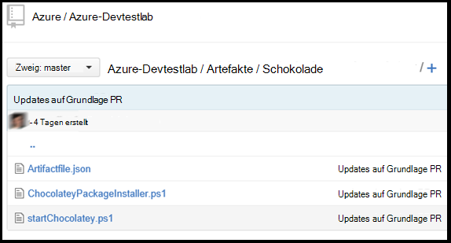

<properties 
    pageTitle="Erstellen Sie benutzerdefinierte Elemente für VM Labs DevTest | Microsoft Azure"
    description="Informationen Sie zum Erstellen eigener Artefakte mit DevTest Labs"
    services="devtest-lab,virtual-machines"
    documentationCenter="na"
    authors="tomarcher"
    manager="douge"
    editor=""/>

<tags
    ms.service="devtest-lab"
    ms.workload="na"
    ms.tgt_pltfrm="na"
    ms.devlang="na"
    ms.topic="article"
    ms.date="08/25/2016"
    ms.author="tarcher"/>

#Erstellen Sie benutzerdefinierte Elemente für VM DevTest Labs

> [AZURE.VIDEO how-to-author-custom-artifacts] 

## Übersicht
**Elemente** zum Bereitstellen und konfigurieren die Anwendung nach eine VM bereitgestellt wird. Ein Artefakt besteht aus einer Artefakt-Definitionsdatei und andere Skriptdateien in einem Ordner in einem Git Repository gespeichert sind. Artefakt Dateien bestehen aus JSON und Ausdrücke, mit denen Sie festlegen, was auf einem virtuellen Computer installieren. Beispielsweise können Sie den Namen des Artefakts, Befehl ausgeführt und verfügbar gemacht werden, wenn der Befehl Parameter definieren. Sie können andere Skriptdateien in der Artefakt-Definitionsdatei mit Namen verweisen.

##Artefakt Definition-Dateiformat
Das folgende Beispiel zeigt die Abschnitte, die die grundlegende einer Definitionsdatei Struktur.

    {
      "$schema": "https://raw.githubusercontent.com/Azure/azure-devtestlab/master/schemas/2015-01-01/dtlArtifacts.json",
      "title": "",
      "description": "",
      "iconUri": "",
      "targetOsType": "",
      "parameters": {
        "<parameterName>": {
          "type": "",
          "displayName": "",
          "description": ""
        }
      },
      "runCommand": {
        "commandToExecute": ""
      }
    }

| Elementnamen | Erforderlich? | Beschreibung
| ------------ | --------- | -----------
| $schema      | Nein        | Speicherort der JSON-Schemadatei, die bei der Validierung der Datei.
| Titel        | Ja       | Name des Artefakts im Labor angezeigt.
| Beschreibung  | Ja       | Beschreibung des Artefakts im Labor angezeigt.
| iconUri      | Nein        | Der URI des Symbol im Labor.
| targetOsType | Ja       | Betriebssystem des virtuellen Computers Artefakt Installationsort. Unterstützte Optionen sind: Windows und Linux.
| Parameter   | Nein        | Werte, die Ausführung von artefaktinstallationsbefehl auf einem Computer bereitgestellt werden. Dadurch Ihre Artefakt anpassen.
| AusführenBefehl   | Ja       | Artefakt Installationsbefehl, die auf einem virtuellen Computer ausgeführt wird.

###Artefakt-Parameter

Im Parameterabschnitt der Datei geben Sie die Werte einer beim Installieren eines Artefakts Benutzereingabe können. Sie finden diese Werte in der artefaktinstallationsbefehl.

Sie definieren Parameter die folgende Struktur.

    "parameters": {
        "<parameterName>": {
          "type": "<type-of-parameter-value>",
          "displayName": "<display-name-of-parameter>",
          "description": "<description-of-parameter>"
        }
      }

| Elementnamen | Erforderlich? | Beschreibung
| ------------ | --------- | -----------
| Typ         | Ja       | Typ des Parameterwerts. Finden Sie in der Liste der zulässigen Typen:
| DisplayName Ja       | Name des Parameters, der dem Benutzer im Labor angezeigt.
| Beschreibung  | Ja       | Beschreibung des Parameters, der in der Übungseinheit angezeigt wird.

Zulässigen Typen sind:

- eine beliebige gültige Zeichenfolge JSON-Zeichenfolge
- Int-eine gültige JSON-Ganzzahl
- Bool – jeder gültige JSON Boolean
- Array – alle gültigen JSON-array

##Artefakt-Ausdrücke und Funktionen

Ausdruck verwenden und Funktionen für das Artefakt erstellen Befehl installieren.
Ausdrücke in Klammern eingeschlossen ([und]), und wenn das Artefakt installiert wird ausgewertet. Ausdrücke können überall in einen Zeichenfolgenwert JSON und anderen JSON Wert immer zurück. Möchten Sie ein Zeichenfolgenliteral verwenden, bei denen eine Klammer [, verwenden Sie zwei Klammern [[.
Normalerweise verwenden Sie Ausdrücke mit Erstellen eines Werts. Wie werden in JavaScript-Funktionsaufrufe als functionName(arg1,arg2,arg3) formatiert

Die folgende Liste enthält häufig verwendete Funktionen.

- Parameters(Parametername) - gibt einen Parameterwert, der bei der Artefakt-Befehl ausgeführt wird.
- Concat (arg1, arg2, arg3,...) kombiniert mehrere Zeichenfolgenwerte. Diese Funktion akzeptiert eine beliebige Anzahl von Argumenten.

Das folgende Beispiel veranschaulicht die Ausdruck und Funktionen verwenden, um einen Wert zu erstellen.

    runCommand": {
         "commandToExecute": "[concat('powershell.exe -File startChocolatey.ps1'
    , ' -RawPackagesList ', parameters('packages')
    , ' -Username ', parameters('installUsername')
    , ' -Password ', parameters('installPassword'))]"
    }

##Erstellen einer benutzerdefinierten Artefakts

Erstellen Sie benutzerdefinierte Artefakt folgende Schritte:

1. Einen JSON-Editor installieren – Sie benötigen einen JSON-Editor funktioniert mit Artefakt. Es wird empfohlen, mit [Visual Studio Code](https://code.visualstudio.com/)für Windows, Linux und Mac OS verfügbar.

1. Erhalten ein Beispiel-artifactfile.json - Auschecken Artefakte erstellt Azure DevTest Labs Team unserer [GitHub Repository](https://github.com/Azure/azure-devtestlab) , in dem wir eine umfangreiche Bibliothek von Artefakten erstellt haben, mit denen Sie, eigene Elemente erstellen. Herunterladen einer artefaktdefinitionsdatei und ändern Ihre eigenen Artefakte zu erstellen.

1. Nutzen von IntelliSense - Nutzung IntelliSense gültigen Elemente anzeigen, die mit eine artefaktdefinitionsdatei erstellen. Sie können auch die verschiedenen Optionen für die Werte eines Elements anzeigen Z. B. IntelliSense zeigen Ihnen die Wahl zwischen zwei Windows oder Linux **TargetOsType** Element bearbeiten.

1. Speichern Sie das Artefakt in einem Repository git
    1. Erstellen Sie ein separates Verzeichnis für jedes Artefakt der Verzeichnisname Artefaktnamen identisch ist.
    1. Speichern Sie die Artefakt-Definitionsdatei (artifactfile.json) im Verzeichnis erstellten.
    1. Speichern Sie die Skripts, die von der artefaktinstallationsbefehl verwiesen werden.

    Hier ist ein Beispiel für ein Artefakt-Ordner aussehen könnte:

    

1. Fügen Sie Artefakte Repository Lab - finden Sie im Artikel [Git Artefakt Repository mit einem Kurs hinzufügen](devtest-lab-add-artifact-repo.md).

[AZURE.INCLUDE [devtest-lab-try-it-out](../../includes/devtest-lab-try-it-out.md)]

## Verwandte Blogbeiträge
- [Behandlung von Artefakten in AzureDevTestLabs fehl](http://www.visualstudiogeeks.com/blog/DevOps/How-to-troubleshoot-failing-artifacts-in-AzureDevTestLabs)
- [Fügen Sie eine VM vorhandenen AD-Domäne mithilfe von ARM-Vorlage in Azure Dev-Testlabor](http://www.visualstudiogeeks.com/blog/DevOps/Join-a-VM-to-existing-AD-domain-using-ARM-template-AzureDevTestLabs)

## Nächste Schritte

- Erfahren Sie, wie [Git Artefakt Repository mit einem Kurs hinzufügen](devtest-lab-add-artifact-repo.md).
