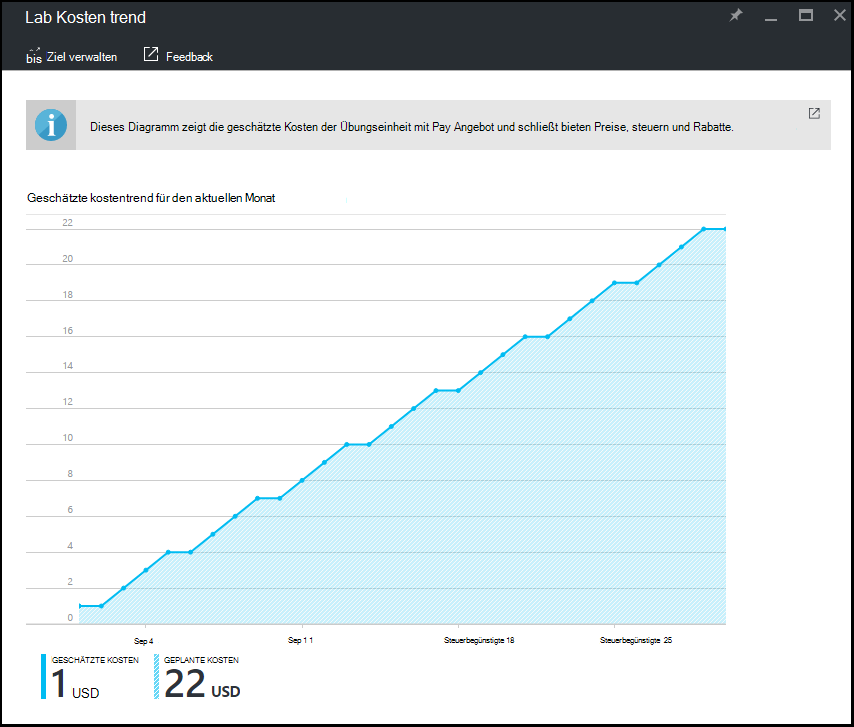

<properties
    pageTitle="Monatliche schätzungsweise Lab Kostenentwicklung in Azure DevTest Labs anzeigen | Microsoft Azure"
    description="Erfahren Sie mehr über Azure DevTest Labs monatliche Kosten Trenddiagramm."
    services="devtest-lab,virtual-machines"
    documentationCenter="na"
    authors="tomarcher"
    manager="douge"
    editor=""/>

<tags
    ms.service="devtest-lab"
    ms.workload="na"
    ms.tgt_pltfrm="na"
    ms.devlang="na"
    ms.topic="article"
    ms.date="09/06/2016"
    ms.author="tarcher"/>

# Monatliche schätzungsweise Lab Kostenentwicklung in Azure DevTest Labs anzeigen

Die Kosten von DevTest Labs hilft Ihnen Kosten Lab verfolgen. Dieser Artikel veranschaulicht, wie das **Monatliche schätzungsweise Kostenentwicklung** Diagramm aktuellen Kalendermonat geschätzten Kosten bis dato und die geplanten Kosten für Ende des Monats für den aktuellen Monat anzeigen. In diesem Artikel lernen Sie das monatlichen Kosten Trenddiagramm in Azure-Portal anzeigen.

## Monatliche schätzungsweise Kostenentwicklung Diagramm anzeigen

Um die monatliche schätzungsweise Kostenentwicklung Diagramm anzeigen möchten, gehen Sie folgendermaßen vor: 

1. Mit der [Azure-Portal](http://go.microsoft.com/fwlink/p/?LinkID=525040)anmelden.

1. Wählen Sie **Weitere Dienste**und wählen Sie dann aus der Liste **DevTest Labs** .

1. Wählen Sie aus der Übungseinheiten gewünschte Lab.   

1. Wählen Sie in der Übungseinheit Blade **Kosten**.

1. Wählen Sie Blatt **Kosten Einstellungen** der Übungseinheit **Kostenentwicklung Lab**.

1. Der folgende Screenshot zeigt ein Beispiel eines Diagramms Kosten. 

    

**Geschätzte Kosten** Wert ist der aktuelle Kalendermonat geschätzten Kosten bis dato. **Voraussichtlicher Kosten** sind die Kosten für die gesamte aktuelle Kalendermonat berechnet die Übungseinheit Kosten der letzten fünf Tage.
 
Einstandsbeträge werden auf die nächste ganze Zahl gerundet. Zum Beispiel: 

- 5.01 rundet bis zu 6 
- 5.50 rundet bis zu 6
- 5,99 rundet bis zu 6

Wie oben im Diagramm, sind die im Diagramm angezeigten *geschätzten* Kosten mit [nutzungsbasierte](https://azure.microsoft.com/offers/ms-azr-0003p/) Preise anbieten.
Darüber hinaus sind in der Berechnung *nicht* enthalten:

- CSP und Dreamspark-Abonnements werden derzeit nicht unterstützt Azure DevTest Labs [Azure Abrechnung APIs](../billing-usage-rate-card-overview.md) verwendet zur Berechnung der Kosten Lab, die CSP oder Dreamspark Abonnements nicht unterstützt.
- Ihre Preise bieten. Wir können derzeit nicht mit Ihrem Angebot Preise (unter Ihrem Abonnement), dass Sie mit Microsoft oder Microsoft Partner ausgehandelt haben. Wir verwenden nutzungsbasierte.
- Steuern
- Ihre Rabatte
- Ihre Abrechnungsinformationen Währung. Derzeit wird nur in der Währung USD Lab Kosten angezeigt.

[AZURE.INCLUDE [devtest-lab-try-it-out](../../includes/devtest-lab-try-it-out.md)]

## Verwandte Blogbeiträge

- [Zwei weitere Dinge Kosten auf DevTest Labs](https://blogs.msdn.microsoft.com/devtestlab/2016/06/21/keep-your-cost-on-track/)
- [Warum Kosten Schwellenwerte?](https://blogs.msdn.microsoft.com/devtestlab/2016/04/11/why-cost-thresholds/)

## Nächste Schritte

Hier sind einige Lösungswege, Weiter:

- [Lab-Richtlinien definieren](./devtest-lab-set-lab-policy.md) – wie die verschiedenen Richtlinien gesteuert, wie Lab und die virtuellen verwendet werden. 
- [Benutzerdefiniertes Bild erstellen](./devtest-lab-create-template.md) - Wenn Sie einen virtuellen Computer erstellen, geben Sie basiert, ein benutzerdefiniertes Bild oder Marketplace-Bild. Dieser Artikel veranschaulicht, wie ein benutzerdefiniertes Abbild von einer VHD-Datei zu erstellen.
- [Bilder konfigurieren Marketplace](./devtest-lab-configure-marketplace-images.md) - DevTest Labs unterstützt VMs basierend auf Azure Marketplace Bilder erstellen. Dieser Beitrag zeigt an, die ggf. Azure Marketplace Bilder werden verwendet, wenn VMs in einem Labor erstellt.
- [Erstellen einen virtuellen Computer einen Lab](./devtest-lab-add-vm-with-artifacts.md) - veranschaulicht das Erstellen einer VM aus einen Basisabbild (entweder benutzerdefiniert oder Markt), und mit der virtuellen Computer.