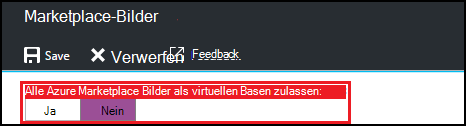
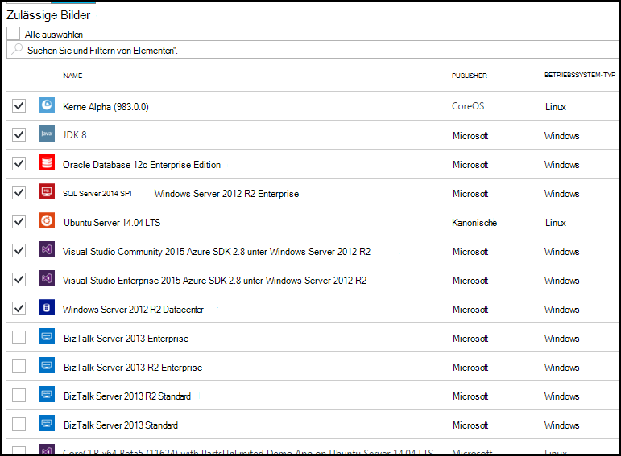

<properties
    pageTitle="Azure Marketplace Bild in Azure DevTest Labs konfigurieren | Microsoft Azure"
    description="Konfigurieren der Azure Marketplace-Bilder verwendet werden können, beim Erstellen einer VM in Azure DevTest Labs"
    services="devtest-lab,virtual-machines"
    documentationCenter="na"
    authors="tomarcher"
    manager="douge"
    editor=""/>

<tags
    ms.service="devtest-lab"
    ms.workload="na"
    ms.tgt_pltfrm="na"
    ms.devlang="na"
    ms.topic="article"
    ms.date="09/06/2016"
    ms.author="tarcher"/>

# Konfigurieren Sie Azure Marketplace Bild in Azure DevTest Labs

DevTest Labs unterstützt erstellen VMs basierend auf Azure Marketplace Bilder je nach Konfiguration Azure Marketplace Bilder im Lab verwendet werden. Dieser Artikel beschreibt, wie angegeben, die ggf. Azure Marketplace Bilder verwendet, wenn VMs in einem Labor erstellt.

## Wählen Sie beim Erstellen einer VM Azure Marketplace Bildern dürfen

1. Mit der [Azure-Portal](http://go.microsoft.com/fwlink/p/?LinkID=525040)anmelden.

1. Wählen Sie **Weitere Dienste**und wählen Sie dann aus der Liste **DevTest Labs** .

1. Wählen Sie aus der Übungseinheiten gewünschte Lab. 

1. Wählen Sie in der Übungseinheit Blade **Konfiguration**.
    
1. Wählen Sie auf Lab **Konfiguration** Blade **Marketplace Bilder**

1. Geben Sie an, ob alle qualifizierten Azure Marketplace Bilder für als Basis einer neuen VM. Wenn Sie **Ja**auswählen, werden alle Bilder von Azure Marketplace, die folgenden Kriterien erfüllen, im Labor zulässig:

    - Das Bild erstellt eine einzige VM **und**
    - Das Bild verwendet Azure Ressourcenmanager VMs **und** Bereitstellung
    - Das Bild erfordert keine zusätzliche Lizenzplan erwerben
    
    Wenn keine Bilder dürfen die Bilder verwendet werden sollen, wählen Sie **Nein**.
 
    
 
1. Wenn Sie zum vorherigen Schritt **Nein** wählen, wird **Zulässige Bilder/auswählen alle** Kontrollkästchen aktiviert. Sie können diese Option zusammen mit dem Suchfeld schnell aktivieren oder deaktivieren alle Elemente in der Liste angezeigt.
Sie können auch Bilder Azure Marketplace auswählen einzeln ermöglichen durch jedes Bild entsprechende Kontrollkästchen VM erstellen möchten.
Wählen Sie nichts aus möchten Sie jede Azure Marketplace Bilder in der Übungseinheit verwendet werden.

    

[AZURE.INCLUDE [devtest-lab-try-it-out](../../includes/devtest-lab-try-it-out.md)]

## Nächste Schritte

Nachdem Sie konfiguriert haben, wie Azure Marketplace Bilder zulässig sind, wenn Sie einen virtuellen Computer erstellen, besteht der nächste Schritt [eine VM Lab](./devtest-lab-add-vm-with-artifacts.md)hinzufügen.