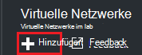
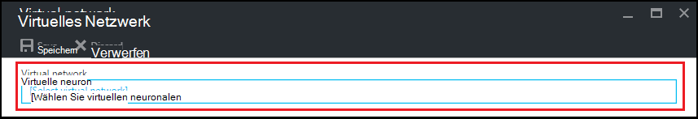
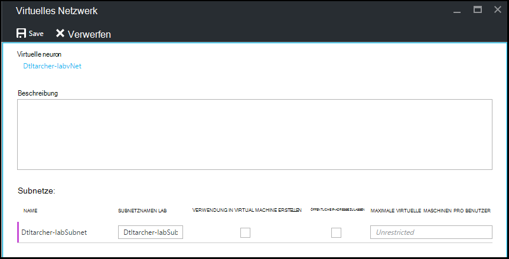

<properties
    pageTitle="Konfigurieren ein virtuelles Netzwerks in Azure Labs DevTest | Microsoft Azure"
    description="So konfigurieren Sie ein vorhandenes virtuelles Netzwerk und Subnetz und in einer VM mit Azure DevTest verwenden"
    services="devtest-lab,virtual-machines"
    documentationCenter="na"
    authors="tomarcher"
    manager="douge"
    editor=""/>

<tags
    ms.service="devtest-lab"
    ms.workload="na"
    ms.tgt_pltfrm="na"
    ms.devlang="na"
    ms.topic="article"
    ms.date="09/06/2016"
    ms.author="tarcher"/>

# Konfigurieren eines virtuellen Netzwerks in Azure DevTest Labs

Wie im Artikel [hinzufügen einen virtuellen Computer mit einem Labor](devtest-lab-add-vm-with-artifacts.md)beim Erstellen einer VM in einem Labor können Sie konfigurierten virtuellen Netzwerks angeben. Ein Szenario hierfür ist benötigen Sie Ihre virtuellen Computer im virtuellen Netzwerk, die mit ExpressRoute oder Standort-zu-Standort-VPN konfiguriert wurde Corpnet Ressourcen zugreifen. In den folgenden Abschnitten veranschaulichen, wie vorhandene virtuelle Netzwerk in einem Labor Virtual Network Settings hinzufügen, wählen Sie beim Erstellen von VMs verfügbar ist.

## Konfigurieren Sie virtuelles Netzwerk für eine Übungseinheit mit Azure-portal
Die folgenden Schritte führen Sie durch ein vorhandenes virtuelles Netzwerk und Subnetz eine Übungseinheit hinzufügen, so dass sie beim Erstellen einer VM in dasselbe Labor verwendet werden kann. 

1. Mit der [Azure-Portal](http://go.microsoft.com/fwlink/p/?LinkID=525040)anmelden.

1. Wählen Sie **Weitere Dienste**und wählen Sie dann aus der Liste **DevTest Labs** .

1. Wählen Sie aus der Übungseinheiten gewünschte Lab. 

1. Wählen Sie in der Übungseinheit Blade **Konfiguration**.

1. Wählen Sie in der Übungseinheit **Konfiguration** Blade **virtuelle Netzwerke**.

1. **Virtuelle Netzwerke** Blade sehen Sie eine Liste von virtuellen Netzwerken konfiguriert für die aktuelle Übungseinheit sowie virtuelle Standardnetzwerk, das für die Übungseinheit erstellt wird. 

1. Wählen Sie **+ Hinzufügen**.

    
    
1. Wählen Sie auf dem **virtuellen Netzwerk** -Blade aus **[virtuelles Netzwerk]**.

    
    
1. Blade **virtuelles Netzwerk wählen** wählen Sie das gewünschte virtuelle Netzwerk. Das Blade zeigt alle virtuellen Netzwerke Bereich im Abonnement als der Übungseinheit sind.  

1. Nachdem Sie auf ein virtuelles Netzwerk, kehren zum **virtuellen Netzwerk** Blade und mehrere Felder aktiviert sind.  

    

1. Geben Sie eine Beschreibung für das virtuelle Netzwerk / Lab-Kombination.

1. Um ein Subnetz in Übungseinheit VM-Erstellung verwendet werden, aktivieren Sie **Verwenden IN VIRTUAL MACHINE erstellen**.

1. Um öffentliche IP-Adressen in einem Subnetz zu ermöglichen, **Können öffentliche IP-Adresse**auswählen

1. Geben Sie im Feld **Maximale virtuelle Computer pro Benutzer** maximale VMs pro Benutzer für jedes Subnetz. Soll eine unbeschränkte Anzahl von VMs, lassen Sie dieses Feld leer.

1. **Wählen Sie aus.**

1. Jetzt die Konfiguration des virtuellen Netzwerks können sie beim Erstellen einer VM ausgewählt. Informationen zum Erstellen einer VM und geben Sie ein virtuelles Netzwerk, finden Sie im Artikel [Hinzufügen einer VM mit Artefakten an ein](devtest-lab-add-vm-with-artifacts.md). 

[AZURE.INCLUDE [devtest-lab-try-it-out](../../includes/devtest-lab-try-it-out.md)]

## Nächste Schritte

Sobald Sie das gewünschte virtuelle Netzwerk Lab hinzugefügt haben, besteht der nächste Schritt [eine VM Lab](devtest-lab-add-vm-with-artifacts.md)hinzufügen.