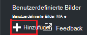
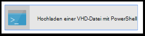
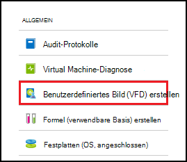
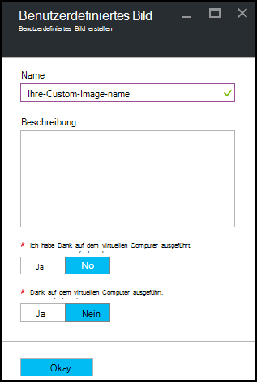

<properties
    pageTitle="Verwalten von benutzerdefinierten Images erstellen VMs Azure Labs DevTest | Microsoft Azure"
    description="So erstellen Sie ein benutzerdefiniertes Bild aus einer VHD-Datei oder aus einer vorhandenen VM in Azure DevTest Labs"
    services="devtest-lab,virtual-machines"
    documentationCenter="na"
    authors="tomarcher"
    manager="douge"
    editor=""/>

<tags
    ms.service="devtest-lab"
    ms.workload="na"
    ms.tgt_pltfrm="na"
    ms.devlang="na"
    ms.topic="article"
    ms.date="09/07/2016"
    ms.author="tarcher"/>

# Verwalten von benutzerdefinierten Images erstellen VMs Azure DevTest Labs

In Azure DevTest Labs können benutzerdefinierte Bilder VMs schnell erstellen, ohne die erforderliche Software auf dem Zielcomputer installiert werden. Benutzerdefinierte Bilder können Sie die Software installieren, die Sie in eine VHD-Datei, und verwenden die VHD-Datei auf einen virtuellen Computer erstellen. Da die Software bereits installiert ist, wird die Erstellungszeit VM schneller. Benutzerdefinierte Bilder dienen darüber hinaus VMs ein benutzerdefiniertes Abbild eines virtuellen Computers erstellen und Erstellen von VMs aus dem benutzerdefinierten Bild duplizieren.

In diesem Artikel erfahren Sie, wie:

- [Erstellen Sie ein benutzerdefiniertes Abbild einer VHD-Datei](#create-a-custom-image-from-a-vhd-file) , damit Sie das benutzerdefinierte Abbild dann einen virtuellen Computer erstellen können. 
- [Erstellen Sie ein benutzerdefiniertes Abbild von einer VM](#create-a-custom-image-from-a-vm) für schnelle VM klonen.

## Erstellen eines benutzerdefinierten Bildes aus einer VHD-Datei

In diesem Abschnitt erfahren Sie, wie ein benutzerdefiniertes Abbild von einer VHD-Datei zu erstellen.
Sie benötigen eine gültige VHD-Datei die Schritte in diesem Abschnitt ausführen.   

1. Mit der [Azure-Portal](http://go.microsoft.com/fwlink/p/?LinkID=525040)anmelden.

1. Wählen Sie **Weitere Dienste**und dann **DevTest Labs** aus.

1. Wählen Sie aus der Übungseinheiten gewünschte Lab.  

1. Wählen Sie in der Übungseinheit Blade **Konfiguration**. 

1. Wählen Sie **Konfiguration** Lab-Blade **benutzerdefinierte Bilder**.

1. Wählen Sie auf dem Blatt **benutzerdefinierte Bilder** **+ benutzerdefiniertes Bild**.

    

1. Geben Sie den Namen des benutzerdefinierten Bildes. Dieser Name wird beim Erstellen einer VM in der Basis Bilder angezeigt.

1. Geben Sie die Beschreibung des Abbilds. Diese Beschreibung erscheint in der Basis-Images beim Erstellen einer VM.

1. **VHD-Datei**auswählen

1. Haben Sie Zugriff auf eine VHD-Datei, die nicht aufgeführt ist, fügen sie gemäß der Anleitung im Abschnitt [eine VHD-Datei hochladen](#upload-a-vhd-file) , und wiederkommen Sie abgeschlossen.

1. Wählen Sie die gewünschte VHD-Datei.

1. Wählen Sie **OK** Blade **VHD-Datei** zu schließen.

1. **Betriebssystem**konfiguriert.

1. Wählen Sie auf der Registerkarte **Konfiguration des Betriebssystems** **Windows** oder **Linux**.

1. Wenn **Windows** Geben Sie über das Kontrollkästchen an, ob *Sysprep* auf dem Computer ausgeführt wurde.

1. Wählen Sie **OK** zum Schließen des **Betriebssystemkonfiguration** Blades.

1. Wählen Sie **OK** , um das benutzerdefinierte Abbild erstellen.

1. Lesen Sie den Abschnitt [Weiter](#next-steps) .

###Eine VHD-Datei hochladen

Um ein benutzerdefiniertes Bild hinzuzufügen, müssen Sie eine VHD-Datei zugreifen.

1. Wählen Sie Blade **VHD-Datei** **mit PowerShell VHD-Datei hochladen**.

    

1. Das nächste Blatt anzeigen Hinweise ändern und Ausführen eines PowerShell-Skripts, das in Azure-Abonnement eine VHD-Datei hochgeladen. 
**Hinweis:** Dieser Vorgang kann je nach Größe der VHD-Datei und der Geschwindigkeit der Verbindung lange.

## Erstellen Sie ein benutzerdefiniertes Abbild eines virtuellen Computers
Haben Sie einen virtuellen Computer, die bereits konfiguriert ist, kann ein benutzerdefiniertes Bild aus diesen virtuellen Computer erstellen und anschließend das benutzerdefinierte Abbild verwenden, um andere identische VMs erstellen. Die folgenden Schritte veranschaulichen, wie ein benutzerdefiniertes Abbild eines virtuellen Computers erstellen:

1. Mit der [Azure-Portal](http://go.microsoft.com/fwlink/p/?LinkID=525040)anmelden.

1. Wählen Sie **Weitere Dienste**und dann **DevTest Labs** aus.

1. Wählen Sie aus der Übungseinheiten gewünschte Lab.  

1. Wählen Sie in der Übungseinheit Blade **meiner virtuellen Computer**.
 
1. Blade **meiner virtuellen Computer** wählen Sie die VM auf das benutzerdefinierte Abbild erstellen soll aus.

1. Die VM-Blade wählen Sie **erstellen eigene (VHD)**.

    

1. Das Blade **erstellen Bild** Geben Sie einen Namen und eine Beschreibung für das benutzerdefinierte Bild. Diese Informationen werden beim Erstellen eines virtuellen Computers in der Liste der Basen angezeigt.

    

1. Wählen Sie, ob auf dem virtuellen Computer Sysprep ausgeführt wurde. Wenn auf dem virtuellen Computer nicht der Sysprep ausgeführt wurde, geben Sie an, ob Sysprep ausgeführt werden, wenn ein virtueller Computer von diesem benutzerdefinierten Abbild erstellt wird.

1. Wählen Sie **OK** Beendigung des Abbilds erstellt.

[AZURE.INCLUDE [devtest-lab-try-it-out](../../includes/devtest-lab-try-it-out.md)]

## Verwandte Blogbeiträge

- [Benutzerdefinierte Bilder oder Formeln?](https://blogs.msdn.microsoft.com/devtestlab/2016/04/06/custom-images-or-formulas/)
- [Benutzerdefinierte Bilder zwischen Azure DevTest Labs kopieren](http://www.visualstudiogeeks.com/blog/DevOps/How-To-Move-CustomImages-VHD-Between-AzureDevTestLabs#copying-custom-images-between-azure-devtest-labs)

##Nächste Schritte

Wenn Sie ein benutzerdefiniertes Bild für die Verwendung beim Erstellen einer VM hinzugefügt haben, besteht der nächste Schritt [eine VM Lab](./devtest-lab-add-vm-with-artifacts.md)hinzufügen.