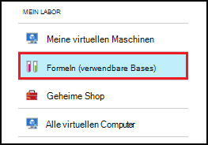
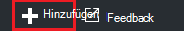
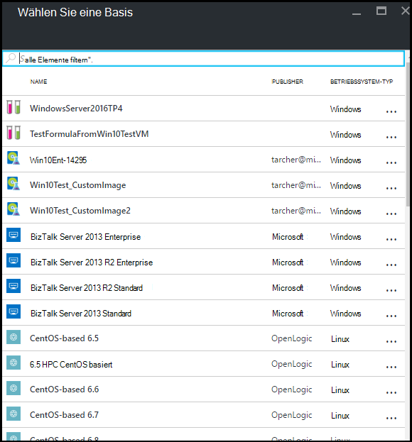
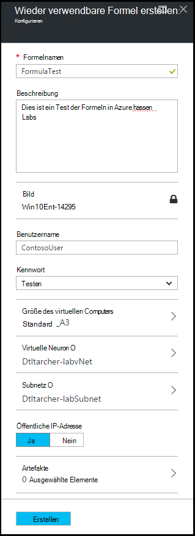
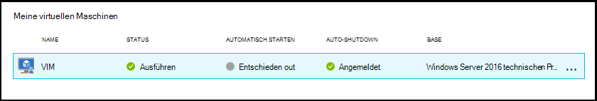
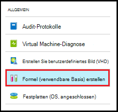
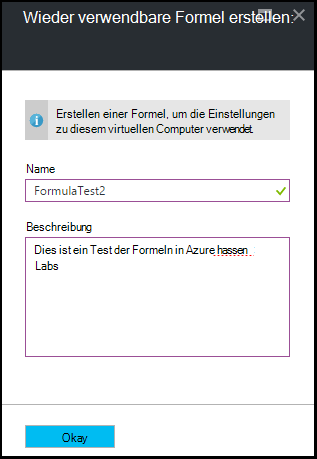
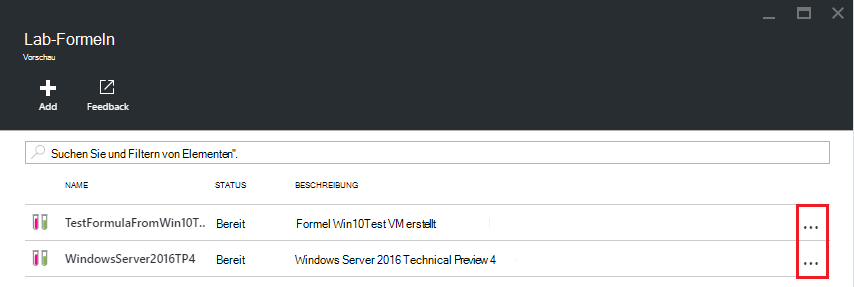
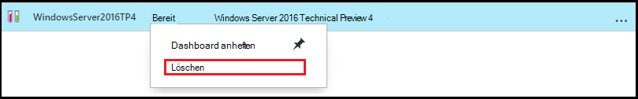

<properties
    pageTitle="Verwalten von Formeln in Azure DevTest Labs VMs erstellen | Microsoft Azure"
    description="Informationen Sie zum Erstellen, aktualisieren und entfernen Azure DevTest Labs Formeln und neue VMs zu verwenden."
    services="devtest-lab,virtual-machines"
    documentationCenter="na"
    authors="tomarcher"
    manager="douge"
    editor=""/>

<tags
    ms.service="devtest-lab"
    ms.workload="na"
    ms.tgt_pltfrm="na"
    ms.devlang="na"
    ms.topic="article"
    ms.date="08/30/2016"
    ms.author="tarcher"/>

# Verwalten Sie DevTest Labs Formeln erstellen VMs

Eine Formel in Azure DevTest Labs ist eine Liste der Standardwerte für Eigenschaften verwendet, um einen virtuellen Computer (VM) erstellen. Beim Erstellen einer VM aus einer Formel Standardwerte dienen als-, oder geändert. [Benutzerdefinierte Bilder](./devtest-lab-create-template.md) und [Marketplace Bilder](./devtest-lab-configure-marketplace-images.md)bieten Formeln einen Mechanismus für die schnelle Bereitstellung von VM.  

In diesem Artikel erfahren Sie, wie Sie folgende Aufgaben ausführen:

- [Erstellen einer Formel](#create-a-formula)
- [Verwenden einer Formel zum Bereitstellen einer VM](#use-a-formula-to-provision-a-vm)
- [Ändern einer Formel](#modify-a-formula)
- [Löschen einer Formel](#delete-a-formula)

> [AZURE.NOTE] Formeln – wie [benutzerdefinierte Bilder](./devtest-lab-create-template.md) - können Sie einen Basisabbild aus einer VHD-Datei erstellen. Das Basisabbild kann dann verwendet werden, einen neuen virtuellen Computer bereitstellen. Um zu entscheiden, welcher für Ihre spezielle Umgebung, finden Sie im Artikel [Vergleichen benutzerdefinierte Bilder und Formeln in DevTest Labs](./devtest-lab-comparing-vm-base-image-types.md).

## Erstellen einer Formel
Jeder DevTest Labs *Benutzer* Berechtigungen ist Erstellen virtueller Computer mithilfe einer Formel basiert. Es gibt zwei Methoden zum Erstellen von Formeln: 

- Basis - verwenden Sie um die Merkmale der Formel definieren möchten.
- Über ein vorhandenes Labor VM - Wenn eine Formel auf der Basis der vorhandenen VM erstellen möchten.

### Erstellen Sie eine Formel aus einer
Die folgenden Schritte führen Sie durch Erstellen Sie eine Formel in ein benutzerdefiniertes Bild Marketplace-Bild oder eine andere Formel.

1. Mit der [Azure-Portal](http://go.microsoft.com/fwlink/p/?LinkID=525040)anmelden.

1. Wählen Sie **Weitere Dienste**und wählen Sie dann aus der Liste **DevTest Labs** .

1. Wählen Sie aus der Übungseinheiten gewünschte Lab.  

1. Wählen Sie in der Übungseinheit Blade **Formeln (verwendbare Bases aus)**

    

1. Wählen Sie auf dem Blatt **Lab Formeln** **und hinzufügen**.

    

1. Wählen Sie in **Wählen Sie Basis** -Blade Base (benutzerdefiniertes Bild, Marketplace-Bild oder Formel) die Formel erstellt werden soll.

    

1. Geben Sie auf dem Blatt **Erstellen-Formel** die folgenden Werte:

    - **Formelnamen** - Geben Sie einen Namen für die Formel. Dieser Wert wird beim Erstellen eines virtuellen Computers in der Basis-Images angezeigt. Der Name wird überprüft, wie er eingegeben und bei, eine Meldung an einen gültigen Namen zeigt.
    - **Beschreibung** – Geben Sie eine aussagekräftige Beschreibung für die Formel. Dieser Wert ist Kontextmenü die Formel verfügbar, wenn Sie einen virtuellen Computer erstellen.
    - **Benutzername** – Geben Sie einen Benutzernamen, der Administratorrechte gewährt werden.
    - **Kennwort** - Geben Sie - oder wählen Sie aus der Dropdownliste - einen Wert, der den Schlüssel (Kennwort) zugeordnet ist, die für den angegebenen Benutzer verwenden möchten.  
    - **Bild** - dieses Feld zeigt den Namen des gewählten Basisabbild auf dem vorherigen Blatt. 
    - **Größe des virtuellen Computers** - wählen Sie eine der vordefinierten Artikel, die angeben der Prozessorkerne, RAM-Größe und der Größe der Festplatte des virtuellen Computers zu erstellen.
    - **Virtuelle Netzwerk** - Geben Sie das gewünschte virtuelle Netzwerk.
    - **Subnet** - Geben Sie das gewünschte Subnet.
    - **Öffentliche IP-Adresse** : Wenn das Lab, öffentliche IP-Adressen für das ausgewählte Subnetz können angeben, ob die IP-Adresse zu öffentlichen entweder **Ja** oder **Nein**festgelegt ist. Andernfalls wird diese Option deaktiviert und **nicht**ausgewählt.
    - **Artefakte** - auswählen und konfigurieren die Artefakte, die das Basisabbild hinzufügen möchten. Sicheren Sie Zeichenfolge Werte mit der Formel werden nicht gespeichert. Artefakt Parameter sichere Zeichenfolgen werden daher nicht angezeigt. 

        

1. Wählen Sie **Erstellen** die Formel erstellen.

### Erstellen Sie eine Formel aus einer VM
Die folgenden Schritte führen Sie durch eine Formel basierend auf einem vorhandenen virtuellen Computer erstellen. 

> [AZURE.NOTE] Zum Erstellen einer Formel aus einer VM muss VM nach dem 30. März 2016 erstellt wurden. 

1. Mit der [Azure-Portal](http://go.microsoft.com/fwlink/p/?LinkID=525040)anmelden.

1. Wählen Sie **Weitere Dienste**und wählen Sie dann aus der Liste **DevTest Labs** .

1. Wählen Sie aus der Übungseinheiten gewünschte Lab.  

1. Wählen Sie die Übungseinheit **Übersicht** Blade VM Formel erstellen möchten.

    

1. Die VM-Blade wählen Sie **Formel (verwendbare Basis) erstellen**.

    

1. Geben Sie auf dem Blatt **Erstellen-Formel** einen **Namen** und eine **Beschreibung** für die neue Formel.

    

1. Klicken Sie auf **OK** .

## Verwenden einer Formel zum Bereitstellen einer VM
Wenn Sie eine Formel erstellt haben, können Sie eine VM basierend auf dieser Formel erstellen. Im Abschnitt [Hinzufügen einer VM mit](devtest-lab-add-vm-with-artifacts.md#add-a-vm-with-artifacts) führt Sie durch den Prozess.

## Ändern einer Formel
Um eine Formel zu ändern, gehen Sie folgendermaßen vor:

1. Mit der [Azure-Portal](http://go.microsoft.com/fwlink/p/?LinkID=525040)anmelden.

1. Wählen Sie **Weitere Dienste**und wählen Sie dann aus der Liste **DevTest Labs** .

1. Wählen Sie aus der Übungseinheiten gewünschte Lab.  

1. Wählen Sie in der Übungseinheit Blade **Formeln (verwendbare Bases aus)**

    

1. Wählen Sie auf dem Blatt **Lab Formeln** Formel Sie ändern möchten.

1. Auf die **Formel zu aktualisieren** die Bearbeitungsschritte, und wählen Sie **Aktualisieren**.

## Löschen einer Formel 
Gehen Sie folgendermaßen vor, um eine Formel zu löschen:

1. Mit der [Azure-Portal](http://go.microsoft.com/fwlink/p/?LinkID=525040)anmelden.

1. Wählen Sie **Weitere Dienste**und wählen Sie dann aus der Liste **DevTest Labs** .

1. Wählen Sie aus der Übungseinheiten gewünschte Lab.  

1. Wählen Sie Blatt **Einstellungen** Lab **Formeln**.

    

1. Wählen Sie Blade **Lab Formeln** das Auslassungszeichen rechts neben der Formel, die Sie löschen möchten.

    

1. Wählen Sie im Kontextmenü die Formel **Löschen**.

    

1. Wählen Sie **Ja** , um das Bestätigungsdialogfeld löschen.

[AZURE.INCLUDE [devtest-lab-try-it-out](../../includes/devtest-lab-try-it-out.md)]

## Verwandte Blogbeiträge

- [Benutzerdefinierte Bilder oder Formeln?](https://blogs.msdn.microsoft.com/devtestlab/2016/04/06/custom-images-or-formulas/)

## Nächste Schritte
Nachdem Sie eine Formel für die Verwendung beim Erstellen einer VM erstellt haben, besteht der nächste Schritt [eine VM Lab](./devtest-lab-add-vm-with-artifacts.md)hinzufügen.