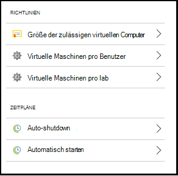
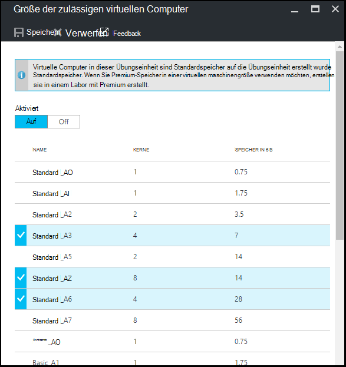
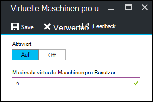
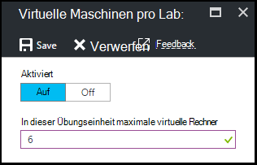
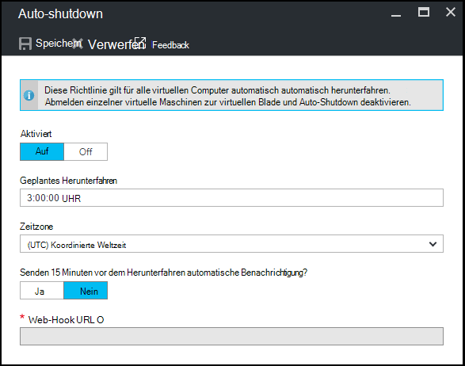
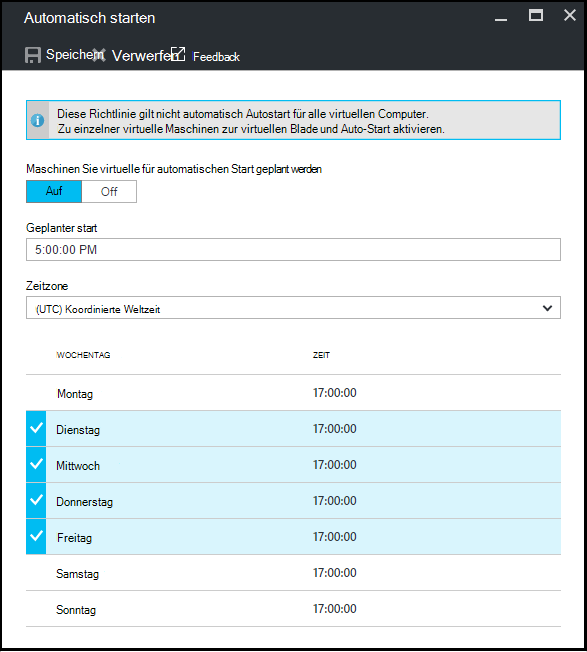

<properties
    pageTitle="Definieren Sie labrichtlinien in Azure DevTest Labs | Microsoft Azure"
    description="Informationen Sie zum labrichtlinien wie VM Größen maximale VMs pro Benutzer und Herunterfahren Automatisierung definieren."
    services="devtest-lab,virtual-machines"
    documentationCenter="na"
    authors="tomarcher"
    manager="douge"
    editor=""/>

<tags
    ms.service="devtest-lab"
    ms.workload="na"
    ms.tgt_pltfrm="na"
    ms.devlang="na"
    ms.topic="article"
    ms.date="09/12/2016"
    ms.author="tarcher"/>

# Labrichtlinien in Azure DevTest Labs definieren

> [AZURE.VIDEO how-to-set-vm-policies-in-a-devtest-lab]

Azure DevTest Labs können Sie Richtlinien festlegen, mit denen Kosten und Minimieren der Abfälle in der Übungseinheiten. Diese Übungseinheit Richtlinien enthalten die maximale Anzahl der VMs pro Benutzer und pro Lab und Auto-Shutdown und Autostart-Optionen erstellt. 

## Zugreifen auf eine Lab-Richtlinien in Azure DevTest Labs

Die folgenden Schritte führen Sie durch Einrichten von Richtlinien für eine Übungseinheit in Azure DevTest Labs:

Gehen folgendermaßen Sie vor um anzeigen und ändern die Richtlinien für eine Übungseinheit

1. Mit der [Azure-Portal](http://go.microsoft.com/fwlink/p/?LinkID=525040)anmelden.

1. Wählen Sie **Weitere Dienste**und dann **DevTest Labs** aus.

1. Wählen Sie aus der Übungseinheiten gewünschte Lab.   

1. Wählen Sie **Richtlinie**.

1. **Richtlinien** -Blade enthält ein Menü mit Optionen, die Sie angeben können: 

    

    Erfahren Sie mehr über das Festlegen einer Richtlinie wählen sie aus der folgenden Liste:

    - [Zugelassene Größen VM](#set-allowed-virtual-machine-sizes) - wählen Sie die Liste der VM-Größen im Labor darf. Benutzer kann VMs aus dieser Liste erstellen.

    - [Virtuelle Maschinen pro Benutzer](#set-virtual-machines-per-user) – Geben Sie die maximale Anzahl von VMs, die von einem Benutzer erstellt werden können. 

    - [Virtuelle Maschinen pro Lab](#set-virtual-machines-per-lab) - gibt die maximale Anzahl von virtuellen Maschinen für eine Übungseinheit erstellt werden können. 

    - [Auto-Shutdown](#set-auto-shutdown) - Geben Sie die Zeit als die aktuelle Übungseinheit VMs automatisch heruntergefahren ist.

    - [Autostart](#set-auto-start) – Geben Sie die Uhrzeit, als die aktuelle Übungseinheit VMs automatisch gestartet.

## Zulässigen Größe der virtuellen Computer

Richtlinien für das Festlegen der zulässigen VM-Größen kann zu Lab Abfälle durch angeben die VM-Größen in der Übungseinheit verwendet werden können. Wenn diese Richtlinie aktiviert ist, können nur VM Größen aus dieser Liste Erstellen virtueller Computer verwendet werden.

1. Wählen Sie in der Übungseinheit **Richtlinien** Blade **Zugelassene Größen virtuelle Computer aus**

    
 
1. Wählen Sie **für** diese Richtlinie aktivieren und **Deaktivieren** deaktiviert.

1. Wenn Sie diese Richtlinie aktivieren, wählen Sie mindestens eine VM-Größen, die im Lab erstellt werden können.

1. **Wählen Sie aus.**

## Gruppe von virtuellen Computern pro Benutzer

Richtlinie für **virtuelle Maschinen pro Benutzer** können Sie die maximale Anzahl virtueller Computer an, die von einem einzelnen Benutzer erstellt werden können. Wenn ein Benutzer versucht, einen virtuellen Computer erstellen, wenn Benutzerlimit erreicht wurde, wird die Meldung, dass die VM erstellt werden kann. 

1. Wählen Sie in der Übungseinheit **Richtlinien** Blade **virtuelle Maschinen pro Benutzer aus**

    

1. Wählen Sie **für** diese Richtlinie aktivieren und **Deaktivieren** deaktiviert.

1. Wenn Sie diese Richtlinie aktivieren, geben Sie einen numerischen Wert, der die maximale Anzahl der VMs, die von einem Benutzer erstellt werden können. Wenn Sie eine Zahl, die nicht gültig ist eingeben, zeigt die Benutzeroberfläche für dieses Feld zulässig.

1. **Wählen Sie aus.**

## Gruppe virtueller Maschinen pro lab

Die Richtlinie für **virtuelle Maschinen pro Lab** können Sie die maximale Anzahl der VMs für die aktuelle Übungseinheit erstellten angeben. Wenn ein Benutzer versucht, einen virtuellen Computer erstellen, wenn der Lab-Grenzwert erreicht wurde, wird die Meldung, dass die VM erstellt werden kann. 

1. Wählen Sie in der Übungseinheit **Richtlinien** Blade **virtuelle Maschinen pro Lab aus**

    

1. Wählen Sie **für** diese Richtlinie aktivieren und **Deaktivieren** deaktiviert.

1. Wenn Sie diese Richtlinie aktivieren, geben Sie einen numerischen Wert, der die maximale Anzahl der VMs für die aktuelle Übungseinheit erstellt werden können. Wenn Sie eine Zahl, die nicht gültig ist eingeben, zeigt die Benutzeroberfläche für dieses Feld zulässig.

1. **Wählen Sie aus.**

## Auto-Shutdown festlegen

Auto-Shutdown-Richtlinie hilft Lab Abfälle minimieren, indem Sie die Zeit angeben, die dieser Übungseinheit VMs heruntergefahren.

1. Wählen Sie in der Übungseinheit **Richtlinien** Blade **Auto-Shutdown**.

    

1. Wählen Sie **für** diese Richtlinie aktivieren und **Deaktivieren** deaktiviert.

1. Wenn Sie diese Richtlinie aktivieren, geben Sie die Ortszeit in die aktuelle Übungseinheit alle virtuellen Computer herunterfahren.

1. **Wählen Sie aus.**

1. Wenn aktiviert, gilt diese Richtlinie standardmäßig für alle virtuellen Computer in die aktuelle Übungseinheit. Um einen bestimmten virtuellen Computer diese Einstellung entfernen, öffnen Sie die VM-Blade und ändern Sie die Einstellung **Auto-shutdown** 

## Auto-Start festlegen

AutoStart-Richtlinie können Sie angeben, wenn die virtuellen Computer in die aktuelle Übungseinheit gestartet werden soll.  

1. Die Übungseinheit **Richtlinien** Blade wählen Sie **automatisch starten**.

    

1. Wählen Sie **für** diese Richtlinie aktivieren und **Deaktivieren** deaktiviert.

1. Wenn Sie diese Richtlinie aktivieren, geben Sie den lokalen geplante Startzeit und die Wochentage für die Zeit gilt. 

1. **Wählen Sie aus.**

1. Wenn aktiviert, wird diese Richtlinie auf VMs in die aktuelle Übungseinheit nicht automatisch angewendet. Um diese Einstellung gilt für einen bestimmten virtuellen Computer öffnen Sie die VM Blade, und ändern Sie die Einstellung **automatisch starten** 

[AZURE.INCLUDE [devtest-lab-try-it-out](../../includes/devtest-lab-try-it-out.md)]

## Nächste Schritte

Nachdem Sie definiert und angewendet verschiedenen VM-Richtlinien für die Übungseinheit, nachfolgend als Nächstes versuchen Folgendes:

- [Kostenmanagement konfigurieren](./devtest-lab-configure-cost-management.md) - veranschaulicht, wie das **Monatliche schätzungsweise Kostenentwicklung** Diagramm  
um den aktuellen Monat die Kosten bis dato und die geplanten Kosten für Ende des Monats geschätzt.
- [Benutzerdefiniertes Bild erstellen](./devtest-lab-create-template.md) - Wenn Sie einen virtuellen Computer erstellen, geben Sie basiert, ein benutzerdefiniertes Bild oder Marketplace-Bild. Dieser Artikel veranschaulicht, wie ein benutzerdefiniertes Abbild von einer VHD-Datei zu erstellen.
- [Konfigurieren Sie Marketplace Bilder](./devtest-lab-configure-marketplace-images.md) - Azure DevTest Labs unterstützt VMs basierend auf Azure Marketplace Bilder erstellen. Dieser Beitrag zeigt an, die ggf. Azure Marketplace Bilder werden verwendet, wenn VMs in einem Labor erstellt.
- [Erstellen einen virtuellen Computer einen Lab](./devtest-lab-add-vm-with-artifacts.md) - veranschaulicht das Erstellen einer VM aus einen Basisabbild (entweder benutzerdefiniert oder Markt), und mit der virtuellen Computer.
