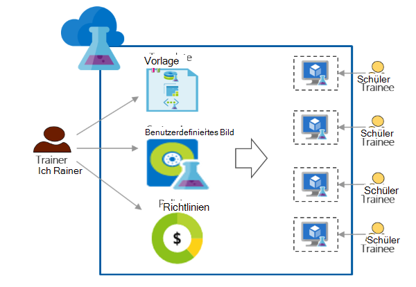

<properties
    pageTitle="Verwenden von Azure DevTest Labs für Schulung | Microsoft Azure"
    description="Informationen Sie zum Azure DevTest Labs trainingsszenarien verwenden."
    services="devtest-lab,virtual-machines"
    documentationCenter="na"
    authors="steved0x"
    manager="douge"
    editor=""/>

<tags
    ms.service="devtest-lab"
    ms.workload="na"
    ms.tgt_pltfrm="na"
    ms.devlang="na"
    ms.topic="article"
    ms.date="09/12/2016"
    ms.author="sdanie"/>

# Verwenden von Azure DevTest Labs für Schulung

Azure DevTest Labs kann viele wichtige Szenarien neben Test-/Implementierung verwendet werden. Eines dieser Szenarien ist ein Labor für Ausbildung einrichten. Azure DevTest Labs können Sie eine Übungseinheit erstellen, wo Sie Vorlagen, mit denen jeder Schüler erstellen identisch und isolierten Umgebung für die Schulung erhalten. Sie können sicherstellen, dass trainingsumgebung jeden Schüler stehen nur, wenn sie werden benötigt und genügend Ressourcen - wie virtueller Computer – erforderlich für die Schulung enthalten. Schließlich können Sie mühelos das Labor mit, gemeinsam die sie Mausklick zugreifen können.   

Azure DevTest Labs erfüllt folgende Training in einer virtuellen Umgebung durchführen müssen: 

-   Auszubildende nicht VMs erstellt von anderen Teilnehmern angezeigt.
-   Jede trainingsmaschine muss identisch sein.
-   Praktikanten können schnell ihre Ausbildung Umgebung bereitzustellen.
-   Steuern Sie Kosten, indem Sie sicherstellen, dass Praktikanten nicht mehr VMs als erforderlich für die Schulung und Herunterfahren virtueller Computer, wenn sie nicht verwendet werden
-   Mit jedem Auszubildenden Training Lab Teilen
-   Training Lab wieder verwenden

In diesem Artikel lernen Sie verschiedene Azure DevTest Labs Features, die zuvor beschriebenen Ausbildung und detaillierte Schritte, die zum Einrichten einer Übungseinheit Schulung können verwendet werden können.  

## Implementierung mit Azure DevTest Labs

1. **Erstellen der Übungseinheit** 

    Labs sind der Ausgangspunkt in Azure DevTest Labs. Nach dem Erstellen eines Labors können Sie Aufgaben ausführen wie Benutzer (Teilnehmer) der Übungseinheit hinzufügen Richtlinien festlegen, Kostenkontrolle definieren VM-Abbilder schnell erstellen können und mehr.   

    Weitere Informationen über die Links in der folgenden Tabelle:

  	| Aufgabe                                                            | Sie erfahren                                                    |
|-----------------------------------------------------------------|----------------------------------------------------------------------|
| [Einrichten eines Testlabors in Azure DevTest Labs](devtest-lab-create-lab.md) | Informationen Sie zum Labor in Azure DevTest Labs in Azure-Portal erstellen. |

2. **Schulung VMs in Minuten vorgefertigte Marketplace Bilder und benutzerdefinierte Bilder erstellen** 
    
    Sie können vorgefertigte Bilder aus einer Vielzahl von Bildern in Azure Marketplace entnehmen und für Auszubildende im Labor zur Verfügung stellen. Wenn vordefinierte Bilder Ihren Anforderungen nicht können Sie ein benutzerdefiniertes Bild erstellen, Erstellen einer Übungseinheit VM Azure Marketplace, Installieren der Software, die Sie für die Schulung und speichern die VM als benutzerdefinierte Bild im Labor fertige Bild aus. 

    Weitere Informationen über die Links in der folgenden Tabelle:

  	| Aufgabe                                                                              | Sie erfahren                                                                                                                                  |
|-----------------------------------------------------------------------------------|-------------------------------------------------------------------------------------------------------------------------------------------------|
| [Konfigurieren von Azure Marketplace Bilder](devtest-lab-configure-marketplace-images.md) | Erfahren Sie, wie Sie Whitelist Azure Marketplace Bilder; Verfügbarmachen für die Auswahl der Bilder soll für die Schulung.                 |
| [Erstellen eines benutzerdefinierten Bildes](devtest-lab-create-template.md)                           | Erstellen Sie ein benutzerdefiniertes Bild von vor der Installation benötigen Sie für die Schulung, Praktikanten einen virtueller Computer mithilfe des benutzerdefinierten Abbilds schnell erstellen können. |

3. **Vorlagen Sie wieder verwendbare für Maschinen** 

    Eine Formel in Azure DevTest Labs ist eine Liste der Standardwerte für Eigenschaften verwendet, um einen virtuellen Computer erstellen. Eine Formel können im Labor durch ein Bild, eine VM-Größe (eine Kombination von CPU und RAM) und ein virtuelles Netzwerk auswählen. Jeder Schüler kann die Formel im Labor und einen virtuellen Computer erstellen. 

    Weitere Informationen über die Links in der folgenden Tabelle:

  	| Aufgabe                                                                         | Sie erfahren                                                                                                          |
|------------------------------------------------------------------------------|-------------------------------------------------------------------------------------------------------------------------|
| [Verwalten Sie DevTest Labs Formeln erstellen VMs](devtest-lab-manage-formulas.md) | Erfahren Sie, wie Sie eine Formel erstellen, indem Sie sich ein Bild, virtueller Speicher (Kombination von CPU und RAM) und ein virtuelles Netzwerk. |

4. **Kostenkontrolle**

    Azure DevTest Labs können Sie eine Richtlinie in der Übungseinheit an Schüler in der Übungseinheit erstellen kann die maximale Anzahl der VMs festgelegt. 

    Mehrtägiges Training durchführen und stoppen alle VMs zu einer bestimmten Tageszeit und automatisch starten sie am nächsten Tag können leicht mit Auto-Shutdown ausführen und Autostart-Richtlinien in der Übungseinheit. 

    Schließlich nach Abschluss der Schulung können Sie die VMs auf einmal löschen durch Ausführen eines PowerShell-Skripts. 

    Weitere Informationen über die Links in der folgenden Tabelle:

  	| Aufgabe                                                                                                                                    | Sie erfahren                                                      |
|-----------------------------------------------------------------------------------------------------------------------------------------|---------------------------------------------------------------------|
| [Labrichtlinien definieren](devtest-lab-set-lab-policy.md)                                                                                    | Kostenkontrolle durch Festlegen von Richtlinien in der Übungseinheit.                       |
| [Löschen Sie alle Lab-VMs mithilfe eines PowerShell-Skripts](devtest-lab-faq.md#how-can-i-automate-the-process-of-deleting-all-the-vms-in-my-lab) | Löschen Sie die Übungseinheiten in einem Vorgang nach Abschluss die Ausbildung |

5. **Jeder Schüler die Übungseinheit freigeben**

    Übungseinheiten können direkt über eine Verbindung mit der Freigabe zugegriffen werden. Die Teilnehmer müssen noch ein Azure-Konto haben wie sie ein [Microsoft-Konto](devtest-lab-faq.md#what-is-a-microsoft-account)verfügen. Auszubildende nicht VMs erstellt von anderen Teilnehmern angezeigt.  

    Weitere Informationen über die Links in der folgenden Tabelle:

  	| Aufgabe                                                                                                                                | Sie erfahren                                                   |
|-------------------------------------------------------------------------------------------------------------------------------------|------------------------------------------------------------------|
| [Übungseinheit in Azure DevTest Labs Praktikant hinzufügen](devtest-lab-add-devtest-user.md)                                                     | Verwenden des Azure-Portals Training Lab Praktikanten hinzu.       |
| [Mithilfe eines PowerShell-Skripts Lab fügen Sie Praktikanten hinzu](devtest-lab-add-devtest-user.md#add-an-external-user-to-a-lab-using-powershell) | Mithilfe von PowerShell hinzufügen Auszubildenden Training Lab automatisieren. |
| [Einen Link zu der Übungseinheit](devtest-lab-faq.md#how-do-i-share-a-direct-link-to-my-lab)                                                  | Erfahren Sie, wie ein Labor über Hyperlink direkt zugegriffen werden kann.        |

6. **Die Übungseinheit wieder verwenden** 

    Sie automatisieren Lab erstellen, einschließlich der benutzerdefinierte Einstellungen durch Erstellen einer Vorlage Ressourcenmanager und identische Labs wieder zu verwenden. 

    Weitere Informationen über die Links in der folgenden Tabelle:

  	| Aufgabe                                                                                                                               | Sie erfahren                                                      |
|------------------------------------------------------------------------------------------------------------------------------------|---------------------------------------------------------------------|
| [Einrichten eines Testlabors Ressourcenmanager Vorlage](devtest-lab-faq.md#how-do-i-create-a-lab-from-an-azure-resource-manager-template) | Erstellen Sie Labs in Azure DevTest Labs Ressourcenmanager Vorlagen. |

[AZURE.INCLUDE [devtest-lab-try-it-out](../../includes/devtest-lab-try-it-out.md)]  

