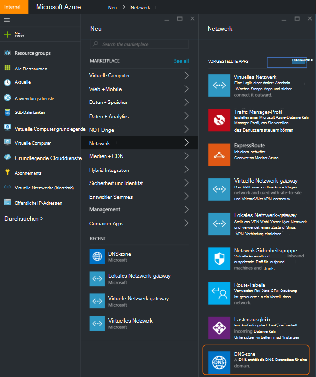
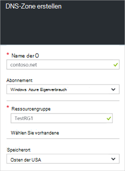
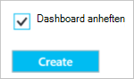
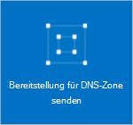
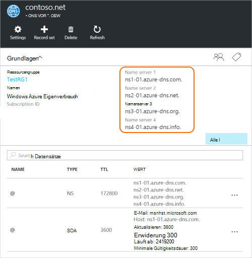
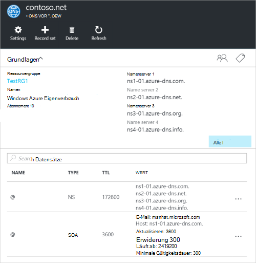

<properties
   pageTitle="Zum Erstellen und Verwalten einer DNS-Zone in Azure-Portal | Microsoft Azure"
   description="Informationen Sie zum Erstellen von DNS-Zonen für Azure DNS. Dies ist eine schrittweise Anleitung zum Erstellen und verwalten Ihre erste DNS und Hosten der DNS-Domäne mithilfe von Azure Portal gestartet."
   services="dns"
   documentationCenter="na"
   authors="sdwheeler"
   manager="carmonm"
   editor=""
   tags="azure-resource-manager"/>

<tags
   ms.service="dns"
   ms.devlang="na"
   ms.topic="article"
   ms.tgt_pltfrm="na"
   ms.workload="infrastructure-services"
   ms.date="08/16/2016"
   ms.author="sewhee"/>

# Erstellen einer DNS-Zone in Azure-portal

> [AZURE.SELECTOR]
- [Azure-Portal](dns-getstarted-create-dnszone-portal.md)
- [PowerShell](dns-getstarted-create-dnszone.md)
- [Azure CLI](dns-getstarted-create-dnszone-cli.md)

Dieser Artikel führt Sie durch die Schritte zum Erstellen einer DNS-Zone mit Azure-Portal. Sie können auch eine DNS-Zone mit PowerShell oder CLI erstellen.

[AZURE.INCLUDE [dns-create-zone-about](../../includes/dns-create-zone-about-include.md)]

### Über Tags für Azure DNS

Tags sind eine Liste von Name-Wert-Paaren und werden von Azure Ressourcenmanager Bezeichnung Ressourcen für Rechnungsadresse oder gruppieren. Weitere Informationen zu Tags finden Sie unter [Tags Azure Ressourcen zu verwenden](../resource-group-using-tags.md).

Mit der **Einstellung** für die DNS-Zone können Sie Tags in Azure-Portal hinzufügen.

## Erstellen einer DNS-zone

1. Azure-Portal anmelden

2. Klicken Sie im Hub auf, und klicken Sie auf **Neu > Netzwerk >** **DNS-Zone** DNS-Zone Blade öffnen klicken.

    

3. Klicken Sie auf die **DNS-Zone** unten auf **Erstellen** . **Erstellen von DNS-Zone** Blade wird geöffnet.

    

4. **Erstellen Sie DNS-Zone** Blade Namen der DNS-Zone. Z. B. *contoso.com*. Finden Sie im Abschnitt [Zu DNS-Namen](#names) .

5. Geben Sie dann die Ressourcengruppe, die Sie verwenden möchten. Sie können eine neue Ressourcengruppe erstellen oder auswählen, der bereits vorhanden ist.

6. Geben Sie in der Dropdownliste **Speicherort** den Speicherort der Ressourcengruppe. Beachten Sie, dass diese Einstellung auf den Speicherort der Ressourcengruppe nicht den Speicherort für die DNS-Zone verweist. Die DNS-zonenressource automatisch "global" und nicht etwas, das Sie können (oder müssen) im Portal angeben.

7. Lassen Sie **auf Dashboard** Kontrollkästchen aktiviert, wenn Sie zum Auffinden der neuen Zone in das Dashboard. Klicken Sie auf **Erstellen**.

    

8. Nach dem Erstellen klicken, sehen Sie die neue Zone auf dem Dashboard konfiguriert.

    

9. Beim Erstellen der neuen Zone Öffnet das Blade für die neue Zone auf dem Dashboard.

## Datensätze anzeigen

Erstellen einer DNS-Zone erstellt außerdem die folgenden Datensätze:

- Der Datensatz "Start of Authority" (SOA). Die SOA ist am Stamm jeder DNS-Zone.
- Autorisierenden Datensätze der Namensserver (NS). Diese zeigen die Namenserver die Zone hosten. Azure DNS verwendet einen Pool Namens-Server und Zonen in Azure DNS können also andere Namenserver zugewiesen werden. Weitere Informationen finden Sie unter [Delegaten Azure DNS Domäne](dns-domain-delegation.md) .

Sie können den Azure-Portal anzeigen

1. Der **DNS-Zone** -Blade klicken Sie auf **Alle Einstellungen** auf dem **Blatt Einstellungen** für die DNS-Zone.

    

2. Im unteren Teil des Bereichs Essentials sehen Sie, dass der Datensatz für die DNS-Zone fest.

    

## Test

Sie können Ihrer DNS-Zone mit DNS-Tools wie Nslookup oder Dig [Auflösen DnsName PowerShell-Cmdlet](https://technet.microsoft.com/library/jj590781.aspx)testen.

Wenn Ihre Domäne für die neue Zone in Azure DNS noch delegiert noch nicht, müssen Sie die DNS-Abfrage direkt auf einem Namenserver für die Zone direkt. Der Namenserver für die Zone erhalten in den NS-Einträge durch aufgeführt `Get-AzureRmDnsRecordSet` oben. Achten Sie ersetzen die Werte für Ihre Zone in folgenden Befehl.

    nslookup
    > set type=SOA
    > server ns1-01.azure-dns.com
    > contoso.com

    Server: ns1-01.azure-dns.com
    Address:  208.76.47.1

    contoso.com
            primary name server = ns1-01.azure-dns.com
            responsible mail addr = msnhst.microsoft.com
            serial  = 1
            refresh = 900 (15 mins)
            retry   = 300 (5 mins)
            expire  = 604800 (7 days)
            default TTL = 300 (5 mins)

## Löschen einer DNS-zone

Sie können die DNS-Zone direkt vom Portal aus. Vor dem Löschen einer DNS-Zone in Azure DNS, müssen Sie alle Recordsets außer NS- und SOA Datensätze im Stamm der Zone zu löschen, die beim Erstellen die Zone automatisch erstellt wurden.

1. Das **DNS-Zone** Blade für die Zone, die Sie löschen möchten, und klicken Sie oben im Blatt **Löschen** .

2. Eine Meldung wird darauf hingewiesen, dass alle Recordsets mit Ausnahme der NS- und SOA, oder löschen Sie die automatisch erstellten angezeigt. Wenn Sie Ihre Datensätze gelöscht haben, klicken Sie auf **Ja**. Beachten Sie, dass beim Löschen einer DNS-Zone vom Portal aus der Ressourcengruppe die DNS-Zone zugeordnet ist nicht gelöscht werden.

## Nächste Schritte

Erstellen Sie nach dem Erstellen einer DNS-Zone, [Datensätze und Datensätze](dns-getstarted-create-recordset-portal.md) zum Auflösen von Namen für Ihre Internetdomäne starten.
