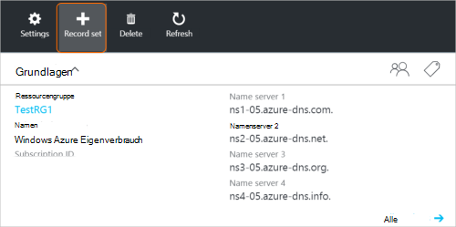
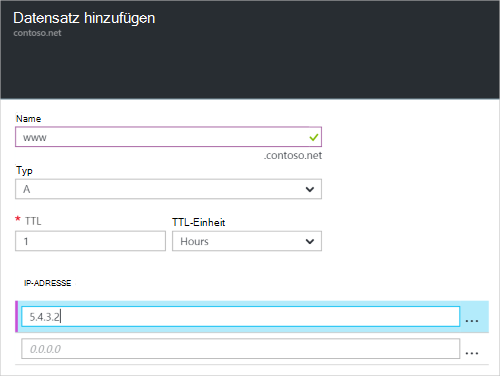

<properties
   pageTitle="Erstellen Sie Datensätze für eine DNS-Zone mithilfe des Azure-Portals und eine Datensatzgruppe | Microsoft Azure"
   description="Wie Azure DNS-Hostdatensätze erstellen und Datensätze und Datensätze über das Azure-Portal erstellen"
   services="dns"
   documentationCenter="na"
   authors="sdwheeler"
   manager="carmonm"
   editor=""
   tags="azure-resource-manager"/>

<tags
   ms.service="dns"
   ms.devlang="na"
   ms.topic="article"
   ms.tgt_pltfrm="na"
   ms.workload="infrastructure-services"
   ms.date="08/16/2016"
   ms.author="sewhee"/>

# Erstellen Sie DNS-Datensätze und Datensätze mithilfe des Azure-Portals

> [AZURE.SELECTOR]
- [Azure-Portal](dns-getstarted-create-recordset-portal.md)
- [PowerShell](dns-getstarted-create-recordset.md)
- [Azure CLI](dns-getstarted-create-recordset-cli.md)

Dieser Artikel führt Sie durch die Datensätze und Recordsets mithilfe des Azure-Portals erstellen. Nach der Erstellung der DNS-Zone wird die DNS-Datensätze für Ihre Domäne hinzufügen. Dazu müssen Sie DNS-Einträge und Datensätze.

[AZURE.INCLUDE [dns-about-records-include](../../includes/dns-about-records-include.md)]

## Erstellen einer Datensatzgruppe und Datensatz

Im folgende Beispiel führt Sie durch den Prozess der Erstellung einer Datensatzmenge und Datensatz mithilfe des Azure-Portals. Wir verwenden den Datensatztyp DNS "A".

1. Mit dem Portal anmelden.

2. Gehen Sie an die **DNS-Zone** Blade, in der Sie eine Datensatzgruppe erstellen möchten.

3. Wählen Sie am oberen Rand der **DNS-Zone** Blade Blade **Hinzufügen Datensatz** öffnen **Datensatz** .

    

4. Das Blade **Hinzufügen Datensatz** Namen Sie Datensätzen. Beispielsweise können Sie die Datensatzgruppe "**Www**" nennen.

    

5. Wählen Sie den Datensatz, den Sie erstellen möchten. Wählen Sie z. B. **ein**.

6. Set **TTL**. Die Standardzeit für das Portal live beträgt eine Stunde.

7. Fügen Sie die IP-Adressen eine IP-Adresse pro Zeile. Bei Verwendung der vorgeschlagene Datensatz Namen und Datensatztyp beschriebenen hinzugefügt IPv4-Adressen der **A** -Datensatz für die Datensatzgruppe Www.

8. Nachdem Sie IP-Adressen hinzugefügt haben, wählen Sie **OK** unten das Blade. Der DNS-Datensatz wird erstellt.

## Nächste Schritte

Zur Verwaltung Ihrer Datensatzgruppe und Datensätze finden Sie unter [Verwalten von DNS-Einträgen und Datensatz wird mit der Azure-Portal](dns-operations-recordsets-portal.md).

Weitere Informationen zu Azure DNS finden Sie unter [Übersicht über Azure DNS](dns-overview.md).
