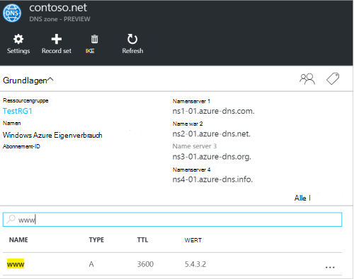
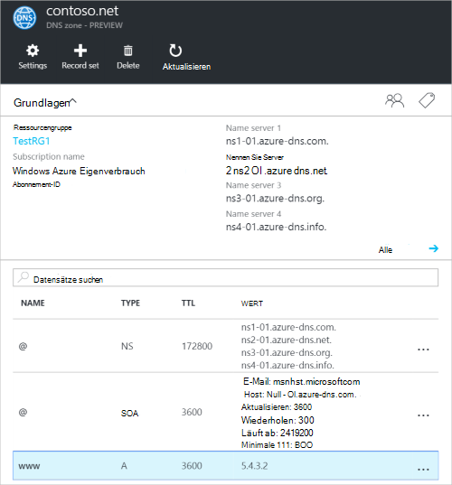
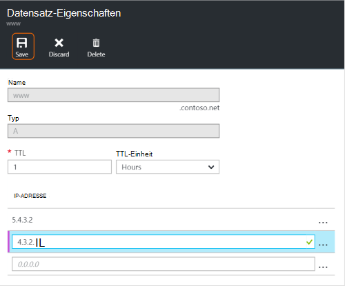
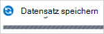
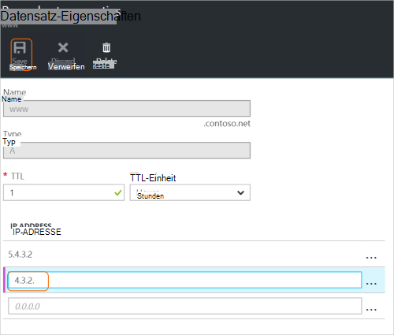
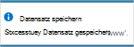
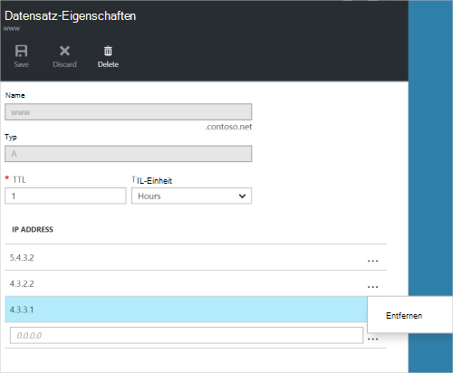
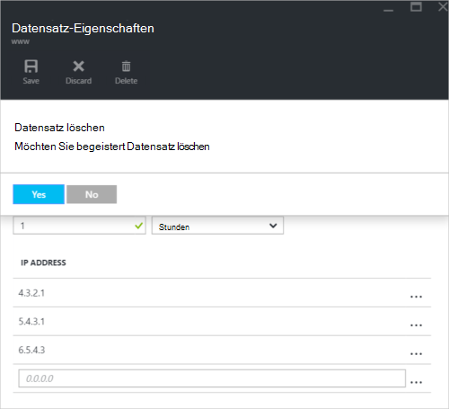

<properties
   pageTitle="DNS-Datensätze und Datensätze mit Azure-Portal verwalten | Microsoft Azure"
   description="Verwalten von DNS Datensatz wird und beim Hosten Ihrer Domäne Azure DNS aufgezeichnet."
   services="dns"
   documentationCenter="na"
   authors="sdwheeler"
   manager="carmonm"
   editor=""
   tags="azure-resource-manager"/>

<tags
   ms.service="dns"
   ms.devlang="na"
   ms.topic="article"
   ms.tgt_pltfrm="na"
   ms.workload="infrastructure-services"
   ms.date="08/16/2016"
   ms.author="sewhee"/>

# Verwalten von DNS-Datensätzen und Datensatz wird mit der Azure-portal

> [AZURE.SELECTOR]
- [Azure-Portal](dns-operations-recordsets-portal.md)
- [Azure CLI](dns-operations-recordsets-cli.md)
- [PowerShell](dns-operations-recordsets.md)

Dieser Artikel beschreibt, wie Datensätze und Datensätze für die DNS-Zone mit Azure-Portal verwalten.

Es ist wichtig, den Unterschied zwischen DNS-Datensätze und einzelnen DNS-Einträge. Eine Datensatzgruppe ist eine Auflistung von Datensätzen in einer Zone, die denselben Namen und denselben Typ aufweisen. Weitere Informationen finden Sie unter [Erstellen von DNS-Datensätzen und Datensätzen mithilfe des Azure-Portals](dns-getstarted-create-recordset-portal.md).

## Erstellen Sie einen neuen Datensatz und Datensatz

Erstellen Sie ein Recordset in Azure-Portal finden Sie unter [Erstellen von DNS-Einträgen mithilfe des Azure-Portals](dns-getstarted-create-recordset-portal.md).

## Datensatz anzeigen

1. Wechseln Sie in Azure-Portal an die **DNS-Zone** Blade.

2. Datensatzgruppe suchen und auswählen. Datensatz-Eigenschaften wird geöffnet.

    

## Einen neuen Datensatz zu einem Datensatz hinzufügen

Sie können bis zu 20 Datensätze auf jede Datensatzgruppe hinzufügen. Ein Datensatz kann nicht zwei identische Datensätze enthält. Leere Datensätze (mit null) erstellt werden, aber Azure DNS-Namenserver nicht angezeigt. Datensätze vom Typ CNAME können einen Datensatz enthalten.

1. Klicken Sie auf dem Blatt **Datensatz legen Sie Eigenschaften** für die DNS-Zone Datensatzgruppe, die Sie einen Datensatz hinzufügen möchten.

    

2. Geben Sie der Datensatz Eigenschaften festlegen, indem Sie die Felder ausfüllen.

    

2. Klicken Sie am oberen Rand der Blade zum Speichern der Einstellungen **Speichern** . Schließen Sie das Blade ein.

3. In der Ecke sehen Sie der Datensatz speichern.

    

Nach dem Speichern des Datensatzes wird die auf die **DNS-Zone** des neuen Datensatzes Werten.

## Aktualisieren eines Datensatzes

Beim Aktualisieren eines Datensatzes in einem vorhandenen Datensatz hängen den Typ des Datensatzes mit Felder aktualisiert werden können.

1. Suchen Sie auf dem Blatt **Datensatz legen Sie Eigenschaften** für die Datensatzgruppe für den Datensatz.

2. Ändern Sie den Datensatz. Wenn Sie einen Datensatz ändern, können Sie Einstellungen für den Datensatz ändern. Im folgenden Beispiel die **IP-Adresse** aktiviert ist und die IP-Adresse wird gerade geändert.

    

3. Klicken Sie am oberen Rand der Blade zum Speichern der Einstellungen **Speichern** . In der oberen rechten Ecke sehen Sie die Meldung, die dem Speichern des Datensatzes.

    

Nach dem Speichern des Datensatzes wird die für den Eintrag auf die **DNS-Zone** den aktualisierten Datensatz Werten.

## Entfernen eines Datensatzes aus einer Datensatzgruppe

Azure-Portal können Sie um Datensätze aus einer Datensatzgruppe zu entfernen. Beachten Sie, dass den letzten Datensatz aus einem Datensatz entfernen Datensatzgruppe nicht löschen.

1. Suchen Sie auf dem Blatt **Datensatz legen Sie Eigenschaften** für die Datensatzgruppe für den Datensatz.

2. Klicken Sie auf den Datensatz, den Sie entfernen möchten. Wählen Sie **Entfernen**.

    

3. Klicken Sie am oberen Rand der Blade zum Speichern der Einstellungen **Speichern** .

3. Nach dem Entfernen des Datensatzes reflektiert die Werte für den Datensatz auf dem **DNS-Zone** entfernen.

## Datensatz löschen

1. **Datensatz Eigenschaften** Blade für den Eintrag festzulegen, klicken Sie auf **Löschen**.

    

2. Eine Meldung gefragt, ob Sie die Datensätze löschen möchten.

3. Stellen Sie sicher, dass Recordsets, den zu löschen übereinstimmt, klicken Sie auf **Ja**.

4. Das Blade **DNS-Zone** sicher, dass das Recordset nicht mehr sichtbar ist.

## Arbeiten Sie mit Datensätzen NS- und SOA

NS- und SOA-Datensätze automatisch erstellt werden, werden anders aus anderen Datensatztypen verwaltet.

### SOA-Datensätze ändern

Sie können keine Datensätze hinzufügen oder Entfernen von automatisch erstellten SOA-Eintrag der Zone Spitze festlegen (Name = "@"). Jedoch können die Parameter im SOA-Eintrag (außer "Host") und des Datensatzes TTL.

### NS-Ressourceneinträge in der Zone Spitze ändern

Sie können nicht hinzufügen, entfernen oder Ändern von Datensätzen in der automatisch erstellten NS-Datensatz an der Spitze Zone festgelegt (Name = "@"). Die einzige Änderung zulässig ist ist die Datensatzgruppe TTL ändern.

### SOA oder NS-Datensätze löschen

Die SOA können nicht gelöscht werden und NS-Datensatz an der Spitze Zone festgelegt (Name = "@") , werden automatisch erstellt, wenn die Zone erstellt wird. Sie werden automatisch gelöscht, wenn die Zone zu löschen.

## Nächste Schritte

-   Weitere Informationen zu Azure DNS finden Sie unter [Übersicht über Azure DNS](dns-overview.md).
-   Weitere Informationen zum Automatisieren von DNS finden Sie unter [Erstellen von DNS-Zonen und Datensatz wird mit dem .NET SDK](dns-sdk.md).
-   Weitere Informationen über reverse-DNS-Einträge finden Sie unter [Verwalten von reverse DNS-Datensätze für Ihre Dienste mithilfe von PowerShell](dns-reverse-dns-record-operations-ps.md).
