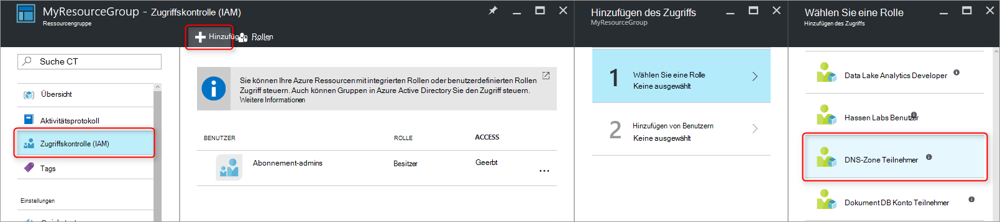
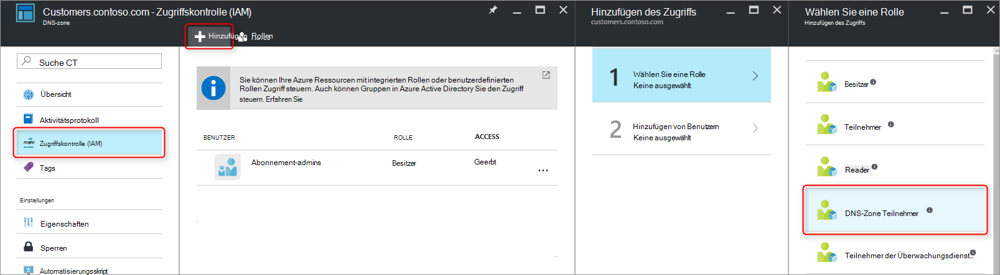
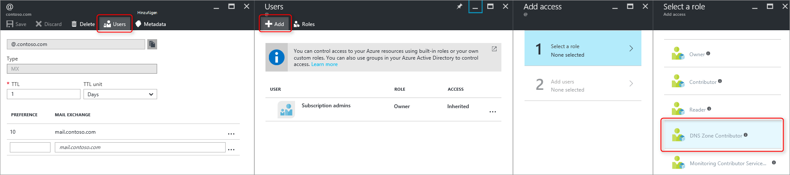
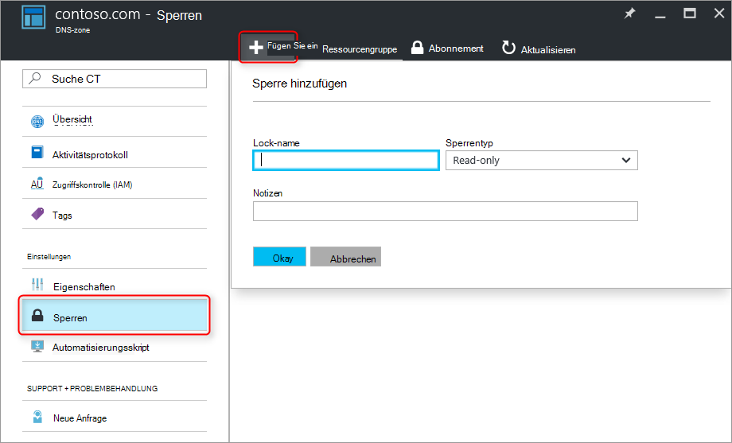

<properties 
   pageTitle="Schützen von DNS-Zonen und Einträge | Microsoft Azure" 
   description="Zum Schutz von DNS-Zonen und Datensätze in Microsoft Azure DNS." 
   services="dns" 
   documentationCenter="na" 
   authors="jtuliani" 
   manager="carmonm" 
   editor=""/>

<tags
   ms.service="dns"
   ms.devlang="na"
   ms.topic="article"
   ms.tgt_pltfrm="na"
   ms.workload="infrastructure-services" 
   ms.date="10/20/2016"
   ms.author="jtuliani"/>

# Schützen von DNS-Zonen und Einträge

DNS-Zonen und Einträge sind wichtige Ressourcen. Löschen einer DNS-Zone oder auch nur einen DNS-Eintrag kann insgesamt Dienstausfall führen.  Daher ist es wichtig, dass wichtige DNS-Zonen und Einträge gegen nicht autorisierten oder versehentlichen geschützt sind.

Dieser Artikel beschreibt, wie Azure DNS können Sie die DNS-Zonen und Einträge gegen eine solche Änderung schützen.  Wir übernehmen zwei leistungsstarke Sicherheitsfeatures von Azure-Ressourcen-Manager: [Rollenbasierte Zugriffskontrolle](../active-directory/role-based-access-control-what-is.md) und [Ressourcensperren](../resource-group-lock-resources.md).

## Rollenbasierte Zugriffskontrolle

(Azure Role-Based Access Control, RBAC) ermöglicht die detaillierte Verwaltung für Azure Benutzer, Gruppen und Ressourcen. RBAC verwenden, können Sie genau den Umfang erteilen Benutzer für ihre Aufgaben benötigen. Weitere Informationen, wie Rollenbasierten Zugriff verwalten kann finden Sie unter [Rollenbasierte Zugriffskontrolle](../active-directory/role-based-access-control-what-is.md).

### Die Rolle 'DNS-Zone Teilnehmer'

Die Rolle "DNS-Zone Teilnehmer" ist eine integrierte Rolle zum Verwalten von DNS-Ressourcen von Azure bereitgestellt.  Benutzer oder Gruppen Berechtigungen DNS-Zone zuweisen, können dieser Gruppe zum Verwalten von DNS-Ressourcen, aber nicht die Ressourcen eines anderen Typs.

Angenommen Sie, dass die Ressource "Myzones" enthält fünf Zonen für Contoso Corporation. Erteilen den DNS-Administrator "DNS-Zone" Teilnehmerberechtigungen, Gruppe, ermöglicht vollständige Kontrolle über die DNS-Zonen. Es verhindert auch unnötigen Berechtigungen gewähren, z. B. DNS-Administrator kann nicht erstellt oder Anhalten von virtuellen Maschinen.

Am einfachsten Rollenbasierten Berechtigungen ist [der Azure-Portal](../active-directory/role-based-access-control-configure.md).  Öffnen Sie das Blatt "Access Control (IAM)" für die Ressourcengruppe, klicken Sie auf 'Hinzufügen' und wählen Sie die Rolle "DNS-Zone Contributor" und wählen Sie Benutzer oder Gruppen Berechtigungen.

Berechtigungen können auch [mithilfe von Azure PowerShell gewährt](../active-directory/role-based-access-control-manage-access-powershell.md)werden:

    # Grant 'DNS Zone Contributor' permissions to all zones in a resource group
    New-AzureRmRoleAssignment -SignInName <user email address> -RoleDefinitionName "DNS Zone Contributor" -ResourceGroupName <resource group name>

Der entsprechende Befehl steht auch [über die CLI Azure](../active-directory/role-based-access-control-manage-access-azure-cli.md):

    # Grant 'DNS Zone Contributor' permissions to all zones in a resource group
    azure role assignment create --signInName  <user email address> --roleName "DNS Zone Contributor" --resourceGroup <resource group name>

### Zonenebene RBAC

Azure RBAC-Regeln können ein Abonnement, eine Ressourcengruppe oder eine einzelne Ressource angewendet werden. Bei Azure DNS kann diese Ressource eine einzelne DNS-Zone oder einen einzelnen Datensatz festlegen.

Angenommen Sie, dass die Ressource "Myzones" enthält die Zone "contoso.com" und eine Unterzone 'customers.contoso.com' in der CNAME-Einträge für jedes Debitorenkonto erstellt werden.  Konto zum Verwalten dieser CNAME-Einträge sollten Berechtigungen zum Erstellen von Datensätzen in der 'customers.contoso.com'-Zone zugewiesen werden, es sollte keinen Zugriff auf die anderen Zonen.

Azure Portal können auf Zonenebene Rollenbasierten Berechtigungen erteilt werden.  Öffnen Sie das Blatt "Access Control (IAM)" für die Zone, klicken Sie auf 'Hinzufügen', und wählen Sie die Rolle "DNS-Zone Contributor" und wählen Sie die Benutzer oder Gruppen Berechtigungen.

Berechtigungen können auch [mithilfe von Azure PowerShell gewährt](../active-directory/role-based-access-control-manage-access-powershell.md)werden:

    # Grant 'DNS Zone Contributor' permissions to a specific zone
    New-AzureRmRoleAssignment -SignInName <user email address> -RoleDefinitionName "DNS Zone Contributor" -ResourceGroupName <resource group name> -ResourceName <zone name> -ResourceType Microsoft.Network/DNSZones

Der entsprechende Befehl steht auch [über die CLI Azure](../active-directory/role-based-access-control-manage-access-azure-cli.md):

    # Grant 'DNS Zone Contributor' permissions to a specific zone
    azure role assignment create --signInName <user email address> --roleName "DNS Zone Contributor" --resource-name <zone name> --resource-type Microsoft.Network/DNSZones --resource-group <resource group name>

### Datensatz festlegen RBAC

Wir können einen Schritt weiter gehen. Betrachten Sie den e-Mail-Administrator für Contoso Corporation MX und TXT-Datensätze an der Spitze der Zone "contoso.com" zugreifen.  Sie zugreifen nicht andere MX- oder TXT Datensätze oder Datensätze eines anderen Typs.  Azure DNS können Sie e-Mail-Administrator benötigt Zugriff auf genau die Datensätze Berechtigungen auf Datensatz zuweisen.  Der e-Mail-Administrator erhält präzise steuern sie benötigt, und kann andere Änderungen.
  
Datensatz-Satz Rollenbasierten Berechtigungen können über Azure-Portal mit der Schaltfläche 'Benutzer' Datensatz Blatt konfiguriert werden:

Datensatz-Satz Rollenbasierten Berechtigungen kann auch [mithilfe von Azure PowerShell gewährt](../active-directory/role-based-access-control-manage-access-powershell.md):

    # Grant permissions to a specific record set
    New-AzureRmRoleAssignment -SignInName <user email address> -RoleDefinitionName "DNS Zone Contributor" -Scope "/subscriptions/<subscription id>/resourceGroups/<resource group name>/providers/Microsoft.Network/dnszones/<zone name>/<record type>/<record name>" 

Der entsprechende Befehl steht auch [über die CLI Azure](../active-directory/role-based-access-control-manage-access-azure-cli.md):

    # Grant permissions to a specific record set
    azure role assignment create --signInName <user email address> --roleName "DNS Zone Contributor" --scope "/subscriptions/<subscription id>/resourceGroups/<resource group name>/providers/Microsoft.Network/dnszones/<zone name>/<record type>/<record name>"

### Benutzerdefinierte Rollen

Der integrierte "DNS-Zone" Beitragendenrolle ermöglicht Vollzugriff auf einen DNS-Ressourceneinträge. Es ist möglich, eigene Kunden Azure-Rollen auch feinere Steuerung.

Beispiel erneut in der CNAME-Eintrag in der Zone 'customers.contoso.com' für jedes Debitorenkonto Contoso Corporation erstellt wird.  Zur Verwaltung dieser CNAMEs Konto gewährt Berechtigung zum Verwalten von CNAME-Einträge.  Es kann dann Datensätze anderer Typen (z. B. MX-Datensätze) ändern oder Operationen auf der Zonenebene wie Zone löschen.

Das folgende Beispiel zeigt eine benutzerdefinierte Rollendefinition zum Verwalten von CNAME-Einträge:

    {
        "Name": "DNS CNAME Contributor",
        "Id": "",
        "IsCustom": true,
        "Description": "Can manage DNS CNAME records only.",
        "Actions": [
            "Microsoft.Network/dnsZones/CNAME/*",
            "Microsoft.Network/dnsZones/read",
            "Microsoft.Authorization/*/read",
            "Microsoft.Insights/alertRules/*",
            "Microsoft.ResourceHealth/availabilityStatuses/read",
            "Microsoft.Resources/deployments/*",
            "Microsoft.Resources/subscriptions/resourceGroups/read",
            "Microsoft.Support/*"
        ],
        "NotActions": [
        ],
        "AssignableScopes": [
            "/subscriptions/ c276fc76-9cd4-44c9-99a7-4fd71546436e"
        ]
    }

Actions-Eigenschaft definiert die folgenden DNS-spezifische Berechtigungen:

- `Microsoft.Network/dnsZones/CNAME/*`gewährt Vollzugriff auf CNAME-Einträge
- `Microsoft.Network/dnsZones/read`erteilt die Berechtigung zum Lesen von DNS-Zonen, nicht jedoch ändern, so dass Sie die Zone mit der CNAME-Eintrag erstellt wird.

Die verbleibenden Aktionen werden aus der [DNS-Zone-integrierte Teilnehmerrolle](../active-directory/role-based-access-built-in-roles.md#dns-zone-contributor)kopiert.

>[AZURE.NOTE] Verwenden einer benutzerdefinierten RBAC-Rolle zu Datensätze löschen, während dennoch aktualisiert werden keine wirksame Kontrolle. Verhindert, dass Datensätze gelöscht, aber es verhindert nicht, dass sie geändert werden.  Zulässige Änderungen enthalten hinzufügen und Entfernen von Datensätzen aus Datensatzgruppe, einschließlich des Entfernens aller Datensätze 'empty' Datensatzgruppe verlassen. Dies hat dieselbe Wirkung wie das Löschen des Datensatzes aus DNS-Auflösung Sicht festgelegt.

Benutzerdefinierte Rollendefinitionen können derzeit Azure Portal definiert werden. Eine benutzerdefinierte Rolle basierend auf diese Rollendefinition kann mithilfe von Azure PowerShell erstellt werden:

    # Create new role definition based on input file
    New-AzureRmRoleDefinition -InputFile <file path>

Sie können auch über die CLI Azure erstellt werden:

    # Create new role definition based on input file
    azure role create –inputfile <file path>

Die Rolle kann dann wie integrierte Rollen zugewiesen werden, wie weiter oben in diesem Artikel beschrieben.

Weitere Informationen zum Erstellen verwalten und Zuweisen von benutzerdefinierten Rollen, [Benutzerdefinierte Rollen in Azure RBAC](../active-directory/role-based-access-control-custom-roles.md).

## Ressourcensperren

Neben RBAC unterstützt Azure-Ressourcen-Manager einen anderen Sicherheitsfunktionen, nämlich die Fähigkeit, Ressourcen "Lock". Wo RBAC Regeln steuern können Aktionen bestimmte Benutzer und Gruppen Ressourcensperren auf die Ressource angewendet und gelten für alle Benutzer und Rollen. Weitere Informationen finden Sie unter [Sperrenressourcen mit Azure-Ressourcen-Manager](../resource-group-lock-resources.md).

Es gibt zwei Arten von Ressourcensperre: **DoNotDelete** und **ReadOnly**. Dies können zu einer DNS-Zone oder auf einen einzelnen Datensatz angewendet werden.  Den folgenden Abschnitten werden verschiedene Szenarien und wie sie unterstützt Ressourcen verwenden.

### Schutz gegen alle

Um Änderungen zu verhindern, wird wenden Sie eine schreibgeschützte Sperre Zone an.  Dadurch wird verhindert, dass neue Datensätze angelegt und vorhandene Datensätze geändert oder gelöscht werden.

Zone auf Anwendungsebene sperren können Azure Portal erstellt werden.  DNS-Zone Blade, klicken Sie auf "Sperren", dann "hinzufügen":

Auf Zonenebene Ressource sperren auch über PowerShell Azure erstellt werden können:

    # Lock a DNS zone
    New-AzureRmResourceLock -LockLevel <lock level> -LockName <lock name> -ResourceName <zone name> -ResourceType Microsoft.Network/DNSZones -ResourceGroupName <resource group name> 

Konfiguration von Azure Ressourcensperren wird derzeit über die Azure-CLI nicht unterstützt.

### Schützen einzelner Datensätze
Um eine vorhandene DNS-Eintrag vor Änderung zu verhindern, die Datensatzgruppe zuweisen Sie eine schreibgeschützte Sperre.

>[AZURE.NOTE] DoNotDelete Sperre auf einen Datensatz anwenden ist eine wirksame Kontrolle. Verhindert den Eintrag gelöscht, aber es verhindert nicht, dass es geändert werden.  Zulässige Änderungen enthalten hinzufügen und Entfernen von Datensätzen aus Datensatzgruppe, einschließlich des Entfernens aller Datensätze 'empty' Datensatzgruppe verlassen. Dies hat dieselbe Wirkung wie das Löschen des Datensatzes aus DNS-Auflösung Sicht festgelegt.

Datensatz auf Anwendungsebene sperren können derzeit nur mit Azure PowerShell konfiguriert.  Sie werden nicht in der Azure-Portal oder Azure CLI unterstützt.

    # Lock a DNS record set
    New-AzureRmResourceLock -LockLevel <lock level> -LockName <lock name> -ResourceName <zone name>/<record set name> -ResourceType Microsoft.Network/DNSZones/<record type> -ResourceGroupName <resource group name> 

### Schutz gegen Zone löschen

Wenn eine Zone in Azure DNS gelöscht wird, werden alle Datensätze in der Zone ebenfalls gelöscht.  Dieser Vorgang kann nicht rückgängig gemacht werden.  Versehentlich einen kritischen Bereich hat eine erhebliche Produktivitätssteigerung haben.  Daher ist es sehr wichtig zum Schutz gegen unbeabsichtigte Zone löschen.

Anwenden einer Sperre DoNotDelete einer Zone wird verhindert, dass die Zone gelöscht.  Da Sperren von untergeordneten Ressourcen übernommen werden, verhindert es jedoch auch alle Datensätze in der Zone gelöscht wird, die möglicherweise unerwünscht.  Darüber hinaus ist wie zuvor beschrieben, es ineffektiv da Datensätze aus vorhandenen Datensätze noch entfernt werden können.

Stattdessen sollten Sie einen Eintrag in der Zone wie die SOA Datensatz gesperrt DoNotDelete zuweisen.  Da die Zone gelöscht werden kann, ohne auch die Datensätze gelöscht, schützt diese Zone löschen gleichzeitig Datensätze innerhalb der Zone frei geändert werden. Wenn versucht wird, die Zone zu löschen, erkennt Azure-Ressourcen-Manager diese Datensatzgruppe SOA würde auch löschen und wird der Aufruf blockiert, da die SOA gesperrt ist.  Es werden keine Datensätze gelöscht.

Der folgende PowerShell-Befehl erstellt eine DoNotDelete Sperre SOA-Eintrag angegebenen Zone:

    # Protect against zone delete with DoNotDelete lock on the record set
    New-AzureRmResourceLock -LockLevel DoNotDelete -LockName <lock name> -ResourceName <zone name>/@ -ResourceType Microsoft.Network/DNSZones/SOA -ResourceGroupName <resource group name> 

Verhindert unbeabsichtigte Zone löschen wird mit einer benutzerdefinierten Rolle Operators und Dienstkonten, die zum Verwalten von Zones keinen Zone Berechtigungen löschen. Wenn Sie eine Zone löschen müssen, können Sie zwei löschen erste gewähren Löschberechtigungen (im Bereich Zone zu löschen der falschen Zone) und zweiten Zone löschen erzwingen.

Der zweite Ansatz hat den Vorteil, den für alle Zonen ohne Sperren erstellt beachten diese Konten zugreifen kann. Es hat den Nachteil, dass Konten mit Zone Löschberechtigungen wie der Abonnementbesitzer kritischen Bereich noch versehentlich löschen können.

Es ist möglich, beide Ansätze - Ressourcensperren und benutzerdefinierte Rollen - zeitgleich eine mehrstufige Verteidigungsstrategie DNS-Zone Schutz verwenden.

## Nächste Schritte

- Weitere Informationen zur Arbeit mit RBAC finden Sie unter [Erste Schritte mit Access Management im Azure-Portal](../active-directory/role-based-access-control-what-is.md). 
- Weitere Informationen zum Arbeiten mit Ressourcen finden Sie unter [Sperrenressourcen mit Azure-Ressourcen-Manager](../resource-group-lock-resources.md).
- Weitere Informationen zum Sichern Ihrer Azure-Ressourcen finden Sie unter [Sicherheitsaspekte für Azure-Ressourcen-Manager](../best-practices-resource-manager-security.md).
