<properties 
    pageTitle="DocumentDB Logik Apps mit Benachrichtigung ändern | Microsoft Azure" 
    description="." 
    keywords="Benachrichtigung ändern"
    services="documentdb" 
    authors="hedidin" 
    manager="jhubbard" 
    editor="mimig" 
    documentationCenter=""/>

<tags 
    ms.service="documentdb" 
    ms.workload="data-services" 
    ms.tgt_pltfrm="na" 
    ms.devlang="rest-api" 
    ms.topic="article" 
    ms.date="09/23/2016" 
    ms.author="b-hoedid"/>

# <a name="notifications-for-new-or-changed-documentdb-resources-using-logic-apps"></a>Benachrichtigung für neue oder geänderte DocumentDB Ressourcen Logik Apps

Dieser Artikel entstand aus einer Frage eines Communityforen Azure DocumentDB gebucht wurden. Die Frage wurde **DocumentDB wird Benachrichtigungen für geänderte Ressourcen unterstützen**?

Ich arbeite mit BizTalk Server seit vielen Jahren und sieht sehr selten [LOB WCF-Adapter](https://msdn.microsoft.com/library/bb798128.aspx)verwenden. Also beschloss ich sehen, wenn ich diese Funktionalität in DocumentDB für neue oder geänderte Dokumente erreichen konnte.

Dieser Artikel bietet eine Übersicht über die Komponenten der Lösung Benachrichtigung ändern, [Trigger](documentdb-programming.md#trigger) und [Logik-App](../app-service-logic/app-service-logic-what-are-logic-apps.md). Wichtig, Codeausschnitte werden Inline und der gesamten Lösung auf [GitHub](https://github.com/HEDIDIN/DocDbNotifications).

## <a name="use-case"></a>Anwendungsfall

Geschichte ist bei Verwendung dieses Artikels.

DocumentDB ist das Repository für Dokumente Health Level 7 International (HL7) schnell Gesundheitswesen Interoperabilität Ressourcen (FHIR). Nehmen wir an, dass die DocumentDB-Datenbank mit der API und Logik der Anwendung einen HL7 FHIR Server kombiniert.  Medizinische Einrichtung speichert Daten in der DocumentDB "Patienten"-Datenbank. Es gibt mehrere Sammlungen der Patientendatenbank. Klinische Kennung usw. Patientendaten fällt unter Kennung.  Sie haben eine Sammlung mit dem Namen "Patient".

Kardiologie verfolgt Heideflächen und Übung Daten. Suche nach neuen oder geänderten Datensätze ist zeitaufwändig. Sie fragte der IT-Abteilung eine Möglichkeit, eine Benachrichtigung für neue oder geänderte Datensätze empfangen.  

Die IT-Abteilung sagte, dass sie diese einfach bieten. Sie sagten sie Dokumente zu [Azure BLOB-Speicher](https://azure.microsoft.com/services/storage/) drücken konnte, damit Kardiologie einfach zugreifen kann.

## <a name="how-the-it-department-solved-the-problem"></a>Wie die IT-Abteilung das Problem gelöst

Die IT-Abteilung möchte, um diese Anwendung zu erstellen, erste Modell.  Das Schöne an Business-Prozessmodell mit Notation (BPMN) werden technische und nichttechnische Benutzer leicht verständlich. Der gesamte Benachrichtigungsprozess gilt einen Geschäftsprozess. 

## <a name="high-level-view-of-notification-process"></a>Überblick über Benachrichtigungsvorgang

1. Sie beginnen mit einer Logik App mit einem Timer Trigger. Standardmäßig wird der Trigger stündlich ausgeführt.
2. Anschließend werden Sie ein HTTP POST Logik-App.
3. Die Anwendung Logik führt die Arbeit.


### <a name="lets-take-a-look-at-what-this-logic-app-does"></a>Wir betrachten diese Logik macht
Betrachten Sie die folgende Abbildung gibt es mehrere Schritte im Workflow LogicApp.

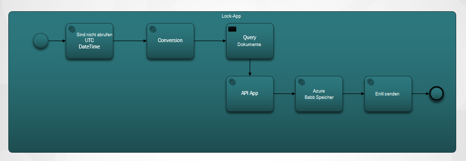

Die Schritte lauten:

1. Sie möchten die aktuelle UTC-DateTime aus einer API-App.  Der Standardwert beträgt eine Stunde vorherigen.

2. UTC-DateTime wird in einem Unix-Timestamp-Format konvertiert. Dies ist das Standardformat für Zeitstempel in DocumentDB.

3. Sie buchen den Wert einer App-API, die eine DocumentDB Abfrage. Der Wert wird in einer Abfrage verwendet.

    ```SQL
        SELECT * FROM Patients p WHERE (p._ts >= @unixTimeStamp)
    ```

    > [AZURE.NOTE] Die _ts stellt die TimeStamp-Metadaten für alle DocumentDB Ressourcen.

4. Wenn Dokumente vorhanden sind, wird Antworttext Azure BLOB-Speicher gesendet.

    > [AZURE.NOTE] BLOB-Speicher ist ein Azure Storage-Konto erforderlich. Sie müssen ein Konto Azure BLOB-Speicher bereitstellen und fügen ein neues Blob mit dem Namen Patienten. Weitere Informationen finden Sie unter [über Azure-Speicherkonten](../storage/storage-create-storage-account.md) und [mit Azure BLOB-Speicher](../storage/storage-dotnet-how-to-use-blobs.md).

5. Schließlich wird eine e-Mail gesendet, dass die Empfänger die Anzahl der gefundenen Dokumente benachrichtigt. Keine Dokumente gefunden wurden, wäre der e-Mail-Text "0 Dokumente gefunden". 

Jetzt haben Sie eine Vorstellung von der Funktionsweise des Workflows betrachten einer wie implementieren.

### <a name="lets-start-with-the-main-logic-app"></a>Beginnen wir mit den wichtigsten Logik App

Wenn Sie Logik Apps nicht vertraut, sie in [Azure Marketplace](https://portal.azure.com/)verfügbar sind und Weitere Informationen in [welche Logik Apps?](../app-service-logic/app-service-logic-what-are-logic-apps.md)

Beim Erstellen einer neuen Logik App müssen **Wie möchten Sie beginnen?**

Wenn Sie in das Textfeld klicken, wird Ihnen eine Auswahl von Ereignissen. Wählen Sie für diese Anwendung Logik **manuell – Wenn eine HTTP-Anforderung empfangen wird** , wie unten dargestellt.

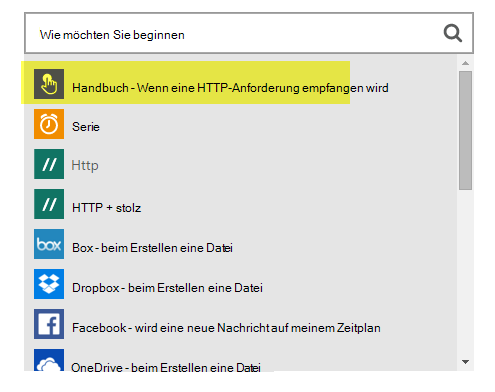

### <a name="design-view-of-your-completed-logic-app"></a>Entwurfsansicht der abgeschlossenen Logik-App
Wir wechseln vor und abgeschlossenen Entwurfsansicht für die Logik-App mit dem Namen DocDB sehen.


Beim Bearbeiten von Aktionen in der Logik App-Designer können Sie **Ausgaben** von der HTTP-Anforderung oder der vorherigen Aktion auswählen, siehe SendMail-Aktion aus.

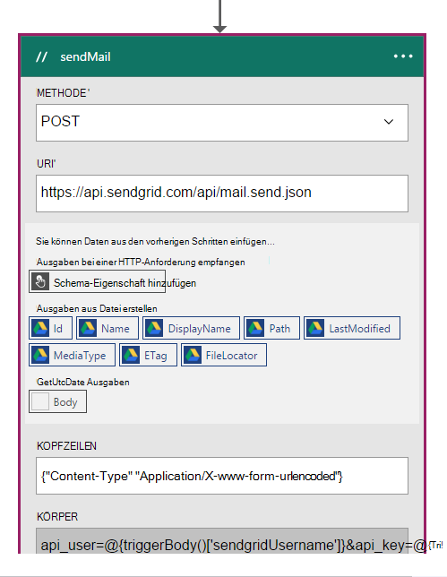

Vor jeder Aktion in Ihrem Workflow können Sie eine Entscheidung treffen; **Eine Aktion** oder **Bedingung hinzufügen** wie in der folgenden Abbildung dargestellt.

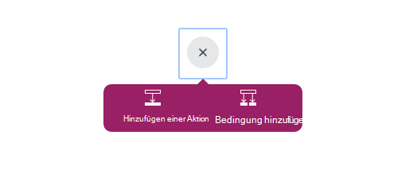

Wenn Sie **Bedingung hinzufügen**auswählen, werden ein Formular angezeigt wie in der folgenden Abbildung dargestellt die Logik eingeben.  Dies ist im Wesentlichen eine Geschäftsregel.  Wenn Sie in ein Feld klicken, müssen Sie zwischen dem Parameter der vorherigen Aktion. Sie können die Werte auch direkt eingeben.

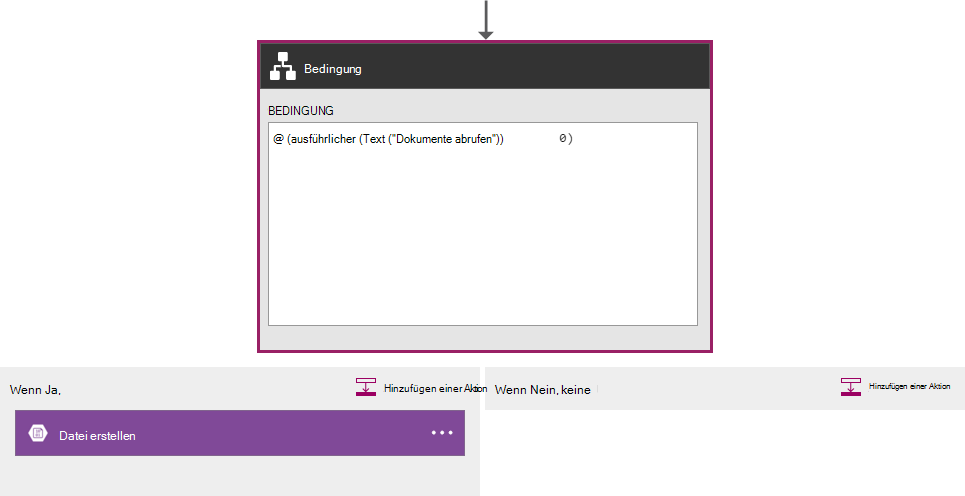

> [AZURE.NOTE] Sie haben auch die Möglichkeit, alle in der Codeansicht eingeben.

Betrachten einer abgeschlossenen Logik-App in der Codeansicht.  

```JSON
   
    "$schema": "https://schema.management.azure.com/providers/Microsoft.Logic/schemas/2015-08-01-preview/workflowdefinition.json#",
    "actions": {
        "Conversion": {
            "conditions": [
                {
                    "dependsOn": "GetUtcDate"
                }
            ],
            "inputs": {
                "method": "post",
                "queries": {
                    "currentdateTime": "@{body('GetUtcDate')}"
                },
                "uri": "https://docdbnotificationapi-debug.azurewebsites.net/api/Conversion"
            },
            "metadata": {
                "apiDefinitionUrl": "https://docdbnotificationapi-debug.azurewebsites.net/swagger/docs/v1",
                "swaggerSource": "custom"
            },
            "type": "Http"
        },
        "Createfile": {
            "conditions": [
                {
                    "expression": "@greater(length(body('GetDocuments')), 0)"
                },
                {
                    "dependsOn": "GetDocuments"
                }
            ],
            "inputs": {
                "body": "@body('GetDocuments')",
                "host": {
                    "api": {
                        "runtimeUrl": "https://logic-apis-westus.azure-apim.net/apim/azureblob"
                    },
                    "connection": {
                        "name": "@parameters('$connections')['azureblob']['connectionId']"
                    }
                },
                "method": "post",
                "path": "/datasets/default/files",
                "queries": {
                    "folderPath": "/patients",
                    "name": "Patient_@{guid()}.json"
                }
            },
            "type": "ApiConnection"
        },
        "GetDocuments": {
            "conditions": [
                {
                    "dependsOn": "Conversion"
                }
            ],
            "inputs": {
                "method": "post",
                "queries": {
                    "unixTimeStamp": "@body('Conversion')"
                },
                "uri": "https://docdbnotificationapi-debug.azurewebsites.net/api/Patient"
            },
            "metadata": {
                "apiDefinitionUrl": "https://docdbnotificationapi-debug.azurewebsites.net/swagger/docs/v1",
                "swaggerSource": "custom"
            },
            "type": "Http"
        },
        "GetUtcDate": {
            "conditions": [],
            "inputs": {
                "method": "get",
                "queries": {
                    "hoursBack": "@{int(triggerBody()['GetUtcDate_HoursBack'])}"
                },
                "uri": "https://docdbnotificationapi-debug.azurewebsites.net/api/Authorization"
            },
            "metadata": {
                "apiDefinitionUrl": "https://docdbnotificationapi-debug.azurewebsites.net/swagger/docs/v1",
                "swaggerSource": "custom"
            },
            "type": "Http"
        },
        "sendMail": {
            "conditions": [
                {
                    "dependsOn": "GetDocuments"
                }
            ],
            "inputs": {
                "body": "api_user=@{triggerBody()['sendgridUsername']}&api_key=@{triggerBody()['sendgridPassword']}&from=@{parameters('fromAddress')}&to=@{triggerBody()['EmailTo']}&subject=@{triggerBody()['Subject']}&text=@{int(length(body('GetDocuments')))} Documents Found",
                "headers": {
                    "Content-type": "application/x-www-form-urlencoded"
                },
                "method": "POST",
                "uri": "https://api.sendgrid.com/api/mail.send.json"
            },
            "type": "Http"
        }
    },
    "contentVersion": "1.0.0.0",
    "outputs": {
        "Results": {
            "type": "String",
            "value": "@{int(length(body('GetDocuments')))} Records Found"
        }
    },
    "parameters": {
        "$connections": {
            "defaultValue": {},
            "type": "Object"
        },
        "fromAddress": {
            "defaultValue": "user@msn.com",
            "type": "String"
        },
        "toAddress": {
            "defaultValue": "XXXXX@XXXXXXX.net",
            "type": "String"
        }
    },
    "triggers": {
        "manual": {
            "inputs": {
                "schema": {
                    "properties": {},
                    "required": [],
                    "type": "object"
                }
            },
            "type": "Manual"
        }
    
```

Wenn Sie nicht vertraut mit was die anderen Abschnitte im Code darstellt, können Sie [Logik App Workflow Definition Language](http://aka.ms/logicappsdocs) -Dokumentation anzeigen.

Verwenden Sie einen [Http-Webhook Trigger](https://sendgrid.com/blog/whats-webhook/)für diesen Workflow. Wenn Sie den obigen Code betrachten, sehen Sie Parameter wie im folgenden Beispiel.

```C#

    =@{triggerBody()['Subject']}

```

Die `triggerBody()` stellt die Parameter, die im Hauptteil einer REST nach der Logik App REST-API enthalten sind. Die `()['Subject']` das Feld dar. Alle diese Parameter von JSON formatierte Text. 

> [AZURE.NOTE] Web-Hook verwenden, haben Sie vollen Zugriff auf den Header und der Trigger-Anforderung. In dieser Anwendung soll den Körper.

Wie bereits erwähnt, können Sie den Designer Parameter zuweisen oder es in der Codeansicht.
Fall in der Codeansicht definieren Sie Eigenschaften einen Wert erforderlich, wie im folgenden Beispiel gezeigt. 

```JSON

    "triggers": {
        "manual": {
            "inputs": {
            "schema": {
                "properties": {
            "Subject": {
                "type" : "String"   

            }
            },
                "required": [
            "Subject"
                 ],
                "type": "object"
            }
            },
            "type": "Manual"
        }
        }
```

Was Sie tun ist JSON Schema erstellen, die in übergeben werden aus dem Textkörper der HTTP POST.
Um die Trigger auslösen, benötigen Sie eine Callback-URL.  Sie lernen generieren später im Lernprogramm.  

## <a name="actions"></a>Aktionen
Sehen Sie, was jede Aktion in der Anwendung Logik enthält.

### <a name="getutcdate"></a>GetUTCDate

**Designer anzeigen**

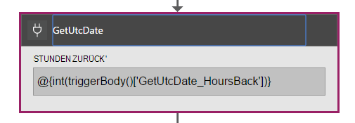

**Code anzeigen**

```JSON

    "GetUtcDate": {
            "conditions": [],
            "inputs": {
            "method": "get",
            "queries": {
                "hoursBack": "@{int(triggerBody()['GetUtcDate_HoursBack'])}"
            },
            "uri": "https://docdbnotificationapi-debug.azurewebsites.net/api/Authorization"
            },
            "metadata": {
            "apiDefinitionUrl": "https://docdbnotificationapi-debug.azurewebsites.net/swagger/docs/v1"
            },
            "type": "Http"
        },

```

Diese HTTP-Aktion führt einen GET-Vorgang.  API-APP GetUtcDate-Methode aufgerufen. Der Uri wird in Triggertext übergebene 'GetUtcDate_HoursBack'-Eigenschaft verwendet.  Die 'GetUtcDate_HoursBack' in der ersten Logik App festgelegt ist. Sie können Trigger Logik App später im Lernprogramm erfahren.

Diese Aktion ruft Ihre App-API den UTC-Datum Wert zurückzugeben.

#### <a name="operations"></a>Vorgänge

**Anforderung**

```JSON

    {
        "uri": "https://docdbnotificationapi-debug.azurewebsites.net/api/Authorization",
        "method": "get",
        "queries": {
          "hoursBack": "24"
        }
    }

```

**Antwort**

```JSON

    {
        "statusCode": 200,
        "headers": {
          "pragma": "no-cache",
          "cache-Control": "no-cache",
          "date": "Fri, 26 Feb 2016 15:47:33 GMT",
          "server": "Microsoft-IIS/8.0",
          "x-AspNet-Version": "4.0.30319",
          "x-Powered-By": "ASP.NET"
        },
        "body": "Fri, 15 Jan 2016 23:47:33 GMT"
    }

```

Im nächste Schritt wird ein .NET double Typ TimeStamp Unix UTC-DateTime-Wert konvertieren.

### <a name="conversion"></a>Konvertierung

##### <a name="designer-view"></a>Designer anzeigen

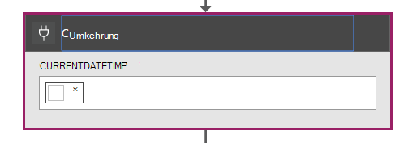

##### <a name="code-view"></a>Code anzeigen

```JSON

    "Conversion": {
        "conditions": [
        {
            "dependsOn": "GetUtcDate"
        }
        ],
        "inputs": {
        "method": "post",
        "queries": {
            "currentDateTime": "@{body('GetUtcDate')}"
        },
        "uri": "https://docdbnotificationapi-debug.azurewebsites.net/api/Conversion"
        },
        "metadata": {
        "apiDefinitionUrl": "https://docdbnotificationapi-debug.azurewebsites.net/swagger/docs/v1"
        },
        "type": "Http"
    },

```

In diesem Schritt übergeben Sie den Rückgabewert von der GetUTCDate.  Gibt die Bedingung DependsOn bedeutet, dass die GetUTCDate-Aktion erfolgreich abgeschlossen werden muss. Wenn dies nicht der Fall ist, dann wird diese Aktion übersprungen. 

Diese Aktion ruft Ihre App-API um die Konvertierung zu behandeln.

#### <a name="operations"></a>Vorgänge

##### <a name="request"></a>Anforderung

```JSON

    {
        "uri": "https://docdbnotificationapi-debug.azurewebsites.net/api/Conversion",
        "method": "post",
        "queries": {
        "currentDateTime": "Fri, 15 Jan 2016 23:47:33 GMT"
        }
    }   
```

##### <a name="response"></a>Antwort

```JSON

    {
        "statusCode": 200,
        "headers": {
          "pragma": "no-cache",
          "cache-Control": "no-cache",
          "date": "Fri, 26 Feb 2016 15:47:33 GMT",
          "server": "Microsoft-IIS/8.0",
          "x-AspNet-Version": "4.0.30319",
          "x-Powered-By": "ASP.NET"
        },
        "body": 1452901653
    }
```

In die nächste Aktion führen Sie einen POST-Vorgang unsere API-App.

### <a name="getdocuments"></a>GetDocuments 

##### <a name="designer-view"></a>Designer anzeigen


##### <a name="code-view"></a>Code anzeigen

```JSON

    "GetDocuments": {
        "conditions": [
        {
            "dependsOn": "Conversion"
        }
        ],
        "inputs": {
        "method": "post",
        "queries": {
            "unixTimeStamp": "@{body('Conversion')}"
        },
        "uri": "https://docdbnotificationapi-debug.azurewebsites.net/api/Patient"
        },
        "metadata": {
        "apiDefinitionUrl": "https://docdbnotificationapi-debug.azurewebsites.net/swagger/docs/v1"
        },
        "type": "Http"
    },

```

GetDocuments-Aktion werden im Antworttext Konvertierung Aktion übergeben werden. Dies ist ein Parameter im Uri:

 
```C#

    unixTimeStamp=@{body('Conversion')}

```

Die QueryDocuments-Aktion ist eine HTTP POST-Operation API-App. 

Die aufgerufene Methode ist **QueryForNewPatientDocuments**.

#### <a name="operations"></a>Vorgänge

##### <a name="request"></a>Anforderung

```JSON

    {
        "uri": "https://docdbnotificationapi-debug.azurewebsites.net/api/Patient",
        "method": "post",
        "queries": {
        "unixTimeStamp": "1452901653"
        }
    }
```

##### <a name="response"></a>Antwort

```JSON

    {
        "statusCode": 200,
        "headers": {
        "pragma": "no-cache",
        "cache-Control": "no-cache",
        "date": "Fri, 26 Feb 2016 15:47:35 GMT",
        "server": "Microsoft-IIS/8.0",
        "x-AspNet-Version": "4.0.30319",
        "x-Powered-By": "ASP.NET"
        },
        "body": [
        {
            "id": "xcda",
            "_rid": "vCYLAP2k6gAXAAAAAAAAAA==",
            "_self": "dbs/vCYLAA==/colls/vCYLAP2k6gA=/docs/vCYLAP2k6gAXAAAAAAAAAA==/",
            "_ts": 1454874620,
            "_etag": "\"00007d01-0000-0000-0000-56b79ffc0000\"",
            "resourceType": "Patient",
            "text": {
            "status": "generated",
            "div": "<div>\n      \n      <p>Henry Levin the 7th</p>\n    \n    </div>"
            },
            "identifier": [
            {
                "use": "usual",
                "type": {
                "coding": [
                    {
                    "system": "http://hl7.org/fhir/v2/0203",
                    "code": "MR"
                    }
                ]
                },
                "system": "urn:oid:2.16.840.1.113883.19.5",
                "value": "12345"
            }
            ],
            "active": true,
            "name": [
            {
                    "family": [
                        "Levin"
                    ],
                    "given": [
                        "Henry"
                    ]
                }
            ],
            "gender": "male",
            "birthDate": "1932-09-24",
            "managingOrganization": {
                "reference": "Organization/2.16.840.1.113883.19.5",
                "display": "Good Health Clinic"
            }
        },

```

Die nächste Aktion wird zum [Azure-Blog](https://azure.microsoft.com/services/storage/)Speicher speichern. 

> [AZURE.NOTE] BLOB-Speicher ist ein Azure Storage-Konto erforderlich. Sie müssen ein Konto Azure BLOB-Speicher bereitstellen und fügen ein neues Blob mit dem Namen Patienten. Weitere Informationen finden Sie unter [Erste Schritte mit Azure BLOB-Speicher](../storage/storage-dotnet-how-to-use-blobs.md).

### <a name="create-file"></a>Datei erstellen

##### <a name="designer-view"></a>Designer anzeigen

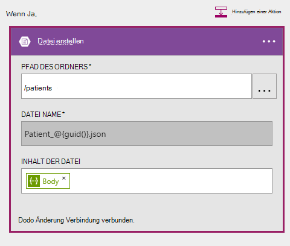

##### <a name="code-view"></a>Code anzeigen

```JSON

    {
    "host": {
        "api": {
            "runtimeUrl": "https://logic-apis-westus.azure-apim.net/apim/azureblob"
        },
        "connection": {
            "name": "subscriptions/fxxxxxc079-4e5d-b002-xxxxxxxxxx/resourceGroups/Api-Default-Central-US/providers/Microsoft.Web/connections/azureblob"
        }
    },
    "method": "post",
    "path": "/datasets/default/files",
    "queries": {
        "folderPath": "/patients",
        "name": "Patient_17513174-e61d-4b56-88cb-5cf383db4430.json"
    },
    "body": [
        {
            "id": "xcda",
            "_rid": "vCYLAP2k6gAXAAAAAAAAAA==",
            "_self": "dbs/vCYLAA==/colls/vCYLAP2k6gA=/docs/vCYLAP2k6gAXAAAAAAAAAA==/",
            "_ts": 1454874620,
            "_etag": "\"00007d01-0000-0000-0000-56b79ffc0000\"",
            "resourceType": "Patient",
            "text": {
                "status": "generated",
                "div": "<div>\n      \n      <p>Henry Levin the 7th</p>\n    \n    </div>"
            },
            "identifier": [
                {
                    "use": "usual",
                    "type": {
                        "coding": [
                            {
                                "system": "http://hl7.org/fhir/v2/0203",
                                "code": "MR"
                            }
                        ]
                    },
                    "system": "urn:oid:2.16.840.1.113883.19.5",
                    "value": "12345"
                }
            ],
            "active": true,
            "name": [
                {
                    "family": [
                        "Levin"
                    ],
                    "given": [
                        "Henry"
                    ]
                }
            ],
            "gender": "male",
            "birthDate": "1932-09-24",
            "managingOrganization": {
                "reference": "Organization/2.16.840.1.113883.19.5",
                "display": "Good Health Clinic"
            }
        },

```

Der Code wird von Aktion im Designer generiert. Sie müssen den Code ändern.

Wenn Sie nicht mit Azure BLOB-API vertraut sind, finden Sie unter [Erste Schritte mit Azure BLOB-Speicher-API](../connectors/connectors-create-api-azureblobstorage.md).

#### <a name="operations"></a>Vorgänge

##### <a name="request"></a>Anforderung

```JSON

    "host": {
        "api": {
            "runtimeUrl": "https://logic-apis-westus.azure-apim.net/apim/azureblob"
        },
        "connection": {
            "name": "subscriptions/fxxxxxc079-4e5d-b002-xxxxxxxxxx/resourceGroups/Api-Default-Central-US/providers/Microsoft.Web/connections/azureblob"
        }
    },
    "method": "post",
    "path": "/datasets/default/files",
    "queries": {
        "folderPath": "/patients",
        "name": "Patient_17513174-e61d-4b56-88cb-5cf383db4430.json"
    },
    "body": [
        {
            "id": "xcda",
            "_rid": "vCYLAP2k6gAXAAAAAAAAAA==",
            "_self": "dbs/vCYLAA==/colls/vCYLAP2k6gA=/docs/vCYLAP2k6gAXAAAAAAAAAA==/",
            "_ts": 1454874620,
            "_etag": "\"00007d01-0000-0000-0000-56b79ffc0000\"",
            "resourceType": "Patient",
            "text": {
                "status": "generated",
                "div": "<div>\n      \n      <p>Henry Levin the 7th</p>\n    \n    </div>"
            },
            "identifier": [
                {
                    "use": "usual",
                    "type": {
                        "coding": [
                            {
                                "system": "http://hl7.org/fhir/v2/0203",
                                "code": "MR"
                            }
                        ]
                    },
                    "system": "urn:oid:2.16.840.1.113883.19.5",
                    "value": "12345"
                }
            ],
            "active": true,
            "name": [
                {
                    "family": [
                        "Levin"
                    ],
                    "given": [
                        "Henry"
                    ]
                }
            ],
            "gender": "male",
            "birthDate": "1932-09-24",
            "managingOrganization": {
                "reference": "Organization/2.16.840.1.113883.19.5",
                "display": "Good Health Clinic"
            }
        },….


```

##### <a name="response"></a>Antwort

```JSON

    {
        "statusCode": 200,
        "headers": {
        "pragma": "no-cache",
        "x-ms-request-id": "2b2f7c57-2623-4d71-8e53-45c26b30ea9d",
        "cache-Control": "no-cache",
        "date": "Fri, 26 Feb 2016 15:47:36 GMT",
        "set-Cookie": "ARRAffinity=29e552cea7db23196f7ffa644003eaaf39bc8eb6dd555511f669d13ab7424faf;Path=/;Domain=127.0.0.1",
        "server": "Microsoft-HTTPAPI/2.0",
        "x-AspNet-Version": "4.0.30319",
        "x-Powered-By": "ASP.NET"
        },
        "body": {
        "Id": "0B0nBzHyMV-_NRGRDcDNMSFAxWFE",
        "Name": "Patient_47a2a0dc-640d-4f01-be38-c74690d085cb.json",
        "DisplayName": "Patient_47a2a0dc-640d-4f01-be38-c74690d085cb.json",
        "Path": "/Patient/Patient_47a2a0dc-640d-4f01-be38-c74690d085cb.json",
        "LastModified": "2016-02-26T15:47:36.215Z",
        "Size": 65647,
        "MediaType": "application/octet-stream",
        "IsFolder": false,
        "ETag": "\"c-g_a-1OtaH-kNQ4WBoXLp3Zv9s/MTQ1NjUwMTY1NjIxNQ\"",
        "FileLocator": "0B0nBzHyMV-_NRGRDcDNMSFAxWFE"
        }
    }
```

Der letzte Schritt ist eine e-Mail-Benachrichtigung senden

### <a name="sendemail"></a>sendEmail

##### <a name="designer-view"></a>Designer anzeigen

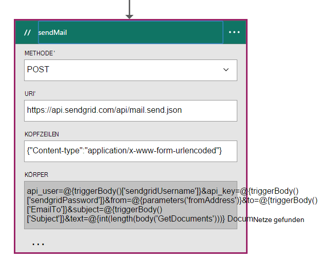

##### <a name="code-view"></a>Code anzeigen

```JSON


    "sendMail": {
        "conditions": [
        {
            "dependsOn": "GetDocuments"
        }
        ],
        "inputs": {
        "body": "api_user=@{triggerBody()['sendgridUsername']}&api_key=@{triggerBody()['sendgridPassword']}&from=@{parameters('fromAddress')}&to=@{triggerBody()['EmailTo']}&subject=@{triggerBody()['Subject']}&text=@{int(length(body('GetDocuments')))} Documents Found",
        "headers": {
            "Content-type": "application/x-www-form-urlencoded"
        },
        "method": "POST",
        "uri": "https://api.sendgrid.com/api/mail.send.json"
        },
        "type": "Http"
    }
```

Diese Aktion wird eine e-Mail-Benachrichtigung senden.  Verwenden Sie [SendGrid](https://sendgrid.com/marketing/sendgrid-services?cvosrc=PPC.Bing.sendgrib&cvo_cid=SendGrid%20-%20US%20-%20Brand%20-%20&mc=Paid%20Search&mcd=BingAds&keyword=sendgrib&network=o&matchtype=e&mobile=&content=&search=1&utm_source=bing&utm_medium=cpc&utm_term=%5Bsendgrib%5D&utm_content=%21acq%21v2%2134335083397-8303227637-1649139544&utm_campaign=SendGrid+-+US+-+Brand+-+%28English%29).   

Der Code wurde mit einer Vorlage Logik App und SendGrid im [101-Logik-app-Sendgrid Github Repository](https://github.com/Azure/azure-quickstart-templates/tree/master/101-logic-app-sendgrid)erstellt.
 
Die HTTP-Operation wurde nach. 

Die Autorisierung sind der Triggereigenschaften

```JSON

    },
        "sendgridPassword": {
             "type": "SecureString"
         },
         "sendgridUsername": {
            "type": "String"
         }

        In addition, other parameters are static values set in the Parameters section of the Logic App. These are:
        },
        "toAddress": {
            "defaultValue": "XXXX@XXXX.com",
            "type": "String"
        },
        "fromAddress": {
            "defaultValue": "XXX@msn.com",
            "type": "String"
        },
        "emailBody": {
            "defaultValue": "@{string(concat(int(length(actions('QueryDocuments').outputs.body)) Records Found),'/n', actions('QueryDocuments').outputs.body)}",
            "type": "String"
        },

```

Die EmailBody verkettet die Anzahl der Dokumente, die von der Abfrage "0" oder mit mehr möglich "Datensätze gefunden" zurückgegeben. Die übrigen Parameter sind Trigger Parameter festgelegt.

Diese Aktion hängt die **GetDocuments** -Aktion.

#### <a name="operations"></a>Vorgänge

##### <a name="request"></a>Anforderung
```JSON

    {
        "uri": "https://api.sendgrid.com/api/mail.send.json",
        "method": "POST",
        "headers": {
        "Content-type": "application/x-www-form-urlencoded"
        },
        "body": "api_user=azureuser@azure.com&api_key=Biz@Talk&from=user@msn.com&to=XXXX@XXXX.com&subject=New Patients&text=37 Documents Found"
    }

```

##### <a name="response"></a>Antwort

```JSON

    {
        "statusCode": 200,
        "headers": {
        "connection": "keep-alive",
        "x-Frame-Options": "DENY,DENY",
        "access-Control-Allow-Origin": "https://sendgrid.com",
        "date": "Fri, 26 Feb 2016 15:47:35 GMT",
        "server": "nginx"
        },
        "body": {
        "message": "success"
        }
    }
```

Schließlich soll Ihre Anwendung Logik Azure-Portal erhalten können. Dazu fügen Sie einen Parameter im Abschnitt Ausgaben.


```JSON

    "outputs": {
        "Results": {
            "type": "String",
            "value": "@{int(length(actions('QueryDocuments').outputs.body))} Records Found"
        }

```

Dies gibt den gleichen Wert, der im e-Mail-Nachrichtentext gesendet. Die folgende Abbildung zeigt ein Beispiel für "Fand 29 Datensätze".

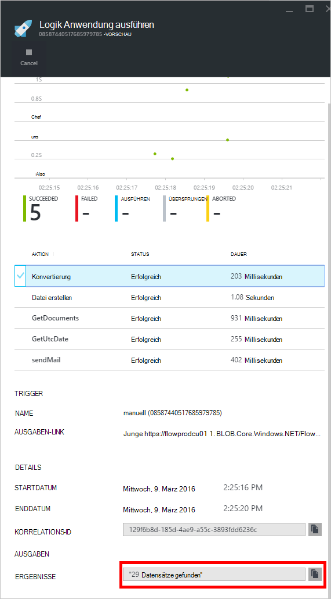

## <a name="metrics"></a>Metriken
Die wichtigsten Logik App im Portal überwachen können. Dadurch können Sie die Wartezeit ausführen und andere Ereignisse wie in der folgenden Abbildung gezeigt.

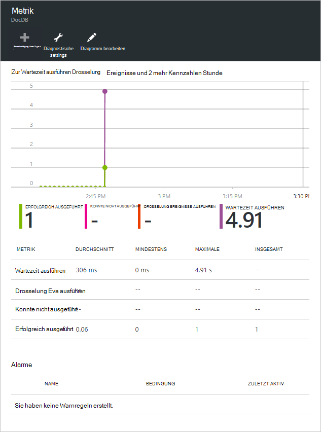

## <a name="docdb-trigger"></a>DocDb Trigger

Diese Logik ist der Auslöser, die Ihrer wichtigsten Anwendung Logik des Workflows ab.

Die folgende Abbildung zeigt die Entwurfsansicht.

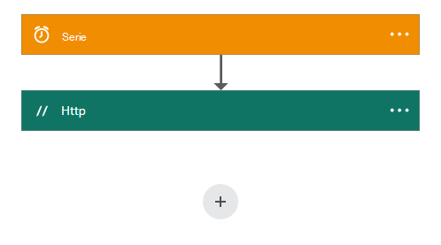

```JSON

    {
        "$schema": "https://schema.management.azure.com/providers/Microsoft.Logic/schemas/2015-08-01-preview/workflowdefinition.json#",
        "actions": {
        "Http": {
            "conditions": [],
            "inputs": {
            "body": {
                "EmailTo": "XXXXXX@XXXXX.net",
                "GetUtcDate_HoursBack": "24",
                "Subject": "New Patients",
                "sendgridPassword": "********",
                "sendgridUsername": "azureuser@azure.com"
            },
            "method": "POST",
            "uri": "https://prod-01.westus.logic.azure.com:443/workflows/12a1de57e48845bc9ce7a247dfabc887/triggers/manual/run?api-version=2015-08-01-preview&sp=%2Ftriggers%2Fmanual%2Frun&sv=1.0&sig=ObTlihr529ATIuvuG-dhxOgBL4JZjItrvPQ8PV6973c"
            },
            "type": "Http"
        }
        },
        "contentVersion": "1.0.0.0",
        "outputs": {
        "Results": {
            "type": "String",
            "value": "@{body('Http')['status']}"
        }
        },
        "parameters": {},
        "triggers": {
        "recurrence": {
            "recurrence": {
            "frequency": "Hour",
            "interval": 24
            },
            "type": "Recurrence"
        }
        }
    }

```

Der Trigger wird für eine Serie von 24 Stunden festgelegt. Die Aktion ist ein HTTP-POST, die den Rückruf-URL für die wichtigsten Logik verwendet. Der Nachrichtentext enthält die Parameter, die in JSON-Schema angegeben werden. 

#### <a name="operations"></a>Vorgänge

##### <a name="request"></a>Anforderung

```JSON

    {
        "uri": "https://prod-01.westus.logic.azure.com:443/workflows/12a1de57e48845bc9ce7a247dfabc887/triggers/manual/run?api-version=2015-08-01-preview&sp=%2Ftriggers%2Fmanual%2Frun&sv=1.0&sig=ObTlihr529ATIuvuG-dhxOgBL4JZjItrvPQ8PV6973c",
        "method": "POST",
        "body": {
        "EmailTo": "XXXXXX@XXXXX.net",
        "GetUtcDate_HoursBack": "24",
        "Subject": "New Patients",
        "sendgridPassword": "********",
        "sendgridUsername": "azureuser@azure.com"
        }
    }

```

##### <a name="response"></a>Antwort

```JSON

    {
        "statusCode": 202,
        "headers": {
        "pragma": "no-cache",
        "x-ms-ratelimit-remaining-workflow-writes": "7486",
        "x-ms-ratelimit-burst-remaining-workflow-writes": "1248",
        "x-ms-request-id": "westus:2d440a39-8ba5-4a9c-92a6-f959b8d2357f",
        "cache-Control": "no-cache",
        "date": "Thu, 25 Feb 2016 21:01:06 GMT"
        }
    }
```

Jetzt sehen wir uns die API App.

## <a name="docdbnotificationapi"></a>DocDBNotificationApi

Mehrere Vorgänge in der Anwendung gibt, werden Sie nur drei.

* GetUtcDate
* ConvertToTimeStamp
* QueryForNewPatientDocuments

### <a name="docdbnotificationapi-operations"></a>DocDBNotificationApi Vorgänge
Sehen wir uns stolz Dokumentation

> [AZURE.NOTE] Um die Vorgänge extern aufrufen können, müssen Sie eine zulässige Ursprung der CORS hinzufügen "*" (ohne Anführungszeichen) in den Einstellungen der App-API wie in der folgenden Abbildung dargestellt.

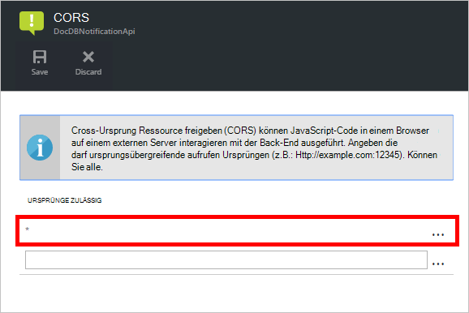

#### <a name="getutcdate"></a>GetUtcDate

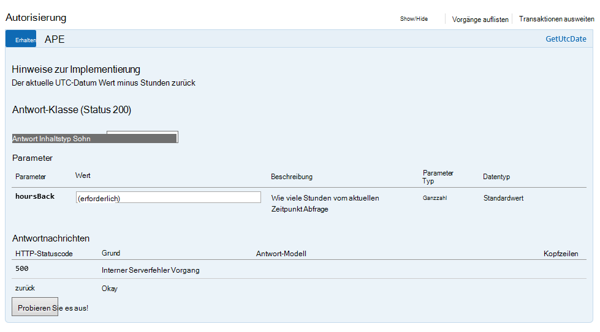

#### <a name="converttotimestamp"></a>ConvertToTimeStamp

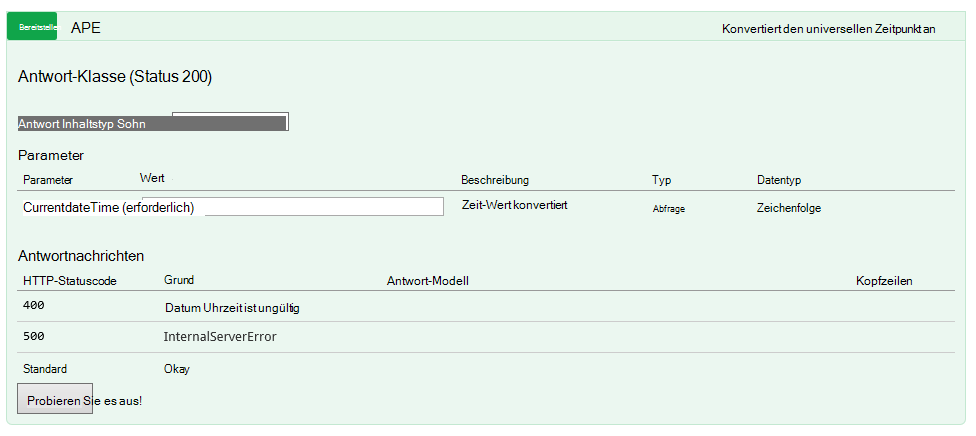

#### <a name="queryfornewpatientdocuments"></a>QueryForNewPatientDocuments

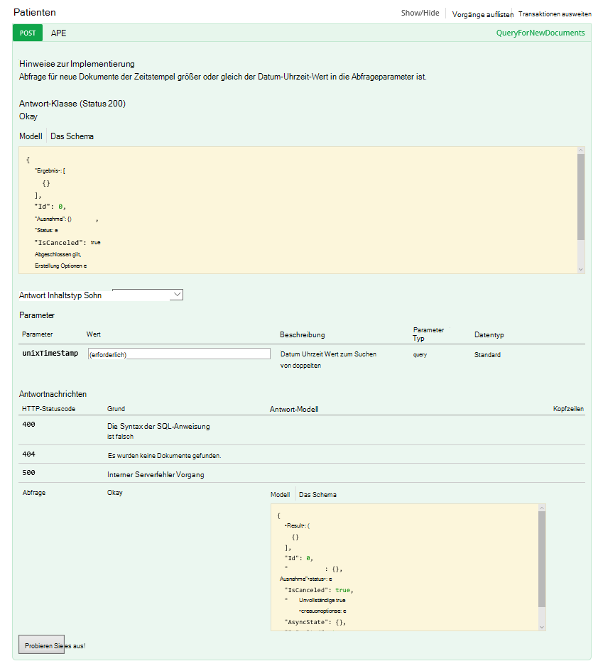

Schauen Sie sich den Code hinter diesen Vorgang.

#### <a name="getutcdate"></a>GetUtcDate

```C#

    /// <summary>
    /// Gets the current UTC Date value
    /// </summary>
    /// <returns></returns>
    [H ttpGet]
    [Metadata("GetUtcDate", "Gets the current UTC Date value minus the Hours Back")]
    [SwaggerOperation("GetUtcDate")]
    [SwaggerResponse(HttpStatusCode.OK, type: typeof (string))]
    [SwaggerResponse(HttpStatusCode.InternalServerError, "Internal Server Operation Error")]
    public string GetUtcDate(
       [Metadata("Hours Back", "How many hours back from the current Date Time")] int hoursBack)
    {


        return DateTime.UtcNow.AddHours(-hoursBack).ToString("r");
    }
```

Dieser Vorgang gibt einfach die gibt die aktuelle UTC-DateTime abzüglich der HoursBack.

#### <a name="converttotimestamp"></a>ConvertToTimeStamp

``` C#

        /// <summary>
        ///     Converts DateTime to double
        /// </summary>
        /// <param name="currentdateTime"></param>
        /// <returns></returns>
        [Metadata("Converts Universal DateTime to number")]
        [SwaggerResponse(HttpStatusCode.OK, null, typeof (double))]
        [SwaggerResponse(HttpStatusCode.BadRequest, "DateTime is invalid")]
        [SwaggerResponse(HttpStatusCode.InternalServerError)]
        [SwaggerOperation(nameof(ConvertToTimestamp))]
        public double ConvertToTimestamp(
            [Metadata("currentdateTime", "DateTime value to convert")] string currentdateTime)
        {
            double result;

            try
            {
                var uncoded = HttpContext.Current.Server.UrlDecode(currentdateTime);

                var newDateTime = DateTime.Parse(uncoded);
                //create Timespan by subtracting the value provided from the Unix Epoch
                var span = newDateTime - new DateTime(1970, 1, 1, 0, 0, 0, 0).ToLocalTime();

                //return the total seconds (which is a UNIX timestamp)
                result = span.TotalSeconds;
            }
            catch (Exception e)
            {
                throw new Exception("unable to convert to Timestamp", e.InnerException);
            }

            return result;
        }

```

Dieser Vorgang konvertiert die Antwort aus dem GetUtcDate in einen double-Wert.

#### <a name="queryfornewpatientdocuments"></a>QueryForNewPatientDocuments

```C#

        /// <summary>
        ///     Query for new Patient Documents
        /// </summary>
        /// <param name="unixTimeStamp"></param>
        /// <returns>IList</returns>
        [Metadata("QueryForNewDocuments",
            "Query for new Documents where the Timestamp is greater than or equal to the DateTime value in the query parameters."
            )]
        [SwaggerOperation("QueryForNewDocuments")]
        [SwaggerResponse(HttpStatusCode.OK, type: typeof (Task<IList<Document>>))]
        [SwaggerResponse(HttpStatusCode.BadRequest, "The syntax of the SQL Statement is incorrect")]
        [SwaggerResponse(HttpStatusCode.NotFound, "No Documents were found")]
        [SwaggerResponse(HttpStatusCode.InternalServerError, "Internal Server Operation Error")]
        // ReSharper disable once ConsiderUsingAsyncSuffix
        public IList<Document> QueryForNewPatientDocuments(
            [Metadata("UnixTimeStamp", "The DateTime value used to search from")] double unixTimeStamp)
        {
            var context = new DocumentDbContext();
            var filterQuery = string.Format(InvariantCulture, "SELECT * FROM Patient p WHERE p._ts >=  {0}",
                unixTimeStamp);
            var options = new FeedOptions {MaxItemCount = -1};


            var collectionLink = UriFactory.CreateDocumentCollectionUri(DocumentDbContext.DatabaseId,
                DocumentDbContext.CollectionId);

            var response =
                context.Client.CreateDocumentQuery<Document>(collectionLink, filterQuery, options).AsEnumerable();

            return response.ToList();
    }

```

Dieser Vorgang verwendet [DocumentDB.NET SDK](documentdb-sdk-dotnet.md) , um eine Abfrage zu erstellen. 

```C#
     CreateDocumentQuery<Document>(collectionLink, filterQuery, options).AsEnumerable();
```

Die Antwort aus dem ConvertToTimeStamp (UnixTimeStamp) übergeben wird. Die Operation gibt eine Liste von Dokumenten, `IList<Document>`.

Zuvor haben wir über die CallbackURL. Um Workflows im Hauptfenster Logik-App starten, müssen Sie mit den CallbackURL aufrufen.

## <a name="callbackurl"></a>CallbackURL

Zunächst benötigen Sie Ihre Azure AD-Token.  Schwer zu token erhalten kann. Ich suchte nach einer einfachen Methode und Jeff Hollan, ein Programmmanager Azure Logik App ist, empfohlen [Armclient](http://blog.davidebbo.com/2015/01/azure-resource-manager-client.html) in PowerShell verwenden.  Sie können die Anweisungen nach.

Zu verwenden sind Benutzername und ARM-API aufrufen.
 
Anmeldung: Sie verwenden die gleichen Anmeldeinformationen für Azure-Portal anmelden. 

Operation ARM-Api aufgerufen wird, die die CallBackURL generiert.

In PowerShell rufen Sie es wie folgt:  

```powershell

    ArmClient.exe post https://management.azure.com/subscriptions/[YOUR SUBSCRIPTION ID/resourcegroups/[YOUR RESOURCE GROUP]/providers/Microsoft.Logic/workflows/[YOUR LOGIC APP NAME/triggers/manual/listcallbackurl?api-version=2015-08-01-preview

```

Das Ergebnis sollte wie folgt aussehen:

```powershell

    https://prod-02.westus.logic.azure.com:443/workflows/12a1de57e48845bc9ce7a247dfabc887/triggers/manual/run?api-version=2015-08-01-prevaiew&sp=%2Ftriggers%2Fmanual%2Frun&sv=1.0&sig=XXXXXXXXXXXXXXXXXXX

```

Ein Tool wie [Postman](http://www.getpostman.com/) können Sie um main Logik App zu testen, wie in der folgenden Abbildung dargestellt.

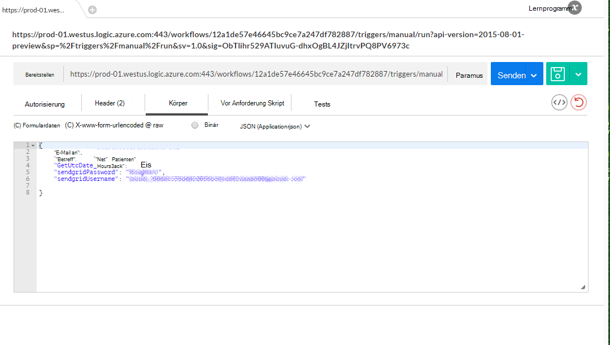

Die folgende Tabelle listet die Auslöseparameter Körper DocDB Trigger Logik Anwendung bilden.

Parameter | Beschreibung 
--- | --- 
GetUtcDate_HoursBack | Die Anzahl der Stunden für das Startdatum Suche festgelegt
sendgridUsername | Die Anzahl der Stunden für das Startdatum Suche festgelegt
sendgridPassword | Der Benutzername für Raster senden e-Mail
EmailTo | Die e-Mail-Adresse, die e-Mail-Benachrichtigung erhalten
Betreff | Die Betreffzeile der e-Mail

## <a name="viewing-the-patient-data-in-the-azure-blob-service"></a>Anzeigen von Patientendaten in Azure BLOB-Dienst

Azure Storage-Konto wechseln Sie, und wählen Sie Blobs unter Dienste in der folgenden Abbildung dargestellt.

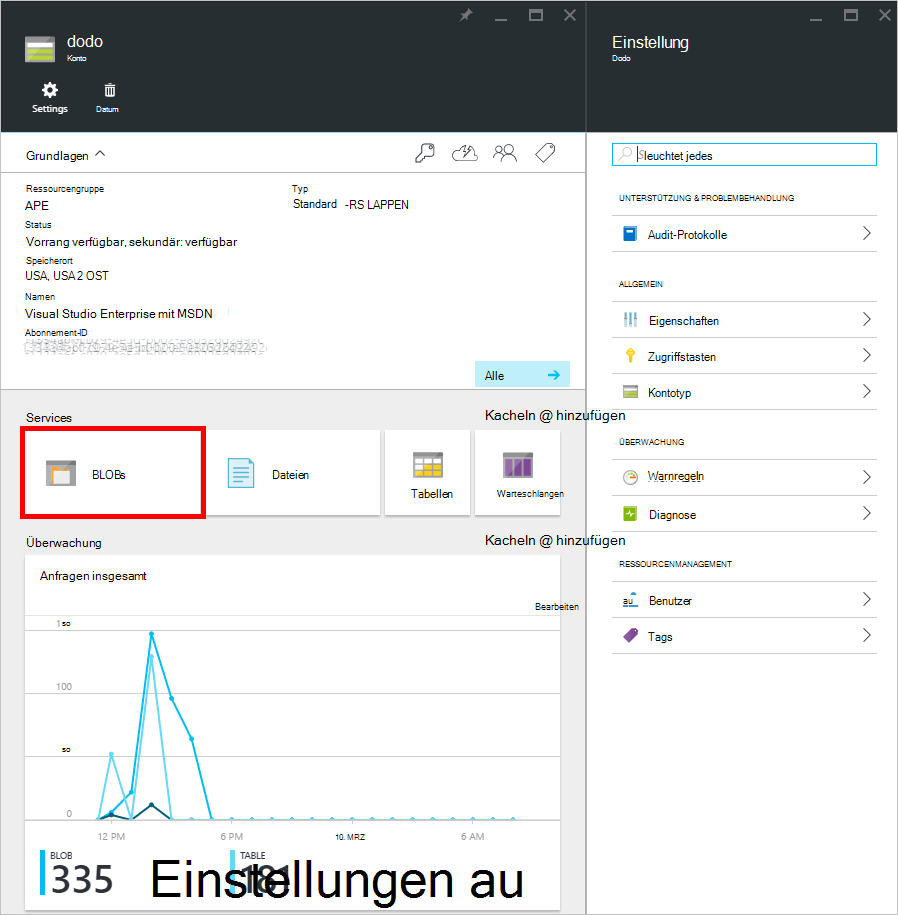 

Sie werden die Patienten Blob-Dateiinformationen wie unten dargestellt angezeigt.

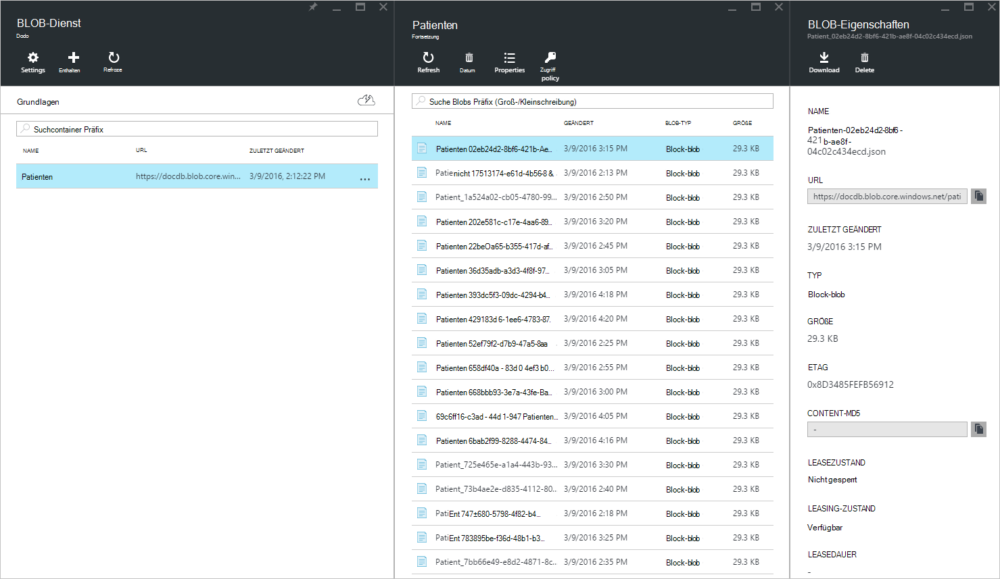


## <a name="summary"></a>Zusammenfassung

In dieser exemplarischen Vorgehensweise haben Sie Folgendes gelernt:

* Es ist möglich, Nachrichten in DocumentDB implementiert.
* Mithilfe von Logik-Apps können Sie den Prozess automatisieren.
* Mithilfe von Logik-Apps können Sie schneller zu einer Anwendung.
* Über HTTP können Sie einfach eine API-App Logik App verbrauchen.
* Sie können einfach eine CallBackURL erstellen, der HTTP-Listener ersetzt.
* Sie können problemlos benutzerdefinierte Workflows mit Logik Apps Designer erstellen.

Der Schlüssel ist im Voraus planen und Modell des Workflows.

## <a name="next-steps"></a>Nächste Schritte
Bitte downloaden Sie und [Github](https://github.com/HEDIDIN/DocDbNotifications)zur Logik App-Code. Ich lade Sie Anwendung und Änderungen Repo vorzulegen. 

Weitere Informationen zu DocumentDB finden Sie auf den [Learning Path](https://azure.microsoft.com/documentation/learning-paths/documentdb/).
